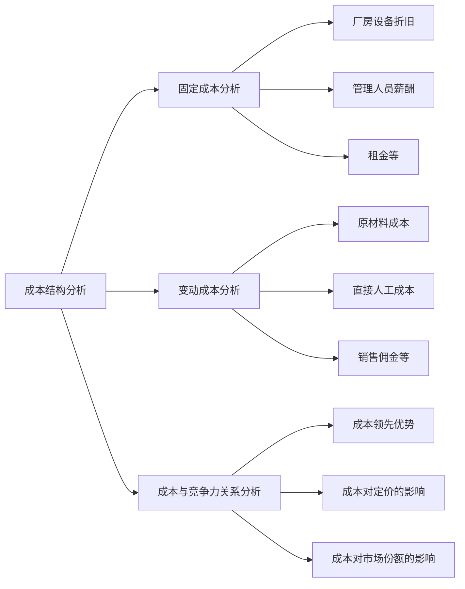

# 彼得林奇如何分析公司的成本结构

> 关键词：彼得林奇、成本结构分析、公司分析、投资策略、财务分析

> 摘要：本文深入探讨彼得林奇分析公司成本结构的方法和理念。彼得林奇作为投资界的传奇人物，其对公司成本结构的分析方式对投资者有着重要的借鉴意义。文章将详细介绍相关背景知识，阐述核心概念与联系，剖析核心算法原理和操作步骤，结合数学模型和公式进行说明，通过项目实战案例展示实际应用，探讨其在不同场景下的作用，推荐相关学习工具和资源，最后总结未来发展趋势与挑战，并解答常见问题。

## 1. 背景介绍 
### 1.1 目的和范围
本文旨在深入研究彼得林奇分析公司成本结构的方法，帮助投资者和财务分析人员更好地理解如何通过成本结构分析来评估公司的竞争力和投资价值。范围涵盖彼得林奇分析成本结构的核心概念、具体操作步骤、实际应用场景以及相关工具和资源等方面。

### 1.2 预期读者
本文预期读者包括对投资领域感兴趣的个人投资者、专业的财务分析师、金融从业者以及相关专业的学生。他们希望通过学习彼得林奇的方法来提升自己对公司财务分析和投资决策的能力。

### 1.3 文档结构概述
本文将按照以下结构展开：首先介绍核心概念与联系，让读者了解彼得林奇分析成本结构的基本原理和架构；接着阐述核心算法原理和具体操作步骤，并通过 Python 代码进行详细说明；然后介绍相关的数学模型和公式，并举例说明；再通过项目实战展示代码实际案例和详细解释；探讨实际应用场景；推荐相关的工具和资源；最后总结未来发展趋势与挑战，解答常见问题，并提供扩展阅读和参考资料。

### 1.4 术语表
#### 1.4.1 核心术语定义
- **成本结构**：指企业各项成本在总成本中所占的比重，反映了企业资源的分配和使用情况。
- **固定成本**：不随产量或销售量的变化而变化的成本，如厂房租金、设备折旧等。
- **变动成本**：随产量或销售量的变化而正比例变化的成本，如原材料成本、直接人工成本等。
- **边际成本**：每增加一单位产量所增加的成本。
- **成本领先战略**：企业通过降低成本，以低于竞争对手的价格提供产品或服务，从而获得竞争优势。

#### 1.4.2 相关概念解释
- **规模经济**：随着产量的增加，单位成本逐渐降低的现象。这是因为固定成本可以分摊到更多的产品上。
- **范围经济**：企业同时生产多种产品所带来的成本节约。例如，利用同一生产设备生产多种相关产品可以降低成本。
- **成本粘性**：成本在业务量上升时增加的幅度大于业务量下降时减少的幅度的现象。

#### 1.4.3 缩略词列表
- **EBIT**：息税前利润（Earnings Before Interest and Taxes）
- **EPS**：每股收益（Earnings Per Share）

## 2. 核心概念与联系 

### 核心概念原理
彼得林奇认为，分析公司的成本结构是评估公司竞争力和投资价值的重要环节。通过了解公司的成本构成，投资者可以判断公司是否具有成本优势，以及这种优势是否可持续。

成本结构主要分为固定成本和变动成本。固定成本在短期内相对稳定，不随产量变化而变化；变动成本则与产量直接相关。了解这两种成本的比例关系对于分析公司的经营风险和盈利能力至关重要。

例如，一家固定成本占比较高的公司，在产量增加时，由于固定成本分摊到更多的产品上，单位成本会下降，从而提高盈利能力；但在产量下降时，固定成本无法减少，单位成本会上升，经营风险较大。相反，变动成本占比较高的公司，经营风险相对较小，但在产量大幅增加时，盈利能力的提升可能相对有限。

### 架构的文本示意图
```plaintext
成本结构分析
|-- 固定成本分析
|   |-- 厂房设备折旧
|   |-- 管理人员薪酬
|   |-- 租金等
|-- 变动成本分析
|   |-- 原材料成本
|   |-- 直接人工成本
|   |-- 销售佣金等
|-- 成本与竞争力关系分析
|   |-- 成本领先优势
|   |-- 成本对定价的影响
|   |-- 成本对市场份额的影响
```

### Mermaid 流程图


## 3. 核心算法原理 & 具体操作步骤 

### 核心算法原理
彼得林奇分析公司成本结构的核心在于通过计算各项成本指标，如固定成本率、变动成本率、边际成本等，来评估公司的成本状况。

- **固定成本率**：固定成本率 = 固定成本 / 总成本。该指标反映了固定成本在总成本中所占的比重。
- **变动成本率**：变动成本率 = 变动成本 / 总成本。该指标反映了变动成本在总成本中所占的比重。
- **边际成本**：边际成本 = 总成本的变化量 / 产量的变化量。该指标用于衡量每增加一单位产量所增加的成本。

### 具体操作步骤
1. **收集数据**：从公司的财务报表中获取总成本、固定成本、变动成本和产量等数据。
2. **计算各项成本指标**：根据上述公式计算固定成本率、变动成本率和边际成本。
3. **分析成本指标**：将计算得到的成本指标与同行业其他公司进行比较，评估公司的成本优势。同时，观察成本指标随时间的变化趋势，判断公司的成本管理能力是否稳定。
4. **结合其他因素进行综合分析**：成本结构分析不能孤立进行，还需要结合公司的市场份额、产品定价、行业竞争等因素进行综合评估。

### Python 源代码实现
```python
import pandas as pd

# 假设我们有以下数据
data = {
    '年份': [2018, 2019, 2020, 2021, 2022],
    '总成本': [1000, 1200, 1300, 1400, 1500],
    '固定成本': [300, 320, 330, 340, 350],
    '变动成本': [700, 880, 970, 1060, 1150],
    '产量': [100, 120, 130, 140, 150]
}

df = pd.DataFrame(data)

# 计算固定成本率
df['固定成本率'] = df['固定成本'] / df['总成本']

# 计算变动成本率
df['变动成本率'] = df['变动成本'] / df['总成本']

# 计算边际成本
df['边际成本'] = df['总成本'].diff() / df['产量'].diff()

print(df)
```
在上述代码中，我们首先创建了一个包含总成本、固定成本、变动成本和产量的数据框。然后，根据公式计算了固定成本率、变动成本率和边际成本，并将结果添加到数据框中。最后，打印出包含所有计算结果的数据框。

## 4. 数学模型和公式 & 详细讲解 & 举例说明 

### 数学模型和公式
- **固定成本率公式**：
$$固定成本率 = \frac{固定成本}{总成本}$$
- **变动成本率公式**：
$$变动成本率 = \frac{变动成本}{总成本}$$
- **边际成本公式**：
$$边际成本 = \frac{\Delta 总成本}{\Delta 产量}$$
其中，$\Delta 总成本$ 表示总成本的变化量，$\Delta 产量$ 表示产量的变化量。

### 详细讲解
- **固定成本率**：固定成本率反映了固定成本在总成本中所占的比重。较高的固定成本率意味着公司在短期内面临较大的经营风险，因为即使产量下降，固定成本也无法立即减少。但如果公司能够实现大规模生产，固定成本可以分摊到更多的产品上，从而降低单位成本，提高盈利能力。
- **变动成本率**：变动成本率反映了变动成本在总成本中所占的比重。较高的变动成本率意味着公司的成本与产量密切相关，经营风险相对较小。但在产量大幅增加时，由于变动成本也会相应增加，盈利能力的提升可能相对有限。
- **边际成本**：边际成本用于衡量每增加一单位产量所增加的成本。如果边际成本低于产品的售价，那么增加产量可以带来额外的利润；反之，如果边际成本高于产品的售价，增加产量将导致利润减少。

### 举例说明
假设一家公司在 2022 年的总成本为 1500 万元，其中固定成本为 350 万元，变动成本为 1150 万元，产量为 150 万件。

- **固定成本率**：
$$固定成本率 = \frac{350}{1500} \approx 0.2333 = 23.33\%$$
这意味着固定成本在总成本中所占的比重约为 23.33%。
- **变动成本率**：
$$变动成本率 = \frac{1150}{1500} \approx 0.7667 = 76.67\%$$
这意味着变动成本在总成本中所占的比重约为 76.67%。
- **边际成本**：假设该公司在 2021 年的总成本为 1400 万元，产量为 140 万件。则：
$$\Delta 总成本 = 1500 - 1400 = 100（万元）$$
$$\Delta 产量 = 150 - 140 = 10（万件）$$
$$边际成本 = \frac{100}{10} = 10（元/件）$$
这意味着每增加一单位产量，成本将增加 10 元。

## 5. 项目实战：代码实际案例和详细解释说明 

### 5.1  开发环境搭建
- **Python 安装**：从 Python 官方网站（https://www.python.org/downloads/）下载并安装 Python 3.x 版本。
- **必要库安装**：使用以下命令安装所需的库：
```sh
pip install pandas
```

### 5.2  源代码详细实现和代码解读
```python
import pandas as pd

# 读取公司财务数据文件（假设为 CSV 文件）
file_path = 'company_financial_data.csv'
df = pd.read_csv(file_path)

# 数据预处理：检查缺失值并处理
if df.isnull().any().any():
    df = df.dropna()

# 计算固定成本率
df['固定成本率'] = df['固定成本'] / df['总成本']

# 计算变动成本率
df['变动成本率'] = df['变动成本'] / df['总成本']

# 计算边际成本
df['边际成本'] = df['总成本'].diff() / df['产量'].diff()

# 分析成本指标：与同行业平均水平比较
industry_avg_fixed_cost_rate = 0.2
industry_avg_variable_cost_rate = 0.7
df['固定成本率比较'] = df['固定成本率'] < industry_avg_fixed_cost_rate
df['变动成本率比较'] = df['变动成本率'] < industry_avg_variable_cost_rate

# 输出分析结果
print('成本结构分析结果：')
print(df[['年份', '固定成本率', '变动成本率', '边际成本', '固定成本率比较', '变动成本率比较']])
```

### 代码解读与分析
1. **数据读取**：使用 `pandas` 库的 `read_csv` 函数读取公司财务数据文件。
2. **数据预处理**：检查数据中是否存在缺失值，如果存在则使用 `dropna` 函数删除包含缺失值的行。
3. **成本指标计算**：根据前面介绍的公式计算固定成本率、变动成本率和边际成本。
4. **成本指标分析**：将公司的固定成本率和变动成本率与同行业平均水平进行比较，判断公司的成本优势。
5. **结果输出**：打印出包含成本指标和比较结果的数据框。

## 6. 实际应用场景 
### 投资决策
投资者可以通过分析公司的成本结构来评估公司的投资价值。如果一家公司具有较低的固定成本率和变动成本率，且边际成本较低，那么该公司可能具有成本领先优势，盈利能力较强，是一个较好的投资选择。

### 企业战略规划
企业管理者可以通过分析成本结构来制定战略规划。例如，如果公司的固定成本率较高，可以考虑通过扩大生产规模来降低单位成本；如果变动成本率较高，可以考虑优化供应链管理或提高生产效率来降低成本。

### 行业竞争分析
通过比较同行业不同公司的成本结构，可以了解各公司的竞争优势和劣势。成本领先的公司在市场竞争中具有更大的优势，可以通过降低价格来扩大市场份额。

### 成本控制与管理
企业可以通过分析成本结构，找出成本控制的关键点。例如，对于固定成本占比较高的公司，可以重点关注设备的利用率和折旧政策；对于变动成本占比较高的公司，可以重点关注原材料采购成本和生产效率。

## 7. 工具和资源推荐
### 7.1 学习资源推荐
#### 7.1.1 书籍推荐
- 《彼得林奇的成功投资》：彼得林奇的经典著作，详细介绍了他的投资理念和方法，包括如何分析公司的基本面和成本结构。
- 《财务报表分析》：全面介绍了财务报表分析的方法和技巧，对于理解公司的成本结构和财务状况有很大帮助。
- 《竞争战略》：迈克尔·波特的经典著作，阐述了企业竞争战略的基本原理和方法，对于分析公司的成本优势和竞争地位有重要参考价值。

#### 7.1.2 在线课程
- Coursera 上的“财务报表分析”课程：由知名大学教授授课，系统讲解财务报表分析的方法和应用。
- edX 上的“投资学原理”课程：介绍投资学的基本原理和方法，包括如何分析公司的财务状况和成本结构。

#### 7.1.3 技术博客和网站
- Seeking Alpha：提供大量的金融分析文章和研究报告，包括对公司成本结构的分析。
- Morningstar：提供专业的金融数据和分析工具，帮助投资者分析公司的财务状况和成本结构。

### 7.2 开发工具框架推荐
#### 7.2.1 IDE和编辑器
- PyCharm：功能强大的 Python 集成开发环境，适合开发和调试 Python 代码。
- Jupyter Notebook：交互式的开发环境，适合进行数据分析和代码演示。

#### 7.2.2 调试和性能分析工具
- pdb：Python 内置的调试工具，用于调试 Python 代码。
- cProfile：Python 内置的性能分析工具，用于分析代码的性能瓶颈。

#### 7.2.3 相关框架和库
- pandas：用于数据处理和分析的 Python 库，提供了丰富的数据结构和函数。
- numpy：用于科学计算的 Python 库，提供了高效的数组和矩阵运算功能。

### 7.3 相关论文著作推荐
#### 7.3.1 经典论文
- “The Cost Structure of Production”：由乔治·斯蒂格勒撰写，探讨了企业成本结构的基本原理和影响因素。
- “Economies of Scale and Scope in the Electric Utility Industry”：研究了电力行业的规模经济和范围经济现象。

#### 7.3.2 最新研究成果
- 关注顶级金融和管理学期刊，如《Journal of Financial Economics》、《Management Science》等，了解关于公司成本结构的最新研究成果。

#### 7.3.3 应用案例分析
- 阅读一些知名企业的案例分析报告，了解它们如何通过优化成本结构来提高竞争力和盈利能力。

## 8. 总结：未来发展趋势与挑战
### 未来发展趋势
- **数字化转型**：随着信息技术的发展，企业将越来越多地采用数字化技术来优化成本结构。例如，通过大数据分析和人工智能技术，企业可以更精准地预测成本和需求，优化生产计划和供应链管理。
- **绿色发展**：环保意识的增强将促使企业更加关注环境成本，推动企业采用更加环保和可持续的生产方式，从而影响企业的成本结构。
- **全球化竞争**：全球化的发展使得企业面临更加激烈的国际竞争，企业需要不断优化成本结构，提高成本竞争力，以应对来自全球的竞争对手。

### 挑战
- **数据质量和安全**：数字化转型需要大量的数据支持，但数据质量和安全问题可能会影响成本结构分析的准确性和可靠性。企业需要加强数据管理和安全防护，确保数据的质量和安全。
- **技术更新换代**：信息技术的快速发展使得企业需要不断更新和升级技术，以适应市场的变化。这可能会增加企业的技术成本和管理难度。
- **政策法规变化**：政府的政策法规变化可能会对企业的成本结构产生影响。例如，环保政策的加强可能会增加企业的环境成本，税收政策的调整可能会影响企业的税负。

## 9. 附录：常见问题与解答
### 问题 1：如何准确区分固定成本和变动成本？
解答：固定成本是指不随产量或销售量的变化而变化的成本，如厂房租金、设备折旧等；变动成本是指随产量或销售量的变化而正比例变化的成本，如原材料成本、直接人工成本等。在实际操作中，可以根据成本的性质和与产量的关系来判断。有些成本可能具有混合性质，需要通过一定的方法进行分解，如高低点法、回归分析法等。

### 问题 2：边际成本为负数意味着什么？
解答：边际成本为负数通常意味着随着产量的增加，总成本反而下降。这种情况可能是由于规模经济效应、成本节约措施或生产效率的大幅提高等原因导致的。但在实际中，边际成本为负数的情况比较少见，需要仔细检查数据的准确性和分析的合理性。

### 问题 3：成本结构分析是否适用于所有行业？
解答：成本结构分析适用于大多数行业，但不同行业的成本结构特点可能有所不同。例如，制造业的固定成本和变动成本相对较为明显，而服务业的成本结构可能更加复杂，需要根据具体行业的特点进行分析。在进行成本结构分析时，需要结合行业的特点和实际情况进行综合判断。

## 10. 扩展阅读 & 参考资料
- 《投资艺术》，作者：菲利普·费雪
- 《聪明的投资者》，作者：本杰明·格雷厄姆
- 财经杂志《财新》、《财经》等相关文章
- 上市公司的年报和财务报告

作者：AI天才研究院/AI Genius Institute & 禅与计算机程序设计艺术 /Zen And The Art of Computer Programming