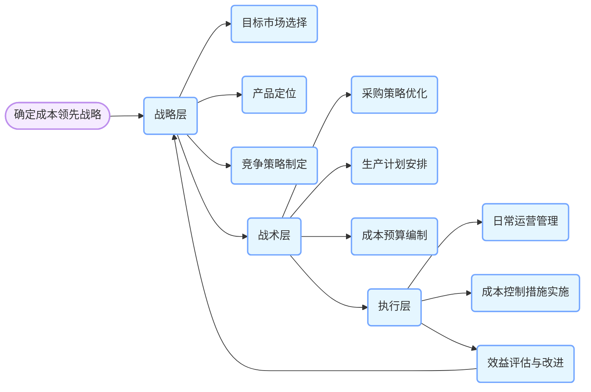

# 彼得林奇如何分析公司的成本领导力

> 关键词：彼得林奇、成本领导力、公司分析、财务指标、竞争优势

> 摘要：本文深入探讨了投资大师彼得林奇分析公司成本领导力的方法。从背景介绍入手，阐述了分析目的、预期读者、文档结构和相关术语。接着详细讲解了成本领导力的核心概念、原理及架构，通过 Python 代码阐述了核心算法原理与操作步骤，并给出了数学模型和公式及举例说明。在项目实战部分，展示了开发环境搭建、源代码实现与解读。同时介绍了成本领导力的实际应用场景，推荐了相关学习资源、开发工具和论文著作。最后总结了未来发展趋势与挑战，还提供了常见问题解答和扩展阅读参考资料，旨在帮助读者全面理解彼得林奇分析公司成本领导力的方法，为投资决策提供有力支持。

## 1. 背景介绍 
### 1.1 目的和范围
彼得林奇作为投资界的传奇人物，其投资理念和方法对投资者有着深远的影响。分析公司的成本领导力是评估公司竞争力和投资价值的重要环节。本文的目的在于深入剖析彼得林奇分析公司成本领导力的方法，帮助投资者更好地理解如何通过成本分析来判断公司在市场中的地位和潜力。范围涵盖了从理论概念到实际应用的各个方面，包括核心概念的解释、算法原理的阐述、数学模型的建立、项目实战案例的分析以及实际应用场景的探讨等。

### 1.2 预期读者
本文预期读者主要包括对投资领域感兴趣的个人投资者、金融专业学生、投资分析师以及从事企业战略研究的专业人士。对于希望学习彼得林奇投资方法并运用成本分析进行投资决策的读者，本文将提供有价值的参考和指导。

### 1.3 文档结构概述
本文将按照以下结构展开：首先介绍相关背景信息，包括目的、读者和文档结构；接着阐述成本领导力的核心概念与联系，包括原理和架构；然后详细讲解核心算法原理和具体操作步骤，并给出相应的 Python 代码；之后介绍数学模型和公式，并举例说明；再通过项目实战展示代码的实际应用和详细解释；接着探讨成本领导力的实际应用场景；推荐相关的工具和资源；最后总结未来发展趋势与挑战，提供常见问题解答和扩展阅读参考资料。

### 1.4 术语表
#### 1.4.1 核心术语定义
- **成本领导力**：指企业通过有效管理成本，使其总成本低于行业平均水平或竞争对手，从而在市场中获得竞争优势的能力。
- **规模经济**：随着生产规模的扩大，单位产品的成本逐渐降低的现象。
- **范围经济**：企业通过扩大生产经营范围，增加产品种类，使单位成本降低的经济现象。
- **固定成本**：不随产量或业务量的变化而变化的成本，如厂房租金、设备折旧等。
- **可变成本**：随产量或业务量的变化而变化的成本，如原材料成本、直接人工成本等。

#### 1.4.2 相关概念解释
- **成本驱动因素**：影响企业成本高低的各种因素，如生产技术、管理效率、采购成本等。
- **成本优势**：企业在成本方面相对于竞争对手的优势，表现为更低的成本或更高的成本效益。
- **成本控制**：企业通过采取一系列措施，对成本进行规划、核算、分析和监督，以降低成本、提高效益的过程。

#### 1.4.3 缩略词列表
- **EBITDA**：息税折旧摊销前利润，是衡量企业经营业绩的重要指标之一。
- **ROIC**：投入资本回报率，反映企业运用资本获得收益的能力。

## 2. 核心概念与联系 

### 成本领导力的原理
成本领导力的核心原理在于企业通过降低成本，提高生产效率和资源利用率，从而在市场中获得价格优势或更高的利润空间。企业可以通过多种方式实现成本领先，如优化生产流程、提高供应链管理效率、采用先进的技术和设备等。

### 成本领导力的架构
成本领导力的架构可以分为三个层次：战略层、战术层和执行层。战略层主要确定企业的成本领先战略方向，包括目标市场、产品定位和竞争策略等；战术层则负责制定具体的成本控制措施和行动计划，如采购策略、生产计划和成本预算等；执行层则是将战略和战术转化为实际行动，通过日常的运营管理来实现成本的降低和效益的提高。

### 文本示意图
```plaintext
成本领导力架构
|-- 战略层
|   |-- 目标市场选择
|   |-- 产品定位
|   |-- 竞争策略制定
|-- 战术层
|   |-- 采购策略优化
|   |-- 生产计划安排
|   |-- 成本预算编制
|-- 执行层
|   |-- 日常运营管理
|   |-- 成本控制措施实施
|   |-- 效益评估与改进
```

### Mermaid 流程图


## 3. 核心算法原理 & 具体操作步骤 

### 核心算法原理
彼得林奇分析公司成本领导力主要通过计算和比较一系列财务指标来评估公司的成本控制能力和效益。以下是一些常用的指标和算法：

#### 毛利率
毛利率是衡量企业盈利能力的重要指标之一，计算公式为：
$$毛利率 = \frac{营业收入 - 营业成本}{营业收入} \times 100\%$$
毛利率越高，说明企业在扣除成本后能够获得的利润空间越大，成本控制能力越强。

#### 净利率
净利率是衡量企业最终盈利能力的指标，计算公式为：
$$净利率 = \frac{净利润}{营业收入} \times 100\%$$
净利率反映了企业在扣除所有成本和费用后实际获得的利润水平，净利率越高，说明企业的成本管理和运营效率越好。

#### 成本费用率
成本费用率是衡量企业成本费用占营业收入比重的指标，计算公式为：
$$成本费用率 = \frac{营业成本 + 期间费用}{营业收入} \times 100\%$$
成本费用率越低，说明企业在成本和费用控制方面做得越好。

### 具体操作步骤
#### 步骤 1：收集财务数据
从公司的财务报表中收集营业收入、营业成本、期间费用、净利润等相关数据。

#### 步骤 2：计算财务指标
根据上述公式计算毛利率、净利率和成本费用率等指标。

#### 步骤 3：比较分析
将计算得到的指标与同行业其他公司进行比较，评估公司的成本领导力。同时，分析指标的变化趋势，判断公司的成本控制能力是否在不断提高。

### Python 源代码实现
```python
# 定义计算毛利率的函数
def calculate_gross_margin(revenue, cost_of_goods_sold):
    return ((revenue - cost_of_goods_sold) / revenue) * 100

# 定义计算净利率的函数
def calculate_net_profit_margin(net_income, revenue):
    return (net_income / revenue) * 100

# 定义计算成本费用率的函数
def calculate_cost_expense_ratio(cost_of_goods_sold, operating_expenses, revenue):
    return ((cost_of_goods_sold + operating_expenses) / revenue) * 100

# 示例数据
revenue = 1000000
cost_of_goods_sold = 600000
operating_expenses = 200000
net_income = 200000

# 计算各项指标
gross_margin = calculate_gross_margin(revenue, cost_of_goods_sold)
net_profit_margin = calculate_net_profit_margin(net_income, revenue)
cost_expense_ratio = calculate_cost_expense_ratio(cost_of_goods_sold, operating_expenses, revenue)

# 输出结果
print(f"毛利率: {gross_margin:.2f}%")
print(f"净利率: {net_profit_margin:.2f}%")
print(f"成本费用率: {cost_expense_ratio:.2f}%")
```

## 4. 数学模型和公式 & 详细讲解 & 举例说明 

### 数学模型和公式
除了上述提到的毛利率、净利率和成本费用率的计算公式外，还可以使用一些其他的数学模型和公式来分析公司的成本领导力。

#### 规模经济模型
规模经济模型可以用来描述产量与成本之间的关系，常见的模型是学习曲线模型。学习曲线模型认为，随着产量的增加，单位产品的成本会按照一定的比例下降。其数学公式为：
$$C_n = C_1 \times n^b$$
其中，$C_n$ 表示第 $n$ 个产品的成本，$C_1$ 表示第一个产品的成本，$n$ 表示产量，$b$ 表示学习曲线指数，$b$ 的取值范围通常在 $-0.1$ 到 $-0.4$ 之间。

#### 成本效益分析模型
成本效益分析模型可以用来评估企业的成本投入与效益产出之间的关系。常用的指标是投入资本回报率（ROIC），计算公式为：
$$ROIC = \frac{息税前利润 \times (1 - 税率)}{投入资本} \times 100\%$$
ROIC 反映了企业运用投入资本获得收益的能力，ROIC 越高，说明企业的成本效益越好。

### 详细讲解
#### 规模经济模型
规模经济模型的核心思想是随着生产规模的扩大，企业可以通过分摊固定成本、提高生产效率等方式降低单位产品的成本。学习曲线指数 $b$ 表示成本随产量下降的速度，$b$ 的绝对值越大，说明成本下降的速度越快。

#### 成本效益分析模型
成本效益分析模型通过计算 ROIC 来评估企业的成本效益。息税前利润反映了企业在扣除利息和所得税之前的盈利能力，投入资本包括股东权益和债务资本。ROIC 越高，说明企业在相同的投入下能够获得更高的收益，成本控制和运营效率越好。

### 举例说明
#### 规模经济模型举例
假设某企业生产第一个产品的成本为 $100$ 元，学习曲线指数 $b = -0.2$。当产量为 $100$ 个时，根据学习曲线模型计算第 $100$ 个产品的成本：
$$C_{100} = 100 \times 100^{-0.2} \approx 63.1$$
可以看出，随着产量的增加，单位产品的成本从 $100$ 元下降到了约 $63.1$ 元，体现了规模经济的效应。

#### 成本效益分析模型举例
假设某企业的息税前利润为 $200$ 万元，税率为 $25\%$，投入资本为 $1000$ 万元。则该企业的 ROIC 为：
$$ROIC = \frac{200 \times (1 - 25\%)}{1000} \times 100\% = 15\%$$
这意味着该企业每投入 $1$ 元资本，能够获得 $0.15$ 元的收益，成本效益较好。

## 5. 项目实战：代码实际案例和详细解释说明 

### 5.1  开发环境搭建
在进行项目实战之前，需要搭建相应的开发环境。以下是具体的步骤：

#### 步骤 1：安装 Python
从 Python 官方网站（https://www.python.org/downloads/）下载并安装 Python 3.x 版本。

#### 步骤 2：安装必要的库
使用以下命令安装所需的库：
```sh
pip install pandas numpy matplotlib
```
- `pandas`：用于数据处理和分析。
- `numpy`：用于数值计算。
- `matplotlib`：用于数据可视化。

#### 步骤 3：创建项目文件夹
在本地创建一个项目文件夹，用于存放项目代码和数据文件。

### 5.2  源代码详细实现和代码解读
以下是一个使用 Python 对公司财务数据进行分析，评估成本领导力的实际案例：

```python
import pandas as pd
import numpy as np
import matplotlib.pyplot as plt

# 读取财务数据文件
data = pd.read_csv('financial_data.csv')

# 计算毛利率、净利率和成本费用率
data['毛利率'] = ((data['营业收入'] - data['营业成本']) / data['营业收入']) * 100
data['净利率'] = (data['净利润'] / data['营业收入']) * 100
data['成本费用率'] = ((data['营业成本'] + data['期间费用']) / data['营业收入']) * 100

# 绘制毛利率、净利率和成本费用率的变化趋势图
plt.figure(figsize=(12, 8))
plt.plot(data['年份'], data['毛利率'], label='毛利率')
plt.plot(data['年份'], data['净利率'], label='净利率')
plt.plot(data['年份'], data['成本费用率'], label='成本费用率')
plt.xlabel('年份')
plt.ylabel('百分比')
plt.title('公司财务指标变化趋势')
plt.legend()
plt.grid(True)
plt.show()

# 计算各项指标的平均值
gross_margin_avg = data['毛利率'].mean()
net_profit_margin_avg = data['净利率'].mean()
cost_expense_ratio_avg = data['成本费用率'].mean()

# 输出结果
print(f"毛利率平均值: {gross_margin_avg:.2f}%")
print(f"净利率平均值: {net_profit_margin_avg:.2f}%")
print(f"成本费用率平均值: {cost_expense_ratio_avg:.2f}%")
```

### 代码解读与分析
#### 代码功能概述
该代码的主要功能是读取公司的财务数据文件，计算毛利率、净利率和成本费用率，并绘制这些指标的变化趋势图。同时，计算各项指标的平均值并输出结果。

#### 代码详细解读
1. **导入必要的库**：导入 `pandas`、`numpy` 和 `matplotlib.pyplot` 库，分别用于数据处理、数值计算和数据可视化。
2. **读取财务数据文件**：使用 `pd.read_csv` 函数读取存储在 `financial_data.csv` 文件中的财务数据。
3. **计算财务指标**：根据前面介绍的公式，计算毛利率、净利率和成本费用率，并将结果添加到数据框中。
4. **绘制变化趋势图**：使用 `plt.plot` 函数绘制毛利率、净利率和成本费用率的变化趋势图，并设置图表的标题、坐标轴标签和图例。
5. **计算指标平均值**：使用 `mean` 函数计算各项指标的平均值。
6. **输出结果**：使用 `print` 函数输出各项指标的平均值。

#### 分析结果
通过观察变化趋势图和各项指标的平均值，可以评估公司的成本领导力。如果毛利率和净利率呈现上升趋势，成本费用率呈现下降趋势，说明公司的成本控制能力在不断提高，具有较强的成本领导力。

## 6. 实际应用场景 
### 投资决策
在投资决策中，分析公司的成本领导力是评估公司投资价值的重要因素之一。具有成本领先优势的公司通常能够在市场竞争中获得更高的利润空间和市场份额，其股票价格也更有可能上涨。投资者可以通过分析公司的财务指标、成本结构和竞争优势等方面，筛选出具有成本领导力的公司进行投资。

### 企业战略规划
企业在制定战略规划时，需要考虑如何提高自身的成本领导力。通过分析成本驱动因素、优化生产流程、降低采购成本等方式，企业可以实现成本的降低和效益的提高。同时，企业还可以根据自身的成本优势，制定差异化的竞争策略，提高市场竞争力。

### 行业竞争分析
在行业竞争分析中，了解竞争对手的成本领导力可以帮助企业制定有效的竞争策略。通过比较自身与竞争对手的成本结构和财务指标，企业可以发现自身的优势和劣势，从而采取相应的措施来提高自身的竞争力。例如，如果竞争对手在成本方面具有优势，企业可以通过技术创新、提高生产效率等方式来降低成本，缩小与竞争对手的差距。

### 成本控制与管理
成本领导力的分析方法可以帮助企业进行成本控制和管理。通过对成本构成的分析，企业可以找出成本高的环节和原因，并采取相应的措施进行改进。例如，企业可以通过优化供应链管理、降低原材料采购成本、提高设备利用率等方式来降低成本。同时，企业还可以建立成本控制体系，对成本进行实时监控和管理，确保成本目标的实现。

## 7. 工具和资源推荐
### 7.1 学习资源推荐
#### 7.1.1 书籍推荐
- 《彼得·林奇的成功投资》：彼得·林奇的经典著作，详细介绍了他的投资理念和方法，包括如何分析公司的基本面和财务状况。
- 《竞争优势》：迈克尔·波特的经典著作，阐述了企业如何通过成本领先、差异化和集中化等战略获得竞争优势。
- 《财务报表分析》：全面介绍了财务报表分析的方法和技巧，帮助读者理解和解读企业的财务报表。

#### 7.1.2 在线课程
- Coursera 上的“财务分析与决策”课程：由知名教授授课，系统地介绍了财务分析的基本原理和方法。
- edX 上的“投资学原理”课程：涵盖了投资领域的基础知识和投资分析的方法，包括公司分析和估值。

#### 7.1.3 技术博客和网站
- Seeking Alpha：提供了丰富的金融分析文章和研究报告，包括对公司基本面和财务状况的分析。
- ValueWalk：专注于价值投资领域，分享了许多投资大师的观点和投资策略。

### 7.2 开发工具框架推荐
#### 7.2.1 IDE和编辑器
- PyCharm：一款功能强大的 Python 集成开发环境，提供了代码编辑、调试、版本控制等功能。
- Jupyter Notebook：一种交互式的开发环境，适合进行数据分析和可视化，支持 Python、R 等多种编程语言。

#### 7.2.2 调试和性能分析工具
- Py-Spy：一个轻量级的 Python 性能分析工具，可以帮助开发者找出代码中的性能瓶颈。
- pdb：Python 内置的调试器，可以帮助开发者调试代码中的错误。

#### 7.2.3 相关框架和库
- Pandas：用于数据处理和分析的 Python 库，提供了高效的数据结构和数据操作方法。
- Numpy：用于数值计算的 Python 库，提供了高效的数组和矩阵运算功能。
- Matplotlib：用于数据可视化的 Python 库，提供了丰富的绘图函数和工具。

### 7.3 相关论文著作推荐
#### 7.3.1 经典论文
- Porter, M. E. (1985). Competitive advantage: Creating and sustaining superior performance. Free Press. 该论文提出了竞争优势的概念和理论框架，对企业战略管理和竞争分析具有重要的指导意义。
- Kaplan, R. S., & Norton, D. P. (1992). The balanced scorecard—measures that drive performance. Harvard Business Review, 70(1), 71-79. 该论文介绍了平衡计分卡的概念和方法，为企业绩效评估和战略管理提供了一种新的思路和工具。

#### 7.3.2 最新研究成果
- 关注《Journal of Financial Economics》、《Review of Financial Studies》等金融领域的顶级学术期刊，了解关于公司成本分析和投资决策的最新研究成果。

#### 7.3.3 应用案例分析
- 可以参考一些知名企业的案例分析，如沃尔玛通过成本领先战略成为全球零售业巨头的案例，深入了解成本领导力在企业实践中的应用和效果。

## 8. 总结：未来发展趋势与挑战
### 未来发展趋势
#### 数字化转型推动成本管理创新
随着信息技术的快速发展，企业将越来越多地采用数字化手段进行成本管理。例如，通过大数据分析、人工智能和物联网等技术，企业可以实时监控成本数据，优化生产流程，降低成本。同时，数字化转型还可以提高企业的决策效率和灵活性，使企业能够更好地应对市场变化。

#### 绿色成本管理成为重要趋势
随着全球对环境保护的关注度不断提高，企业将面临越来越严格的环保法规和社会压力。因此，绿色成本管理将成为企业未来发展的重要趋势。企业需要在生产过程中采取环保措施，降低能源消耗和环境污染，同时将绿色成本纳入成本管理体系，进行全面的成本核算和分析。

#### 供应链协同降低成本
未来，企业将更加注重与供应链上下游企业的协同合作，通过优化供应链管理，降低采购成本、物流成本和库存成本。例如，企业可以与供应商建立长期稳定的合作关系，共同开展研发和创新，提高产品质量和生产效率。

### 挑战
#### 数据质量和安全问题
在数字化转型过程中，企业需要收集和处理大量的成本数据。然而，数据质量和安全问题可能会影响成本分析的准确性和可靠性。例如，数据不准确、不完整或被篡改可能会导致错误的决策。此外，数据泄露和安全漏洞也可能会给企业带来巨大的损失。

#### 技术应用难度
虽然数字化技术为成本管理提供了很多便利，但企业在应用这些技术时也面临着一定的难度。例如，大数据分析和人工智能等技术需要专业的人才和技术支持，企业可能需要投入大量的资源进行培训和研发。

#### 市场竞争加剧
随着市场竞争的加剧，企业的成本领先优势可能会受到挑战。竞争对手可能会通过技术创新、降低成本等方式来缩小与企业的差距。因此，企业需要不断地创新和优化成本管理策略，以保持竞争优势。

## 9. 附录：常见问题与解答
### 问题 1：如何判断一个公司是否具有成本领导力？
可以通过比较公司的毛利率、净利率和成本费用率等财务指标与同行业其他公司的水平来判断。如果公司的毛利率和净利率较高，成本费用率较低，说明公司在成本控制方面具有优势，可能具有成本领导力。此外，还可以分析公司的成本结构、生产效率、供应链管理等方面，了解公司降低成本的能力和潜力。

### 问题 2：成本领导力是否意味着低价格策略？
成本领导力并不一定意味着低价格策略。虽然具有成本领先优势的公司可以通过降低价格来吸引更多的客户，但这并不是唯一的竞争策略。公司也可以通过保持价格不变，提高产品质量和服务水平，从而获得更高的利润空间。此外，成本领导力还可以帮助公司在市场竞争中抵御价格战的压力，保持市场份额。

### 问题 3：如何提高公司的成本领导力？
可以从以下几个方面提高公司的成本领导力：
- 优化生产流程：通过改进生产工艺、提高设备利用率等方式，提高生产效率，降低生产成本。
- 降低采购成本：与供应商建立长期稳定的合作关系，通过批量采购、谈判等方式降低原材料采购成本。
- 提高供应链管理效率：优化供应链布局，减少库存积压，降低物流成本。
- 加强成本控制和管理：建立完善的成本控制体系，对成本进行实时监控和分析，及时发现和解决成本问题。

### 问题 4：成本领导力与差异化战略是否冲突？
成本领导力和差异化战略并不一定冲突。企业可以在实现成本领先的同时，通过提供独特的产品或服务来实现差异化。例如，企业可以通过技术创新、品牌建设等方式，在降低成本的同时提高产品的附加值，从而在市场竞争中获得优势。

## 10. 扩展阅读 & 参考资料
### 扩展阅读
- 《从0到1：开启商业与未来的秘密》：介绍了创业公司如何从无到有，实现创新和突破，其中也涉及到了成本管理和竞争策略的内容。
- 《创新者的窘境》：探讨了创新对企业的影响，以及企业如何应对创新带来的挑战，对理解企业的成本领导力和竞争优势具有一定的启示作用。

### 参考资料
- 彼得·林奇. 《彼得·林奇的成功投资》. 机械工业出版社.
- 迈克尔·波特. 《竞争优势》. 华夏出版社.
- 斯蒂芬·佩因曼. 《财务报表分析》. 中国人民大学出版社.

作者：AI天才研究院/AI Genius Institute & 禅与计算机程序设计艺术 /Zen And The Art of Computer Programming