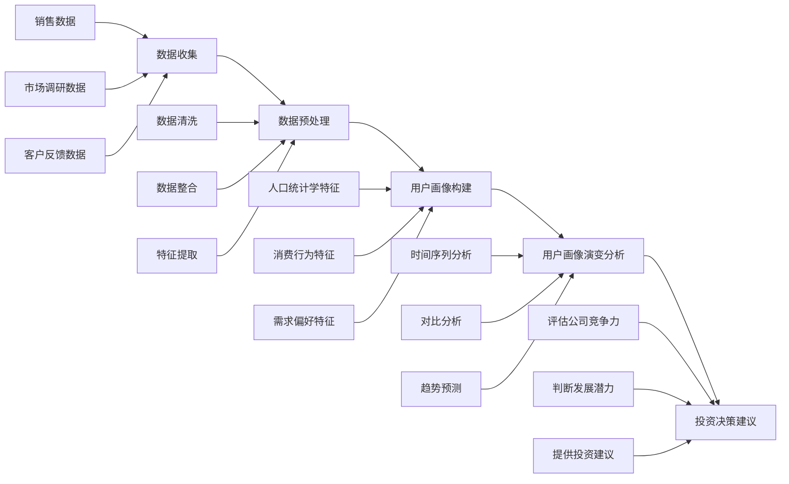

# 彼得林奇如何分析公司的用户画像演变

> 关键词：彼得林奇、公司分析、用户画像演变、投资分析、商业洞察

> 摘要：本文聚焦于彼得林奇分析公司用户画像演变的方法。通过深入探讨背景知识，阐述核心概念与联系，介绍核心算法原理和具体操作步骤，运用数学模型和公式进行详细讲解与举例说明，展示项目实战案例及代码实现，分析实际应用场景，推荐相关工具和资源，最后总结未来发展趋势与挑战，并提供常见问题解答和扩展阅读参考资料。旨在帮助读者全面理解彼得林奇的分析思路，掌握如何通过分析公司用户画像演变来洞察公司的发展态势，为投资决策和商业分析提供有力支持。

## 1. 背景介绍 
### 1.1 目的和范围
彼得林奇作为投资界的传奇人物，其投资理念和分析方法一直备受关注。分析公司的用户画像演变对于评估公司的市场竞争力、发展潜力以及投资价值具有重要意义。本文的目的在于深入剖析彼得林奇分析公司用户画像演变的方法，为投资者和商业分析师提供借鉴。范围涵盖彼得林奇分析过程中涉及的核心概念、算法原理、实际应用案例等方面。

### 1.2 预期读者
本文预期读者包括对投资分析感兴趣的个人投资者、专业金融分析师、商业研究人员以及对彼得林奇投资理念有深入研究需求的人群。

### 1.3 文档结构概述
本文首先介绍背景知识，包括目的、预期读者和文档结构。接着阐述核心概念与联系，展示相关的文本示意图和Mermaid流程图。然后讲解核心算法原理和具体操作步骤，结合Python源代码进行详细说明。之后运用数学模型和公式进行分析，并举例说明。通过项目实战案例，详细介绍开发环境搭建、源代码实现和代码解读。分析实际应用场景，推荐相关的工具和资源。最后总结未来发展趋势与挑战，提供常见问题解答和扩展阅读参考资料。

### 1.4 术语表
#### 1.4.1 核心术语定义
- **用户画像**：是指根据用户的社会属性、生活习惯、消费行为等信息抽象出的一个标签化的用户模型。
- **用户画像演变**：指随着时间推移，公司用户群体在特征、需求、行为等方面发生的变化。
- **投资价值**：指公司在未来能够为投资者带来经济回报的潜力。

#### 1.4.2 相关概念解释
- **市场细分**：将市场按照不同的特征和需求划分为若干个细分市场，以便更好地了解用户需求。
- **客户生命周期**：指客户从初次接触公司产品或服务到最终流失的整个过程。

#### 1.4.3 缩略词列表
- **ROI**：Return on Investment，投资回报率。
- **CRM**：Customer Relationship Management，客户关系管理。

## 2. 核心概念与联系 

### 核心概念原理
彼得林奇分析公司用户画像演变的核心原理在于通过对公司用户群体的深入研究，了解用户的需求、行为和特征的变化，从而判断公司的市场竞争力和发展潜力。用户画像的演变反映了公司在市场中的地位和发展趋势。例如，如果公司的用户画像从高端客户向大众客户演变，可能意味着公司正在拓展市场份额，但也可能面临品牌定位和产品质量的挑战。

### 架构的文本示意图
```plaintext
公司用户画像演变分析架构
|-- 数据收集
|   |-- 销售数据
|   |-- 市场调研数据
|   |-- 客户反馈数据
|-- 数据预处理
|   |-- 数据清洗
|   |-- 数据整合
|   |-- 特征提取
|-- 用户画像构建
|   |-- 人口统计学特征
|   |-- 消费行为特征
|   |-- 需求偏好特征
|-- 用户画像演变分析
|   |-- 时间序列分析
|   |-- 对比分析
|   |-- 趋势预测
|-- 投资决策建议
|   |-- 评估公司竞争力
|   |-- 判断发展潜力
|   |-- 提供投资建议
```

### Mermaid 流程图


## 3. 核心算法原理 & 具体操作步骤 

### 核心算法原理
在分析公司用户画像演变时，常用的算法包括时间序列分析和聚类分析。

#### 时间序列分析
时间序列分析用于研究用户画像随时间的变化趋势。常见的时间序列模型有ARIMA（Autoregressive Integrated Moving Average）模型。ARIMA模型的基本原理是通过对时间序列数据的自回归、差分和移动平均操作，来预测未来的趋势。

Python代码示例：
```python
import pandas as pd
from statsmodels.tsa.arima.model import ARIMA

# 生成示例时间序列数据
data = [10, 12, 15, 13, 16, 18, 20, 22, 25, 23]
index = pd.date_range(start='2023-01-01', periods=len(data), freq='M')
time_series = pd.Series(data, index=index)

# 拟合ARIMA模型
model = ARIMA(time_series, order=(1, 1, 1))
model_fit = model.fit()

# 预测未来值
forecast = model_fit.forecast(steps=3)
print(forecast)
```

#### 聚类分析
聚类分析用于将用户划分为不同的群体，以便更好地了解用户的特征和需求。常用的聚类算法有K-Means算法。K-Means算法的基本原理是通过迭代的方式将数据点划分到不同的簇中，使得簇内的数据点相似度最大，簇间的数据点相似度最小。

Python代码示例：
```python
import numpy as np
from sklearn.cluster import KMeans

# 生成示例数据
X = np.array([[1, 2], [1, 4], [1, 0],
              [4, 2], [4, 4], [4, 0]])

# 初始化K-Means模型
kmeans = KMeans(n_clusters=2, random_state=0)

# 拟合模型
kmeans.fit(X)

# 获取聚类标签
labels = kmeans.labels_
print(labels)
```

### 具体操作步骤
1. **数据收集**：收集公司的销售数据、市场调研数据、客户反馈数据等，这些数据可以反映用户的特征、需求和行为。
2. **数据预处理**：对收集到的数据进行清洗、整合和特征提取，以提高数据的质量和可用性。
3. **用户画像构建**：根据预处理后的数据，构建用户画像，包括人口统计学特征、消费行为特征和需求偏好特征。
4. **用户画像演变分析**：运用时间序列分析和聚类分析等算法，分析用户画像随时间的变化趋势和不同用户群体的特征。
5. **投资决策建议**：根据用户画像演变分析的结果，评估公司的竞争力和发展潜力，提供投资决策建议。

## 4. 数学模型和公式 & 详细讲解 & 举例说明 

### ARIMA模型公式
ARIMA模型的一般形式为$ARIMA(p, d, q)$，其中$p$为自回归阶数，$d$为差分阶数，$q$为移动平均阶数。其数学公式为：
$$
(1 - \sum_{i = 1}^{p} \phi_{i} B^{i})(1 - B)^{d} Y_{t} = c + (1 + \sum_{j = 1}^{q} \theta_{j} B^{j}) \epsilon_{t}
$$
其中，$Y_{t}$为时间序列数据，$\phi_{i}$为自回归系数，$\theta_{j}$为移动平均系数，$B$为滞后算子，$\epsilon_{t}$为白噪声。

### 详细讲解
- **自回归部分**：$(1 - \sum_{i = 1}^{p} \phi_{i} B^{i})$表示当前值与过去$p$个时间点的值之间的线性关系。
- **差分部分**：$(1 - B)^{d}$用于消除时间序列的非平稳性。
- **移动平均部分**：$(1 + \sum_{j = 1}^{q} \theta_{j} B^{j})$表示当前值与过去$q$个时间点的误差项之间的线性关系。

### 举例说明
假设我们有一个时间序列数据$Y_{t}$，通过观察数据发现其存在一定的自相关性和非平稳性。我们可以选择$p = 1$，$d = 1$，$q = 1$，即$ARIMA(1, 1, 1)$模型。通过拟合该模型，我们可以预测未来的时间序列值。

### K-Means算法公式
K-Means算法的目标是最小化簇内误差平方和（Within-Cluster Sum of Squares，WCSS），其数学公式为：
$$
WCSS = \sum_{i = 1}^{k} \sum_{x \in C_{i}} || x - \mu_{i} ||^{2}
$$
其中，$k$为簇的数量，$C_{i}$为第$i$个簇，$x$为簇内的数据点，$\mu_{i}$为第$i$个簇的质心。

### 详细讲解
K-Means算法通过迭代的方式不断更新簇的质心，使得WCSS最小。具体步骤如下：
1. 随机初始化$k$个质心。
2. 将每个数据点分配到距离最近的质心所在的簇。
3. 更新每个簇的质心。
4. 重复步骤2和3，直到质心不再发生变化或达到最大迭代次数。

### 举例说明
假设我们有一组二维数据点，我们希望将其划分为2个簇。通过K-Means算法，我们可以得到每个数据点所属的簇以及簇的质心。

## 5. 项目实战：代码实际案例和详细解释说明 

### 5.1  开发环境搭建
- **操作系统**：Windows、Linux或macOS。
- **Python版本**：Python 3.7及以上。
- **安装必要的库**：使用pip安装`pandas`、`statsmodels`、`scikit-learn`等库。
```bash
pip install pandas statsmodels scikit-learn
```

### 5.2  源代码详细实现和代码解读
```python
import pandas as pd
from statsmodels.tsa.arima.model import ARIMA
from sklearn.cluster import KMeans
import numpy as np

# 数据收集与预处理
# 假设我们有一个包含用户购买金额的时间序列数据
data = [100, 120, 150, 130, 160, 180, 200, 220, 250, 230]
index = pd.date_range(start='2023-01-01', periods=len(data), freq='M')
time_series = pd.Series(data, index=index)

# 时间序列分析（ARIMA模型）
model = ARIMA(time_series, order=(1, 1, 1))
model_fit = model.fit()
forecast = model_fit.forecast(steps=3)
print("时间序列预测结果：")
print(forecast)

# 假设我们有一个包含用户年龄和购买频率的二维数据
X = np.array([[20, 1], [25, 2], [30, 3],
              [35, 4], [40, 5], [45, 6]])

# 聚类分析（K-Means算法）
kmeans = KMeans(n_clusters=2, random_state=0)
kmeans.fit(X)
labels = kmeans.labels_
print("聚类标签：")
print(labels)
```

### 代码解读与分析
- **数据收集与预处理**：通过`pandas`库生成一个时间序列数据和一个二维数据，模拟用户的购买金额和年龄、购买频率信息。
- **时间序列分析**：使用`statsmodels`库中的`ARIMA`模型对时间序列数据进行拟合和预测，得到未来3个月的购买金额预测值。
- **聚类分析**：使用`scikit-learn`库中的`K-Means`算法对二维数据进行聚类，将用户划分为2个不同的群体，得到每个用户的聚类标签。

## 6. 实际应用场景 
### 投资决策
投资者可以通过分析公司用户画像的演变，评估公司的市场竞争力和发展潜力，从而做出更明智的投资决策。例如，如果公司的用户画像从高端客户向大众客户演变，可能意味着公司正在拓展市场份额，具有较大的发展潜力，投资者可以考虑增加对该公司的投资。

### 市场策略调整
公司可以根据用户画像的演变，调整市场策略。例如，如果发现用户的需求偏好发生了变化，公司可以调整产品的功能和定位，以满足用户的新需求。

### 客户关系管理
通过分析用户画像的演变，公司可以更好地了解客户的需求和行为，从而提供更个性化的服务，提高客户满意度和忠诚度。

## 7. 工具和资源推荐
### 7.1 学习资源推荐
#### 7.1.1 书籍推荐
- 《彼得林奇的成功投资》：彼得林奇的经典著作，详细介绍了他的投资理念和分析方法。
- 《统计学原理》：帮助读者了解统计学的基本概念和方法，为数据分析提供理论支持。
- 《Python数据分析实战》：介绍了Python在数据分析领域的应用，包括数据处理、可视化和建模等方面。

#### 7.1.2 在线课程
- Coursera上的“Data Science Specialization”：涵盖了数据分析的各个方面，包括统计学、机器学习和数据可视化等。
- edX上的“Python for Data Science”：专门介绍Python在数据分析中的应用。

#### 7.1.3 技术博客和网站
- Towards Data Science：提供了大量关于数据分析和机器学习的文章和教程。
- Kaggle：一个数据科学竞赛平台，上面有很多优秀的数据分析案例和代码。

### 7.2 开发工具框架推荐
#### 7.2.1 IDE和编辑器
- PyCharm：一款专业的Python集成开发环境，提供了丰富的功能和插件。
- Jupyter Notebook：一个交互式的开发环境，适合进行数据分析和模型开发。

#### 7.2.2 调试和性能分析工具
- PDB：Python自带的调试工具，可以帮助开发者定位代码中的问题。
- cProfile：Python的性能分析工具，可以分析代码的运行时间和内存使用情况。

#### 7.2.3 相关框架和库
- Pandas：用于数据处理和分析的Python库，提供了高效的数据结构和操作方法。
- Statsmodels：用于统计建模和分析的Python库，支持多种统计模型和算法。
- Scikit-learn：用于机器学习的Python库，提供了丰富的机器学习算法和工具。

### 7.3 相关论文著作推荐
#### 7.3.1 经典论文
- “A New Approach to Linear Filtering and Prediction Problems”：介绍了卡尔曼滤波算法，对时间序列分析有重要影响。
- “K-Means++: The Advantages of Careful Seeding”：提出了K-Means++算法，改进了K-Means算法的初始化问题。

#### 7.3.2 最新研究成果
- 关注顶级学术会议如KDD（Knowledge Discovery and Data Mining）、ICML（International Conference on Machine Learning）上的相关研究成果。

#### 7.3.3 应用案例分析
- 一些知名企业的数据分析案例，如亚马逊的用户画像分析、谷歌的广告投放策略等，可以通过企业的官方博客或学术论文了解。

## 8. 总结：未来发展趋势与挑战
### 未来发展趋势
- **数据驱动的决策**：随着数据量的不断增加和数据分析技术的不断发展，越来越多的公司将采用数据驱动的决策方式，通过分析用户画像的演变来制定市场策略和投资决策。
- **人工智能与机器学习的应用**：人工智能和机器学习技术将在用户画像分析中得到更广泛的应用，例如深度学习算法可以更准确地预测用户的需求和行为。
- **跨领域融合**：用户画像分析将与其他领域如市场营销、心理学等进行更深入的融合，以提供更全面的分析结果。

### 挑战
- **数据质量问题**：数据的准确性、完整性和一致性是影响用户画像分析结果的重要因素，如何保证数据质量是一个挑战。
- **隐私保护**：在收集和分析用户数据时，需要遵守相关的法律法规，保护用户的隐私。
- **算法复杂度**：随着数据分析技术的不断发展，算法的复杂度也在不断增加，如何选择合适的算法和模型是一个挑战。

## 9. 附录：常见问题与解答
### 问题1：如何确定ARIMA模型的参数$p$、$d$和$q$？
解答：可以使用网格搜索的方法，尝试不同的$p$、$d$和$q$组合，选择使模型拟合效果最好的参数。也可以使用信息准则如AIC（Akaike Information Criterion）和BIC（Bayesian Information Criterion）来选择最优参数。

### 问题2：K-Means算法中如何确定簇的数量$k$？
解答：可以使用手肘法（Elbow Method），通过绘制不同$k$值下的WCSS曲线，选择曲线斜率突然变化的点作为最优的$k$值。也可以使用轮廓系数法（Silhouette Coefficient）来评估不同$k$值下的聚类效果。

### 问题3：如何处理数据中的缺失值？
解答：可以使用均值、中位数或众数来填充缺失值，也可以使用插值方法如线性插值、样条插值等。对于缺失值较多的情况，可以考虑删除包含缺失值的样本或特征。

## 10. 扩展阅读 & 参考资料
- 《金融数据分析与挖掘》
- 《机器学习实战》
- 彼得林奇的官方网站和访谈记录
- 相关的学术期刊如《Journal of Financial Economics》《Journal of Marketing Research》

作者：AI天才研究院/AI Genius Institute & 禅与计算机程序设计艺术 /Zen And The Art of Computer Programming