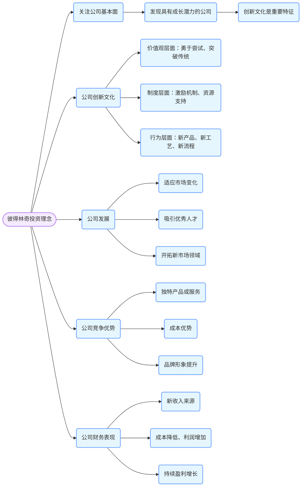

# 彼得林奇如何看待公司的创新文化

> 关键词：彼得林奇、公司创新文化、投资理念、企业发展、竞争优势、财务表现、长期价值

> 摘要：本文围绕彼得林奇对公司创新文化的看法展开探讨。彼得林奇作为投资领域的传奇人物，其投资理念深受业界推崇。公司的创新文化不仅关乎企业自身的发展与兴衰，也对投资者的决策有着重要影响。通过深入剖析彼得林奇对公司创新文化的观点，我们可以更好地理解创新文化在企业中的核心地位和价值，以及如何从投资角度评估创新文化对公司的作用，为投资者和企业管理者提供有价值的参考。

## 1. 背景介绍 
### 1.1 目的和范围
本文的主要目的是全面探究彼得林奇如何看待公司的创新文化。通过梳理彼得林奇的投资理念和相关著作，深入分析他对创新文化在公司发展、竞争优势塑造、财务表现等方面的观点和见解。范围涵盖了彼得林奇对不同行业、不同规模公司创新文化的一般性看法，以及这种看法对投资决策和企业战略的影响。

### 1.2 预期读者
预期读者包括对投资领域感兴趣的投资者，无论是专业投资者还是普通股民；企业管理者和创业者，他们可以从彼得林奇的观点中获取关于企业创新文化建设的启示；以及对商业管理和企业发展理论有研究需求的学者和研究人员。

### 1.3 文档结构概述
本文首先介绍彼得林奇的背景和其投资理念的形成，为理解他对公司创新文化的看法奠定基础。接着阐述创新文化的核心概念和重要性，以及彼得林奇眼中创新文化与公司各个方面的联系。然后深入探讨他如何评估公司的创新文化以及这种评估对投资决策的影响。之后通过实际案例分析彼得林奇所投资的具有创新文化的公司，验证其观点的可行性。最后总结彼得林奇观点的现实意义和对未来企业发展与投资的启示。

### 1.4 术语表
#### 1.4.1 核心术语定义
- **彼得林奇**：美国著名的投资家，曾任富达公司麦哲伦基金的基金经理，在其管理期间创造了辉煌的投资业绩，其投资理念和方法对全球投资者产生了深远影响。
- **公司创新文化**：指企业在长期发展过程中形成的鼓励创新、支持创新、包容失败的文化氛围和价值观体系，包括创新意识、创新机制、创新人才培养等方面。
- **投资理念**：投资者在投资过程中所遵循的基本思想和原则，包括对投资目标、投资策略、风险控制等方面的认识和看法。

#### 1.4.2 相关概念解释
- **竞争优势**：企业在市场竞争中相对于竞争对手所具有的优势，如成本优势、技术优势、品牌优势等，创新文化有助于企业形成独特的竞争优势。
- **财务表现**：企业在一定时期内的财务状况和经营成果，包括收入、利润、资产负债等指标，创新文化对企业的财务表现有着重要的影响。
- **长期价值**：企业在长期发展过程中所创造的价值，包括经济价值、社会价值等，具有创新文化的企业更有可能实现长期价值的增长。

#### 1.4.3 缩略词列表
本文无缩略词。

## 2. 核心概念与联系 

### 2.1 彼得林奇的投资理念概述
彼得林奇的投资理念以注重实地调研和对公司基本面的深入分析为核心。他强调投资者要关注自己熟悉的领域和公司，通过实地考察、与管理层交流等方式了解公司的真实情况。他认为投资不仅仅是对股票的买卖，更是对公司未来发展的一种判断。在他的投资生涯中，他善于发现那些具有成长潜力的公司，而创新文化往往是这些公司的重要特征之一。

### 2.2 公司创新文化的概念与内涵
公司创新文化是一种综合性的文化现象，它包含多个层面的内容。从价值观层面来看，创新文化强调勇于尝试、敢于突破传统的精神，鼓励员工积极提出新的想法和创意。从制度层面来看，创新文化需要有相应的激励机制和资源支持，以确保创新活动能够得到有效的开展。从行为层面来看，创新文化体现在企业的日常运营中，如不断推出新产品、改进生产工艺、优化管理流程等。

### 2.3 彼得林奇眼中创新文化与公司发展的联系
在彼得林奇看来，创新文化是公司持续发展的动力源泉。具有创新文化的公司能够不断适应市场变化，推出满足消费者需求的新产品和新服务，从而在激烈的市场竞争中占据优势。创新文化还能够吸引优秀的人才，提高员工的工作积极性和创造力，促进公司的团队建设和知识传承。此外，创新文化有助于公司开拓新的市场领域，实现业务的多元化发展，降低经营风险。

### 2.4 创新文化与公司竞争优势的关系
创新文化是公司形成竞争优势的关键因素之一。通过创新，公司可以开发出独特的产品或服务，提高产品的附加值和竞争力。例如，苹果公司以其创新的设计和技术，在智能手机市场上占据了领先地位。创新文化还可以帮助公司降低成本、提高生产效率，从而在价格竞争中取得优势。同时，创新文化能够塑造公司的品牌形象，提高品牌的知名度和美誉度，增强消费者的忠诚度。

### 2.5 创新文化与公司财务表现的联系
创新文化对公司的财务表现有着积极的影响。一方面，创新能够带来新的收入来源，如推出新产品或进入新的市场领域。另一方面，创新可以提高公司的运营效率，降低成本，从而增加利润。长期来看，具有创新文化的公司更有可能实现持续的盈利增长，提高股东的回报。例如，谷歌公司通过不断的技术创新，在搜索引擎市场上占据主导地位，其财务表现也十分出色。

### 核心概念与联系的文本示意图
```plaintext
彼得林奇投资理念
|
|--关注公司基本面
|   |
|   |--发现具有成长潜力的公司
|       |
|       |--创新文化是重要特征
|
|--公司创新文化
|   |
|   |--价值观层面：勇于尝试、突破传统
|   |
|   |--制度层面：激励机制、资源支持
|   |
|   |--行为层面：新产品、新工艺、新流程
|
|--公司发展
|   |
|   |--适应市场变化
|   |
|   |--吸引优秀人才
|   |
|   |--开拓新市场领域
|
|--公司竞争优势
|   |
|   |--独特产品或服务
|   |
|   |--成本优势
|   |
|   |--品牌形象提升
|
|--公司财务表现
|   |
|   |--新收入来源
|   |
|   |--成本降低、利润增加
|   |
|   |--持续盈利增长
```

### Mermaid 流程图


## 3. 核心算法原理 & 具体操作步骤 

### 3.1 彼得林奇评估公司创新文化的算法原理
虽然彼得林奇没有明确提出一套固定的算法来评估公司的创新文化，但我们可以从他的投资实践中总结出一些基本的原理和方法。其核心思想是通过多维度的信息收集和分析，全面了解公司的创新能力和创新氛围。具体来说，包括以下几个方面：

- **人员分析**：考察公司的管理层和员工队伍。管理层是否具有创新意识和战略眼光，是否鼓励员工创新；员工是否积极参与创新活动，是否具备创新所需的技能和知识。
- **产品与服务分析**：关注公司的产品和服务是否具有创新性。是否不断推出新产品、改进现有产品，是否能够满足消费者不断变化的需求。
- **研发投入分析**：研究公司在研发方面的投入情况。研发投入的规模、占比以及增长趋势，反映了公司对创新的重视程度和投入力度。
- **市场反馈分析**：了解市场对公司创新的认可程度。包括产品的市场份额、客户满意度、口碑等方面的信息。

### 3.2 具体操作步骤

#### 3.2.1 人员考察
- **管理层访谈**：与公司的高层管理人员进行交流，了解他们的创新战略和对创新文化的看法。询问他们在过去一段时间内推动的创新举措，以及如何激励员工创新。
- **员工调研**：通过问卷调查、小组访谈等方式，了解员工对公司创新文化的感受和参与度。询问员工是否有机会提出创新想法，公司对创新想法的支持和反馈机制如何。

#### 3.2.2 产品与服务研究
- **产品调研**：对公司的产品进行详细的调研，包括产品的功能、性能、设计等方面。与竞争对手的产品进行比较，分析公司产品的优势和创新点。
- **服务体验**：亲身体验公司的服务，了解服务的质量和创新性。例如，是否提供个性化的服务，是否利用新技术提升服务效率。

#### 3.2.3 研发投入分析
- **财务报表研究**：查阅公司的财务报表，了解研发投入的具体数据。计算研发投入占销售收入的比例，分析该比例的变化趋势。
- **研发项目跟踪**：关注公司正在进行的研发项目，了解项目的进展情况和预期成果。评估这些项目对公司未来发展的影响。

#### 3.2.4 市场反馈收集
- **市场调研**：通过市场调研机构、行业报告等渠道，收集关于公司产品和服务的市场反馈信息。了解产品的市场份额、客户满意度等指标。
- **社交媒体分析**：利用社交媒体平台，分析消费者对公司的评价和反馈。了解消费者对公司创新的看法和需求。

### 3.3 Python 源代码实现

```python
# 模拟数据
company_data = {
    "management": {
        "innovation_strategy": "积极推动创新，鼓励员工提出新想法",
        "incentive_mechanism": "设立创新奖励制度，对有突出创新成果的员工给予奖励"
    },
    "employees": {
        "innovation_participation": 0.8,  # 员工创新参与度
        "innovation_skills": 0.7  # 员工创新技能水平
    },
    "products": {
        "new_product_launch_frequency": 2,  # 每年推出新产品的数量
        "product_innovation_score": 0.8  # 产品创新得分
    },
    "R&D": {
        "investment_amount": 1000000,  # 研发投入金额
        "investment_ratio": 0.1  # 研发投入占销售收入的比例
    },
    "market": {
        "market_share": 0.2,  # 市场份额
        "customer_satisfaction": 0.9  # 客户满意度
    }
}

# 评估公司创新文化的函数
def evaluate_innovation_culture(data):
    # 人员得分
    management_score = 0.8 if data["management"]["innovation_strategy"] == "积极推动创新，鼓励员工提出新想法" else 0.5
    employee_score = (data["employees"]["innovation_participation"] + data["employees"]["innovation_skills"]) / 2
    personnel_score = (management_score + employee_score) / 2

    # 产品与服务得分
    product_score = (data["products"]["new_product_launch_frequency"] + data["products"]["product_innovation_score"]) / 2

    # 研发投入得分
    R&D_score = data["R&D"]["investment_ratio"]

    # 市场反馈得分
    market_score = (data["market"]["market_share"] + data["market"]["customer_satisfaction"]) / 2

    # 综合得分
    overall_score = (personnel_score + product_score + R&D_score + market_score) / 4

    return overall_score

# 调用函数进行评估
innovation_score = evaluate_innovation_culture(company_data)
print(f"公司的创新文化综合得分: {innovation_score}")
```

### 3.4 代码解读
- **数据模拟**：通过 `company_data` 字典模拟了公司在人员、产品与服务、研发投入、市场反馈等方面的数据。
- **评估函数**：`evaluate_innovation_culture` 函数根据上述数据计算公司创新文化的综合得分。具体步骤包括：分别计算人员、产品与服务、研发投入、市场反馈的得分，然后将这些得分取平均值得到综合得分。
- **结果输出**：调用 `evaluate_innovation_culture` 函数并输出公司的创新文化综合得分。

## 4. 数学模型和公式 & 详细讲解 & 举例说明 

### 4.1 数学模型和公式
设人员得分 $P$，产品与服务得分 $S$，研发投入得分 $R$，市场反馈得分 $M$，综合得分 $O$。

人员得分 $P$ 由管理层得分 $P_m$ 和员工得分 $P_e$ 组成，计算公式为：
$$P = \frac{P_m + P_e}{2}$$

其中，管理层得分 $P_m$ 根据管理层的创新战略和激励机制进行评估，员工得分 $P_e$ 由员工创新参与度 $I_p$ 和员工创新技能水平 $I_s$ 计算得出：
$$P_e = \frac{I_p + I_s}{2}$$

产品与服务得分 $S$ 由新产品推出频率 $N$ 和产品创新得分 $I_p$ 计算得出：
$$S = \frac{N + I_p}{2}$$

研发投入得分 $R$ 为研发投入占销售收入的比例 $r$。

市场反馈得分 $M$ 由市场份额 $S_m$ 和客户满意度 $C_s$ 计算得出：
$$M = \frac{S_m + C_s}{2}$$

综合得分 $O$ 为：
$$O = \frac{P + S + R + M}{4}$$

### 4.2 详细讲解
- **人员得分**：管理层的创新战略和激励机制对公司的创新文化起着关键作用，因此给予一定的权重。员工的创新参与度和创新技能水平反映了员工在创新活动中的实际贡献，也纳入人员得分的计算。
- **产品与服务得分**：新产品推出频率和产品创新得分体现了公司在产品和服务创新方面的能力。通过两者的平均值来评估产品与服务的创新水平。
- **研发投入得分**：研发投入占销售收入的比例直接反映了公司对创新的投入力度，因此将其作为研发投入得分。
- **市场反馈得分**：市场份额和客户满意度是衡量公司创新成果在市场上的认可度的重要指标。通过两者的平均值来评估市场反馈情况。
- **综合得分**：将人员、产品与服务、研发投入、市场反馈四个方面的得分取平均值，得到公司创新文化的综合得分，全面反映公司的创新文化水平。

### 4.3 举例说明
假设一家公司的相关数据如下：
- 管理层创新战略积极，激励机制完善，管理层得分 $P_m = 0.8$。
- 员工创新参与度 $I_p = 0.7$，员工创新技能水平 $I_s = 0.6$，则员工得分 $P_e = \frac{0.7 + 0.6}{2} = 0.65$。
- 人员得分 $P = \frac{0.8 + 0.65}{2} = 0.725$。
- 新产品推出频率 $N = 3$，产品创新得分 $I_p = 0.8$，则产品与服务得分 $S = \frac{3 + 0.8}{2} = 1.9$。
- 研发投入占销售收入的比例 $r = 0.1$，即研发投入得分 $R = 0.1$。
- 市场份额 $S_m = 0.15$，客户满意度 $C_s = 0.9$，则市场反馈得分 $M = \frac{0.15 + 0.9}{2} = 0.525$。

综合得分 $O = \frac{0.725 + 1.9 + 0.1 + 0.525}{4} = 0.8125$。

通过这个例子可以看出，通过数学模型和公式可以定量地评估公司的创新文化水平，为投资者和企业管理者提供参考。

## 5. 项目实战：代码实际案例和详细解释说明 

### 5.1  开发环境搭建
- **Python 环境**：确保已经安装 Python 3.x 版本。可以从 Python 官方网站（https://www.python.org/downloads/）下载并安装。
- **开发工具**：推荐使用 PyCharm 作为开发工具，它提供了丰富的代码编辑、调试和运行功能。可以从 JetBrains 官方网站（https://www.jetbrains.com/pycharm/download/）下载并安装。

### 5.2  源代码详细实现和代码解读

```python
# 模拟数据类
class CompanyData:
    def __init__(self, management, employees, products, R&D, market):
        self.management = management
        self.employees = employees
        self.products = products
        self.R&D = R&D
        self.market = market

# 评估公司创新文化的类
class InnovationEvaluator:
    def __init__(self, data):
        self.data = data

    def evaluate_personnel(self):
        management_score = 0.8 if self.data.management["innovation_strategy"] == "积极推动创新，鼓励员工提出新想法" else 0.5
        employee_score = (self.data.employees["innovation_participation"] + self.data.employees["innovation_skills"]) / 2
        return (management_score + employee_score) / 2

    def evaluate_products(self):
        return (self.data.products["new_product_launch_frequency"] + self.data.products["product_innovation_score"]) / 2

    def evaluate_R&D(self):
        return self.data.R&D["investment_ratio"]

    def evaluate_market(self):
        return (self.data.market["market_share"] + self.data.market["customer_satisfaction"]) / 2

    def evaluate_overall(self):
        personnel_score = self.evaluate_personnel()
        product_score = self.evaluate_products()
        R&D_score = self.evaluate_R&D()
        market_score = self.evaluate_market()
        return (personnel_score + product_score + R&D_score + market_score) / 4

# 主程序
if __name__ == "__main__":
    # 模拟数据
    management_data = {
        "innovation_strategy": "积极推动创新，鼓励员工提出新想法",
        "incentive_mechanism": "设立创新奖励制度，对有突出创新成果的员工给予奖励"
    }
    employees_data = {
        "innovation_participation": 0.8,
        "innovation_skills": 0.7
    }
    products_data = {
        "new_product_launch_frequency": 2,
        "product_innovation_score": 0.8
    }
    R&D_data = {
        "investment_amount": 1000000,
        "investment_ratio": 0.1
    }
    market_data = {
        "market_share": 0.2,
        "customer_satisfaction": 0.9
    }

    company_data = CompanyData(management_data, employees_data, products_data, R&D_data, market_data)
    evaluator = InnovationEvaluator(company_data)
    innovation_score = evaluator.evaluate_overall()
    print(f"公司的创新文化综合得分: {innovation_score}")
```

### 5.3  代码解读与分析
- **数据类**：`CompanyData` 类用于封装公司在人员、产品与服务、研发投入、市场反馈等方面的数据，提高代码的可维护性和可扩展性。
- **评估类**：`InnovationEvaluator` 类包含多个方法，分别用于计算人员、产品与服务、研发投入、市场反馈的得分，以及最终的综合得分。
- **主程序**：在主程序中，首先创建模拟数据，然后实例化 `CompanyData` 类和 `InnovationEvaluator` 类，最后调用 `evaluate_overall` 方法计算公司的创新文化综合得分并输出结果。

通过这种面向对象的编程方式，代码结构更加清晰，易于理解和维护。同时，方便对代码进行扩展和修改，例如可以添加更多的评估指标或修改评估方法。

## 6. 实际应用场景 
### 6.1 投资决策
对于投资者来说，彼得林奇对公司创新文化的看法具有重要的指导意义。在选择投资标的时，投资者可以参考彼得林奇的方法，评估公司的创新文化水平。具有创新文化的公司往往具有更大的成长潜力和竞争优势，能够为投资者带来更高的回报。例如，当投资者考虑投资科技公司时，可以关注公司的研发投入、新产品推出频率、员工创新氛围等因素，判断公司是否具有创新文化，从而做出更明智的投资决策。

### 6.2 企业战略制定
企业管理者可以从彼得林奇的观点中获取关于创新文化建设的启示，将创新文化纳入企业的战略规划中。通过营造良好的创新文化氛围，激励员工创新，推动企业的持续发展。例如，企业可以设立创新奖励制度，鼓励员工提出新的想法和创意；加强与高校、科研机构的合作，引进创新人才和技术；加大研发投入，不断推出新产品和新服务，提高企业的核心竞争力。

### 6.3 行业竞争分析
在行业竞争分析中，创新文化可以作为评估企业竞争力的重要指标之一。通过比较不同企业的创新文化水平，了解行业内的竞争格局和发展趋势。具有创新文化的企业往往能够在行业中脱颖而出，引领行业的发展方向。例如，在智能手机行业，苹果公司以其创新的设计和技术，成为行业的领导者，其他企业纷纷效仿其创新模式，推动了整个行业的发展。

### 6.4 人才招聘与培养
创新文化对于企业的人才招聘和培养具有重要的影响。具有创新文化的企业能够吸引更多优秀的人才，因为这些人才更愿意在一个鼓励创新、支持创新的环境中工作。企业可以通过宣传自身的创新文化，吸引具有创新精神和创新能力的人才加入。同时，企业可以在内部培养员工的创新能力，通过培训、项目实践等方式，提高员工的创新素质。

## 7. 工具和资源推荐
### 7.1 学习资源推荐
#### 7.1.1 书籍推荐
- 《彼得林奇的成功投资》：彼得林奇的经典著作，详细介绍了他的投资理念和方法，包括如何发现具有成长潜力的公司，如何评估公司的基本面等内容。
- 《创新者的窘境》：克莱顿·克里斯坦森的著作，探讨了创新在企业发展中的重要性，以及企业如何应对创新带来的挑战。
- 《从0到1》：彼得·蒂尔的著作，阐述了创业公司如何实现从无到有的创新，对创新文化的建设具有重要的启示意义。

#### 7.1.2 在线课程
- Coursera 平台上的“创新创业管理”课程：由知名高校的教授授课，系统介绍了创新创业的理论和实践，包括创新文化的建设、创新战略的制定等内容。
- edX 平台上的“投资学原理”课程：深入讲解了投资的基本原理和方法，结合实际案例分析，帮助学习者掌握投资决策的技巧。

#### 7.1.3 技术博客和网站
- 雪球网：国内知名的投资社区，汇聚了众多投资者和投资专家，分享投资经验和观点，同时也有关于企业创新文化的讨论和分析。
- 36氪：专注于创业和创新领域的媒体平台，提供最新的创业资讯、创新案例和行业分析，对了解创新文化在企业中的应用具有参考价值。

### 7.2 开发工具框架推荐
#### 7.2.1 IDE和编辑器
- PyCharm：功能强大的 Python 集成开发环境，提供代码编辑、调试、运行等功能，适合 Python 开发者使用。
- Visual Studio Code：轻量级的代码编辑器，支持多种编程语言，具有丰富的插件生态系统，方便开发者进行开发和调试。

#### 7.2.2 调试和性能分析工具
- PDB：Python 自带的调试工具，能够帮助开发者定位代码中的问题，进行单步调试和变量查看。
- cProfile：Python 的性能分析工具，能够分析代码的执行时间和函数调用情况，帮助开发者优化代码性能。

#### 7.2.3 相关框架和库
- Pandas：Python 的数据处理库，提供了高效的数据结构和数据操作方法，适合用于处理和分析公司的财务数据、市场数据等。
- Matplotlib：Python 的绘图库，能够绘制各种类型的图表，帮助开发者直观地展示数据和分析结果。

### 7.3 相关论文著作推荐
#### 7.3.1 经典论文
- “The Innovator's Dilemma: When New Technologies Cause Great Firms to Fail”：克莱顿·克里斯坦森的经典论文，提出了“创新者的窘境”理论，对企业创新和发展具有重要的影响。
- “Schumpeterian Competition in the Global Economy: Firm Strategy, Technology, and Government Policy”：探讨了熊彼特式竞争在全球经济中的作用，以及企业战略、技术和政府政策之间的关系。

#### 7.3.2 最新研究成果
- 关注顶级学术期刊，如《管理世界》《哈佛商业评论》等，获取关于企业创新文化、投资理论等方面的最新研究成果。
- 参加国际学术会议，如战略管理学会年会（SMS）、美国管理学会年会（AOM）等，了解学术界的前沿研究动态。

#### 7.3.3 应用案例分析
- 研究知名企业的创新案例，如苹果公司、谷歌公司、特斯拉公司等，分析它们的创新文化建设、创新战略实施和创新成果取得的经验和教训。
- 参考咨询公司的研究报告，如麦肯锡、波士顿咨询等，获取关于企业创新和发展的案例分析和行业洞察。

## 8. 总结：未来发展趋势与挑战
### 8.1 未来发展趋势
- **创新文化的重要性日益凸显**：随着科技的快速发展和市场竞争的加剧，创新文化将成为企业生存和发展的关键因素。未来，具有创新文化的企业将更容易适应市场变化，抓住发展机遇，实现可持续发展。
- **跨领域创新将成为主流**：未来的创新将不再局限于单一领域，而是跨领域、跨学科的融合创新。企业需要打破传统的思维模式和组织架构，促进不同领域之间的交流与合作，推动创新文化的发展。
- **数字化创新将加速发展**：随着数字化技术的不断进步，企业将更多地利用大数据、人工智能、物联网等技术进行创新。数字化创新将提高企业的创新效率和创新质量，为企业带来新的发展机遇。

### 8.2 挑战
- **创新文化建设难度大**：创新文化的建设需要长期的努力和投入，涉及到企业的价值观、制度、文化等多个方面。企业需要克服传统观念的束缚，建立有效的激励机制和创新平台，营造良好的创新氛围，这对企业的管理能力和组织能力提出了很高的要求。
- **创新风险难以控制**：创新本身具有不确定性和风险性，企业在创新过程中可能面临技术失败、市场失败等风险。如何有效地控制创新风险，提高创新成功率，是企业面临的一大挑战。
- **人才短缺**：创新需要大量具有创新精神和创新能力的人才。然而，目前市场上创新人才短缺，企业之间对创新人才的竞争激烈。如何吸引和留住创新人才，是企业需要解决的重要问题。

## 9. 附录：常见问题与解答
### 9.1 如何判断一个公司是否具有创新文化？
可以从多个方面进行判断，如公司的管理层是否具有创新意识和战略眼光，是否鼓励员工创新；员工是否积极参与创新活动，是否具备创新所需的技能和知识；公司的产品和服务是否具有创新性，是否不断推出新产品、改进现有产品；公司在研发方面的投入情况，研发投入的规模、占比以及增长趋势；市场对公司创新的认可程度，包括产品的市场份额、客户满意度、口碑等方面的信息。

### 9.2 创新文化对公司的财务表现有多大影响？
创新文化对公司的财务表现有着积极的影响。一方面，创新能够带来新的收入来源，如推出新产品或进入新的市场领域。另一方面，创新可以提高公司的运营效率，降低成本，从而增加利润。长期来看，具有创新文化的公司更有可能实现持续的盈利增长，提高股东的回报。但具体的影响程度因公司所处的行业、市场环境等因素而异。

### 9.3 企业如何建设创新文化？
企业可以从以下几个方面建设创新文化：一是树立创新的价值观，鼓励员工勇于尝试、敢于突破传统；二是建立有效的激励机制，对有创新成果的员工给予奖励和认可；三是提供创新的资源和平台，如设立研发中心、创新实验室等；四是加强员工培训，提高员工的创新技能和知识水平；五是营造开放、包容的文化氛围，鼓励员工之间的交流与合作。

### 9.4 创新文化与企业文化有什么关系？
创新文化是企业文化的重要组成部分。企业文化是企业在长期发展过程中形成的价值观、行为准则、企业精神等的总和，而创新文化则强调在企业文化中融入创新的元素和理念。创新文化能够推动企业文化的发展和变革，使企业文化更具活力和竞争力；同时，企业文化也为创新文化的建设提供了土壤和支撑，促进创新文化的落地和实施。

## 10. 扩展阅读 & 参考资料
- 彼得林奇. 《彼得林奇的成功投资》. 机械工业出版社.
- 克莱顿·克里斯坦森. 《创新者的窘境》. 中信出版社.
- 彼得·蒂尔. 《从0到1》. 中信出版社.
- 雪球网：https://xueqiu.com/
- 36氪：https://36kr.com/
- Coursera 平台：https://www.coursera.org/
- edX 平台：https://www.edx.org/

作者：AI天才研究院/AI Genius Institute & 禅与计算机程序设计艺术 /Zen And The Art of Computer Programming