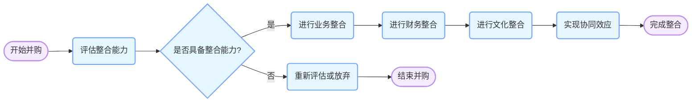

# 彼得林奇如何看待公司的并购整合能力

> 关键词：彼得林奇、公司并购整合能力、投资分析、企业成长、协同效应

> 摘要：本文深入探讨彼得林奇对于公司并购整合能力的看法。彼得林奇作为投资界的传奇人物，其投资理念对众多投资者影响深远。公司的并购整合能力在企业发展过程中至关重要，它不仅关系到企业的规模扩张，更影响着企业的长期盈利能力和市场竞争力。文章将从背景介绍入手，阐述相关核心概念，剖析核心算法原理（在投资分析情境下模拟相关逻辑），引入数学模型和公式进行说明，通过项目实战案例详细解读，分析实际应用场景，推荐相关工具和资源，最后总结未来发展趋势与挑战，并对常见问题进行解答，旨在为投资者和企业管理者全面理解公司并购整合能力提供有价值的参考。

## 1. 背景介绍 
### 1.1 目的和范围
本文的主要目的是深入研究彼得林奇对公司并购整合能力的观点，并将其观点应用到实际的投资分析和企业管理决策中。范围涵盖了彼得林奇投资理念中与并购整合能力相关的各个方面，包括对并购目的、整合效果的评估，以及并购整合能力对公司价值和股价的影响等。通过对这些内容的研究，帮助投资者更好地筛选具有投资价值的公司，同时也为企业管理者提供提升并购整合能力的思路。

### 1.2 预期读者
本文预期读者主要包括投资者，无论是个人投资者还是机构投资者，都可以从彼得林奇的观点中获取投资决策的参考。企业管理者也能从本文中学习到如何评估和提升公司的并购整合能力，以实现企业的战略目标。此外，对金融投资和企业管理感兴趣的学生和研究人员也可以通过本文深入了解相关领域的知识。

### 1.3 文档结构概述
本文首先介绍了与彼得林奇以及公司并购整合能力相关的背景知识，包括目的、预期读者和文档结构。接着阐述了核心概念，通过文本示意图和 Mermaid 流程图展示并购整合的原理和架构。然后详细讲解核心算法原理，并用 Python 代码进行示例。随后引入数学模型和公式，通过具体例子进行说明。在项目实战部分，展示了代码实际案例并进行详细解释。之后分析了公司并购整合能力的实际应用场景。接着推荐了学习资源、开发工具框架和相关论文著作。最后总结了未来发展趋势与挑战，解答了常见问题，并提供了扩展阅读和参考资料。

### 1.4 术语表
#### 1.4.1 核心术语定义
- **彼得林奇**：美国著名的投资家，曾任富达公司麦哲伦基金的基金经理，以其卓越的投资业绩和独特的投资理念闻名于世。
- **公司并购整合能力**：指公司在完成并购交易后，将被并购企业的资源、业务、文化等与自身进行有效融合，实现协同效应，提升企业整体价值的能力。
- **协同效应**：指并购后企业整体价值大于并购前各企业价值之和的效应，包括经营协同、财务协同和管理协同等。
- **投资分析**：对投资对象的财务状况、经营业绩、市场前景等进行评估，以确定投资价值和风险的过程。

#### 1.4.2 相关概念解释
- **横向并购**：指生产同类产品或提供同类服务的企业之间的并购，目的是扩大市场份额，实现规模经济。
- **纵向并购**：指处于产业链上下游的企业之间的并购，目的是实现产业链的整合，降低交易成本。
- **混合并购**：指不同行业、不同业务的企业之间的并购，目的是实现多元化经营，分散风险。

#### 1.4.3 缩略词列表
- **EPS**：Earnings Per Share，每股收益，反映公司盈利能力的重要指标。
- **ROE**：Return on Equity，净资产收益率，衡量公司运用自有资本的效率。

## 2. 核心概念与联系 

### 核心概念原理
彼得林奇认为，公司的并购整合能力是影响企业长期发展和投资价值的关键因素之一。并购是企业实现快速扩张和多元化经营的重要手段，但只有具备强大的整合能力，才能将并购的潜在价值转化为实际的经济效益。

从原理上讲，并购整合涉及到多个方面的融合。在业务层面，需要将被并购企业的产品线、销售渠道、客户资源等与自身进行整合，实现协同效应，提高市场竞争力。在财务层面，要对双方的财务状况进行合理调整，优化资本结构，降低财务风险。在文化层面，要解决不同企业文化之间的冲突，营造统一的企业价值观和工作氛围。

### 架构的文本示意图
```plaintext
公司并购整合能力
|-- 业务整合
|   |-- 产品线整合
|   |-- 销售渠道整合
|   |-- 客户资源整合
|-- 财务整合
|   |-- 财务报表合并
|   |-- 资本结构优化
|   |-- 成本控制
|-- 文化整合
|   |-- 价值观融合
|   |-- 管理制度统一
|   |-- 员工关系协调
```

### Mermaid 流程图


## 3. 核心算法原理 & 具体操作步骤 

### 核心算法原理
在投资分析中，我们可以通过一些指标来评估公司的并购整合能力。其中一个重要的指标是并购后企业的业绩增长情况。我们可以通过计算并购前后企业的每股收益（EPS）、净资产收益率（ROE）等指标的变化来评估整合效果。

以下是一个简单的算法思路：
1. 收集并购前目标公司和并购方的财务数据，包括 EPS 和 ROE。
2. 收集并购后一定时期内（如 1 - 3 年）合并后公司的财务数据，同样包括 EPS 和 ROE。
3. 计算并购前后 EPS 和 ROE 的变化率：
    - EPS 变化率 = (并购后 EPS - 并购前 EPS) / 并购前 EPS
    - ROE 变化率 = (并购后 ROE - 并购前 ROE) / 并购前 ROE
4. 根据变化率评估整合效果：
    - 如果 EPS 和 ROE 变化率为正且较大，说明整合效果较好，公司的并购整合能力较强。
    - 如果变化率为负或较小，说明整合效果不佳，公司的并购整合能力可能存在问题。

### 具体操作步骤
1. **数据收集**：从金融数据库（如 Wind、Bloomberg 等）或公司年报中获取并购前后的财务数据。
2. **数据处理**：将数据整理成适合计算的格式，确保数据的准确性和一致性。
3. **计算指标变化率**：使用上述公式计算 EPS 和 ROE 的变化率。
4. **结果分析**：根据计算结果评估公司的并购整合能力，并结合其他因素进行综合判断。

### Python 源代码实现
```python
# 假设我们已经获取了并购前后的 EPS 和 ROE 数据
pre_eps = 2.0
post_eps = 2.5
pre_roe = 0.15
post_roe = 0.2

# 计算 EPS 变化率
eps_change_rate = (post_eps - pre_eps) / pre_eps

# 计算 ROE 变化率
roe_change_rate = (post_roe - pre_roe) / pre_roe

# 输出结果
print(f"EPS 变化率: {eps_change_rate * 100:.2f}%")
print(f"ROE 变化率: {roe_change_rate * 100:.2f}%")

# 根据变化率评估整合效果
if eps_change_rate > 0 and roe_change_rate > 0:
    print("整合效果较好，公司并购整合能力较强。")
else:
    print("整合效果不佳，公司并购整合能力可能存在问题。")
```

## 4. 数学模型和公式 & 详细讲解 & 举例说明 

### 数学模型和公式
#### 1. 每股收益（EPS）变化率公式
$$EPS_{变化率}=\frac{EPS_{并购后}-EPS_{并购前}}{EPS_{并购前}}$$

#### 2. 净资产收益率（ROE）变化率公式
$$ROE_{变化率}=\frac{ROE_{并购后}-ROE_{并购前}}{ROE_{并购前}}$$

### 详细讲解
- **每股收益（EPS）变化率**：EPS 反映了公司普通股股东每股所能享有的利润。EPS 变化率衡量了并购后公司盈利能力相对于并购前的变化情况。如果 EPS 变化率为正，说明并购后公司的盈利能力有所提升；反之，则说明盈利能力下降。
- **净资产收益率（ROE）变化率**：ROE 衡量了公司运用自有资本的效率。ROE 变化率反映了并购后公司自有资本运营效率的变化。如果 ROE 变化率为正，说明并购后公司的自有资本运营效率提高；反之，则说明效率降低。

### 举例说明
假设公司 A 在并购前的 EPS 为 1.5 元，ROE 为 12%。并购公司 B 后，经过一年的整合，合并后公司的 EPS 变为 1.8 元，ROE 变为 15%。

- **计算 EPS 变化率**：
$$EPS_{变化率}=\frac{1.8 - 1.5}{1.5}=0.2 = 20\%$$
这表明并购后公司的每股收益增长了 20%，盈利能力有所提升。

- **计算 ROE 变化率**：
$$ROE_{变化率}=\frac{0.15 - 0.12}{0.12}=0.25 = 25\%$$
这说明并购后公司的净资产收益率增长了 25%，自有资本运营效率提高。

综合来看，该公司的并购整合效果较好，公司的并购整合能力较强。

## 5. 项目实战：代码实际案例和详细解释说明 

### 5.1  开发环境搭建
- **Python 安装**：从 Python 官方网站（https://www.python.org/downloads/）下载并安装 Python 3.x 版本。
- **第三方库安装**：使用 pip 命令安装所需的第三方库，如 pandas、numpy 等。
```bash
pip install pandas numpy
```

### 5.2  源代码详细实现和代码解读
```python
import pandas as pd
import numpy as np

# 模拟并购前后的财务数据
data = {
    '公司': ['A', 'A（并购后）'],
    'EPS': [1.5, 1.8],
    'ROE': [0.12, 0.15]
}

# 创建 DataFrame
df = pd.DataFrame(data)

# 提取并购前和并购后的 EPS 和 ROE
pre_eps = df[df['公司'] == 'A']['EPS'].values[0]
post_eps = df[df['公司'] == 'A（并购后）']['EPS'].values[0]
pre_roe = df[df['公司'] == 'A']['ROE'].values[0]
post_roe = df[df['公司'] == 'A（并购后）']['ROE'].values[0]

# 计算 EPS 变化率
eps_change_rate = (post_eps - pre_eps) / pre_eps

# 计算 ROE 变化率
roe_change_rate = (post_roe - pre_roe) / pre_roe

# 输出结果
print(f"EPS 变化率: {eps_change_rate * 100:.2f}%")
print(f"ROE 变化率: {roe_change_rate * 100:.2f}%")

# 根据变化率评估整合效果
if eps_change_rate > 0 and roe_change_rate > 0:
    print("整合效果较好，公司并购整合能力较强。")
else:
    print("整合效果不佳，公司并购整合能力可能存在问题。")
```

### 代码解读与分析
1. **数据模拟**：使用字典 `data` 模拟并购前后公司的财务数据，包括 EPS 和 ROE。
2. **创建 DataFrame**：使用 `pandas` 库的 `DataFrame` 函数将字典数据转换为 DataFrame 格式，方便数据处理和分析。
3. **数据提取**：通过条件筛选从 DataFrame 中提取并购前和并购后的 EPS 和 ROE 数据。
4. **指标计算**：根据前面介绍的公式计算 EPS 变化率和 ROE 变化率。
5. **结果输出与评估**：将计算结果输出，并根据变化率判断整合效果，评估公司的并购整合能力。

## 6. 实际应用场景 
### 投资者选股
投资者在选择股票时，可以将公司的并购整合能力作为重要的参考因素。通过分析公司历史上的并购案例，评估其整合效果和能力，选择那些并购整合能力较强、能够实现协同效应和业绩增长的公司进行投资。例如，一些大型企业通过成功的并购整合，不断扩大市场份额，提升盈利能力，其股价也往往会有较好的表现。

### 企业战略决策
企业在制定战略规划时，需要考虑自身的并购整合能力。如果企业具备较强的整合能力，可以通过并购实现快速扩张和多元化经营，进入新的市场和领域。反之，如果企业整合能力不足，盲目进行并购可能会带来一系列问题，如业务冲突、财务风险增加等。因此，企业需要对自身的整合能力进行客观评估，谨慎选择并购目标和时机。

### 行业整合与竞争
在一些行业中，并购整合是实现行业集中和优化资源配置的重要手段。具备较强并购整合能力的企业可以在行业整合过程中占据优势地位，通过并购竞争对手或上下游企业，提高市场份额，增强竞争力。例如，在钢铁、汽车等行业，大型企业通过并购重组，实现了规模经济和产业升级。

## 7. 工具和资源推荐
### 7.1 学习资源推荐
#### 7.1.1 书籍推荐
- 《彼得·林奇的成功投资》：彼得林奇的经典著作，详细阐述了他的投资理念和方法，包括如何分析公司的基本面和并购整合能力。
- 《并购之王：KKR 的投资传奇》：介绍了全球知名私募股权投资机构 KKR 的并购投资案例和经验，对于理解企业并购整合具有重要参考价值。
- 《公司金融》：全面介绍了公司金融的理论和实践，包括并购、融资等内容，有助于深入理解并购整合的财务原理。

#### 7.1.2 在线课程
- Coursera 平台上的“Corporate Finance”（公司金融）课程：由知名大学教授授课，系统讲解公司金融的知识和技能，包括并购估值和整合策略。
- edX 平台上的“Mergers and Acquisitions”（并购与收购）课程：深入探讨并购的各个环节，包括交易结构设计、整合管理等。

#### 7.1.3 技术博客和网站
- Seeking Alpha：提供专业的金融分析和投资建议，包括对公司并购整合情况的分析和评论。
- Bloomberg Terminal：全球领先的金融信息服务平台，提供丰富的公司财务数据和并购新闻，有助于实时跟踪市场动态。

### 7.2 开发工具框架推荐
#### 7.2.1 IDE和编辑器
- PyCharm：功能强大的 Python 集成开发环境，支持代码编辑、调试、版本控制等功能，适合开发金融分析相关的 Python 代码。
- Jupyter Notebook：交互式的开发环境，方便进行数据探索、模型验证和代码演示，常用于金融数据分析和可视化。

#### 7.2.2 调试和性能分析工具
- pdb：Python 内置的调试器，可用于调试 Python 代码，帮助定位和解决代码中的问题。
- cProfile：Python 标准库中的性能分析工具，可用于分析代码的执行时间和资源消耗情况，优化代码性能。

#### 7.2.3 相关框架和库
- pandas：强大的数据处理和分析库，提供了丰富的数据结构和函数，方便进行金融数据的处理和分析。
- numpy：高性能的数值计算库，用于处理大规模数组和矩阵运算，在金融模型计算中广泛应用。

### 7.3 相关论文著作推荐
#### 7.3.1 经典论文
- “The Hubris Hypothesis of Corporate Takeovers”（企业并购的傲慢假说）：由 Richard Roll 提出，探讨了企业并购中管理层过度自信对并购决策和整合效果的影响。
- “Do Mergers Increase Corporate Efficiency?”（并购是否提高企业效率？）：研究了并购对企业效率和绩效的影响，为评估并购整合效果提供了理论基础。

#### 7.3.2 最新研究成果
- 近年来，学术界对于企业并购整合的研究不断深入，涉及到文化整合、数字化整合等新的领域。可以通过学术数据库（如知网、万方、Web of Science 等）搜索相关的最新研究论文。

#### 7.3.3 应用案例分析
- 一些商业杂志（如《哈佛商业评论》、《麦肯锡季刊》等）会刊登企业并购整合的实际案例分析，通过这些案例可以学习到不同企业在并购整合过程中的成功经验和失败教训。

## 8. 总结：未来发展趋势与挑战
### 未来发展趋势
- **数字化整合成为关键**：随着信息技术的快速发展，企业在并购整合过程中越来越注重数字化转型和整合。通过数字化技术，可以实现业务流程的优化、数据的共享和协同工作的提升，提高整合效率和效果。
- **跨境并购整合增加**：经济全球化的趋势下，企业的跨境并购活动将不断增加。跨境并购整合面临着不同国家和地区的法律、文化、市场等差异，需要企业具备更强的跨文化管理和国际运营能力。
- **战略协同更加注重创新**：未来的并购整合将更加注重战略协同和创新能力的提升。企业通过并购获取新技术、新业务和创新团队，实现技术创新和业务模式创新，以适应市场的快速变化。

### 挑战
- **文化冲突难以解决**：不同企业之间的文化差异是并购整合过程中面临的最大挑战之一。文化冲突可能导致员工士气低落、团队协作不畅等问题，影响整合效果。如何解决文化冲突，实现文化融合，是企业需要面对的重要课题。
- **整合成本高**：并购整合需要投入大量的人力、物力和财力，包括人员安置、业务调整、系统升级等方面的成本。如果整合成本过高，可能会影响企业的盈利能力和财务状况。
- **监管政策不确定性**：并购活动受到政府监管政策的影响较大。监管政策的变化可能会导致并购交易的审批难度增加、交易成本上升等问题，给企业的并购整合带来不确定性。

## 9. 附录：常见问题与解答
### 问题 1：如何判断公司的并购整合能力是否真的强？
解答：可以从多个方面进行判断。首先，通过分析并购前后公司的财务指标（如 EPS、ROE 等）的变化来评估整合效果。其次，观察公司在并购后的业务发展情况，包括市场份额的变化、新产品的推出等。此外，还可以了解公司的管理团队在整合过程中的表现和经验。

### 问题 2：并购整合失败的原因有哪些？
解答：并购整合失败的原因主要包括文化冲突、战略不匹配、整合计划不完善、管理不善等。文化冲突可能导致员工之间的沟通障碍和团队协作问题；战略不匹配可能使并购后的业务无法实现协同效应；整合计划不完善可能导致整合过程混乱，效率低下；管理不善可能无法有效地协调各方资源，解决整合过程中出现的问题。

### 问题 3：企业在并购整合过程中如何降低风险？
解答：企业可以采取以下措施降低并购整合风险。首先，在并购前进行充分的尽职调查，了解目标公司的财务状况、业务情况、文化背景等，确保并购目标与自身战略相匹配。其次，制定详细的整合计划，明确整合的目标、步骤和时间节点。此外，加强与员工的沟通和培训，提高员工对整合的认识和参与度，减少文化冲突的影响。

## 10. 扩展阅读 & 参考资料
- 《金融炼金术》，乔治·索罗斯著，探讨了金融市场的运作规律和投资哲学，对于理解企业并购整合在金融市场中的影响具有一定的参考价值。
- 《价值投资：从格雷厄姆到巴菲特》，布鲁斯·格林沃尔德著，详细介绍了价值投资的理论和方法，有助于深入理解如何评估公司的并购整合价值。
- Bloomberg 官方网站（https://www.bloomberg.com/），提供全球金融市场的实时数据和新闻资讯，可用于跟踪企业并购动态和相关市场信息。
- 中国证券监督管理委员会官方网站（https://www.csrc.gov.cn/），获取国内企业并购相关的政策法规和监管信息。

作者：AI天才研究院/AI Genius Institute & 禅与计算机程序设计艺术 /Zen And The Art of Computer Programming