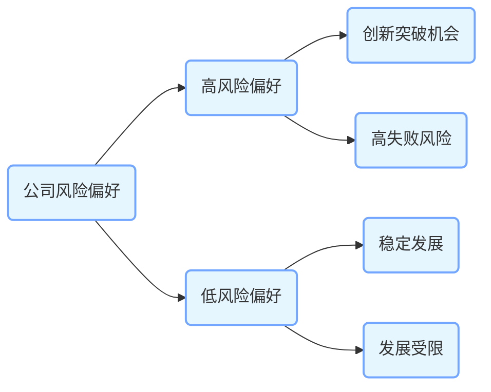

# 彼得林奇如何看待公司的风险偏好与创新突破的相关性

> 关键词：彼得林奇、公司风险偏好、创新突破、相关性、投资分析

> 摘要：本文围绕彼得林奇对公司风险偏好与创新突破相关性的观点展开探讨。深入剖析风险偏好和创新突破的核心概念，阐述其内在联系。通过详细的算法原理、数学模型分析二者关系，并结合实际案例展示在企业中的具体表现。同时介绍相关工具和资源，最后总结未来发展趋势与挑战，旨在为投资者和企业管理者理解公司运营和发展提供有价值的参考。

## 1. 背景介绍 
### 1.1 目的和范围
本部分旨在深入探究彼得林奇关于公司风险偏好与创新突破相关性的观点。彼得林奇作为投资界的传奇人物，其投资理念和对公司的分析方法具有极高的参考价值。我们将研究范围聚焦于公司的风险偏好如何影响其创新突破能力，以及创新突破对公司风险偏好的反馈作用。通过对这一相关性的研究，帮助投资者更好地评估公司的投资价值，也为企业管理者制定战略提供思路。

### 1.2 预期读者
本文的预期读者包括投资者、企业管理者、金融分析师以及对公司运营和投资理论感兴趣的人士。对于投资者来说，了解公司风险偏好与创新突破的关系有助于他们筛选出具有潜力的投资标的；企业管理者可以借鉴相关观点来调整公司战略，平衡风险与创新；金融分析师能够运用这些理论进行更准确的公司评估；而对相关领域感兴趣的人士则可以通过本文拓宽知识面，加深对公司运营机制的理解。

### 1.3 文档结构概述
本文将首先介绍核心概念，明确风险偏好和创新突破的定义及它们之间的联系。接着阐述核心算法原理和具体操作步骤，通过 Python 代码进行详细说明。然后引入数学模型和公式，进一步解释二者的相关性，并举例说明。之后通过项目实战展示代码的实际应用和详细解读。再探讨公司风险偏好与创新突破在实际应用中的场景。随后推荐相关的工具和资源，包括学习资源、开发工具框架和相关论文著作。最后总结未来发展趋势与挑战，并提供常见问题解答和扩展阅读参考资料。

### 1.4 术语表
#### 1.4.1 核心术语定义
- **风险偏好**：指公司在追求目标过程中，愿意承担风险的程度和对风险的态度。它反映了公司在决策时对风险的接受范围和偏好倾向，例如有些公司更倾向于保守的决策，避免高风险项目；而有些公司则愿意冒险尝试具有高不确定性的业务。
- **创新突破**：公司通过引入新的产品、服务、技术、管理方法或商业模式等，实现对现有业务的重大改进或开辟全新的业务领域，从而在市场竞争中获得显著优势。创新突破通常伴随着较高的风险，但也可能带来巨大的回报。

#### 1.4.2 相关概念解释
- **风险承受能力**：与风险偏好不同，风险承受能力是指公司在财务、技术、人力等方面实际能够承受风险的能力。即使公司具有较高的风险偏好，但如果其风险承受能力不足，也可能在面临风险时陷入困境。
- **渐进式创新**：相对创新突破而言，渐进式创新是对现有产品、服务或流程进行逐步改进和优化，风险相对较低，但带来的竞争优势可能相对有限。

#### 1.4.3 缩略词列表
本文在阐述过程中暂未使用缩略词。

## 2. 核心概念与联系 
### 核心概念原理
#### 风险偏好
风险偏好是公司战略决策的重要因素之一。它受到多种因素的影响，包括公司的历史业绩、管理层的性格和经验、行业竞争态势等。具有高风险偏好的公司通常更愿意投入资源到具有不确定性的项目中，例如新兴技术的研发、进入新的市场领域等。这种偏好可能源于公司追求快速增长和高额回报的目标，但也伴随着较高的失败风险。相反，低风险偏好的公司更倾向于维持现状，专注于现有业务的稳定发展，选择风险较低的项目进行投资。

#### 创新突破
创新突破是公司实现可持续发展和竞争优势的关键。它需要公司投入大量的资源，包括资金、人力和时间。创新突破的过程充满了不确定性，可能面临技术难题、市场接受度低等风险。但一旦成功，公司将能够获得巨大的市场份额和利润，提升品牌形象。创新突破可以分为技术创新、产品创新、商业模式创新等不同类型。

### 核心概念架构的文本示意图
```plaintext
              公司风险偏好
            /                \
      高风险偏好           低风险偏好
     /         \           /         \
创新突破机会  高失败风险  稳定发展    发展受限
```

### Mermaid 流程图


## 3. 核心算法原理 & 具体操作步骤 
### 算法原理
我们可以通过建立一个简单的模型来分析公司风险偏好与创新突破的相关性。假设公司的风险偏好可以用一个数值 $R$ 来表示，取值范围为 $[0, 1]$，$0$ 表示完全保守的风险偏好，$1$ 表示完全激进的风险偏好。创新突破的可能性可以用一个函数 $P(R)$ 来表示，该函数反映了风险偏好对创新突破可能性的影响。

### 具体操作步骤
#### 步骤 1：确定风险偏好值 $R$
可以通过分析公司的历史决策、投资项目、财务状况等因素来确定公司的风险偏好值。例如，如果公司过去经常投资于高风险的新兴技术项目，那么其风险偏好值可能接近 $1$；如果公司一直专注于稳定的传统业务，风险偏好值可能接近 $0$。

#### 步骤 2：计算创新突破可能性 $P(R)$
假设创新突破可能性函数为 $P(R) = R^2$，这意味着风险偏好越高，创新突破的可能性越大。当然，实际情况中函数的形式可能更加复杂，需要根据具体数据进行拟合。

#### 步骤 3：评估结果
根据计算得到的创新突破可能性，结合公司的实际情况进行评估。如果创新突破可能性较高，说明公司有较大的机会实现创新突破，但同时也需要关注可能面临的高风险。

### Python 代码实现
```python
# 步骤 1：确定风险偏好值 R
# 假设通过分析得到公司的风险偏好值为 0.8
R = 0.8

# 步骤 2：计算创新突破可能性 P(R)
def calculate_innovation_probability(R):
    return R ** 2

P = calculate_innovation_probability(R)

# 步骤 3：评估结果
print(f"公司的风险偏好值为 {R}")
print(f"公司创新突破的可能性为 {P}")
```

## 4. 数学模型和公式 & 详细讲解 & 举例说明 
### 数学模型和公式
我们可以建立一个更复杂的数学模型来描述公司风险偏好与创新突破的关系。假设公司的创新突破成功与否可以用一个随机变量 $X$ 来表示，$X = 1$ 表示创新突破成功，$X = 0$ 表示创新突破失败。风险偏好 $R$ 对创新突破成功概率的影响可以用逻辑回归模型来表示：

$$P(X = 1|R) = \frac{1}{1 + e^{-(aR + b)}}$$

其中 $a$ 和 $b$ 是模型的参数，需要通过实际数据进行估计。

### 详细讲解
逻辑回归模型是一种常用的分类模型，它可以将输入变量（这里是风险偏好 $R$）映射到一个概率值。参数 $a$ 表示风险偏好对创新突破成功概率的影响程度，$a$ 越大，说明风险偏好越高，创新突破成功的概率增加得越快；参数 $b$ 是一个偏移量，用于调整模型的基准概率。

### 举例说明
假设通过对多家公司的历史数据进行分析，估计得到 $a = 2$，$b = -1$。现在有一家公司的风险偏好值 $R = 0.6$，我们可以计算该公司创新突破成功的概率：

$$P(X = 1|0.6) = \frac{1}{1 + e^{-(2\times0.6 - 1)}}$$

```python
import math

a = 2
b = -1
R = 0.6

probability = 1 / (1 + math.exp(-(a * R + b)))
print(f"当风险偏好值为 {R} 时，创新突破成功的概率为 {probability}")
```

## 5. 项目实战：代码实际案例和详细解释说明 
### 5.1  开发环境搭建
#### 安装 Python
首先需要安装 Python 环境，建议使用 Python 3.7 及以上版本。可以从 Python 官方网站（https://www.python.org/downloads/）下载安装包，按照安装向导进行安装。

#### 安装必要的库
在本项目中，我们需要使用 `pandas` 进行数据处理，`scikit-learn` 进行逻辑回归模型的训练和预测。可以使用以下命令进行安装：
```sh
pip install pandas scikit-learn
```

### 5.2  源代码详细实现和代码解读
```python
import pandas as pd
from sklearn.linear_model import LogisticRegression
from sklearn.model_selection import train_test_split
from sklearn.metrics import accuracy_score

# 步骤 1：加载数据
# 假设我们有一个包含公司风险偏好和创新突破结果的数据集
data = pd.read_csv('company_data.csv')

# 提取特征和标签
X = data[['risk_preference']]
y = data['innovation_success']

# 步骤 2：划分训练集和测试集
X_train, X_test, y_train, y_test = train_test_split(X, y, test_size=0.2, random_state=42)

# 步骤 3：训练逻辑回归模型
model = LogisticRegression()
model.fit(X_train, y_train)

# 步骤 4：进行预测
y_pred = model.predict(X_test)

# 步骤 5：评估模型性能
accuracy = accuracy_score(y_test, y_pred)
print(f"模型的准确率为 {accuracy}")

# 步骤 6：预测新公司的创新突破可能性
new_company_risk_preference = [[0.7]]
predicted_probability = model.predict_proba(new_company_risk_preference)[:, 1]
print(f"新公司风险偏好为 0.7 时，创新突破的可能性为 {predicted_probability[0]}")
```

### 代码解读与分析
#### 步骤 1：加载数据
使用 `pandas` 库的 `read_csv` 函数加载包含公司风险偏好和创新突破结果的数据集。数据集中的 `risk_preference` 列表示公司的风险偏好值，`innovation_success` 列表示创新突破是否成功（0 表示失败，1 表示成功）。

#### 步骤 2：划分训练集和测试集
使用 `train_test_split` 函数将数据集划分为训练集和测试集，其中测试集占总数据的 20%。

#### 步骤 3：训练逻辑回归模型
使用 `LogisticRegression` 类创建一个逻辑回归模型，并使用训练集数据进行训练。

#### 步骤 4：进行预测
使用训练好的模型对测试集数据进行预测，得到预测结果 `y_pred`。

#### 步骤 5：评估模型性能
使用 `accuracy_score` 函数计算模型的准确率，即预测结果与真实标签的匹配程度。

#### 步骤 6：预测新公司的创新突破可能性
创建一个新的公司风险偏好值列表 `new_company_risk_preference`，并使用 `predict_proba` 函数预测该公司创新突破的可能性。

## 6. 实际应用场景 
### 投资者决策
投资者在选择投资标的时，可以通过分析公司的风险偏好和创新突破能力来评估公司的投资价值。对于具有较高风险偏好和较强创新能力的公司，虽然投资风险较高，但如果创新突破成功，可能会带来巨大的回报。例如，科技行业的一些初创公司，它们通常具有较高的风险偏好，致力于创新突破，如果能够成功推出具有竞争力的产品或服务，其股价可能会大幅上涨。

### 企业战略规划
企业管理者在制定战略时，需要平衡风险偏好和创新突破。如果企业处于竞争激烈的行业，需要不断进行创新突破以保持竞争力，那么可以适当提高风险偏好，加大对研发和创新项目的投入。例如，苹果公司一直以创新著称，它愿意承担较高的风险进行产品研发，推出了 iPhone 等具有划时代意义的产品，从而在全球智能手机市场占据了领先地位。

### 行业分析
行业分析师可以通过研究行业内公司的风险偏好和创新突破情况，了解行业的发展趋势和竞争格局。如果一个行业内大部分公司都具有较高的风险偏好和较强的创新能力，说明该行业处于快速发展阶段，竞争激烈；反之，如果大部分公司都较为保守，可能意味着该行业发展较为缓慢，缺乏创新动力。

## 7. 工具和资源推荐
### 7.1 学习资源推荐
#### 7.1.1 书籍推荐
- 《彼得林奇的成功投资》：彼得林奇的经典著作，详细介绍了他的投资理念和方法，包括如何分析公司的基本面和评估公司的投资价值。
- 《创新者的窘境》：探讨了企业在创新过程中面临的挑战和困境，以及如何通过创新实现可持续发展。
- 《风险管理与金融机构》：全面介绍了风险管理的理论和方法，对于理解公司的风险偏好和风险控制具有重要意义。

#### 7.1.2 在线课程
- Coursera 上的“投资学原理”：由知名大学教授授课，系统介绍了投资学的基本原理和方法。
- edX 上的“创新管理”：讲解了创新管理的理论和实践，帮助学习者了解如何推动企业的创新突破。

#### 7.1.3 技术博客和网站
- Seeking Alpha：提供丰富的金融分析和投资研究文章，包括对公司风险偏好和创新能力的分析。
- Harvard Business Review：发布关于企业管理、创新和战略规划的前沿研究和案例分析。

### 7.2 开发工具框架推荐
#### 7.2.1 IDE和编辑器
- PyCharm：功能强大的 Python 集成开发环境，提供代码编辑、调试、版本控制等功能。
- Jupyter Notebook：交互式的开发环境，适合进行数据探索和模型实验。

#### 7.2.2 调试和性能分析工具
- pdb：Python 自带的调试器，可以帮助开发者定位和解决代码中的问题。
- cProfile：Python 标准库中的性能分析工具，可以分析代码的运行时间和资源消耗情况。

#### 7.2.3 相关框架和库
- scikit-learn：Python 中常用的机器学习库，提供了丰富的机器学习算法和工具，包括逻辑回归、决策树等。
- pandas：用于数据处理和分析的 Python 库，提供了高效的数据结构和数据操作方法。

### 7.3 相关论文著作推荐
#### 7.3.1 经典论文
- “The Innovator's Dilemma: When New Technologies Cause Great Firms to Fail”：该论文提出了“创新者的窘境”理论，探讨了成熟企业在面对新兴技术时的困境和应对策略。
- “Risk Aversion and Incentive Effects”：研究了风险偏好对激励机制和企业决策的影响。

#### 7.3.2 最新研究成果
- 关注顶级学术期刊如《Management Science》、《Journal of Financial Economics》等，这些期刊会发表关于公司风险偏好、创新突破等方面的最新研究成果。

#### 7.3.3 应用案例分析
- 可以参考一些知名咨询公司的研究报告，如麦肯锡、波士顿咨询等，它们会对不同行业的公司进行案例分析，探讨公司的风险偏好和创新策略。

## 8. 总结：未来发展趋势与挑战
### 未来发展趋势
#### 技术驱动的创新突破
随着科技的不断进步，新兴技术如人工智能、大数据、区块链等将为公司带来更多的创新突破机会。具有较高风险偏好的公司将更积极地投入到这些技术的研发和应用中，以获得竞争优势。

#### 跨行业融合创新
不同行业之间的界限将越来越模糊，公司将通过跨行业融合实现创新突破。例如，金融科技公司将金融服务与科技手段相结合，创造出全新的商业模式。

#### 可持续发展导向的创新
消费者对可持续发展的关注度不断提高，公司将更加注重在环保、社会责任等方面的创新突破，以满足市场需求。

### 挑战
#### 技术不确定性
新兴技术的发展具有较高的不确定性，公司在投入大量资源进行创新研发时，可能面临技术难题无法攻克、市场接受度低等风险。

#### 竞争压力
随着越来越多的公司意识到创新突破的重要性，市场竞争将更加激烈。公司需要不断提高自身的创新能力和风险应对能力，才能在竞争中脱颖而出。

#### 人才短缺
创新突破需要高素质的人才，包括技术人才、创新管理人才等。目前市场上这类人才相对短缺，公司需要面临人才竞争和培养的挑战。

## 9. 附录：常见问题与解答
### 问题 1：如何准确评估公司的风险偏好？
解答：可以从公司的历史决策、投资项目、财务状况、管理层的言论和行为等方面进行综合评估。例如，分析公司过去是否经常投资于高风险的项目，财务报表中研发投入的比例等。

### 问题 2：创新突破一定需要高风险偏好吗？
解答：不一定。虽然高风险偏好的公司更有可能尝试创新突破，但低风险偏好的公司也可以通过渐进式创新等方式实现一定程度的创新。此外，公司可以通过合理的风险管理和资源配置，在控制风险的前提下进行创新。

### 问题 3：如何提高公司的创新突破能力？
解答：可以从以下几个方面入手：加大研发投入，吸引和培养创新人才，建立鼓励创新的企业文化，加强与外部机构的合作等。

## 10. 扩展阅读 & 参考资料
- 《金融市场与金融机构基础》
- 《商业模式新生代》
- 各大金融媒体和研究机构的报告

作者：AI天才研究院/AI Genius Institute & 禅与计算机程序设计艺术 /Zen And The Art of Computer Programming