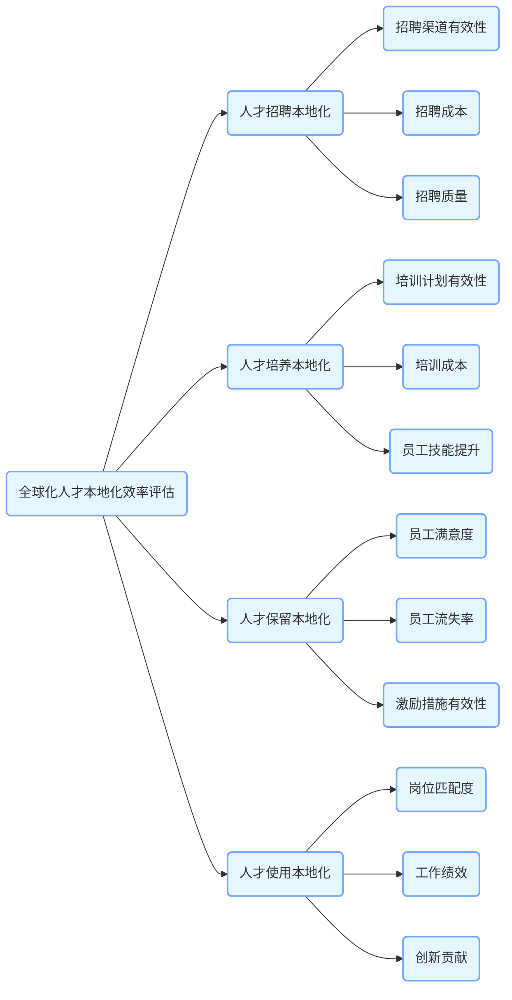

# 彼得林奇如何评估公司的全球化人才本地化效率

> 关键词：彼得林奇、全球化人才本地化、效率评估、公司评估、投资分析

> 摘要：本文聚焦于彼得林奇评估公司全球化人才本地化效率的方法。从背景介绍入手，阐述评估目的、目标读者等内容。详细剖析核心概念与联系，介绍核心算法原理及操作步骤，运用数学模型和公式进行说明。通过项目实战案例，深入解读代码实现。探讨实际应用场景，推荐相关工具和资源。最后总结未来发展趋势与挑战，解答常见问题并提供扩展阅读与参考资料，旨在为投资者和企业管理者提供全面的评估思路和方法。

## 1. 背景介绍 
### 1.1 目的和范围
彼得林奇作为投资界的传奇人物，其投资理念和方法影响深远。评估公司的全球化人才本地化效率是他在分析公司投资价值时的重要环节。本文章的目的在于深入探讨彼得林奇评估该效率的具体方法和思路，帮助投资者更好地理解公司的运营状况和发展潜力，同时也为企业管理者提供优化人才管理策略的参考。范围涵盖了全球化人才本地化的各个方面，包括人才招聘、培养、保留和使用等环节。

### 1.2 预期读者
本文的预期读者主要包括两类人群。一类是投资者，无论是专业的机构投资者还是普通的个人投资者，都可以通过了解彼得林奇的评估方法，更准确地评估公司的投资价值，做出更明智的投资决策。另一类是企业管理者，尤其是负责全球化业务的企业管理者，他们可以借鉴彼得林奇的评估思路，优化公司的全球化人才本地化策略，提高企业的运营效率和竞争力。

### 1.3 文档结构概述
本文将按照以下结构进行阐述。首先介绍相关背景信息，包括目的、读者和文档结构。接着深入剖析核心概念与联系，明确全球化人才本地化效率的内涵和相关要素。然后讲解核心算法原理和具体操作步骤，通过Python代码详细展示。之后运用数学模型和公式对评估方法进行更深入的分析，并举例说明。再通过项目实战案例，介绍开发环境搭建、源代码实现和代码解读。探讨实际应用场景，为读者提供实际参考。推荐相关的工具和资源，帮助读者进一步学习和实践。最后总结未来发展趋势与挑战，解答常见问题并提供扩展阅读与参考资料。

### 1.4 术语表
#### 1.4.1 核心术语定义
- **全球化人才本地化**：指跨国公司在全球范围内开展业务时，将当地的人才纳入公司的人才体系，使其能够在公司的全球化战略中发挥重要作用。
- **全球化人才本地化效率**：衡量公司在实施全球化人才本地化战略过程中，投入的资源与取得的成果之间的比例关系。高效的全球化人才本地化意味着公司能够以较低的成本吸引、培养和留住当地人才，并使其为公司创造较高的价值。
- **投资价值**：指公司对于投资者而言所具有的潜在价值，包括公司的盈利能力、成长潜力、市场竞争力等方面。

#### 1.4.2 相关概念解释
- **人才招聘本地化**：公司在当地招聘符合公司需求的人才，利用当地的人才资源优势，降低招聘成本和文化差异带来的风险。
- **人才培养本地化**：为当地招聘的人才提供培训和发展机会，使其能够适应公司的文化和业务要求，提高工作能力和绩效。
- **人才保留本地化**：采取措施留住当地优秀人才，减少人才流失率，保持公司人才队伍的稳定性。
- **人才使用本地化**：合理安排当地人才的工作岗位和职责，充分发挥其专业技能和优势，为公司创造价值。

#### 1.4.3 缩略词列表
- MNC：Multinational Corporation，跨国公司
- ROI：Return on Investment，投资回报率

## 2. 核心概念与联系 
### 核心概念原理
全球化人才本地化效率的核心在于实现公司全球战略与当地人才资源的有效结合。跨国公司在全球化进程中面临着不同的文化、法律和市场环境，通过本地化人才的使用，可以更好地适应当地市场需求，提高公司的运营效率和竞争力。

从人才角度来看，本地化人才具有对当地文化、市场和社会环境的深入了解，能够更好地与当地客户、合作伙伴和政府机构进行沟通和合作。同时，本地化人才的招聘和培养成本相对较低，可以降低公司的人力资源成本。

从公司角度来看，高效的全球化人才本地化可以促进公司的知识转移和创新。当地人才带来的新思想和新方法可以与公司的全球经验相结合，推动公司的业务创新和发展。此外，本地化人才的使用还可以提高公司在当地的社会形象和声誉，增强公司的社会责任感。

### 架构的文本示意图
全球化人才本地化效率评估涉及多个方面的因素，其架构可以用以下文本示意图表示：

```plaintext
全球化人才本地化效率评估
|-- 人才招聘本地化
|   |-- 招聘渠道有效性
|   |-- 招聘成本
|   |-- 招聘质量
|-- 人才培养本地化
|   |-- 培训计划有效性
|   |-- 培训成本
|   |-- 员工技能提升
|-- 人才保留本地化
|   |-- 员工满意度
|   |-- 员工流失率
|   |-- 激励措施有效性
|-- 人才使用本地化
|   |-- 岗位匹配度
|   |-- 工作绩效
|   |-- 创新贡献
```

### Mermaid 流程图


## 3. 核心算法原理 & 具体操作步骤 
### 核心算法原理
评估全球化人才本地化效率可以采用综合评估法，通过对人才招聘、培养、保留和使用等多个方面的指标进行量化评估，然后根据各指标的权重计算出综合得分。

设评估指标集合为 $I = \{i_1, i_2, \cdots, i_n\}$，各指标的权重集合为 $W = \{w_1, w_2, \cdots, w_n\}$，其中 $\sum_{j = 1}^{n} w_j = 1$。对于每个指标 $i_j$，可以通过一定的方法获取其得分 $s_j$。则全球化人才本地化效率的综合得分 $S$ 可以通过以下公式计算：

$$S = \sum_{j = 1}^{n} w_j \times s_j$$

### 具体操作步骤
#### 步骤 1：确定评估指标和权重
根据全球化人才本地化的核心要素，确定具体的评估指标，如招聘渠道有效性、培训计划有效性等。然后通过专家评估、历史数据分析等方法确定各指标的权重。

#### 步骤 2：收集数据
针对每个评估指标，收集相关的数据。例如，对于招聘成本指标，可以收集招聘过程中的各项费用数据；对于员工满意度指标，可以通过问卷调查的方式收集员工的反馈信息。

#### 步骤 3：计算指标得分
根据收集到的数据，按照一定的评分标准计算每个指标的得分。评分标准可以根据实际情况进行制定，例如，对于招聘质量指标，可以根据新员工的试用期通过率来进行评分。

#### 步骤 4：计算综合得分
将各指标的得分乘以其对应的权重，然后求和得到全球化人才本地化效率的综合得分。

### Python 代码实现
```python
# 定义评估指标和权重
indicators = ['招聘渠道有效性', '招聘成本', '招聘质量', '培训计划有效性', '培训成本', '员工技能提升',
              '员工满意度', '员工流失率', '激励措施有效性', '岗位匹配度', '工作绩效', '创新贡献']
weights = [0.08, 0.07, 0.08, 0.08, 0.07, 0.08, 0.09, 0.09, 0.08, 0.08, 0.09, 0.08]

# 模拟收集到的指标得分
scores = [80, 70, 85, 75, 65, 80, 85, 70, 75, 80, 85, 80]

# 计算综合得分
def calculate_total_score(weights, scores):
    total_score = 0
    for i in range(len(weights)):
        total_score += weights[i] * scores[i]
    return total_score

# 调用函数计算综合得分
total_score = calculate_total_score(weights, scores)
print(f"全球化人才本地化效率综合得分: {total_score}")
```

## 4. 数学模型和公式 & 详细讲解 & 举例说明 
### 数学模型和公式
如前面所述，全球化人才本地化效率的综合得分计算公式为：

$$S = \sum_{j = 1}^{n} w_j \times s_j$$

其中，$S$ 表示综合得分，$w_j$ 表示第 $j$ 个评估指标的权重，$s_j$ 表示第 $j$ 个评估指标的得分，$n$ 表示评估指标的数量。

### 详细讲解
这个公式的核心思想是将各个评估指标的得分按照其重要程度进行加权求和，得到一个综合的评估结果。权重 $w_j$ 反映了每个指标在整体评估中的重要性，权重越大，该指标对综合得分的影响就越大。得分 $s_j$ 则是根据具体的评估标准对每个指标进行量化的结果。

### 举例说明
假设我们有三个评估指标：招聘成本、员工满意度和工作绩效，其权重分别为 $w_1 = 0.3$，$w_2 = 0.3$，$w_3 = 0.4$，对应的得分分别为 $s_1 = 70$，$s_2 = 80$，$s_3 = 85$。则根据上述公式计算综合得分：

$$S = 0.3 \times 70 + 0.3 \times 80 + 0.4 \times 85$$
$$S = 21 + 24 + 34$$
$$S = 79$$

这意味着该公司在全球化人才本地化方面的综合效率得分为 79 分。通过与其他公司或行业平均水平进行比较，可以评估该公司在这方面的表现。

## 5. 项目实战：代码实际案例和详细解释说明 
### 5.1  开发环境搭建
#### 安装 Python
首先需要安装 Python 编程语言。可以从 Python 官方网站（https://www.python.org/downloads/）下载适合自己操作系统的 Python 安装包，然后按照安装向导进行安装。

#### 安装必要的库
在本项目中，主要使用 Python 的内置功能，不需要额外安装第三方库。如果需要进行数据可视化或更复杂的数据分析，可以安装 matplotlib、pandas 等库。可以使用以下命令进行安装：

```sh
pip install matplotlib pandas
```

### 5.2  源代码详细实现和代码解读
```python
# 定义评估指标和权重
indicators = ['招聘渠道有效性', '招聘成本', '招聘质量', '培训计划有效性', '培训成本', '员工技能提升',
              '员工满意度', '员工流失率', '激励措施有效性', '岗位匹配度', '工作绩效', '创新贡献']
weights = [0.08, 0.07, 0.08, 0.08, 0.07, 0.08, 0.09, 0.09, 0.08, 0.08, 0.09, 0.08]

# 模拟收集到的指标得分
scores = [80, 70, 85, 75, 65, 80, 85, 70, 75, 80, 85, 80]

# 计算综合得分
def calculate_total_score(weights, scores):
    total_score = 0
    for i in range(len(weights)):
        total_score += weights[i] * scores[i]
    return total_score

# 调用函数计算综合得分
total_score = calculate_total_score(weights, scores)
print(f"全球化人才本地化效率综合得分: {total_score}")

# 可视化各指标得分
import matplotlib.pyplot as plt

plt.bar(indicators, scores)
plt.xlabel('评估指标')
plt.ylabel('得分')
plt.title('各评估指标得分')
plt.xticks(rotation=90)
plt.show()
```

### 代码解读与分析
#### 定义评估指标和权重
```python
indicators = ['招聘渠道有效性', '招聘成本', '招聘质量', '培训计划有效性', '培训成本', '员工技能提升',
              '员工满意度', '员工流失率', '激励措施有效性', '岗位匹配度', '工作绩效', '创新贡献']
weights = [0.08, 0.07, 0.08, 0.08, 0.07, 0.08, 0.09, 0.09, 0.08, 0.08, 0.09, 0.08]
```
这部分代码定义了评估全球化人才本地化效率的指标和对应的权重。指标涵盖了人才招聘、培养、保留和使用的各个方面，权重反映了每个指标在整体评估中的重要性。

#### 模拟收集到的指标得分
```python
scores = [80, 70, 85, 75, 65, 80, 85, 70, 75, 80, 85, 80]
```
这里模拟了每个评估指标的得分，实际应用中需要根据具体的数据收集方法获取真实的得分。

#### 计算综合得分
```python
def calculate_total_score(weights, scores):
    total_score = 0
    for i in range(len(weights)):
        total_score += weights[i] * scores[i]
    return total_score

total_score = calculate_total_score(weights, scores)
print(f"全球化人才本地化效率综合得分: {total_score}")
```
定义了一个函数 `calculate_total_score` 来计算综合得分，通过遍历权重和得分列表，将每个指标的得分乘以其对应的权重并累加得到综合得分。最后打印出综合得分。

#### 可视化各指标得分
```python
import matplotlib.pyplot as plt

plt.bar(indicators, scores)
plt.xlabel('评估指标')
plt.ylabel('得分')
plt.title('各评估指标得分')
plt.xticks(rotation=90)
plt.show()
```
使用 `matplotlib` 库绘制柱状图，直观地展示各评估指标的得分情况。

## 6. 实际应用场景 
### 投资者决策
投资者在选择投资标的时，可以使用彼得林奇的方法评估公司的全球化人才本地化效率。如果一家公司在这方面表现出色，说明其能够有效地利用当地人才资源，提高运营效率和竞争力，具有较高的投资价值。例如，一家跨国科技公司在多个国家和地区开展业务，通过高效的全球化人才本地化策略，吸引和培养了大量当地优秀人才，推动了公司的技术创新和市场拓展，这样的公司可能更值得投资者关注。

### 企业战略规划
企业管理者可以运用该评估方法来优化公司的全球化人才本地化战略。通过对各项指标的分析，找出公司在人才管理方面的优势和不足，制定针对性的改进措施。例如，如果发现员工流失率较高，可以分析原因并采取相应的激励措施来提高员工满意度和忠诚度；如果招聘质量不高，可以优化招聘渠道和招聘标准。

### 行业对标分析
企业可以将自身的全球化人才本地化效率与同行业其他公司进行对比，了解自己在行业中的地位和竞争力。通过对标分析，企业可以学习借鉴其他公司的成功经验，发现自身的差距并加以改进。例如，一家制造业跨国公司可以与行业内领先的企业进行对比，分析在人才培养和使用方面的差异，从而提升自己的人才管理水平。

## 7. 工具和资源推荐
### 7.1 学习资源推荐
#### 7.1.1 书籍推荐
- 《彼得·林奇的成功投资》：彼得·林奇的经典著作，详细介绍了他的投资理念和方法，对于理解如何评估公司的投资价值具有重要的参考意义。
- 《跨国公司人力资源管理》：全面介绍了跨国公司在人力资源管理方面的理论和实践，包括全球化人才本地化的相关内容。
- 《人才管理最佳实践》：提供了企业在人才招聘、培养、保留和使用等方面的最佳实践案例和方法，对企业管理者有很大的帮助。

#### 7.1.2 在线课程
- Coursera 上的“跨国企业管理”课程：系统地介绍了跨国企业在战略、运营、人力资源等方面的管理知识，其中包含了全球化人才本地化的相关内容。
- edX 上的“人力资源管理前沿”课程：聚焦于人力资源管理的最新理论和实践，对于理解全球化人才管理的趋势和方法有很大的帮助。

#### 7.1.3 技术博客和网站
- 哈佛商业评论（https://hbr.org/）：提供了大量关于企业管理、战略规划、人力资源等方面的高质量文章，其中不乏关于全球化人才管理的深入分析。
- 麦肯锡全球研究所（https://www.mckinsey.com/）：发布了许多关于全球经济、企业战略和人力资源的研究报告，对于了解全球化人才本地化的趋势和挑战具有重要的参考价值。

### 7.2 开发工具框架推荐
#### 7.2.1 IDE和编辑器
- PyCharm：一款专业的 Python 集成开发环境，具有代码编辑、调试、版本控制等功能，适合开发 Python 代码。
- Visual Studio Code：一款轻量级的代码编辑器，支持多种编程语言，具有丰富的插件生态系统，可以方便地进行 Python 开发。

#### 7.2.2 调试和性能分析工具
- PDB：Python 内置的调试器，可以帮助开发者定位代码中的问题。
- cProfile：Python 标准库中的性能分析工具，可以分析代码的运行时间和函数调用情况，帮助开发者优化代码性能。

#### 7.2.3 相关框架和库
- Pandas：用于数据处理和分析的 Python 库，提供了高效的数据结构和数据操作方法，适合处理和分析全球化人才本地化评估中的数据。
- Matplotlib：用于数据可视化的 Python 库，可以绘制各种类型的图表，直观地展示评估结果。

### 7.3 相关论文著作推荐
#### 7.3.1 经典论文
- “The Global Talent Management Imperative”：探讨了全球化背景下企业面临的人才管理挑战和应对策略，强调了全球化人才本地化的重要性。
- “Multinational Corporations and the Global Knowledge Economy”：分析了跨国公司在全球知识经济中的作用和人才管理策略，为理解全球化人才本地化提供了理论基础。

#### 7.3.2 最新研究成果
- 关注国际顶级学术期刊如《Academy of Management Journal》《Journal of International Business Studies》等，这些期刊经常发表关于跨国企业管理和人才管理的最新研究成果。

#### 7.3.3 应用案例分析
- 《哈佛商业案例集》：收录了大量企业管理的实际案例，其中包括许多跨国公司在全球化人才本地化方面的成功案例和经验教训，对于企业管理者和投资者都具有重要的参考价值。

## 8. 总结：未来发展趋势与挑战
### 未来发展趋势
- **数字化转型加速**：随着科技的不断发展，企业的全球化人才本地化管理将越来越依赖数字化工具和平台。例如，通过在线招聘平台、虚拟培训系统等，企业可以更高效地招聘和培养全球人才。
- **多元化和包容性增强**：未来企业将更加注重人才的多元化和包容性，不仅要招聘不同国籍、不同文化背景的人才，还要营造一个包容和开放的工作环境，充分发挥每个人的潜力。
- **人才供应链管理**：企业将从传统的人才招聘和培养模式转向人才供应链管理模式，与高校、培训机构、专业人才服务机构等建立长期合作关系，确保人才的持续供应。

### 挑战
- **文化差异管理**：不同国家和地区的文化差异给全球化人才本地化带来了巨大的挑战。企业需要采取有效的措施来管理文化差异，促进不同文化背景的员工之间的沟通和协作。
- **人才竞争加剧**：随着全球化的深入发展，全球人才市场的竞争将越来越激烈。企业需要不断提升自身的吸引力，提供有竞争力的薪酬福利和职业发展机会，以吸引和留住优秀人才。
- **数据安全和隐私保护**：在数字化转型的过程中，企业需要处理大量的人才数据，数据安全和隐私保护成为了重要的挑战。企业需要建立完善的数据安全管理制度，确保人才数据的安全和隐私。

## 9. 附录：常见问题与解答
### 问题 1：如何确定评估指标的权重？
答：确定评估指标的权重可以采用多种方法，如专家评估法、层次分析法、历史数据分析法等。专家评估法是邀请相关领域的专家根据经验和专业知识对各指标的重要性进行评估；层次分析法是一种系统的决策分析方法，通过构建层次结构模型，比较各指标之间的相对重要性来确定权重；历史数据分析法是根据企业过去的人才管理数据，分析各指标对企业绩效的影响程度来确定权重。

### 问题 2：如何确保收集到的数据准确可靠？
答：为了确保收集到的数据准确可靠，需要采取以下措施。首先，建立完善的数据收集制度和流程，明确数据收集的责任人和方法。其次，对数据收集人员进行培训，提高他们的专业水平和责任心。最后，对收集到的数据进行审核和验证，确保数据的准确性和完整性。

### 问题 3：评估结果如何应用？
答：评估结果可以应用于多个方面。对于投资者来说，可以作为评估公司投资价值的参考依据；对于企业管理者来说，可以用于优化公司的全球化人才本地化战略，制定针对性的改进措施；还可以用于行业对标分析，了解企业在行业中的地位和竞争力。

## 10. 扩展阅读 & 参考资料
### 扩展阅读
- 《创新者的窘境》：探讨了企业在面对技术创新和市场变革时的挑战和机遇，对于理解全球化人才本地化过程中的创新管理具有重要的启示。
- 《竞争力优势》：分析了企业如何通过战略规划和资源配置来获得竞争优势，对于企业制定全球化人才本地化战略具有参考价值。

### 参考资料
- 彼得·林奇的相关著作和访谈资料。
- 跨国公司的年报和官方报告，了解其全球化人才本地化的实践和成果。
- 学术期刊和研究机构发布的关于全球化人才管理的研究论文和报告。

作者：AI天才研究院/AI Genius Institute & 禅与计算机程序设计艺术 /Zen And The Art of Computer Programming