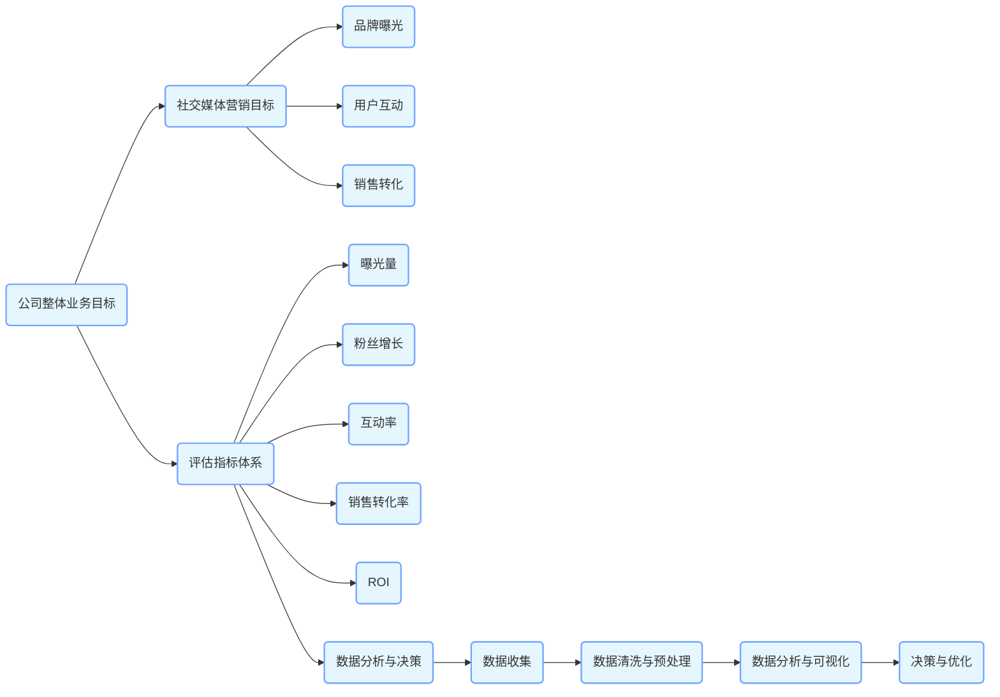

# 彼得林奇如何评估公司的社交媒体营销效果

> 关键词：彼得林奇、公司评估、社交媒体营销效果、评估指标、数据分析

> 摘要：本文聚焦于彼得林奇评估公司社交媒体营销效果的方法。通过深入剖析相关背景知识，介绍核心概念及联系，阐述核心算法原理与操作步骤，展示数学模型和公式，结合项目实战案例进行详细解读，探讨实际应用场景，推荐相关工具和资源，最后总结未来发展趋势与挑战，并解答常见问题。旨在为企业和投资者提供全面且实用的评估社交媒体营销效果的思路和方法。

## 1. 背景介绍 
### 1.1 目的和范围
目的在于借鉴彼得林奇评估公司的理念和方法，探索如何有效评估公司在社交媒体平台上的营销效果。范围涵盖了社交媒体营销的各个方面，包括品牌曝光、用户互动、销售转化等，同时结合彼得林奇对公司基本面分析的要点，如财务状况、市场竞争力等，来综合考量社交媒体营销对公司整体业绩的影响。

### 1.2 预期读者
本文预期读者包括企业营销人员、市场分析师、投资者以及对社交媒体营销和公司评估感兴趣的专业人士。对于企业营销人员，可从中学习如何运用有效的评估方法来优化社交媒体营销策略；市场分析师能借助这些方法更准确地评估公司的市场表现；投资者则可将其作为判断公司投资价值的参考因素之一。

### 1.3 文档结构概述
本文首先介绍核心概念及它们之间的联系，为后续内容奠定理论基础；接着阐述核心算法原理和具体操作步骤，提供评估的技术方法；然后展示相关数学模型和公式，并举例说明其应用；通过项目实战案例详细解读代码实现和评估过程；探讨实际应用场景，说明评估方法在不同行业和业务中的应用；推荐学习资源、开发工具框架和相关论文著作，为读者进一步深入学习提供指引；最后总结未来发展趋势与挑战，解答常见问题，并提供扩展阅读和参考资料。

### 1.4 术语表
#### 1.4.1 核心术语定义
- **社交媒体营销效果**：指公司通过社交媒体平台开展营销活动所取得的成果，包括品牌知名度提升、用户参与度增加、销售业绩增长等方面。
- **彼得林奇投资理念**：强调通过深入研究公司基本面，如财务报表、业务模式、市场竞争力等，来寻找具有投资价值的公司。
- **用户互动指标**：衡量用户在社交媒体上与公司内容进行互动的程度，如点赞、评论、分享等。
- **销售转化率**：指通过社交媒体营销活动引导产生的实际销售数量与潜在客户数量的比例。

#### 1.4.2 相关概念解释
- **社交媒体平台**：如微信、微博、抖音、Facebook、Twitter等，是公司进行营销活动的主要渠道。
- **品牌曝光**：公司品牌信息在社交媒体上被用户看到的次数和范围。
- **粉丝增长**：公司在社交媒体上粉丝数量的增加情况，反映了品牌的吸引力和影响力。

#### 1.4.3 缩略词列表
- ROI：Return on Investment，投资回报率
- CPA：Cost Per Action，每次行动成本
- CPM：Cost Per Mille，每千次展示成本

## 2. 核心概念与联系 

### 核心概念原理
彼得林奇评估公司时注重公司的基本面和长期发展潜力。在评估社交媒体营销效果时，也需要将其与公司的整体战略和业务目标相结合。社交媒体营销的核心目标是通过各种手段吸引用户关注，提高品牌知名度和美誉度，进而促进销售增长。

从用户角度来看，社交媒体提供了一个互动的平台，用户可以通过点赞、评论、分享等方式表达对公司内容的态度和兴趣。这些互动行为反映了用户对品牌的认知和参与度，是评估营销效果的重要指标。

从公司角度来看，社交媒体营销需要投入一定的资源，包括人力、物力和财力。因此，评估营销效果时需要考虑投资回报率（ROI），即营销活动带来的收益与成本的比例。

### 架构的文本示意图
```plaintext
公司整体业务目标
|
|-- 社交媒体营销目标
|   |-- 品牌曝光
|   |-- 用户互动
|   |-- 销售转化
|
|-- 评估指标体系
|   |-- 曝光量
|   |-- 粉丝增长
|   |-- 互动率
|   |-- 销售转化率
|   |-- ROI
|
|-- 数据分析与决策
|   |-- 数据收集
|   |-- 数据清洗与预处理
|   |-- 数据分析与可视化
|   |-- 决策与优化
```

### Mermaid 流程图


## 3. 核心算法原理 & 具体操作步骤 

### 核心算法原理
评估社交媒体营销效果的核心算法主要基于数据分析和统计方法。以下是一些常用的算法和指标：

#### 互动率计算
互动率是衡量用户与公司内容互动程度的重要指标，计算公式为：

$$互动率 = \frac{互动总数}{曝光量} \times 100\%$$

其中，互动总数包括点赞、评论、分享等操作的总和，曝光量指内容被展示的次数。

#### 销售转化率计算
销售转化率反映了社交媒体营销活动对销售业绩的影响，计算公式为：

$$销售转化率 = \frac{实际销售数量}{潜在客户数量} \times 100\%$$

#### 投资回报率（ROI）计算
投资回报率衡量了营销活动的经济效益，计算公式为：

$$ROI = \frac{营销活动带来的收益 - 营销成本}{营销成本} \times 100\%$$

### 具体操作步骤

#### 数据收集
- 利用社交媒体平台提供的数据分析工具，如微信公众号后台、微博数据中心、抖音企业号数据分析等，收集曝光量、互动数据、粉丝增长等信息。
- 结合公司的销售系统，记录通过社交媒体渠道产生的实际销售数据。
- 统计营销活动的成本，包括广告投放费用、人力成本等。

#### 数据清洗与预处理
- 去除重复、错误或无效的数据，确保数据的准确性和完整性。
- 对数据进行标准化处理，以便进行比较和分析。

#### 数据分析与可视化
- 使用 Python 等编程语言进行数据分析，计算互动率、销售转化率、ROI 等指标。
- 利用可视化工具，如 Matplotlib、Seaborn 等，将分析结果以图表的形式展示出来，便于直观理解。

#### 决策与优化
- 根据分析结果，评估社交媒体营销活动的效果，判断是否达到预期目标。
- 针对存在的问题，制定优化策略，如调整内容策略、优化广告投放等。

### Python 源代码示例
```python
import pandas as pd

# 模拟数据
data = {
    '曝光量': [1000, 1200, 1500, 1300],
    '互动总数': [50, 60, 80, 70],
    '潜在客户数量': [200, 220, 250, 230],
    '实际销售数量': [20, 22, 25, 23],
    '营销成本': [1000, 1200, 1500, 1300],
    '营销收益': [2000, 2200, 2500, 2300]
}

df = pd.DataFrame(data)

# 计算互动率
df['互动率'] = (df['互动总数'] / df['曝光量']) * 100

# 计算销售转化率
df['销售转化率'] = (df['实际销售数量'] / df['潜在客户数量']) * 100

# 计算 ROI
df['ROI'] = ((df['营销收益'] - df['营销成本']) / df['营销成本']) * 100

print(df)
```

## 4. 数学模型和公式 & 详细讲解 & 举例说明 

### 互动率模型
#### 公式
$$互动率 = \frac{互动总数}{曝光量} \times 100\%$$

#### 详细讲解
互动率反映了用户对公司内容的关注和参与程度。曝光量是内容被展示的次数，互动总数包括点赞、评论、分享等操作的总和。互动率越高，说明内容越受用户欢迎，营销效果越好。

#### 举例说明
假设某公司在社交媒体上发布了一篇文章，曝光量为 5000 次，获得了 200 个点赞、50 条评论和 30 次分享。则互动总数为 $200 + 50 + 30 = 280$ 次。互动率为 $\frac{280}{5000} \times 100\% = 5.6\%$。

### 销售转化率模型
#### 公式
$$销售转化率 = \frac{实际销售数量}{潜在客户数量} \times 100\%$$

#### 详细讲解
销售转化率衡量了社交媒体营销活动对销售业绩的推动作用。潜在客户数量指通过社交媒体渠道接触到公司产品或服务的用户数量，实际销售数量指这些潜在客户中最终产生购买行为的数量。销售转化率越高，说明营销活动的效果越好，能够有效地将潜在客户转化为实际客户。

#### 举例说明
某电商公司在社交媒体上投放了广告，吸引了 1000 名潜在客户访问其网站，最终有 50 名客户完成了购买。则销售转化率为 $\frac{50}{1000} \times 100\% = 5\%$。

### 投资回报率（ROI）模型
#### 公式
$$ROI = \frac{营销活动带来的收益 - 营销成本}{营销成本} \times 100\%$$

#### 详细讲解
投资回报率是评估营销活动经济效益的重要指标。营销活动带来的收益包括直接销售收入、品牌价值提升等方面的收益，营销成本包括广告投放费用、人力成本、物料成本等。ROI 越高，说明营销活动的投资效益越好。

#### 举例说明
某公司在社交媒体上开展了一次促销活动，投入了 5000 元的营销成本，活动结束后获得了 8000 元的销售收入。则 ROI 为 $\frac{8000 - 5000}{5000} \times 100\% = 60\%$。

## 5. 项目实战：代码实际案例和详细解释说明 

### 5.1  开发环境搭建
#### 安装 Python
首先，需要安装 Python 编程语言。可以从 Python 官方网站（https://www.python.org/downloads/）下载适合自己操作系统的 Python 版本，并按照安装向导进行安装。

#### 安装必要的库
使用以下命令安装 Pandas、Matplotlib 等必要的库：
```sh
pip install pandas matplotlib
```

### 5.2  源代码详细实现和代码解读
```python
import pandas as pd
import matplotlib.pyplot as plt

# 读取数据
data = {
    '曝光量': [1000, 1200, 1500, 1300],
    '互动总数': [50, 60, 80, 70],
    '潜在客户数量': [200, 220, 250, 230],
    '实际销售数量': [20, 22, 25, 23],
    '营销成本': [1000, 1200, 1500, 1300],
    '营销收益': [2000, 2200, 2500, 2300]
}

df = pd.DataFrame(data)

# 计算互动率
df['互动率'] = (df['互动总数'] / df['曝光量']) * 100

# 计算销售转化率
df['销售转化率'] = (df['实际销售数量'] / df['潜在客户数量']) * 100

# 计算 ROI
df['ROI'] = ((df['营销收益'] - df['营销成本']) / df['营销成本']) * 100

# 可视化分析结果
plt.figure(figsize=(12, 8))

plt.subplot(3, 1, 1)
plt.plot(df['互动率'])
plt.title('互动率变化趋势')
plt.ylabel('互动率 (%)')

plt.subplot(3, 1, 2)
plt.plot(df['销售转化率'])
plt.title('销售转化率变化趋势')
plt.ylabel('销售转化率 (%)')

plt.subplot(3, 1, 3)
plt.plot(df['ROI'])
plt.title('投资回报率 (ROI) 变化趋势')
plt.ylabel('ROI (%)')
plt.xlabel('周期')

plt.tight_layout()
plt.show()
```

### 代码解读与分析
1. **数据读取**：使用字典 `data` 模拟了社交媒体营销的数据，包括曝光量、互动总数、潜在客户数量、实际销售数量、营销成本和营销收益。然后使用 `pd.DataFrame()` 函数将数据转换为 Pandas 数据框 `df`。
2. **指标计算**：分别计算了互动率、销售转化率和 ROI，并将结果添加到数据框中。
3. **可视化分析**：使用 Matplotlib 库绘制了三个子图，分别展示了互动率、销售转化率和 ROI 的变化趋势。通过可视化可以直观地观察到营销效果的变化情况，帮助决策者做出更明智的决策。

## 6. 实际应用场景 
### 电商行业
在电商行业，社交媒体营销是吸引客户、促进销售的重要手段。通过评估社交媒体营销效果，电商企业可以了解哪些营销活动能够带来更多的流量和销售转化。例如，某电商平台在社交媒体上投放了不同类型的广告，通过分析互动率、销售转化率和 ROI 等指标，发现视频广告的效果明显优于图片广告，于是调整营销策略，增加视频广告的投放比例，从而提高了销售业绩。

### 餐饮行业
餐饮企业可以利用社交媒体进行品牌推广和促销活动。通过评估营销效果，餐饮企业可以了解用户对菜品、服务和活动的反馈。例如，某餐厅在社交媒体上发布了新菜品的图片和介绍，通过分析互动数据，发现用户对某道特色菜的兴趣较高，于是加大了该菜品的推广力度，并根据用户的评论对菜品进行了优化，吸引了更多的顾客。

### 教育行业
教育机构可以通过社交媒体宣传课程、招生信息等。评估营销效果可以帮助教育机构了解哪些渠道和内容能够吸引更多的潜在学员。例如，某培训机构在社交媒体上发布了不同类型的课程推广文案，通过分析互动率和销售转化率，发现以学员成功案例为主题的文案效果更好，于是调整了文案策略，提高了招生率。

## 7. 工具和资源推荐
### 7.1 学习资源推荐
#### 7.1.1 书籍推荐
- 《彼得林奇的成功投资》：详细介绍了彼得林奇的投资理念和方法，对于理解如何评估公司具有重要的参考价值。
- 《社交媒体营销：实战与案例解析》：系统地介绍了社交媒体营销的策略、方法和案例，有助于提升社交媒体营销的实践能力。
- 《数据分析实战》：提供了丰富的数据分析案例和方法，对于掌握数据分析技能有很大的帮助。

#### 7.1.2 在线课程
- Coursera 上的“社交媒体营销基础”课程：由知名大学教授授课，内容涵盖社交媒体营销的各个方面。
- Udemy 上的“数据分析入门”课程：适合初学者学习数据分析的基本概念和技能。

#### 7.1.3 技术博客和网站
- 营销智库（https://www.marketingthinktank.com/）：提供了大量的营销案例和分析文章，对于了解最新的营销趋势和方法有很大的帮助。
- 数据分析网（https://www.afenxi.com/）：专注于数据分析领域，提供了丰富的数据分析教程和案例。

### 7.2 开发工具框架推荐
#### 7.2.1 IDE和编辑器
- PyCharm：一款功能强大的 Python 集成开发环境，提供了代码编辑、调试、版本控制等功能。
- Jupyter Notebook：一个交互式的开发环境，适合进行数据分析和可视化。

#### 7.2.2 调试和性能分析工具
- Py-Spy：一个轻量级的 Python 性能分析工具，可以帮助开发者找出代码中的性能瓶颈。
- PDB：Python 自带的调试工具，用于调试 Python 代码。

#### 7.2.3 相关框架和库
- Pandas：用于数据处理和分析的 Python 库，提供了高效的数据结构和数据分析工具。
- Matplotlib：用于数据可视化的 Python 库，支持多种图表类型的绘制。
- Scikit-learn：用于机器学习的 Python 库，提供了丰富的机器学习算法和工具。

### 7.3 相关论文著作推荐
#### 7.3.1 经典论文
- “The Impact of Social Media Marketing on Brand Equity”：研究了社交媒体营销对品牌资产的影响。
- “Measuring the Effectiveness of Social Media Marketing Campaigns”：提出了评估社交媒体营销活动效果的方法和指标。

#### 7.3.2 最新研究成果
- 关注顶级学术期刊，如《Journal of Marketing》、《Journal of Consumer Research》等，获取社交媒体营销领域的最新研究成果。

#### 7.3.3 应用案例分析
- 分析知名企业的社交媒体营销案例，如可口可乐、苹果等，了解它们的营销策略和评估方法。

## 8. 总结：未来发展趋势与挑战
### 未来发展趋势
- **智能化营销**：随着人工智能技术的发展，社交媒体营销将越来越智能化。例如，利用机器学习算法进行精准广告投放、个性化推荐等，提高营销效果。
- **视频化营销**：视频内容在社交媒体上的传播效果越来越好，未来视频化营销将成为主流。企业需要更加注重视频内容的制作和推广。
- **社交电商融合**：社交媒体与电商的融合将更加紧密，用户可以直接在社交媒体上完成购买行为。企业需要优化社交电商的购物体验，提高销售转化率。

### 挑战
- **数据隐私和安全**：随着社交媒体营销对数据的依赖程度越来越高，数据隐私和安全问题成为了一个重要的挑战。企业需要加强数据保护，遵守相关法律法规。
- **竞争加剧**：社交媒体营销市场竞争激烈，企业需要不断创新和优化营销策略，才能在竞争中脱颖而出。
- **用户注意力分散**：社交媒体上的信息过载，用户的注意力容易分散。企业需要制作更有吸引力的内容，提高用户的参与度。

## 9. 附录：常见问题与解答
### 问题 1：如何确定适合自己公司的评估指标？
解答：首先要明确公司的社交媒体营销目标，如提高品牌知名度、增加销售等。然后根据目标选择相应的评估指标，如曝光量、互动率、销售转化率等。同时，要结合行业特点和竞争对手的情况，选择具有针对性的指标。

### 问题 2：数据收集过程中可能会遇到哪些问题？
解答：可能会遇到数据不准确、不完整的问题，如社交媒体平台提供的数据存在误差，或者部分数据无法获取。此外，还可能会遇到数据安全和隐私问题，需要遵守相关法律法规，保护用户数据。

### 问题 3：如何根据评估结果进行优化？
解答：根据评估结果，找出存在的问题和不足之处。例如，如果互动率较低，可以优化内容策略，制作更有吸引力的内容；如果销售转化率较低，可以优化购买流程，提高用户体验。同时，要不断进行测试和调整，找到最适合自己公司的营销策略。

## 10. 扩展阅读 & 参考资料
### 扩展阅读
- 《数字化营销：从策略到执行》
- 《大数据时代的营销革命》

### 参考资料
- 彼得林奇相关著作和访谈资料
- 社交媒体平台官方文档和数据分析报告
- 相关学术期刊和研究论文

作者：AI天才研究院/AI Genius Institute & 禅与计算机程序设计艺术 /Zen And The Art of Computer Programming