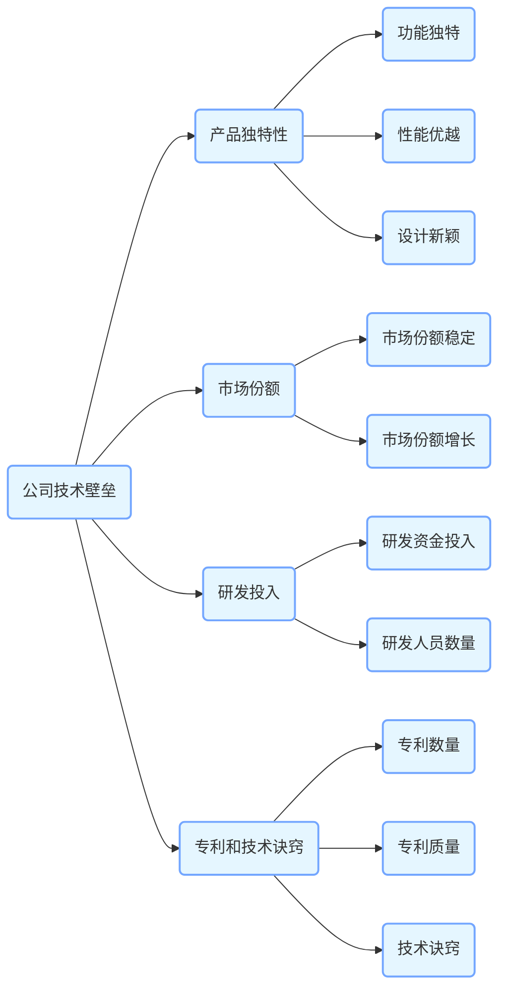

# 彼得林奇对公司技术壁垒的评估方法

> 关键词：彼得林奇、公司技术壁垒、评估方法、企业分析、投资决策

> 摘要：本文聚焦于彼得林奇对公司技术壁垒的评估方法。彼得林奇作为投资界的传奇人物，其评估方法对于投资者准确判断公司的竞争优势和长期价值具有重要意义。文章将深入剖析彼得林奇评估技术壁垒的核心概念、算法原理、数学模型等，通过项目实战案例详细解释具体应用，探讨其在实际场景中的应用，推荐相关学习资源、开发工具和论文著作，最后总结未来发展趋势与挑战，并对常见问题进行解答。

## 1. 背景介绍 
### 1.1 目的和范围
本文章的目的在于深入探讨彼得林奇评估公司技术壁垒的方法。在当今竞争激烈的商业环境中，技术壁垒是公司保持竞争优势的关键因素之一。了解彼得林奇的评估方法，有助于投资者更准确地评估公司的价值和潜力，做出更明智的投资决策。本文的范围涵盖了彼得林奇评估技术壁垒的核心概念、具体操作步骤、数学模型、实际应用案例等方面。

### 1.2 预期读者
本文预期读者包括投资者、金融分析师、企业管理者以及对商业竞争和投资策略感兴趣的人士。对于投资者来说，掌握彼得林奇的评估方法可以帮助他们筛选出具有技术优势的公司，提高投资回报率；金融分析师可以将该方法应用于公司研究和报告撰写中；企业管理者可以借鉴该方法来评估自身公司的技术竞争力，制定相应的发展战略。

### 1.3 文档结构概述
本文将按照以下结构进行阐述：首先介绍核心概念与联系，明确技术壁垒的定义和相关架构；接着讲解核心算法原理和具体操作步骤，通过Python代码进行详细说明；然后介绍数学模型和公式，并举例说明；之后通过项目实战案例展示该方法的实际应用；再探讨实际应用场景；推荐相关的工具和资源；总结未来发展趋势与挑战；最后对常见问题进行解答，并提供扩展阅读和参考资料。

### 1.4 术语表
#### 1.4.1 核心术语定义
- **技术壁垒**：指企业通过技术创新、专利保护、技术诀窍等手段形成的，使得其他企业难以模仿或超越的竞争优势。
- **彼得林奇评估方法**：彼得林奇在投资实践中总结出的一套评估公司技术壁垒的方法，主要通过对公司产品、市场、研发等方面的分析来判断技术壁垒的强弱。
- **可持续竞争优势**：企业在长期内能够保持高于行业平均水平的盈利能力和市场份额的优势。

#### 1.4.2 相关概念解释
- **专利保护**：企业通过申请专利获得对某项技术的独占权，防止其他企业在一定期限内使用该技术。
- **技术诀窍**：企业在长期的生产和研发过程中积累的未公开的技术知识和经验，这些知识和经验能够提高企业的生产效率和产品质量。
- **转换成本**：客户从使用一家企业的产品或服务转换到使用另一家企业的产品或服务时所面临的成本，包括时间成本、金钱成本、学习成本等。

#### 1.4.3 缩略词列表
- **ROE**：净资产收益率（Return on Equity），衡量企业盈利能力的指标。
- **EPS**：每股收益（Earnings Per Share），反映企业每股普通股的盈利水平。

## 2. 核心概念与联系 

### 技术壁垒的定义和重要性
技术壁垒是企业在市场竞争中形成的一种独特优势，它可以阻止竞争对手进入市场，保护企业的市场份额和利润。具有强大技术壁垒的企业通常能够在长期内保持较高的盈利能力和市场地位。例如，苹果公司通过其独特的操作系统和设计技术，形成了强大的技术壁垒，使得其他手机厂商难以与之竞争。

### 彼得林奇评估技术壁垒的核心要素
彼得林奇认为，评估公司技术壁垒需要考虑以下几个核心要素：
- **产品独特性**：公司的产品是否具有独特的功能、性能或设计，能够满足客户的特殊需求。
- **市场份额**：公司在市场中的份额是否稳定或增长，市场份额越高，说明公司的技术壁垒越强。
- **研发投入**：公司是否持续投入大量资金进行研发，以保持技术的领先地位。
- **专利和技术诀窍**：公司拥有的专利数量和质量，以及未公开的技术诀窍，是衡量技术壁垒的重要指标。

### 核心概念的架构示意图


该架构示意图展示了彼得林奇评估公司技术壁垒的核心要素及其相互关系。公司技术壁垒由产品独特性、市场份额、研发投入和专利与技术诀窍四个主要要素构成，每个要素又包含多个子要素。通过对这些要素的综合评估，可以判断公司技术壁垒的强弱。

## 3. 核心算法原理 & 具体操作步骤 

### 核心算法原理
彼得林奇评估公司技术壁垒的算法原理基于对多个因素的综合分析。可以将每个因素赋予一定的权重，然后根据公司在每个因素上的表现进行打分，最后将各因素的得分乘以相应的权重并求和，得到公司技术壁垒的综合得分。综合得分越高，说明公司的技术壁垒越强。

以下是一个简化的算法公式：
$$
\text{技术壁垒综合得分} = w_1 \times \text{产品独特性得分} + w_2 \times \text{市场份额得分} + w_3 \times \text{研发投入得分} + w_4 \times \text{专利和技术诀窍得分}
$$
其中，$w_1, w_2, w_3, w_4$ 分别是各因素的权重，且 $w_1 + w_2 + w_3 + w_4 = 1$。

### 具体操作步骤
#### 步骤1：确定各因素的权重
根据不同行业和市场环境，确定产品独特性、市场份额、研发投入和专利与技术诀窍四个因素的权重。例如，可以根据经验或专家意见，将权重设定为 $w_1 = 0.3, w_2 = 0.2, w_3 = 0.3, w_4 = 0.2$。

#### 步骤2：对每个因素进行打分
- **产品独特性得分**：根据公司产品的功能独特性、性能优越性和设计新颖性等方面进行打分，满分10分。
- **市场份额得分**：根据公司在市场中的份额大小和增长趋势进行打分，满分10分。
- **研发投入得分**：根据公司的研发资金投入和研发人员数量等方面进行打分，满分10分。
- **专利和技术诀窍得分**：根据公司拥有的专利数量、专利质量和技术诀窍的重要性等方面进行打分，满分10分。

#### 步骤3：计算技术壁垒综合得分
将各因素的得分乘以相应的权重并求和，得到公司技术壁垒的综合得分。

### Python源代码实现
```python
# 定义各因素的权重
weights = {
    "product_uniqueness": 0.3,
    "market_share": 0.2,
    "R&D_investment": 0.3,
    "patents_and_techniques": 0.2
}

# 定义各因素的得分
scores = {
    "product_uniqueness": 8,
    "market_share": 7,
    "R&D_investment": 9,
    "patents_and_techniques": 6
}

# 计算技术壁垒综合得分
total_score = 0
for factor, weight in weights.items():
    score = scores[factor]
    total_score += weight * score

print(f"公司技术壁垒综合得分: {total_score}")
```
### 代码解释
上述代码首先定义了各因素的权重和得分，然后通过循环遍历各因素，将得分乘以相应的权重并累加，最终得到公司技术壁垒的综合得分。通过这种方式，可以对公司的技术壁垒进行量化评估。

## 4. 数学模型和公式 & 详细讲解 & 举例说明 

### 数学模型
在彼得林奇的评估方法中，技术壁垒综合得分的数学模型可以表示为：
$$
S = \sum_{i=1}^{n} w_i \times s_i
$$
其中，$S$ 表示技术壁垒综合得分，$n$ 表示评估因素的数量，$w_i$ 表示第 $i$ 个因素的权重，$s_i$ 表示第 $i$ 个因素的得分。

### 详细讲解
- **权重的确定**：权重的确定需要考虑各因素在不同行业和市场环境中的重要性。例如，在高科技行业，研发投入和专利与技术诀窍的权重可能会相对较高；而在传统制造业，市场份额和产品独特性的权重可能会更重要。
- **得分的评估**：每个因素的得分需要根据具体的评估标准进行打分。评估标准可以根据行业特点和公司实际情况进行制定。例如，对于产品独特性，可以从产品的功能、性能、设计等方面进行评估；对于市场份额，可以从市场占有率、市场增长趋势等方面进行评估。

### 举例说明
假设我们要评估一家软件公司的技术壁垒，各因素的权重和得分如下：
| 因素 | 权重 | 得分 |
| ---- | ---- | ---- |
| 产品独特性 | 0.3 | 8 |
| 市场份额 | 0.2 | 7 |
| 研发投入 | 0.3 | 9 |
| 专利和技术诀窍 | 0.2 | 6 |

根据上述数学模型，该公司技术壁垒的综合得分计算如下：
$$
\begin{align*}
S &= 0.3 \times 8 + 0.2 \times 7 + 0.3 \times 9 + 0.2 \times 6 \\
&= 2.4 + 1.4 + 2.7 + 1.2 \\
&= 7.7
\end{align*}
$$
通过计算得到该公司技术壁垒的综合得分为7.7分，说明该公司具有较强的技术壁垒。

## 5. 项目实战：代码实际案例和详细解释说明 

### 5.1  开发环境搭建
在进行项目实战之前，需要搭建相应的开发环境。以下是具体的步骤：
- **安装Python**：可以从Python官方网站（https://www.python.org/downloads/）下载并安装Python 3.x版本。
- **安装必要的库**：本项目主要使用Python的基本库，无需额外安装其他库。

### 5.2  源代码详细实现和代码解读
```python
# 定义各因素的权重
weights = {
    "product_uniqueness": 0.3,
    "market_share": 0.2,
    "R&D_investment": 0.3,
    "patents_and_techniques": 0.2
}

# 定义各因素的得分函数
def get_product_uniqueness_score():
    # 这里可以根据具体的评估标准进行打分
    return 8

def get_market_share_score():
    # 这里可以根据具体的评估标准进行打分
    return 7

def get_RD_investment_score():
    # 这里可以根据具体的评估标准进行打分
    return 9

def get_patents_and_techniques_score():
    # 这里可以根据具体的评估标准进行打分
    return 6

# 获取各因素的得分
scores = {
    "product_uniqueness": get_product_uniqueness_score(),
    "market_share": get_market_share_score(),
    "R&D_investment": get_RD_investment_score(),
    "patents_and_techniques": get_patents_and_techniques_score()
}

# 计算技术壁垒综合得分
total_score = 0
for factor, weight in weights.items():
    score = scores[factor]
    total_score += weight * score

print(f"公司技术壁垒综合得分: {total_score}")
```
### 代码解读与分析
- **权重定义**：通过字典 `weights` 定义了各因素的权重，方便后续计算。
- **得分函数**：定义了四个得分函数 `get_product_uniqueness_score`、`get_market_share_score`、`get_RD_investment_score` 和 `get_patents_and_techniques_score`，用于获取各因素的得分。在实际应用中，可以根据具体的评估标准在这些函数中进行打分。
- **得分获取**：通过调用得分函数，将各因素的得分存储在字典 `scores` 中。
- **综合得分计算**：通过循环遍历各因素，将得分乘以相应的权重并累加，最终得到公司技术壁垒的综合得分。

## 6. 实际应用场景 
### 投资决策
在投资领域，彼得林奇的评估方法可以帮助投资者筛选出具有技术壁垒的公司。投资者可以通过对公司技术壁垒的评估，判断公司的长期竞争优势和盈利能力，从而做出更明智的投资决策。例如，投资者可以选择技术壁垒较强的公司进行长期投资，以获得更高的投资回报率。

### 企业战略规划
企业管理者可以使用彼得林奇的评估方法来评估自身公司的技术竞争力，制定相应的发展战略。通过分析公司在产品独特性、市场份额、研发投入和专利与技术诀窍等方面的表现，企业管理者可以发现公司的优势和不足，从而有针对性地进行改进和提升。例如，如果公司在研发投入方面不足，企业管理者可以加大研发资金投入，提高公司的技术创新能力。

### 行业分析
分析师可以使用该评估方法对整个行业进行分析，了解行业内各公司的技术壁垒情况。通过比较不同公司的技术壁垒得分，分析师可以发现行业内的领先企业和潜在的竞争对手，为行业研究和投资建议提供参考。

## 7. 工具和资源推荐
### 7.1 学习资源推荐
#### 7.1.1 书籍推荐
- 《彼得林奇的成功投资》：彼得林奇的经典著作，详细介绍了他的投资理念和方法，包括对公司技术壁垒的评估方法。
- 《聪明的投资者》：本杰明·格雷厄姆的著作，被誉为投资界的圣经，对价值投资和公司分析有深入的阐述。
- 《创新者的窘境》：克莱顿·克里斯坦森的著作，探讨了企业在技术创新和市场竞争中的困境和应对策略。

#### 7.1.2 在线课程
- Coursera上的“投资学原理”课程：介绍了投资的基本原理和方法，包括公司分析和估值。
- edX上的“金融市场”课程：涵盖了金融市场的各个方面，包括股票投资和公司分析。

#### 7.1.3 技术博客和网站
- Seeking Alpha：提供专业的金融分析和投资建议，有很多关于公司分析和技术壁垒评估的文章。
- Bloomberg：全球知名的财经媒体，提供实时的金融市场数据和分析。

### 7.2 开发工具框架推荐
#### 7.2.1 IDE和编辑器
- PyCharm：功能强大的Python集成开发环境，适合进行Python代码的开发和调试。
- Visual Studio Code：轻量级的代码编辑器，支持多种编程语言，具有丰富的插件扩展功能。

#### 7.2.2 调试和性能分析工具
- PDB：Python自带的调试工具，可以帮助开发者定位和解决代码中的问题。
- cProfile：Python的性能分析工具，可以分析代码的执行时间和内存使用情况。

#### 7.2.3 相关框架和库
- Pandas：用于数据处理和分析的Python库，提供了丰富的数据结构和数据分析工具。
- NumPy：Python的数值计算库，提供了高效的数组操作和数学函数。

### 7.3 相关论文著作推荐
#### 7.3.1 经典论文
- “The Competitive Advantage of Nations” by Michael Porter：探讨了国家和企业的竞争优势，提出了著名的“波特五力模型”。
- “Technological Innovation and Market Structure” by Joseph Schumpeter：研究了技术创新与市场结构的关系，提出了“创造性破坏”的概念。

#### 7.3.2 最新研究成果
- 可以关注顶级学术期刊如《Journal of Financial Economics》、《Management Science》等上的相关研究论文，了解最新的公司分析和技术壁垒评估方法。

#### 7.3.3 应用案例分析
- 可以参考一些知名咨询公司的研究报告，如麦肯锡、波士顿咨询等，了解实际企业在技术壁垒评估和竞争战略制定方面的应用案例。

## 8. 总结：未来发展趋势与挑战
### 未来发展趋势
- **技术创新加速**：随着科技的不断进步，技术创新的速度将越来越快。公司需要不断投入研发，提高技术创新能力，以保持和增强技术壁垒。
- **数据驱动的评估方法**：随着大数据和人工智能技术的发展，未来的评估方法将更加数据驱动。通过收集和分析大量的企业数据，可以更准确地评估公司的技术壁垒。
- **跨行业融合**：不同行业之间的融合将越来越频繁，公司的技术壁垒将不再局限于单一行业。企业需要具备跨行业的技术创新能力，以应对日益激烈的市场竞争。

### 挑战
- **技术更新换代快**：技术的快速更新换代使得公司的技术壁垒容易受到挑战。公司需要不断投入研发，跟上技术发展的步伐，否则技术壁垒可能会很快消失。
- **知识产权保护困难**：在全球范围内，知识产权保护仍然面临着诸多挑战。公司的专利和技术诀窍可能会被侵权，这将削弱公司的技术壁垒。
- **竞争加剧**：随着市场竞争的加剧，越来越多的公司开始重视技术创新和技术壁垒的建设。这使得公司在建立和维护技术壁垒方面面临更大的挑战。

## 9. 附录：常见问题与解答
### 问题1：如何确定各因素的权重？
答：各因素的权重需要根据不同行业和市场环境进行确定。可以参考行业研究报告、专家意见或历史数据，结合公司的实际情况进行调整。

### 问题2：得分的评估标准如何制定？
答：得分的评估标准需要根据具体的因素和行业特点进行制定。可以从多个维度对每个因素进行评估，例如对于产品独特性，可以从功能、性能、设计等方面进行评估；对于市场份额，可以从市场占有率、市场增长趋势等方面进行评估。

### 问题3：该评估方法是否适用于所有行业？
答：该评估方法适用于大多数行业，但在不同行业中的应用可能会有所不同。例如，在高科技行业，研发投入和专利与技术诀窍的权重可能会相对较高；而在传统制造业，市场份额和产品独特性的权重可能会更重要。

## 10. 扩展阅读 & 参考资料
- 《彼得林奇的成功投资》，彼得·林奇著
- 《聪明的投资者》，本杰明·格雷厄姆著
- 《创新者的窘境》，克莱顿·克里斯坦森著
- Seeking Alpha网站（https://seekingalpha.com/）
- Bloomberg网站（https://www.bloomberg.com/）

作者：AI天才研究院/AI Genius Institute & 禅与计算机程序设计艺术 /Zen And The Art of Computer Programming