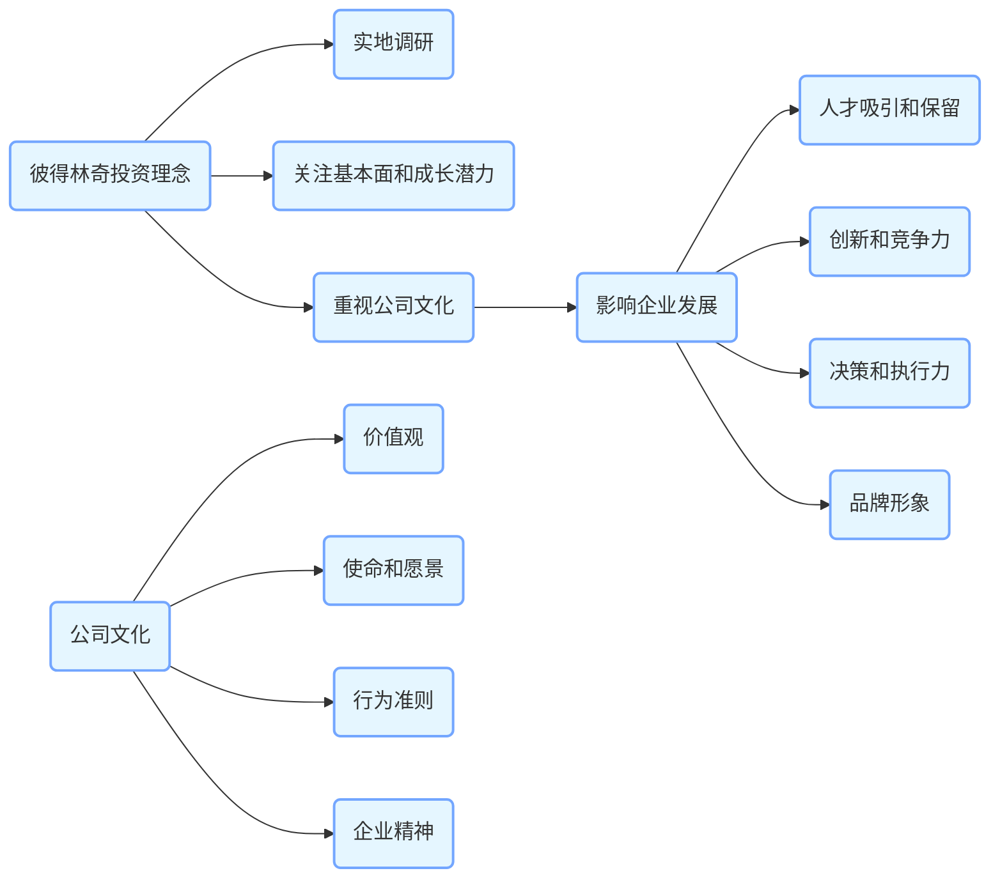

# 彼得林奇对公司文化的重视

> 关键词：彼得林奇、公司文化、投资理念、企业发展、文化评估

> 摘要：本文深入探讨了彼得林奇对公司文化的重视。彼得林奇作为投资界的传奇人物，其投资理念不仅关注公司的财务数据和业绩表现，还极为看重公司文化。文章将分析彼得林奇重视公司文化的背景和原因，阐述公司文化的核心概念及其与企业发展的联系，介绍评估公司文化的方法和步骤，探讨相关数学模型和公式在其中的应用，通过项目实战案例展示如何在实际投资中考虑公司文化因素，列举公司文化在不同场景下的实际应用，推荐与公司文化和投资相关的工具和资源，总结未来公司文化在投资领域的发展趋势与挑战，解答常见问题，并提供扩展阅读和参考资料，旨在帮助读者全面理解彼得林奇重视公司文化这一重要观点及其在投资实践中的价值。

## 1. 背景介绍 
### 1.1 目的和范围
本文的目的是全面剖析彼得林奇对公司文化的重视这一现象。具体来说，要深入理解彼得林奇为何将公司文化纳入其投资决策的重要考量因素，以及公司文化如何影响企业的长期发展和投资价值。范围涵盖彼得林奇的投资理念和实践、公司文化的概念和要素、评估公司文化的方法和工具，以及公司文化在不同行业和企业中的应用等方面。

### 1.2 预期读者
本文预期读者包括对投资领域感兴趣的个人投资者、金融从业者、企业管理者以及研究公司文化和投资关系的学者。通过阅读本文，读者可以学习到彼得林奇独特的投资视角，了解公司文化在投资决策中的重要性，以及如何评估和利用公司文化进行投资和企业管理。

### 1.3 文档结构概述
本文将按照以下结构展开：首先介绍彼得林奇重视公司文化的背景，包括他的投资成就和理念；接着阐述公司文化的核心概念和要素，以及它与企业发展的联系；然后详细讲解评估公司文化的核心算法原理和具体操作步骤，结合数学模型和公式进行说明；通过项目实战案例展示如何在实际投资中考虑公司文化因素；列举公司文化在不同场景下的实际应用；推荐与公司文化和投资相关的工具和资源；总结未来公司文化在投资领域的发展趋势与挑战；解答常见问题；最后提供扩展阅读和参考资料。

### 1.4 术语表
#### 1.4.1 核心术语定义
- **彼得林奇**：美国著名的投资家，曾任富达公司麦哲伦基金的基金经理，创造了辉煌的投资业绩，其投资理念和方法对全球投资者产生了深远影响。
- **公司文化**：指企业在长期的发展过程中形成的共同价值观、信仰、行为准则和做事方式，它影响着企业的决策、员工的行为和企业的整体绩效。
- **投资理念**：投资者在进行投资决策时所遵循的基本原则和方法，包括对投资目标、风险偏好、投资策略等方面的看法。
- **企业发展**：指企业在规模、市场份额、盈利能力等方面的增长和进步，以及在技术创新、管理水平等方面的提升。

#### 1.4.2 相关概念解释
- **企业文化的层次**：包括物质文化、行为文化、制度文化和精神文化四个层次。物质文化是企业文化的外在表现，如企业的建筑、产品等；行为文化是企业员工的行为方式和习惯；制度文化是企业的规章制度和管理体系；精神文化是企业文化的核心，包括企业的价值观、使命、愿景等。
- **企业文化的作用**：企业文化可以增强企业的凝聚力和向心力，提高员工的工作积极性和创造力，促进企业的创新和发展，提升企业的品牌形象和市场竞争力。
- **投资决策**：投资者根据自己的投资目标、风险偏好和市场情况，选择投资对象和投资方式的过程。

#### 1.4.3 缩略词列表
本文暂无缩略词。

## 2. 核心概念与联系 
### 2.1 彼得林奇的投资理念
彼得林奇是投资界的传奇人物，他在担任富达公司麦哲伦基金的基金经理期间，创造了惊人的投资业绩。他的投资理念强调实地调研、关注企业的基本面和成长潜力。他认为投资者应该像研究自己的工作一样研究股票，了解企业的业务模式、市场竞争力和管理层的能力。

彼得林奇并不局限于传统的财务指标分析，他非常重视公司文化在投资决策中的作用。他认为一个具有良好公司文化的企业，能够吸引和留住优秀的人才，激发员工的创造力和积极性，从而在市场竞争中取得优势。

### 2.2 公司文化的概念和要素
公司文化是企业在长期的发展过程中形成的共同价值观、信仰、行为准则和做事方式。它包括以下几个要素：
- **价值观**：企业所倡导的核心价值观念，如诚信、创新、团队合作等。价值观是公司文化的核心，它决定了企业的行为方向和决策原则。
- **使命和愿景**：企业的使命是指企业存在的目的和意义，愿景是指企业未来的发展目标和方向。使命和愿景为企业的发展提供了动力和指引。
- **行为准则**：企业对员工行为的规范和要求，如职业道德、工作纪律等。行为准则有助于维护企业的正常秩序和形象。
- **企业精神**：企业在长期的发展过程中形成的独特精神风貌，如拼搏精神、奉献精神等。企业精神能够激发员工的工作热情和创造力。

### 2.3 公司文化与企业发展的联系
公司文化与企业发展密切相关，它对企业的各个方面都有着重要的影响：
- **人才吸引和保留**：一个具有良好公司文化的企业，能够吸引优秀的人才加入，并让员工感受到工作的意义和价值，从而提高员工的忠诚度和稳定性。
- **创新和竞争力**：积极的公司文化鼓励员工创新和尝试新的事物，有助于企业在市场竞争中不断推出新产品和新服务，提高企业的竞争力。
- **决策和执行力**：公司文化影响着企业的决策方式和执行效率。一个具有明确价值观和行为准则的企业，能够做出更加明智的决策，并确保决策的有效执行。
- **品牌形象**：公司文化是企业品牌形象的重要组成部分。一个具有良好公司文化的企业，能够赢得消费者的信任和认可，提升企业的品牌价值。

### 2.4 文本示意图
```plaintext
彼得林奇投资理念
├── 实地调研
├── 关注基本面和成长潜力
└── 重视公司文化

公司文化
├── 价值观
├── 使命和愿景
├── 行为准则
└── 企业精神

公司文化与企业发展联系
├── 人才吸引和保留
├── 创新和竞争力
├── 决策和执行力
└── 品牌形象
```

### 2.5 Mermaid 流程图


## 3. 核心算法原理 & 具体操作步骤 
### 3.1 评估公司文化的核心算法原理
虽然目前没有一个精确的数学算法可以完全量化公司文化，但我们可以通过构建一些指标体系来评估公司文化。以下是一个简单的思路，通过计算多个维度的得分来综合评估公司文化。

假设我们从价值观认同、员工满意度、创新氛围和团队合作四个维度来评估公司文化。每个维度都有相应的指标，我们可以给每个指标分配一个权重，然后根据实际情况对每个指标进行打分，最后通过加权平均的方法计算出公司文化的综合得分。

### 3.2 Python 源代码实现
```python
# 定义每个维度的权重
weights = {
    "价值观认同": 0.3,
    "员工满意度": 0.25,
    "创新氛围": 0.2,
    "团队合作": 0.25
}

# 定义每个维度下的指标及得分
dimensions = {
    "价值观认同": {
        "员工对价值观的理解": 8,
        "价值观在决策中的体现": 7
    },
    "员工满意度": {
        "工作环境满意度": 7,
        "薪酬福利满意度": 6
    },
    "创新氛围": {
        "创新奖励制度": 7,
        "员工创新提案数量": 6
    },
    "团队合作": {
        "跨部门合作效率": 8,
        "团队凝聚力": 7
    }
}

# 计算每个维度的得分
dimension_scores = {}
for dimension, indicators in dimensions.items():
    total_score = 0
    num_indicators = len(indicators)
    for score in indicators.values():
        total_score += score
    dimension_scores[dimension] = total_score / num_indicators

# 计算公司文化的综合得分
overall_score = 0
for dimension, score in dimension_scores.items():
    overall_score += score * weights[dimension]

print(f"公司文化综合得分: {overall_score}")
```

### 3.3 具体操作步骤
1. **确定评估维度和指标**：根据公司的特点和需求，确定评估公司文化的维度和相应的指标。例如，除了上述提到的维度，还可以考虑客户导向、社会责任等维度。
2. **分配权重**：根据每个维度的重要性，给每个维度分配相应的权重。权重的分配可以根据经验、专家意见或历史数据来确定。
3. **收集数据**：通过问卷调查、访谈、观察等方式收集每个指标的数据。例如，可以设计一份员工调查问卷，了解员工对价值观的理解、工作环境满意度等方面的情况。
4. **打分**：根据收集到的数据，对每个指标进行打分。打分可以采用 1 - 10 分的评分标准，1 分表示最差，10 分表示最好。
5. **计算维度得分**：对于每个维度，将该维度下所有指标的得分进行平均，得到该维度的得分。
6. **计算综合得分**：将每个维度的得分乘以其对应的权重，然后将结果相加，得到公司文化的综合得分。

## 4. 数学模型和公式 & 详细讲解 & 举例说明 
### 4.1 数学模型
假设我们有 $n$ 个评估维度，分别为 $D_1, D_2, \cdots, D_n$，每个维度的权重为 $w_1, w_2, \cdots, w_n$，且 $\sum_{i = 1}^{n} w_i = 1$。每个维度下有 $m_i$ 个指标，指标得分分别为 $x_{i1}, x_{i2}, \cdots, x_{im_i}$。

首先，计算每个维度的得分 $S_i$：
$$S_i = \frac{\sum_{j = 1}^{m_i} x_{ij}}{m_i}$$

然后，计算公司文化的综合得分 $S$：
$$S = \sum_{i = 1}^{n} w_i S_i$$

### 4.2 详细讲解
- **维度得分计算**：对于每个维度，将该维度下所有指标的得分相加，然后除以指标的数量，得到该维度的平均得分。这一步的目的是综合考虑该维度下各个指标的表现。
- **综合得分计算**：将每个维度的得分乘以其对应的权重，然后将所有维度的结果相加，得到公司文化的综合得分。权重的作用是体现每个维度在整体评估中的重要性。

### 4.3 举例说明
假设我们按照上述的四个维度（价值观认同、员工满意度、创新氛围、团队合作）来评估一家公司的文化，权重分别为 $w_1 = 0.3$，$w_2 = 0.25$，$w_3 = 0.2$，$w_4 = 0.25$。

- **价值观认同维度**：有两个指标，得分分别为 $x_{11} = 8$，$x_{12} = 7$，则该维度的得分 $S_1$ 为：
$$S_1 = \frac{8 + 7}{2} = 7.5$$

- **员工满意度维度**：有两个指标，得分分别为 $x_{21} = 7$，$x_{22} = 6$，则该维度的得分 $S_2$ 为：
$$S_2 = \frac{7 + 6}{2} = 6.5$$

- **创新氛围维度**：有两个指标，得分分别为 $x_{31} = 7$，$x_{32} = 6$，则该维度的得分 $S_3$ 为：
$$S_3 = \frac{7 + 6}{2} = 6.5$$

- **团队合作维度**：有两个指标，得分分别为 $x_{41} = 8$，$x_{42} = 7$，则该维度的得分 $S_4$ 为：
$$S_4 = \frac{8 + 7}{2} = 7.5$$

最后，计算公司文化的综合得分 $S$：
$$S = 0.3 \times 7.5 + 0.25 \times 6.5 + 0.2 \times 6.5 + 0.25 \times 7.5$$
$$S = 2.25 + 1.625 + 1.3 + 1.875 = 7.05$$

## 5. 项目实战：代码实际案例和详细解释说明 
### 5.1 开发环境搭建
为了运行上述的 Python 代码，你需要搭建以下开发环境：
1. **Python 安装**：从 Python 官方网站（https://www.python.org/downloads/）下载并安装 Python 3.x 版本。
2. **代码编辑器**：可以选择 PyCharm、VS Code 等流行的代码编辑器。这里以 VS Code 为例，下载并安装 VS Code（https://code.visualstudio.com/），然后安装 Python 扩展。

### 5.2 源代码详细实现和代码解读
```python
# 定义每个维度的权重
weights = {
    "价值观认同": 0.3,
    "员工满意度": 0.25,
    "创新氛围": 0.2,
    "团队合作": 0.25
}

# 定义每个维度下的指标及得分
dimensions = {
    "价值观认同": {
        "员工对价值观的理解": 8,
        "价值观在决策中的体现": 7
    },
    "员工满意度": {
        "工作环境满意度": 7,
        "薪酬福利满意度": 6
    },
    "创新氛围": {
        "创新奖励制度": 7,
        "员工创新提案数量": 6
    },
    "团队合作": {
        "跨部门合作效率": 8,
        "团队凝聚力": 7
    }
}

# 计算每个维度的得分
dimension_scores = {}
for dimension, indicators in dimensions.items():
    total_score = 0
    num_indicators = len(indicators)
    for score in indicators.values():
        total_score += score
    dimension_scores[dimension] = total_score / num_indicators

# 计算公司文化的综合得分
overall_score = 0
for dimension, score in dimension_scores.items():
    overall_score += score * weights[dimension]

print(f"公司文化综合得分: {overall_score}")
```

### 代码解读
1. **权重定义**：使用字典 `weights` 定义了每个维度的权重，方便后续计算综合得分时使用。
2. **指标和得分定义**：使用嵌套字典 `dimensions` 定义了每个维度下的指标及其得分。这样的结构可以清晰地表示每个维度的具体情况。
3. **维度得分计算**：通过遍历 `dimensions` 字典，计算每个维度下所有指标的总分，然后除以指标数量得到该维度的平均得分，并将结果存储在 `dimension_scores` 字典中。
4. **综合得分计算**：遍历 `dimension_scores` 字典，将每个维度的得分乘以其对应的权重，然后累加得到公司文化的综合得分。
5. **结果输出**：使用 `print` 函数输出公司文化的综合得分。

### 5.3 代码解读与分析
通过上述代码，我们可以对公司文化进行一个初步的量化评估。但需要注意的是，这个评估结果只是一个参考，实际的公司文化评估还需要结合更多的定性分析和实地调研。

在实际应用中，我们可以根据不同的需求对代码进行扩展。例如，可以增加更多的评估维度和指标，动态调整权重，或者将数据存储在数据库中进行管理。

## 6. 实际应用场景 
### 6.1 投资决策
对于投资者来说，公司文化是评估企业投资价值的重要因素之一。彼得林奇在进行投资决策时，会深入了解企业的公司文化。一个具有良好公司文化的企业，通常具有更强的竞争力和发展潜力，能够为投资者带来更高的回报。例如，一家注重创新和团队合作的科技公司，可能会不断推出新产品，开拓新市场，从而提高企业的盈利能力和市场价值。

### 6.2 企业并购
在企业并购过程中，公司文化的兼容性也是一个关键问题。如果两家企业的公司文化差异过大，可能会导致并购后整合困难，影响企业的正常运营。因此，在进行并购之前，需要对目标企业的公司文化进行评估，确保双方的文化能够相互融合。例如，一家传统制造业企业并购一家互联网科技企业，如果双方在价值观、管理方式等方面存在较大差异，可能会导致员工冲突、决策效率低下等问题。

### 6.3 员工招聘和留用
公司文化对员工的招聘和留用有着重要的影响。一个具有积极向上、团结协作公司文化的企业，能够吸引优秀的人才加入，并提高员工的忠诚度和工作满意度。例如，一家强调创新和员工发展的企业，会为员工提供更多的培训和晋升机会，让员工感受到自己的价值和成长空间，从而愿意长期留在企业工作。

### 6.4 企业战略制定
公司文化是企业战略制定的重要依据之一。企业的战略目标和发展方向应该与公司文化相契合。例如，一家以创新为核心价值观的企业，在制定战略时会更加注重研发投入和新产品开发，以保持企业的创新优势。

## 7. 工具和资源推荐
### 7.1 学习资源推荐
#### 7.1.1 书籍推荐
- 《彼得林奇的成功投资》：彼得林奇的经典著作，详细介绍了他的投资理念和方法，其中包括对公司文化的重视和分析。
- 《企业文化与经营业绩》：这本书通过大量的案例研究，阐述了企业文化对企业经营业绩的影响，为理解公司文化的重要性提供了理论支持。
- 《基业长青》：探讨了那些具有长期竞争优势的企业的成功秘诀，其中公司文化是一个重要的因素。

#### 7.1.2 在线课程
- Coursera 上的“企业文化与领导力”课程：由知名教授授课，深入讲解了企业文化的理论和实践，以及如何通过企业文化提升企业的竞争力。
- edX 上的“投资学原理”课程：涵盖了投资领域的基本知识和方法，包括如何评估企业的投资价值，其中也涉及到公司文化的评估。

#### 7.1.3 技术博客和网站
- Seeking Alpha：一个专业的投资研究网站，提供了大量关于企业分析和投资策略的文章，其中不乏对公司文化的分析和讨论。
- Harvard Business Review：哈佛商业评论的网站，发布了许多关于企业管理和企业文化的前沿研究和案例分析。

### 7.2 开发工具框架推荐
#### 7.2.1 IDE和编辑器
- PyCharm：一款专业的 Python 集成开发环境，提供了丰富的代码编辑、调试和项目管理功能，适合开发与公司文化评估相关的 Python 程序。
- VS Code：一款轻量级的代码编辑器，支持多种编程语言，具有丰富的插件生态系统，可以根据需要安装 Python 相关的插件进行开发。

#### 7.2.2 调试和性能分析工具
- PDB：Python 自带的调试器，可以帮助开发者定位代码中的问题和错误。
- cProfile：Python 标准库中的性能分析工具，可以分析代码的运行时间和函数调用情况，帮助优化代码性能。

#### 7.2.3 相关框架和库
- Pandas：一个强大的数据分析库，可用于处理和分析公司文化评估过程中收集到的数据。
- Matplotlib：一个常用的绘图库，可以将评估结果以图表的形式直观地展示出来。

### 7.3 相关论文著作推荐
#### 7.3.1 经典论文
- “Corporate Culture and Economic Performance”：这篇论文探讨了企业文化与企业经济绩效之间的关系，通过实证研究证明了良好的企业文化对企业绩效的积极影响。
- “The Strong Culture Hypothesis: A Conceptual Analysis”：对强文化假说进行了深入的概念分析，阐述了强文化对企业的重要性和作用机制。

#### 7.3.2 最新研究成果
- 近年来，关于公司文化与企业创新、社会责任等方面的研究不断涌现。可以通过学术数据库如 IEEE Xplore、ACM Digital Library 等搜索相关的最新研究论文。

#### 7.3.3 应用案例分析
- 许多商业杂志和研究机构会发布一些关于公司文化应用案例的分析报告。例如，麦肯锡公司的研究报告中经常会涉及到企业通过塑造良好的公司文化来提升竞争力的案例。

## 8. 总结：未来发展趋势与挑战
### 8.1 未来发展趋势
- **数字化转型对公司文化的影响**：随着数字化技术的不断发展，企业的运营模式和工作方式正在发生深刻的变化。未来，公司文化需要适应数字化转型的需求，鼓励员工具备数字化技能和创新思维，促进企业的数字化创新和发展。
- **多元化和包容性文化的重要性**：在全球化的背景下，企业面临着更加多元化的员工队伍和市场环境。未来，公司文化将更加注重多元化和包容性，尊重不同员工的背景和观点，激发员工的创造力和团队合作精神。
- **公司文化与社会责任的融合**：社会对企业的社会责任要求越来越高，未来的公司文化将更加注重与社会责任的融合。企业将把社会责任纳入公司的价值观和使命中，通过积极履行社会责任来提升企业的品牌形象和社会影响力。

### 8.2 挑战
- **文化变革的难度**：改变和塑造公司文化是一个长期而艰巨的过程，需要企业高层的坚定决心和全体员工的积极参与。在文化变革过程中，可能会遇到来自员工的阻力和传统观念的束缚。
- **文化评估的准确性**：目前，公司文化的评估还缺乏统一的标准和方法，评估结果的准确性和可靠性有待提高。如何建立科学、客观、有效的公司文化评估体系是未来需要解决的一个重要问题。
- **文化的传承和发展**：随着企业的发展和人员的流动，如何保持公司文化的传承和发展是一个挑战。企业需要建立有效的文化传承机制，确保新员工能够融入公司文化，同时不断创新和发展公司文化。

## 9. 附录：常见问题与解答
### 9.1 如何判断一个企业的公司文化是否良好？
可以从多个方面进行判断，如员工的工作态度和积极性、企业的创新能力、团队合作氛围、客户满意度等。也可以通过与员工交流、实地考察、分析企业的业绩表现等方式来了解企业的公司文化。

### 9.2 公司文化对企业的短期业绩有影响吗？
公司文化对企业的短期业绩可能没有直接的显著影响，但从长期来看，良好的公司文化能够提高员工的工作效率和创新能力，增强企业的竞争力，从而对企业的业绩产生积极的影响。

### 9.3 如何在投资中考虑公司文化因素？
投资者可以通过研究企业的历史、管理层的言论和行为、员工的评价等方式来了解企业的公司文化。同时，可以关注企业在创新、人才培养、社会责任等方面的表现，将公司文化纳入投资决策的综合考量因素中。

### 9.4 公司文化可以复制吗？
公司文化是企业在特定的历史、环境和发展过程中形成的，具有一定的独特性，很难完全复制。但企业可以借鉴其他优秀企业的文化经验，结合自身的实际情况，塑造适合自己的公司文化。

## 10. 扩展阅读 & 参考资料
### 扩展阅读
- 《从优秀到卓越》：探讨了企业如何从优秀走向卓越的秘诀，其中公司文化是一个重要的方面。
- 《卓有成效的管理者》：虽然主要关注管理者的效能，但其中也涉及到了企业文化对管理的影响。

### 参考资料
- 彼得林奇的相关著作和访谈记录。
- 国内外关于公司文化和投资的学术论文和研究报告。
- 企业的年报、公告和官方网站上的信息。

作者：AI天才研究院/AI Genius Institute & 禅与计算机程序设计艺术 /Zen And The Art of Computer Programming