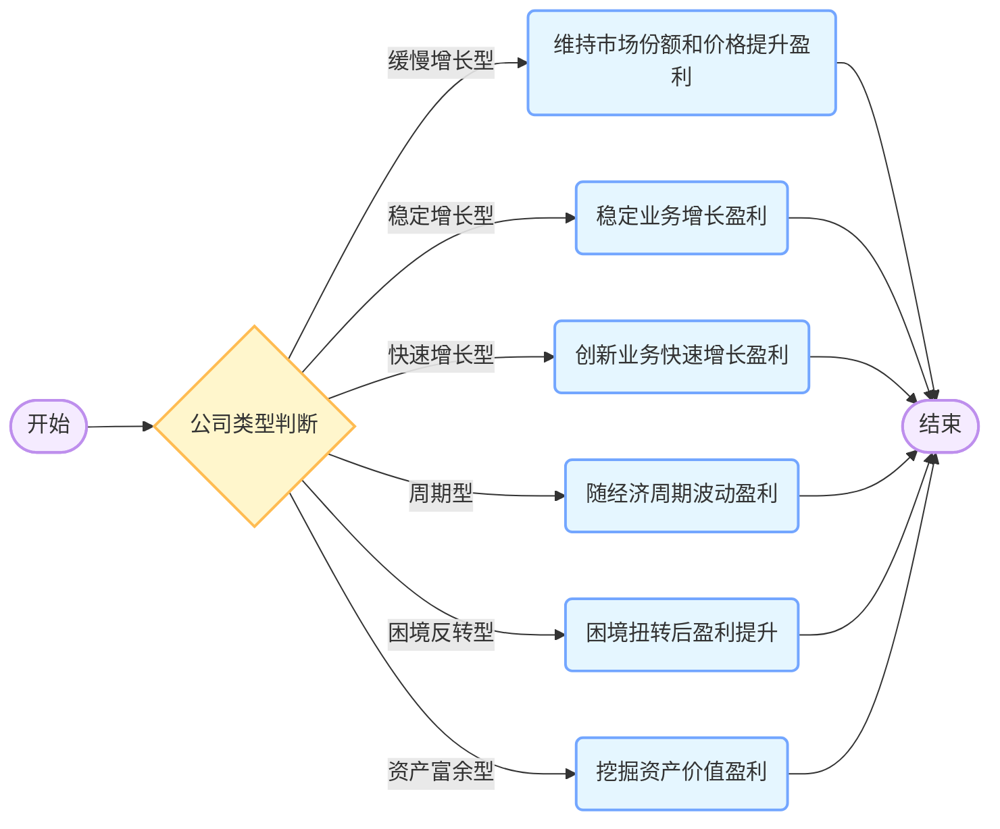

# 彼得林奇对公司盈利模式的分析

> 关键词：彼得林奇、公司盈利模式、投资分析、成长型公司、困境反转型公司

> 摘要：本文深入探讨了彼得林奇对公司盈利模式的分析方法。彼得林奇作为投资界的传奇人物，其对公司盈利模式的独特见解和分析技巧为投资者提供了宝贵的思路。文章从背景介绍入手，阐述了研究目的和范围、预期读者等内容。接着详细解析了核心概念，包括不同类型公司的盈利模式特点，并配以流程图展示。核心算法原理部分以 Python 代码模拟分析过程，同时给出数学模型和公式进行定量说明。通过项目实战，结合实际案例详细解读代码实现。此外，还探讨了实际应用场景，推荐了相关的学习资源、开发工具框架和论文著作。最后总结了未来发展趋势与挑战，解答常见问题并提供扩展阅读和参考资料，旨在帮助读者全面理解彼得林奇对公司盈利模式的分析方法，提升投资分析能力。

## 1. 背景介绍 
### 1.1 目的和范围
本研究的目的在于深入剖析彼得林奇对公司盈利模式的分析方法，为投资者提供一套系统且实用的投资分析框架。通过研究彼得林奇的投资理念和方法，我们能够更好地理解如何评估不同公司的盈利潜力，从而做出更明智的投资决策。研究范围涵盖了彼得林奇所关注的各类公司，包括成长型公司、稳定型公司、困境反转型公司等，分析这些公司盈利模式的特点、影响因素以及评估方法。

### 1.2 预期读者
本文预期读者主要包括投资者、金融分析师、投资爱好者以及对公司财务分析和投资策略感兴趣的人士。无论是专业投资者希望提升投资分析能力，还是普通投资者希望了解如何挑选优质股票，都能从本文中获得有价值的信息和启示。

### 1.3 文档结构概述
本文将按照以下结构展开：首先介绍核心概念，阐述不同类型公司盈利模式的特点和相互联系；接着讲解核心算法原理，并用 Python 代码详细说明分析过程；然后给出数学模型和公式，对盈利模式分析进行定量分析；通过项目实战，结合实际案例展示如何应用这些方法进行公司盈利模式分析；探讨实际应用场景，说明这些分析方法在不同投资场景中的应用；推荐相关的学习资源、开发工具框架和论文著作；最后总结未来发展趋势与挑战，解答常见问题并提供扩展阅读和参考资料。

### 1.4 术语表
#### 1.4.1 核心术语定义
- **盈利模式**：指企业在市场竞争中逐步形成的以实现盈利为目标的商务结构及其对应的业务结构。商务结构主要包括企业外部所选择的交易对象、交易内容、交易规模、交易方式、交易渠道、交易环境、交易对手等商务内容及其时空结构，业务结构主要包括企业内部资源配置和核心能力。
- **成长型公司**：指那些销售额和利润额持续增长，并且其增长速度快于整个国家及其所在行业的公司。这类公司通常具有创新能力、市场份额不断扩大等特点。
- **稳定型公司**：指业务相对成熟、市场份额稳定、盈利水平较为平稳的公司。这类公司一般处于行业的成熟期，具有较强的抗风险能力。
- **困境反转型公司**：指由于各种原因（如经营不善、行业周期等）陷入困境，但具有扭转困境潜力的公司。一旦公司成功实现转型，其股价可能会大幅上涨。

#### 1.4.2 相关概念解释
- **PEG 比率**：即市盈率相对盈利增长比率，是用公司的市盈率除以公司的盈利增长速度。PEG 比率可以帮助投资者判断股票的估值是否合理，当 PEG 比率小于 1 时，通常认为股票具有投资价值。
- **自由现金流**：指企业经营活动产生的现金流量扣除资本性支出的差额。自由现金流反映了企业实际可支配的现金，是衡量企业财务健康状况和盈利能力的重要指标。

#### 1.4.3 缩略词列表
- **PEG**：Price/Earnings to Growth Ratio（市盈率相对盈利增长比率）
- **FCF**：Free Cash Flow（自由现金流）

## 2. 核心概念与联系 

彼得林奇将公司分为六种类型，分别是缓慢增长型、稳定增长型、快速增长型、周期型、困境反转型和资产富余型。不同类型的公司具有不同的盈利模式特点，下面我们来详细分析。

### 缓慢增长型公司
这类公司通常是大型、成熟的企业，行业增长缓慢。它们的盈利主要来源于市场份额的维持和产品价格的稳定提升。例如，一些传统的公用事业公司，如电力公司、自来水公司等，其业务增长相对缓慢，但具有稳定的现金流和股息分配。

### 稳定增长型公司
稳定增长型公司的销售额和利润以较为稳定的速度增长。它们通常具有强大的品牌、广泛的市场渠道和稳定的客户群体。例如，可口可乐公司，凭借其全球知名的品牌和庞大的销售网络，多年来保持着稳定的盈利增长。

### 快速增长型公司
快速增长型公司是彼得林奇最为关注的类型之一。这类公司通常处于新兴行业或具有创新业务模式，销售额和利润以每年 20% - 50%甚至更高的速度增长。例如，科技行业的一些初创公司，如早期的苹果公司、亚马逊公司等，通过不断推出创新产品和服务，实现了快速的盈利增长。

### 周期型公司
周期型公司的盈利与经济周期密切相关。在经济繁荣时期，它们的销售额和利润会大幅增长；而在经济衰退时期，它们的业绩则会大幅下滑。例如，钢铁、汽车、化工等行业的公司都属于周期型公司。

### 困境反转型公司
困境反转型公司由于各种原因陷入困境，但具有扭转困境的潜力。例如，公司可能因为管理层失误、行业竞争加剧、突发事件等原因导致业绩下滑，但通过重组、转型等措施，有可能实现盈利的大幅提升。例如，苹果公司在 1997 年濒临破产，但在乔布斯回归后，通过推出一系列创新产品，实现了困境反转。

### 资产富余型公司
资产富余型公司拥有大量的资产，但这些资产的价值可能未被市场充分认识。例如，一些拥有大量房地产、矿产资源或子公司股权的公司，其资产价值可能远高于公司的市值。投资者可以通过挖掘这些资产的价值来获得投资回报。

下面是这些类型公司盈利模式关系的 Mermaid 流程图：


## 3. 核心算法原理 & 具体操作步骤 

### 核心算法原理
彼得林奇在分析公司盈利模式时，会综合考虑多个因素，如市盈率、盈利增长率、自由现金流等。其中，PEG 比率是一个重要的指标，它可以帮助投资者判断股票的估值是否合理。PEG 比率的计算公式为：

$$PEG = \frac{PE}{g}$$

其中，$PE$ 是市盈率，$g$ 是盈利增长率。

### 具体操作步骤
1. **收集数据**：收集公司的财务报表，包括利润表、资产负债表和现金流量表，获取市盈率、盈利增长率、自由现金流等数据。
2. **计算 PEG 比率**：根据上述公式计算公司的 PEG 比率。
3. **评估 PEG 比率**：一般来说，PEG 比率小于 1 表示股票具有投资价值；PEG 比率大于 1 表示股票可能被高估。
4. **综合分析**：除了 PEG 比率，还需要综合考虑公司的行业地位、竞争优势、管理层能力等因素，做出投资决策。

下面是用 Python 实现 PEG 比率计算的代码：
```python
def calculate_peg(pe_ratio, growth_rate):
    """
    计算 PEG 比率
    :param pe_ratio: 市盈率
    :param growth_rate: 盈利增长率
    :return: PEG 比率
    """
    if growth_rate == 0:
        return float('inf')
    return pe_ratio / growth_rate

# 示例数据
pe_ratio = 20
growth_rate = 0.2

# 计算 PEG 比率
peg = calculate_peg(pe_ratio, growth_rate)
print(f"PEG 比率: {peg}")
```
在上述代码中，定义了一个 `calculate_peg` 函数，用于计算 PEG 比率。如果盈利增长率为 0，则返回无穷大。然后给出了示例数据，调用 `calculate_peg` 函数计算 PEG 比率并打印结果。

## 4. 数学模型和公式 & 详细讲解 & 举例说明 

### 数学模型和公式
除了 PEG 比率，彼得林奇还会关注其他一些指标，如自由现金流折现模型（DCF）。自由现金流折现模型的基本公式为：

$$V = \sum_{t=1}^{n} \frac{FCF_t}{(1 + r)^t} + \frac{TV}{(1 + r)^n}$$

其中，$V$ 是公司的内在价值，$FCF_t$ 是第 $t$ 年的自由现金流，$r$ 是折现率，$n$ 是预测期数，$TV$ 是终值。

### 详细讲解
自由现金流折现模型的核心思想是将公司未来的自由现金流折现到当前时刻，得到公司的内在价值。自由现金流是指企业经营活动产生的现金流量扣除资本性支出后的差额，它反映了企业实际可支配的现金。折现率是投资者要求的最低回报率，通常可以用加权平均资本成本（WACC）来表示。终值是指预测期结束后公司的价值，通常可以用永续增长模型来计算。

### 举例说明
假设某公司未来 5 年的自由现金流分别为 100 万元、120 万元、140 万元、160 万元和 180 万元，折现率为 10%，预测期结束后公司的自由现金流以 3%的速度永续增长。则可以按照以下步骤计算公司的内在价值：

1. 计算预测期内自由现金流的现值：
   - 第 1 年：$PV_1 = \frac{100}{(1 + 0.1)^1} = 90.91$（万元）
   - 第 2 年：$PV_2 = \frac{120}{(1 + 0.1)^2} = 99.17$（万元）
   - 第 3 年：$PV_3 = \frac{140}{(1 + 0.1)^3} = 105.18$（万元）
   - 第 4 年：$PV_4 = \frac{160}{(1 + 0.1)^4} = 109.28$（万元）
   - 第 5 年：$PV_5 = \frac{180}{(1 + 0.1)^5} = 111.72$（万元）
2. 计算终值：
   - $TV = \frac{FCF_5 \times (1 + g)}{r - g} = \frac{180 \times (1 + 0.03)}{0.1 - 0.03} = 2631.43$（万元）
   - 终值的现值：$PV_{TV} = \frac{TV}{(1 + r)^n} = \frac{2631.43}{(1 + 0.1)^5} = 1633.77$（万元）
3. 计算公司的内在价值：
   - $V = PV_1 + PV_2 + PV_3 + PV_4 + PV_5 + PV_{TV} = 90.91 + 99.17 + 105.18 + 109.28 + 111.72 + 1633.77 = 2149.03$（万元）

下面是用 Python 实现自由现金流折现模型的代码：
```python
def calculate_dcf(free_cash_flows, discount_rate, growth_rate):
    """
    计算自由现金流折现模型的内在价值
    :param free_cash_flows: 未来各年的自由现金流列表
    :param discount_rate: 折现率
    :param growth_rate: 永续增长率
    :return: 公司的内在价值
    """
    n = len(free_cash_flows)
    present_values = []
    for i, fcf in enumerate(free_cash_flows):
        present_value = fcf / ((1 + discount_rate) ** (i + 1))
        present_values.append(present_value)
    
    # 计算终值
    last_fcf = free_cash_flows[-1]
    terminal_value = (last_fcf * (1 + growth_rate)) / (discount_rate - growth_rate)
    terminal_present_value = terminal_value / ((1 + discount_rate) ** n)
    
    # 计算内在价值
    intrinsic_value = sum(present_values) + terminal_present_value
    return intrinsic_value

# 示例数据
free_cash_flows = [100, 120, 140, 160, 180]
discount_rate = 0.1
growth_rate = 0.03

# 计算内在价值
intrinsic_value = calculate_dcf(free_cash_flows, discount_rate, growth_rate)
print(f"公司的内在价值: {intrinsic_value} 万元")
```
在上述代码中，定义了一个 `calculate_dcf` 函数，用于计算自由现金流折现模型的内在价值。首先计算预测期内自由现金流的现值，然后计算终值和终值的现值，最后将所有现值相加得到公司的内在价值。

## 5. 项目实战：代码实际案例和详细解释说明 

### 5.1  开发环境搭建
在进行项目实战之前，需要搭建开发环境。以下是具体步骤：
1. **安装 Python**：从 Python 官方网站（https://www.python.org/downloads/）下载并安装 Python 3.x 版本。
2. **安装必要的库**：使用 `pip` 命令安装 `pandas`、`numpy` 等库，这些库将用于数据处理和分析。
```sh
pip install pandas numpy
```

### 5.2  源代码详细实现和代码解读
下面我们以一个实际案例来展示如何应用彼得林奇的分析方法进行公司盈利模式分析。假设我们要分析一家科技公司的盈利模式，我们可以按照以下步骤进行：

```python
import pandas as pd
import numpy as np

# 示例数据
data = {
    '年份': [2016, 2017, 2018, 2019, 2020],
    '净利润（万元）': [1000, 1200, 1500, 1800, 2200],
    '市盈率': [20, 22, 25, 28, 30]
}

# 创建 DataFrame
df = pd.DataFrame(data)

# 计算盈利增长率
df['盈利增长率'] = df['净利润（万元）'].pct_change()

# 计算 PEG 比率
df['PEG 比率'] = df['市盈率'] / df['盈利增长率']

# 打印结果
print(df)
```
### 代码解读与分析
1. **数据导入**：使用 `pandas` 库创建一个包含年份、净利润和市盈率的 DataFrame。
2. **计算盈利增长率**：使用 `pct_change` 方法计算每年的盈利增长率。
3. **计算 PEG 比率**：将市盈率除以盈利增长率得到 PEG 比率。
4. **结果输出**：打印包含盈利增长率和 PEG 比率的 DataFrame。

通过分析 PEG 比率，我们可以判断该公司的股票估值是否合理。如果 PEG 比率小于 1，说明股票可能被低估，具有投资价值；如果 PEG 比率大于 1，说明股票可能被高估。

## 6. 实际应用场景 
### 股票投资决策
投资者可以使用彼得林奇的分析方法来评估不同公司的盈利模式，从而做出更明智的股票投资决策。例如，对于快速增长型公司，投资者可以关注其盈利增长率和 PEG 比率，选择具有较高盈利增长率和较低 PEG 比率的公司进行投资。

### 行业分析
通过分析不同行业中公司的盈利模式，投资者可以了解行业的发展趋势和竞争格局。例如，在科技行业中，快速增长型公司较多，投资者可以重点关注这些公司的创新能力和市场份额；而在传统行业中，稳定增长型和缓慢增长型公司较多，投资者可以关注其现金流和股息分配情况。

### 公司战略规划
公司管理层可以借鉴彼得林奇的分析方法，评估公司的盈利模式，制定合理的战略规划。例如，对于困境反转型公司，管理层可以分析公司陷入困境的原因，制定相应的转型策略，提升公司的盈利能力。

## 7. 工具和资源推荐
### 7.1 学习资源推荐
#### 7.1.1 书籍推荐
- 《彼得·林奇的成功投资》：彼得·林奇的经典著作，详细介绍了他的投资理念和方法，包括如何分析公司盈利模式、挑选优质股票等内容。
- 《战胜华尔街》：这本书进一步阐述了彼得·林奇的投资策略，通过大量的实际案例展示了他如何在不同市场环境下进行投资。
- 《聪明的投资者》：本杰明·格雷厄姆的经典著作，虽然不是专门针对彼得·林奇的分析方法，但提供了价值投资的基本理论和方法，对理解彼得·林奇的投资理念有很大帮助。

#### 7.1.2 在线课程
- Coursera 上的“投资学原理”：该课程由知名高校教授授课，系统介绍了投资学的基本原理和方法，包括公司财务分析、估值模型等内容。
- Udemy 上的“股票投资实战课程”：课程结合实际案例，讲解了如何运用各种分析方法进行股票投资，对理解彼得·林奇的分析方法有一定的参考价值。

#### 7.1.3 技术博客和网站
- 雪球网：国内知名的投资社区，提供了丰富的股票分析文章和讨论，投资者可以在上面学习其他投资者的经验和分析方法。
- Seeking Alpha：国外知名的投资分析网站，提供了大量的公司分析报告和投资策略文章，对研究彼得·林奇的分析方法有一定的帮助。

### 7.2 开发工具框架推荐
#### 7.2.1 IDE和编辑器
- PyCharm：一款专业的 Python 集成开发环境，提供了丰富的代码编辑、调试和分析功能，适合进行数据处理和分析项目的开发。
- Jupyter Notebook：一种交互式的开发环境，适合进行数据探索和分析。可以方便地编写和运行 Python 代码，并展示分析结果。

#### 7.2.2 调试和性能分析工具
- PDB：Python 自带的调试工具，可以帮助开发者在代码运行过程中进行调试，定位问题。
- cProfile：Python 自带的性能分析工具，可以分析代码的运行时间和函数调用情况，帮助开发者优化代码性能。

#### 7.2.3 相关框架和库
- Pandas：用于数据处理和分析的 Python 库，提供了丰富的数据结构和函数，方便进行数据清洗、转换和分析。
- Numpy：用于科学计算的 Python 库，提供了高效的数组操作和数学函数，是 Pandas 的基础库。

### 7.3 相关论文著作推荐
#### 7.3.1 经典论文
- 《有效市场假说》：由尤金·法玛提出，探讨了市场效率的概念，对理解股票市场的定价机制有重要意义。
- 《资本资产定价模型》：由威廉·夏普提出，提供了一种计算资产预期收益率的方法，对投资组合理论有重要影响。

#### 7.3.2 最新研究成果
- 一些学术期刊如《金融研究》、《管理世界》等会发表关于公司财务分析和投资策略的最新研究成果，投资者可以关注这些期刊获取最新的研究动态。

#### 7.3.3 应用案例分析
- 一些投资研究机构会发布关于不同公司盈利模式分析的报告，投资者可以参考这些报告了解实际应用案例，学习分析方法。

## 8. 总结：未来发展趋势与挑战
### 未来发展趋势
- **数据驱动的分析方法**：随着大数据和人工智能技术的发展，未来投资者将更多地依赖数据驱动的分析方法来评估公司盈利模式。例如，利用机器学习算法对大量的公司财务数据和市场数据进行分析，挖掘潜在的投资机会。
- **跨行业融合分析**：未来的投资分析将不仅仅局限于单个行业，而是会更加注重跨行业的融合分析。例如，分析科技行业与传统行业的融合发展趋势，寻找新的投资增长点。
- **社会责任投资**：投资者将越来越关注公司的社会责任表现，将社会责任纳入公司盈利模式分析的范畴。例如，评估公司在环境保护、社会公益等方面的表现，选择具有良好社会责任形象的公司进行投资。

### 挑战
- **数据质量和可靠性**：数据驱动的分析方法依赖于大量的高质量数据，但实际中数据可能存在不准确、不完整等问题，影响分析结果的可靠性。
- **市场不确定性**：股票市场受到多种因素的影响，如宏观经济环境、政策变化、突发事件等，市场不确定性增加了投资分析的难度。
- **技术更新换代快**：大数据和人工智能技术发展迅速，投资者需要不断学习和更新知识，才能跟上技术发展的步伐。

## 9. 附录：常见问题与解答
### 问题 1：PEG 比率小于 1 就一定意味着股票具有投资价值吗？
解答：PEG 比率小于 1 只是一个参考指标，不能单纯以此来判断股票是否具有投资价值。还需要综合考虑公司的行业地位、竞争优势、管理层能力、财务状况等因素。例如，公司可能存在潜在的风险，如法律诉讼、行业竞争加剧等，这些因素可能会影响公司的未来盈利。

### 问题 2：自由现金流折现模型的假设条件有哪些？
解答：自由现金流折现模型的假设条件包括：公司的自由现金流在预测期内按照一定的增长率增长；预测期结束后，公司的自由现金流以永续增长率增长；折现率在整个预测期内保持不变。这些假设条件在实际应用中可能并不完全成立，因此需要对模型进行适当的调整和修正。

### 问题 3：如何确定折现率？
解答：折现率通常可以用加权平均资本成本（WACC）来表示。WACC 的计算公式为：

$$WACC = E / V \times r_e + D / V \times r_d \times (1 - T_c)$$

其中，$E$ 是股权价值，$D$ 是债务价值，$V = E + D$ 是公司的总价值，$r_e$ 是股权成本，$r_d$ 是债务成本，$T_c$ 是公司所得税税率。股权成本可以使用资本资产定价模型（CAPM）来计算，债务成本可以根据公司的债券收益率来确定。

## 10. 扩展阅读 & 参考资料
### 扩展阅读
- 《财务报表分析》：详细介绍了如何分析公司的财务报表，对理解公司的盈利模式和财务状况有很大帮助。
- 《投资组合理论与实践》：介绍了投资组合的构建和管理方法，帮助投资者优化投资组合，降低风险。

### 参考资料
- 《彼得·林奇的成功投资》，彼得·林奇著
- 《战胜华尔街》，彼得·林奇著
- 《聪明的投资者》，本杰明·格雷厄姆著
- Coursera、Udemy 等在线课程平台相关课程资料
- 雪球网、Seeking Alpha 等投资分析网站文章

作者：AI天才研究院/AI Genius Institute & 禅与计算机程序设计艺术 /Zen And The Art of Computer Programming