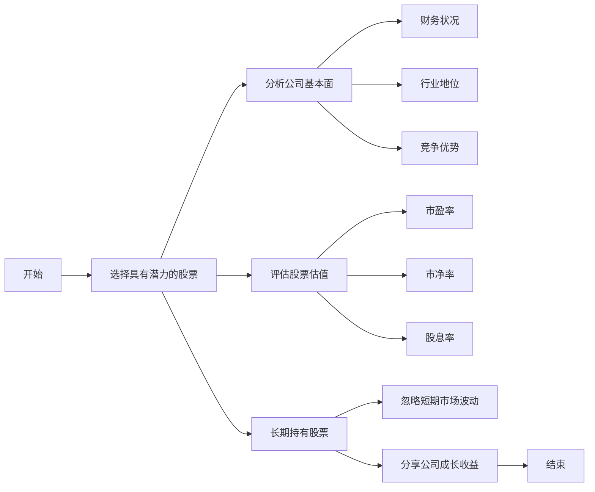

# 彼得林奇的"买入并持有"策略

> 关键词：彼得林奇、买入并持有策略、股票投资、长期投资、价值投资、投资理念、投资策略

> 摘要：本文深入探讨彼得林奇的“买入并持有”策略。彼得林奇作为投资界的传奇人物，其投资理念和策略影响深远。“买入并持有”策略强调投资者选择具有潜力的股票并长期持有，以获取资产的增值。文章将从背景介绍入手，阐述该策略的核心概念、算法原理、数学模型，通过项目实战展示其应用，分析实际应用场景，推荐相关工具和资源，最后总结其未来发展趋势与挑战，旨在帮助投资者全面理解和运用这一经典投资策略。

## 1. 背景介绍 
### 1.1 目的和范围
本文的目的在于全面、深入地剖析彼得林奇的“买入并持有”策略，帮助投资者理解该策略的本质、原理和应用方法。范围涵盖该策略的理论基础、实际操作步骤、数学模型，以及在不同市场环境下的应用案例，为投资者提供系统的知识体系和实践指导。

### 1.2 预期读者
本文预期读者包括对股票投资有兴趣的初学者、有一定投资经验但希望优化投资策略的投资者、金融专业学生以及从事金融研究和投资分析的专业人士。

### 1.3 文档结构概述
本文首先介绍“买入并持有”策略的背景信息，包括目的、预期读者和文档结构。接着阐述核心概念与联系，包括策略的原理和架构。然后详细讲解核心算法原理和具体操作步骤，通过Python代码进行说明。之后介绍数学模型和公式，并举例说明。再通过项目实战展示该策略的实际应用，包括开发环境搭建、源代码实现和代码解读。随后分析实际应用场景，推荐相关工具和资源。最后总结未来发展趋势与挑战，提供常见问题解答和扩展阅读参考资料。

### 1.4 术语表
#### 1.4.1 核心术语定义
- **买入并持有策略**：投资者在选定具有投资价值的股票后，长期持有该股票，不被短期市场波动所影响，以获取长期资产增值的投资策略。
- **股票估值**：对股票的内在价值进行评估，以确定股票是否被低估或高估。
- **股息率**：一年的总派息额与当时市价的比例，反映股票的分红收益。
- **市盈率（PE）**：股票价格除以每股收益的比率，用于衡量股票的估值水平。
- **市净率（PB）**：股票价格与每股净资产的比率，反映股票的估值和投资价值。

#### 1.4.2 相关概念解释
- **价值投资**：一种寻找被低估股票的投资理念，通过分析公司的基本面和财务状况，选择具有长期投资价值的股票。
- **长期投资**：投资者持有资产的时间较长，通常超过一年，以获取资产的长期增值和分红收益。
- **资产配置**：投资者将资金分配到不同的资产类别中，以降低投资风险和实现投资目标。

#### 1.4.3 缩略词列表
- **PE**：市盈率（Price-to-Earnings Ratio）
- **PB**：市净率（Price-to-Book Ratio）

## 2. 核心概念与联系 

### 2.1 彼得林奇“买入并持有”策略的原理
彼得林奇认为，股票市场短期波动是难以预测的，但优秀的公司在长期内会创造价值，其股票价格也会随着公司的成长而上涨。因此，投资者应该选择具有潜力的公司股票，长期持有，忽略短期市场波动，以分享公司成长带来的收益。

### 2.2 核心概念的联系
“买入并持有”策略与价值投资理念密切相关。价值投资强调寻找被低估的股票，而“买入并持有”策略则是在选定具有投资价值的股票后，长期持有。同时，该策略也与长期投资的概念相符，通过长期持有股票，投资者可以平滑短期市场波动的影响，实现资产的稳定增值。

### 2.3 架构的文本示意图
```plaintext
买入并持有策略
|-- 选择具有潜力的股票
|   |-- 分析公司基本面
|   |   |-- 财务状况
|   |   |-- 行业地位
|   |   |-- 竞争优势
|   |-- 评估股票估值
|   |   |-- 市盈率
|   |   |-- 市净率
|   |   |-- 股息率
|-- 长期持有股票
|   |-- 忽略短期市场波动
|   |-- 分享公司成长收益
```

### 2.4 Mermaid 流程图


## 3. 核心算法原理 & 具体操作步骤 

### 3.1 核心算法原理
“买入并持有”策略的核心算法原理在于通过对公司基本面和股票估值的分析，筛选出具有投资价值的股票，然后长期持有。以下是一个简单的Python示例，用于筛选具有投资价值的股票。

```python
import pandas as pd

# 假设我们有一个包含股票信息的DataFrame
# 列名包括：股票代码、公司名称、市盈率、市净率、股息率、财务状况评分、行业地位评分、竞争优势评分
stocks_data = {
    'stock_code': ['000001', '000002', '000003'],
    'company_name': ['公司A', '公司B', '公司C'],
    'pe_ratio': [10, 20, 15],
    'pb_ratio': [1.5, 2.5, 2.0],
    'dividend_yield': [0.03, 0.02, 0.025],
    'financial_score': [80, 70, 75],
    'industry_status_score': [85, 75, 80],
    'competitive_advantage_score': [82, 72, 78]
}

stocks_df = pd.DataFrame(stocks_data)

# 筛选条件
# 市盈率低于20
# 市净率低于3
# 股息率高于0.02
# 财务状况评分高于70
# 行业地位评分高于75
# 竞争优势评分高于70

selected_stocks = stocks_df[
    (stocks_df['pe_ratio'] < 20) &
    (stocks_df['pb_ratio'] < 3) &
    (stocks_df['dividend_yield'] > 0.02) &
    (stocks_df['financial_score'] > 70) &
    (stocks_df['industry_status_score'] > 75) &
    (stocks_df['competitive_advantage_score'] > 70)
]

print(selected_stocks)
```

### 3.2 具体操作步骤
1. **数据收集**：收集股票的相关信息，包括公司基本面数据（财务报表、行业地位、竞争优势等）和股票估值数据（市盈率、市净率、股息率等）。
2. **数据整理**：将收集到的数据整理成结构化的格式，如DataFrame，方便后续分析。
3. **筛选条件设定**：根据自己的投资理念和风险偏好，设定筛选股票的条件，如市盈率、市净率、股息率等指标的阈值。
4. **股票筛选**：使用设定的筛选条件对股票数据进行筛选，找出符合条件的股票。
5. **股票买入**：在合适的时机买入筛选出的股票。
6. **长期持有**：买入股票后，长期持有，忽略短期市场波动。
7. **定期评估**：定期对持有的股票进行评估，检查公司的基本面和股票估值是否发生变化。
8. **调整持仓**：如果公司的基本面恶化或股票估值过高，考虑卖出股票；如果发现更有潜力的股票，可以适当调整持仓。

## 4. 数学模型和公式 & 详细讲解 & 举例说明 

### 4.1 股票估值模型
#### 4.1.1 市盈率估值模型
市盈率（PE）是最常用的股票估值指标之一，其计算公式为：
$$PE = \frac{P}{EPS}$$
其中，$P$ 为股票价格，$EPS$ 为每股收益。

通过市盈率估值模型，我们可以估算股票的合理价格。例如，假设某公司的每股收益为 $2$ 元，行业平均市盈率为 $15$，则该股票的合理价格为：
$$P = PE \times EPS = 15 \times 2 = 30$$（元）

#### 4.1.2 市净率估值模型
市净率（PB）也是常用的股票估值指标，其计算公式为：
$$PB = \frac{P}{BVPS}$$
其中，$P$ 为股票价格，$BVPS$ 为每股净资产。

例如，某公司的每股净资产为 $10$ 元，行业平均市净率为 $2$，则该股票的合理价格为：
$$P = PB \times BVPS = 2 \times 10 = 20$$（元）

### 4.2 股息折现模型
股息折现模型（DDM）是一种基于股票未来股息的现值来估算股票内在价值的模型。其基本公式为：
$$V = \sum_{t=1}^{\infty} \frac{D_t}{(1 + r)^t}$$
其中，$V$ 为股票的内在价值，$D_t$ 为第 $t$ 期的股息，$r$ 为折现率。

在实际应用中，通常会对股息的增长情况进行假设，如固定增长模型。固定增长模型假设股息以固定的增长率 $g$ 增长，其公式为：
$$V = \frac{D_1}{r - g}$$
其中，$D_1$ 为下一期的股息。

例如，某公司下一期的股息为 $1$ 元，股息增长率为 $5\%$，折现率为 $10\%$，则该股票的内在价值为：
$$V = \frac{1}{0.1 - 0.05} = 20$$（元）

### 4.3 举例说明
假设我们要评估某只股票的投资价值，已知该股票的每股收益为 $3$ 元，每股净资产为 $15$ 元，下一期股息为 $1.5$ 元，股息增长率为 $4\%$，行业平均市盈率为 $12$，行业平均市净率为 $1.5$，折现率为 $8\%$。

- **市盈率估值**：
$$P_{PE} = PE \times EPS = 12 \times 3 = 36$$（元）
- **市净率估值**：
$$P_{PB} = PB \times BVPS = 1.5 \times 15 = 22.5$$（元）
- **股息折现模型估值**：
$$V = \frac{D_1}{r - g} = \frac{1.5}{0.08 - 0.04} = 37.5$$（元）

综合考虑以上三种估值方法，我们可以对该股票的投资价值有一个更全面的认识。

## 5. 项目实战：代码实际案例和详细解释说明 

### 5.1  开发环境搭建
1. **安装Python**：从Python官方网站（https://www.python.org/downloads/）下载并安装Python 3.x 版本。
2. **安装必要的库**：使用以下命令安装必要的库：
```sh
pip install pandas numpy yfinance matplotlib
```
- `pandas`：用于数据处理和分析。
- `numpy`：用于数值计算。
- `yfinance`：用于获取股票数据。
- `matplotlib`：用于数据可视化。

### 5.2  源代码详细实现和代码解读
```python
import yfinance as yf
import pandas as pd
import matplotlib.pyplot as plt

# 定义股票代码和时间范围
stock_symbol = 'AAPL'  # 苹果公司股票代码
start_date = '2010-01-01'
end_date = '2023-12-31'

# 获取股票数据
stock_data = yf.download(stock_symbol, start=start_date, end=end_date)

# 计算累计收益率
stock_data['cumulative_return'] = (stock_data['Close'] / stock_data['Close'].iloc[0]) - 1

# 绘制累计收益率曲线
plt.figure(figsize=(12, 6))
plt.plot(stock_data.index, stock_data['cumulative_return'])
plt.title(f'{stock_symbol} Cumulative Return from {start_date} to {end_date}')
plt.xlabel('Date')
plt.ylabel('Cumulative Return')
plt.grid(True)
plt.show()

# 模拟买入并持有策略
# 假设在2010年1月1日买入股票，一直持有到2023年12月31日
initial_investment = 10000  # 初始投资金额
shares_bought = initial_investment / stock_data['Close'].iloc[0]  # 买入的股票数量
final_value = shares_bought * stock_data['Close'].iloc[-1]  # 最终资产价值
total_return = (final_value - initial_investment) / initial_investment  # 总收益率

print(f'Initial Investment: ${initial_investment}')
print(f'Final Value: ${final_value:.2f}')
print(f'Total Return: {total_return * 100:.2f}%')
```

### 5.3  代码解读与分析
1. **数据获取**：使用 `yfinance` 库下载苹果公司（`AAPL`）从2010年1月1日到2023年12月31日的股票数据。
2. **累计收益率计算**：计算股票的累计收益率，公式为：
$$\text{累计收益率} = \frac{\text{当前收盘价}}{\text{初始收盘价}} - 1$$
3. **可视化**：使用 `matplotlib` 库绘制累计收益率曲线，直观展示股票的收益情况。
4. **模拟买入并持有策略**：假设在2010年1月1日投入10000美元买入苹果公司股票，一直持有到2023年12月31日，计算最终资产价值和总收益率。

通过这个案例，我们可以看到买入并持有策略在长期投资中的效果。苹果公司作为一家优秀的公司，其股票价格在长期内呈现上涨趋势，通过长期持有可以获得较高的收益。

## 6. 实际应用场景 
### 6.1 个人投资者
对于个人投资者来说，“买入并持有”策略是一种简单有效的投资方法。个人投资者通常没有专业的投资知识和时间进行频繁的交易，选择具有潜力的股票并长期持有，可以避免短期市场波动的影响，实现资产的稳定增值。例如，个人投资者可以选择一些行业龙头企业的股票，如苹果、微软、腾讯等，长期持有，分享公司成长带来的收益。

### 6.2 机构投资者
机构投资者也会采用“买入并持有”策略进行资产配置。例如，养老金、社保基金等长期资金，通常会选择一些业绩稳定、分红较高的蓝筹股进行长期投资，以实现资产的保值增值。此外，一些价值投资型的基金也会采用“买入并持有”策略，通过深入研究公司基本面，选择被低估的股票，长期持有，为投资者创造价值。

### 6.3 市场环境
“买入并持有”策略在不同的市场环境下都有一定的适用性。在牛市中，股票价格普遍上涨，长期持有优质股票可以获得较高的收益。在熊市中，虽然股票价格下跌，但优质公司的基本面通常不会发生太大变化，长期持有可以等待市场复苏，实现资产的反弹。在震荡市中，短期市场波动较大，“买入并持有”策略可以避免频繁交易带来的损失，平滑市场波动的影响。

## 7. 工具和资源推荐
### 7.1 学习资源推荐
#### 7.1.1 书籍推荐
- 《彼得林奇的成功投资》：彼得林奇的经典著作，详细介绍了他的投资理念和方法，包括“买入并持有”策略的应用。
- 《聪明的投资者》：本杰明·格雷厄姆的经典著作，价值投资的奠基之作，对理解“买入并持有”策略的理论基础有很大帮助。
- 《巴菲特致股东的信》：沃伦·巴菲特的书信集，包含了他的投资思想和经验，对投资者有很大的启发。

#### 7.1.2 在线课程
- Coursera上的“投资学原理”：由知名大学教授授课，系统介绍投资学的基本原理和方法，包括股票投资策略。
- 网易云课堂上的“价值投资实战课程”：结合实际案例，讲解价值投资的方法和技巧，对理解“买入并持有”策略有帮助。

#### 7.1.3 技术博客和网站
- 雪球网：国内知名的投资社区，有很多投资者分享投资经验和观点，可以学习到“买入并持有”策略的实际应用案例。
- Seeking Alpha：国外知名的投资分析网站，提供专业的股票分析和投资建议。

### 7.2 开发工具框架推荐
#### 7.2.1 IDE和编辑器
- PyCharm：专业的Python集成开发环境，功能强大，适合开发和调试Python代码。
- Jupyter Notebook：交互式的开发环境，方便进行数据探索和分析，适合学习和实践“买入并持有”策略的代码实现。

#### 7.2.2 调试和性能分析工具
- pdb：Python内置的调试工具，可以帮助开发者定位代码中的问题。
- cProfile：Python的性能分析工具，可以分析代码的运行时间和性能瓶颈。

#### 7.2.3 相关框架和库
- pandas：用于数据处理和分析，是进行股票数据处理和分析的常用库。
- numpy：用于数值计算，提供高效的数组操作和数学函数。
- yfinance：用于获取股票数据，方便快捷。
- matplotlib：用于数据可视化，将股票数据和投资收益情况以图表的形式展示出来。

### 7.3 相关论文著作推荐
#### 7.3.1 经典论文
- Fama, E. F., & French, K. R. (1992). The cross-section of expected stock returns. The Journal of Finance, 47(2), 427-465. 该论文提出了著名的Fama-French三因子模型，对股票收益率的影响因素进行了深入研究，对理解股票投资策略有重要意义。
- Sharpe, W. F. (1964). Capital asset prices: A theory of market equilibrium under conditions of risk. The Journal of Finance, 19(3), 425-442. 该论文提出了资本资产定价模型（CAPM），为资产定价和投资组合理论奠定了基础。

#### 7.3.2 最新研究成果
- 关注顶级金融学术期刊，如The Journal of Finance、The Review of Financial Studies等，了解关于股票投资策略和市场效率的最新研究成果。

#### 7.3.3 应用案例分析
- 可以参考一些专业的金融研究报告和投资机构的研究成果，了解“买入并持有”策略在不同市场环境和行业中的应用案例和效果分析。

## 8. 总结：未来发展趋势与挑战
### 8.1 未来发展趋势
- **科技发展的影响**：随着科技的不断发展，金融科技（FinTech）的应用将越来越广泛。投资者可以利用大数据、人工智能等技术，更准确地分析公司基本面和股票估值，优化“买入并持有”策略。例如，通过自然语言处理技术分析公司财报和新闻资讯，获取更多有价值的信息；利用机器学习算法预测股票价格走势，辅助投资决策。
- **全球市场一体化**：全球市场一体化的趋势将继续加强，投资者可以更方便地投资全球市场。“买入并持有”策略可以应用于不同国家和地区的股票市场，通过分散投资降低风险。同时，投资者也需要关注全球经济和政治形势的变化，及时调整投资组合。
- **社会责任投资的兴起**：社会责任投资（SRI）越来越受到投资者的关注。投资者在选择股票时，不仅会考虑公司的财务状况和业绩，还会关注公司的社会责任表现，如环境保护、员工福利、企业治理等。“买入并持有”策略可以与社会责任投资相结合，选择具有良好社会责任表现的公司股票，实现经济效益和社会效益的双赢。

### 8.2 挑战
- **市场不确定性增加**：全球经济和政治形势的不确定性增加，如贸易摩擦、地缘政治冲突、疫情等，会导致股票市场波动加剧。投资者在采用“买入并持有”策略时，需要面对更大的市场风险，如何在不确定的市场环境中选择具有抗风险能力的股票是一个挑战。
- **公司基本面变化**：随着市场竞争的加剧和技术的快速发展，公司的基本面可能会发生变化。一些曾经优秀的公司可能会因为战略失误、技术落后等原因而失去竞争优势，导致股票价格下跌。投资者需要定期评估持有的股票，及时发现公司基本面的变化，调整投资组合。
- **投资者情绪的影响**：投资者情绪对股票市场的影响较大。在市场上涨时，投资者可能会过度乐观，追高买入股票；在市场下跌时，投资者可能会过度恐慌，抛售股票。“买入并持有”策略需要投资者保持理性和耐心，不受投资者情绪的影响，但这对于很多投资者来说是一个挑战。

## 9. 附录：常见问题与解答
### 9.1 如何选择具有潜力的股票？
选择具有潜力的股票需要综合考虑公司的基本面和股票估值。基本面方面，需要分析公司的财务状况、行业地位、竞争优势等；估值方面，可以参考市盈率、市净率、股息率等指标。此外，还可以关注公司的创新能力、管理层素质等因素。

### 9.2 “买入并持有”策略适合所有投资者吗？
“买入并持有”策略并不适合所有投资者。该策略需要投资者有足够的耐心和长期投资的理念，能够承受短期市场波动的影响。对于一些追求短期收益、风险承受能力较低的投资者来说，可能不太适合采用该策略。

### 9.3 如何确定买入和卖出的时机？
“买入并持有”策略强调长期持有，不建议频繁买卖。买入时机可以选择在市场低估或公司基本面良好但股票价格被低估时。卖出时机可以考虑在公司基本面恶化、股票估值过高或有更好的投资机会时。

### 9.4 长期持有股票一定会获得收益吗？
长期持有股票并不一定能获得收益。股票市场存在不确定性，公司的基本面也可能发生变化。如果选择的股票出现问题，如公司业绩下滑、财务造假等，可能会导致股票价格下跌，投资者遭受损失。因此，投资者需要定期评估持有的股票，及时调整投资组合。

## 10. 扩展阅读 & 参考资料
1. 彼得林奇. 《彼得林奇的成功投资》. 机械工业出版社.
2. 本杰明·格雷厄姆. 《聪明的投资者》. 人民邮电出版社.
3. 沃伦·巴菲特. 《巴菲特致股东的信》. 机械工业出版社.
4. Fama, E. F., & French, K. R. (1992). The cross-section of expected stock returns. The Journal of Finance, 47(2), 427-465.
5. Sharpe, W. F. (1964). Capital asset prices: A theory of market equilibrium under conditions of risk. The Journal of Finance, 19(3), 425-442.
6. 雪球网：https://xueqiu.com/
7. Seeking Alpha：https://seekingalpha.com/
8. Coursera：https://www.coursera.org/
9. 网易云课堂：https://study.163.com/

作者：AI天才研究院/AI Genius Institute & 禅与计算机程序设计艺术 /Zen And The Art of Computer Programming