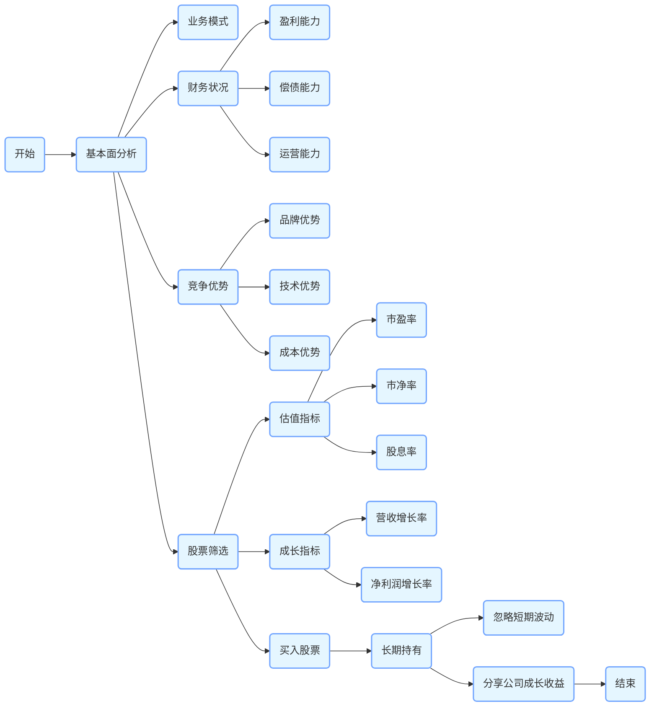

# 彼得林奇的“买入并持有”策略

> 关键词：彼得林奇、买入并持有策略、股票投资、长期投资、价值分析

> 摘要：本文深入探讨了彼得林奇的“买入并持有”策略，这一策略在股票投资领域具有重要地位。通过介绍该策略的背景，阐述核心概念及联系，分析核心算法原理和操作步骤，运用数学模型进行解释，结合项目实战案例，探讨实际应用场景，推荐相关工具和资源，最后总结其未来发展趋势与挑战，并解答常见问题。旨在帮助投资者深入理解这一策略，提升投资能力。

## 1. 背景介绍 
### 1.1 目的和范围
本文的目的是全面深入地研究彼得林奇的“买入并持有”策略，剖析其原理、操作方法、应用场景等方面。范围涵盖该策略的理论基础、实际操作步骤、在不同市场环境下的应用，以及相关的学习资源和未来发展趋势等内容，为投资者提供系统的知识体系和实践指导。

### 1.2 预期读者
预期读者主要包括对股票投资感兴趣的初学者，希望通过学习专业的投资策略提升自己的投资水平；有一定投资经验但希望优化投资策略的中级投资者；以及从事金融研究、投资分析等相关领域的专业人士，他们可以从本文中获取新的观点和思路。

### 1.3 文档结构概述
本文将首先介绍彼得林奇“买入并持有”策略的背景知识，包括相关术语和概念。接着阐述该策略的核心概念和联系，通过文本示意图和 Mermaid 流程图进行直观展示。然后详细讲解核心算法原理和具体操作步骤，结合 Python 代码进行说明。运用数学模型和公式对策略进行深入分析，并举例说明。通过项目实战案例，包括开发环境搭建、源代码实现和解读，展示策略的实际应用。探讨该策略在不同场景下的应用，推荐相关的学习工具和资源。最后总结该策略的未来发展趋势与挑战，解答常见问题，并提供扩展阅读和参考资料。

### 1.4 术语表
#### 1.4.1 核心术语定义
- **买入并持有策略**：投资者在选定股票后，长期持有该股票，不被短期市场波动所影响，通过分享公司的长期成长来获取收益的投资策略。
- **股票估值**：对股票的内在价值进行评估，以确定股票是否被低估或高估。
- **股息率**：股息与股票价格的比率，反映了股票的分红收益情况。
- **市盈率（PE）**：股票价格与每股收益的比率，用于衡量股票的估值水平。
- **市净率（PB）**：股票价格与每股净资产的比率，也是评估股票估值的重要指标。

#### 1.4.2 相关概念解释
- **价值投资**：一种投资理念，强调通过分析公司的基本面，寻找被低估的股票进行投资，注重公司的内在价值和长期发展潜力。
- **成长投资**：关注公司的成长潜力，投资于具有高成长预期的公司股票，通常这类公司的盈利增长速度较快。
- **分散投资**：将资金分散投资于不同的股票、行业或资产类别，以降低投资风险。

#### 1.4.3 缩略词列表
- **PE**：市盈率（Price - Earnings Ratio）
- **PB**：市净率（Price - Book Ratio）

## 2. 核心概念与联系 

### 核心概念原理
彼得林奇的“买入并持有”策略基于对公司基本面的深入研究和分析。他认为，只要公司的基本面良好，具有持续的盈利能力和成长潜力，即使短期内股票价格会受到市场波动的影响，从长期来看，股票价格会反映公司的内在价值。投资者通过买入并长期持有这些优质股票，可以分享公司成长带来的收益。

该策略强调投资者要具备扎实的基本面分析能力，了解公司的业务模式、财务状况、竞争优势等方面。同时，要保持耐心和理性，不被短期的市场波动所左右，避免频繁买卖股票导致交易成本增加和错失长期收益。

### 架构的文本示意图
```plaintext
买入并持有策略
|
|-- 基本面分析
|   |-- 业务模式
|   |-- 财务状况
|   |   |-- 盈利能力
|   |   |-- 偿债能力
|   |   |-- 运营能力
|   |-- 竞争优势
|       |-- 品牌优势
|       |-- 技术优势
|       |-- 成本优势
|
|-- 股票筛选
|   |-- 估值指标
|   |   |-- 市盈率
|   |   |-- 市净率
|   |   |-- 股息率
|   |-- 成长指标
|       |-- 营收增长率
|       |-- 净利润增长率
|
|-- 长期持有
|   |-- 忽略短期波动
|   |-- 分享公司成长收益
```

### Mermaid 流程图


## 3. 核心算法原理 & 具体操作步骤 

### 核心算法原理
“买入并持有”策略的核心算法原理可以简化为以下几个步骤：首先，通过对公司基本面的分析，筛选出具有投资价值的股票。然后，根据股票的估值指标和成长指标，确定买入的时机和价格。最后，长期持有这些股票，等待公司的成长带来股票价格的上涨和分红收益。

### 具体操作步骤
#### 步骤 1：基本面分析
- **业务模式分析**：了解公司的主营业务、产品或服务，分析其市场需求、竞争格局和发展前景。例如，一家互联网电商公司，需要分析其平台的用户规模、交易活跃度、盈利模式等方面。
- **财务状况分析**：
    - **盈利能力**：通过分析公司的净利润、毛利率、净利率等指标，评估公司的盈利水平和盈利能力的稳定性。例如，计算公司过去几年的净利润增长率，判断其盈利增长趋势。
    - **偿债能力**：关注公司的资产负债率、流动比率、速动比率等指标，评估公司的偿债能力和财务风险。例如，资产负债率过高可能意味着公司面临较大的偿债压力。
    - **运营能力**：分析公司的存货周转率、应收账款周转率等指标，评估公司的运营效率和资产管理能力。例如，存货周转率较高说明公司的存货管理较好，能够快速将存货转化为销售收入。
- **竞争优势分析**：
    - **品牌优势**：评估公司品牌的知名度、美誉度和忠诚度，品牌优势可以帮助公司在市场竞争中获得更高的定价权和市场份额。例如，可口可乐凭借其强大的品牌优势，在全球饮料市场占据领先地位。
    - **技术优势**：关注公司的研发投入、专利技术和创新能力，技术优势可以使公司在产品或服务上具有差异化竞争优势。例如，苹果公司凭借其领先的技术研发能力，推出了一系列具有创新性的产品。
    - **成本优势**：分析公司的生产成本、运营成本等方面，成本优势可以使公司在价格竞争中占据优势。例如，沃尔玛通过高效的供应链管理和大规模采购，实现了较低的成本，从而在零售市场具有较强的竞争力。

#### 步骤 2：股票筛选
- **估值指标筛选**：
    - **市盈率（PE）**：一般来说，较低的市盈率可能意味着股票被低估，但需要结合行业平均水平和公司的成长前景进行综合判断。例如，同行业的平均市盈率为 20 倍，而某公司的市盈率为 15 倍，且该公司具有较好的成长潜力，则该股票可能具有投资价值。
    - **市净率（PB）**：市净率反映了股票价格与每股净资产的关系，较低的市净率可能表示股票具有一定的安全边际。例如，某公司的市净率为 1.5 倍，而行业平均市净率为 2 倍，则该股票可能被低估。
    - **股息率**：股息率较高的股票可以为投资者提供稳定的现金流收益。例如，某股票的股息率为 5%，说明投资者每年可以获得相当于股票价格 5% 的分红收益。
- **成长指标筛选**：
    - **营收增长率**：较高的营收增长率表示公司的业务在不断扩张，具有较好的发展前景。例如，某公司过去三年的营收增长率分别为 10%、15% 和 20%，说明该公司的业务增长态势良好。
    - **净利润增长率**：净利润增长率反映了公司的盈利能力的增长情况，也是衡量公司成长潜力的重要指标。例如，某公司的净利润增长率连续多年保持在 20% 以上，则该公司具有较强的成长能力。

#### 步骤 3：买入股票
在筛选出具有投资价值的股票后，根据市场情况和个人投资资金，确定买入的时机和价格。一般来说，可以采用分批买入的方式，降低一次性买入的风险。例如，将投资资金分成若干份，在不同的价格区间逐步买入股票。

#### 步骤 4：长期持有
买入股票后，要保持耐心和理性，忽略短期的市场波动。只要公司的基本面没有发生重大变化，就继续持有股票，分享公司的长期成长收益。

### Python 代码示例
```python
import pandas as pd
import yfinance as yf

# 定义基本面分析函数
def fundamental_analysis(ticker):
    try:
        stock = yf.Ticker(ticker)
        # 获取财务数据
        financials = stock.financials
        balance_sheet = stock.balance_sheet
        # 计算盈利能力指标
        net_income = financials.loc['Net Income'].values[0]
        gross_profit = financials.loc['Gross Profit'].values[0]
        gross_margin = gross_profit / financials.loc['Total Revenue'].values[0]
        net_margin = net_income / financials.loc['Total Revenue'].values[0]
        # 计算偿债能力指标
        total_assets = balance_sheet.loc['Total Assets'].values[0]
        total_liabilities = balance_sheet.loc['Total Liab'].values[0]
        debt_ratio = total_liabilities / total_assets
        # 计算运营能力指标
        inventory = balance_sheet.loc['Inventory'].values[0]
        accounts_receivable = balance_sheet.loc['Accounts Receivable'].values[0]
        inventory_turnover = financials.loc['Total Revenue'].values[0] / inventory
        accounts_receivable_turnover = financials.loc['Total Revenue'].values[0] / accounts_receivable
        print(f"盈利能力：净利润: {net_income}, 毛利率: {gross_margin}, 净利率: {net_margin}")
        print(f"偿债能力：资产负债率: {debt_ratio}")
        print(f"运营能力：存货周转率: {inventory_turnover}, 应收账款周转率: {accounts_receivable_turnover}")
    except Exception as e:
        print(f"基本面分析出错: {e}")

# 定义股票筛选函数
def stock_screening(ticker):
    try:
        stock = yf.Ticker(ticker)
        # 获取估值指标
        info = stock.info
        pe_ratio = info.get('trailingPE')
        pb_ratio = info.get('priceToBook')
        dividend_yield = info.get('dividendYield')
        # 获取成长指标
        revenue_growth = info.get('revenueGrowth')
        earnings_growth = info.get('earningsGrowth')
        print(f"估值指标：市盈率: {pe_ratio}, 市净率: {pb_ratio}, 股息率: {dividend_yield}")
        print(f"成长指标：营收增长率: {revenue_growth}, 净利润增长率: {earnings_growth}")
    except Exception as e:
        print(f"股票筛选出错: {e}")

# 主函数
if __name__ == "__main__":
    ticker = 'AAPL'  # 以苹果公司为例
    fundamental_analysis(ticker)
    stock_screening(ticker)
```
### 代码解释
- `fundamental_analysis` 函数：通过 `yfinance` 库获取股票的财务数据，计算盈利能力、偿债能力和运营能力指标，并打印输出。
- `stock_screening` 函数：获取股票的估值指标（市盈率、市净率、股息率）和成长指标（营收增长率、净利润增长率），并打印输出。
- 主函数：调用上述两个函数，对苹果公司（股票代码：AAPL）进行基本面分析和股票筛选。

## 4. 数学模型和公式 & 详细讲解 & 举例说明 

### 估值指标相关公式
#### 市盈率（PE）
市盈率是股票价格与每股收益的比率，计算公式为：
$$PE = \frac{P}{EPS}$$
其中，$P$ 表示股票价格，$EPS$ 表示每股收益。

例如，某股票的价格为 50 元，每股收益为 2 元，则该股票的市盈率为：
$$PE = \frac{50}{2} = 25$$

#### 市净率（PB）
市净率是股票价格与每股净资产的比率，计算公式为：
$$PB = \frac{P}{BVPS}$$
其中，$P$ 表示股票价格，$BVPS$ 表示每股净资产。

例如，某股票的价格为 30 元，每股净资产为 10 元，则该股票的市净率为：
$$PB = \frac{30}{10} = 3$$

#### 股息率
股息率是股息与股票价格的比率，计算公式为：
$$Dividend\ Yield = \frac{D}{P} \times 100\%$$
其中，$D$ 表示每股股息，$P$ 表示股票价格。

例如，某股票的每股股息为 1 元，股票价格为 20 元，则该股票的股息率为：
$$Dividend\ Yield = \frac{1}{20} \times 100\% = 5\%$$

### 成长指标相关公式
#### 营收增长率
营收增长率反映了公司营业收入的增长情况，计算公式为：
$$Revenue\ Growth\ Rate = \frac{R_{t} - R_{t-1}}{R_{t-1}} \times 100\%$$
其中，$R_{t}$ 表示本期营业收入，$R_{t-1}$ 表示上期营业收入。

例如，某公司去年的营业收入为 1000 万元，今年的营业收入为 1200 万元，则该公司的营收增长率为：
$$Revenue\ Growth\ Rate = \frac{1200 - 1000}{1000} \times 100\% = 20\%$$

#### 净利润增长率
净利润增长率反映了公司净利润的增长情况，计算公式为：
$$Net\ Income\ Growth\ Rate = \frac{NI_{t} - NI_{t-1}}{NI_{t-1}} \times 100\%$$
其中，$NI_{t}$ 表示本期净利润，$NI_{t-1}$ 表示上期净利润。

例如，某公司去年的净利润为 200 万元，今年的净利润为 250 万元，则该公司的净利润增长率为：
$$Net\ Income\ Growth\ Rate = \frac{250 - 200}{200} \times 100\% = 25\%$$

### 举例说明
假设我们要分析一家公司的投资价值，该公司的股票价格为 40 元，每股收益为 2 元，每股净资产为 15 元，每股股息为 1 元。去年的营业收入为 800 万元，今年的营业收入为 960 万元；去年的净利润为 150 万元，今年的净利润为 180 万元。

- **估值指标计算**：
    - 市盈率：$PE = \frac{40}{2} = 20$
    - 市净率：$PB = \frac{40}{15} \approx 2.67$
    - 股息率：$Dividend\ Yield = \frac{1}{40} \times 100\% = 2.5\%$
- **成长指标计算**：
    - 营收增长率：$Revenue\ Growth\ Rate = \frac{960 - 800}{800} \times 100\% = 20\%$
    - 净利润增长率：$Net\ Income\ Growth\ Rate = \frac{180 - 150}{150} \times 100\% = 20\%$

通过计算这些指标，我们可以对该公司的投资价值进行初步评估。市盈率 20 倍处于合理范围，市净率 2.67 倍也相对合理，股息率 2.5% 可以提供一定的现金流收益。营收增长率和净利润增长率均为 20%，说明公司具有较好的成长潜力。综合来看，该公司可能是一个具有投资价值的标的。

## 5. 项目实战：代码实际案例和详细解释说明 

### 5.1  开发环境搭建
#### 安装 Python
首先，需要安装 Python 编程语言。可以从 Python 官方网站（https://www.python.org/downloads/）下载适合自己操作系统的 Python 安装包，并按照安装向导进行安装。建议安装 Python 3.7 及以上版本。

#### 安装必要的库
在命令行中使用 `pip` 工具安装以下必要的库：
```sh
pip install pandas yfinance
```
- `pandas`：用于数据处理和分析。
- `yfinance`：用于获取股票的历史数据和财务信息。

### 5.2  源代码详细实现和代码解读
```python
import pandas as pd
import yfinance as yf
import matplotlib.pyplot as plt

# 定义获取股票数据函数
def get_stock_data(ticker, start_date, end_date):
    try:
        stock = yf.Ticker(ticker)
        data = stock.history(start=start_date, end=end_date)
        return data
    except Exception as e:
        print(f"获取股票数据出错: {e}")
        return None

# 定义“买入并持有”策略函数
def buy_and_hold_strategy(data):
    # 买入股票
    initial_investment = 10000  # 初始投资金额
    num_shares = initial_investment / data['Close'].iloc[0]
    # 计算最终价值
    final_value = num_shares * data['Close'].iloc[-1]
    # 计算收益率
    return_rate = (final_value - initial_investment) / initial_investment
    return final_value, return_rate

# 主函数
if __name__ == "__main__":
    ticker = 'AAPL'  # 以苹果公司为例
    start_date = '2010-01-01'
    end_date = '2020-12-31'
    # 获取股票数据
    data = get_stock_data(ticker, start_date, end_date)
    if data is not None:
        # 执行“买入并持有”策略
        final_value, return_rate = buy_and_hold_strategy(data)
        print(f"初始投资: {10000} 元")
        print(f"最终价值: {final_value} 元")
        print(f"收益率: {return_rate * 100:.2f}%")
        # 绘制股票价格走势图
        plt.figure(figsize=(12, 6))
        plt.plot(data['Close'])
        plt.title(f'{ticker} 股票价格走势 ({start_date} - {end_date})')
        plt.xlabel('日期')
        plt.ylabel('价格 (美元)')
        plt.grid(True)
        plt.show()
```

### 5.3  代码解读与分析
- `get_stock_data` 函数：通过 `yfinance` 库获取指定股票在指定日期范围内的历史数据。如果获取数据过程中出现错误，会打印错误信息并返回 `None`。
- `buy_and_hold_strategy` 函数：实现了“买入并持有”策略。首先，根据初始投资金额和股票的初始收盘价计算购买的股票数量。然后，根据股票的最终收盘价计算投资的最终价值。最后，计算投资的收益率。
- 主函数：调用 `get_stock_data` 函数获取苹果公司（股票代码：AAPL）在 2010 年 1 月 1 日至 2020 年 12 月 31 日期间的历史数据。如果数据获取成功，调用 `buy_and_hold_strategy` 函数执行“买入并持有”策略，并打印初始投资金额、最终价值和收益率。最后，使用 `matplotlib` 库绘制股票价格走势图，直观展示股票价格的变化情况。

通过这个项目实战案例，我们可以看到“买入并持有”策略的具体实现过程，以及如何通过 Python 代码进行股票投资分析。

## 6. 实际应用场景 
### 长期投资规划
对于有长期投资规划的投资者，如为子女教育、养老等目标进行投资的人群，彼得林奇的“买入并持有”策略是一个不错的选择。这些投资者通常具有较长的投资期限，可以承受一定的短期市场波动。通过选择具有良好基本面和成长潜力的股票，长期持有可以实现资产的稳步增值。

例如，一位投资者计划为子女的大学教育储备资金，预计在 15 年后使用。他可以选择一些行业龙头企业的股票，如科技、消费、医疗等领域的优质公司，进行长期投资。在这 15 年的时间里，忽略短期的市场波动，等待公司的成长带来股票价格的上涨和分红收益。

### 养老金投资
养老金是为了保障退休后的生活质量，因此投资期限较长，注重资产的稳健增值。“买入并持有”策略符合养老金投资的特点。养老金管理机构可以通过深入的基本面分析，选择一些具有稳定盈利能力和良好现金流的公司股票，构建投资组合，并长期持有。

例如，一些大型养老金基金可能会投资于公用事业、金融等行业的蓝筹股，这些公司通常具有较高的股息率和稳定的业绩，能够为养老金提供稳定的收益。

### 个人财富积累
对于普通投资者来说，通过长期坚持“买入并持有”策略，可以逐步积累个人财富。投资者可以将一部分闲置资金用于股票投资，选择自己熟悉或看好的行业和公司，进行长期投资。随着时间的推移，股票的增值和分红收益将不断增加个人财富。

例如，一位投资者每月拿出一部分工资收入，选择几只优质股票进行投资，并长期持有。经过多年的积累，他的股票资产可能会大幅增长，为实现个人的财务目标提供支持。

### 市场波动应对
在市场波动较大的情况下，“买入并持有”策略可以帮助投资者避免因频繁买卖而造成的损失。当市场下跌时，投资者如果能够坚定持有优质股票，等待市场反弹，往往可以获得较好的收益。

例如，在 2008 年全球金融危机期间，股票市场大幅下跌，但一些具有良好基本面的公司股票在危机过后逐渐恢复并创出新高。如果投资者在危机期间恐慌抛售股票，就会错过后续的上涨行情。而坚持“买入并持有”策略的投资者，则可以在市场复苏中获得收益。

## 7. 工具和资源推荐
### 7.1 学习资源推荐
#### 7.1.1 书籍推荐
- 《彼得·林奇的成功投资》：彼得·林奇本人所著，详细介绍了他的投资理念和方法，包括如何选股、如何分析公司基本面等内容，是学习“买入并持有”策略的经典读物。
- 《聪明的投资者》：本杰明·格雷厄姆所著，被誉为投资界的圣经。书中阐述了价值投资的基本原理和方法，对理解“买入并持有”策略的理论基础有很大帮助。
- 《怎样选择成长股》：菲利普·费雪所著，重点介绍了如何寻找具有成长潜力的公司，为投资者提供了选择优质股票的思路和方法。

#### 7.1.2 在线课程
- Coursera 上的“投资学原理”：该课程由知名高校的教授授课，系统介绍了投资学的基本原理和方法，包括股票投资、债券投资等内容，对学习“买入并持有”策略有一定的指导作用。
- 网易云课堂上的“股票投资实战课程”：课程结合实际案例，讲解股票投资的技巧和策略，帮助投资者提升投资能力。

#### 7.1.3 技术博客和网站
- 雪球网：国内知名的投资交流社区，汇聚了众多投资者和投资专家。在雪球网上可以关注一些投资大 V 的观点和分析，学习他们的投资经验和策略。
- 东方财富网：提供丰富的股票市场数据和资讯，投资者可以通过该网站了解公司的财务报表、行业动态等信息，为投资决策提供参考。

### 7.2 开发工具框架推荐
#### 7.2.1 IDE和编辑器
- PyCharm：一款专业的 Python 集成开发环境，具有代码编辑、调试、版本控制等功能，适合开发和调试与股票投资分析相关的 Python 代码。
- Jupyter Notebook：一个交互式的开发环境，支持 Python 等多种编程语言。可以方便地进行数据探索、可视化和代码演示，对于股票数据的分析和策略验证非常有用。

#### 7.2.2 调试和性能分析工具
- PDB：Python 自带的调试工具，可以帮助开发者在代码运行过程中进行调试，查找和解决代码中的问题。
- cProfile：Python 的性能分析工具，可以分析代码的运行时间和函数调用情况，帮助开发者优化代码性能。

#### 7.2.3 相关框架和库
- Pandas：用于数据处理和分析的 Python 库，提供了丰富的数据结构和数据操作方法，非常适合处理股票的历史数据和财务数据。
- NumPy：Python 的数值计算库，提供了高效的数组操作和数学函数，在股票数据的计算和分析中经常使用。
- Matplotlib：用于数据可视化的 Python 库，可以绘制各种类型的图表，如折线图、柱状图、散点图等，帮助投资者直观地展示股票数据和分析结果。

### 7.3 相关论文著作推荐
#### 7.3.1 经典论文
- 《资本资产定价模型：理论与实证》：该论文提出了资本资产定价模型（CAPM），为股票投资的风险和收益分析提供了重要的理论基础。
- 《有效市场假说》：阐述了有效市场假说的基本概念和理论，对理解股票市场的价格形成机制和投资策略有重要意义。

#### 7.3.2 最新研究成果
- 关注顶级金融学术期刊，如《Journal of Finance》、《Review of Financial Studies》等，这些期刊会发表最新的金融研究成果，包括股票投资策略、市场效率等方面的研究。

#### 7.3.3 应用案例分析
- 一些专业的金融研究机构和咨询公司会发布股票投资的应用案例分析报告，投资者可以通过阅读这些报告，了解“买入并持有”策略在实际应用中的效果和经验教训。

## 8. 总结：未来发展趋势与挑战
### 未来发展趋势
#### 数字化和智能化
随着科技的不断发展，股票投资领域也将越来越数字化和智能化。投资者可以利用大数据、人工智能等技术，更高效地进行基本面分析、股票筛选和投资决策。例如，通过机器学习算法对大量的公司财务数据和市场数据进行分析，挖掘潜在的投资机会。

#### 全球化投资
全球经济一体化的趋势不断加强，投资者将有更多的机会进行全球化投资。“买入并持有”策略可以应用于不同国家和地区的股票市场，通过分散投资降低风险，获取全球经济增长带来的收益。

#### 社会责任投资
越来越多的投资者开始关注企业的社会责任和可持续发展。未来，“买入并持有”策略可能会更多地考虑企业在环境保护、社会责任和公司治理（ESG）等方面的表现，选择具有良好 ESG 绩效的公司进行投资。

### 挑战
#### 市场不确定性增加
全球政治、经济环境的不确定性不断增加，如贸易摩擦、地缘政治冲突、宏观经济政策调整等，都会对股票市场产生影响。投资者在长期持有股票的过程中，需要面对这些不确定性带来的风险。

#### 行业变革加速
科技的快速发展导致行业变革加速，一些传统行业可能会面临被新兴行业替代的风险。投资者需要准确判断行业的发展趋势，及时调整投资组合，避免因行业变革而遭受损失。

#### 信息过载
在信息时代，投资者面临着大量的信息，包括公司公告、新闻报道、研究报告等。如何从海量的信息中筛选出有价值的信息，进行准确的分析和判断，是投资者面临的一大挑战。

## 9. 附录：常见问题与解答
### 问题 1：“买入并持有”策略是否适用于所有股票？
答：不是的。“买入并持有”策略适用于具有良好基本面和成长潜力的股票。对于一些业绩不佳、缺乏竞争力的公司股票，长期持有可能会导致资产损失。投资者在选择股票时，需要进行深入的基本面分析，筛选出优质的投资标的。

### 问题 2：在持有股票期间，如何应对市场的大幅下跌？
答：首先，要保持冷静和理性，不要被短期的市场波动所左右。如果公司的基本面没有发生重大变化，市场下跌可能是一个买入的机会，可以考虑适当增加持仓。如果市场下跌是由于公司自身的问题导致的，如业绩下滑、财务造假等，则需要重新评估投资决策，考虑是否卖出股票。

### 问题 3：“买入并持有”策略需要多长时间才能看到效果？
答：“买入并持有”策略是一种长期投资策略，通常需要几年甚至十几年的时间才能看到明显的效果。因为公司的成长需要时间，股票价格的上涨也需要一定的过程。投资者需要有足够的耐心和信心，坚持长期投资。

### 问题 4：如何判断公司的基本面是否发生了重大变化？
答：可以通过关注公司的财务报表、公告、新闻报道等信息，分析公司的业绩、市场竞争力、行业地位等方面是否发生了变化。例如，如果公司的净利润连续多个季度下滑、市场份额被竞争对手抢占、出现重大的法律纠纷等，都可能意味着公司的基本面发生了重大变化。

## 10. 扩展阅读 & 参考资料
- 《金融市场与金融机构基础》
- 《投资组合管理：理论与应用》
- 晨星网（https://www.morningstar.cn/）
- 雅虎财经（https://finance.yahoo.com/）

作者：AI天才研究院/AI Genius Institute & 禅与计算机程序设计艺术 /Zen And The Art of Computer Programming