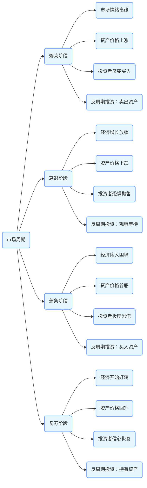

# 彼得林奇的"反周期"投资在不同资产类别中的应用

> 关键词：彼得林奇、反周期投资、资产类别、投资策略、市场周期

> 摘要：本文深入探讨了彼得林奇的“反周期”投资策略在不同资产类别中的应用。首先介绍了背景信息，包括目的范围、预期读者等。接着阐述了“反周期”投资的核心概念及其联系，通过文本示意图和Mermaid流程图展示其原理和架构。详细讲解了核心算法原理及具体操作步骤，并给出Python源代码示例。运用数学模型和公式对该策略进行了分析，并举例说明。通过项目实战案例，包括开发环境搭建、源代码实现与解读，深入剖析了该策略的实际应用。探讨了该策略在不同资产类别中的实际应用场景，推荐了相关的学习资源、开发工具框架和论文著作。最后总结了未来发展趋势与挑战，解答了常见问题，并提供了扩展阅读和参考资料。

## 1. 背景介绍 
### 1.1 目的和范围
本文旨在全面分析彼得林奇的“反周期”投资策略在不同资产类别（如股票、债券、房地产等）中的应用。通过深入研究该策略的原理、算法和实际操作，为投资者提供在不同市场环境下运用“反周期”投资的方法和思路。研究范围涵盖了“反周期”投资的基本概念、核心算法、数学模型，以及在实际项目中的应用案例，同时探讨了该策略在不同资产类别中的具体应用场景。

### 1.2 预期读者
本文适合对投资领域感兴趣的各类人群，包括专业投资者、个人投资者、金融分析师、投资顾问以及相关领域的研究人员。对于想要了解彼得林奇投资策略并将其应用于不同资产投资的读者具有较高的参考价值。

### 1.3 文档结构概述
本文共分为十个部分。第一部分为背景介绍，阐述了文章的目的、预期读者和文档结构。第二部分介绍“反周期”投资的核心概念与联系，通过文本示意图和Mermaid流程图展示其原理和架构。第三部分详细讲解核心算法原理及具体操作步骤，并给出Python源代码示例。第四部分运用数学模型和公式对“反周期”投资策略进行分析，并举例说明。第五部分通过项目实战案例，包括开发环境搭建、源代码实现与解读，深入剖析该策略的实际应用。第六部分探讨该策略在不同资产类别中的实际应用场景。第七部分推荐相关的学习资源、开发工具框架和论文著作。第八部分总结未来发展趋势与挑战。第九部分为附录，解答常见问题。第十部分提供扩展阅读和参考资料。

### 1.4 术语表
#### 1.4.1 核心术语定义
- **反周期投资**：指投资者在市场周期的不同阶段，采取与市场整体趋势相反的投资策略。即在市场低迷时买入，在市场高涨时卖出。
- **资产类别**：是指具有相似风险特征和收益特征的资产集合，常见的资产类别包括股票、债券、房地产、大宗商品等。
- **市场周期**：指市场价格和经济活动随时间呈现出的周期性波动，通常包括繁荣、衰退、萧条和复苏四个阶段。

#### 1.4.2 相关概念解释
- **价值投资**：强调寻找被低估的资产，通过长期持有来获取资产价值回归带来的收益。反周期投资在一定程度上与价值投资有相似之处，都是在资产价格低于其内在价值时买入。
- **趋势投资**：与反周期投资相反，趋势投资是跟随市场趋势进行投资，即在市场上涨时买入，在市场下跌时卖出。

#### 1.4.3 缩略词列表
- **PE**：市盈率（Price-to-Earnings Ratio），是指股票价格除以每股收益的比率，用于衡量股票的估值水平。
- **PB**：市净率（Price-to-Book Ratio），是指股票价格除以每股净资产的比率，也是衡量股票估值的重要指标。

## 2. 核心概念与联系 

### 核心概念原理
彼得林奇的“反周期”投资策略基于对市场周期的深刻理解。市场周期是经济活动和资产价格随时间的周期性波动，通常包括繁荣、衰退、萧条和复苏四个阶段。在繁荣阶段，市场情绪高涨，资产价格普遍上涨；在衰退阶段，经济增长放缓，资产价格开始下跌；在萧条阶段，经济陷入困境，资产价格跌至谷底；在复苏阶段，经济开始好转，资产价格逐渐回升。

“反周期”投资策略就是在市场处于衰退或萧条阶段时，当大多数投资者因为恐惧而抛售资产，导致资产价格大幅下跌时，投资者逆向买入被低估的资产。而在市场处于繁荣阶段时，当大多数投资者因为贪婪而大量买入资产，导致资产价格虚高时，投资者则逆向卖出资产，锁定收益。

### 架构的文本示意图
```plaintext
市场周期
|-- 繁荣阶段
|   |-- 市场情绪高涨
|   |-- 资产价格上涨
|   |-- 投资者贪婪买入
|   |-- 反周期投资：卖出资产
|-- 衰退阶段
|   |-- 经济增长放缓
|   |-- 资产价格下跌
|   |-- 投资者恐惧抛售
|   |-- 反周期投资：观察等待
|-- 萧条阶段
|   |-- 经济陷入困境
|   |-- 资产价格谷底
|   |-- 投资者极度恐慌
|   |-- 反周期投资：买入资产
|-- 复苏阶段
|   |-- 经济开始好转
|   |-- 资产价格回升
|   |-- 投资者信心恢复
|   |-- 反周期投资：持有资产
```

### Mermaid流程图


## 3. 核心算法原理 & 具体操作步骤 

### 核心算法原理
“反周期”投资的核心算法原理是基于对资产估值的判断。投资者需要通过分析资产的基本面数据，如市盈率（PE）、市净率（PB）等指标，来评估资产的内在价值。当资产的市场价格低于其内在价值时，表明资产被低估，此时可以考虑买入；当资产的市场价格高于其内在价值时，表明资产被高估，此时可以考虑卖出。

### 具体操作步骤
1. **数据收集**：收集目标资产的历史价格数据、财务报表数据（如净利润、净资产等）。
2. **估值计算**：根据收集到的数据，计算资产的市盈率（PE）、市净率（PB）等估值指标。
3. **估值比较**：将计算得到的估值指标与历史平均水平、同行业其他资产的估值水平进行比较，判断资产是否被低估或高估。
4. **投资决策**：如果资产被低估，且市场处于衰退或萧条阶段，考虑买入资产；如果资产被高估，且市场处于繁荣阶段，考虑卖出资产。
5. **风险控制**：设定止损点和止盈点，控制投资风险。

### Python源代码示例
```python
import pandas as pd
import yfinance as yf

# 数据收集
def collect_data(ticker, start_date, end_date):
    data = yf.download(ticker, start=start_date, end=end_date)
    return data

# 估值计算
def calculate_valuation(data):
    # 假设已经获取了每股收益（EPS）和每股净资产（BVPS）数据
    # 这里简单示例，实际应用中需要从财务报表中获取准确数据
    eps = 1.0  # 每股收益
    bvps = 10.0  # 每股净资产
    
    data['PE'] = data['Close'] / eps
    data['PB'] = data['Close'] / bvps
    
    return data

# 估值比较
def compare_valuation(data, pe_avg, pb_avg):
    data['PE_undervalued'] = data['PE'] < pe_avg
    data['PB_undervalued'] = data['PB'] < pb_avg
    
    return data

# 投资决策
def investment_decision(data):
    buy_signals = []
    sell_signals = []
    
    for i in range(len(data)):
        if data['PE_undervalued'][i] and data['PB_undervalued'][i]:
            buy_signals.append(data.index[i])
        elif not data['PE_undervalued'][i] and not data['PB_undervalued'][i]:
            sell_signals.append(data.index[i])
    
    return buy_signals, sell_signals

# 主函数
def main():
    ticker = 'AAPL'  # 股票代码
    start_date = '2020-01-01'
    end_date = '2023-01-01'
    
    # 数据收集
    data = collect_data(ticker, start_date, end_date)
    
    # 估值计算
    data = calculate_valuation(data)
    
    # 假设PE历史平均为20，PB历史平均为3
    pe_avg = 20
    pb_avg = 3
    
    # 估值比较
    data = compare_valuation(data, pe_avg, pb_avg)
    
    # 投资决策
    buy_signals, sell_signals = investment_decision(data)
    
    print("买入信号日期：", buy_signals)
    print("卖出信号日期：", sell_signals)

if __name__ == "__main__":
    main()
```

## 4. 数学模型和公式 & 详细讲解 & 举例说明 

### 数学模型和公式
#### 市盈率（PE）
市盈率是指股票价格除以每股收益的比率，计算公式为：
$$PE = \frac{P}{EPS}$$
其中，$P$ 表示股票价格，$EPS$ 表示每股收益。

#### 市净率（PB）
市净率是指股票价格除以每股净资产的比率，计算公式为：
$$PB = \frac{P}{BVPS}$$
其中，$P$ 表示股票价格，$BVPS$ 表示每股净资产。

### 详细讲解
市盈率和市净率是衡量股票估值的重要指标。市盈率反映了投资者为获取每股收益所愿意支付的价格，市盈率越低，表明股票越被低估；市净率反映了股票价格与每股净资产的关系，市净率越低，表明股票的投资价值越高。

在“反周期”投资中，投资者可以通过比较目标股票的市盈率和市净率与历史平均水平、同行业其他股票的市盈率和市净率，来判断股票是否被低估或高估。如果目标股票的市盈率和市净率低于历史平均水平和同行业其他股票，说明该股票可能被低估，此时可以考虑买入；反之，如果目标股票的市盈率和市净率高于历史平均水平和同行业其他股票，说明该股票可能被高估，此时可以考虑卖出。

### 举例说明
假设某股票的当前价格为 $P = 50$ 元，每股收益为 $EPS = 2$ 元，每股净资产为 $BVPS = 10$ 元。则该股票的市盈率为：
$$PE = \frac{50}{2} = 25$$
市净率为：
$$PB = \frac{50}{10} = 5$$

如果该股票所在行业的平均市盈率为 20，平均市净率为 3，则该股票的市盈率和市净率均高于行业平均水平，说明该股票可能被高估，投资者可以考虑卖出。

## 5. 项目实战：代码实际案例和详细解释说明 

### 5.1  开发环境搭建
#### 操作系统
可以选择Windows、Linux或macOS操作系统。

#### Python环境
安装Python 3.x版本，可以从Python官方网站（https://www.python.org/downloads/）下载并安装。

#### 安装必要的库
使用以下命令安装必要的Python库：
```sh
pip install pandas yfinance
```
- `pandas`：用于数据处理和分析。
- `yfinance`：用于获取股票历史数据。

### 5.2  源代码详细实现和代码解读
```python
import pandas as pd
import yfinance as yf

# 数据收集
def collect_data(ticker, start_date, end_date):
    data = yf.download(ticker, start=start_date, end=end_date)
    return data

# 估值计算
def calculate_valuation(data):
    # 假设已经获取了每股收益（EPS）和每股净资产（BVPS）数据
    # 这里简单示例，实际应用中需要从财务报表中获取准确数据
    eps = 1.0  # 每股收益
    bvps = 10.0  # 每股净资产
    
    data['PE'] = data['Close'] / eps
    data['PB'] = data['Close'] / bvps
    
    return data

# 估值比较
def compare_valuation(data, pe_avg, pb_avg):
    data['PE_undervalued'] = data['PE'] < pe_avg
    data['PB_undervalued'] = data['PB'] < pb_avg
    
    return data

# 投资决策
def investment_decision(data):
    buy_signals = []
    sell_signals = []
    
    for i in range(len(data)):
        if data['PE_undervalued'][i] and data['PB_undervalued'][i]:
            buy_signals.append(data.index[i])
        elif not data['PE_undervalued'][i] and not data['PB_undervalued'][i]:
            sell_signals.append(data.index[i])
    
    return buy_signals, sell_signals

# 主函数
def main():
    ticker = 'AAPL'  # 股票代码
    start_date = '2020-01-01'
    end_date = '2023-01-01'
    
    # 数据收集
    data = collect_data(ticker, start_date, end_date)
    
    # 估值计算
    data = calculate_valuation(data)
    
    # 假设PE历史平均为20，PB历史平均为3
    pe_avg = 20
    pb_avg = 3
    
    # 估值比较
    data = compare_valuation(data, pe_avg, pb_avg)
    
    # 投资决策
    buy_signals, sell_signals = investment_decision(data)
    
    print("买入信号日期：", buy_signals)
    print("卖出信号日期：", sell_signals)

if __name__ == "__main__":
    main()
```
### 代码解读与分析
#### 数据收集
`collect_data` 函数使用 `yfinance` 库从雅虎财经获取指定股票在指定日期范围内的历史数据。

#### 估值计算
`calculate_valuation` 函数计算股票的市盈率（PE）和市净率（PB）。由于实际应用中需要从财务报表中获取准确的每股收益（EPS）和每股净资产（BVPS）数据，这里简单假设了固定值。

#### 估值比较
`compare_valuation` 函数将计算得到的市盈率和市净率与历史平均水平进行比较，判断股票是否被低估。

#### 投资决策
`investment_decision` 函数根据估值比较结果，生成买入和卖出信号。如果股票的市盈率和市净率均低于历史平均水平，则认为股票被低估，生成买入信号；反之，则生成卖出信号。

#### 主函数
`main` 函数调用上述函数，完成数据收集、估值计算、估值比较和投资决策，并输出买入和卖出信号的日期。

## 6. 实际应用场景 
### 股票市场
在股票市场中，“反周期”投资策略可以帮助投资者在市场低迷时买入被低估的股票，在市场高涨时卖出股票，获取超额收益。例如，在2008年金融危机期间，股票市场大幅下跌，许多优质股票的价格被严重低估。采用“反周期”投资策略的投资者在此时买入这些股票，在随后的市场复苏中获得了丰厚的回报。

### 债券市场
债券市场也存在周期性波动。在经济衰退阶段，央行通常会采取宽松的货币政策，降低利率，导致债券价格上涨。此时，投资者可以适当增加债券投资比例。而在经济繁荣阶段，央行可能会收紧货币政策，提高利率，导致债券价格下跌。此时，投资者可以减少债券投资比例。

### 房地产市场
房地产市场同样具有周期性。在房地产市场低迷时，房价下跌，投资者可以寻找被低估的房产进行投资。而在房地产市场繁荣时，房价过高，投资者可以考虑出售房产，锁定收益。例如，在2008年美国次贷危机后，房地产市场陷入低迷，一些投资者趁机买入低价房产，在随后的市场复苏中获得了巨大的收益。

### 大宗商品市场
大宗商品市场的价格波动受供需关系、宏观经济环境等因素影响较大。在经济衰退阶段，大宗商品需求下降，价格下跌。此时，投资者可以关注一些具有长期投资价值的大宗商品，如黄金、白银等，在价格低位时买入。而在经济繁荣阶段，大宗商品需求增加，价格上涨，投资者可以考虑卖出获利。

## 7. 工具和资源推荐
### 7.1 学习资源推荐
#### 7.1.1 书籍推荐
- 《彼得林奇的成功投资》：彼得林奇的经典著作，详细介绍了他的投资理念和方法。
- 《聪明的投资者》：本杰明·格雷厄姆的代表作，被誉为投资界的圣经，对价值投资和反周期投资有深入的阐述。
- 《金融炼金术》：乔治·索罗斯的著作，介绍了他的反身性理论和投资实践。

#### 7.1.2 在线课程
- Coursera上的“投资学原理”课程：由知名教授授课，系统介绍投资学的基本原理和方法。
- edX上的“金融市场”课程：深入讲解金融市场的运作机制和投资策略。

#### 7.1.3 技术博客和网站
- 雪球网：国内知名的投资交流平台，汇聚了众多投资者的经验和观点。
- Seeking Alpha：国外知名的金融投资网站，提供丰富的投资分析和研究报告。

### 7.2 开发工具框架推荐
#### 7.2.1 IDE和编辑器
- PyCharm：专业的Python集成开发环境，具有强大的代码编辑、调试和分析功能。
- Jupyter Notebook：交互式的开发环境，适合进行数据探索和分析。

#### 7.2.2 调试和性能分析工具
- PDB：Python自带的调试工具，用于调试Python代码。
- cProfile：Python的性能分析工具，用于分析代码的运行时间和性能瓶颈。

#### 7.2.3 相关框架和库
- Pandas：用于数据处理和分析的Python库，提供了高效的数据结构和数据操作方法。
- NumPy：用于科学计算的Python库，提供了高效的数组和矩阵运算功能。
- Scikit-learn：用于机器学习的Python库，提供了丰富的机器学习算法和工具。

### 7.3 相关论文著作推荐
#### 7.3.1 经典论文
- “The Intelligent Investor” by Benjamin Graham：价值投资的经典论文，阐述了价值投资的基本原理和方法。
- “A Random Walk Down Wall Street” by Burton Malkiel：介绍了有效市场假说和随机漫步理论，对投资策略有重要影响。

#### 7.3.2 最新研究成果
- 可以关注顶级金融学术期刊，如《Journal of Finance》、《Review of Financial Studies》等，获取最新的投资研究成果。

#### 7.3.3 应用案例分析
- 可以参考一些知名投资机构的研究报告和案例分析，了解“反周期”投资策略在实际应用中的效果和经验。

## 8. 总结：未来发展趋势与挑战
### 未来发展趋势
- **数字化和智能化**：随着科技的不断发展，投资领域将越来越数字化和智能化。投资者可以利用大数据、人工智能等技术，更准确地分析市场周期和资产估值，提高“反周期”投资的效率和准确性。
- **多元化资产配置**：未来投资者将更加注重多元化资产配置，不仅关注股票、债券等传统资产，还会增加对新兴资产（如数字货币、新能源等）的投资。“反周期”投资策略将在多元化资产配置中发挥重要作用。
- **全球市场融合**：随着全球经济一体化的发展，全球市场的联系越来越紧密。投资者将有更多机会在全球范围内进行“反周期”投资，寻找不同市场的投资机会。

### 挑战
- **市场不确定性增加**：未来市场环境将更加复杂多变，不确定性增加。宏观经济政策、地缘政治风险、自然灾害等因素都可能对市场周期和资产价格产生影响，增加了“反周期”投资的难度。
- **数据质量和隐私问题**：数字化和智能化投资依赖大量的数据，但数据质量和隐私问题也日益突出。投资者需要确保获取的数据准确可靠，同时保护好个人隐私。
- **投资者情绪影响**：投资者情绪对市场周期和资产价格有重要影响。在市场波动较大时，投资者容易受到恐惧和贪婪情绪的影响，做出不理性的投资决策，影响“反周期”投资策略的实施效果。

## 9. 附录：常见问题与解答
### 问题1：“反周期”投资策略适合所有投资者吗？
解答：“反周期”投资策略并不适合所有投资者。该策略需要投资者具备较强的市场分析能力和心理素质，能够在市场低迷时克服恐惧，在市场高涨时克服贪婪。对于缺乏投资经验和风险承受能力较低的投资者，可能不太适合采用该策略。

### 问题2：如何确定资产的内在价值？
解答：确定资产的内在价值是“反周期”投资的关键。可以通过分析资产的基本面数据，如市盈率、市净率、股息率等指标，结合行业发展趋势和宏观经济环境，来评估资产的内在价值。同时，也可以参考专业机构的研究报告和分析意见。

### 问题3：“反周期”投资策略的风险如何控制？
解答：可以通过设定止损点和止盈点来控制投资风险。当资产价格下跌到止损点时，及时卖出资产，避免损失进一步扩大；当资产价格上涨到止盈点时，及时卖出资产，锁定收益。此外，还可以通过分散投资、合理配置资产等方式来降低风险。

## 10. 扩展阅读 & 参考资料
### 扩展阅读
- 《投资中最简单的事》：作者邱国鹭分享了自己的投资经验和心得，对价值投资和反周期投资有深入的探讨。
- 《黑天鹅：如何应对不可预知的未来》：纳西姆·尼古拉斯·塔勒布的著作，介绍了黑天鹅事件对投资的影响和应对策略。

### 参考资料
- 彼得林奇的官方网站：获取关于彼得林奇的最新信息和投资理念。
- 雅虎财经：提供全球股票、债券、大宗商品等资产的历史数据和实时行情。
- 万得资讯：国内知名的金融数据服务提供商，提供丰富的金融数据和研究报告。

作者：AI天才研究院/AI Genius Institute & 禅与计算机程序设计艺术 /Zen And The Art of Computer Programming