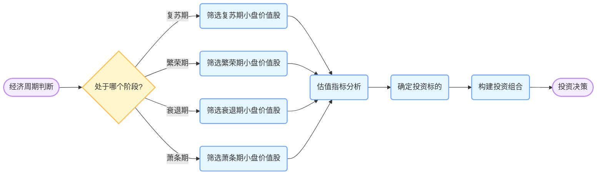

# 彼得林奇的"小盘价值股"在不同经济周期中的筛选策略

> 关键词：彼得林奇、小盘价值股、经济周期、筛选策略、股票投资

> 摘要：本文深入探讨了彼得林奇的“小盘价值股”投资理念，并详细分析其在不同经济周期中的筛选策略。通过介绍背景知识，阐述核心概念，讲解核心算法原理、数学模型，结合项目实战案例，探讨实际应用场景，推荐相关工具和资源，总结未来发展趋势与挑战等方面，为投资者提供全面、系统的关于“小盘价值股”在不同经济周期筛选的知识体系，帮助投资者更好地运用这一策略进行股票投资。

## 1. 背景介绍 
### 1.1 目的和范围
本文旨在深入研究彼得林奇所倡导的“小盘价值股”投资理念，并详细剖析其在不同经济周期下的筛选策略。通过对该策略的原理、方法、实际应用等方面进行全面探讨，为投资者提供一套科学、实用的投资参考框架。研究范围涵盖了不同经济周期（如复苏期、繁荣期、衰退期、萧条期）下“小盘价值股”的特征、筛选标准以及相应的投资决策方法。

### 1.2 预期读者
本文主要面向对股票投资感兴趣的个人投资者、金融从业者、投资研究人员等。无论是具有一定投资经验的专业人士，还是刚刚涉足股票市场的新手，都能从本文中获取有价值的信息和投资思路。

### 1.3 文档结构概述
本文共分为十个部分。第一部分为背景介绍，阐述了文章的目的、范围、预期读者和文档结构。第二部分介绍核心概念与联系，解释“小盘价值股”的定义、特点以及与经济周期的关系。第三部分讲解核心算法原理和具体操作步骤，通过Python代码展示筛选“小盘价值股”的算法。第四部分介绍数学模型和公式，并举例说明其在筛选过程中的应用。第五部分为项目实战，包括开发环境搭建、源代码实现和代码解读。第六部分探讨实际应用场景，分析“小盘价值股”在不同经济周期中的投资机会。第七部分推荐相关的工具和资源，包括学习资源、开发工具框架和相关论文著作。第八部分总结未来发展趋势与挑战，对“小盘价值股”投资策略的未来发展进行展望。第九部分为附录，解答常见问题。第十部分提供扩展阅读和参考资料。

### 1.4 术语表
#### 1.4.1 核心术语定义
- **小盘价值股**：指市值相对较小、具有一定投资价值的股票。通常，这类股票的市盈率、市净率等估值指标较低，公司具有良好的基本面和成长潜力。
- **经济周期**：指经济活动沿着经济发展的总体趋势所经历的有规律的扩张和收缩。一般分为复苏期、繁荣期、衰退期和萧条期四个阶段。
- **市盈率（P/E）**：指股票价格除以每股收益（EPS）的比率，反映了市场对公司盈利的预期。
- **市净率（P/B）**：指股票价格除以每股净资产（BVPS）的比率，反映了市场对公司净资产的估值。

#### 1.4.2 相关概念解释
- **价值投资**：一种投资策略，强调通过分析公司的基本面，寻找被市场低估的股票进行投资，以获取长期的投资回报。
- **成长投资**：一种投资策略，侧重于寻找具有高成长潜力的公司进行投资，即使这些公司的估值可能较高。
- **宏观经济指标**：反映宏观经济运行状况的统计指标，如国内生产总值（GDP）、通货膨胀率、利率等。

#### 1.4.3 缩略词列表
- **P/E**：市盈率（Price-to-Earnings Ratio）
- **P/B**：市净率（Price-to-Book Ratio）
- **GDP**：国内生产总值（Gross Domestic Product）

## 2. 核心概念与联系 
### 2.1 小盘价值股的定义与特征
小盘价值股是指市值相对较小、具有一定投资价值的股票。市值的划分并没有严格的标准，一般来说，小盘股的市值在几十亿到几百亿之间。这类股票通常具有以下特征：
- **估值较低**：市盈率、市净率等估值指标相对较低，表明市场对其价值的认可度不高。
- **成长潜力大**：由于公司规模较小，具有较大的成长空间和发展潜力。
- **市场关注度低**：相较于大盘股，小盘价值股往往受到市场的关注度较低，存在被低估的可能性。

### 2.2 经济周期的阶段划分与特征
经济周期一般分为复苏期、繁荣期、衰退期和萧条期四个阶段，每个阶段具有不同的特征：
- **复苏期**：经济开始从衰退中走出，GDP增长率逐渐回升，企业盈利开始改善，市场信心逐渐增强。
- **繁荣期**：经济处于高速增长阶段，GDP增长率较高，企业盈利大幅增长，市场表现活跃，投资者情绪乐观。
- **衰退期**：经济增长速度放缓，GDP增长率下降，企业盈利开始下滑，市场信心受到打击。
- **萧条期**：经济陷入严重衰退，GDP增长率为负，企业大量倒闭，失业率上升，市场低迷。

### 2.3 小盘价值股与经济周期的关系
不同经济周期对小盘价值股的影响不同：
- **复苏期**：在复苏期，经济开始好转，小盘价值股由于其较高的弹性和成长潜力，往往能够率先受益。此时，市场对小盘价值股的关注度逐渐提高，股价可能会出现较大幅度的上涨。
- **繁荣期**：在繁荣期，市场整体表现较好，大盘股和小盘股都可能有较好的表现。但由于小盘价值股的估值相对较低，可能会吸引更多的投资者关注，股价有望继续上涨。
- **衰退期**：在衰退期，经济增长放缓，企业盈利下滑，市场风险偏好下降。小盘价值股由于其抗风险能力相对较弱，可能会受到较大的影响，股价可能会出现下跌。
- **萧条期**：在萧条期，经济陷入严重衰退，市场信心极度低迷。小盘价值股可能会面临更大的压力，股价可能会大幅下跌。

### 2.4 核心概念原理和架构的文本示意图
```plaintext
              +---------------------+
              |    经济周期         |
              +---------------------+
                    |
                    |
        +-------------------------------+
        |                               |
+---------------+               +---------------+
| 小盘价值股筛选 |               | 投资决策      |
+---------------+               +---------------+
        |                               |
        |                               |
+---------------+               +---------------+
| 估值指标分析 |               | 投资组合构建 |
+---------------+               +---------------+
```

### 2.5 Mermaid 流程图


## 3. 核心算法原理 & 具体操作步骤 
### 3.1 核心算法原理
筛选“小盘价值股”的核心算法主要基于对股票的估值指标、财务指标和市场指标的分析。常用的估值指标包括市盈率（P/E）、市净率（P/B）等；财务指标包括净利润增长率、净资产收益率等；市场指标包括市值、成交量等。通过对这些指标进行综合分析，可以筛选出具有投资价值的小盘价值股。

### 3.2 具体操作步骤
#### 3.2.1 数据收集
首先，需要收集股票的相关数据，包括股票代码、名称、市盈率、市净率、净利润增长率、净资产收益率、市值、成交量等。这些数据可以从金融数据提供商（如东方财富、同花顺等）获取，也可以通过网络爬虫技术从相关网站上抓取。

#### 3.2.2 数据清洗
收集到的数据可能存在缺失值、异常值等问题，需要进行数据清洗。常见的数据清洗方法包括删除缺失值、填充缺失值、去除异常值等。

#### 3.2.3 指标计算
根据收集到的数据，计算所需的估值指标、财务指标和市场指标。例如，市盈率可以通过股票价格除以每股收益计算得到；市净率可以通过股票价格除以每股净资产计算得到。

#### 3.2.4 筛选条件设定
根据不同经济周期的特点，设定相应的筛选条件。例如，在复苏期，可以设定市盈率低于行业平均水平、净利润增长率高于一定阈值等条件；在繁荣期，可以设定市净率低于行业平均水平、净资产收益率高于一定阈值等条件。

#### 3.2.5 筛选股票
根据设定的筛选条件，对所有股票进行筛选，找出符合条件的小盘价值股。

#### 3.2.6 投资决策
根据筛选结果，结合个人的投资目标、风险承受能力等因素，做出投资决策。可以选择将筛选出的股票纳入投资组合，也可以进一步对这些股票进行深入分析，选择更具投资价值的股票进行投资。

### 3.3 Python源代码实现
```python
import pandas as pd

# 假设已经收集到股票数据并存储在一个DataFrame中
# 示例数据
data = {
    '股票代码': ['000001', '000002', '000003', '000004'],
    '股票名称': ['股票A', '股票B', '股票C', '股票D'],
    '市盈率': [10, 20, 15, 25],
    '市净率': [1.5, 2.0, 1.8, 2.2],
    '净利润增长率': [0.2, 0.1, 0.15, 0.05],
    '净资产收益率': [0.1, 0.12, 0.11, 0.08],
    '市值': [50, 100, 80, 120]
}
df = pd.DataFrame(data)

# 筛选条件设定
# 假设在复苏期，筛选市盈率低于18，净利润增长率高于0.1的小盘股（市值小于100亿）
filtered_df = df[(df['市盈率'] < 18) & (df['净利润增长率'] > 0.1) & (df['市值'] < 100)]

print("筛选出的小盘价值股：")
print(filtered_df)
```

### 3.4 代码解释
- 首先，使用`pandas`库创建一个包含股票数据的`DataFrame`。
- 然后，设定筛选条件，即市盈率低于18，净利润增长率高于0.1，市值小于100亿。
- 最后，使用布尔索引筛选出符合条件的股票，并打印筛选结果。

## 4. 数学模型和公式 & 详细讲解 & 举例说明 
### 4.1 市盈率（P/E）
#### 4.1.1 公式
市盈率（P/E）的计算公式为：
$$P/E = \frac{股票价格}{每股收益}$$

#### 4.1.2 详细讲解
市盈率反映了市场对公司盈利的预期。一般来说，市盈率越低，说明市场对公司的估值越低，股票可能被低估；市盈率越高，说明市场对公司的预期越高，股票可能被高估。

#### 4.1.3 举例说明
假设某股票的价格为20元，每股收益为2元，则该股票的市盈率为：
$$P/E = \frac{20}{2} = 10$$
这意味着投资者愿意为该公司每1元的盈利支付10元的价格。

### 4.2 市净率（P/B）
#### 4.2.1 公式
市净率（P/B）的计算公式为：
$$P/B = \frac{股票价格}{每股净资产}$$

#### 4.2.2 详细讲解
市净率反映了市场对公司净资产的估值。一般来说，市净率越低，说明市场对公司的净资产估值越低，股票可能被低估；市净率越高，说明市场对公司的净资产估值越高，股票可能被高估。

#### 4.2.3 举例说明
假设某股票的价格为15元，每股净资产为5元，则该股票的市净率为：
$$P/B = \frac{15}{5} = 3$$
这意味着投资者愿意为该公司每1元的净资产支付3元的价格。

### 4.3 净利润增长率
#### 4.3.1 公式
净利润增长率的计算公式为：
$$净利润增长率 = \frac{本期净利润 - 上期净利润}{上期净利润} \times 100\%$$

#### 4.3.2 详细讲解
净利润增长率反映了公司盈利的增长情况。一般来说，净利润增长率越高，说明公司的盈利能力越强，发展前景越好。

#### 4.3.3 举例说明
假设某公司上期净利润为100万元，本期净利润为120万元，则该公司的净利润增长率为：
$$净利润增长率 = \frac{120 - 100}{100} \times 100\% = 20\%$$
这意味着该公司的净利润较上期增长了20%。

### 4.4 净资产收益率（ROE）
#### 4.4.1 公式
净资产收益率（ROE）的计算公式为：
$$ROE = \frac{净利润}{净资产} \times 100\%$$

#### 4.4.2 详细讲解
净资产收益率反映了公司运用自有资本的效率。一般来说，净资产收益率越高，说明公司运用自有资本的效率越高，盈利能力越强。

#### 4.4.3 举例说明
假设某公司的净利润为50万元，净资产为200万元，则该公司的净资产收益率为：
$$ROE = \frac{50}{200} \times 100\% = 25\%$$
这意味着该公司每1元的净资产可以创造0.25元的净利润。

## 5. 项目实战：代码实际案例和详细解释说明 
### 5.1 开发环境搭建
#### 5.1.1 安装Python
首先，需要安装Python开发环境。可以从Python官方网站（https://www.python.org/downloads/）下载适合自己操作系统的Python版本，并按照安装向导进行安装。

#### 5.1.2 安装必要的库
在Python中，需要使用一些库来进行数据处理和分析，如`pandas`、`numpy`等。可以使用`pip`命令来安装这些库：
```sh
pip install pandas numpy
```

### 5.2 源代码详细实现和代码解读
```python
import pandas as pd

# 读取股票数据文件（假设数据存储在CSV文件中）
data = pd.read_csv('stock_data.csv')

# 数据清洗：删除缺失值
data = data.dropna()

# 计算所需指标
data['市盈率'] = data['股票价格'] / data['每股收益']
data['市净率'] = data['股票价格'] / data['每股净资产']
data['净利润增长率'] = (data['本期净利润'] - data['上期净利润']) / data['上期净利润']
data['净资产收益率'] = data['净利润'] / data['净资产']

# 筛选条件设定
# 假设在繁荣期，筛选市净率低于2，净资产收益率高于0.15的小盘股（市值小于200亿）
filtered_data = data[(data['市净率'] < 2) & (data['净资产收益率'] > 0.15) & (data['市值'] < 200)]

# 保存筛选结果到新的CSV文件
filtered_data.to_csv('filtered_stocks.csv', index=False)

print("筛选完成，结果已保存到 filtered_stocks.csv 文件中。")
```

### 5.3 代码解读与分析
- **数据读取**：使用`pandas`的`read_csv`函数读取存储股票数据的CSV文件。
- **数据清洗**：使用`dropna`方法删除包含缺失值的行，确保数据的完整性。
- **指标计算**：根据前面介绍的公式，计算市盈率、市净率、净利润增长率和净资产收益率。
- **筛选条件设定**：根据繁荣期的特点，设定市净率低于2，净资产收益率高于0.15，市值小于200亿的筛选条件。
- **筛选股票**：使用布尔索引筛选出符合条件的股票。
- **结果保存**：使用`to_csv`方法将筛选结果保存到新的CSV文件中。

## 6. 实际应用场景 
### 6.1 复苏期
在复苏期，经济开始从衰退中走出，企业盈利逐渐改善，市场信心逐渐增强。此时，小盘价值股由于其较高的弹性和成长潜力，往往能够率先受益。投资者可以关注以下类型的小盘价值股：
- **新兴产业中的小盘股**：新兴产业在复苏期往往具有较大的发展潜力，如科技、医疗、新能源等领域的小盘股。
- **业绩改善的小盘股**：一些原本业绩不佳的小盘股，在复苏期可能会由于行业环境的改善或自身经营策略的调整而实现业绩的大幅提升。

### 6.2 繁荣期
在繁荣期，经济处于高速增长阶段，市场整体表现较好。小盘价值股在繁荣期也可能有较好的表现，但投资者需要注意估值风险。可以关注以下类型的小盘价值股：
- **行业龙头小盘股**：在某些细分行业中，一些小盘股可能已经成为行业龙头，具有较强的竞争力和盈利能力。
- **具有并购重组预期的小盘股**：在繁荣期，企业之间的并购重组活动较为频繁，一些具有并购重组预期的小盘股可能会受到市场的关注。

### 6.3 衰退期
在衰退期，经济增长速度放缓，企业盈利下滑，市场风险偏好下降。此时，投资者需要更加谨慎地选择小盘价值股。可以关注以下类型的小盘价值股：
- **防御性行业中的小盘股**：如消费、医药等防御性行业中的小盘股，在衰退期具有较强的抗风险能力。
- **现金流充足的小盘股**：现金流充足的小盘股在衰退期能够更好地应对经营困难，降低财务风险。

### 6.4 萧条期
在萧条期，经济陷入严重衰退，市场信心极度低迷。此时，投资小盘价值股需要非常谨慎。可以关注以下类型的小盘价值股：
- **具有垄断优势的小盘股**：一些具有垄断优势的小盘股，在萧条期能够保持相对稳定的业绩。
- **低价小盘股**：在萧条期，一些小盘股的价格可能会大幅下跌，出现被低估的情况。投资者可以关注这些低价小盘股，但需要注意其基本面是否发生了恶化。

## 7. 工具和资源推荐
### 7.1 学习资源推荐
#### 7.1.1 书籍推荐
- 《彼得·林奇的成功投资》：彼得·林奇的经典著作，详细介绍了他的投资理念和方法。
- 《聪明的投资者》：本杰明·格雷厄姆的经典著作，被誉为价值投资的圣经。
- 《财务报表分析与股票估值》：帮助读者了解如何通过分析财务报表来评估股票的价值。

#### 7.1.2 在线课程
- Coursera上的“投资学原理”：由知名大学教授授课，系统介绍投资学的基本原理和方法。
- 网易云课堂上的“股票投资实战教程”：结合实际案例，讲解股票投资的技巧和策略。

#### 7.1.3 技术博客和网站
- 雪球网：国内知名的投资交流社区，提供股票行情、研报、投资策略等信息。
- 东方财富网：提供丰富的金融数据和资讯，包括股票、基金、债券等。
- 价值投资网：专注于价值投资领域，分享价值投资的理念、方法和案例。

### 7.2 开发工具框架推荐
#### 7.2.1 IDE和编辑器
- PyCharm：一款专业的Python集成开发环境，具有强大的代码编辑、调试和项目管理功能。
- Jupyter Notebook：一种交互式的开发环境，适合进行数据探索和分析。

#### 7.2.2 调试和性能分析工具
- `pdb`：Python自带的调试工具，用于调试Python代码。
- `cProfile`：Python标准库中的性能分析工具，用于分析代码的性能瓶颈。

#### 7.2.3 相关框架和库
- `pandas`：用于数据处理和分析的Python库，提供了丰富的数据结构和函数。
- `numpy`：用于科学计算的Python库，提供了高效的数组操作和数学函数。

### 7.3 相关论文著作推荐
#### 7.3.1 经典论文
- Eugene F. Fama和Kenneth R. French的“Common Risk Factors in the Returns on Stocks and Bonds”：提出了著名的三因子模型，对股票和债券的收益率进行了深入分析。
- Benjamin Graham和David Dodd的“Security Analysis”：价值投资领域的经典论文，奠定了价值投资的理论基础。

#### 7.3.2 最新研究成果
- 可以关注金融学术期刊，如《Journal of Finance》、《Review of Financial Studies》等，了解关于股票投资的最新研究成果。

#### 7.3.3 应用案例分析
- 可以参考一些投资机构的研究报告，了解他们在不同经济周期下的投资策略和案例分析。

## 8. 总结：未来发展趋势与挑战
### 8.1 未来发展趋势
- **科技赋能**：随着科技的不断发展，人工智能、大数据等技术将在“小盘价值股”筛选中得到更广泛的应用。通过对海量数据的分析和挖掘，可以更准确地筛选出具有投资价值的小盘价值股。
- **全球化投资**：随着全球经济的一体化，投资者将有更多的机会投资于不同国家和地区的小盘价值股。全球化投资可以分散风险，提高投资回报。
- **绿色投资**：随着环保意识的增强，绿色投资将成为未来的发展趋势。投资者将更加关注具有环保概念的小盘价值股，如新能源、环保科技等领域的股票。

### 8.2 挑战
- **市场不确定性**：股票市场具有较高的不确定性，经济周期的变化、政策的调整等因素都可能对“小盘价值股”的表现产生影响。投资者需要具备较强的风险意识和应对能力。
- **数据质量问题**：筛选“小盘价值股”需要大量的准确数据，但数据质量可能存在问题，如数据缺失、错误等。投资者需要对数据进行严格的清洗和验证，以确保筛选结果的准确性。
- **竞争激烈**：随着“小盘价值股”投资策略的普及，越来越多的投资者将关注这一领域，市场竞争将更加激烈。投资者需要不断提高自己的投资能力和分析水平，才能在竞争中脱颖而出。

## 9. 附录：常见问题与解答
### 9.1 如何确定小盘股的市值范围？
小盘股的市值范围并没有严格的标准，不同的市场和行业可能会有所差异。一般来说，市值在几十亿到几百亿之间的股票可以被认为是小盘股。投资者可以根据自己的投资目标和风险承受能力来确定小盘股的市值范围。

### 9.2 筛选“小盘价值股”时，应该优先考虑哪些指标？
在筛选“小盘价值股”时，应该综合考虑多个指标，如市盈率、市净率、净利润增长率、净资产收益率等。不同经济周期下，各指标的重要性可能会有所不同。例如，在复苏期，净利润增长率可能更为重要；在繁荣期，净资产收益率可能更为重要。

### 9.3 如何评估“小盘价值股”的风险？
评估“小盘价值股”的风险可以从以下几个方面入手：
- **公司基本面**：分析公司的财务状况、经营管理、行业竞争力等方面，评估公司的风险水平。
- **市场环境**：关注宏观经济形势、政策变化、行业发展趋势等因素，评估市场环境对“小盘价值股”的影响。
- **估值水平**：过高的估值可能意味着较高的风险，投资者需要关注“小盘价值股”的估值水平是否合理。

## 10. 扩展阅读 & 参考资料
### 10.1 扩展阅读
- 《漫步华尔街》：介绍了股票投资的各种理论和方法，以及如何在市场中进行有效的投资。
- 《金融炼金术》：乔治·索罗斯的著作，阐述了他的投资哲学和方法。

### 10.2 参考资料
- 东方财富网：https://www.eastmoney.com/
- 同花顺财经：https://www.10jqka.com.cn/
- 彼得·林奇的官方网站：https://www.peterlynch.com/

作者：AI天才研究院/AI Genius Institute & 禅与计算机程序设计艺术 /Zen And The Art of Computer Programming