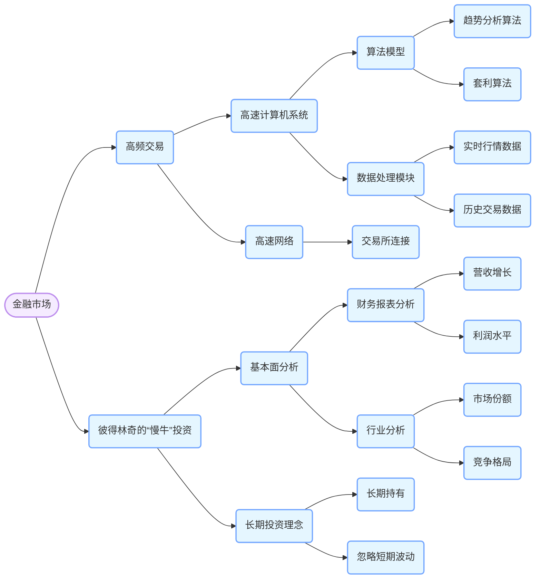

# 彼得林奇的"慢牛"投资在高频交易环境中的优势

> 关键词：彼得林奇、慢牛投资、高频交易、投资优势、价值投资

> 摘要：本文深入探讨了彼得林奇的“慢牛”投资策略在高频交易盛行的当下所具备的独特优势。首先介绍了文章的背景，包括目的范围、预期读者等内容。接着阐述了“慢牛”投资和高频交易的核心概念及联系，通过文本示意图和 Mermaid 流程图进行清晰展示。详细讲解了相关核心算法原理和具体操作步骤，结合 Python 代码进行说明。运用数学模型和公式对两种投资方式进行分析，并举例说明。通过项目实战给出代码实际案例及详细解释。分析了“慢牛”投资的实际应用场景，推荐了学习该策略的工具和资源，最后总结了未来发展趋势与挑战，解答了常见问题并提供扩展阅读和参考资料，旨在帮助投资者更好地理解和运用“慢牛”投资策略。

## 1. 背景介绍 
### 1.1 目的和范围
在当今金融市场中，高频交易凭借其高速的交易执行和复杂的算法模型占据了重要地位。然而，传统的价值投资策略如彼得林奇的“慢牛”投资依然有着不可忽视的作用。本文的目的在于深入分析“慢牛”投资在高频交易环境中的优势，为投资者提供全面的投资视角和决策参考。范围涵盖“慢牛”投资和高频交易的核心概念、算法原理、数学模型、实际应用等多个方面。

### 1.2 预期读者
本文预期读者包括金融市场投资者，无论是个人投资者还是机构投资者，都能从本文中获取对“慢牛”投资策略的深入理解；金融专业的学生和研究人员可以将本文作为学习和研究价值投资与高频交易对比的参考资料；从事金融科技和量化投资的从业者也能从中得到关于不同投资策略的启发。

### 1.3 文档结构概述
本文首先介绍背景信息，让读者了解文章的目的和适用人群。接着阐述“慢牛”投资和高频交易的核心概念及联系，为后续分析奠定基础。然后详细讲解核心算法原理和具体操作步骤，通过 Python 代码进行演示。运用数学模型和公式对两种投资方式进行分析，并举例说明。通过项目实战给出代码实际案例及详细解释。分析“慢牛”投资的实际应用场景，推荐学习该策略的工具和资源。最后总结未来发展趋势与挑战，解答常见问题并提供扩展阅读和参考资料。

### 1.4 术语表
#### 1.4.1 核心术语定义
- **彼得林奇的“慢牛”投资**：这是一种基于价值投资理念的投资策略，由彼得林奇提出。其核心思想是寻找具有长期增长潜力的公司，通过长期持有股票分享公司成长带来的收益，不追求短期的快速获利，如同“慢牛”稳步前行。
- **高频交易**：指利用计算机算法和高速网络，在极短的时间内进行大量的交易操作，通过微小的价格波动获取利润的交易方式。

#### 1.4.2 相关概念解释
- **价值投资**：是一种投资哲学，强调通过分析公司的基本面，如财务状况、盈利能力、行业地位等，寻找被市场低估的股票，并长期持有，等待股票价格回归其内在价值。
- **量化投资**：运用数学和统计学方法，结合计算机技术，对金融市场数据进行分析和建模，以制定投资策略的投资方式。高频交易是量化投资的一种具体应用。

#### 1.4.3 缩略词列表
- **ETF**：交易型开放式指数基金（Exchange Traded Fund），是一种在交易所上市交易的、基金份额可变的开放式基金。
- **API**：应用程序编程接口（Application Programming Interface），用于不同软件系统之间进行数据交互和功能调用。

## 2. 核心概念与联系 

### 核心概念原理
#### 彼得林奇的“慢牛”投资原理
彼得林奇认为，投资者应该关注公司的实际业务和发展前景，而不是被短期的市场波动所左右。他通过深入研究公司的基本面，寻找那些具有独特竞争优势、良好管理团队和持续增长潜力的公司。一旦发现这样的公司，就会长期持有其股票，让公司的成长带动股票价格的上升。例如，他在投资过程中，会关注公司的新产品研发、市场份额扩大、成本控制等方面的情况，以此来评估公司的价值。

#### 高频交易原理
高频交易基于先进的计算机算法和高速网络技术，通过对市场数据的实时分析和处理，在极短的时间内完成大量的交易。高频交易系统会监测市场上的各种价格信号和交易数据，当发现微小的价格差异或交易机会时，迅速下单进行交易，通过多次小额交易积累利润。例如，利用不同市场之间的价格差异进行套利交易，或者根据市场的短期趋势进行快速买卖。

### 架构的文本示意图
```plaintext
金融市场
|
|-- 高频交易
|   |-- 高速计算机系统
|   |   |-- 算法模型
|   |   |   |-- 趋势分析算法
|   |   |   |-- 套利算法
|   |   |-- 数据处理模块
|   |       |-- 实时行情数据
|   |       |-- 历史交易数据
|   |-- 高速网络
|       |-- 交易所连接
|
|-- 彼得林奇的“慢牛”投资
|   |-- 基本面分析
|   |   |-- 财务报表分析
|   |   |   |-- 营收增长
|   |   |   |-- 利润水平
|   |   |-- 行业分析
|   |       |-- 市场份额
|   |       |-- 竞争格局
|   |-- 长期投资理念
|       |-- 长期持有
|       |-- 忽略短期波动
```

### Mermaid 流程图


## 3. 核心算法原理 & 具体操作步骤 

### 彼得林奇“慢牛”投资的核心算法原理及 Python 代码实现
#### 原理
彼得林奇的“慢牛”投资主要基于基本面分析，通过评估公司的财务指标和行业地位来选择具有投资价值的股票。常用的财务指标包括市盈率（P/E）、市净率（P/B）、净资产收益率（ROE）等。一般来说，会选择市盈率较低、市净率合理且净资产收益率较高的公司。

#### 具体操作步骤
1. **数据获取**：从金融数据提供商获取公司的财务报表数据，包括营收、利润、净资产等。
2. **指标计算**：根据获取的数据计算市盈率、市净率和净资产收益率等指标。
3. **筛选股票**：根据设定的指标阈值筛选出具有投资价值的股票。

#### Python 代码实现
```python
import pandas as pd

# 模拟从金融数据提供商获取公司财务数据
def get_financial_data():
    data = {
        'company': ['A', 'B', 'C', 'D'],
        'price': [100, 200, 150, 300],
        'earnings_per_share': [5, 10, 8, 15],
        'book_value_per_share': [20, 50, 30, 60],
        'net_income': [1000, 2000, 1500, 3000],
        'shareholders_equity': [4000, 10000, 6000, 12000]
    }
    df = pd.DataFrame(data)
    return df

# 计算市盈率、市净率和净资产收益率
def calculate_metrics(df):
    df['pe_ratio'] = df['price'] / df['earnings_per_share']
    df['pb_ratio'] = df['price'] / df['book_value_per_share']
    df['roe'] = df['net_income'] / df['shareholders_equity']
    return df

# 筛选股票
def select_stocks(df):
    selected = df[(df['pe_ratio'] < 20) & (df['pb_ratio'] < 3) & (df['roe'] > 0.1)]
    return selected

# 主函数
def main():
    data = get_financial_data()
    metrics = calculate_metrics(data)
    selected_stocks = select_stocks(metrics)
    print(selected_stocks)

if __name__ == "__main__":
    main()
```

### 高频交易的核心算法原理及 Python 代码实现
#### 原理
高频交易的一种常见算法是趋势跟随算法，其基本思想是根据市场价格的短期趋势进行交易。当价格上涨时买入，价格下跌时卖出。

#### 具体操作步骤
1. **数据获取**：实时获取市场的价格数据。
2. **趋势判断**：通过计算价格的移动平均线等指标来判断市场的趋势。
3. **交易决策**：根据趋势判断结果进行买入或卖出操作。

#### Python 代码实现
```python
import pandas as pd
import numpy as np

# 模拟实时获取市场价格数据
def get_price_data():
    np.random.seed(0)
    prices = np.random.randn(100).cumsum() + 100
    return pd.Series(prices)

# 趋势判断
def trend_judgment(prices, window=10):
    short_ma = prices.rolling(window=window).mean()
    long_ma = prices.rolling(window=2 * window).mean()
    signals = np.where(short_ma > long_ma, 1, -1)
    return signals

# 交易决策
def trading_decision(signals):
    positions = [0]
    for i in range(1, len(signals)):
        if signals[i] > signals[i - 1]:
            positions.append(1)  # 买入
        elif signals[i] < signals[i - 1]:
            positions.append(-1)  # 卖出
        else:
            positions.append(positions[i - 1])
    return positions

# 主函数
def main():
    prices = get_price_data()
    signals = trend_judgment(prices)
    positions = trading_decision(signals)
    print("交易信号:", signals)
    print("持仓情况:", positions)

if __name__ == "__main__":
    main()
```

## 4. 数学模型和公式 & 详细讲解 & 举例说明 

### 彼得林奇“慢牛”投资的数学模型和公式
#### 市盈率（P/E）
市盈率是股票价格与每股收益的比值，公式为：
$$P/E = \frac{Price}{Earnings\ per\ Share}$$
其中，$Price$ 是股票的当前价格，$Earnings\ per\ Share$ 是每股收益。市盈率反映了投资者为获取公司每一元盈利所愿意支付的价格。一般来说，市盈率较低的股票可能被市场低估，具有投资价值。

例如，某公司的股票价格为 50 元，每股收益为 5 元，则该公司的市盈率为：
$$P/E = \frac{50}{5} = 10$$

#### 市净率（P/B）
市净率是股票价格与每股净资产的比值，公式为：
$$P/B = \frac{Price}{Book\ Value\ per\ Share}$$
其中，$Book\ Value\ per\ Share$ 是每股净资产。市净率反映了股票价格相对于公司净资产的倍数。一般来说，市净率较低的股票可能具有较高的安全边际。

例如，某公司的股票价格为 30 元，每股净资产为 10 元，则该公司的市净率为：
$$P/B = \frac{30}{10} = 3$$

#### 净资产收益率（ROE）
净资产收益率是净利润与股东权益的比值，公式为：
$$ROE = \frac{Net\ Income}{Shareholders'\ Equity}$$
其中，$Net\ Income$ 是净利润，$Shareholders'\ Equity$ 是股东权益。净资产收益率反映了公司运用自有资本的效率。一般来说，净资产收益率较高的公司具有较强的盈利能力。

例如，某公司的净利润为 1000 万元，股东权益为 5000 万元，则该公司的净资产收益率为：
$$ROE = \frac{1000}{5000} = 0.2 = 20\%$$

### 高频交易的数学模型和公式
#### 移动平均线（MA）
移动平均线是一种常用的技术分析指标，用于平滑价格数据，反映价格的趋势。简单移动平均线（SMA）的计算公式为：
$$SMA_n = \frac{\sum_{i = t - n + 1}^{t} P_i}{n}$$
其中，$SMA_n$ 是 $n$ 期的简单移动平均线，$P_i$ 是第 $i$ 期的价格，$n$ 是计算移动平均线的期数，$t$ 是当前期数。

例如，计算 5 期的简单移动平均线，假设当前价格序列为 [10, 12, 15, 13, 14]，则 5 期简单移动平均线为：
$$SMA_5 = \frac{10 + 12 + 15 + 13 + 14}{5} = 12.8$$

#### 趋势跟随策略的交易信号
趋势跟随策略根据短期移动平均线和长期移动平均线的交叉情况发出交易信号。当短期移动平均线从下向上穿过长期移动平均线时，发出买入信号；当短期移动平均线从上向下穿过长期移动平均线时，发出卖出信号。

设 $SMA_{short}$ 为短期移动平均线，$SMA_{long}$ 为长期移动平均线，则交易信号 $Signal$ 的计算公式为：
$$
Signal = 
\begin{cases}
1, & SMA_{short} > SMA_{long}\\
-1, & SMA_{short} < SMA_{long}
\end{cases}
$$

## 5. 项目实战：代码实际案例和详细解释说明 

### 5.1  开发环境搭建
#### 安装 Python
首先需要安装 Python 环境，建议使用 Python 3.7 及以上版本。可以从 Python 官方网站（https://www.python.org/downloads/）下载对应操作系统的安装包进行安装。

#### 安装必要的库
在项目中，我们使用了 `pandas` 和 `numpy` 等库，这些库可以通过 `pip` 进行安装。打开命令行工具，执行以下命令：
```sh
pip install pandas numpy
```

### 5.2  源代码详细实现和代码解读
#### 彼得林奇“慢牛”投资代码实现和解读
```python
import pandas as pd

# 模拟从金融数据提供商获取公司财务数据
def get_financial_data():
    data = {
        'company': ['A', 'B', 'C', 'D'],
        'price': [100, 200, 150, 300],
        'earnings_per_share': [5, 10, 8, 15],
        'book_value_per_share': [20, 50, 30, 60],
        'net_income': [1000, 2000, 1500, 3000],
        'shareholders_equity': [4000, 10000, 6000, 12000]
    }
    df = pd.DataFrame(data)
    return df

# 计算市盈率、市净率和净资产收益率
def calculate_metrics(df):
    df['pe_ratio'] = df['price'] / df['earnings_per_share']
    df['pb_ratio'] = df['price'] / df['book_value_per_share']
    df['roe'] = df['net_income'] / df['shareholders_equity']
    return df

# 筛选股票
def select_stocks(df):
    selected = df[(df['pe_ratio'] < 20) & (df['pb_ratio'] < 3) & (df['roe'] > 0.1)]
    return selected

# 主函数
def main():
    data = get_financial_data()
    metrics = calculate_metrics(data)
    selected_stocks = select_stocks(metrics)
    print(selected_stocks)

if __name__ == "__main__":
    main()
```
- **代码解读**：
  - `get_financial_data` 函数：模拟从金融数据提供商获取公司的财务数据，将数据存储在 `pandas` 的 `DataFrame` 中并返回。
  - `calculate_metrics` 函数：根据获取的财务数据计算市盈率、市净率和净资产收益率，并将计算结果添加到 `DataFrame` 中。
  - `select_stocks` 函数：根据设定的指标阈值筛选出具有投资价值的股票，这里选择市盈率小于 20、市净率小于 3 且净资产收益率大于 0.1 的股票。
  - `main` 函数：调用上述函数，完成数据获取、指标计算和股票筛选，并打印筛选结果。

#### 高频交易代码实现和解读
```python
import pandas as pd
import numpy as np

# 模拟实时获取市场价格数据
def get_price_data():
    np.random.seed(0)
    prices = np.random.randn(100).cumsum() + 100
    return pd.Series(prices)

# 趋势判断
def trend_judgment(prices, window=10):
    short_ma = prices.rolling(window=window).mean()
    long_ma = prices.rolling(window=2 * window).mean()
    signals = np.where(short_ma > long_ma, 1, -1)
    return signals

# 交易决策
def trading_decision(signals):
    positions = [0]
    for i in range(1, len(signals)):
        if signals[i] > signals[i - 1]:
            positions.append(1)  # 买入
        elif signals[i] < signals[i - 1]:
            positions.append(-1)  # 卖出
        else:
            positions.append(positions[i - 1])
    return positions

# 主函数
def main():
    prices = get_price_data()
    signals = trend_judgment(prices)
    positions = trading_decision(signals)
    print("交易信号:", signals)
    print("持仓情况:", positions)

if __name__ == "__main__":
    main()
```
- **代码解读**：
  - `get_price_data` 函数：模拟实时获取市场价格数据，使用 `numpy` 生成随机价格序列，并将其转换为 `pandas` 的 `Series` 对象。
  - `trend_judgment` 函数：计算短期移动平均线和长期移动平均线，并根据它们的大小关系生成交易信号。当短期移动平均线大于长期移动平均线时，信号为 1（买入）；否则为 -1（卖出）。
  - `trading_decision` 函数：根据交易信号生成持仓情况。当信号从 -1 变为 1 时，进行买入操作；当信号从 1 变为 -1 时，进行卖出操作；否则保持持仓不变。
  - `main` 函数：调用上述函数，完成价格数据获取、趋势判断和交易决策，并打印交易信号和持仓情况。

### 5.3  代码解读与分析
#### 彼得林奇“慢牛”投资代码分析
这种基于基本面分析的代码实现简单易懂，通过计算关键财务指标并筛选股票，可以快速找到具有投资价值的公司。然而，该代码只是一个简单的示例，实际应用中需要从真实的金融数据提供商获取数据，并且可能需要考虑更多的因素，如行业特点、宏观经济环境等。

#### 高频交易代码分析
高频交易代码使用了趋势跟随策略，通过移动平均线判断市场趋势并进行交易决策。该代码的优点是逻辑清晰，易于实现。但在实际应用中，高频交易需要考虑更多的因素，如交易成本、市场流动性、算法的稳定性等。同时，高频交易对数据的实时性和系统的性能要求较高。

## 6. 实际应用场景 
### 个人投资者
对于个人投资者来说，彼得林奇的“慢牛”投资策略具有很大的优势。个人投资者通常没有专业的交易团队和高速的交易系统，难以参与高频交易。而“慢牛”投资策略更注重公司的基本面分析，个人投资者可以通过学习财务知识和行业分析方法，选择具有长期增长潜力的股票进行投资。例如，一个普通的上班族可以在业余时间研究一些自己熟悉的行业和公司，选择几家优质的公司长期持有，分享公司成长带来的收益。

### 机构投资者
机构投资者在投资组合中也可以适当采用“慢牛”投资策略。虽然机构投资者有能力进行高频交易，但高频交易往往伴随着较高的风险和交易成本。“慢牛”投资可以作为一种稳健的投资方式，为投资组合提供稳定性。例如，养老基金、保险资金等追求长期稳定收益的机构投资者，可以将一部分资金投资于具有良好基本面的股票，以实现资产的保值增值。

### 市场环境不稳定时
在市场环境不稳定，如股市大幅波动、宏观经济形势不明朗时，高频交易的风险会显著增加。此时，“慢牛”投资策略的优势更加明显。投资者可以忽略短期的市场波动，专注于公司的长期发展。例如，在金融危机期间，许多采用高频交易策略的投资者遭受了巨大损失，而那些坚持“慢牛”投资的投资者，通过持有优质公司的股票，在市场复苏后获得了丰厚的回报。

## 7. 工具和资源推荐
### 7.1 学习资源推荐
#### 7.1.1 书籍推荐
- 《彼得林奇的成功投资》：彼得林奇本人所著，详细介绍了他的投资理念和方法，是学习“慢牛”投资的经典读物。
- 《聪明的投资者》：本杰明·格雷厄姆所著，被誉为价值投资的圣经，对理解价值投资的基本原理和方法有很大帮助。
- 《金融炼金术》：乔治·索罗斯所著，书中介绍了他的投资哲学和交易策略，对于理解金融市场的运行机制和投资心理有很大启发。

#### 7.1.2 在线课程
- Coursera 上的“投资学原理”课程：由知名高校教授授课，系统介绍了投资学的基本理论和方法。
- 网易云课堂上的“价值投资实战”课程：结合实际案例，讲解价值投资的具体操作方法。

#### 7.1.3 技术博客和网站
- 雪球网：国内知名的投资交流社区，有很多投资者分享自己的投资经验和研究成果。
- Seeking Alpha：国外的金融投资网站，提供丰富的金融市场分析和投资研究报告。

### 7.2 开发工具框架推荐
#### 7.2.1 IDE和编辑器
- PyCharm：一款专业的 Python 集成开发环境，具有代码编辑、调试、自动补全等功能，适合开发 Python 投资分析程序。
- Jupyter Notebook：一个交互式的开发环境，支持 Python、R 等多种编程语言，适合进行数据探索和分析。

#### 7.2.2 调试和性能分析工具
- PDB：Python 自带的调试工具，可以帮助开发者定位代码中的错误。
- cProfile：Python 的性能分析工具，可以分析代码的运行时间和函数调用情况，帮助优化代码性能。

#### 7.2.3 相关框架和库
- Pandas：用于数据处理和分析的 Python 库，提供了丰富的数据结构和数据操作方法。
- Numpy：用于科学计算的 Python 库，提供了高效的数组操作和数学函数。
- TA-Lib：技术分析库，提供了各种技术分析指标的计算函数，如移动平均线、相对强弱指数等。

### 7.3 相关论文著作推荐
#### 7.3.1 经典论文
- “The Capital Asset Pricing Model: Theory and Evidence”：该论文对资本资产定价模型进行了深入的研究和探讨，是金融领域的经典论文之一。
- “Efficient Capital Markets: A Review of Theory and Empirical Work”：该论文提出了有效市场假说，对金融市场的效率和定价机制进行了分析。

#### 7.3.2 最新研究成果
- 关注顶级金融学术期刊，如《Journal of Finance》、《Review of Financial Studies》等，这些期刊会发表最新的金融研究成果。
- 参加金融学术会议，如美国金融协会年会（AFA）等，了解行业最新动态和研究趋势。

#### 7.3.3 应用案例分析
- 《金融科技前沿：应用与案例》：该书介绍了金融科技在投资领域的应用案例，包括高频交易、量化投资等方面的案例分析。
- 各大金融机构的研究报告：许多金融机构会发布关于投资策略和市场分析的研究报告，可以从中了解实际应用中的案例和经验。

## 8. 总结：未来发展趋势与挑战
### 未来发展趋势
#### “慢牛”投资与科技融合
随着科技的不断发展，“慢牛”投资也将与科技进行更深入的融合。例如，利用大数据和人工智能技术进行公司基本面分析，可以更全面、准确地评估公司的价值。同时，通过智能投顾平台，个人投资者可以更方便地获取“慢牛”投资建议。

#### 高频交易与“慢牛”投资结合
在未来的投资市场中，高频交易和“慢牛”投资可能会相互结合。机构投资者可以在高频交易获取短期利润的同时，通过“慢牛”投资为投资组合提供稳定性。例如，利用高频交易进行市场的短期套利，同时将一部分资金长期投资于优质公司的股票。

### 挑战
#### 市场不确定性增加
随着全球经济的不确定性增加，金融市场的波动也会加剧。这对“慢牛”投资来说是一个挑战，因为投资者需要更加准确地评估公司的基本面和未来发展前景，以应对市场的变化。

#### 技术竞争加剧
在高频交易领域，技术竞争日益激烈。为了在市场中获得优势，高频交易机构需要不断投入大量的资金和人力进行技术研发，提高交易系统的速度和稳定性。对于“慢牛”投资来说，也需要不断学习和应用新的技术和方法，以提高投资分析的效率和准确性。

#### 监管政策变化
金融市场的监管政策不断变化，这对投资策略的实施会产生影响。高频交易可能会面临更严格的监管，以防止市场操纵和不公平交易。而“慢牛”投资也需要遵守相关的法律法规，确保投资行为的合法性和合规性。

## 9. 附录：常见问题与解答
### 问题 1：“慢牛”投资和高频交易哪个更适合初学者？
解答：对于初学者来说，“慢牛”投资更适合。高频交易需要具备专业的技术知识和高速的交易系统，对投资者的要求较高。而“慢牛”投资更注重基本面分析，初学者可以通过学习财务知识和行业分析方法，逐步掌握投资技巧。

### 问题 2：“慢牛”投资是否需要关注市场短期波动？
解答：“慢牛”投资强调长期投资，忽略短期波动。但这并不意味着完全不关注市场短期波动。投资者可以通过关注市场短期波动，了解市场情绪和趋势，为长期投资决策提供参考。

### 问题 3：高频交易的风险主要有哪些？
解答：高频交易的风险主要包括市场风险、技术风险和监管风险。市场风险是指由于市场价格波动导致的交易损失；技术风险是指由于交易系统故障、网络延迟等技术问题导致的交易失败；监管风险是指由于监管政策变化导致的交易受限或违规处罚。

### 问题 4：如何评估“慢牛”投资的效果？
解答：可以通过以下几个指标评估“慢牛”投资的效果：投资收益率、资产净值增长率、夏普比率等。同时，还可以与市场基准指数进行比较，评估投资组合的表现是否优于市场平均水平。

## 10. 扩展阅读 & 参考资料
### 扩展阅读
- 《巴菲特致股东的信》：沃伦·巴菲特每年写给股东的信，分享了他的投资理念和公司管理经验。
- 《量化投资：策略与技术》：介绍了量化投资的基本原理和方法，包括高频交易和量化选股等方面的内容。

### 参考资料
- 彼得林奇. 《彼得林奇的成功投资》. 机械工业出版社.
- 本杰明·格雷厄姆. 《聪明的投资者》. 人民邮电出版社.
- 乔治·索罗斯. 《金融炼金术》. 海南出版社.

作者：AI天才研究院/AI Genius Institute & 禅与计算机程序设计艺术 /Zen And The Art of Computer Programming