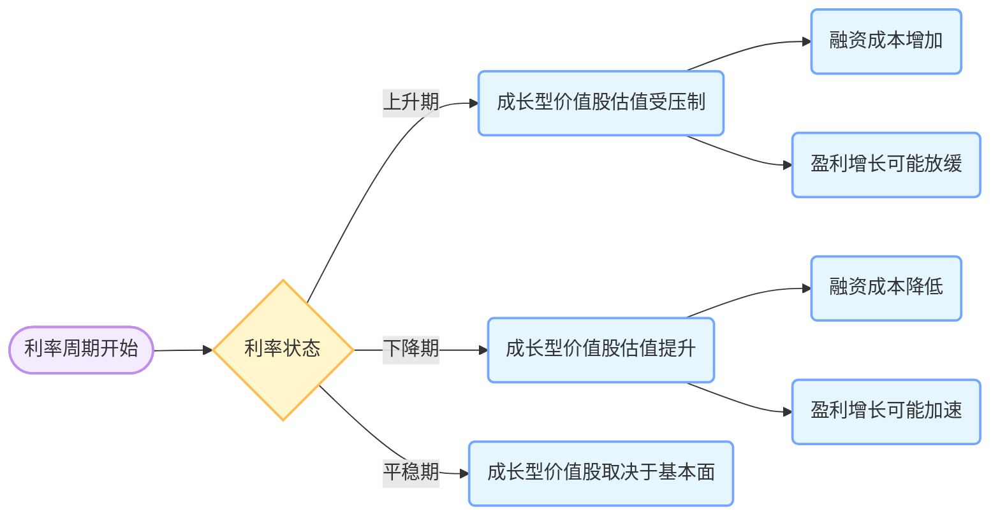

# 彼得林奇的“成长型价值股”在不同利率周期中的表现分析

> 关键词：彼得林奇、成长型价值股、利率周期、股票表现、投资分析

> 摘要：本文旨在深入分析彼得林奇所倡导的“成长型价值股”在不同利率周期中的表现。通过对核心概念的阐释、相关算法原理的探讨、数学模型的构建、项目实战案例的分析以及实际应用场景的研究，揭示成长型价值股在不同利率环境下的特征和规律，为投资者提供有价值的参考。同时，推荐了相关的学习资源、开发工具框架和论文著作，最后对未来发展趋势与挑战进行了总结，并提供常见问题解答和扩展阅读参考资料。

## 1. 背景介绍 
### 1.1 目的和范围
本研究的主要目的是全面、系统地分析彼得林奇提出的“成长型价值股”在不同利率周期中的表现。具体范围涵盖了不同利率上升期、下降期以及利率平稳期，研究成长型价值股的股价波动、股息分配、盈利能力等多方面的表现，以帮助投资者更好地理解和把握这类股票在不同利率环境下的投资机会和风险。

### 1.2 预期读者
本文预期读者主要包括专业投资者、金融分析师、投资顾问以及对股票投资感兴趣的业余爱好者。对于专业人士，本文提供的深入分析和研究成果可作为投资决策的重要参考；对于业余爱好者，本文的通俗易懂的讲解有助于他们理解成长型价值股和利率周期的关系，提升投资知识和技能。

### 1.3 文档结构概述
本文将按照以下结构进行阐述：首先介绍核心概念与联系，包括成长型价值股和利率周期的定义和相互关系；接着讲解核心算法原理和具体操作步骤，使用 Python 代码进行详细说明；然后构建数学模型和公式，并通过举例进行详细讲解；之后通过项目实战展示代码实际案例并进行详细解释；再探讨实际应用场景；推荐相关的工具和资源；总结未来发展趋势与挑战；最后提供常见问题解答和扩展阅读参考资料。

### 1.4 术语表
#### 1.4.1 核心术语定义
- **成长型价值股**：彼得林奇所定义的一类股票，这类股票既具有成长股的特征，即公司处于快速发展阶段，营收和利润持续增长，同时又具备价值股的属性，如股价相对其内在价值被低估，具有一定的安全边际。
- **利率周期**：指利率随宏观经济环境变化而呈现出的周期性波动，通常包括利率上升期、利率下降期和利率平稳期。

#### 1.4.2 相关概念解释
- **股息分配**：公司将盈利的一部分以现金或股票的形式分配给股东的行为，是投资者获取收益的重要途径之一。
- **盈利能力**：公司通过经营活动获取利润的能力，通常用净利润、净资产收益率等指标来衡量。

#### 1.4.3 缩略词列表
- **PE**：市盈率（Price-to-Earnings Ratio），是股票价格除以每股收益的比率，用于衡量股票的估值水平。
- **ROE**：净资产收益率（Return on Equity），是净利润与平均股东权益的百分比，反映股东权益的收益水平。

## 2. 核心概念与联系 

### 2.1 成长型价值股的原理
成长型价值股的核心在于公司的成长潜力和被低估的价值。从成长角度来看，这类公司通常处于新兴行业或具有创新业务模式，能够不断拓展市场份额，实现营收和利润的快速增长。例如，一些科技初创公司在技术创新的推动下，迅速占领市场，业绩呈现爆发式增长。从价值角度来看，由于市场的短期波动或投资者的误解，这些公司的股价可能低于其内在价值。投资者通过挖掘这类股票，可以在公司成长过程中获得股价上涨和股息分配的双重收益。

### 2.2 利率周期的原理
利率是宏观经济调控的重要工具，其周期波动与宏观经济形势密切相关。在经济繁荣时期，为了抑制通货膨胀，央行通常会提高利率，使得资金成本上升，市场上的资金供应量减少；在经济衰退时期，为了刺激经济增长，央行会降低利率，降低资金成本，增加市场上的资金供应量。利率周期的变化会对各个经济领域产生广泛的影响，包括股票市场。

### 2.3 成长型价值股与利率周期的联系
利率周期的变化会对成长型价值股的表现产生重要影响。在利率上升期，资金成本增加，投资者对股票的要求回报率提高，成长型价值股的估值可能会受到一定的压制。同时，高利率环境可能会增加公司的融资成本，对公司的盈利增长产生一定的负面影响。在利率下降期，资金成本降低，投资者对股票的要求回报率下降，成长型价值股的估值可能会得到提升。此外，低利率环境有利于公司降低融资成本，促进公司的投资和扩张，从而推动公司的盈利增长。在利率平稳期，成长型价值股的表现更多地取决于公司自身的基本面因素。

### 2.4 文本示意图
```plaintext
利率周期
├── 利率上升期
│   └── 成长型价值股估值受压制，融资成本增加，盈利增长可能放缓
├── 利率下降期
│   └── 成长型价值股估值提升，融资成本降低，盈利增长可能加速
└── 利率平稳期
    └── 成长型价值股表现取决于公司基本面
```

### 2.5 Mermaid 流程图


## 3. 核心算法原理 & 具体操作步骤 

### 3.1 核心算法原理
为了分析成长型价值股在不同利率周期中的表现，我们可以采用以下算法：
1. **数据收集**：收集成长型价值股的历史股价、财务数据以及利率周期的相关数据。
2. **数据预处理**：对收集到的数据进行清洗、整理和归一化处理，以便后续分析。
3. **利率周期划分**：根据利率数据，将时间序列划分为不同的利率周期。
4. **股票表现分析**：在每个利率周期内，计算成长型价值股的股价收益率、股息收益率、市盈率变化等指标，分析其表现。

### 3.2 具体操作步骤及 Python 代码实现

#### 3.2.1 数据收集
我们可以使用`pandas-datareader`库从雅虎财经等数据源收集股票数据，使用`fredapi`库从美联储经济数据网站收集利率数据。
```python
import pandas as pd
import pandas_datareader.data as web
from fredapi import Fred

# 收集股票数据
start_date = '2010-01-01'
end_date = '2023-01-01'
stock_symbol = 'AAPL'  # 以苹果公司为例
stock_data = web.DataReader(stock_symbol, 'yahoo', start_date, end_date)

# 收集利率数据
fred = Fred(api_key='YOUR_API_KEY')
interest_rate_data = fred.get_series('FEDFUNDS', start_date, end_date)
```

#### 3.2.2 数据预处理
对收集到的数据进行清洗和整理，去除缺失值，并进行归一化处理。
```python
# 去除缺失值
stock_data = stock_data.dropna()
interest_rate_data = interest_rate_data.dropna()

# 合并数据
merged_data = pd.merge(stock_data['Close'], interest_rate_data, left_index=True, right_index=True)
merged_data.columns = ['Stock_Price', 'Interest_Rate']

# 归一化处理
from sklearn.preprocessing import MinMaxScaler
scaler = MinMaxScaler()
merged_data_scaled = scaler.fit_transform(merged_data)
merged_data_scaled = pd.DataFrame(merged_data_scaled, columns=merged_data.columns, index=merged_data.index)
```

#### 3.2.3 利率周期划分
根据利率数据的变化趋势，将时间序列划分为不同的利率周期。
```python
# 计算利率变化率
merged_data_scaled['Interest_Rate_Change'] = merged_data_scaled['Interest_Rate'].diff()

# 划分利率周期
def classify_interest_cycle(row):
    if row['Interest_Rate_Change'] > 0:
        return '上升期'
    elif row['Interest_Rate_Change'] < 0:
        return '下降期'
    else:
        return '平稳期'

merged_data_scaled['Interest_Cycle'] = merged_data_scaled.apply(classify_interest_cycle, axis=1)
```

#### 3.2.4 股票表现分析
在每个利率周期内，计算成长型价值股的股价收益率、股息收益率、市盈率变化等指标，分析其表现。
```python
# 计算股价收益率
merged_data_scaled['Stock_Return'] = merged_data_scaled['Stock_Price'].pct_change()

# 按利率周期分组分析
cycle_groups = merged_data_scaled.groupby('Interest_Cycle')
for cycle, group in cycle_groups:
    average_return = group['Stock_Return'].mean()
    print(f'{cycle}的平均股价收益率: {average_return}')
```

## 4. 数学模型和公式 & 详细讲解 & 举例说明 

### 4.1 股价收益率公式
股价收益率是衡量股票投资收益的重要指标，其计算公式为：
$$R_t = \frac{P_t - P_{t-1}}{P_{t-1}}$$
其中，$R_t$ 表示第 $t$ 期的股价收益率，$P_t$ 表示第 $t$ 期的股票价格，$P_{t-1}$ 表示第 $t-1$ 期的股票价格。

### 4.2 股息收益率公式
股息收益率是指股息与股票价格的比率，其计算公式为：
$$DR = \frac{D}{P}$$
其中，$DR$ 表示股息收益率，$D$ 表示每股股息，$P$ 表示股票价格。

### 4.3 市盈率公式
市盈率是股票价格与每股收益的比率，其计算公式为：
$$PE = \frac{P}{EPS}$$
其中，$PE$ 表示市盈率，$P$ 表示股票价格，$EPS$ 表示每股收益。

### 4.4 举例说明
假设某成长型价值股在第 1 期的股价为 $100$ 元，在第 2 期的股价为 $110$ 元，每股股息为 $2$ 元，每股收益为 $5$ 元。
- **股价收益率**：
$$R_2 = \frac{110 - 100}{100} = 0.1 = 10\%$$
- **股息收益率**：
$$DR = \frac{2}{110} \approx 0.0182 = 1.82\%$$
- **市盈率**：
$$PE = \frac{110}{5} = 22$$

## 5. 项目实战：代码实际案例和详细解释说明 

### 5.1  开发环境搭建
#### 5.1.1 安装 Python
首先需要安装 Python 环境，建议使用 Python 3.7 及以上版本。可以从 Python 官方网站（https://www.python.org/downloads/）下载安装包进行安装。

#### 5.1.2 安装必要的库
使用`pip`命令安装以下必要的库：
```sh
pip install pandas pandas-datareader fredapi scikit-learn matplotlib
```

### 5.2  源代码详细实现和代码解读
```python
import pandas as pd
import pandas_datareader.data as web
from fredapi import Fred
from sklearn.preprocessing import MinMaxScaler
import matplotlib.pyplot as plt

# 收集股票数据
start_date = '2010-01-01'
end_date = '2023-01-01'
stock_symbol = 'AAPL'  # 以苹果公司为例
stock_data = web.DataReader(stock_symbol, 'yahoo', start_date, end_date)

# 收集利率数据
fred = Fred(api_key='YOUR_API_KEY')
interest_rate_data = fred.get_series('FEDFUNDS', start_date, end_date)

# 去除缺失值
stock_data = stock_data.dropna()
interest_rate_data = interest_rate_data.dropna()

# 合并数据
merged_data = pd.merge(stock_data['Close'], interest_rate_data, left_index=True, right_index=True)
merged_data.columns = ['Stock_Price', 'Interest_Rate']

# 归一化处理
scaler = MinMaxScaler()
merged_data_scaled = scaler.fit_transform(merged_data)
merged_data_scaled = pd.DataFrame(merged_data_scaled, columns=merged_data.columns, index=merged_data.index)

# 计算利率变化率
merged_data_scaled['Interest_Rate_Change'] = merged_data_scaled['Interest_Rate'].diff()

# 划分利率周期
def classify_interest_cycle(row):
    if row['Interest_Rate_Change'] > 0:
        return '上升期'
    elif row['Interest_Rate_Change'] < 0:
        return '下降期'
    else:
        return '平稳期'

merged_data_scaled['Interest_Cycle'] = merged_data_scaled.apply(classify_interest_cycle, axis=1)

# 计算股价收益率
merged_data_scaled['Stock_Return'] = merged_data_scaled['Stock_Price'].pct_change()

# 按利率周期分组分析
cycle_groups = merged_data_scaled.groupby('Interest_Cycle')
average_returns = {}
for cycle, group in cycle_groups:
    average_return = group['Stock_Return'].mean()
    average_returns[cycle] = average_return
    print(f'{cycle}的平均股价收益率: {average_return}')

# 可视化结果
plt.bar(average_returns.keys(), average_returns.values())
plt.xlabel('利率周期')
plt.ylabel('平均股价收益率')
plt.title('成长型价值股在不同利率周期的平均股价收益率')
plt.show()
```

### 5.3  代码解读与分析
- **数据收集部分**：使用`pandas-datareader`库从雅虎财经收集股票数据，使用`fredapi`库从美联储经济数据网站收集利率数据。
- **数据预处理部分**：去除缺失值，合并股票数据和利率数据，并进行归一化处理，以便后续分析。
- **利率周期划分部分**：计算利率变化率，根据变化率将时间序列划分为不同的利率周期。
- **股票表现分析部分**：计算股价收益率，按利率周期分组计算平均股价收益率，并将结果可视化展示。

通过对代码的运行结果进行分析，我们可以直观地看到成长型价值股在不同利率周期中的平均股价收益率，从而为投资决策提供参考。

## 6. 实际应用场景 
### 6.1 投资组合管理
投资者可以根据不同利率周期中成长型价值股的表现，调整投资组合的配置。在利率下降期，增加成长型价值股的投资比例，以获取更高的收益；在利率上升期，适当减少成长型价值股的投资比例，降低风险。

### 6.2 风险管理
了解成长型价值股在不同利率周期中的表现，有助于投资者识别和管理投资风险。例如，在利率上升期，投资者可以更加关注公司的财务状况和现金流，选择那些具有较强抗风险能力的成长型价值股。

### 6.3 宏观经济分析
成长型价值股在不同利率周期中的表现也可以作为宏观经济分析的参考指标。如果成长型价值股在利率上升期表现依然良好，可能意味着经济具有较强的韧性；反之，如果在利率下降期表现不佳，可能暗示经济面临一定的压力。

## 7. 工具和资源推荐
### 7.1 学习资源推荐
#### 7.1.1 书籍推荐
- 《彼得林奇的成功投资》：彼得林奇的经典著作，详细介绍了他的投资理念和方法。
- 《聪明的投资者》：本杰明·格雷厄姆的代表作，被誉为投资界的圣经，对价值投资理论进行了深入阐述。
- 《金融市场与金融机构》：全面介绍了金融市场和金融机构的基本知识，有助于理解利率周期和股票市场的关系。

#### 7.1.2 在线课程
- Coursera 上的“投资学原理”：由知名大学教授授课，系统讲解投资学的基本原理和方法。
- edX 上的“金融市场分析”：提供了金融市场分析的实用技巧和工具。

#### 7.1.3 技术博客和网站
- Seeking Alpha：提供专业的股票分析和投资建议。
- Bloomberg：全球知名的财经媒体，提供及时的金融市场信息和分析。

### 7.2 开发工具框架推荐
#### 7.2.1 IDE和编辑器
- PyCharm：功能强大的 Python 集成开发环境，提供代码编辑、调试、版本控制等功能。
- Jupyter Notebook：交互式的开发环境，适合进行数据分析和可视化。

#### 7.2.2 调试和性能分析工具
- PDB：Python 自带的调试工具，可用于调试 Python 代码。
- cProfile：Python 标准库中的性能分析工具，可用于分析代码的运行时间和性能瓶颈。

#### 7.2.3 相关框架和库
- Pandas：用于数据处理和分析的 Python 库，提供了高效的数据结构和数据分析工具。
- NumPy：用于科学计算的 Python 库，提供了高效的数组操作和数学函数。
- Matplotlib：用于数据可视化的 Python 库，可绘制各种类型的图表。

### 7.3 相关论文著作推荐
#### 7.3.1 经典论文
- Fama, E. F., & French, K. R. (1992). The cross-section of expected stock returns. The Journal of Finance, 47(2), 427-465. 该论文提出了著名的 Fama-French 三因子模型，对股票收益的影响因素进行了深入研究。
- Sharpe, W. F. (1964). Capital asset prices: A theory of market equilibrium under conditions of risk. The Journal of Finance, 19(3), 425-442. 该论文提出了资本资产定价模型（CAPM），为资产定价和投资组合理论奠定了基础。

#### 7.3.2 最新研究成果
- 通过 Google Scholar 等学术搜索引擎，可以搜索到关于成长型价值股和利率周期的最新研究成果，了解该领域的前沿动态。

#### 7.3.3 应用案例分析
- 一些金融研究机构和投资公司会发布关于成长型价值股投资的应用案例分析报告，这些报告可以为投资者提供实际操作的参考。

## 8. 总结：未来发展趋势与挑战
### 8.1 未来发展趋势
- **科技驱动**：随着科技的不断进步，成长型价值股将更多地集中在科技领域，如人工智能、大数据、云计算等。这些领域的公司具有较高的成长潜力，将在未来的市场中占据重要地位。
- **全球一体化**：随着全球经济一体化的发展，成长型价值股的投资将更加国际化。投资者可以通过投资全球范围内的成长型价值股，分散风险，获取更高的收益。
- **可持续投资**：越来越多的投资者开始关注企业的社会责任和可持续发展，成长型价值股的投资也将更加注重企业的环境、社会和治理（ESG）因素。

### 8.2 挑战
- **利率不确定性**：利率的变化受到多种因素的影响，如宏观经济形势、货币政策等，具有较大的不确定性。这给投资者分析成长型价值股在不同利率周期中的表现带来了一定的困难。
- **市场竞争加剧**：随着成长型价值股的投资受到越来越多的关注，市场竞争也将加剧。投资者需要具备更强的分析能力和选股能力，才能在市场中获得超额收益。
- **黑天鹅事件**：如金融危机、自然灾害、疫情等黑天鹅事件的发生，可能会对成长型价值股的表现产生重大影响，增加投资风险。

## 9. 附录：常见问题与解答
### 9.1 什么是成长型价值股？
成长型价值股是彼得林奇所定义的一类股票，这类股票既具有成长股的特征，即公司处于快速发展阶段，营收和利润持续增长，同时又具备价值股的属性，如股价相对其内在价值被低估，具有一定的安全边际。

### 9.2 利率周期是如何划分的？
利率周期通常根据利率的变化趋势划分为利率上升期、利率下降期和利率平稳期。可以通过计算利率的变化率来判断利率处于哪个阶段，当利率变化率大于 0 时为利率上升期，小于 0 时为利率下降期，等于 0 时为利率平稳期。

### 9.3 成长型价值股在不同利率周期中的表现有何不同？
在利率上升期，成长型价值股的估值可能会受到一定的压制，融资成本增加，盈利增长可能放缓；在利率下降期，成长型价值股的估值可能会得到提升，融资成本降低，盈利增长可能加速；在利率平稳期，成长型价值股的表现更多地取决于公司自身的基本面因素。

### 9.4 如何分析成长型价值股在不同利率周期中的表现？
可以通过收集成长型价值股的历史股价、财务数据以及利率周期的相关数据，进行数据预处理和利率周期划分，然后在每个利率周期内计算股价收益率、股息收益率、市盈率变化等指标，分析其表现。

## 10. 扩展阅读 & 参考资料
- 彼得林奇. 《彼得林奇的成功投资》. 机械工业出版社.
- 本杰明·格雷厄姆. 《聪明的投资者》. 人民邮电出版社.
- Fama, E. F., & French, K. R. (1992). The cross-section of expected stock returns. The Journal of Finance, 47(2), 427-465.
- Sharpe, W. F. (1964). Capital asset prices: A theory of market equilibrium under conditions of risk. The Journal of Finance, 19(3), 425-442.

作者：AI天才研究院/AI Genius Institute & 禅与计算机程序设计艺术 /Zen And The Art of Computer Programming