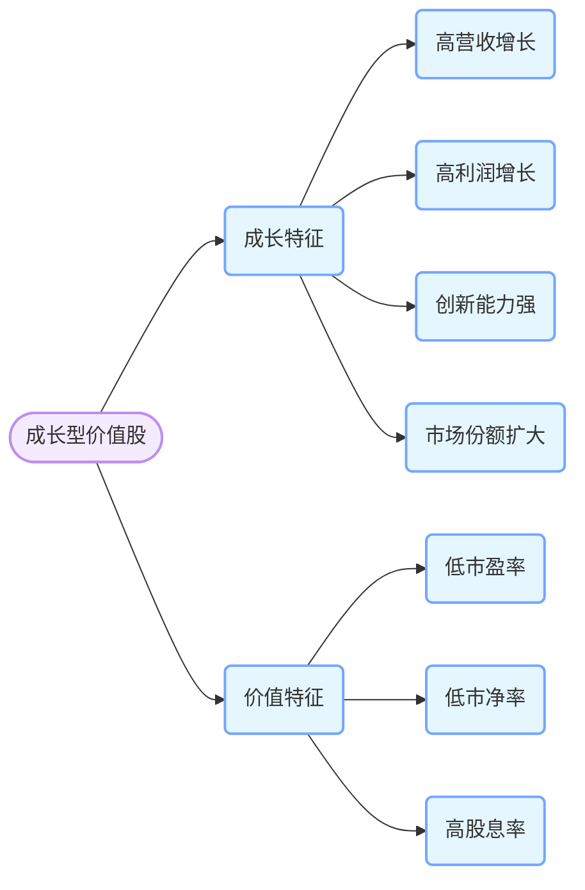

# 彼得林奇的“成长型价值股”在不同行业的表现

> 关键词：彼得林奇、成长型价值股、行业表现、投资分析、股票估值

> 摘要：本文聚焦于彼得林奇所倡导的“成长型价值股”理念，深入探讨其在不同行业中的表现。通过对核心概念的阐释、算法原理的剖析、数学模型的构建以及项目实战案例的分析，揭示成长型价值股在各行业的特点和规律。同时，结合实际应用场景，推荐相关工具和资源，最后对未来发展趋势与挑战进行总结，并解答常见问题，为投资者在不同行业中寻找成长型价值股提供全面的参考和指导。

## 1. 背景介绍 
### 1.1 目的和范围
彼得林奇作为投资界的传奇人物，他的“成长型价值股”投资策略影响深远。本研究的目的在于系统分析这一策略在不同行业的实际表现，帮助投资者更好地理解成长型价值股在各行业的特征、潜力和风险。研究范围涵盖了多个主要行业，如科技、金融、消费、医疗等，通过对这些行业中成长型价值股的表现进行对比和分析，挖掘出具有投资价值的股票。

### 1.2 预期读者
本文预期读者包括专业投资者、股票分析师、金融从业者以及对股票投资感兴趣的个人。对于专业投资者和分析师来说，本文提供的深入分析和行业对比有助于优化投资组合；金融从业者可以从中获取行业动态和投资策略的参考；而对于普通投资者，本文则可以作为入门指南，帮助他们了解成长型价值股的投资方法和在不同行业的表现差异。

### 1.3 文档结构概述
本文将按照以下结构展开：首先介绍核心概念，明确成长型价值股的定义和相关联系；接着阐述核心算法原理和具体操作步骤，通过 Python 代码进行详细说明；然后构建数学模型并进行公式讲解和举例；再通过项目实战案例展示成长型价值股在实际投资中的应用；之后分析其在不同行业的实际应用场景；推荐相关的工具和资源；最后总结未来发展趋势与挑战，解答常见问题并提供扩展阅读和参考资料。

### 1.4 术语表
#### 1.4.1 核心术语定义
- **成长型价值股**：指那些既具有成长股的特征，即公司业绩增长迅速，未来发展潜力大，又具备价值股的特点，如股价相对被低估，具有一定的安全边际的股票。
- **市盈率（PE）**：股票价格除以每股收益的比率，反映了市场对公司盈利的预期和估值水平。
- **市净率（PB）**：股票价格与每股净资产的比率，用于衡量公司的资产价值和市场估值之间的关系。
- **股息率**：股息与股票价格的比率，反映了公司向股东分配利润的能力。

#### 1.4.2 相关概念解释
- **成长股**：通常是指那些处于快速发展阶段，销售额和利润增长速度高于行业平均水平的公司的股票。这些公司往往具有创新的产品或服务、广阔的市场前景和强大的竞争力。
- **价值股**：是指那些股价相对较低，市盈率、市净率等估值指标较低的股票。价值股通常具有稳定的现金流和较高的股息率，被认为具有一定的投资价值。

#### 1.4.3 缩略词列表
- **PE**：Price-to-Earnings Ratio，市盈率
- **PB**：Price-to-Book Ratio，市净率

## 2. 核心概念与联系 

### 成长型价值股的定义与特征
成长型价值股是一种融合了成长股和价值股特点的投资理念。成长股强调公司的高增长潜力，通常表现为销售收入、净利润等指标的快速增长。而价值股则注重股票的内在价值，即股价相对于公司的资产、盈利等基本面因素被低估。成长型价值股要求公司不仅具有良好的成长前景，同时其股价也具有一定的安全边际，不会因为市场的过度炒作而出现过高的估值。

### 核心概念原理和架构的文本示意图
```plaintext
成长型价值股
|-- 成长特征
|   |-- 高营收增长
|   |-- 高利润增长
|   |-- 创新能力强
|   |-- 市场份额扩大
|-- 价值特征
|   |-- 低市盈率
|   |-- 低市净率
|   |-- 高股息率
```

### Mermaid 流程图


## 3. 核心算法原理 & 具体操作步骤 

### 筛选成长型价值股的算法原理
筛选成长型价值股的核心思想是综合考虑公司的成长指标和价值指标。成长指标主要包括营收增长率、净利润增长率等，用于衡量公司的发展速度和潜力；价值指标如市盈率、市净率、股息率等，用于评估股票的估值水平。通过对这些指标进行量化分析，筛选出同时具备成长和价值特征的股票。

### Python 代码实现
```python
import pandas as pd
import yfinance as yf

# 定义筛选函数
def screen_growth_value_stocks(tickers, period='1y'):
    growth_value_stocks = []
    for ticker in tickers:
        try:
            # 获取股票数据
            stock = yf.Ticker(ticker)
            financials = stock.financials
            balance_sheet = stock.balance_sheet
            dividends = stock.dividends

            # 计算成长指标
            revenue_growth = (financials.loc['Total Revenue'][-1] - financials.loc['Total Revenue'][-2]) / financials.loc['Total Revenue'][-2]
            net_income_growth = (financials.loc['Net Income'][-1] - financials.loc['Net Income'][-2]) / financials.loc['Net Income'][-2]

            # 计算价值指标
            info = stock.info
            pe_ratio = info.get('trailingPE', None)
            pb_ratio = info.get('priceToBook', None)
            dividend_yield = info.get('dividendYield', None)

            # 筛选条件
            if revenue_growth > 0.2 and net_income_growth > 0.2 and (pe_ratio is not None and pe_ratio < 20) and (pb_ratio is not None and pb_ratio < 2) and (dividend_yield is not None and dividend_yield > 0.02):
                growth_value_stocks.append(ticker)
        except Exception as e:
            print(f"Error processing {ticker}: {e}")
    return growth_value_stocks

# 示例股票列表
tickers = ['AAPL', 'MSFT', 'GOOG', 'AMZN', 'FB']
result = screen_growth_value_stocks(tickers)
print("成长型价值股列表:", result)
```

### 代码解释
1. **数据获取**：使用 `yfinance` 库获取股票的财务数据、资产负债表和股息信息。
2. **成长指标计算**：通过比较不同年份的营收和净利润，计算营收增长率和净利润增长率。
3. **价值指标计算**：从股票信息中获取市盈率、市净率和股息率。
4. **筛选条件**：设定营收增长率和净利润增长率大于 20%，市盈率小于 20，市净率小于 2，股息率大于 2% 的筛选条件。
5. **结果输出**：将符合条件的股票添加到列表中并返回。

## 4. 数学模型和公式 & 详细讲解 & 举例说明 

### 成长指标公式
- **营收增长率（Revenue Growth Rate）**：
$$
\text{Revenue Growth Rate} = \frac{\text{Current Revenue} - \text{Previous Revenue}}{\text{Previous Revenue}}
$$
例如，某公司上一年度的营收为 100 亿元，本年度的营收为 120 亿元，则营收增长率为：
$$
\frac{120 - 100}{100} = 0.2 = 20\%
$$

- **净利润增长率（Net Income Growth Rate）**：
$$
\text{Net Income Growth Rate} = \frac{\text{Current Net Income} - \text{Previous Net Income}}{\text{Previous Net Income}}
$$
假设某公司上一年度的净利润为 10 亿元，本年度的净利润为 13 亿元，则净利润增长率为：
$$
\frac{13 - 10}{10} = 0.3 = 30\%
$$

### 价值指标公式
- **市盈率（PE Ratio）**：
$$
\text{PE Ratio} = \frac{\text{Stock Price}}{\text{Earnings per Share}}
$$
如果某股票的价格为 50 元，每股收益为 2.5 元，则市盈率为：
$$
\frac{50}{2.5} = 20
$$

- **市净率（PB Ratio）**：
$$
\text{PB Ratio} = \frac{\text{Stock Price}}{\text{Book Value per Share}}
$$
若某股票价格为 30 元，每股净资产为 15 元，则市净率为：
$$
\frac{30}{15} = 2
$$

- **股息率（Dividend Yield）**：
$$
\text{Dividend Yield} = \frac{\text{Annual Dividend per Share}}{\text{Stock Price}}
$$
假设某股票每年每股分红 1 元，股票价格为 40 元，则股息率为：
$$
\frac{1}{40} = 0.025 = 2.5\%
$$

## 5. 项目实战：代码实际案例和详细解释说明 

### 5.1  开发环境搭建
- **Python 安装**：从 Python 官方网站（https://www.python.org/downloads/）下载并安装 Python 3.x 版本。
- **依赖库安装**：使用 `pip` 命令安装所需的库，如 `pandas` 和 `yfinance`。
```bash
pip install pandas yfinance
```

### 5.2  源代码详细实现和代码解读
```python
import pandas as pd
import yfinance as yf

# 定义筛选函数
def screen_growth_value_stocks(tickers, period='1y'):
    growth_value_stocks = []
    for ticker in tickers:
        try:
            # 获取股票数据
            stock = yf.Ticker(ticker)
            financials = stock.financials
            balance_sheet = stock.balance_sheet
            dividends = stock.dividends

            # 计算成长指标
            revenue_growth = (financials.loc['Total Revenue'][-1] - financials.loc['Total Revenue'][-2]) / financials.loc['Total Revenue'][-2]
            net_income_growth = (financials.loc['Net Income'][-1] - financials.loc['Net Income'][-2]) / financials.loc['Net Income'][-2]

            # 计算价值指标
            info = stock.info
            pe_ratio = info.get('trailingPE', None)
            pb_ratio = info.get('priceToBook', None)
            dividend_yield = info.get('dividendYield', None)

            # 筛选条件
            if revenue_growth > 0.2 and net_income_growth > 0.2 and (pe_ratio is not None and pe_ratio < 20) and (pb_ratio is not None and pb_ratio < 2) and (dividend_yield is not None and dividend_yield > 0.02):
                growth_value_stocks.append(ticker)
        except Exception as e:
            print(f"Error processing {ticker}: {e}")
    return growth_value_stocks

# 示例股票列表
tickers = ['AAPL', 'MSFT', 'GOOG', 'AMZN', 'FB']
result = screen_growth_value_stocks(tickers)
print("成长型价值股列表:", result)
```

### 代码解读与分析
1. **导入库**：导入 `pandas` 和 `yfinance` 库，用于数据处理和获取股票信息。
2. **定义筛选函数**：`screen_growth_value_stocks` 函数接受股票代码列表和时间周期作为参数，返回符合成长型价值股条件的股票列表。
3. **数据获取**：使用 `yf.Ticker` 方法获取股票的财务数据、资产负债表和股息信息。
4. **指标计算**：计算营收增长率、净利润增长率、市盈率、市净率和股息率。
5. **筛选条件判断**：根据设定的筛选条件，判断股票是否为成长型价值股，若是则添加到结果列表中。
6. **异常处理**：使用 `try-except` 语句捕获并处理可能出现的异常。
7. **主程序**：定义示例股票列表，调用筛选函数并输出结果。

## 6. 实际应用场景 
### 科技行业
在科技行业，成长型价值股通常表现为具有创新技术和高增长潜力的公司。例如，一些人工智能、云计算、半导体等领域的公司，它们的营收和净利润可能呈现快速增长的态势。同时，由于科技行业的估值波动较大，一些被市场低估的科技股可能具有较高的投资价值。通过筛选成长型价值股，可以在科技行业中找到那些既有成长潜力又被低估的股票，为投资者带来较高的回报。

### 金融行业
金融行业的成长型价值股往往与宏观经济环境密切相关。银行、保险等金融机构在经济增长期间可能实现营收和利润的增长。同时，一些具有良好风险管理能力和创新业务模式的金融公司，其股票可能被低估。投资者可以通过分析金融行业的成长型价值股，把握经济周期的变化，优化投资组合。

### 消费行业
消费行业是一个相对稳定的行业，成长型价值股通常表现为具有品牌优势和市场份额不断扩大的公司。例如，一些食品饮料、家电、零售等领域的龙头企业，它们的营收和利润增长较为稳定，同时具有较高的股息率。投资者可以通过投资消费行业的成长型价值股，获得稳定的收益和资产增值。

### 医疗行业
医疗行业的成长型价值股主要集中在生物制药、医疗器械等领域。随着人们健康意识的提高和医疗技术的不断进步，这些领域的公司具有较大的发展潜力。一些研发能力强、产品线丰富的医疗公司，其股票可能被市场低估。投资者可以通过关注医疗行业的成长型价值股，分享行业发展的红利。

## 7. 工具和资源推荐
### 7.1 学习资源推荐
#### 7.1.1 书籍推荐
- 《彼得·林奇的成功投资》：彼得·林奇亲自撰写的投资经典著作，详细介绍了他的投资理念和方法。
- 《聪明的投资者》：本杰明·格雷厄姆的代表作，阐述了价值投资的基本原则和策略。
- 《怎样选择成长股》：菲利普·费雪的经典之作，对成长股的选择和投资进行了深入探讨。

#### 7.1.2 在线课程
- Coursera 上的“投资学原理”：由知名教授授课，系统介绍投资学的基本理论和方法。
- Udemy 上的“股票投资实战课程”：通过实际案例分析，帮助学员掌握股票投资的技巧。

#### 7.1.3 技术博客和网站
- Seeking Alpha：提供专业的股票分析和投资建议。
- Motley Fool：一个知名的投资网站，分享投资经验和市场观点。

### 7.2 开发工具框架推荐
#### 7.2.1 IDE和编辑器
- PyCharm：一款功能强大的 Python 集成开发环境，适合开发和调试股票分析程序。
- Jupyter Notebook：一种交互式的开发环境，方便进行数据分析和可视化。

#### 7.2.2 调试和性能分析工具
- PDB：Python 自带的调试工具，用于调试代码中的错误。
- cProfile：Python 的性能分析工具，帮助优化代码性能。

#### 7.2.3 相关框架和库
- Pandas：用于数据处理和分析的 Python 库，提供了丰富的数据结构和操作方法。
- NumPy：用于科学计算的 Python 库，提供了高效的数组操作和数学函数。
- Matplotlib：用于数据可视化的 Python 库，可绘制各种类型的图表。

### 7.3 相关论文著作推荐
#### 7.3.1 经典论文
- Fama, Eugene F., and Kenneth R. French. "The Cross-Section of Expected Stock Returns." The Journal of Finance 47, no. 2 (1992): 427-465. 该论文提出了著名的 Fama-French 三因子模型，对股票收益的影响因素进行了深入分析。
- Sharpe, William F. "Capital Asset Prices: A Theory of Market Equilibrium Under Conditions of Risk." The Journal of Finance 19, no. 3 (1964): 425-442. 该论文提出了资本资产定价模型（CAPM），为资产定价和风险管理提供了重要的理论基础。

#### 7.3.2 最新研究成果
- 通过 Google Scholar 等学术搜索引擎，可以搜索到关于成长型价值股的最新研究成果。关注顶尖学术期刊如《Journal of Financial Economics》《Review of Financial Studies》等，获取前沿的研究动态。

#### 7.3.3 应用案例分析
- 一些金融研究机构和咨询公司会发布关于成长型价值股的应用案例分析报告。例如，麦肯锡、波士顿咨询集团等的相关报告，可以帮助投资者了解实际应用中的投资策略和效果。

## 8. 总结：未来发展趋势与挑战
### 未来发展趋势
- **科技驱动**：随着科技的不断进步，科技行业的成长型价值股将继续受到关注。人工智能、大数据、区块链等新兴技术的发展，将为科技公司带来更多的增长机会。
- **可持续投资**：投资者越来越关注企业的社会责任和可持续发展。具有良好环境、社会和治理（ESG）表现的成长型价值股可能会受到更多青睐。
- **全球化投资**：随着全球经济的一体化，投资者将有更多机会投资于不同国家和地区的成长型价值股。跨境投资和多元化投资将成为未来的发展趋势。

### 挑战
- **市场波动**：股票市场的波动是投资成长型价值股面临的主要挑战之一。市场情绪、宏观经济环境等因素可能导致股票价格的大幅波动，增加投资风险。
- **行业竞争**：各行业的竞争日益激烈，成长型价值股所在的公司需要不断创新和提升竞争力，以保持业绩的增长。否则，可能会面临市场份额下降和业绩下滑的风险。
- **信息不对称**：投资者在获取和分析股票信息时，可能会面临信息不对称的问题。一些公司可能会隐瞒不利信息，或者提供虚假信息，这给投资者的决策带来了困难。

## 9. 附录：常见问题与解答
### 什么是成长型价值股？
成长型价值股是指那些既具有成长股的特征，如公司业绩增长迅速、未来发展潜力大，又具备价值股的特点，如股价相对被低估、具有一定安全边际的股票。

### 如何筛选成长型价值股？
可以通过综合考虑公司的成长指标（如营收增长率、净利润增长率）和价值指标（如市盈率、市净率、股息率）来筛选成长型价值股。设定一定的筛选条件，如营收增长率和净利润增长率大于 20%，市盈率小于 20，市净率小于 2，股息率大于 2% 等，选择符合条件的股票。

### 成长型价值股在不同行业的表现有何差异？
不同行业的成长型价值股表现存在差异。科技行业的成长型价值股通常具有较高的增长潜力，但估值波动较大；金融行业的成长型价值股与宏观经济环境密切相关；消费行业的成长型价值股较为稳定，具有较高的股息率；医疗行业的成长型价值股主要集中在生物制药、医疗器械等领域，具有较大的发展潜力。

### 投资成长型价值股有哪些风险？
投资成长型价值股面临市场波动、行业竞争、信息不对称等风险。市场波动可能导致股票价格大幅下跌，行业竞争可能使公司业绩下滑，信息不对称可能使投资者做出错误的决策。

## 10. 扩展阅读 & 参考资料
- Lynch, Peter, and John Rothchild. One Up on Wall Street: How to Use What You Already Know to Make Money in the Market. Simon & Schuster, 1989.
- Graham, Benjamin. The Intelligent Investor: The Definitive Book on Value Investing. HarperBusiness, 2003.
- Fisher, Philip A. Common Stocks and Uncommon Profits and Other Writings. Wiley Investment Classics, 2003.
- 相关金融学术期刊和研究报告

作者：AI天才研究院/AI Genius Institute & 禅与计算机程序设计艺术 /Zen And The Art of Computer Programming