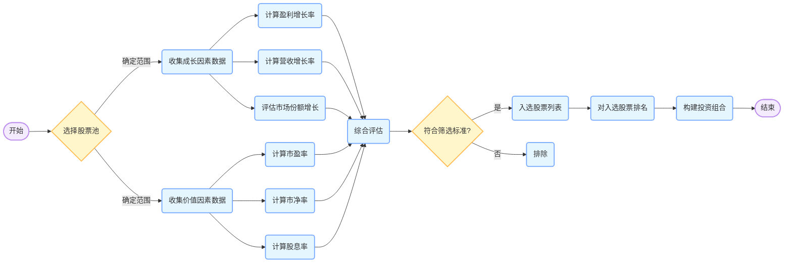

# 彼得林奇的"成长型价值股"筛选方法

> 关键词：彼得林奇、成长型价值股、筛选方法、财务分析、股票投资

> 摘要：本文围绕彼得林奇的“成长型价值股”筛选方法展开深入探讨。详细介绍了该方法的背景，包括其目的、预期读者、文档结构和相关术语。阐述了核心概念及联系，通过文本示意图和Mermaid流程图清晰展示。对核心算法原理进行分析，并用Python代码阐述具体操作步骤。给出数学模型和公式并举例说明。结合项目实战，介绍开发环境搭建、源代码实现与解读。探讨了该筛选方法的实际应用场景，推荐了学习资源、开发工具框架和相关论文著作。最后总结未来发展趋势与挑战，解答常见问题并提供扩展阅读与参考资料，旨在为投资者提供全面且实用的投资指导。

## 1. 背景介绍 
### 1.1 目的和范围
彼得林奇是投资界的传奇人物，他管理的麦哲伦基金创造了惊人的业绩。其“成长型价值股”筛选方法旨在帮助投资者从众多股票中挑选出具有成长潜力且价值被低估的股票。本文的目的就是深入剖析这一筛选方法，让投资者了解其原理、步骤和应用，范围涵盖该方法的理论基础、实践操作以及在不同市场环境下的应用情况。

### 1.2 预期读者
本文的预期读者主要包括股票投资者，无论是新手投资者希望学习基本的选股方法，还是有一定经验的投资者想要优化自己的选股策略，都能从本文中获得有价值的信息。此外，金融专业的学生、研究人员以及对投资领域感兴趣的人士也适合阅读。

### 1.3 文档结构概述
本文将按照以下结构进行阐述：首先介绍核心概念与联系，让读者对“成长型价值股”有清晰的认识；接着讲解核心算法原理和具体操作步骤，并用Python代码进行详细说明；然后给出相关的数学模型和公式，并举例分析；通过项目实战展示该筛选方法的实际应用；探讨其在不同场景下的应用；推荐相关的学习资源、开发工具框架和论文著作；最后总结未来发展趋势与挑战，解答常见问题并提供扩展阅读与参考资料。

### 1.4 术语表
#### 1.4.1 核心术语定义
- **成长型价值股**：指那些具有较高的盈利增长潜力，同时股票价格相对其内在价值被低估的股票。这类股票通常来自于处于成长阶段的公司，它们的业务不断扩张，市场份额逐渐增加。
- **市盈率（PE）**：是指股票价格除以每股收益（EPS）的比率，反映了市场对公司盈利的预期和估值水平。
- **市净率（PB）**：是指股票价格除以每股净资产的比率，用于衡量股票价格相对于每股净资产的倍数，反映了公司的净资产价值。
- **盈利增长率**：指公司在一定时期内盈利的增长幅度，通常用百分比表示。

#### 1.4.2 相关概念解释
- **价值投资**：强调寻找被市场低估的股票，通过分析公司的基本面，如财务状况、盈利能力等，以合理的价格买入并长期持有。
- **成长投资**：关注公司的未来成长潜力，更注重公司的业务增长速度和市场前景，愿意为具有高成长潜力的公司支付较高的价格。
- **彼得林奇的投资理念**：结合了价值投资和成长投资的特点，既注重寻找具有成长潜力的公司，又关注股票的价格是否合理，追求在合理价格下买入成长型股票。

#### 1.4.3 缩略词列表
- **PE**：Price-to-Earnings Ratio，市盈率
- **PB**：Price-to-Book Ratio，市净率
- **EPS**：Earnings Per Share，每股收益

## 2. 核心概念与联系 
### 核心概念原理
彼得林奇的“成长型价值股”筛选方法基于以下核心原理：成长型公司通常具有较高的盈利增长率，这意味着公司的业务在不断扩张，未来有更大的发展空间。而价值因素则强调股票价格相对其内在价值的合理性，即股票不应被过度高估。通过综合考虑成长和价值两个方面，可以筛选出那些既具有成长潜力又被低估的股票，从而获得更好的投资回报。

### 架构的文本示意图
```plaintext
成长型价值股筛选方法
|-- 成长因素
|   |-- 盈利增长率
|   |-- 营收增长率
|   |-- 市场份额增长
|-- 价值因素
|   |-- 市盈率
|   |-- 市净率
|   |-- 股息率
|-- 综合评估
|   |-- 筛选标准设定
|   |-- 股票排名
|   |-- 投资组合构建
```

### Mermaid 流程图


## 3. 核心算法原理 & 具体操作步骤 
### 核心算法原理
彼得林奇的“成长型价值股”筛选方法的核心算法是通过综合评估成长因素和价值因素来筛选股票。具体来说，先分别计算成长因素（如盈利增长率、营收增长率等）和价值因素（如市盈率、市净率等）的指标值，然后根据设定的筛选标准对股票进行初步筛选，最后对入选的股票进行排名，构建投资组合。

### 具体操作步骤及Python源代码
以下是使用Python实现该筛选方法的详细步骤和代码：

```python
import pandas as pd
import numpy as np

# 步骤1：收集股票数据
# 假设我们已经从数据库或API获取了股票的财务数据，存储在DataFrame中
# 数据包含：股票代码、每股收益（EPS）、营业收入、净资产、股息、股价等信息
data = pd.DataFrame({
    'stock_code': ['000001', '000002', '000003'],
    'eps_this_year': [2.0, 1.5, 1.2],
    'eps_last_year': [1.8, 1.2, 1.0],
    'revenue_this_year': [1000, 800, 600],
    'revenue_last_year': [900, 700, 500],
    'book_value_per_share': [10, 8, 6],
    'dividend': [0.5, 0.3, 0.2],
    'stock_price': [20, 15, 12]
})

# 步骤2：计算成长因素指标
# 计算盈利增长率
data['earnings_growth_rate'] = (data['eps_this_year'] - data['eps_last_year']) / data['eps_last_year']
# 计算营收增长率
data['revenue_growth_rate'] = (data['revenue_this_year'] - data['revenue_last_year']) / data['revenue_last_year']

# 步骤3：计算价值因素指标
# 计算市盈率
data['pe_ratio'] = data['stock_price'] / data['eps_this_year']
# 计算市净率
data['pb_ratio'] = data['stock_price'] / data['book_value_per_share']
# 计算股息率
data['dividend_yield'] = data['dividend'] / data['stock_price']

# 步骤4：设定筛选标准
# 假设筛选标准为：盈利增长率 > 10%，营收增长率 > 10%，市盈率 < 20，市净率 < 2
growth_condition = (data['earnings_growth_rate'] > 0.1) & (data['revenue_growth_rate'] > 0.1)
value_condition = (data['pe_ratio'] < 20) & (data['pb_ratio'] < 2)
final_condition = growth_condition & value_condition

# 步骤5：筛选符合条件的股票
selected_stocks = data[final_condition]

# 步骤6：对入选股票进行排名
# 这里简单地按照盈利增长率和股息率的加权和进行排名
selected_stocks['score'] = 0.6 * selected_stocks['earnings_growth_rate'] + 0.4 * selected_stocks['dividend_yield']
selected_stocks = selected_stocks.sort_values(by='score', ascending=False)

print(selected_stocks)
```

### 代码解释
1. **数据收集**：使用`pandas`的`DataFrame`存储股票的财务数据，包括每股收益、营业收入、净资产、股息和股价等。
2. **成长因素计算**：通过计算盈利增长率和营收增长率来评估公司的成长潜力。
3. **价值因素计算**：计算市盈率、市净率和股息率来评估股票的价值。
4. **筛选标准设定**：根据设定的条件筛选出符合成长和价值要求的股票。
5. **股票排名**：使用加权和的方法对入选股票进行排名，以确定投资优先级。

## 4. 数学模型和公式 & 详细讲解 & 举例说明 
### 成长因素相关公式
#### 盈利增长率
盈利增长率（$g_{earnings}$）的计算公式为：
$$g_{earnings} = \frac{EPS_{this\ year} - EPS_{last\ year}}{EPS_{last\ year}}$$
其中，$EPS_{this\ year}$ 是本年度的每股收益，$EPS_{last\ year}$ 是上一年度的每股收益。

举例说明：假设某公司上一年度的每股收益为 $1.5$ 元，本年度的每股收益为 $1.8$ 元，则盈利增长率为：
$$g_{earnings} = \frac{1.8 - 1.5}{1.5} = 0.2 = 20\%$$

#### 营收增长率
营收增长率（$g_{revenue}$）的计算公式为：
$$g_{revenue} = \frac{R_{this\ year} - R_{last\ year}}{R_{last\ year}}$$
其中，$R_{this\ year}$ 是本年度的营业收入，$R_{last\ year}$ 是上一年度的营业收入。

举例说明：假设某公司上一年度的营业收入为 $800$ 万元，本年度的营业收入为 $900$ 万元，则营收增长率为：
$$g_{revenue} = \frac{900 - 800}{800} = 0.125 = 12.5\%$$

### 价值因素相关公式
#### 市盈率
市盈率（$PE$）的计算公式为：
$$PE = \frac{P}{EPS}$$
其中，$P$ 是股票价格，$EPS$ 是每股收益。

举例说明：假设某股票的价格为 $20$ 元，每股收益为 $2$ 元，则市盈率为：
$$PE = \frac{20}{2} = 10$$

#### 市净率
市净率（$PB$）的计算公式为：
$$PB = \frac{P}{BVPS}$$
其中，$P$ 是股票价格，$BVPS$ 是每股净资产。

举例说明：假设某股票的价格为 $15$ 元，每股净资产为 $8$ 元，则市净率为：
$$PB = \frac{15}{8} = 1.875$$

#### 股息率
股息率（$DY$）的计算公式为：
$$DY = \frac{D}{P}$$
其中，$D$ 是每股股息，$P$ 是股票价格。

举例说明：假设某股票的每股股息为 $0.5$ 元，股票价格为 $20$ 元，则股息率为：
$$DY = \frac{0.5}{20} = 0.025 = 2.5\%$$

### 综合评估公式
在对入选股票进行排名时，我们使用了加权和的方法计算得分（$score$）：
$$score = w_{1} \times g_{earnings} + w_{2} \times DY$$
其中，$w_{1}$ 和 $w_{2}$ 是权重，且 $w_{1} + w_{2} = 1$。

举例说明：假设 $w_{1} = 0.6$，$w_{2} = 0.4$，某股票的盈利增长率为 $20\%$，股息率为 $2.5\%$，则该股票的得分为：
$$score = 0.6 \times 0.2 + 0.4 \times 0.025 = 0.12 + 0.01 = 0.13$$

## 5. 项目实战：代码实际案例和详细解释说明 
### 5.1  开发环境搭建
#### 安装Python
首先，需要安装Python环境。可以从Python官方网站（https://www.python.org/downloads/）下载适合自己操作系统的Python版本，并按照安装向导进行安装。

#### 安装必要的库
使用`pip`命令安装项目所需的库，主要包括`pandas`和`numpy`：
```sh
pip install pandas numpy
```

### 5.2  源代码详细实现和代码解读
```python
import pandas as pd
import numpy as np

# 模拟从数据源获取股票数据
# 这里使用一个简单的字典来构建DataFrame，实际应用中可以从数据库、API等获取数据
data = {
    'stock_code': ['000001', '000002', '000003', '000004', '000005'],
    'eps_this_year': [2.0, 1.5, 1.2, 1.8, 2.2],
    'eps_last_year': [1.8, 1.2, 1.0, 1.6, 2.0],
    'revenue_this_year': [1000, 800, 600, 900, 1100],
    'revenue_last_year': [900, 700, 500, 800, 1000],
    'book_value_per_share': [10, 8, 6, 9, 11],
    'dividend': [0.5, 0.3, 0.2, 0.4, 0.6],
    'stock_price': [20, 15, 12, 18, 22]
}
df = pd.DataFrame(data)

# 计算成长因素指标
df['earnings_growth_rate'] = (df['eps_this_year'] - df['eps_last_year']) / df['eps_last_year']
df['revenue_growth_rate'] = (df['revenue_this_year'] - df['revenue_last_year']) / df['revenue_last_year']

# 计算价值因素指标
df['pe_ratio'] = df['stock_price'] / df['eps_this_year']
df['pb_ratio'] = df['stock_price'] / df['book_value_per_share']
df['dividend_yield'] = df['dividend'] / df['stock_price']

# 设定筛选标准
growth_condition = (df['earnings_growth_rate'] > 0.1) & (df['revenue_growth_rate'] > 0.1)
value_condition = (df['pe_ratio'] < 20) & (df['pb_ratio'] < 2)
final_condition = growth_condition & value_condition

# 筛选符合条件的股票
selected_stocks = df[final_condition]

# 对入选股票进行排名
selected_stocks['score'] = 0.6 * selected_stocks['earnings_growth_rate'] + 0.4 * selected_stocks['dividend_yield']
selected_stocks = selected_stocks.sort_values(by='score', ascending=False)

print(selected_stocks)
```

### 代码解读与分析
1. **数据获取与处理**：使用`pandas`的`DataFrame`存储股票的财务数据，方便后续的计算和处理。
2. **成长因素计算**：通过计算盈利增长率和营收增长率，评估公司的成长潜力。
3. **价值因素计算**：计算市盈率、市净率和股息率，评估股票的价值。
4. **筛选标准设定**：根据设定的条件筛选出符合成长和价值要求的股票。
5. **股票排名**：使用加权和的方法对入选股票进行排名，确定投资优先级。

在实际应用中，可以根据市场情况和个人投资偏好调整筛选标准和权重，以获得更符合自己需求的投资组合。

## 6. 实际应用场景 
### 个人投资者
对于个人投资者来说，彼得林奇的“成长型价值股”筛选方法可以帮助他们在众多股票中找到具有潜力的投资标的。个人投资者可以根据自己的风险承受能力和投资目标，调整筛选标准和权重，构建适合自己的投资组合。例如，风险偏好较低的投资者可以提高股息率的权重，注重股票的分红收益；而风险偏好较高的投资者可以更关注盈利增长率和营收增长率，追求更高的资本增值。

### 基金管理公司
基金管理公司可以利用该筛选方法进行股票筛选和投资组合构建。通过系统地评估股票的成长和价值因素，基金经理可以挑选出优质的股票，提高基金的业绩表现。同时，该方法也可以作为一种量化投资策略的基础，结合其他技术指标和分析方法，实现更精准的投资决策。

### 金融研究机构
金融研究机构可以使用该筛选方法进行市场研究和分析。通过对不同行业、不同时期的股票进行筛选和比较，研究机构可以发现市场的趋势和规律，为投资者提供专业的投资建议和研究报告。

## 7. 工具和资源推荐
### 7.1 学习资源推荐
#### 7.1.1 书籍推荐
- 《彼得林奇的成功投资》：彼得林奇亲自撰写的投资经典著作，详细介绍了他的投资理念和选股方法，是学习该筛选方法的必读之书。
- 《聪明的投资者》：本杰明·格雷厄姆的经典著作，阐述了价值投资的基本原理和方法，对理解彼得林奇的投资理念有很大的帮助。
- 《财务报表分析》：帮助读者掌握财务报表的分析方法，以便更好地理解和应用该筛选方法中的财务指标。

#### 7.1.2 在线课程
- Coursera上的“投资学原理”：由知名大学教授授课，系统地介绍了投资学的基本原理和方法，包括股票投资、债券投资等内容。
- 网易云课堂上的“股票投资实战课程”：结合实际案例，讲解股票投资的技巧和策略，对学习该筛选方法有一定的参考价值。

#### 7.1.3 技术博客和网站
- 雪球网：国内知名的投资社区，提供股票行情、研究报告、投资策略等信息，投资者可以在上面交流和分享投资经验。
- 东方财富网：提供丰富的金融资讯和数据，包括股票财务数据、行业分析等，有助于投资者进行股票筛选和分析。

### 7.2 开发工具框架推荐
#### 7.2.1 IDE和编辑器
- PyCharm：一款专业的Python集成开发环境，提供代码编辑、调试、版本控制等功能，适合开发和调试Python程序。
- Jupyter Notebook：一种交互式的开发环境，支持代码、文本、图表等多种形式的展示，方便进行数据分析和实验。

#### 7.2.2 调试和性能分析工具
- `pdb`：Python自带的调试工具，可以帮助开发者定位和解决代码中的问题。
- `cProfile`：用于分析Python程序的性能，找出程序中的瓶颈和耗时操作。

#### 7.2.3 相关框架和库
- `pandas`：强大的数据处理和分析库，提供了丰富的数据结构和函数，方便进行股票数据的处理和计算。
- `numpy`：用于科学计算的基础库，提供了高效的数组操作和数学函数，在计算股票指标时非常有用。

### 7.3 相关论文著作推荐
#### 7.3.1 经典论文
- 《证券分析》（Security Analysis）：本杰明·格雷厄姆和戴维·多德的经典论文，奠定了价值投资的理论基础，对彼得林奇的投资理念产生了深远的影响。
- 《有效市场假说》（Efficient Market Hypothesis）：探讨了市场的有效性和股票价格的形成机制，对理解股票投资有重要的意义。

#### 7.3.2 最新研究成果
- 关注顶级金融学术期刊，如《金融研究评论》（Review of Financial Studies）、《金融经济学杂志》（Journal of Financial Economics）等，了解关于股票投资和成长型价值股的最新研究成果。

#### 7.3.3 应用案例分析
- 一些金融研究机构和咨询公司会发布关于成长型价值股投资的应用案例分析报告，通过实际案例了解该筛选方法的应用效果和注意事项。

## 8. 总结：未来发展趋势与挑战
### 未来发展趋势
- **量化投资的融合**：随着科技的发展，量化投资将与彼得林奇的“成长型价值股”筛选方法进一步融合。通过引入更多的技术指标和数据分析方法，提高筛选的准确性和效率。
- **人工智能的应用**：人工智能技术如机器学习、深度学习等将在股票筛选中发挥越来越重要的作用。可以利用这些技术对大量的股票数据进行分析和挖掘，发现潜在的投资机会。
- **全球化投资**：投资者将更加关注全球市场，寻找具有成长潜力的价值股。该筛选方法可以应用于不同国家和地区的股票市场，实现全球化的投资布局。

### 挑战
- **数据质量和可靠性**：筛选方法的有效性依赖于准确和可靠的股票数据。然而，数据可能存在误差、缺失或滞后等问题，影响筛选结果的准确性。
- **市场变化的不确定性**：股票市场是复杂多变的，宏观经济环境、政策法规等因素都会对股票价格产生影响。筛选方法可能无法完全适应市场的变化，导致投资决策失误。
- **竞争加剧**：随着越来越多的投资者采用类似的筛选方法，市场上符合条件的股票可能会被过度追捧，导致估值上升，投资回报下降。

## 9. 附录：常见问题与解答
### 问题1：筛选标准应该如何确定？
筛选标准的确定需要考虑市场情况、个人投资目标和风险承受能力等因素。一般来说，可以参考历史数据和市场平均水平来设定合理的标准。例如，盈利增长率可以设定在10% - 20%之间，市盈率可以设定在15 - 25之间。同时，也可以根据自己的经验和判断进行调整。

### 问题2：如何处理数据缺失的情况？
如果遇到数据缺失的情况，可以采用以下方法处理：
- 剔除缺失数据的股票：如果缺失的数据对筛选结果有重要影响，可以将该股票从股票池中剔除。
- 数据填充：可以使用均值、中位数等统计方法对缺失的数据进行填充。
- 采用其他数据源：如果可能，可以从其他数据源获取缺失的数据。

### 问题3：筛选出的股票是否一定能获得良好的投资回报？
筛选出的股票只是具有成长潜力和价值被低估的可能性，但并不能保证一定能获得良好的投资回报。股票市场存在不确定性，受到多种因素的影响。筛选方法只是一种辅助工具，投资者还需要结合自己的研究和判断，进行全面的分析和决策。

## 10. 扩展阅读 & 参考资料
### 扩展阅读
- 《怎样选择成长股》：菲利普·费雪的经典著作，介绍了选择成长股的方法和技巧，与彼得林奇的投资理念有一定的相似之处。
- 《投资中最简单的事》：邱国鹭的著作，结合中国市场的实际情况，阐述了投资的基本原则和方法，对投资者有很大的启发。

### 参考资料
- 彼得林奇的官方网站和相关访谈记录，获取第一手的投资信息和经验分享。
- 金融数据库如Wind、Bloomberg等，提供准确和全面的股票财务数据和市场信息。

作者：AI天才研究院/AI Genius Institute & 禅与计算机程序设计艺术 /Zen And The Art of Computer Programming