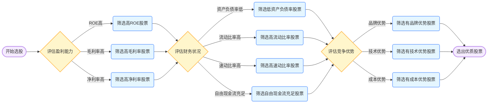

# 彼得林奇的"质量优先"选股标准

> 关键词：彼得林奇、质量优先、选股标准、股票投资、财务分析

> 摘要：本文深入探讨了彼得林奇“质量优先”的选股标准。彼得林奇作为投资界的传奇人物，其选股方法具有重要的参考价值。文章首先介绍了背景信息，包括目的范围、预期读者等。接着阐述了“质量优先”选股标准的核心概念与联系，通过文本示意图和 Mermaid 流程图进行展示。详细讲解了相关核心算法原理和具体操作步骤，并运用 Python 代码进行说明。给出了数学模型和公式，辅以举例加深理解。通过项目实战案例，从开发环境搭建到代码详细实现与解读，让读者了解如何应用这些标准。分析了实际应用场景，推荐了学习所需的工具和资源，最后总结了未来发展趋势与挑战，解答常见问题并提供扩展阅读和参考资料，旨在帮助投资者掌握“质量优先”的选股方法，提高投资决策的质量。

## 1. 背景介绍 
### 1.1 目的和范围
本文章的目的在于深入剖析彼得林奇“质量优先”的选股标准，为投资者提供一套系统、全面且具有可操作性的选股方法。通过详细解读这一标准的核心概念、算法原理、数学模型等内容，帮助投资者理解其背后的逻辑，并能够在实际投资过程中运用这些方法进行股票筛选和分析。

文章的范围涵盖了彼得林奇“质量优先”选股标准的各个方面，包括核心概念的阐述、算法原理的讲解、数学模型的推导、实际应用案例的分析以及相关工具和资源的推荐等。同时，还对未来该选股标准的发展趋势和可能面临的挑战进行了探讨，并解答了一些常见问题。

### 1.2 预期读者
本文预期读者主要包括以下几类人群：
- **个人投资者**：希望学习专业的选股方法，提高自己的投资水平，在股票市场中获得更好的收益。
- **金融从业者**：如证券分析师、基金经理等，需要不断更新和完善自己的投资知识体系，彼得林奇的选股标准是一个重要的学习参考。
- **金融专业学生**：对于正在学习金融投资相关课程的学生来说，本文可以帮助他们将理论知识与实际投资案例相结合，加深对股票投资的理解。

### 1.3 文档结构概述
本文将按照以下结构进行组织：
- 核心概念与联系：介绍“质量优先”选股标准的核心概念，通过文本示意图和 Mermaid 流程图展示各概念之间的联系。
- 核心算法原理 & 具体操作步骤：讲解选股过程中涉及的核心算法原理，并给出具体的操作步骤，同时使用 Python 代码进行详细阐述。
- 数学模型和公式 & 详细讲解 & 举例说明：推导相关的数学模型和公式，对其进行详细讲解，并通过具体例子加深读者的理解。
- 项目实战：代码实际案例和详细解释说明：通过一个实际的项目案例，展示如何运用“质量优先”选股标准进行股票筛选和分析，包括开发环境搭建、源代码详细实现和代码解读等。
- 实际应用场景：分析“质量优先”选股标准在不同市场环境下的实际应用场景。
- 工具和资源推荐：推荐学习和应用该选股标准所需的工具和资源，包括书籍、在线课程、技术博客、开发工具框架等。
- 总结：未来发展趋势与挑战：总结“质量优先”选股标准的未来发展趋势，并分析可能面临的挑战。
- 附录：常见问题与解答：解答读者在学习和应用过程中可能遇到的常见问题。
- 扩展阅读 & 参考资料：提供相关的扩展阅读材料和参考资料，方便读者进一步深入学习。

### 1.4 术语表
#### 1.4.1 核心术语定义
- **质量优先**：在选股过程中，优先考虑公司的质量因素，如盈利能力、财务状况、竞争优势等，而不是仅仅关注股价的短期波动或市场热点。
- **净资产收益率（ROE）**：衡量公司盈利能力的重要指标，计算公式为净利润与平均净资产的比率，反映了公司运用自有资本的效率。
- **市盈率（PE）**：股票价格与每股收益的比率，用于评估股票的估值水平，反映了市场对公司未来盈利的预期。
- **市净率（PB）**：股票价格与每股净资产的比率，衡量了股票的市场价格相对于其账面价值的倍数，可用于判断股票是否被低估或高估。
- **股息率**：股息与股票价格的比率，反映了公司向股东分配利润的能力和水平。

#### 1.4.2 相关概念解释
- **财务报表分析**：通过对公司的资产负债表、利润表和现金流量表等财务报表进行分析，了解公司的财务状况、经营成果和现金流量情况，为选股提供依据。
- **竞争优势分析**：评估公司在市场中的竞争地位和优势，包括品牌优势、技术优势、成本优势等，具有竞争优势的公司更有可能在长期内保持良好的业绩。
- **行业分析**：研究不同行业的发展趋势、市场规模、竞争格局等，选择具有发展潜力和前景的行业，为选股提供行业背景支持。

#### 1.4.3 缩略词列表
- ROE：净资产收益率（Return on Equity）
- PE：市盈率（Price - Earnings Ratio）
- PB：市净率（Price - Book Ratio）

## 2. 核心概念与联系 

### 核心概念原理
彼得林奇“质量优先”的选股标准主要基于对公司质量的评估，核心概念包括公司的盈利能力、财务状况、竞争优势等方面。

- **盈利能力**：公司的盈利能力是衡量其质量的重要指标之一。盈利能力强的公司能够持续为股东创造价值，通常表现为较高的净利润和稳定的盈利增长。常用的衡量指标有净资产收益率（ROE）、毛利率、净利率等。
    - 净资产收益率（ROE）反映了公司运用自有资本的效率，ROE 越高，说明公司利用股东权益创造利润的能力越强。
    - 毛利率是毛利与销售收入的比率，反映了公司产品或服务的基本盈利空间。毛利率较高的公司在成本控制和定价方面具有一定优势。
    - 净利率是净利润与销售收入的比率，扣除了所有成本和费用后，反映了公司的最终盈利能力。

- **财务状况**：良好的财务状况是公司稳定发展的基础。主要关注公司的资产负债结构、偿债能力和现金流状况。
    - 资产负债率反映了公司的负债水平，较低的资产负债率意味着公司的财务风险相对较小。
    - 流动比率和速动比率用于衡量公司的短期偿债能力，比率越高，说明公司在短期内偿还债务的能力越强。
    - 自由现金流是指公司经营活动产生的现金流量扣除资本支出后的余额，充足的自由现金流表明公司有足够的资金用于扩大生产、偿还债务或分配股息。

- **竞争优势**：具有竞争优势的公司能够在市场中脱颖而出，抵御竞争对手的挑战，保持长期的盈利能力。竞争优势可以来自多个方面，如品牌优势、技术优势、成本优势等。
    - 品牌优势使得公司的产品或服务在消费者心目中具有较高的认可度和忠诚度，能够提高产品的附加值和市场份额。
    - 技术优势使公司能够不断推出创新产品或服务，提高生产效率，降低成本，从而在市场竞争中占据领先地位。
    - 成本优势可以通过规模经济、高效的生产管理等方式实现，使公司能够以较低的价格提供产品或服务，吸引更多的客户。

### 架构的文本示意图
```plaintext
质量优先选股标准
|-- 盈利能力
|   |-- 净资产收益率（ROE）
|   |-- 毛利率
|   |-- 净利率
|-- 财务状况
|   |-- 资产负债率
|   |-- 流动比率
|   |-- 速动比率
|   |-- 自由现金流
|-- 竞争优势
|   |-- 品牌优势
|   |-- 技术优势
|   |-- 成本优势
```

### Mermaid 流程图


## 3. 核心算法原理 & 具体操作步骤 

### 核心算法原理
彼得林奇“质量优先”选股标准的核心算法原理是通过对公司的各项财务指标和竞争优势进行量化评估，筛选出具有较高质量的股票。具体来说，主要包括以下几个方面的算法：

- **盈利能力评估算法**：
    - 净资产收益率（ROE）计算公式为：$ROE = \frac{净利润}{平均净资产} \times 100\%$
    - 毛利率计算公式为：$毛利率 = \frac{销售收入 - 销售成本}{销售收入} \times 100\%$
    - 净利率计算公式为：$净利率 = \frac{净利润}{销售收入} \times 100\%$

通过计算这些指标，并与同行业其他公司进行比较，筛选出盈利能力较强的股票。

- **财务状况评估算法**：
    - 资产负债率计算公式为：$资产负债率 = \frac{负债总额}{资产总额} \times 100\%$
    - 流动比率计算公式为：$流动比率 = \frac{流动资产}{流动负债}$
    - 速动比率计算公式为：$速动比率 = \frac{流动资产 - 存货}{流动负债}$
    - 自由现金流计算公式为：$自由现金流 = 经营活动现金流量 - 资本支出$

根据这些指标的计算结果，筛选出财务状况良好的股票。

- **竞争优势评估算法**：竞争优势的评估相对较为复杂，需要综合考虑多个因素。可以通过市场份额分析、专利数量统计、成本对比等方法来评估公司的竞争优势。例如，市场份额较高的公司通常具有较强的品牌优势和市场竞争力；专利数量较多的公司可能具有技术优势。

### 具体操作步骤
以下是运用“质量优先”选股标准进行股票筛选的具体操作步骤：

1. **数据收集**：收集上市公司的财务报表数据，包括资产负债表、利润表和现金流量表等，以及相关的行业数据和市场数据。可以通过金融数据提供商（如东方财富、同花顺等）或证券交易所网站获取这些数据。
2. **指标计算**：根据上述核心算法原理，计算每家公司的各项财务指标，如 ROE、毛利率、净利率、资产负债率、流动比率、速动比率和自由现金流等。
3. **指标筛选**：设定各项指标的筛选阈值，例如，选择 ROE 大于 15%、毛利率大于 30%、资产负债率小于 50% 等条件，筛选出符合条件的股票。
4. **竞争优势评估**：对筛选出的股票进行竞争优势评估，通过分析公司的品牌知名度、技术创新能力、成本控制能力等方面，进一步筛选出具有竞争优势的股票。
5. **综合评估**：对经过筛选和评估的股票进行综合分析，考虑公司的行业前景、管理层能力、发展战略等因素，最终确定投资组合。

### Python 代码实现
以下是一个简单的 Python 代码示例，用于演示如何运用“质量优先”选股标准进行股票筛选：

```python
import pandas as pd

# 模拟财务数据
data = {
    '股票代码': ['000001', '000002', '000003', '000004'],
    '净利润': [1000, 2000, 1500, 800],
    '平均净资产': [5000, 8000, 6000, 4000],
    '销售收入': [5000, 10000, 8000, 3000],
    '销售成本': [3000, 6000, 5000, 2000],
    '负债总额': [2000, 3000, 2500, 1500],
    '资产总额': [8000, 12000, 10000, 6000],
    '流动资产': [4000, 6000, 5000, 3000],
    '流动负债': [2000, 3000, 2500, 1500],
    '存货': [1000, 1500, 1200, 800],
    '经营活动现金流量': [1200, 2200, 1800, 1000],
    '资本支出': [800, 1500, 1200, 600]
}

df = pd.DataFrame(data)

# 计算各项财务指标
df['ROE'] = df['净利润'] / df['平均净资产'] * 100
df['毛利率'] = (df['销售收入'] - df['销售成本']) / df['销售收入'] * 100
df['净利率'] = df['净利润'] / df['销售收入'] * 100
df['资产负债率'] = df['负债总额'] / df['资产总额'] * 100
df['流动比率'] = df['流动资产'] / df['流动负债']
df['速动比率'] = (df['流动资产'] - df['存货']) / df['流动负债']
df['自由现金流'] = df['经营活动现金流量'] - df['资本支出']

# 设定筛选条件
roe_threshold = 15
gross_margin_threshold = 30
debt_ratio_threshold = 50

# 筛选符合条件的股票
filtered_df = df[(df['ROE'] > roe_threshold) & (df['毛利率'] > gross_margin_threshold) & (df['资产负债率'] < debt_ratio_threshold)]

print("筛选出的优质股票：")
print(filtered_df[['股票代码', 'ROE', '毛利率', '资产负债率']])
```

## 4. 数学模型和公式 & 详细讲解 & 举例说明 

### 数学模型和公式
#### 盈利能力指标
- **净资产收益率（ROE）**：
    - 公式：$ROE = \frac{净利润}{平均净资产} \times 100\%$
    - 详细讲解：ROE 反映了公司运用自有资本的效率，是衡量公司盈利能力的重要指标之一。较高的 ROE 表明公司能够有效地利用股东投入的资金创造利润。平均净资产通常取期初净资产和期末净资产的平均值。
    - 举例说明：假设某公司年初净资产为 5000 万元，年末净资产为 6000 万元，当年净利润为 1000 万元。则平均净资产为 $\frac{5000 + 6000}{2} = 5500$ 万元，ROE 为 $\frac{1000}{5500} \times 100\% \approx 18.18\%$。

- **毛利率**：
    - 公式：$毛利率 = \frac{销售收入 - 销售成本}{销售收入} \times 100\%$
    - 详细讲解：毛利率反映了公司产品或服务的基本盈利空间，扣除了直接的生产或采购成本后，剩余的部分就是毛利。毛利率越高，说明公司在成本控制和定价方面具有一定优势。
    - 举例说明：某公司某年度销售收入为 1000 万元，销售成本为 600 万元，则毛利率为 $\frac{1000 - 600}{1000} \times 100\% = 40\%$。

- **净利率**：
    - 公式：$净利率 = \frac{净利润}{销售收入} \times 100\%$
    - 详细讲解：净利率是在毛利率的基础上，扣除了所有成本和费用后得到的最终盈利能力指标。它反映了公司每销售一元产品或服务所能获得的净利润。
    - 举例说明：若某公司销售收入为 2000 万元，净利润为 300 万元，则净利率为 $\frac{300}{2000} \times 100\% = 15\%$。

#### 财务状况指标
- **资产负债率**：
    - 公式：$资产负债率 = \frac{负债总额}{资产总额} \times 100\%$
    - 详细讲解：资产负债率反映了公司的负债水平，即公司的资产中有多少是通过负债融资获得的。较低的资产负债率意味着公司的财务风险相对较小，偿债能力较强。
    - 举例说明：某公司负债总额为 3000 万元，资产总额为 8000 万元，则资产负债率为 $\frac{3000}{8000} \times 100\% = 37.5\%$。

- **流动比率**：
    - 公式：$流动比率 = \frac{流动资产}{流动负债}$
    - 详细讲解：流动比率衡量了公司的短期偿债能力，即公司在短期内用流动资产偿还流动负债的能力。一般来说，流动比率大于 1 表示公司具有一定的短期偿债能力，但不同行业的标准可能有所不同。
    - 举例说明：某公司流动资产为 5000 万元，流动负债为 3000 万元，则流动比率为 $\frac{5000}{3000} \approx 1.67$。

- **速动比率**：
    - 公式：$速动比率 = \frac{流动资产 - 存货}{流动负债}$
    - 详细讲解：速动比率是对流动比率的进一步修正，扣除了存货这一变现能力相对较弱的资产，更能准确地反映公司的短期偿债能力。
    - 举例说明：若某公司流动资产为 6000 万元，存货为 1500 万元，流动负债为 3500 万元，则速动比率为 $\frac{6000 - 1500}{3500} \approx 1.29$。

- **自由现金流**：
    - 公式：$自由现金流 = 经营活动现金流量 - 资本支出$
    - 详细讲解：自由现金流是公司经营活动产生的现金流量扣除资本支出后的余额，它反映了公司可自由支配的现金量。充足的自由现金流表明公司有足够的资金用于扩大生产、偿还债务或分配股息。
    - 举例说明：某公司经营活动现金流量为 2000 万元，资本支出为 1200 万元，则自由现金流为 $2000 - 1200 = 800$ 万元。

## 5. 项目实战：代码实际案例和详细解释说明 
### 5.1  开发环境搭建
为了实现基于彼得林奇“质量优先”选股标准的股票筛选项目，我们需要搭建以下开发环境：

- **Python 环境**：建议使用 Python 3.7 及以上版本。可以从 Python 官方网站（https://www.python.org/downloads/）下载并安装。
- **开发工具**：推荐使用 PyCharm 作为集成开发环境（IDE），它提供了丰富的代码编辑、调试和项目管理功能。也可以使用 Jupyter Notebook 进行交互式开发和数据分析。
- **第三方库**：需要安装以下第三方库：
    - `pandas`：用于数据处理和分析。可以使用 `pip install pandas` 进行安装。
    - `numpy`：用于数值计算。可以使用 `pip install numpy` 进行安装。
    - `matplotlib`：用于数据可视化。可以使用 `pip install matplotlib` 进行安装。

### 5.2  源代码详细实现和代码解读
以下是一个完整的 Python 代码示例，用于实现基于“质量优先”选股标准的股票筛选项目：

```python
import pandas as pd
import numpy as np
import matplotlib.pyplot as plt

# 读取财务数据文件（假设数据存储在 CSV 文件中）
def read_financial_data(file_path):
    try:
        df = pd.read_csv(file_path)
        return df
    except FileNotFoundError:
        print(f"文件 {file_path} 未找到，请检查文件路径。")
        return None

# 计算各项财务指标
def calculate_financial_metrics(df):
    # 计算 ROE
    df['ROE'] = df['净利润'] / df['平均净资产'] * 100
    # 计算毛利率
    df['毛利率'] = (df['销售收入'] - df['销售成本']) / df['销售收入'] * 100
    # 计算净利率
    df['净利率'] = df['净利润'] / df['销售收入'] * 100
    # 计算资产负债率
    df['资产负债率'] = df['负债总额'] / df['资产总额'] * 100
    # 计算流动比率
    df['流动比率'] = df['流动资产'] / df['流动负债']
    # 计算速动比率
    df['速动比率'] = (df['流动资产'] - df['存货']) / df['流动负债']
    # 计算自由现金流
    df['自由现金流'] = df['经营活动现金流量'] - df['资本支出']
    return df

# 筛选符合条件的股票
def filter_stocks(df, roe_threshold, gross_margin_threshold, debt_ratio_threshold):
    filtered_df = df[(df['ROE'] > roe_threshold) & (df['毛利率'] > gross_margin_threshold) & (df['资产负债率'] < debt_ratio_threshold)]
    return filtered_df

# 可视化筛选结果
def visualize_results(filtered_df):
    plt.figure(figsize=(10, 6))
    plt.bar(filtered_df['股票代码'], filtered_df['ROE'], label='ROE')
    plt.xlabel('股票代码')
    plt.ylabel('ROE (%)')
    plt.title('筛选出的股票 ROE 情况')
    plt.legend()
    plt.show()

# 主函数
def main():
    file_path = 'financial_data.csv'  # 替换为实际的财务数据文件路径
    df = read_financial_data(file_path)
    if df is not None:
        df = calculate_financial_metrics(df)
        roe_threshold = 15
        gross_margin_threshold = 30
        debt_ratio_threshold = 50
        filtered_df = filter_stocks(df, roe_threshold, gross_margin_threshold, debt_ratio_threshold)
        print("筛选出的优质股票：")
        print(filtered_df[['股票代码', 'ROE', '毛利率', '资产负债率']])
        visualize_results(filtered_df)

if __name__ == "__main__":
    main()
```

### 代码解读与分析
- **`read_financial_data` 函数**：该函数用于读取存储财务数据的 CSV 文件，并返回一个 Pandas DataFrame 对象。如果文件不存在，会输出错误信息。
- **`calculate_financial_metrics` 函数**：根据前面介绍的财务指标计算公式，计算每家公司的 ROE、毛利率、净利率、资产负债率、流动比率、速动比率和自由现金流等指标，并将结果添加到 DataFrame 中。
- **`filter_stocks` 函数**：根据设定的筛选阈值，筛选出符合条件的股票，即 ROE 大于阈值、毛利率大于阈值且资产负债率小于阈值的股票。
- **`visualize_results` 函数**：使用 Matplotlib 库绘制筛选出的股票的 ROE 柱状图，直观展示筛选结果。
- **`main` 函数**：主函数，负责调用上述各个函数，完成数据读取、指标计算、股票筛选和结果可视化等操作。

## 6. 实际应用场景 
彼得林奇“质量优先”的选股标准在不同的市场环境和投资场景中都具有重要的应用价值。

### 长期投资
对于长期投资者来说，“质量优先”选股标准是一种非常有效的投资策略。长期投资更注重公司的基本面和长期发展潜力，而不是短期的市场波动。通过筛选出具有较高盈利能力、良好财务状况和竞争优势的公司，长期持有这些股票，有望获得稳定的收益。例如，一些具有强大品牌优势和稳定现金流的消费类公司，如贵州茅台、五粮液等，长期来看股价表现优异，为投资者带来了丰厚的回报。

### 价值投资
价值投资强调寻找被市场低估的优质股票。“质量优先”选股标准可以帮助投资者筛选出那些虽然当前股价可能不高，但具有较高内在价值的公司。通过分析公司的财务指标和竞争优势，判断公司的真实价值，当股价低于其内在价值时，进行买入操作。例如，在市场低迷时期，一些业绩稳定但股价被低估的蓝筹股，可能是价值投资者的理想选择。

### 行业配置
在进行资产配置时，投资者可以运用“质量优先”选股标准，在不同行业中筛选出优质的股票，构建多元化的投资组合。不同行业的发展阶段和特点不同，通过选择各行业中具有竞争优势的公司，可以降低投资组合的风险，提高整体收益。例如，在科技行业中选择具有技术创新能力的公司，在金融行业中选择财务状况稳健的公司等。

### 风险控制
“质量优先”选股标准有助于投资者控制投资风险。具有良好盈利能力和财务状况的公司，在市场波动时具有更强的抗风险能力。通过筛选出这样的公司进行投资，可以降低因公司业绩不佳或财务困境导致的投资损失。例如，在经济衰退时期，那些资产负债率较低、现金流充足的公司更有可能度过难关，而避免了投资者因持有高风险公司股票而遭受重大损失。

## 7. 工具和资源推荐
### 7.1 学习资源推荐
#### 7.1.1 书籍推荐
- 《彼得林奇的成功投资》：彼得林奇的经典著作，详细介绍了他的投资理念和选股方法，是学习“质量优先”选股标准的必读之书。
- 《聪明的投资者》：本杰明·格雷厄姆的代表作，被誉为投资界的圣经，书中阐述了价值投资的基本原理和方法，对理解“质量优先”选股标准具有重要的指导意义。
- 《财务报表分析与股票估值》：帮助读者掌握如何通过分析公司的财务报表来评估公司的价值，为选股提供重要的依据。

#### 7.1.2 在线课程
- Coursera 上的“投资学原理”课程：由知名大学教授授课，系统介绍了投资学的基本理论和方法，包括选股策略等内容。
- 网易云课堂上的“股票投资实战技巧”课程：结合实际案例，讲解股票投资的技巧和方法，对理解“质量优先”选股标准的实际应用有很大帮助。

#### 7.1.3 技术博客和网站
- 雪球网：国内知名的投资社区，汇聚了众多投资者和投资专家，提供了丰富的股票分析和投资策略分享。
- 东方财富网：提供全面的金融数据和资讯，包括上市公司的财务报表、行情走势等，是投资者获取信息的重要平台。

### 7.2 开发工具框架推荐
#### 7.2.1 IDE和编辑器
- PyCharm：功能强大的 Python 集成开发环境，提供了代码编辑、调试、版本控制等一系列功能，适合进行股票筛选项目的开发。
- Jupyter Notebook：交互式开发环境，支持代码、文本、图表等多种形式的展示，方便进行数据分析和可视化。

#### 7.2.2 调试和性能分析工具
- Py-Spy：用于分析 Python 程序的性能，找出程序中的瓶颈和热点，提高代码的运行效率。
- PDB：Python 自带的调试器，可以帮助开发者定位和解决代码中的问题。

#### 7.2.3 相关框架和库
- Pandas：强大的数据处理和分析库，提供了丰富的数据结构和函数，方便进行财务数据的处理和分析。
- Numpy：用于数值计算的基础库，在计算财务指标时可以提高计算效率。
- Matplotlib：常用的数据可视化库，可以绘制各种类型的图表，直观展示筛选结果。

### 7.3 相关论文著作推荐
#### 7.3.1 经典论文
- 《有效市场假说》：该论文提出了有效市场假说的理论框架，对理解股票市场的定价机制和投资策略具有重要的影响。
- 《资本资产定价模型》：阐述了资本资产定价模型（CAPM）的基本原理，为股票投资的风险和收益评估提供了理论基础。

#### 7.3.2 最新研究成果
- 《基于机器学习的股票选股策略研究》：探讨了如何运用机器学习算法改进选股策略，提高选股的准确性和效率。
- 《财务报表分析与企业价值评估的新方法》：介绍了一些新的财务报表分析方法和企业价值评估模型，为选股提供了新的思路和方法。

#### 7.3.3 应用案例分析
- 《某基金公司基于“质量优先”选股标准的投资组合案例分析》：通过实际案例分析，展示了“质量优先”选股标准在投资组合构建中的应用效果和具体操作方法。

## 8. 总结：未来发展趋势与挑战
### 未来发展趋势
- **智能化选股**：随着人工智能和机器学习技术的不断发展，未来选股过程将更加智能化。可以运用深度学习算法对大量的财务数据、市场数据和文本信息进行分析和挖掘，提高选股的准确性和效率。例如，通过自然语言处理技术分析新闻报道和社交媒体信息，了解市场情绪和公司口碑，为选股提供参考。
- **多维度数据融合**：除了传统的财务数据，未来选股将更多地融合多维度的数据，如行业数据、宏观经济数据、用户行为数据等。通过综合分析这些数据，可以更全面地了解公司的基本面和市场环境，做出更准确的投资决策。
- **个性化选股服务**：根据投资者的风险偏好、投资目标和投资经验等因素，提供个性化的选股服务。投资者可以根据自己的需求定制选股策略和筛选条件，获得符合自己要求的投资组合建议。

### 挑战
- **数据质量和可靠性**：选股过程依赖于大量的数据，数据的质量和可靠性直接影响选股结果的准确性。然而，现实中数据可能存在误差、缺失或虚假等问题，需要投资者和分析师进行严格的数据清洗和验证。
- **市场不确定性**：股票市场受到多种因素的影响，如宏观经济环境、政策变化、行业竞争等，市场不确定性较大。即使采用了“质量优先”的选股标准，也不能完全避免投资风险，需要投资者具备较强的风险意识和应对能力。
- **技术门槛**：智能化选股和多维度数据融合需要运用到复杂的技术和算法，对投资者和分析师的技术水平要求较高。如何降低技术门槛，让更多的投资者能够运用先进的选股方法，是未来需要解决的问题之一。

## 9. 附录：常见问题与解答
### 问题 1：“质量优先”选股标准是否适用于所有市场环境？
解答：“质量优先”选股标准在大多数市场环境下都具有一定的适用性，但并不是绝对的。在牛市中，市场整体上涨，优质股票可能会有较好的表现；在熊市中，优质股票相对抗跌性较强。然而，在一些极端市场情况下，如金融危机或市场泡沫破裂时，即使是优质股票也可能受到较大影响。因此，投资者在运用该选股标准时，还需要结合市场环境和其他因素进行综合分析。

### 问题 2：如何确定各项财务指标的筛选阈值？
解答：各项财务指标的筛选阈值没有固定的标准，需要根据不同行业的特点和市场情况进行调整。一般来说，可以参考同行业其他公司的平均水平和历史数据，以及市场的整体估值情况。例如，对于高成长行业，ROE 阈值可以适当提高；对于传统行业，资产负债率阈值可以相对较低。同时，投资者还可以根据自己的投资经验和风险偏好进行调整。

### 问题 3：除了财务指标，还需要考虑哪些因素进行选股？
解答：除了财务指标，还需要考虑以下因素进行选股：
- **行业前景**：选择具有发展潜力和前景的行业，如新兴科技行业、消费升级行业等。
- **竞争优势**：评估公司在市场中的竞争地位和优势，包括品牌优势、技术优势、成本优势等。
- **管理层能力**：优秀的管理层能够带领公司实现良好的发展，需要关注管理层的经验、决策能力和战略眼光。
- **公司治理结构**：完善的公司治理结构可以保障股东的权益，提高公司的运营效率和透明度。

### 问题 4：如何评估公司的竞争优势？
解答：评估公司的竞争优势可以从以下几个方面入手：
- **市场份额**：市场份额较高的公司通常具有较强的品牌优势和市场竞争力。
- **专利和技术**：拥有较多专利和先进技术的公司具有技术优势，能够不断推出创新产品或服务。
- **成本控制**：通过规模经济、高效的生产管理等方式实现成本优势，使公司能够以较低的价格提供产品或服务。
- **客户忠诚度**：客户忠诚度高的公司具有品牌优势，能够保持稳定的客户群体和市场份额。

## 10. 扩展阅读 & 参考资料
### 扩展阅读
- 《战胜华尔街》：彼得林奇的另一本经典著作，分享了他在投资实践中的经验和故事，对理解“质量优先”选股标准的实际应用具有很大的帮助。
- 《投资中最简单的事》：邱国鹭的著作，阐述了投资的基本原理和简单有效的投资方法，对投资者具有重要的启示作用。

### 参考资料
- 彼得林奇相关的官方网站和社交媒体账号，获取最新的投资观点和信息。
- 证券交易所的官方网站，获取上市公司的财务报表和相关公告。
- 金融数据提供商（如东方财富、同花顺等）的网站和数据库，获取全面的金融数据和市场信息。

作者：AI天才研究院/AI Genius Institute & 禅与计算机程序设计艺术 /Zen And The Art of Computer Programming