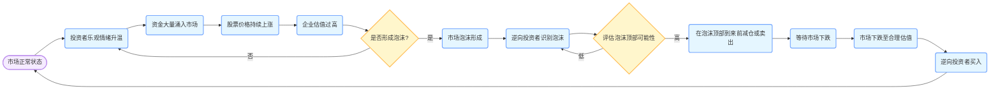

# 彼得林奇的"逆向投资"在市场泡沫顶部的识别与操作

> 关键词：彼得林奇、逆向投资、市场泡沫顶部、识别方法、操作策略

> 摘要：本文围绕彼得林奇的“逆向投资”理念，深入探讨其在市场泡沫顶部的识别与操作。首先介绍了逆向投资的背景及相关概念，详细阐述了市场泡沫顶部的核心概念与形成机制。接着分析了用于识别泡沫顶部的核心算法原理，结合数学模型进行了详细讲解。通过项目实战案例展示了如何在实际中运用相关方法进行泡沫顶部的识别与操作。探讨了逆向投资在不同市场环境下的实际应用场景，推荐了学习逆向投资的工具和资源。最后总结了逆向投资在市场泡沫顶部应用的未来发展趋势与挑战，并对常见问题进行了解答，为投资者提供全面且深入的参考。

## 1. 背景介绍 
### 1.1 目的和范围
彼得林奇作为投资界的传奇人物，其“逆向投资”理念影响深远。本文章的目的在于深入剖析这一理念在市场泡沫顶部的应用，旨在帮助投资者更好地识别市场泡沫顶部，并掌握相应的操作策略。我们将研究范围聚焦于股票市场，涵盖全球主要的股票交易市场，通过对不同市场环境下的泡沫案例分析，提炼出具有普遍适用性的方法和策略。

### 1.2 预期读者
本文预期读者主要包括股票投资者、金融分析师、投资顾问以及对金融市场投资策略感兴趣的研究人员。无论是专业的投资人士，还是初涉投资领域的新手，都能从本文中获取有价值的信息和启示。

### 1.3 文档结构概述
本文将按照以下结构展开：首先介绍相关背景知识，包括逆向投资的基本概念和市场泡沫的形成机制；接着阐述核心概念与联系，通过文本示意图和 Mermaid 流程图进行说明；然后详细讲解识别市场泡沫顶部的核心算法原理和具体操作步骤，并给出 Python 代码示例；再运用数学模型和公式对相关原理进行详细推导和举例说明；通过项目实战案例展示如何在实际中运用这些方法和策略；探讨逆向投资在市场泡沫顶部的实际应用场景；推荐学习逆向投资的工具和资源；最后总结未来发展趋势与挑战，解答常见问题，并提供扩展阅读和参考资料。

### 1.4 术语表
#### 1.4.1 核心术语定义
- **逆向投资**：与市场主流趋势相反的投资策略，即在市场过度乐观时保持谨慎，在市场过度悲观时积极买入。
- **市场泡沫顶部**：指市场价格在泡沫膨胀过程中达到的最高点，之后市场价格往往会出现大幅下跌。
- **市盈率（P/E）**：股票价格与每股盈利的比率，是衡量股票估值的重要指标之一。
- **市净率（P/B）**：股票价格与每股净资产的比率，用于评估股票的相对价值。

#### 1.4.2 相关概念解释
- **羊群效应**：在金融市场中，投资者往往会受到其他投资者的影响，盲目跟随市场趋势进行投资，导致市场价格出现过度波动。
- **非理性繁荣**：指投资者在市场乐观情绪的影响下，对资产价格的预期过高，导致资产价格脱离其内在价值的现象。

#### 1.4.3 缩略词列表
- **P/E**：Price-to-Earnings Ratio，市盈率
- **P/B**：Price-to-Book Ratio，市净率

## 2. 核心概念与联系 
### 核心概念原理
彼得林奇的逆向投资理念基于对市场情绪和股票估值的深入理解。在市场泡沫形成过程中，投资者往往会受到乐观情绪的影响，产生非理性的投资行为，导致股票价格大幅上涨，形成泡沫。而逆向投资者则会保持冷静，通过分析市场数据和企业基本面，识别出市场泡沫的存在，并在泡沫顶部到来之前采取相应的操作策略。

市场泡沫顶部的形成通常与投资者的过度乐观情绪、资金的大量涌入以及企业估值的过高有关。当市场参与者普遍认为股票价格会持续上涨时，会吸引更多的投资者进入市场，进一步推动股票价格上涨。然而，这种上涨往往是不可持续的，当市场情绪发生转变，投资者开始意识到股票价格已经脱离其内在价值时，就会引发大规模的抛售，导致市场泡沫破裂。

### 文本示意图
```plaintext
市场泡沫形成过程：
投资者乐观情绪 -> 资金大量涌入 -> 股票价格上涨 -> 企业估值过高 -> 市场泡沫形成

逆向投资操作过程：
识别市场泡沫 -> 评估泡沫顶部可能性 -> 在泡沫顶部到来前减仓或卖出 -> 等待市场下跌后买入
```

### Mermaid 流程图


## 3. 核心算法原理 & 具体操作步骤 
### 核心算法原理
识别市场泡沫顶部的核心算法主要基于对市场数据的分析和对企业基本面的评估。以下是一些常用的指标和方法：

#### 市盈率（P/E）分析
市盈率是衡量股票估值的重要指标之一。当市场整体市盈率过高时，说明股票价格相对企业盈利水平较高，可能存在泡沫。我们可以通过计算市场平均市盈率，并与历史数据进行比较，来判断市场是否处于高估状态。

#### 市净率（P/B）分析
市净率反映了股票价格与每股净资产的关系。当市净率过高时，说明股票价格相对企业净资产价值较高，也可能意味着市场存在泡沫。

#### 市场情绪指标分析
市场情绪指标可以反映投资者的乐观或悲观程度。例如，投资者信心指数、换手率等指标都可以作为市场情绪的参考。当市场情绪过于乐观，换手率大幅上升时，可能预示着市场即将达到泡沫顶部。

### 具体操作步骤
#### 数据收集
收集市场相关数据，包括股票价格、企业盈利、净资产等信息，以及市场情绪指标数据。

#### 指标计算
计算市盈率、市净率等估值指标，以及市场情绪指标。

#### 数据比较
将计算得到的指标与历史数据进行比较，判断市场是否处于高估状态。

#### 风险评估
综合考虑各种因素，评估市场泡沫顶部出现的可能性。

#### 操作决策
根据风险评估结果，做出相应的操作决策，如减仓、卖出或继续持有。

### Python 源代码示例
```python
import pandas as pd
import numpy as np

# 模拟市场数据
data = {
    'stock_price': [10, 12, 15, 18, 20, 22, 25, 28, 30, 32],
    'earnings_per_share': [1, 1.2, 1.5, 1.8, 2, 2.2, 2.5, 2.8, 3, 3.2],
    'book_value_per_share': [5, 6, 7, 8, 9, 10, 11, 12, 13, 14]
}
df = pd.DataFrame(data)

# 计算市盈率和市净率
df['P/E'] = df['stock_price'] / df['earnings_per_share']
df['P/B'] = df['stock_price'] / df['book_value_per_share']

# 设定历史平均市盈率和市净率
historical_avg_pe = 15
historical_avg_pb = 2

# 判断市场是否高估
df['is_overvalued_pe'] = df['P/E'] > historical_avg_pe
df['is_overvalued_pb'] = df['P/B'] > historical_avg_pb

# 综合判断
df['is_overvalued'] = df['is_overvalued_pe'] & df['is_overvalued_pb']

# 输出结果
print(df)
```
### 代码解释
上述代码首先模拟了市场数据，包括股票价格、每股盈利和每股净资产。然后计算了市盈率和市净率，并与历史平均水平进行比较，判断市场是否高估。最后，根据综合判断结果输出市场是否处于高估状态。

## 4. 数学模型和公式 & 详细讲解 & 举例说明 
### 市盈率（P/E）模型
市盈率的计算公式为：
$$P/E = \frac{P}{EPS}$$
其中，$P$ 表示股票价格，$EPS$ 表示每股盈利。

例如，某股票价格为 50 元，每股盈利为 5 元，则该股票的市盈率为：
$$P/E = \frac{50}{5} = 10$$

一般来说，市盈率越高，说明股票价格相对企业盈利水平越高，投资风险也越大。当市场整体市盈率超过历史平均水平时，可能意味着市场存在泡沫。

### 市净率（P/B）模型
市净率的计算公式为：
$$P/B = \frac{P}{BVPS}$$
其中，$P$ 表示股票价格，$BVPS$ 表示每股净资产。

例如，某股票价格为 30 元，每股净资产为 10 元，则该股票的市净率为：
$$P/B = \frac{30}{10} = 3$$

市净率可以反映股票价格相对于企业净资产的价值。当市净率过高时，说明股票价格可能被高估。

### 综合评估模型
为了更准确地判断市场是否存在泡沫，我们可以综合考虑市盈率和市净率等多个指标。一种简单的综合评估方法是设定一个阈值，当多个指标同时超过阈值时，认为市场存在泡沫。

假设我们设定市盈率阈值为 20，市净率阈值为 3，当某只股票的市盈率和市净率同时超过这两个阈值时，我们可以认为该股票可能被高估。

## 5. 项目实战：代码实际案例和详细解释说明 
### 5.1  开发环境搭建
#### 安装 Python
首先，需要安装 Python 环境。可以从 Python 官方网站（https://www.python.org/downloads/）下载适合自己操作系统的 Python 版本，并按照安装向导进行安装。

#### 安装必要的库
在项目中，我们需要使用 pandas、numpy 等库进行数据处理和分析。可以使用以下命令进行安装：
```sh
pip install pandas numpy
```

### 5.2  源代码详细实现和代码解读
```python
import pandas as pd
import numpy as np

# 从 CSV 文件中读取市场数据
data = pd.read_csv('market_data.csv')

# 计算市盈率和市净率
data['P/E'] = data['stock_price'] / data['earnings_per_share']
data['P/B'] = data['stock_price'] / data['book_value_per_share']

# 计算市场平均市盈率和市净率
avg_pe = data['P/E'].mean()
avg_pb = data['P/B'].mean()

# 设定历史平均市盈率和市净率
historical_avg_pe = 18
historical_avg_pb = 2.5

# 判断市场是否高估
data['is_overvalued_pe'] = data['P/E'] > historical_avg_pe
data['is_overvalued_pb'] = data['P/B'] > historical_avg_pb

# 综合判断
data['is_overvalued'] = data['is_overvalued_pe'] & data['is_overvalued_pb']

# 筛选出被高估的股票
overvalued_stocks = data[data['is_overvalued']]

# 输出结果
print("市场平均市盈率:", avg_pe)
print("市场平均市净率:", avg_pb)
print("被高估的股票:")
print(overvalued_stocks)
```
### 代码解读与分析
#### 数据读取
使用 `pandas` 库的 `read_csv` 函数从 CSV 文件中读取市场数据，包括股票价格、每股盈利和每股净资产等信息。

#### 指标计算
计算市盈率和市净率，并计算市场平均市盈率和市净率。

#### 高估判断
将计算得到的市盈率和市净率与历史平均水平进行比较，判断每只股票是否被高估。

#### 综合筛选
通过逻辑与运算，综合考虑市盈率和市净率的判断结果，筛选出被高估的股票。

#### 结果输出
输出市场平均市盈率、市净率以及被高估的股票信息。

## 6. 实际应用场景 
### 股票投资
在股票投资中，逆向投资在市场泡沫顶部的识别与操作具有重要意义。当市场处于泡沫顶部时，投资者可以通过识别泡沫信号，及时减仓或卖出股票，避免因市场下跌而造成的损失。例如，在 2007 年的A股市场泡沫中，许多投资者在市场达到顶峰时未能及时卖出股票，导致在随后的市场下跌中遭受了巨大损失。而逆向投资者通过分析市场数据和企业基本面，提前识别出市场泡沫，成功避开了市场下跌的风险。

### 基金投资
对于基金投资者来说，逆向投资同样适用。当基金所投资的市场处于泡沫顶部时，投资者可以选择赎回基金份额，等待市场调整后再重新投资。此外，基金经理也可以运用逆向投资策略，在市场泡沫顶部适当调整基金的资产配置，降低风险。

### 宏观经济分析
逆向投资理念还可以应用于宏观经济分析。政府和监管机构可以通过监测市场数据和经济指标，识别市场泡沫的存在，并采取相应的政策措施来防范金融风险。例如，在房地产市场泡沫形成过程中，政府可以通过调整货币政策、加强房地产市场监管等手段，抑制泡沫的进一步膨胀。

## 7. 工具和资源推荐
### 7.1 学习资源推荐
#### 7.1.1 书籍推荐
- 《彼得·林奇的成功投资》：彼得·林奇的经典著作，详细介绍了他的投资理念和方法。
- 《聪明的投资者》：本杰明·格雷厄姆的传世之作，被誉为投资界的“圣经”，对逆向投资理念有深入的阐述。
- 《金融炼金术》：乔治·索罗斯的著作，讲述了他的投资哲学和对市场的深刻理解，对逆向投资有一定的启发。

#### 7.1.2 在线课程
- Coursera 上的“投资学原理”课程：由知名大学教授授课，涵盖了投资领域的基本原理和方法。
- 网易云课堂上的“股票投资实战技巧”课程：结合实际案例，讲解股票投资的技巧和策略。

#### 7.1.3 技术博客和网站
- 雪球网：国内知名的投资交流社区，提供丰富的股票投资资讯和分析。
- 东方财富网：提供全面的金融市场数据和资讯，是投资者获取信息的重要渠道。

### 7.2 开发工具框架推荐
#### 7.2.1 IDE和编辑器
- PyCharm：一款专业的 Python 集成开发环境，具有强大的代码编辑、调试和分析功能。
- Jupyter Notebook：交互式的开发环境，适合进行数据探索和分析。

#### 7.2.2 调试和性能分析工具
- pdb：Python 内置的调试工具，可以帮助开发者定位代码中的问题。
- cProfile：Python 标准库中的性能分析工具，用于分析代码的运行时间和性能瓶颈。

#### 7.2.3 相关框架和库
- pandas：用于数据处理和分析的强大库，提供了丰富的数据结构和函数。
- numpy：用于科学计算的基础库，支持高效的数组运算。

### 7.3 相关论文著作推荐
#### 7.3.1 经典论文
- Eugene F. Fama 的“有效资本市场：理论与实证研究回顾”：该论文提出了有效市场假说，对金融市场的研究产生了深远影响。
- Robert J. Shiller 的“非理性繁荣”：探讨了市场泡沫的形成机制和投资者的非理性行为。

#### 7.3.2 最新研究成果
- 关注顶级金融学术期刊，如《Journal of Finance》、《Review of Financial Studies》等，获取最新的研究成果。

#### 7.3.3 应用案例分析
- 可以通过阅读一些金融机构的研究报告，了解逆向投资在实际应用中的案例和效果。

## 8. 总结：未来发展趋势与挑战
### 未来发展趋势
随着金融市场的不断发展和技术的进步，逆向投资在市场泡沫顶部的识别与操作将面临新的发展机遇。一方面，大数据、人工智能等技术的应用将为投资者提供更丰富的数据和更精准的分析工具，有助于更准确地识别市场泡沫。另一方面，全球金融市场的互联互通将使得市场波动更加复杂，逆向投资策略需要不断适应新的市场环境。

### 挑战
然而，逆向投资也面临着一些挑战。首先，市场泡沫的形成机制复杂多变，难以准确预测。投资者需要不断学习和积累经验，提高自己的分析能力和判断能力。其次，逆向投资需要投资者具备较强的心理素质，能够在市场主流趋势面前保持独立思考和冷静判断。此外，监管政策的变化也可能对逆向投资策略产生影响，投资者需要密切关注政策动态，及时调整投资策略。

## 9. 附录：常见问题与解答
### 问题 1：如何判断市场情绪指标是否可靠？
市场情绪指标只是一种参考，不能完全依赖其来判断市场走势。投资者可以结合多个市场情绪指标进行综合分析，同时参考其他基本面和技术面指标，以提高判断的准确性。

### 问题 2：逆向投资是否适用于所有市场环境？
逆向投资并不适用于所有市场环境。在市场趋势明确且持续时间较长的情况下，逆向投资可能会面临较大的风险。投资者需要根据市场的实际情况，灵活运用逆向投资策略。

### 问题 3：如何确定历史平均市盈率和市净率？
历史平均市盈率和市净率可以通过分析过去一段时间内的市场数据来确定。一般来说，可以选择一个较长的时间周期，如 5 年或 10 年，计算该时间段内的平均市盈率和市净率作为参考。

## 10. 扩展阅读 & 参考资料
- 《投资中最简单的事》，邱国鹭
- 《漫步华尔街》，伯顿·马尔基尔
- 金融时报（https://www.ft.com/）
- 彭博社（https://www.bloomberg.com/）

作者：AI天才研究院/AI Genius Institute & 禅与计算机程序设计艺术 /Zen And The Art of Computer Programming