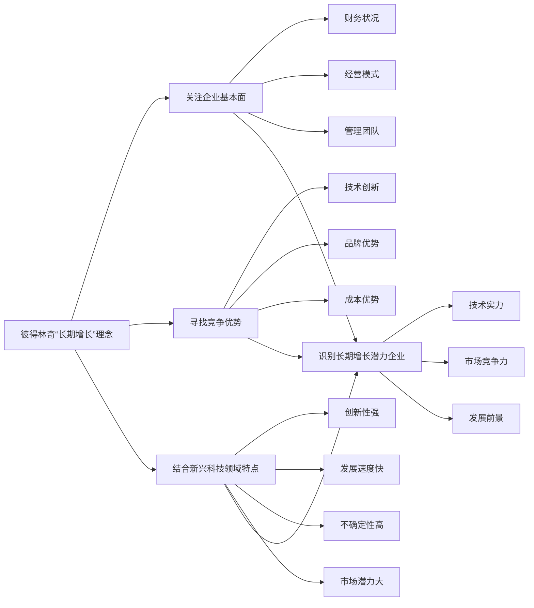

# 彼得林奇的"长期增长"潜力在新兴科技领域的识别方法

> 关键词：彼得林奇、长期增长潜力、新兴科技领域、识别方法、投资分析

> 摘要：本文旨在探讨如何运用彼得林奇的投资理念来识别新兴科技领域的长期增长潜力。通过深入分析彼得林奇的核心投资思想，结合新兴科技领域的特点，阐述了相关的核心概念、算法原理、数学模型，并给出了项目实战案例、实际应用场景等内容。同时，推荐了学习资源、开发工具和相关论文著作，最后总结了未来发展趋势与挑战，为投资者和相关从业者提供全面的参考。

## 1. 背景介绍 
### 1.1 目的和范围
彼得林奇是投资界的传奇人物，他所倡导的投资理念和方法对全球投资者产生了深远的影响。新兴科技领域以其快速发展和巨大的创新潜力吸引着众多投资者的目光，但同时也伴随着较高的风险和不确定性。本文章的目的在于研究如何将彼得林奇的“长期增长”理念应用到新兴科技领域，识别具有长期增长潜力的项目或企业，为投资者提供科学、有效的投资策略和方法。

本文的范围涵盖了新兴科技领域的多个方面，包括人工智能、大数据、区块链、生物技术等热门领域。通过对这些领域的深入分析，结合彼得林奇的投资原则，探讨适合新兴科技领域的长期增长潜力识别方法。

### 1.2 预期读者
本文的预期读者主要包括以下几类人群：
1. **投资者**：无论是个人投资者还是机构投资者，都希望在新兴科技领域寻找具有长期增长潜力的投资机会，本文将为他们提供实用的投资分析方法和思路。
2. **创业者**：新兴科技领域的创业者可以从本文中了解投资者的关注点和评估标准，有助于他们更好地规划企业发展战略，提高企业的竞争力和吸引力。
3. **研究人员**：从事金融、科技等领域研究的学者和研究人员可以通过本文深入了解彼得林奇投资理念在新兴科技领域的应用，为相关研究提供参考和借鉴。
4. **科技爱好者**：对新兴科技领域充满热情的科技爱好者可以通过本文了解如何从投资的角度评估科技项目的潜力，拓宽自己的知识面和视野。

### 1.3 文档结构概述
本文将按照以下结构进行组织：
1. **背景介绍**：介绍文章的目的、范围、预期读者和文档结构概述，让读者对文章有一个整体的了解。
2. **核心概念与联系**：阐述彼得林奇的“长期增长”理念、新兴科技领域的特点以及两者之间的联系，为后续的分析奠定基础。
3. **核心算法原理 & 具体操作步骤**：介绍识别新兴科技领域长期增长潜力的核心算法原理，并给出具体的操作步骤，通过Python代码进行详细阐述。
4. **数学模型和公式 & 详细讲解 & 举例说明**：建立数学模型和公式，对其进行详细讲解，并通过实际案例进行说明，帮助读者更好地理解和应用。
5. **项目实战：代码实际案例和详细解释说明**：通过实际项目案例，展示如何运用上述方法进行新兴科技领域长期增长潜力的识别，包括开发环境搭建、源代码实现和代码解读。
6. **实际应用场景**：介绍识别新兴科技领域长期增长潜力的方法在不同场景下的应用，如投资决策、企业战略规划等。
7. **工具和资源推荐**：推荐学习资源、开发工具和相关论文著作，帮助读者进一步深入学习和研究。
8. **总结：未来发展趋势与挑战**：总结本文的主要内容，分析新兴科技领域长期增长潜力识别方法的未来发展趋势和面临的挑战。
9. **附录：常见问题与解答**：对读者可能关心的常见问题进行解答，提供更多的技术支持和帮助。
10. **扩展阅读 & 参考资料**：提供相关的扩展阅读资料和参考书目，方便读者进一步深入研究。

### 1.4 术语表
#### 1.4.1 核心术语定义
1. **彼得林奇的“长期增长”理念**：彼得林奇认为，投资者应该关注那些具有长期增长潜力的企业，通过深入研究企业的基本面、行业前景等因素，选择具有竞争优势和持续盈利能力的企业进行投资。
2. **新兴科技领域**：指的是近年来快速发展的科技领域，如人工智能、大数据、区块链、生物技术等，这些领域具有创新性强、发展速度快、市场潜力大等特点。
3. **长期增长潜力**：指的是企业或项目在未来较长一段时间内具有持续增长的可能性和能力，表现为销售额、利润、市场份额等指标的不断增长。
4. **投资分析**：指的是对投资项目进行评估和分析的过程，包括对项目的基本面、市场前景、风险等因素进行研究，以确定投资的可行性和价值。

#### 1.4.2 相关概念解释
1. **基本面分析**：通过研究企业的财务报表、经营状况、管理团队等基本面因素，评估企业的内在价值和投资价值。
2. **行业分析**：对特定行业的市场规模、增长趋势、竞争格局等因素进行研究，了解行业的发展前景和投资机会。
3. **技术分析**：通过研究股票价格、成交量等市场数据，预测股票价格的走势和投资机会。
4. **风险评估**：对投资项目可能面临的风险进行评估和分析，包括市场风险、技术风险、管理风险等，以制定相应的风险应对策略。

#### 1.4.3 缩略词列表
1. **AI**：Artificial Intelligence，人工智能
2. **BD**：Big Data，大数据
3. **BC**：Blockchain，区块链
4. **BT**：Biotechnology，生物技术

## 2. 核心概念与联系 

### 彼得林奇的“长期增长”理念
彼得林奇在其投资生涯中，始终强调寻找具有长期增长潜力的企业。他认为，企业的长期增长是推动股价上涨的根本动力。他通过深入调研、实地考察等方式，挖掘那些被市场低估、具有独特竞争优势和良好发展前景的企业。例如，他投资了很多小型成长型企业，这些企业在当时可能并不起眼，但随着时间的推移，凭借自身的创新能力和市场拓展能力，实现了持续的增长，为投资者带来了丰厚的回报。

### 新兴科技领域的特点
新兴科技领域具有以下显著特点：
1. **创新性强**：不断涌现出新的技术和商业模式，推动行业的快速发展和变革。
2. **发展速度快**：技术迭代迅速，市场需求变化快，企业需要不断创新和适应市场变化。
3. **不确定性高**：由于技术和市场的不确定性，新兴科技企业面临着较高的风险，很多企业可能会失败。
4. **市场潜力大**：一旦某项技术或商业模式取得成功，往往能够创造巨大的市场价值。

### 两者之间的联系
将彼得林奇的“长期增长”理念应用到新兴科技领域，需要结合新兴科技领域的特点进行分析。虽然新兴科技领域具有较高的不确定性，但也蕴含着巨大的长期增长潜力。投资者可以通过深入研究新兴科技企业的技术创新能力、市场竞争力、管理团队等因素，寻找那些具有长期增长潜力的企业。例如，对于一家人工智能企业，投资者可以关注其核心技术的先进性、应用场景的广泛性、市场份额的增长趋势等，以判断其是否具有长期增长潜力。

### 文本示意图
```plaintext
彼得林奇“长期增长”理念
|
|-- 关注企业基本面
|   |-- 财务状况
|   |-- 经营模式
|   |-- 管理团队
|
|-- 寻找竞争优势
|   |-- 技术创新
|   |-- 品牌优势
|   |-- 成本优势
|
|-- 结合新兴科技领域特点
|   |-- 创新性强
|   |-- 发展速度快
|   |-- 不确定性高
|   |-- 市场潜力大
|
|-- 识别长期增长潜力企业
|   |-- 技术实力
|   |-- 市场竞争力
|   |-- 发展前景
```

### Mermaid 流程图


## 3. 核心算法原理 & 具体操作步骤 

### 核心算法原理
我们可以通过构建一个综合评估模型来识别新兴科技领域的长期增长潜力企业。该模型主要考虑以下几个方面的因素：
1. **技术创新能力**：评估企业的研发投入、专利数量、技术先进性等指标，反映企业的技术实力和创新能力。
2. **市场竞争力**：分析企业的市场份额、客户群体、品牌知名度等指标，衡量企业在市场中的竞争地位。
3. **财务状况**：考察企业的营收增长、利润水平、现金流等指标，评估企业的盈利能力和财务健康状况。
4. **管理团队**：评价管理团队的经验、能力、领导力等指标，判断管理团队是否能够带领企业实现长期发展。

综合以上因素，我们可以为每个因素赋予一定的权重，然后计算企业的综合得分。得分越高，说明企业的长期增长潜力越大。

### 具体操作步骤
以下是具体的操作步骤：
1. **数据收集**：收集新兴科技企业的相关数据，包括技术创新数据、市场竞争数据、财务数据和管理团队数据等。
2. **指标选择**：根据核心算法原理，选择合适的指标来衡量各个因素。例如，用研发投入占比来衡量技术创新能力，用市场份额来衡量市场竞争力等。
3. **权重确定**：根据各个因素的重要性，确定每个因素的权重。可以采用专家评估法、层次分析法等方法来确定权重。
4. **数据标准化**：对收集到的数据进行标准化处理，消除不同指标之间的量纲差异，以便进行综合计算。
5. **综合得分计算**：根据选定的指标和权重，计算企业的综合得分。计算公式如下：
$$Score = w_1 \times I_1 + w_2 \times I_2 + w_3 \times I_3 + w_4 \times I_4$$
其中，$Score$ 表示企业的综合得分，$w_1$、$w_2$、$w_3$、$w_4$ 分别表示技术创新能力、市场竞争力、财务状况和管理团队的权重，$I_1$、$I_2$、$I_3$、$I_4$ 分别表示对应的指标得分。
6. **排名和筛选**：根据企业的综合得分进行排名，筛选出得分较高的企业，这些企业具有较大的长期增长潜力。

### Python 代码实现
```python
import pandas as pd
import numpy as np

# 数据收集（示例数据）
data = {
    '企业名称': ['企业A', '企业B', '企业C'],
    '研发投入占比': [0.2, 0.3, 0.1],
    '市场份额': [0.15, 0.2, 0.1],
    '营收增长率': [0.25, 0.3, 0.2],
    '管理团队评分': [8, 9, 7]
}
df = pd.DataFrame(data)

# 指标选择
selected_columns = ['研发投入占比', '市场份额', '营收增长率', '管理团队评分']

# 权重确定（示例权重）
weights = [0.3, 0.25, 0.25, 0.2]

# 数据标准化
def standardize_data(data):
    return (data - data.min()) / (data.max() - data.min())

standardized_df = df[selected_columns].apply(standardize_data)

# 综合得分计算
df['综合得分'] = np.dot(standardized_df.values, weights)

# 排名和筛选
sorted_df = df.sort_values(by='综合得分', ascending=False)
top_companies = sorted_df.head()

print(top_companies)
```
在上述代码中，我们首先创建了一个示例数据集，包含了几家新兴科技企业的相关数据。然后，我们选择了合适的指标，并确定了每个指标的权重。接着，我们对数据进行了标准化处理，消除了不同指标之间的量纲差异。最后，我们计算了企业的综合得分，并根据得分进行了排名和筛选。

## 4. 数学模型和公式 & 详细讲解 & 举例说明 

### 数学模型
我们构建的综合评估模型可以用以下数学公式表示：
$$Score = \sum_{i=1}^{n} w_i \times I_i$$
其中，$Score$ 表示企业的综合得分，$n$ 表示考虑的因素数量，$w_i$ 表示第 $i$ 个因素的权重，$I_i$ 表示第 $i$ 个因素的指标得分。

### 详细讲解
1. **因素选择**：我们选择了技术创新能力、市场竞争力、财务状况和管理团队这四个因素来评估新兴科技企业的长期增长潜力。这些因素是根据彼得林奇的投资理念和新兴科技领域的特点确定的，它们能够全面地反映企业的综合实力和发展前景。
2. **权重确定**：权重的确定是模型的关键步骤之一。不同的因素对企业的长期增长潜力的影响程度不同，因此需要根据其重要性赋予不同的权重。例如，技术创新能力在新兴科技领域中起着至关重要的作用，因此可以赋予较高的权重；而管理团队的能力也直接影响着企业的发展，也需要给予一定的权重。
3. **指标得分计算**：每个因素都可以用一个或多个指标来衡量。例如，技术创新能力可以用研发投入占比、专利数量等指标来衡量；市场竞争力可以用市场份额、客户满意度等指标来衡量。在计算指标得分时，需要对原始数据进行标准化处理，以消除不同指标之间的量纲差异。

### 举例说明
假设我们要评估一家新兴人工智能企业的长期增长潜力。我们收集了以下数据：
| 因素 | 指标 | 数值 |
| ---- | ---- | ---- |
| 技术创新能力 | 研发投入占比 | 0.2 |
| 市场竞争力 | 市场份额 | 0.15 |
| 财务状况 | 营收增长率 | 0.25 |
| 管理团队 | 管理团队评分 | 8 |

我们确定的权重如下：
| 因素 | 权重 |
| ---- | ---- |
| 技术创新能力 | 0.3 |
| 市场竞争力 | 0.25 |
| 财务状况 | 0.25 |
| 管理团队 | 0.2 |

首先，我们对数据进行标准化处理：
| 因素 | 指标 | 原始数值 | 标准化数值 |
| ---- | ---- | ---- | ---- |
| 技术创新能力 | 研发投入占比 | 0.2 | （0.2 - 0.1）/（0.3 - 0.1） = 0.5 |
| 市场竞争力 | 市场份额 | 0.15 | （0.15 - 0.1）/（0.2 - 0.1） = 0.5 |
| 财务状况 | 营收增长率 | 0.25 | （0.25 - 0.2）/（0.3 - 0.2） = 0.5 |
| 管理团队 | 管理团队评分 | 8 | （8 - 7）/（9 - 7） = 0.5 |

然后，我们计算综合得分：
$$Score = 0.3 \times 0.5 + 0.25 \times 0.5 + 0.25 \times 0.5 + 0.2 \times 0.5 = 0.5$$

通过综合得分，我们可以对该企业的长期增长潜力进行评估。得分越高，说明企业的长期增长潜力越大。

## 5. 项目实战：代码实际案例和详细解释说明 

### 5.1  开发环境搭建
在进行项目实战之前，我们需要搭建相应的开发环境。以下是具体的步骤：
1. **安装 Python**：Python 是一种广泛使用的编程语言，我们可以从 Python 官方网站（https://www.python.org/downloads/）下载并安装最新版本的 Python。
2. **安装必要的库**：我们需要安装一些必要的 Python 库，如 Pandas、NumPy 等。可以使用以下命令进行安装：
```sh
pip install pandas numpy
```
3. **选择开发工具**：可以选择使用 Jupyter Notebook、PyCharm 等开发工具。Jupyter Notebook 是一种交互式的开发环境，适合进行数据分析和实验；PyCharm 是一种专业的 Python 集成开发环境，适合进行大规模的项目开发。

### 5.2  源代码详细实现和代码解读
以下是一个完整的项目实战代码示例，用于识别新兴科技领域的长期增长潜力企业：
```python
import pandas as pd
import numpy as np

# 数据收集（示例数据）
data = {
    '企业名称': ['企业A', '企业B', '企业C', '企业D', '企业E'],
    '研发投入占比': [0.2, 0.3, 0.1, 0.25, 0.15],
    '市场份额': [0.15, 0.2, 0.1, 0.18, 0.12],
    '营收增长率': [0.25, 0.3, 0.2, 0.22, 0.18],
    '管理团队评分': [8, 9, 7, 8.5, 7.5]
}
df = pd.DataFrame(data)

# 指标选择
selected_columns = ['研发投入占比', '市场份额', '营收增长率', '管理团队评分']

# 权重确定（示例权重）
weights = [0.3, 0.25, 0.25, 0.2]

# 数据标准化
def standardize_data(data):
    return (data - data.min()) / (data.max() - data.min())

standardized_df = df[selected_columns].apply(standardize_data)

# 综合得分计算
df['综合得分'] = np.dot(standardized_df.values, weights)

# 排名和筛选
sorted_df = df.sort_values(by='综合得分', ascending=False)
top_companies = sorted_df.head(3)

print(top_companies)
```
### 代码解读与分析
1. **数据收集**：我们创建了一个包含五家新兴科技企业相关数据的字典，并使用 Pandas 的 `DataFrame` 函数将其转换为数据框。
2. **指标选择**：我们选择了研发投入占比、市场份额、营收增长率和管理团队评分这四个指标来评估企业的长期增长潜力。
3. **权重确定**：我们为每个指标赋予了一定的权重，这些权重反映了各个指标在综合评估中的重要性。
4. **数据标准化**：我们定义了一个 `standardize_data` 函数，用于对数据进行标准化处理。标准化处理可以消除不同指标之间的量纲差异，使它们具有可比性。
5. **综合得分计算**：我们使用 `np.dot` 函数计算企业的综合得分，即将标准化后的指标数据与对应的权重相乘并求和。
6. **排名和筛选**：我们使用 `sort_values` 函数对企业的综合得分进行排序，并选择得分最高的三家企业作为具有长期增长潜力的企业。

通过以上步骤，我们可以快速、准确地识别出新兴科技领域中具有长期增长潜力的企业。

## 6. 实际应用场景 
### 投资决策
投资者可以运用本文介绍的方法来评估新兴科技企业的长期增长潜力，从而做出更明智的投资决策。例如，在选择投资标的时，投资者可以通过收集企业的相关数据，计算其综合得分，筛选出得分较高的企业进行投资。这样可以提高投资的成功率，降低投资风险。

### 企业战略规划
新兴科技企业可以利用该方法来评估自身的优势和劣势，制定合理的战略规划。通过分析各项指标的得分，企业可以了解自己在技术创新、市场竞争、财务状况和管理团队等方面的表现，从而有针对性地进行改进和提升。例如，如果企业在技术创新方面得分较低，可以加大研发投入，提高技术实力。

### 行业研究
研究机构和学者可以使用该方法对新兴科技领域进行深入研究，分析行业的发展趋势和竞争格局。通过对大量企业的综合评估，研究人员可以了解行业中哪些企业具有较强的长期增长潜力，哪些因素对企业的发展影响较大，从而为行业的发展提供理论支持和决策建议。

### 政府政策制定
政府部门可以运用该方法来评估新兴科技企业的发展状况，制定相关的政策和措施。例如，对于得分较高的企业，政府可以给予更多的政策支持和资金扶持，促进其快速发展；对于得分较低的企业，政府可以引导其进行技术创新和转型升级，提高企业的竞争力。

## 7. 工具和资源推荐
### 7.1 学习资源推荐
#### 7.1.1 书籍推荐
1. 《彼得林奇的成功投资》：彼得林奇的经典著作，详细介绍了他的投资理念和方法，对于学习如何识别具有长期增长潜力的企业具有重要的指导意义。
2. 《聪明的投资者》：本杰明·格雷厄姆的代表作，被誉为投资界的“圣经”，书中阐述了价值投资的基本原理和方法，对投资者的思维方式和投资决策具有深远的影响。
3. 《创新者的窘境》：克莱顿·克里斯坦森的经典之作，探讨了新兴科技企业如何应对颠覆性创新的挑战，对于理解新兴科技领域的发展规律具有重要的参考价值。

#### 7.1.2 在线课程
1. Coursera 上的“投资学原理”：该课程由知名大学的教授授课，系统地介绍了投资学的基本原理和方法，包括股票投资、债券投资、基金投资等内容。
2. edX 上的“人工智能基础”：该课程介绍了人工智能的基本概念、算法和应用，对于了解新兴科技领域的发展趋势具有重要的帮助。
3. Udemy 上的“数据分析实战”：该课程通过实际案例介绍了数据分析的方法和技巧，包括数据收集、清洗、分析和可视化等内容，对于运用数据分析来评估企业的长期增长潜力具有重要的作用。

#### 7.1.3 技术博客和网站
1. 36氪：关注新兴科技领域的创新和创业，提供最新的科技资讯、行业分析和创业项目报道。
2. 虎嗅网：聚焦于科技、商业和互联网领域的热点话题，提供深度的分析和评论。
3. 开源中国：提供开源软件的资讯、代码和社区服务，对于了解新兴科技领域的开源技术和发展动态具有重要的参考价值。

### 7.2 开发工具框架推荐
#### 7.2.1 IDE和编辑器
1. PyCharm：一款专业的 Python 集成开发环境，具有代码编辑、调试、版本控制等功能，适合进行大规模的 Python 项目开发。
2. Jupyter Notebook：一种交互式的开发环境，支持多种编程语言，适合进行数据分析、实验和演示。
3. Visual Studio Code：一款轻量级的代码编辑器，具有丰富的插件和扩展功能，支持多种编程语言，适合进行快速开发和调试。

#### 7.2.2 调试和性能分析工具
1. PySnooper：一个简单易用的 Python 调试工具，可以自动记录函数的调用过程和变量的值，方便进行调试和排查问题。
2. cProfile：Python 自带的性能分析工具，可以统计程序的运行时间和函数调用次数，帮助优化代码性能。
3. Memory Profiler：一个用于分析 Python 程序内存使用情况的工具，可以帮助发现内存泄漏和优化内存使用。

#### 7.2.3 相关框架和库
1. Pandas：一个强大的数据分析库，提供了数据结构和数据分析工具，方便进行数据处理和分析。
2. NumPy：一个用于科学计算的 Python 库，提供了高效的多维数组对象和数学函数，适合进行数值计算和数据分析。
3. Scikit-learn：一个用于机器学习的 Python 库，提供了各种机器学习算法和工具，适合进行数据挖掘和预测分析。

### 7.3 相关论文著作推荐
#### 7.3.1 经典论文
1. “The Capital Asset Pricing Model: Theory and Evidence”：该论文介绍了资本资产定价模型（CAPM）的理论和实证研究，对于理解投资组合的风险和收益具有重要的意义。
2. “Efficient Capital Markets: A Review of Theory and Empirical Work”：该论文对有效市场假说进行了系统的回顾和总结，对于理解金融市场的效率和投资者的行为具有重要的参考价值。
3. “The Innovator's Dilemma: When New Technologies Cause Great Firms to Fail”：该论文提出了颠覆性创新的概念，探讨了新兴科技企业如何应对颠覆性创新的挑战，对于理解新兴科技领域的发展规律具有重要的影响。

#### 7.3.2 最新研究成果
1. 关注顶级学术期刊，如《Journal of Finance》、《Review of Financial Studies》、《Management Science》等，这些期刊发表了许多关于投资、金融和管理等领域的最新研究成果。
2. 参加学术会议，如金融学年会、管理学年会等，这些会议汇聚了国内外的顶尖学者和研究人员，能够及时了解最新的研究动态和前沿问题。

#### 7.3.3 应用案例分析
1. 阅读商业杂志和财经媒体的报道，如《哈佛商业评论》、《财经》等，这些媒体经常报道新兴科技企业的成功案例和失败教训，对于学习如何识别和评估企业的长期增长潜力具有重要的借鉴意义。
2. 研究知名投资机构的投资报告和案例分析，如红杉资本、IDG 资本等，这些机构在新兴科技领域具有丰富的投资经验和成功案例，通过学习他们的投资策略和方法，可以提高自己的投资分析能力。

## 8. 总结：未来发展趋势与挑战
### 未来发展趋势
1. **技术创新加速**：新兴科技领域将继续保持快速发展的态势，技术创新将不断涌现。例如，人工智能、大数据、区块链等技术将不断升级和完善，为企业的发展带来更多的机遇。
2. **行业融合加深**：新兴科技领域与传统行业的融合将越来越深入，形成新的商业模式和产业形态。例如，人工智能与医疗、教育、金融等行业的融合，将为这些行业带来巨大的变革和发展。
3. **国际化竞争加剧**：随着全球化的发展，新兴科技企业将面临更加激烈的国际化竞争。企业需要不断提高自身的技术实力和市场竞争力，才能在国际市场上立足。
4. **政策支持力度加大**：政府将加大对新兴科技领域的政策支持力度，出台更多的优惠政策和扶持措施，促进新兴科技企业的发展。

### 挑战
1. **技术不确定性**：新兴科技领域的技术发展具有较高的不确定性，新技术可能会被更先进的技术所取代。企业需要不断投入研发，保持技术的领先地位。
2. **市场竞争激烈**：新兴科技领域吸引了大量的企业进入，市场竞争异常激烈。企业需要不断创新和提升服务质量，才能在市场中脱颖而出。
3. **人才短缺**：新兴科技领域的发展需要大量的高素质人才，如人工智能工程师、大数据分析师等。目前，这些人才的供应相对不足，企业需要加强人才培养和引进。
4. **法律法规不完善**：新兴科技领域的发展带来了一些新的法律和道德问题，如数据隐私、算法偏见等。目前，相关的法律法规还不够完善，需要进一步加强立法和监管。

## 9. 附录：常见问题与解答
### 问题1：如何确定各个因素的权重？
答：确定各个因素的权重可以采用多种方法，如专家评估法、层次分析法等。专家评估法是邀请相关领域的专家对各个因素的重要性进行评估，然后根据专家的意见确定权重。层次分析法是一种系统的决策分析方法，通过建立层次结构模型，比较各个因素之间的相对重要性，从而确定权重。

### 问题2：数据标准化的作用是什么？
答：数据标准化的作用是消除不同指标之间的量纲差异，使它们具有可比性。在综合评估模型中，不同的指标可能具有不同的单位和量级，如果不进行标准化处理，可能会导致某些指标的影响过大，而其他指标的影响过小。通过标准化处理，可以使各个指标在综合评估中具有相同的重要性。

### 问题3：该方法是否适用于所有新兴科技领域的企业？
答：该方法适用于大多数新兴科技领域的企业，但并不是适用于所有企业。不同的新兴科技领域具有不同的特点和发展规律，在应用该方法时，需要根据具体情况进行调整和优化。例如，对于一些处于早期发展阶段的企业，可能缺乏足够的财务数据，此时需要更加关注其技术创新能力和市场前景。

### 问题4：如何获取新兴科技企业的相关数据？
答：可以通过多种途径获取新兴科技企业的相关数据，如企业的官方网站、证券交易所的公告、财经媒体的报道、行业研究机构的报告等。此外，还可以通过市场调研、实地考察等方式获取一手数据。

## 10. 扩展阅读 & 参考资料
### 扩展阅读
1. 《从0到1：开启商业与未来的秘密》：彼得·蒂尔的著作，探讨了创业公司如何从无到有，创造出独特的价值。
2. 《指数型组织》：萨利姆·伊斯梅尔的作品，介绍了指数型组织的特点和发展规律，对于理解新兴科技企业的发展具有重要的启示。
3. 《人类简史：从动物到上帝》：尤瓦尔·赫拉利的畅销书，从人类历史的角度探讨了科技发展对人类社会的影响，拓宽了读者的视野。

### 参考资料
1. Lynch, P. (1989). One Up on Wall Street: How to Use What You Already Know to Make Money in the Market. Simon & Schuster.
2. Graham, B. (2003). The Intelligent Investor: The Definitive Book on Value Investing. HarperBusiness.
3. Christensen, C. M. (1997). The Innovator's Dilemma: When New Technologies Cause Great Firms to Fail. Harvard Business School Press.

作者：AI天才研究院/AI Genius Institute & 禅与计算机程序设计艺术 /Zen And The Art of Computer Programming