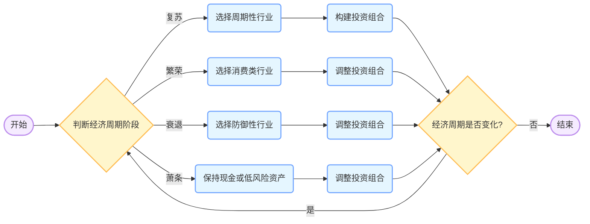

# 彼得林奇的行业轮动策略

> 关键词：彼得林奇、行业轮动策略、投资分析、金融市场、量化交易、行业周期、投资组合

> 摘要：本文围绕彼得林奇的行业轮动策略展开深入探讨。首先介绍该策略的背景，包括目的、适用读者群体、文档结构及相关术语。接着阐述核心概念与联系，通过文本示意图和 Mermaid 流程图展示其架构。详细讲解核心算法原理并给出 Python 源代码示例，推导相关数学模型和公式，结合实际例子进行说明。在项目实战部分，从开发环境搭建、源代码实现到代码解读进行全面分析。分析该策略的实际应用场景，推荐学习资源、开发工具框架和相关论文著作。最后总结其未来发展趋势与挑战，解答常见问题，并提供扩展阅读和参考资料，为投资者理解和应用该策略提供全面且深入的指导。

## 1. 背景介绍 
### 1.1 目的和范围
彼得林奇作为投资界的传奇人物，其行业轮动策略具有重要的理论和实践价值。本文的目的在于深入剖析彼得林奇的行业轮动策略，详细阐述其核心原理、算法实现、实际应用等方面内容。通过全面的分析，帮助投资者更好地理解该策略，掌握其在金融市场中的应用方法，从而优化投资决策，提高投资收益。范围涵盖从策略的基本概念到具体的代码实现，再到实际应用场景和未来发展趋势等多个维度。

### 1.2 预期读者
本文预期读者主要包括金融投资领域的专业人士，如基金经理、投资分析师等，他们可以通过本文深入研究彼得林奇的行业轮动策略，为投资决策提供更科学的依据；也适合对金融投资有一定兴趣的业余投资者，帮助他们提升投资知识和技能；同时，计算机专业涉及量化交易方向的学生和开发者也能从本文中获取算法实现和代码应用的相关知识。

### 1.3 文档结构概述
本文将按照以下结构进行阐述：首先介绍背景信息，让读者对文章的目的、读者群体和整体结构有清晰的认识；接着讲解核心概念与联系，通过示意图和流程图直观展示策略架构；随后深入探讨核心算法原理并给出 Python 代码实现；推导数学模型和公式并举例说明；进行项目实战，包括开发环境搭建、代码实现和解读；分析实际应用场景；推荐相关的学习资源、开发工具框架和论文著作；总结未来发展趋势与挑战；解答常见问题；最后提供扩展阅读和参考资料。

### 1.4 术语表
#### 1.4.1 核心术语定义
- **行业轮动策略**：根据不同行业在经济周期的不同阶段表现出的周期性特征，通过调整投资组合中不同行业的权重，以获取超额收益的投资策略。
- **经济周期**：经济活动沿着经济发展的总体趋势所经历的有规律的扩张和收缩，一般分为复苏、繁荣、衰退和萧条四个阶段。
- **投资组合**：由投资者持有的多种资产（如股票、债券等）组成的集合，旨在通过分散投资降低风险。

#### 1.4.2 相关概念解释
- **行业周期**：每个行业都有其自身的发展周期，包括初创期、成长期、成熟期和衰退期。不同行业的周期与经济周期可能存在不同的关联关系。
- **超额收益**：投资组合的实际收益超过市场基准收益的部分，是衡量投资策略有效性的重要指标。

#### 1.4.3 缩略词列表
- **GDP**：国内生产总值（Gross Domestic Product），是衡量一个国家或地区经济状况和发展水平的重要指标。
- **PE**：市盈率（Price-to-Earnings Ratio），是股票价格除以每股收益的比率，反映了市场对公司盈利的预期。

## 2. 核心概念与联系 

### 核心概念原理
彼得林奇的行业轮动策略基于对经济周期和行业周期的深刻理解。经济周期的不同阶段，不同行业的表现会有所差异。例如，在经济复苏阶段，一些周期性行业如钢铁、汽车等往往会率先受益，因为随着经济的回暖，对这些行业产品的需求会增加；而在经济繁荣阶段，消费类行业如食品饮料、零售等通常会有较好的表现，因为消费者的购买力增强。

行业轮动策略的核心就是通过对经济周期的判断，提前布局那些在当前经济阶段有望表现良好的行业，当经济周期发生变化时，及时调整投资组合，将资金从表现不佳的行业转移到表现较好的行业。

### 架构的文本示意图
```plaintext
经济周期判断
|
|-- 复苏阶段
|   |-- 选择周期性行业（钢铁、汽车等）
|   |-- 构建投资组合
|
|-- 繁荣阶段
|   |-- 选择消费类行业（食品饮料、零售等）
|   |-- 调整投资组合
|
|-- 衰退阶段
|   |-- 选择防御性行业（公用事业、医药等）
|   |-- 调整投资组合
|
|-- 萧条阶段
|   |-- 保持现金或低风险资产
|   |-- 调整投资组合
```

### Mermaid 流程图


## 3. 核心算法原理 & 具体操作步骤 

### 核心算法原理
彼得林奇的行业轮动策略的核心算法原理是基于对经济指标的分析来判断经济周期的阶段，然后根据不同阶段选择相应的行业进行投资。常见的经济指标包括 GDP 增长率、通货膨胀率、利率等。

具体步骤如下：
1. **收集经济数据**：定期收集 GDP 增长率、通货膨胀率、利率等经济数据。
2. **判断经济周期阶段**：根据经济数据的变化趋势，判断当前经济处于复苏、繁荣、衰退还是萧条阶段。
3. **选择行业**：根据经济周期阶段，选择相应的行业进行投资。
4. **构建投资组合**：根据选择的行业，选择具体的股票或基金构建投资组合。
5. **定期调整**：定期重新评估经济周期阶段，根据评估结果调整投资组合。

### Python 源代码示例
```python
import pandas as pd
import numpy as np

# 模拟经济数据
gdp_growth_rates = [2.0, 2.5, 3.0, 3.5, 3.0, 2.5, 2.0, 1.5]
inflation_rates = [1.5, 1.8, 2.0, 2.2, 2.5, 2.8, 3.0, 3.2]
interest_rates = [2.0, 2.2, 2.5, 2.8, 3.0, 2.8, 2.5, 2.2]

# 创建 DataFrame
data = pd.DataFrame({
    'gdp_growth': gdp_growth_rates,
    'inflation': inflation_rates,
    'interest_rate': interest_rates
})

# 定义经济周期判断函数
def judge_economic_cycle(row):
    gdp_growth = row['gdp_growth']
    inflation = row['inflation']
    interest_rate = row['interest_rate']
    
    if gdp_growth > 2.5 and inflation < 2.5 and interest_rate < 2.5:
        return '复苏'
    elif gdp_growth > 3.0 and inflation > 2.5 and interest_rate > 2.5:
        return '繁荣'
    elif gdp_growth < 2.0 and inflation > 3.0 and interest_rate > 3.0:
        return '衰退'
    else:
        return '萧条'

# 应用判断函数
data['economic_cycle'] = data.apply(judge_economic_cycle, axis=1)

# 定义行业选择函数
def select_industry(cycle):
    if cycle == '复苏':
        return ['钢铁', '汽车']
    elif cycle == '繁荣':
        return ['食品饮料', '零售']
    elif cycle == '衰退':
        return ['公用事业', '医药']
    else:
        return ['现金', '债券']

# 应用行业选择函数
data['selected_industries'] = data['economic_cycle'].apply(select_industry)

print(data)
```
### 代码解释
1. **数据收集**：通过模拟数据创建了一个包含 GDP 增长率、通货膨胀率和利率的 DataFrame。
2. **经济周期判断**：定义了 `judge_economic_cycle` 函数，根据经济数据判断当前经济周期阶段。
3. **行业选择**：定义了 `select_industry` 函数，根据经济周期阶段选择相应的行业。
4. **结果输出**：将经济周期阶段和选择的行业添加到 DataFrame 中并打印输出。

## 4. 数学模型和公式 & 详细讲解 & 举例说明 

### 数学模型和公式
在彼得林奇的行业轮动策略中，虽然没有严格意义上的复杂数学模型，但可以用一些简单的公式来辅助分析。

#### 行业权重调整公式
假设投资组合中有 $n$ 个行业，第 $i$ 个行业的初始权重为 $w_{i0}$，根据经济周期判断，需要将第 $i$ 个行业的权重调整为 $w_{i1}$。调整公式可以表示为：

$$w_{i1} = w_{i0} \times \frac{r_{i}}{ \sum_{j=1}^{n} r_{j}}$$

其中，$r_{i}$ 是第 $i$ 个行业在当前经济周期阶段的预期收益率。

#### 超额收益计算公式
超额收益 $ER$ 可以通过以下公式计算：

$$ER = R_p - R_b$$

其中，$R_p$ 是投资组合的实际收益率，$R_b$ 是市场基准收益率。

### 详细讲解
#### 行业权重调整公式
该公式的目的是根据不同行业在当前经济周期阶段的预期收益率来调整投资组合中各行业的权重。预期收益率越高的行业，其在投资组合中的权重就会相应增加。

#### 超额收益计算公式
超额收益是衡量投资策略有效性的重要指标。如果超额收益为正，说明投资组合的表现优于市场基准；如果超额收益为负，则说明投资组合的表现不如市场基准。

### 举例说明
假设投资组合中有三个行业：钢铁、食品饮料和公用事业，初始权重分别为 $w_{10}=0.3$，$w_{20}=0.4$，$w_{30}=0.3$。经过经济周期判断，当前处于复苏阶段，钢铁、食品饮料和公用事业的预期收益率分别为 $r_1 = 0.2$，$r_2 = 0.1$，$r_3 = 0.05$。

首先计算分母：$\sum_{j=1}^{3} r_{j} = 0.2 + 0.1 + 0.05 = 0.35$

然后计算调整后的权重：
- 钢铁行业：$w_{11} = 0.3 \times \frac{0.2}{0.35} \approx 0.171$
- 食品饮料行业：$w_{21} = 0.4 \times \frac{0.1}{0.35} \approx 0.114$
- 公用事业行业：$w_{31} = 0.3 \times \frac{0.05}{0.35} \approx 0.043$

假设投资组合的实际收益率 $R_p = 0.15$，市场基准收益率 $R_b = 0.1$，则超额收益 $ER = 0.15 - 0.1 = 0.05$，说明投资组合的表现优于市场基准。

## 5. 项目实战：代码实际案例和详细解释说明 

### 5.1  开发环境搭建
#### 操作系统
可以选择 Windows、Linux 或 macOS 操作系统，建议使用 Linux 或 macOS 系统，因为它们在数据处理和开发方面具有更好的稳定性和性能。

#### Python 环境
安装 Python 3.7 及以上版本。可以从 Python 官方网站（https://www.python.org/downloads/）下载安装包进行安装。

#### 第三方库
需要安装以下第三方库：
- **pandas**：用于数据处理和分析。
- **numpy**：用于数值计算。
- **matplotlib**：用于数据可视化。

可以使用以下命令进行安装：
```sh
pip install pandas numpy matplotlib
```

### 5.2  源代码详细实现和代码解读
```python
import pandas as pd
import numpy as np
import matplotlib.pyplot as plt

# 模拟经济数据
gdp_growth_rates = [2.0, 2.5, 3.0, 3.5, 3.0, 2.5, 2.0, 1.5]
inflation_rates = [1.5, 1.8, 2.0, 2.2, 2.5, 2.8, 3.0, 3.2]
interest_rates = [2.0, 2.2, 2.5, 2.8, 3.0, 2.8, 2.5, 2.2]

# 创建 DataFrame
data = pd.DataFrame({
    'gdp_growth': gdp_growth_rates,
    'inflation': inflation_rates,
    'interest_rate': interest_rates
})

# 定义经济周期判断函数
def judge_economic_cycle(row):
    gdp_growth = row['gdp_growth']
    inflation = row['inflation']
    interest_rate = row['interest_rate']
    
    if gdp_growth > 2.5 and inflation < 2.5 and interest_rate < 2.5:
        return '复苏'
    elif gdp_growth > 3.0 and inflation > 2.5 and interest_rate > 2.5:
        return '繁荣'
    elif gdp_growth < 2.0 and inflation > 3.0 and interest_rate > 3.0:
        return '衰退'
    else:
        return '萧条'

# 应用判断函数
data['economic_cycle'] = data.apply(judge_economic_cycle, axis=1)

# 定义行业选择函数
def select_industry(cycle):
    if cycle == '复苏':
        return ['钢铁', '汽车']
    elif cycle == '繁荣':
        return ['食品饮料', '零售']
    elif cycle == '衰退':
        return ['公用事业', '医药']
    else:
        return ['现金', '债券']

# 应用行业选择函数
data['selected_industries'] = data['economic_cycle'].apply(select_industry)

# 可视化经济周期变化
plt.figure(figsize=(10, 6))
plt.plot(data.index, data['economic_cycle'], marker='o')
plt.xlabel('时间')
plt.ylabel('经济周期阶段')
plt.title('经济周期变化')
plt.xticks(rotation=45)
plt.show()

print(data)
```
### 代码解读
1. **数据模拟**：使用列表模拟了 GDP 增长率、通货膨胀率和利率的历史数据，并创建了一个 DataFrame 来存储这些数据。
2. **经济周期判断**：定义了 `judge_economic_cycle` 函数，根据经济数据判断当前经济周期阶段，并将结果添加到 DataFrame 中。
3. **行业选择**：定义了 `select_industry` 函数，根据经济周期阶段选择相应的行业，并将结果添加到 DataFrame 中。
4. **数据可视化**：使用 `matplotlib` 库绘制了经济周期阶段随时间变化的折线图，直观展示经济周期的变化情况。
5. **结果输出**：打印输出包含经济周期阶段和选择行业的 DataFrame。

### 5.3  代码解读与分析
通过上述代码，我们可以看到如何根据经济数据判断经济周期阶段，并根据不同阶段选择相应的行业进行投资。数据可视化部分可以帮助我们更直观地观察经济周期的变化情况，从而更好地调整投资策略。

需要注意的是，这只是一个简单的示例，实际应用中需要使用更准确的经济数据和更复杂的判断模型。同时，行业选择也需要考虑更多的因素，如行业的基本面、政策环境等。

## 6. 实际应用场景 
### 股票投资
在股票投资中，投资者可以根据彼得林奇的行业轮动策略，在不同的经济周期阶段选择相应行业的股票进行投资。例如，在经济复苏阶段，增加周期性行业股票的持仓比例；在经济繁荣阶段，关注消费类行业股票。通过适时调整投资组合，投资者有望获得超额收益。

### 基金投资
基金投资者可以根据行业轮动策略选择不同行业主题的基金进行投资。在经济周期变化时，及时调整基金的配置比例。例如，当经济从复苏阶段进入繁荣阶段时，将部分资金从周期性行业基金转移到消费类行业基金。

### 资产配置
在进行资产配置时，行业轮动策略可以作为重要的参考依据。投资者可以根据经济周期阶段，合理分配股票、债券、现金等资产的比例。例如，在经济衰退阶段，增加债券和现金的配置比例，降低股票的配置比例，以降低投资风险。

### 量化交易
量化交易开发者可以将彼得林奇的行业轮动策略转化为量化模型，通过编程实现自动化交易。根据经济数据和预设的规则，自动调整投资组合中不同行业的权重，提高交易效率和决策的科学性。

## 7. 工具和资源推荐
### 7.1 学习资源推荐
#### 7.1.1 书籍推荐
- 《彼得林奇的成功投资》：彼得林奇的经典著作，详细介绍了他的投资理念和方法，包括行业轮动策略的相关内容。
- 《聪明的投资者》：本杰明·格雷厄姆的经典投资书籍，为投资者提供了价值投资的基本理念和方法，对理解行业轮动策略有一定的帮助。
- 《金融市场与金融机构》：全面介绍金融市场和金融机构的教材，有助于投资者了解金融市场的运行机制和行业特点。

#### 7.1.2 在线课程
- Coursera 上的“投资学原理”课程：由知名大学教授授课，系统介绍投资学的基本原理和方法，包括行业分析和投资组合管理。
- 网易云课堂上的“量化投资实战”课程：结合实际案例，介绍量化投资的策略和方法，对行业轮动策略的量化实现有一定的指导作用。

#### 7.1.3 技术博客和网站
- 雪球网：国内知名的投资社区，投资者可以在上面交流投资经验和分享行业研究报告，了解不同行业的动态和投资机会。
- 东方财富网：提供丰富的金融数据和资讯，包括经济数据、行业数据等，有助于投资者进行行业分析和经济周期判断。

### 7.2 开发工具框架推荐
#### 7.2.1 IDE和编辑器
- PyCharm：一款专业的 Python 集成开发环境，具有代码编辑、调试、自动补全、版本控制等功能，适合进行 Python 代码开发。
- Jupyter Notebook：一个交互式的开发环境，支持 Python、R 等多种编程语言，方便进行数据探索、模型验证和代码演示。

#### 7.2.2 调试和性能分析工具
- pdb：Python 内置的调试工具，可以帮助开发者定位代码中的错误和问题。
- cProfile：Python 内置的性能分析工具，可以分析代码的运行时间和资源消耗情况，帮助开发者优化代码性能。

#### 7.2.3 相关框架和库
- pandas：用于数据处理和分析的 Python 库，提供了高效的数据结构和数据操作方法，适合处理经济数据和金融数据。
- numpy：用于数值计算的 Python 库，提供了丰富的数学函数和数组操作方法，在量化投资中广泛应用。
- scikit-learn：用于机器学习的 Python 库，提供了多种机器学习算法和工具，可用于经济周期预测和行业分析。

### 7.3 相关论文著作推荐
#### 7.3.1 经典论文
- 《The Cross-Section of Expected Stock Returns》：Fama 和 French 提出的三因子模型，对股票收益率的影响因素进行了深入研究，为行业轮动策略提供了理论基础。
- 《Efficient Capital Markets: A Review of Theory and Empirical Work》：Fama 发表的关于有效市场假说的经典论文，对理解金融市场的效率和投资策略有重要意义。

#### 7.3.2 最新研究成果
- 可以关注《Journal of Finance》、《Review of Financial Studies》等金融领域的顶级学术期刊，了解行业轮动策略的最新研究进展和方法。

#### 7.3.3 应用案例分析
- 一些金融研究机构和投资公司会发布关于行业轮动策略的应用案例分析报告，投资者可以通过阅读这些报告了解该策略在实际应用中的效果和经验教训。

## 8. 总结：未来发展趋势与挑战
### 未来发展趋势
#### 与人工智能结合
随着人工智能技术的不断发展，行业轮动策略可以与机器学习、深度学习等人工智能技术相结合。通过构建更复杂的模型，利用大量的经济数据和行业数据进行训练，提高经济周期判断和行业选择的准确性和及时性。

#### 全球化应用
随着全球经济一体化的发展，行业轮动策略不再局限于单个国家或地区的市场。投资者可以将该策略应用于全球市场，通过跨地区、跨行业的投资组合配置，降低投资风险，提高投资收益。

#### 量化交易普及
量化交易在金融市场中的应用越来越广泛，行业轮动策略作为一种可量化的投资策略，将得到更广泛的应用。投资者可以通过编写量化交易程序，实现行业轮动策略的自动化交易，提高交易效率和决策的科学性。

### 挑战
#### 经济数据的准确性和及时性
经济数据的准确性和及时性是影响行业轮动策略效果的重要因素。如果经济数据存在误差或延迟，可能会导致经济周期判断错误，从而影响投资决策。

#### 市场不确定性
金融市场存在诸多不确定性因素，如政策变化、突发事件等，这些因素可能会导致行业表现与经济周期的预期不一致，增加了行业轮动策略的实施难度。

#### 模型的有效性和适应性
构建的行业轮动模型需要具有较高的有效性和适应性。随着市场环境的变化，模型需要不断进行优化和调整，以确保其在不同市场条件下都能取得较好的效果。

## 9. 附录：常见问题与解答
### 问题 1：如何准确判断经济周期阶段？
答：可以通过综合分析多个经济指标来判断经济周期阶段，如 GDP 增长率、通货膨胀率、利率、失业率等。同时，还可以参考专业机构的经济研究报告和市场分析。但需要注意的是，经济周期的判断存在一定的主观性和不确定性，需要结合实际情况进行综合判断。

### 问题 2：行业轮动策略是否适用于所有投资者？
答：行业轮动策略并不适用于所有投资者。该策略需要投资者具备一定的金融知识和市场分析能力，能够准确判断经济周期阶段和选择合适的行业。对于缺乏专业知识和经验的投资者，可能更适合采用长期投资、分散投资等较为稳健的投资策略。

### 问题 3：如何选择具体的行业和股票进行投资？
答：在选择具体的行业和股票时，除了考虑经济周期阶段外，还需要考虑行业的基本面、公司的财务状况、竞争力等因素。可以通过研究行业报告、公司财报、分析师评级等方式进行筛选和分析。同时，建议采用分散投资的方式，降低投资风险。

### 问题 4：行业轮动策略的投资周期一般是多久？
答：行业轮动策略的投资周期没有固定的标准，取决于经济周期的变化和市场情况。一般来说，经济周期的一个阶段可能持续几个月到几年不等，投资者需要根据经济周期的变化及时调整投资组合。

## 10. 扩展阅读 & 参考资料
### 扩展阅读
- 《金融炼金术》：乔治·索罗斯的著作，介绍了他的反身性理论和投资哲学，对理解金融市场的复杂性和投资策略有一定的启发。
- 《漫步华尔街》：伯顿·马尔基尔的经典投资书籍，介绍了有效市场假说和随机漫步理论，对投资者的投资观念有一定的影响。

### 参考资料
- 彼得林奇相关的演讲和访谈记录。
- 金融机构发布的行业研究报告和投资策略分析。
- 相关学术期刊上发表的关于行业轮动策略的研究论文。

作者：AI天才研究院/AI Genius Institute & 禅与计算机程序设计艺术 /Zen And The Art of Computer Programming