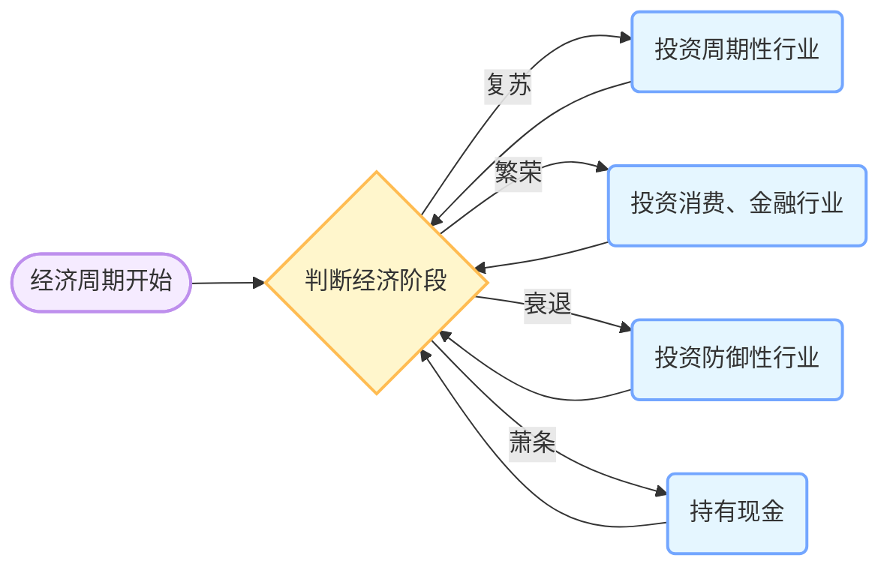

# 彼得林奇的行业轮动策略

> 关键词：彼得林奇、行业轮动策略、投资分析、资产配置、市场周期

> 摘要：本文深入探讨了彼得林奇的行业轮动策略，详细介绍了该策略的背景、核心概念、算法原理、数学模型等内容。通过实际案例分析，阐述了如何在项目实战中运用这一策略。同时，列举了该策略的实际应用场景，推荐了相关的学习资源、开发工具和论文著作。最后，总结了该策略的未来发展趋势与挑战，并提供了常见问题解答和扩展阅读参考资料，旨在帮助投资者更好地理解和运用彼得林奇的行业轮动策略进行投资决策。

## 1. 背景介绍 
### 1.1 目的和范围
彼得林奇是投资界的传奇人物，他所管理的富达麦哲伦基金创造了惊人的业绩。其行业轮动策略旨在通过对不同行业在经济周期不同阶段表现的分析，调整投资组合中各行业的权重，以获取超越市场平均水平的收益。本文的目的是全面解析彼得林奇的行业轮动策略，范围涵盖策略的理论基础、实际操作方法、应用场景以及未来发展等方面。

### 1.2 预期读者
本文预期读者包括对投资领域感兴趣的个人投资者、金融专业学生、投资机构从业者以及希望深入了解投资策略的技术人员等。无论您是投资新手还是有一定经验的专业人士，都能从本文中获得有价值的信息。

### 1.3 文档结构概述
本文将按照以下结构展开：首先介绍核心概念与联系，明确行业轮动策略的基本原理和架构；接着阐述核心算法原理及具体操作步骤，通过Python代码详细说明；然后介绍相关的数学模型和公式，并举例说明；之后进行项目实战，包括开发环境搭建、源代码实现和代码解读；再探讨该策略的实际应用场景；随后推荐相关的工具和资源；最后总结未来发展趋势与挑战，提供常见问题解答和扩展阅读参考资料。

### 1.4 术语表
#### 1.4.1 核心术语定义
- **行业轮动**：指在经济周期的不同阶段，不同行业的表现存在差异，投资者通过调整投资组合中各行业的权重，从表现较好的行业中获利。
- **经济周期**：指经济活动沿着经济发展的总体趋势所经历的有规律的扩张和收缩，一般分为复苏、繁荣、衰退和萧条四个阶段。
- **投资组合**：指投资者将资金分散投资于不同的资产或行业，以降低风险和提高收益。

#### 1.4.2 相关概念解释
- **行业景气度**：反映行业在一定时期内的发展状况和市场前景，通常通过行业的盈利能力、增长速度、市场需求等指标来衡量。
- **相对强弱指标**：用于比较不同行业或资产在一段时间内的表现强弱，帮助投资者判断哪些行业或资产具有更好的投资价值。

#### 1.4.3 缩略词列表
- **GDP**：国内生产总值，衡量一个国家或地区经济活动总量的指标。
- **PE**：市盈率，股票价格与每股收益的比率，用于评估股票的估值水平。

## 2. 核心概念与联系 

### 核心概念原理
彼得林奇的行业轮动策略基于经济周期理论。在经济周期的不同阶段，不同行业受到的影响不同，表现出不同的景气度。例如，在经济复苏阶段，制造业、建材等周期性行业通常会率先受益，因为随着经济的好转，企业开始增加生产，对原材料和设备的需求增加；而在经济繁荣阶段，消费、金融等行业可能表现较好，因为消费者信心增强，消费需求旺盛，金融机构的业务也会随之增长。

投资者可以通过对经济周期的判断，提前布局那些即将进入景气周期的行业，在行业景气度上升时获得收益；当行业景气度下降时，及时调整投资组合，将资金转移到其他更有潜力的行业。

### 架构的文本示意图
```plaintext
经济周期
|-- 复苏阶段
|   |-- 周期性行业（制造业、建材等）表现较好
|-- 繁荣阶段
|   |-- 消费、金融等行业表现较好
|-- 衰退阶段
|   |-- 防御性行业（公用事业、医药等）表现较好
|-- 萧条阶段
|   |-- 现金为王，等待时机
```

### Mermaid 流程图


## 3. 核心算法原理 & 具体操作步骤 

### 核心算法原理
行业轮动策略的核心算法是通过对经济指标和行业数据的分析，判断经济周期的阶段，进而确定投资组合中各行业的权重。具体步骤如下：
1. **数据收集**：收集宏观经济指标（如GDP增长率、通货膨胀率等）和各行业的相关数据（如行业销售额、利润率等）。
2. **经济周期判断**：使用统计分析方法，如时间序列分析、主成分分析等，对经济指标进行分析，判断当前经济处于周期的哪个阶段。
3. **行业景气度评估**：根据经济周期的阶段，评估各行业的景气度。可以使用相对强弱指标、行业盈利预测等方法进行评估。
4. **投资组合调整**：根据行业景气度评估结果，调整投资组合中各行业的权重。增加景气度高的行业的投资比例，减少景气度低的行业的投资比例。

### 具体操作步骤
以下是使用Python实现行业轮动策略的具体操作步骤：

```python
import pandas as pd
import numpy as np
import matplotlib.pyplot as plt

# 步骤1：数据收集
# 假设我们已经收集到了宏观经济指标和行业数据
# 这里使用模拟数据进行演示
np.random.seed(0)
n_periods = 100
gdp_growth = np.random.normal(0.03, 0.01, n_periods)
inflation = np.random.normal(0.02, 0.005, n_periods)
industry_returns = {
    'cyclical': np.random.normal(0.05, 0.02, n_periods),
    'consumer': np.random.normal(0.04, 0.015, n_periods),
    'defensive': np.random.normal(0.03, 0.01, n_periods)
}

data = pd.DataFrame({
    'GDP Growth': gdp_growth,
    'Inflation': inflation,
    **industry_returns
})

# 步骤2：经济周期判断
# 简单地根据GDP增长率判断经济周期
# GDP增长率大于3%为繁荣阶段，小于1%为衰退阶段，其他为复苏阶段
def determine_economic_cycle(gdp_growth):
    if gdp_growth > 0.03:
        return '繁荣'
    elif gdp_growth < 0.01:
        return '衰退'
    else:
        return '复苏'

data['Economic Cycle'] = data['GDP Growth'].apply(determine_economic_cycle)

# 步骤3：行业景气度评估
# 这里简单地使用行业收益率作为景气度指标
def evaluate_industry_sentiment(returns):
    return np.mean(returns)

industry_sentiment = {
    industry: evaluate_industry_sentiment(data[industry])
    for industry in industry_returns.keys()
}

# 步骤4：投资组合调整
# 根据经济周期调整投资组合权重
portfolio_weights = {}
for cycle in data['Economic Cycle'].unique():
    cycle_data = data[data['Economic Cycle'] == cycle]
    if cycle == '复苏':
        portfolio_weights[cycle] = {
            'cyclical': 0.6,
            'consumer': 0.3,
            'defensive': 0.1
        }
    elif cycle == '繁荣':
        portfolio_weights[cycle] = {
            'cyclical': 0.3,
            'consumer': 0.6,
            'defensive': 0.1
        }
    elif cycle == '衰退':
        portfolio_weights[cycle] = {
            'cyclical': 0.1,
            'consumer': 0.3,
            'defensive': 0.6
        }

# 计算投资组合收益率
portfolio_returns = []
for i in range(n_periods):
    cycle = data['Economic Cycle'][i]
    weights = portfolio_weights[cycle]
    returns = np.array([data[industry][i] for industry in industry_returns.keys()])
    portfolio_return = np.dot(np.array(list(weights.values())), returns)
    portfolio_returns.append(portfolio_return)

# 绘制投资组合收益率曲线
plt.plot(portfolio_returns)
plt.title('投资组合收益率曲线')
plt.xlabel('时期')
plt.ylabel('收益率')
plt.show()
```

### 代码解释
1. **数据收集**：使用`numpy`生成模拟的宏观经济指标和行业收益率数据，并存储在`pandas`的`DataFrame`中。
2. **经济周期判断**：定义`determine_economic_cycle`函数，根据GDP增长率判断经济周期的阶段，并将结果添加到`DataFrame`中。
3. **行业景气度评估**：定义`evaluate_industry_sentiment`函数，计算各行业的平均收益率作为景气度指标。
4. **投资组合调整**：根据经济周期的不同阶段，设置不同的投资组合权重。然后计算每个时期的投资组合收益率，并绘制收益率曲线。

## 4. 数学模型和公式 & 详细讲解 & 举例说明 

### 数学模型和公式
#### 1. 相对强弱指标（RSI）
相对强弱指标用于比较不同行业或资产在一段时间内的表现强弱。其计算公式为：
$$RSI = 100 - \frac{100}{1 + RS}$$
其中，$RS$ 为相对强度，计算公式为：
$$RS = \frac{\text{平均上涨幅度}}{\text{平均下跌幅度}}$$

#### 2. 投资组合收益率
投资组合收益率的计算公式为：
$$R_p = \sum_{i=1}^{n} w_i R_i$$
其中，$R_p$ 为投资组合收益率，$w_i$ 为第 $i$ 个行业的投资权重，$R_i$ 为第 $i$ 个行业的收益率。

### 详细讲解
#### 相对强弱指标（RSI）
相对强弱指标的取值范围在0到100之间。一般来说，当RSI超过70时，表明该行业或资产处于超买状态，可能存在回调风险；当RSI低于30时，表明该行业或资产处于超卖状态，可能存在反弹机会。

#### 投资组合收益率
投资组合收益率是各行业收益率的加权平均值。通过合理调整投资组合中各行业的权重，可以降低风险并提高收益。

### 举例说明
假设我们有三个行业A、B、C，其投资权重分别为 $w_A = 0.3$，$w_B = 0.4$，$w_C = 0.3$，在某一时期的收益率分别为 $R_A = 0.05$，$R_B = 0.03$，$R_C = 0.02$。则该投资组合的收益率为：
$$R_p = w_A R_A + w_B R_B + w_C R_C = 0.3\times0.05 + 0.4\times0.03 + 0.3\times0.02 = 0.033$$

## 5. 项目实战：代码实际案例和详细解释说明 

### 5.1  开发环境搭建
#### 操作系统
可以选择Windows、Linux或macOS等主流操作系统。

#### Python环境
建议使用Python 3.7及以上版本。可以通过Anaconda或Python官方网站下载安装Python。

#### 安装必要的库
使用以下命令安装所需的Python库：
```sh
pip install pandas numpy matplotlib
```

### 5.2  源代码详细实现和代码解读
以下是一个更完整的行业轮动策略的Python代码示例：

```python
import pandas as pd
import numpy as np
import matplotlib.pyplot as plt

# 数据加载函数
def load_data():
    # 这里可以从文件或数据库中加载实际数据
    # 为了演示，使用模拟数据
    np.random.seed(0)
    n_periods = 100
    gdp_growth = np.random.normal(0.03, 0.01, n_periods)
    inflation = np.random.normal(0.02, 0.005, n_periods)
    industry_returns = {
        'cyclical': np.random.normal(0.05, 0.02, n_periods),
        'consumer': np.random.normal(0.04, 0.015, n_periods),
        'defensive': np.random.normal(0.03, 0.01, n_periods)
    }

    data = pd.DataFrame({
        'GDP Growth': gdp_growth,
        'Inflation': inflation,
        **industry_returns
    })
    return data

# 经济周期判断函数
def determine_economic_cycle(data):
    def classify_cycle(gdp_growth):
        if gdp_growth > 0.03:
            return '繁荣'
        elif gdp_growth < 0.01:
            return '衰退'
        else:
            return '复苏'
    data['Economic Cycle'] = data['GDP Growth'].apply(classify_cycle)
    return data

# 行业景气度评估函数
def evaluate_industry_sentiment(data):
    industries = ['cyclical', 'consumer', 'defensive']
    sentiment = {}
    for industry in industries:
        sentiment[industry] = np.mean(data[industry])
    return sentiment

# 投资组合调整函数
def adjust_portfolio_weights(data):
    portfolio_weights = {}
    for cycle in data['Economic Cycle'].unique():
        cycle_data = data[data['Economic Cycle'] == cycle]
        if cycle == '复苏':
            portfolio_weights[cycle] = {
                'cyclical': 0.6,
                'consumer': 0.3,
                'defensive': 0.1
            }
        elif cycle == '繁荣':
            portfolio_weights[cycle] = {
                'cyclical': 0.3,
                'consumer': 0.6,
                'defensive': 0.1
            }
        elif cycle == '衰退':
            portfolio_weights[cycle] = {
                'cyclical': 0.1,
                'consumer': 0.3,
                'defensive': 0.6
            }
    return portfolio_weights

# 计算投资组合收益率函数
def calculate_portfolio_returns(data, portfolio_weights):
    industries = ['cyclical', 'consumer', 'defensive']
    portfolio_returns = []
    for i in range(len(data)):
        cycle = data['Economic Cycle'][i]
        weights = portfolio_weights[cycle]
        returns = np.array([data[industry][i] for industry in industries])
        portfolio_return = np.dot(np.array(list(weights.values())), returns)
        portfolio_returns.append(portfolio_return)
    return portfolio_returns

# 主函数
def main():
    # 加载数据
    data = load_data()
    # 判断经济周期
    data = determine_economic_cycle(data)
    # 评估行业景气度
    industry_sentiment = evaluate_industry_sentiment(data)
    # 调整投资组合权重
    portfolio_weights = adjust_portfolio_weights(data)
    # 计算投资组合收益率
    portfolio_returns = calculate_portfolio_returns(data, portfolio_weights)

    # 绘制投资组合收益率曲线
    plt.plot(portfolio_returns)
    plt.title('投资组合收益率曲线')
    plt.xlabel('时期')
    plt.ylabel('收益率')
    plt.show()

if __name__ == "__main__":
    main()
```

### 代码解读与分析
1. **数据加载函数`load_data`**：生成模拟的宏观经济指标和行业收益率数据，并存储在`pandas`的`DataFrame`中。在实际应用中，可以从文件或数据库中加载真实数据。
2. **经济周期判断函数`determine_economic_cycle`**：根据GDP增长率判断经济周期的阶段，并将结果添加到`DataFrame`中。
3. **行业景气度评估函数`evaluate_industry_sentiment`**：计算各行业的平均收益率作为景气度指标。
4. **投资组合调整函数`adjust_portfolio_weights`**：根据经济周期的不同阶段，设置不同的投资组合权重。
5. **计算投资组合收益率函数`calculate_portfolio_returns`**：根据投资组合权重和各行业的收益率，计算每个时期的投资组合收益率。
6. **主函数`main`**：依次调用上述函数，完成数据加载、经济周期判断、行业景气度评估、投资组合调整和收益率计算，并绘制投资组合收益率曲线。

## 6. 实际应用场景 
### 个人投资者
个人投资者可以运用彼得林奇的行业轮动策略，根据经济周期的变化调整自己的投资组合。例如，在经济复苏阶段，增加对周期性行业的投资；在经济繁荣阶段，加大对消费和金融行业的配置；在经济衰退阶段，转向防御性行业。通过合理的行业轮动，可以降低投资风险，提高投资收益。

### 投资机构
投资机构可以将行业轮动策略作为资产配置的重要方法之一。通过深入研究经济周期和行业发展趋势，制定更科学的投资组合方案，为客户提供更优质的投资服务。同时，投资机构还可以利用量化分析工具，对行业轮动策略进行优化和改进，提高策略的有效性和稳定性。

### 金融研究机构
金融研究机构可以对彼得林奇的行业轮动策略进行深入研究和分析，探索其在不同市场环境下的应用效果。通过实证研究和案例分析，为投资者和投资机构提供理论支持和决策参考。此外，金融研究机构还可以开展相关的培训和教育活动，普及行业轮动策略的知识和应用方法。

## 7. 工具和资源推荐
### 7.1 学习资源推荐
#### 7.1.1 书籍推荐
- 《彼得·林奇的成功投资》：彼得·林奇的经典著作，详细介绍了他的投资理念和方法，包括行业轮动策略的应用。
- 《聪明的投资者》：本杰明·格雷厄姆的投资经典，阐述了价值投资的基本原理和方法，对理解行业轮动策略有很大帮助。
- 《金融炼金术》：乔治·索罗斯的著作，介绍了他的反身性理论和投资实践，对宏观经济和行业分析有一定的启示作用。

#### 7.1.2 在线课程
- Coursera上的“投资学原理”：由知名大学教授授课，系统介绍投资学的基本理论和方法，包括资产配置和行业分析。
- 网易云课堂上的“量化投资入门”：讲解量化投资的基本概念和方法，涉及行业轮动策略的量化实现。

#### 7.1.3 技术博客和网站
- 雪球网：国内知名的投资社区，提供丰富的投资资讯和分析文章，投资者可以在这里交流行业轮动策略的应用经验。
- Seeking Alpha：国外知名的投资分析网站，提供专业的行业研究报告和投资建议。

### 7.2 开发工具框架推荐
#### 7.2.1 IDE和编辑器
- PyCharm：功能强大的Python集成开发环境，提供代码编辑、调试、版本控制等功能，适合开发复杂的投资策略代码。
- Jupyter Notebook：交互式的编程环境，方便进行数据探索和分析，适合快速验证行业轮动策略的思路。

#### 7.2.2 调试和性能分析工具
- PDB：Python自带的调试工具，可以帮助开发者定位代码中的错误和问题。
- cProfile：Python的性能分析工具，可以分析代码的运行时间和内存使用情况，优化代码性能。

#### 7.2.3 相关框架和库
- Pandas：强大的数据处理和分析库，提供了丰富的数据结构和函数，方便进行行业数据的处理和分析。
- Numpy：Python的数值计算库，提供了高效的数组和矩阵运算功能，用于实现行业轮动策略中的数学计算。
- Matplotlib：Python的绘图库，用于绘制投资组合收益率曲线等可视化图表。

### 7.3 相关论文著作推荐
#### 7.3.1 经典论文
- "The Cyclical Behavior of the Components of Investment"：研究了投资各组成部分在经济周期中的表现，为行业轮动策略提供了理论基础。
- "Industry Rotation Strategies Based on Macroeconomic Variables"：探讨了基于宏观经济变量的行业轮动策略的有效性和应用方法。

#### 7.3.2 最新研究成果
- 近年来，学术界和金融界对行业轮动策略的研究不断深入，一些新的研究成果关注了行业轮动策略在新兴市场和不同资产类别中的应用。可以通过学术数据库（如IEEE Xplore、ACM Digital Library等）搜索相关的研究论文。

#### 7.3.3 应用案例分析
- 一些金融机构和投资公司会发布行业轮动策略的应用案例分析报告，可以通过他们的官方网站或金融资讯平台获取这些报告，了解行业轮动策略在实际投资中的应用效果和操作方法。

## 8. 总结：未来发展趋势与挑战
### 未来发展趋势
- **量化投资与行业轮动的融合**：随着人工智能和大数据技术的发展，量化投资将在行业轮动策略中发挥越来越重要的作用。通过运用机器学习和深度学习算法，可以更准确地预测经济周期和行业走势，优化投资组合的配置。
- **跨资产类别的行业轮动**：除了股票市场，行业轮动策略可能会扩展到债券、商品、房地产等其他资产类别。投资者可以通过跨资产类别的行业轮动，进一步分散风险，提高投资组合的收益。
- **全球市场的行业轮动**：随着全球经济一体化的加深，投资者将更加关注全球市场的行业轮动机会。不同国家和地区的经济周期和行业发展存在差异，通过全球市场的行业轮动，可以获取更广泛的投资收益。

### 挑战
- **经济周期的不确定性**：经济周期的变化受到多种因素的影响，如政策调整、自然灾害、地缘政治等，难以准确预测。这增加了行业轮动策略的实施难度，可能导致投资决策失误。
- **数据质量和可靠性**：行业轮动策略依赖于大量的宏观经济数据和行业数据，数据的质量和可靠性直接影响策略的有效性。在实际应用中，可能会遇到数据缺失、错误或滞后等问题，需要进行数据清洗和预处理。
- **市场情绪和投资者行为**：市场情绪和投资者行为对行业表现有重要影响。在某些情况下，市场情绪可能会导致行业走势偏离基本面，使行业轮动策略失效。投资者需要综合考虑市场情绪和投资者行为因素，制定更灵活的投资策略。

## 9. 附录：常见问题与解答
### 问题1：行业轮动策略适合所有投资者吗？
解答：行业轮动策略并不适合所有投资者。该策略需要投资者具备一定的宏观经济分析能力和行业研究能力，能够准确判断经济周期的阶段和行业的景气度。对于缺乏专业知识和经验的投资者来说，实施行业轮动策略可能会面临较大的风险。

### 问题2：如何确定经济周期的阶段？
解答：确定经济周期的阶段可以通过分析宏观经济指标来实现，如GDP增长率、通货膨胀率、失业率等。同时，还可以结合一些领先指标（如PMI指数、消费者信心指数等）来提前判断经济走势。此外，也可以参考专业机构的研究报告和分析观点。

### 问题3：行业轮动策略的调整频率应该如何确定？
解答：行业轮动策略的调整频率取决于多种因素，如经济周期的变化速度、行业的波动情况、投资目标等。一般来说，在经济周期的转换阶段，需要及时调整投资组合；而在经济周期相对稳定的阶段，可以适当降低调整频率。投资者可以根据自己的实际情况和市场变化，灵活确定调整频率。

### 问题4：行业轮动策略与分散投资有什么关系？
解答：行业轮动策略是分散投资的一种具体应用。通过在不同行业之间进行轮动投资，可以降低投资组合对单一行业的依赖，分散投资风险。同时，行业轮动策略还可以根据经济周期的变化，选择表现较好的行业进行投资，提高投资组合的收益。

## 10. 扩展阅读 & 参考资料
### 扩展阅读
- 《漫步华尔街》：探讨了股票市场的有效性和投资策略，对行业轮动策略有一定的补充和拓展。
- 《投资中最简单的事》：介绍了投资的基本理念和方法，强调了价值投资和逆向投资的重要性。

### 参考资料
- 彼得·林奇的相关演讲和访谈记录，可通过互联网搜索获取。
- 金融机构和投资公司发布的行业研究报告和投资策略分析。

作者：AI天才研究院/AI Genius Institute & 禅与计算机程序设计艺术 /Zen And The Art of Computer Programming