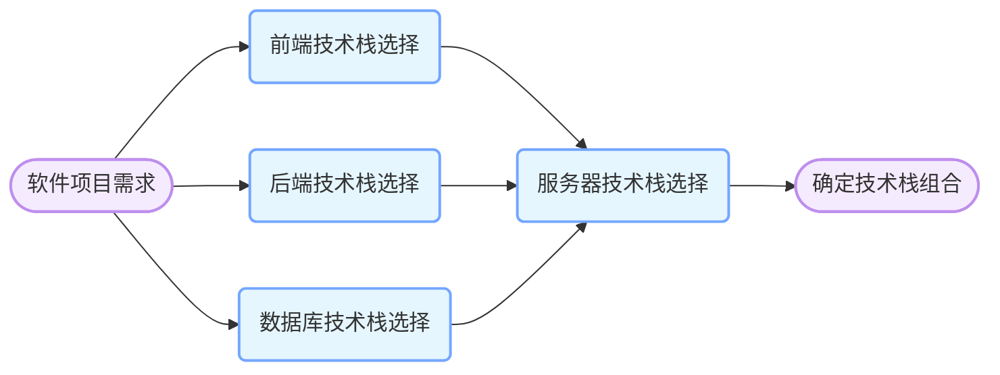

# 技术栈选择与评估

> 关键词：技术栈选择、技术栈评估、软件开发、编程语言、框架

> 摘要：本文围绕技术栈的选择与评估展开深入探讨。详细阐述了技术栈选择与评估在软件开发项目中的重要性，介绍了相关核心概念及它们之间的联系，深入讲解了核心算法原理和具体操作步骤，结合数学模型和公式进行说明。通过项目实战案例，分析代码实现和解读，展示技术栈在实际中的应用。同时，列举了技术栈在不同领域的实际应用场景，推荐了学习资源、开发工具框架以及相关论文著作。最后对技术栈选择与评估的未来发展趋势与挑战进行总结，并提供常见问题解答和扩展阅读参考资料，旨在为软件开发人员和项目管理者在技术栈决策方面提供全面且实用的指导。

## 1. 背景介绍 
### 1.1 目的和范围
在软件开发的世界里，技术栈的选择与评估是至关重要的环节。其目的在于帮助开发者和项目团队挑选出最适合特定项目需求的技术组合，以确保项目能够高效、高质量地完成。范围涵盖了从前端到后端，从编程语言到框架、数据库等各个方面的技术选择与评估。通过合理的技术栈选择与评估，可以提高开发效率、降低维护成本、提升系统性能和用户体验。

### 1.2 预期读者
本文预期读者主要包括软件开发人员、项目管理者、技术架构师等。软件开发人员可以从中获取关于技术栈选择的具体方法和实践经验，帮助他们在实际开发中做出更明智的决策；项目管理者能够了解技术栈评估的重要性和流程，从而更好地规划项目资源和进度；技术架构师可以借鉴本文的思路和方法，优化系统架构设计，选择更合适的技术栈来支撑系统的发展。

### 1.3 文档结构概述
本文将首先介绍技术栈选择与评估相关的核心概念，阐述它们之间的联系，并通过文本示意图和 Mermaid 流程图进行直观展示。接着详细讲解核心算法原理和具体操作步骤，同时结合 Python 源代码进行说明。之后引入数学模型和公式，对技术栈选择与评估进行量化分析，并举例说明。通过项目实战案例，介绍开发环境搭建、源代码实现和代码解读。然后列举技术栈在不同领域的实际应用场景。推荐学习资源、开发工具框架以及相关论文著作。最后总结技术栈选择与评估的未来发展趋势与挑战，提供常见问题解答和扩展阅读参考资料。

### 1.4 术语表
#### 1.4.1 核心术语定义
- **技术栈**：指的是一系列用于开发软件系统的技术和工具的组合，通常包括编程语言、框架、数据库、服务器等。
- **编程语言**：是用于编写计算机程序的形式语言，如 Python、Java、JavaScript 等。
- **框架**：是一种为了实现某个软件系统而提供的基础结构，它提供了一系列的类库、工具和约定，帮助开发者更高效地开发软件。
- **数据库**：是用于存储和管理数据的软件系统，常见的数据库有 MySQL、Oracle、MongoDB 等。
- **服务器**：是提供计算服务的设备，通常运行在网络环境中，为客户端提供各种服务。

#### 1.4.2 相关概念解释
- **前端技术栈**：主要用于构建用户界面，包括 HTML、CSS、JavaScript 等编程语言，以及 React、Vue.js、Angular 等前端框架。
- **后端技术栈**：负责处理业务逻辑和数据存储，常见的后端编程语言有 Python、Java、Node.js 等，后端框架有 Django、Spring Boot、Express.js 等。
- **全栈开发**：指的是开发者具备同时开发前端和后端的能力，能够独立完成一个完整的软件系统。

#### 1.4.3 缩略词列表
- **API**：Application Programming Interface，应用程序编程接口，用于不同软件系统之间的交互。
- **SDK**：Software Development Kit，软件开发工具包，包含了开发某个软件所需的各种工具和库。
- **IDE**：Integrated Development Environment，集成开发环境，提供了代码编辑、编译、调试等一系列功能的开发工具。

## 2. 核心概念与联系 

### 核心概念原理
技术栈的核心概念围绕着软件开发的各个环节展开。编程语言是基础，它决定了代码的编写方式和表达能力。不同的编程语言适用于不同的场景，例如 Python 以其简洁易读的语法和丰富的库，常用于数据科学、机器学习和 Web 开发；Java 以其跨平台性和强大的企业级开发能力，广泛应用于大型企业应用开发。

框架则是在编程语言的基础上，提供了更高层次的抽象和封装，帮助开发者更快速地构建软件系统。例如，Django 框架为 Python 开发者提供了一套完整的 Web 开发解决方案，包括路由管理、数据库操作、模板引擎等；Spring Boot 框架则为 Java 开发者提供了快速搭建企业级应用的能力。

数据库用于存储和管理软件系统中的数据，根据数据的类型和使用场景，可以选择不同类型的数据库。关系型数据库（如 MySQL、Oracle）适用于需要严格数据结构和事务处理的场景；非关系型数据库（如 MongoDB、Redis）则适用于需要处理大量非结构化数据和高并发读写的场景。

服务器是软件系统运行的物理或虚拟环境，它负责接收客户端的请求，并将处理结果返回给客户端。常见的服务器有 Apache、Nginx 等 Web 服务器，以及 Tomcat、Jetty 等应用服务器。

### 架构的文本示意图
```plaintext
                          +-------------------+
                          |    软件项目需求    |
                          +-------------------+
                                   |
                                   v
+----------------+       +----------------+       +----------------+
|  前端技术栈    |       |  后端技术栈    |       |  数据库技术栈  |
|                |       |                |       |                |
| HTML/CSS/JS    |       | Python/Java    |       | MySQL/MongoDB  |
| React/Vue.js   |       | Django/Spring  |       |                |
|                |       | Boot           |       |                |
+----------------+       +----------------+       +----------------+
                                   |
                                   v
                          +-------------------+
                          |     服务器技术栈    |
                          |                   |
                          | Apache/Nginx      |
                          | Tomcat/Jetty      |
                          +-------------------+
```

### Mermaid 流程图


## 3. 核心算法原理 & 具体操作步骤 

### 核心算法原理
在技术栈选择与评估中，我们可以使用多属性决策算法来综合考虑多个因素，从而选择最优的技术栈组合。多属性决策算法的基本思想是根据每个技术栈在不同属性上的表现，为每个属性分配一个权重，然后计算每个技术栈的综合得分，得分最高的技术栈即为最优选择。

以下是一个简单的多属性决策算法的 Python 实现：

```python
# 定义技术栈列表
tech_stacks = [
    {"name": "技术栈 A", "属性 1": 8, "属性 2": 7, "属性 3": 6},
    {"name": "技术栈 B", "属性 1": 6, "属性 2": 8, "属性 3": 7},
    {"name": "技术栈 C", "属性 1": 7, "属性 2": 6, "属性 3": 8}
]

# 定义属性权重
weights = {"属性 1": 0.3, "属性 2": 0.3, "属性 3": 0.4}

# 计算每个技术栈的综合得分
scores = []
for stack in tech_stacks:
    score = 0
    for attr, weight in weights.items():
        score += stack[attr] * weight
    scores.append((stack["name"], score))

# 按得分排序
scores.sort(key=lambda x: x[1], reverse=True)

# 输出最优技术栈
best_stack = scores[0][0]
print(f"最优技术栈是: {best_stack}")
```

### 具体操作步骤
1. **明确项目需求**：详细了解项目的功能需求、性能需求、可维护性需求等，确定需要考虑的属性。
2. **收集技术栈信息**：收集市场上常见的技术栈，并了解它们在各个属性上的表现。
3. **确定属性权重**：根据项目的重点和优先级，为每个属性分配一个权重。
4. **计算综合得分**：使用多属性决策算法，计算每个技术栈的综合得分。
5. **选择最优技术栈**：选择综合得分最高的技术栈作为项目的技术栈。

## 4. 数学模型和公式 & 详细讲解 & 举例说明 

### 数学模型和公式
设 $X = \{x_1, x_2, \cdots, x_n\}$ 为技术栈集合，$A = \{a_1, a_2, \cdots, a_m\}$ 为属性集合，$w_i$ 为属性 $a_i$ 的权重，且 $\sum_{i=1}^{m} w_i = 1$，$x_{ij}$ 为技术栈 $x_j$ 在属性 $a_i$ 上的得分。则技术栈 $x_j$ 的综合得分 $S_j$ 可以表示为：

$$S_j = \sum_{i=1}^{m} w_i x_{ij}$$

### 详细讲解
这个公式的含义是，技术栈的综合得分是各个属性得分的加权和。权重 $w_i$ 表示该属性在决策中的重要程度，得分 $x_{ij}$ 表示技术栈在该属性上的表现。通过计算综合得分，我们可以对不同的技术栈进行比较和排序，从而选择最优的技术栈。

### 举例说明
假设我们要选择一个 Web 开发的技术栈，考虑的属性有开发效率、性能、可维护性和社区支持，权重分别为 0.3、0.2、0.3 和 0.2。有三个技术栈可供选择，它们在各个属性上的得分如下表所示：

| 技术栈 | 开发效率 | 性能 | 可维护性 | 社区支持 |
| ---- | ---- | ---- | ---- | ---- |
| 技术栈 A | 8 | 7 | 6 | 7 |
| 技术栈 B | 6 | 8 | 8 | 6 |
| 技术栈 C | 7 | 6 | 7 | 8 |

根据上述公式，计算每个技术栈的综合得分：

技术栈 A 的综合得分：

$$S_A = 0.3 \times 8 + 0.2 \times 7 + 0.3 \times 6 + 0.2 \times 7 = 7$$

技术栈 B 的综合得分：

$$S_B = 0.3 \times 6 + 0.2 \times 8 + 0.3 \times 8 + 0.2 \times 6 = 7$$

技术栈 C 的综合得分：

$$S_C = 0.3 \times 7 + 0.2 \times 6 + 0.3 \times 7 + 0.2 \times 8 = 7$$

由于三个技术栈的综合得分相同，我们可以进一步考虑其他因素，如成本、团队熟悉程度等，来做出最终的决策。

## 5. 项目实战：代码实际案例和详细解释说明 

### 5.1  开发环境搭建
假设我们要开发一个简单的 Web 应用，选择 Python + Django 作为后端技术栈，React 作为前端技术栈，MySQL 作为数据库。以下是开发环境搭建的步骤：

#### 后端环境搭建
1. **安装 Python**：从 Python 官方网站（https://www.python.org/downloads/）下载并安装 Python 3.x 版本。
2. **创建虚拟环境**：打开命令行工具，进入项目目录，执行以下命令创建虚拟环境：
```bash
python -m venv venv
```
3. **激活虚拟环境**：在 Windows 系统上，执行以下命令激活虚拟环境：
```bash
venv\Scripts\activate
```
在 Linux 或 macOS 系统上，执行以下命令激活虚拟环境：
```bash
source venv/bin/activate
```
4. **安装 Django**：在激活的虚拟环境中，执行以下命令安装 Django：
```bash
pip install django
```
5. **安装 MySQL 驱动**：执行以下命令安装 MySQL 驱动：
```bash
pip install mysqlclient
```

#### 前端环境搭建
1. **安装 Node.js**：从 Node.js 官方网站（https://nodejs.org/）下载并安装 Node.js。
2. **创建 React 项目**：打开命令行工具，进入项目目录，执行以下命令创建 React 项目：
```bash
npx create-react-app frontend
```
3. **安装依赖**：进入 `frontend` 目录，执行以下命令安装项目依赖：
```bash
cd frontend
npm install
```

#### 数据库环境搭建
1. **安装 MySQL**：从 MySQL 官方网站（https://dev.mysql.com/downloads/installer/）下载并安装 MySQL。
2. **创建数据库**：打开 MySQL 命令行工具，执行以下命令创建数据库：
```sql
CREATE DATABASE myproject;
```

### 5.2  源代码详细实现和代码解读
#### 后端代码实现
1. **创建 Django 项目**：在激活的虚拟环境中，执行以下命令创建 Django 项目：
```bash
django-admin startproject myproject
```
2. **创建 Django 应用**：进入项目目录，执行以下命令创建 Django 应用：
```bash
python manage.py startapp backend
```
3. **配置数据库**：打开 `myproject/settings.py` 文件，配置数据库连接信息：
```python
DATABASES = {
    'default': {
        'ENGINE': 'django.db.backends.mysql',
        'NAME': 'myproject',
        'USER': 'your_username',
        'PASSWORD': 'your_password',
        'HOST': 'localhost',
        'PORT': '3306',
    }
}
```
4. **创建模型**：打开 `backend/models.py` 文件，创建一个简单的模型：
```python
from django.db import models

class Item(models.Model):
    name = models.CharField(max_length=100)
    description = models.TextField()

    def __str__(self):
        return self.name
```
5. **迁移数据库**：执行以下命令迁移数据库：
```bash
python manage.py makemigrations
python manage.py migrate
```
6. **创建视图**：打开 `backend/views.py` 文件，创建一个简单的视图：
```python
from django.http import JsonResponse
from.models import Item

def get_items(request):
    items = Item.objects.all()
    data = [{'name': item.name, 'description': item.description} for item in items]
    return JsonResponse(data, safe=False)
```
7. **配置路由**：打开 `backend/urls.py` 文件，配置路由：
```python
from django.urls import path
from.views import get_items

urlpatterns = [
    path('items/', get_items, name='get_items'),
]
```
然后在 `myproject/urls.py` 文件中包含 `backend` 应用的路由：
```python
from django.contrib import admin
from django.urls import path, include

urlpatterns = [
    path('admin/', admin.site.urls),
    path('api/', include('backend.urls')),
]
```

#### 前端代码实现
1. **修改 `frontend/src/App.js` 文件**：
```jsx
import React, { useEffect, useState } from 'react';

function App() {
    const [items, setItems] = useState([]);

    useEffect(() => {
        fetch('http://localhost:8000/api/items/')
          .then(response => response.json())
          .then(data => setItems(data));
    }, []);

    return (
        <div>
            <h1>Items</h1>
            <ul>
                {items.map(item => (
                    <li key={item.name}>
                        <h2>{item.name}</h2>
                        <p>{item.description}</p>
                    </li>
                ))}
            </ul>
        </div>
    );
}

export default App;
```

### 5.3  代码解读与分析
#### 后端代码解读
- **模型**：`Item` 模型定义了一个简单的数据结构，包含 `name` 和 `description` 两个字段。
- **视图**：`get_items` 视图从数据库中获取所有的 `Item` 对象，并将其转换为 JSON 格式返回给客户端。
- **路由**：通过配置路由，将 `/api/items/` 路径映射到 `get_items` 视图。

#### 前端代码解读
- **状态管理**：使用 `useState` 钩子来管理 `items` 状态。
- **副作用**：使用 `useEffect` 钩子在组件挂载时发送 HTTP 请求，获取后端数据并更新 `items` 状态。
- **渲染**：将获取到的数据渲染到页面上。

## 6. 实际应用场景 
### Web 开发
在 Web 开发中，技术栈的选择与评估至关重要。对于小型的静态网站，可以选择简单的前端技术栈，如 HTML、CSS 和 JavaScript，结合静态网站生成器（如 Jekyll、Hugo）来提高开发效率。对于大型的动态网站，需要选择功能强大的后端技术栈，如 Python + Django、Java + Spring Boot 等，同时结合前端框架（如 React、Vue.js）来提供良好的用户体验。

### 移动应用开发
在移动应用开发中，技术栈的选择取决于应用的类型和目标平台。对于原生应用开发，可以选择 Java 或 Kotlin 开发 Android 应用，选择 Swift 或 Objective-C 开发 iOS 应用。对于跨平台应用开发，可以选择 React Native、Flutter 等技术栈，一次开发，多平台部署。

### 数据科学与机器学习
在数据科学与机器学习领域，Python 是最常用的编程语言，结合 NumPy、Pandas、Scikit-learn 等库可以进行数据处理、分析和建模。深度学习方面，可以选择 TensorFlow、PyTorch 等框架进行模型训练和部署。

### 游戏开发
游戏开发需要考虑性能、图形处理等因素。对于 2D 游戏开发，可以选择 Unity、Cocos2d-x 等引擎；对于 3D 游戏开发，Unreal Engine 是一个不错的选择。同时，需要选择合适的编程语言，如 C#、C++ 等。

## 7. 工具和资源推荐
### 7.1 学习资源推荐
#### 7.1.1 书籍推荐
- 《Python 编程：从入门到实践》：适合初学者学习 Python 编程语言。
- 《JavaScript 高级程序设计》：深入讲解 JavaScript 语言特性和编程技巧。
- 《Effective Java》：Java 开发者的经典读物，介绍了 Java 编程的最佳实践。
- 《Django 实战》：详细介绍了 Django 框架的使用和开发技巧。
- 《React 权威指南》：全面介绍了 React 框架的原理和应用。

#### 7.1.2 在线课程
- Coursera 上的《Python for Everybody》：由密歇根大学教授开设的 Python 入门课程。
- Udemy 上的《The Complete JavaScript Course 2023: From Zero to Expert!》：全面学习 JavaScript 的课程。
- edX 上的《Introduction to Java Programming》：Java 编程入门课程。
- 慕课网上的《Django 实战开发》：结合实际项目学习 Django 开发。
- 网易云课堂上的《React 实战教程》：深入学习 React 框架的课程。

#### 7.1.3 技术博客和网站
- Medium：上面有很多技术专家分享的技术文章和经验。
- Stack Overflow：技术问答社区，遇到问题可以在这里寻找答案。
- GitHub：开源代码托管平台，可以学习到很多优秀的开源项目。
- 阮一峰的网络日志：分享了很多前端和后端技术的文章。
- 廖雪峰的官方网站：提供了 Python、Java 等编程语言的教程。

### 7.2 开发工具框架推荐
#### 7.2.1 IDE和编辑器
- PyCharm：专业的 Python 集成开发环境，提供了丰富的代码编辑、调试和项目管理功能。
- IntelliJ IDEA：强大的 Java 集成开发环境，支持多种框架和插件。
- Visual Studio Code：轻量级的代码编辑器，支持多种编程语言和插件，具有良好的扩展性。
- WebStorm：专业的前端开发集成开发环境，对 JavaScript、React、Vue.js 等前端技术有很好的支持。

#### 7.2.2 调试和性能分析工具
- Chrome DevTools：浏览器自带的调试工具，可用于调试前端代码、分析性能和查看网络请求。
- Py-Spy：Python 性能分析工具，可用于分析 Python 代码的性能瓶颈。
- VisualVM：Java 性能分析工具，可用于监控 Java 应用的内存、线程和 CPU 使用情况。
- React DevTools：用于调试 React 应用的浏览器插件，可查看组件树、状态和属性。

#### 7.2.3 相关框架和库
- Django REST framework：用于快速构建 RESTful API 的 Django 框架。
- Spring Boot Starter：用于快速搭建 Spring Boot 应用的启动器。
- React Router：用于实现 React 应用的路由功能。
- Axios：用于发送 HTTP 请求的 JavaScript 库。
- Pandas：用于数据处理和分析的 Python 库。

### 7.3 相关论文著作推荐
#### 7.3.1 经典论文
- 《The Cathedral and the Bazaar》：探讨了开源软件开发的模式和哲学。
- 《Design Patterns: Elements of Reusable Object-Oriented Software》：介绍了面向对象设计的经典设计模式。
- 《A Mathematical Theory of Communication》：奠定了信息论的基础。

#### 7.3.2 最新研究成果
- 在 IEEE Xplore、ACM Digital Library 等学术数据库中可以查找关于技术栈选择与评估、软件开发方法等方面的最新研究成果。

#### 7.3.3 应用案例分析
- 《Lean Software Development: An Agile Toolkit》：介绍了精益软件开发的方法和实践案例。
- 《Continuous Delivery: Reliable Software Releases through Build, Test, and Deployment Automation》：讲述了持续交付的概念和实践案例。

## 8. 总结：未来发展趋势与挑战
### 未来发展趋势
- **云原生技术的普及**：随着云计算的发展，云原生技术（如 Kubernetes、Docker 等）将越来越普及，技术栈的选择将更加注重与云原生环境的集成。
- **人工智能与机器学习的融合**：人工智能和机器学习技术将与软件开发深度融合，技术栈中会更多地包含相关的框架和库，如 TensorFlow、PyTorch 等。
- **低代码/无代码开发平台的兴起**：低代码/无代码开发平台将降低软件开发的门槛，使得非专业开发者也能参与到软件开发中来，技术栈的选择将更加多样化。
- **跨平台开发的需求增加**：为了提高开发效率和降低成本，跨平台开发技术（如 React Native、Flutter 等）将得到更广泛的应用。

### 挑战
- **技术更新换代快**：软件开发领域的技术更新换代非常快，开发者需要不断学习和掌握新的技术，以跟上技术发展的步伐。
- **技术选型难度大**：市场上的技术和工具众多，如何选择适合项目需求的技术栈是一个挑战，需要综合考虑多个因素。
- **团队技术能力匹配**：技术栈的选择需要考虑团队成员的技术能力和经验，如果技术栈过于复杂，可能会导致团队开发效率低下。
- **安全问题**：随着软件系统的复杂性增加，安全问题也越来越突出，技术栈的选择需要考虑安全性能和防护机制。

## 9. 附录：常见问题与解答
### 如何确定技术栈的属性权重？
确定技术栈的属性权重需要综合考虑项目的重点和优先级。可以与项目团队成员、客户进行沟通，了解他们对各个属性的关注程度。也可以参考以往类似项目的经验，根据实际情况进行调整。

### 如果多个技术栈的综合得分相同，如何选择？
如果多个技术栈的综合得分相同，可以进一步考虑其他因素，如成本、团队熟悉程度、社区支持等。例如，如果团队对某个技术栈比较熟悉，那么选择该技术栈可以降低开发成本和风险。

### 技术栈选择后是否可以更改？
在项目开发过程中，如果发现选择的技术栈不适合项目需求，可以考虑更改技术栈。但更改技术栈可能会带来一定的成本和风险，需要谨慎考虑。在更改技术栈之前，需要评估更改的影响，并制定相应的迁移计划。

### 如何评估技术栈的社区支持？
评估技术栈的社区支持可以从以下几个方面入手：
- **开源项目数量**：查看该技术栈在 GitHub 等开源平台上的开源项目数量和活跃度。
- **论坛和社区活跃度**：查看该技术栈的官方论坛和社区，了解开发者的讨论和交流情况。
- **文档和教程**：查看该技术栈的官方文档和相关教程是否完善。

## 10. 扩展阅读 & 参考资料
- 《软件架构设计：大型网站技术架构与业务架构融合之道》
- 《Python 数据分析实战》
- 《Java 核心技术》
- https://developer.mozilla.org/
- https://www.w3schools.com/

作者：AI天才研究院/AI Genius Institute & 禅与计算机程序设计艺术 /Zen And The Art of Computer Programming