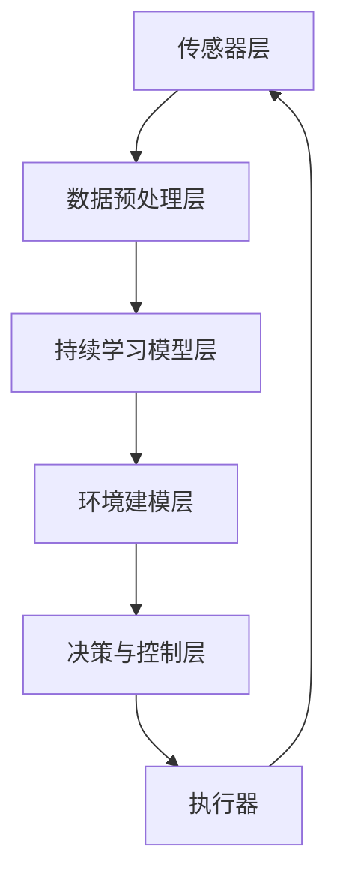

# 持续学习AI在动态环境感知中的应用

> 关键词：持续学习AI、动态环境感知、机器学习、人工智能、环境建模、自适应系统、智能决策

> 摘要：本文围绕持续学习AI在动态环境感知中的应用展开深入探讨。首先介绍了相关背景知识，包括目的范围、预期读者等内容。接着阐述了持续学习AI与动态环境感知的核心概念及其联系，详细讲解了核心算法原理和具体操作步骤，并辅以Python代码示例。同时，给出了相关的数学模型和公式，结合实例进行说明。通过项目实战，展示了代码实际案例并进行详细解释。探讨了持续学习AI在动态环境感知中的实际应用场景，推荐了相关的学习资源、开发工具框架以及论文著作。最后总结了未来发展趋势与挑战，提供了常见问题解答和扩展阅读参考资料，旨在为读者全面呈现持续学习AI在动态环境感知领域的重要性和应用潜力。

## 1. 背景介绍 
### 1.1 目的和范围
在当今复杂多变的世界中，许多领域都面临着动态环境的挑战，如自动驾驶、智能机器人、工业自动化等。这些环境中的信息不断变化，传统的机器学习模型往往难以适应这种动态性。持续学习AI作为一种新兴的技术，旨在使模型能够在不断变化的环境中持续学习新知识，同时保留之前所学的信息。本文的目的是深入探讨持续学习AI在动态环境感知中的应用，研究其原理、算法、实现方法以及实际应用场景，为相关领域的研究和开发提供理论支持和实践指导。

本文的范围涵盖了持续学习AI的基本概念、核心算法、数学模型，以及在动态环境感知中的具体应用案例。同时，还将介绍相关的学习资源、开发工具和研究成果，帮助读者全面了解和掌握这一领域的知识和技术。

### 1.2 预期读者
本文预期读者包括从事人工智能、机器学习、机器人技术、自动化控制等领域的研究人员、工程师和学生。对于希望了解持续学习AI在动态环境感知中应用的技术爱好者和专业人士，本文也具有一定的参考价值。

### 1.3 文档结构概述
本文共分为十个部分。第一部分为背景介绍，阐述了文章的目的、范围、预期读者和文档结构概述，并给出了术语表。第二部分介绍了持续学习AI与动态环境感知的核心概念及其联系，包括原理和架构的文本示意图以及Mermaid流程图。第三部分详细讲解了核心算法原理和具体操作步骤，通过Python源代码进行阐述。第四部分给出了相关的数学模型和公式，并进行详细讲解和举例说明。第五部分是项目实战，包括开发环境搭建、源代码详细实现和代码解读。第六部分探讨了持续学习AI在动态环境感知中的实际应用场景。第七部分推荐了相关的学习资源、开发工具框架和论文著作。第八部分总结了未来发展趋势与挑战。第九部分是附录，提供了常见问题与解答。第十部分给出了扩展阅读和参考资料。

### 1.4 术语表
#### 1.4.1 核心术语定义
- **持续学习AI（Continual Learning AI）**：也称为终身学习AI或增量学习AI，是指让人工智能系统能够在不断接收新数据的过程中持续学习，同时保留之前所学的知识和技能，避免灾难性遗忘。
- **动态环境感知（Dynamic Environment Perception）**：指系统能够实时感知和理解不断变化的环境信息，包括环境的状态、特征、变化趋势等。
- **灾难性遗忘（Catastrophic Forgetting）**：在传统机器学习中，当模型学习新任务时，往往会忘记之前学习的任务，导致性能下降，这种现象称为灾难性遗忘。
- **元学习（Meta - Learning）**：一种学习如何学习的方法，通过在多个任务上进行训练，使模型能够快速适应新任务。
- **强化学习（Reinforcement Learning）**：一种通过智能体与环境进行交互，根据环境反馈的奖励信号来学习最优策略的机器学习方法。

#### 1.4.2 相关概念解释
- **环境建模**：对动态环境进行抽象和表示，构建能够描述环境特征和变化规律的模型。
- **自适应系统**：能够根据环境变化自动调整自身行为和参数的系统。
- **智能决策**：基于环境感知信息，利用机器学习和优化算法做出最优决策的过程。

#### 1.4.3 缩略词列表
- **AI**：Artificial Intelligence（人工智能）
- **ML**：Machine Learning（机器学习）
- **DL**：Deep Learning（深度学习）
- **RL**：Reinforcement Learning（强化学习）
- **CL**：Continual Learning（持续学习）

## 2. 核心概念与联系 
### 核心概念原理
#### 持续学习AI原理
持续学习AI的核心目标是解决传统机器学习模型在面对新数据时的灾难性遗忘问题。传统的机器学习模型通常是在固定的数据集上进行训练，当遇到新的数据时，需要重新训练整个模型，这不仅效率低下，而且容易导致之前学习的知识被遗忘。持续学习AI通过引入一些特殊的机制，如记忆回放、参数正则化、元学习等，使得模型能够在学习新数据的同时，保留之前所学的知识。

例如，记忆回放机制会在模型学习新数据时，随机抽取之前学习过的数据进行回放，让模型重新学习这些数据，从而巩固之前的知识。参数正则化则是通过对模型的参数进行约束，使得模型在学习新数据时不会对之前的参数进行过大的修改，从而避免灾难性遗忘。

#### 动态环境感知原理
动态环境感知是指系统通过各种传感器（如摄像头、雷达、激光雷达等）获取环境信息，并对这些信息进行处理和分析，以理解环境的状态和变化趋势。在动态环境中，环境信息是不断变化的，因此需要系统具有实时处理和分析信息的能力。

动态环境感知通常包括数据采集、特征提取、目标检测、状态估计等步骤。数据采集是指通过传感器获取环境的原始数据，特征提取是从原始数据中提取出有意义的特征，目标检测是识别环境中的目标物体，状态估计是对环境的状态进行估计和预测。

### 架构的文本示意图
持续学习AI在动态环境感知中的应用架构可以分为以下几个部分：
1. **传感器层**：负责采集动态环境的原始数据，如视觉图像、雷达信号、激光雷达点云等。
2. **数据预处理层**：对传感器采集到的原始数据进行预处理，包括数据清洗、特征提取、归一化等操作，以提高数据的质量和可用性。
3. **持续学习模型层**：采用持续学习AI算法对预处理后的数据进行学习和训练，不断更新模型的参数，以适应动态环境的变化。
4. **环境建模层**：根据持续学习模型的输出，构建动态环境的模型，包括环境的状态、目标物体的位置和运动轨迹等。
5. **决策与控制层**：基于环境建模的结果，做出智能决策，并控制执行器（如机器人的关节、自动驾驶汽车的方向盘等）执行相应的动作。

### Mermaid流程图


## 3. 核心算法原理 & 具体操作步骤 
### 核心算法原理
#### 基于记忆回放的持续学习算法
基于记忆回放的持续学习算法是一种常用的持续学习方法。其基本思想是在模型学习新数据时，随机抽取之前学习过的数据进行回放，让模型重新学习这些数据，从而巩固之前的知识。

具体来说，该算法的步骤如下：
1. 初始化模型的参数。
2. 从新数据集中随机抽取一批数据。
3. 从记忆库中随机抽取一批之前学习过的数据。
4. 将新数据和回放数据合并成一个新的数据集。
5. 使用合并后的数据集对模型进行训练，更新模型的参数。
6. 将新数据添加到记忆库中。
7. 重复步骤2 - 6，直到学习过程结束。

#### 基于参数正则化的持续学习算法
基于参数正则化的持续学习算法通过对模型的参数进行约束，使得模型在学习新数据时不会对之前的参数进行过大的修改，从而避免灾难性遗忘。

具体来说，该算法在目标函数中添加一个正则化项，用于惩罚模型参数的变化。正则化项的形式通常为：

$$\mathcal{L}_{reg}=\lambda\sum_{i} \omega_{i}( \theta_{i}-\theta_{i}^{old})^{2}$$

其中，$\lambda$ 是正则化系数，$\omega_{i}$ 是每个参数的重要性权重，$\theta_{i}$ 是当前参数值，$\theta_{i}^{old}$ 是之前的参数值。

### 具体操作步骤及Python源代码
以下是一个基于记忆回放的持续学习算法的Python示例代码：

```python
import numpy as np
import torch
import torch.nn as nn
import torch.optim as optim

# 定义一个简单的神经网络模型
class SimpleModel(nn.Module):
    def __init__(self, input_size, hidden_size, output_size):
        super(SimpleModel, self).__init__()
        self.fc1 = nn.Linear(input_size, hidden_size)
        self.relu = nn.ReLU()
        self.fc2 = nn.Linear(hidden_size, output_size)

    def forward(self, x):
        out = self.fc1(x)
        out = self.relu(out)
        out = self.fc2(out)
        return out

# 初始化模型和优化器
input_size = 10
hidden_size = 20
output_size = 5
model = SimpleModel(input_size, hidden_size, output_size)
optimizer = optim.Adam(model.parameters(), lr=0.001)
criterion = nn.CrossEntropyLoss()

# 记忆库
memory_buffer = []

# 模拟新数据集
new_dataset = [torch.randn(1, input_size) for _ in range(100)]
new_labels = [torch.randint(0, output_size, (1,)) for _ in range(100)]

# 持续学习过程
num_epochs = 10
batch_size = 10
for epoch in range(num_epochs):
    for i in range(0, len(new_dataset), batch_size):
        # 从新数据集中抽取一批数据
        new_batch_data = torch.cat(new_dataset[i:i + batch_size], dim=0)
        new_batch_labels = torch.cat(new_labels[i:i + batch_size], dim=0)

        # 从记忆库中抽取一批回放数据
        if len(memory_buffer) > 0:
            indices = np.random.choice(len(memory_buffer), min(len(memory_buffer), batch_size), replace=False)
            replay_batch_data = torch.cat([memory_buffer[j][0] for j in indices], dim=0)
            replay_batch_labels = torch.cat([memory_buffer[j][1] for j in indices], dim=0)

            # 合并新数据和回放数据
            batch_data = torch.cat([new_batch_data, replay_batch_data], dim=0)
            batch_labels = torch.cat([new_batch_labels, replay_batch_labels], dim=0)
        else:
            batch_data = new_batch_data
            batch_labels = new_batch_labels

        # 前向传播
        outputs = model(batch_data)
        loss = criterion(outputs, batch_labels)

        # 反向传播和优化
        optimizer.zero_grad()
        loss.backward()
        optimizer.step()

        # 将新数据添加到记忆库中
        for j in range(len(new_batch_data)):
            memory_buffer.append((new_batch_data[j].unsqueeze(0), new_batch_labels[j].unsqueeze(0)))

    print(f'Epoch {epoch + 1}/{num_epochs}, Loss: {loss.item()}')
```

## 4. 数学模型和公式 & 详细讲解 & 举例说明 
### 基于参数正则化的持续学习数学模型
在基于参数正则化的持续学习算法中，目标函数通常由两部分组成：原始的损失函数 $\mathcal{L}_{task}$ 和正则化项 $\mathcal{L}_{reg}$。

$$\mathcal{L}=\mathcal{L}_{task}+\mathcal{L}_{reg}$$

其中，$\mathcal{L}_{task}$ 是用于衡量模型在当前任务上的性能的损失函数，例如交叉熵损失函数、均方误差损失函数等。$\mathcal{L}_{reg}$ 是用于惩罚模型参数变化的正则化项，其形式为：

$$\mathcal{L}_{reg}=\lambda\sum_{i} \omega_{i}( \theta_{i}-\theta_{i}^{old})^{2}$$

- **详细讲解**：
  - $\lambda$ 是正则化系数，用于控制正则化项的权重。$\lambda$ 越大，模型在学习新数据时对之前参数的变化就越敏感，越不容易忘记之前的知识；$\lambda$ 越小，模型对新数据的适应性就越强，但可能会导致灾难性遗忘。
  - $\omega_{i}$ 是每个参数的重要性权重，用于表示每个参数在之前任务中的重要程度。通常，$\omega_{i}$ 可以通过计算参数的Fisher信息矩阵来估计。
  - $\theta_{i}$ 是当前参数值，$\theta_{i}^{old}$ 是之前的参数值。正则化项的作用是使得模型在学习新数据时，参数的变化不会太大，从而保留之前的知识。

### 举例说明
假设我们有一个简单的线性回归模型 $y = \theta_{1}x+\theta_{2}$，其中 $\theta_{1}$ 和 $\theta_{2}$ 是模型的参数。在学习第一个任务时，模型的参数已经收敛到 $\theta_{1}^{old}=2$ 和 $\theta_{2}^{old}=1$。现在我们要学习一个新任务，原始的损失函数为 $\mathcal{L}_{task}=\frac{1}{n}\sum_{i = 1}^{n}(y_{i}-(\theta_{1}x_{i}+\theta_{2}))^{2}$，正则化项为 $\mathcal{L}_{reg}=\lambda(\omega_{1}(\theta_{1}-\theta_{1}^{old})^{2}+\omega_{2}(\theta_{2}-\theta_{2}^{old})^{2})$。

假设 $\lambda = 0.1$，$\omega_{1}=1$，$\omega_{2}=1$，则目标函数为：

$$\mathcal{L}=\frac{1}{n}\sum_{i = 1}^{n}(y_{i}-(\theta_{1}x_{i}+\theta_{2}))^{2}+0.1((\theta_{1}-2)^{2}+(\theta_{2}-1)^{2})$$

在训练过程中，模型会在最小化原始损失函数的同时，尽量保持参数 $\theta_{1}$ 和 $\theta_{2}$ 接近之前的值 $2$ 和 $1$，从而避免灾难性遗忘。

## 5. 项目实战：代码实际案例和详细解释说明 
### 5.1  开发环境搭建
#### 硬件环境
- **处理器**：Intel Core i7 及以上或 AMD Ryzen 7 及以上
- **内存**：16GB 及以上
- **显卡**：NVIDIA GeForce GTX 1080 及以上（可选，用于加速深度学习训练）

#### 软件环境
- **操作系统**：Ubuntu 18.04 及以上或 Windows 10 及以上
- **Python**：3.7 及以上
- **深度学习框架**：PyTorch 1.7 及以上

#### 安装步骤
1. 安装 Python：可以从 Python 官方网站（https://www.python.org/downloads/）下载并安装 Python。
2. 安装 PyTorch：根据自己的显卡和操作系统选择合适的安装命令，例如在 Ubuntu 系统上使用以下命令安装：

```bash
pip install torch torchvision torchaudio
```

### 5.2  源代码详细实现和代码解读
以下是一个更完整的持续学习AI在动态环境感知中的项目实战代码示例，假设我们要实现一个简单的机器人在动态环境中进行目标检测和导航的任务。

```python
import torch
import torch.nn as nn
import torch.optim as optim
import numpy as np
import random

# 定义一个简单的卷积神经网络用于目标检测
class ObjectDetectionModel(nn.Module):
    def __init__(self, num_classes):
        super(ObjectDetectionModel, self).__init__()
        self.conv1 = nn.Conv2d(3, 16, kernel_size=3, padding=1)
        self.relu1 = nn.ReLU()
        self.pool1 = nn.MaxPool2d(2)
        self.conv2 = nn.Conv2d(16, 32, kernel_size=3, padding=1)
        self.relu2 = nn.ReLU()
        self.pool2 = nn.MaxPool2d(2)
        self.fc1 = nn.Linear(32 * 56 * 56, 128)
        self.relu3 = nn.ReLU()
        self.fc2 = nn.Linear(128, num_classes)

    def forward(self, x):
        x = self.pool1(self.relu1(self.conv1(x)))
        x = self.pool2(self.relu2(self.conv2(x)))
        x = x.view(-1, 32 * 56 * 56)
        x = self.relu3(self.fc1(x))
        x = self.fc2(x)
        return x

# 记忆库
class MemoryBuffer:
    def __init__(self, capacity):
        self.capacity = capacity
        self.buffer = []

    def add(self, data, label):
        if len(self.buffer) >= self.capacity:
            self.buffer.pop(0)
        self.buffer.append((data, label))

    def sample(self, batch_size):
        if len(self.buffer) < batch_size:
            batch_size =