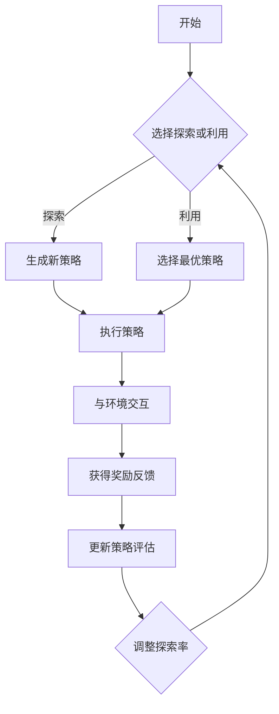

# 探索与利用平衡:AI训练的艺术

> 关键词：探索与利用平衡、AI训练、多臂老虎机、强化学习、算法原理、实际应用

> 摘要：本文深入探讨了AI训练中探索与利用平衡这一核心问题。首先介绍了相关背景知识，包括目的范围、预期读者等。接着详细阐述了探索与利用的核心概念及联系，给出了原理和架构的文本示意图与Mermaid流程图。通过Python代码详细讲解了核心算法原理和具体操作步骤，同时给出了相关数学模型和公式，并举例说明。在项目实战部分，进行了开发环境搭建，给出源代码实现及详细解读。还探讨了实际应用场景，推荐了学习资源、开发工具框架和相关论文著作。最后总结了未来发展趋势与挑战，提供了常见问题解答和扩展阅读参考资料，旨在帮助读者全面理解和掌握AI训练中探索与利用平衡的艺术。

## 1. 背景介绍 
### 1.1 目的和范围
在人工智能（AI）训练的过程中，探索与利用平衡是一个至关重要的问题。探索意味着尝试新的策略、行为或状态，以发现更多的信息和潜在的最优解；而利用则是基于已有的经验和知识，选择当前看起来最优的策略。本文章的目的在于深入剖析探索与利用平衡的概念、原理、算法以及实际应用，涵盖了从理论基础到项目实战的多个方面，帮助读者全面理解和掌握这一关键技术在AI训练中的应用。

### 1.2 预期读者
本文预期读者包括人工智能领域的初学者、研究人员、开发人员以及对AI训练技术感兴趣的专业人士。对于初学者，文章提供了详细的概念解释和基础算法的实现，有助于他们建立起对探索与利用平衡的初步认识；对于研究人员，深入的理论分析和最新的研究成果推荐可以为他们的研究提供参考；对于开发人员，项目实战部分的代码实现和解读可以帮助他们将相关技术应用到实际项目中。

### 1.3 文档结构概述
本文将按照以下结构进行组织：首先介绍探索与利用平衡的背景知识，包括目的、预期读者和文档结构；接着阐述核心概念与联系，给出相关原理和架构的示意图；然后详细讲解核心算法原理和具体操作步骤，并给出Python代码实现；之后介绍数学模型和公式，并举例说明；在项目实战部分，进行开发环境搭建，给出源代码实现及详细解读；接着探讨实际应用场景；再推荐相关的学习资源、开发工具框架和论文著作；最后总结未来发展趋势与挑战，提供常见问题解答和扩展阅读参考资料。

### 1.4 术语表
#### 1.4.1 核心术语定义
- **探索（Exploration）**：在AI训练中，探索是指尝试新的行为、策略或状态，以获取更多的信息和知识，发现潜在的最优解。
- **利用（Exploitation）**：利用是指基于已有的经验和知识，选择当前看起来最优的策略，以最大化当前的收益。
- **多臂老虎机（Multi - Armed Bandit）**：一种经典的用于研究探索与利用平衡问题的模型，假设有多个老虎机，每个老虎机有不同的奖励分布，玩家需要在有限的尝试次数内选择最优的老虎机以获得最大的总奖励。
- **强化学习（Reinforcement Learning）**：一种机器学习范式，智能体通过与环境进行交互，根据环境反馈的奖励信号来学习最优的行为策略。

#### 1.4.2 相关概念解释
- **探索率（Exploration Rate）**：在强化学习中，探索率是指智能体选择探索行为的概率。较高的探索率意味着智能体更倾向于尝试新的行为，而较低的探索率则表示智能体更倾向于利用已有的经验。
- **奖励（Reward）**：在强化学习中，奖励是环境给予智能体的反馈信号，用于表示智能体的行为在当前状态下的好坏程度。智能体的目标是通过学习最优的策略来最大化长期累积奖励。

#### 1.4.3 缩略词列表
- **RL**：Reinforcement Learning，强化学习
- **MAB**：Multi - Armed Bandit，多臂老虎机

## 2. 核心概念与联系 

### 核心概念原理
探索与利用平衡的核心思想是在AI训练过程中，如何在尝试新的策略以发现更好的解决方案（探索）和利用已有的经验以获得当前最大收益（利用）之间找到一个合适的平衡点。在实际应用中，如果只进行探索而不利用已有的信息，可能会导致大量的时间和资源浪费在无意义的尝试上；而如果只进行利用，可能会陷入局部最优解，错过更优的解决方案。

以多臂老虎机问题为例，假设有 $n$ 个老虎机，每个老虎机的奖励服从不同的概率分布。玩家每选择一个老虎机进行一次尝试，就会得到一个随机的奖励。玩家的目标是在有限的尝试次数内，选择最优的老虎机以获得最大的总奖励。在这个问题中，玩家需要在尝试不同的老虎机以了解它们的奖励分布（探索）和选择当前看起来奖励最高的老虎机（利用）之间进行权衡。

### 架构的文本示意图
```plaintext
AI训练系统
├── 探索模块
│   ├── 新策略生成
│   ├── 状态空间搜索
├── 利用模块
│   ├── 最优策略选择
│   ├── 已有经验应用
├── 环境交互
│   ├── 行为执行
│   ├── 奖励反馈
├── 平衡机制
│   ├── 探索率调整
│   ├── 策略评估与更新
```

### Mermaid流程图


## 3. 核心算法原理 & 具体操作步骤 

### ε - 贪心算法原理
ε - 贪心算法是一种简单而常用的用于解决探索与利用平衡问题的算法。该算法的核心思想是在每次决策时，以概率 $\epsilon$ 进行探索（随机选择一个策略），以概率 $1 - \epsilon$ 进行利用（选择当前最优的策略）。

### Python源代码实现
```python
import numpy as np

class EpsilonGreedy:
    def __init__(self, num_arms, epsilon=0.1):
        self.num_arms = num_arms
        self.epsilon = epsilon
        self.reward_sum = np.zeros(num_arms)
        self.num_pulls = np.zeros(num_arms)

    def select_arm(self):
        if np.random.rand() < self.epsilon:
            # 探索：随机选择一个手臂
            return np.random.randint(self.num_arms)
        else:
            # 利用：选择平均奖励最高的手臂
            average_rewards = self.reward_sum / (self.num_pulls + 1e-6)
            return np.argmax(average_rewards)

    def update(self, arm, reward):
        self.reward_sum[arm] += reward
        self.num_pulls[arm] += 1


# 示例使用
num_arms = 5
epsilon = 0.1
agent = EpsilonGreedy(num_arms, epsilon)

for i in range(100):
    arm = agent.select_arm()
    # 模拟奖励
    reward = np.random.randn()
    agent.update(arm, reward)
    print(f"Step {i}: Selected arm {arm}, Reward: {reward}")
```

### 具体操作步骤
1. **初始化**：初始化每个老虎机的奖励总和和尝试次数为0，设置探索率 $\epsilon$。
2. **选择动作**：在每次决策时，生成一个随机数 $r$，如果 $r < \epsilon$，则随机选择一个老虎机进行尝试（探索）；否则，选择当前平均奖励最高的老虎机进行尝试（利用）。
3. **获得奖励**：执行选择的动作，从环境中获得相应的奖励。
4. **更新信息**：根据获得的奖励，更新所选老虎机的奖励总和和尝试次数。
5. **重复步骤2 - 4**：不断重复上述步骤，直到达到预设的尝试次数。

## 4. 数学模型和公式 & 详细讲解 & 举例说明 

### 多臂老虎机的数学模型
多臂老虎机问题可以用以下数学模型来描述：假设有 $K$ 个老虎机，每个老虎机 $i$ 的奖励 $R_i$ 服从一个未知的概率分布 $P(R_i)$。玩家在每一轮 $t$ 选择一个老虎机 $A_t \in \{1, 2, \cdots, K\}$ 进行尝试，获得奖励 $R_{A_t}$。玩家的目标是在 $T$ 轮尝试内，最大化累积奖励 $G_T = \sum_{t = 1}^{T} R_{A_t}$。

### ε - 贪心算法的数学公式
- **探索概率**：在每一轮 $t$，以概率 $\epsilon$ 进行探索，即随机选择一个老虎机 $A_t$ 的概率为 $\frac{1}{K}$。
- **利用概率**：以概率 $1 - \epsilon$ 进行利用，选择当前平均奖励最高的老虎机。设 $\hat{Q}_i(t)$ 表示到第 $t$ 轮为止，老虎机 $i$ 的平均奖励，则 $\hat{Q}_i(t)=\frac{\sum_{s = 1}^{t} I(A_s = i)R_{A_s}}{\sum_{s = 1}^{t} I(A_s = i)}$，其中 $I(\cdot)$ 是指示函数。选择的老虎机 $A_t=\arg\max_{i = 1}^{K}\hat{Q}_i(t)$。

### 举例说明
假设我们有3个老虎机，它们的奖励分布分别为：
- 老虎机1：奖励服从均值为0.2，标准差为0.1的正态分布。
- 老虎机2：奖励服从均值为0.5，标准差为0.2的正态分布。
- 老虎机3：奖励服从均值为0.1，标准差为0.15的正态分布。

我们使用 ε - 贪心算法进行100轮尝试，设置 $\epsilon = 0.1$。在开始时，由于我们对每个老虎机的奖励分布了解较少，算法会以一定的概率（$\epsilon = 0.1$）随机选择老虎机进行探索。随着尝试次数的增加，我们对每个老虎机的平均奖励有了更准确的估计，算法会更倾向于选择平均奖励较高的老虎机（利用）。例如，在某一轮中，如果老虎机2的平均奖励最高，且随机数 $r > \epsilon$，则算法会选择老虎机2进行尝试。

## 5. 项目实战：代码实际案例和详细解释说明 

### 5.1  开发环境搭建
#### 安装Python
首先，确保你已经安装了Python。可以从Python官方网站（https://www.python.org/downloads/）下载并安装适合你操作系统的Python版本。建议使用Python 3.6及以上版本。

#### 安装必要的库
本项目主要使用了 `numpy` 库，用于数值计算。可以使用以下命令安装 `numpy`：
```sh
pip install numpy
```

### 5.2  源代码详细实现和代码解读
```python
import numpy as np

class EpsilonGreedy:
    def __init__(self, num_arms, epsilon=0.1):
        """
        初始化函数
        :param num_arms: 老虎机的数量
        :param epsilon: 探索率
        """
        self.num_arms = num_arms
        self.epsilon = epsilon
        # 初始化每个老虎机的奖励总和为0
        self.reward_sum = np.zeros(num_arms)
        # 初始化每个老虎机的尝试次数为0
        self.num_pulls = np.zeros(num_arms)

    def select_arm(self):
        """
        选择一个老虎机进行尝试
        :return: 所选老虎机的索引
        """
        if np.random.rand() < self.epsilon:
            # 探索：随机选择一个老虎机
            return np.random.randint(self.num_arms)
        else:
            # 利用：选择平均奖励最高的老虎机
            average_rewards = self.reward_sum / (self.num_pulls + 1e-6)
            return np.argmax(average_rewards)

    def update(self, arm, reward):
        """
        根据获得的奖励更新所选老虎机的信息
        :param arm: 所选老虎机的索引
        :param reward: 获得的奖励
        """
        self.reward_sum[arm] += reward
        self.num_pulls[arm] += 1


# 示例使用
num_arms = 5
epsilon = 0.1
agent = EpsilonGreedy(num_arms, epsilon)

# 模拟100轮尝试
for i in range(100):
    arm = agent.select_arm()
    # 模拟奖励，这里使用正态分布生成随机奖励
    reward = np.random.randn()
    agent.update(arm, reward)
    print(f"Step {i}: Selected arm {arm}, Reward: {reward}")
```

### 代码解读与分析
- **`__init__` 方法**：初始化函数，接受老虎机的数量 `num_arms` 和探索率 `epsilon` 作为参数。初始化每个老虎机的奖励总和 `reward_sum` 和尝试次数 `num_pulls` 为0。
- **`select_arm` 方法**：根据 ε - 贪心算法选择一个老虎机进行尝试。如果随机数小于探索率 $\epsilon$，则随机选择一个老虎机；否则，选择当前平均奖励最高的老虎机。
- **`update` 方法**：根据获得的奖励更新所选老虎机的奖励总和和尝试次数。
- **主程序**：创建一个 `EpsilonGreedy` 类的实例，模拟100轮尝试。在每一轮中，选择一个老虎机进行尝试，获得随机奖励，并更新相应的信息。最后打印出每一轮的选择和奖励。

## 6. 实际应用场景 
### 广告投放
在广告投放中，探索与利用平衡起着重要的作用。广告平台需要在尝试不同的广告策略（探索）以找到最有效的广告组合和利用已有的数据选择当前表现最好的广告（利用）之间进行权衡。例如，平台可以通过 ε - 贪心算法，以一定的概率尝试新的广告形式、投放位置或目标受众（探索），以发现潜在的更优广告策略；同时，以较大的概率选择当前点击率或转化率最高的广告进行投放（利用），以最大化广告收益。

### 药物研发
在药物研发过程中，研究人员需要在尝试不同的药物配方和治疗方案（探索）以发现更有效的药物和利用已有的临床试验数据选择当前最有希望的药物（利用）之间找到平衡。通过使用探索与利用算法，研究人员可以更合理地分配研发资源，提高药物研发的效率和成功率。

### 游戏AI
在游戏AI中，智能体需要在探索游戏环境和利用已有的游戏经验之间进行权衡。例如，在策略游戏中，智能体可以在游戏初期尝试不同的策略和战术（探索），以了解游戏的各种可能性；在游戏后期，根据已有的经验选择最优的策略进行游戏（利用），以提高获胜的概率。

## 7. 工具和资源推荐
### 7.1 学习资源推荐
#### 7.1.1 书籍推荐
- 《强化学习：原理与Python实现》：这本书详细介绍了强化学习的基本原理和算法，并提供了大量的Python代码示例，适合初学者学习强化学习和探索与利用平衡的相关知识。
- 《多臂老虎机算法及其应用》：专门针对多臂老虎机问题进行了深入的研究和介绍，涵盖了各种多臂老虎机算法的原理、分析和应用，是学习探索与利用平衡的重要参考书籍。

#### 7.1.2 在线课程
- Coursera上的“强化学习专项课程”：由知名教授授课，系统地介绍了强化学习的理论和实践，包括探索与利用平衡的相关内容。
- edX上的“多臂老虎机和上下文老虎机”：该课程专注于多臂老虎机和上下文老虎机的研究，提供了丰富的案例和代码实现，有助于学习者深入理解探索与利用平衡问题。

#### 7.1.3 技术博客和网站
- OpenAI博客：OpenAI是人工智能领域的知名研究机构，其博客上经常发布关于强化学习和探索与利用平衡的最新研究成果和技术文章。
- Medium上的“强化学习”专栏：汇集了众多强化学习领域的专家和爱好者分享的文章，涵盖了探索与利用平衡的各种应用场景和算法实现。

### 7.2 开发工具框架推荐
#### 7.2.1 IDE和编辑器
- PyCharm：一款功能强大的Python集成开发环境，提供了丰富的代码编辑、调试和项目管理功能，适合开发基于Python的强化学习项目。
- Jupyter Notebook：一种交互式的开发环境，支持代码、文本和可视化的混合展示，非常适合进行数据探索和算法实验。

#### 7.2.2 调试和性能分析工具
- TensorBoard：TensorFlow提供的可视化工具，可以帮助开发者监控和分析强化学习模型的训练过程，包括奖励曲线、策略变化等。
- cProfile：Python内置的性能分析工具，可以帮助开发者找出代码中的性能瓶颈，优化算法的执行效率。

#### 7.2.3 相关框架和库
- OpenAI Gym：一个开源的强化学习环境库，提供了各种经典的强化学习环境，如多臂老虎机、迷宫游戏等，方便开发者进行算法测试和验证。
- Stable Baselines：一个基于TensorFlow和PyTorch的强化学习库，提供了多种成熟的强化学习算法实现，包括用于解决探索与利用平衡问题的算法。

### 7.3 相关论文著作推荐
#### 7.3.1 经典论文
- “A Tutorial on Thompson Sampling”：详细介绍了Thompson采样算法，这是一种用于解决探索与利用平衡问题的经典算法，具有良好的理论性能和实际应用效果。
- “Finite-time Analysis of the Multiarmed Bandit Problem”：对多臂老虎机问题进行了深入的理论分析，给出了各种算法的有限时间性能界，为算法的设计和分析提供了重要的理论基础。

#### 7.3.2 最新研究成果
- 近年来，随着人工智能技术的不断发展，关于探索与利用平衡的研究也在不断深入。可以关注NeurIPS、ICML、AAAI等顶级人工智能会议上的相关论文，了解最新的研究成果和技术趋势。

#### 7.3.3 应用案例分析
- 许多实际应用领域都有关于探索与利用平衡的成功案例。可以查阅相关领域的学术期刊和会议论文，如市场营销领域的广告投放优化、医疗领域的药物研发等，了解探索与利用平衡在实际应用中的具体实现和效果。

## 8. 总结：未来发展趋势与挑战
### 未来发展趋势
- **与深度学习的融合**：随着深度学习技术的不断发展，将探索与利用平衡算法与深度学习模型相结合，有望在更复杂的任务和环境中取得更好的性能。例如，在图像识别、自然语言处理等领域，通过强化学习和探索与利用平衡算法来优化深度学习模型的训练过程。
- **多智能体系统中的应用**：在多智能体系统中，探索与利用平衡问题变得更加复杂。未来的研究将关注如何在多个智能体之间协调探索和利用行为，以实现全局最优的目标。例如，在自动驾驶、机器人协作等领域，多个智能体需要在相互协作的同时，合理地进行探索和利用。
- **自适应探索策略**：传统的探索策略往往采用固定的探索率，难以适应环境的动态变化。未来的研究将致力于开发自适应的探索策略，根据环境的反馈和智能体的学习状态动态调整探索率，以提高探索的效率和效果。

### 挑战
- **高维状态空间和动作空间**：在实际应用中，许多问题的状态空间和动作空间非常大，这给探索与利用平衡带来了巨大的挑战。如何在高维空间中有效地进行探索和利用，是未来需要解决的重要问题。
- **非平稳环境**：现实世界中的环境往往是非平稳的，即环境的状态和奖励分布会随时间发生变化。在非平稳环境中，传统的探索与利用算法可能会失效，需要开发能够适应环境变化的算法。
- **计算资源和时间成本**：一些复杂的探索与利用算法需要大量的计算资源和时间来训练和优化。如何在有限的计算资源和时间内实现高效的探索和利用，是实际应用中面临的一个重要挑战。

## 9. 附录：常见问题与解答
### 问题1：为什么需要在AI训练中进行探索与利用平衡？
答：在AI训练中，如果只进行探索，可能会浪费大量的时间和资源在无意义的尝试上；而如果只进行利用，可能会陷入局部最优解，错过更优的解决方案。因此，需要在探索和利用之间找到一个合适的平衡点，以在有限的资源和时间内找到最优的解决方案。

### 问题2：ε - 贪心算法的探索率应该如何选择？
答：探索率的选择需要根据具体的问题和环境来确定。一般来说，在训练初期，由于对环境的了解较少，可以选择较高的探索率，以便快速地探索环境和发现潜在的最优解；在训练后期，随着对环境的了解逐渐增加，可以逐渐降低探索率，以更多地利用已有的经验。常见的做法是使用衰减的探索率，即随着训练的进行，探索率逐渐减小。

### 问题3：除了 ε - 贪心算法，还有哪些常用的探索与利用算法？
答：除了 ε - 贪心算法，常用的探索与利用算法还包括Thompson采样算法、上置信界（UCB）算法等。Thompson采样算法通过对每个动作的奖励分布进行采样，根据采样结果选择动作，具有较好的理论性能和实际应用效果；上置信界算法则通过计算每个动作的上置信界，选择上置信界最大的动作进行尝试，能够在一定程度上平衡探索和利用。

## 10. 扩展阅读 & 参考资料
### 扩展阅读
- 《强化学习精要：核心算法与TensorFlow实现》：深入介绍了强化学习的核心算法和实现方法，包括探索与利用平衡的相关内容，适合有一定基础的读者进一步学习。
- 《人工智能：一种现代的方法》：经典的人工智能教材，涵盖了人工智能的各个领域，包括强化学习和探索与利用平衡的基本概念和算法。

### 参考资料
- Sutton, R. S., & Barto, A. G. (2018). Reinforcement Learning: An Introduction. MIT press.
- Russo, D. J., Van Roy, B., Kazerouni, A., Osband, I., & Wen, Z. (2018). A tutorial on Thompson Sampling. Foundations and Trends® in Machine Learning, 11(1), 1-96.
- Auer, P., Cesa - Bianchi, N., & Fischer, P. (2002). Finite - time analysis of the multiarmed bandit problem. Machine learning, 47(2 - 3), 235 - 256.

作者：AI天才研究院/AI Genius Institute & 禅与计算机程序设计艺术 /Zen And The Art of Computer Programming