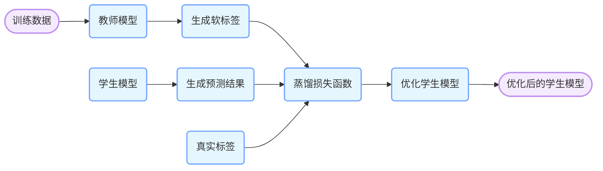

# 推理任务中的知识蒸馏技术应用

> 关键词：推理任务、知识蒸馏技术、模型压缩、知识迁移、深度学习

> 摘要：本文聚焦于推理任务中的知识蒸馏技术应用。首先介绍了知识蒸馏技术的背景，包括其目的、适用范围、预期读者等。详细阐述了知识蒸馏的核心概念与联系，给出原理和架构的示意图与流程图。深入讲解了核心算法原理，通过Python代码示例说明具体操作步骤，并辅以数学模型和公式进行理论支持。结合实际项目，展示了知识蒸馏在推理任务中的代码实现与解读。探讨了其在不同领域的实际应用场景，推荐了学习该技术的相关工具和资源。最后总结了知识蒸馏技术的未来发展趋势与挑战，解答了常见问题，并提供了扩展阅读和参考资料，旨在为读者全面呈现知识蒸馏技术在推理任务中的应用全貌。

## 1. 背景介绍 
### 1.1 目的和范围
在深度学习领域，随着模型复杂度的不断增加，大型模型在各种任务中展现出了卓越的性能。然而，这些模型往往具有大量的参数和复杂的结构，导致在推理阶段需要消耗大量的计算资源和时间，这在一些资源受限的场景下，如移动设备、嵌入式系统等，成为了应用的瓶颈。知识蒸馏技术应运而生，其目的是将大型复杂模型（教师模型）所学到的知识迁移到小型简单模型（学生模型）中，使得学生模型在保持较高性能的同时，降低计算成本和模型大小，从而能够更高效地应用于推理任务。

本文的范围涵盖了知识蒸馏技术的基本概念、核心算法、数学原理、实际应用案例以及相关的工具和资源推荐，旨在为读者提供一个全面且深入的关于推理任务中知识蒸馏技术应用的指南。

### 1.2 预期读者
本文预期读者包括对深度学习、机器学习领域感兴趣的研究人员、工程师和学生。对于正在从事模型压缩、优化推理效率相关工作的专业人士，本文将提供详细的技术原理和实践经验；对于初学者，本文将从基础概念入手，逐步引导读者理解知识蒸馏技术在推理任务中的应用。

### 1.3 文档结构概述
本文将按照以下结构进行组织：
- 核心概念与联系：介绍知识蒸馏的基本概念、原理和架构，通过文本示意图和Mermaid流程图进行直观展示。
- 核心算法原理 & 具体操作步骤：详细讲解知识蒸馏的核心算法，使用Python源代码阐述具体操作过程。
- 数学模型和公式 & 详细讲解 & 举例说明：给出知识蒸馏的数学模型和公式，并通过具体例子进行详细解释。
- 项目实战：代码实际案例和详细解释说明：通过一个实际项目，展示知识蒸馏在推理任务中的代码实现和详细解读。
- 实际应用场景：探讨知识蒸馏技术在不同领域的实际应用场景。
- 工具和资源推荐：推荐学习知识蒸馏技术的相关工具、框架和资源。
- 总结：未来发展趋势与挑战：总结知识蒸馏技术的发展趋势和面临的挑战。
- 附录：常见问题与解答：解答读者在学习和应用知识蒸馏技术过程中常见的问题。
- 扩展阅读 & 参考资料：提供进一步学习和研究的扩展阅读材料和参考资料。

### 1.4 术语表
#### 1.4.1 核心术语定义
- **知识蒸馏（Knowledge Distillation）**：一种模型压缩和知识迁移技术，通过将教师模型的知识传递给学生模型，使学生模型能够在保持较高性能的同时减少模型参数和计算量。
- **教师模型（Teacher Model）**：通常是一个大型、复杂且性能优越的模型，它在训练数据上进行学习并掌握了丰富的知识，用于向学生模型传递知识。
- **学生模型（Student Model）**：一个小型、简单的模型，通过知识蒸馏技术从教师模型中学习知识，以达到接近教师模型的性能。
- **软标签（Soft Labels）**：教师模型输出的概率分布，包含了比硬标签（类别标签）更多的信息，用于指导学生模型的学习。
- **硬标签（Hard Labels）**：数据的真实类别标签，通常是一个独热编码向量。

#### 1.4.2 相关概念解释
- **模型压缩**：通过各种技术手段减少模型的参数数量和计算量，以提高模型的推理效率和降低存储需求。知识蒸馏是模型压缩的一种有效方法。
- **知识迁移**：将一个模型所学到的知识传递给另一个模型的过程。知识蒸馏通过软标签的方式实现了从教师模型到学生模型的知识迁移。

#### 1.4.3 缩略词列表
- **MLP**：多层感知机（Multilayer Perceptron）
- **CNN**：卷积神经网络（Convolutional Neural Network）
- **DNN**：深度神经网络（Deep Neural Network）

## 2. 核心概念与联系 
知识蒸馏的核心思想是让学生模型学习教师模型的输出，而不仅仅是学习训练数据的真实标签。教师模型的输出是一个概率分布，称为软标签，它包含了比硬标签更多的信息。通过最小化学生模型的输出与教师模型的软标签之间的差异，学生模型可以学习到教师模型所学到的知识。

### 知识蒸馏原理和架构的文本示意图
```plaintext
+------------------+          +------------------+
|   教师模型       |          |   学生模型       |
|  (大型复杂模型)  |          |  (小型简单模型)  |
+------------------+          +------------------+
        |                            |
        |  输出软标签                |  输出预测结果
        |                            |
+------------------+          +------------------+
|  蒸馏损失函数    |          |  训练数据         |
|  (最小化差异)    |          |  (真实标签)       |
+------------------+          +------------------+
        |                            |
        |                            |
        +----------------------------+
                      |
                      |  优化学生模型
                      v
              +------------------+
              |  优化后的学生模型  |
              +------------------+
```

### Mermaid流程图


在这个流程中，训练数据首先输入到教师模型中，教师模型生成软标签。同时，学生模型对训练数据进行预测，生成预测结果。蒸馏损失函数计算学生模型的预测结果与教师模型的软标签以及真实标签之间的差异，通过优化算法更新学生模型的参数，最终得到优化后的学生模型。

## 3. 核心算法原理 & 具体操作步骤 
### 核心算法原理
知识蒸馏的核心算法基于最小化蒸馏损失函数。蒸馏损失函数通常由两部分组成：软标签损失和硬标签损失。软标签损失用于衡量学生模型的输出与教师模型的软标签之间的差异，硬标签损失用于衡量学生模型的输出与训练数据的真实标签之间的差异。

蒸馏损失函数的公式如下：
$$
L_{distillation} = \alpha \cdot L_{soft} + (1 - \alpha) \cdot L_{hard}
$$
其中，$L_{distillation}$ 是蒸馏损失函数，$L_{soft}$ 是软标签损失，$L_{hard}$ 是硬标签损失，$\alpha$ 是一个超参数，用于控制软标签损失和硬标签损失的权重。

常见的软标签损失函数是KL散度（Kullback-Leibler Divergence），它衡量两个概率分布之间的差异。硬标签损失函数通常使用交叉熵损失（Cross-Entropy Loss）。

### 具体操作步骤
以下是使用Python和PyTorch实现知识蒸馏的具体操作步骤：

```python
import torch
import torch.nn as nn
import torch.optim as optim

# 定义教师模型和学生模型
class TeacherModel(nn.Module):
    def __init__(self):
        super(TeacherModel, self).__init__()
        self.fc1 = nn.Linear(10, 20)
        self.relu = nn.ReLU()
        self.fc2 = nn.Linear(20, 5)

    def forward(self, x):
        x = self.fc1(x)
        x = self.relu(x)
        x = self.fc2(x)
        return x

class StudentModel(nn.Module):
    def __init__(self):
        super(StudentModel, self).__init__()
        self.fc1 = nn.Linear(10, 10)
        self.relu = nn.ReLU()
        self.fc2 = nn.Linear(10, 5)

    def forward(self, x):
        x = self.fc1(x)
        x = self.relu(x)
        x = self.fc2(x)
        return x

# 初始化模型
teacher_model = TeacherModel()
student_model = StudentModel()

# 定义损失函数和优化器
soft_loss_fn = nn.KLDivLoss(reduction='batchmean')
hard_loss_fn = nn.CrossEntropyLoss()
optimizer = optim.Adam(student_model.parameters(), lr=0.001)

# 超参数
alpha = 0.5
temperature = 2.0

# 模拟训练数据
num_samples = 100
input_data = torch.randn(num_samples, 10)
target_labels = torch.randint(0, 5, (num_samples,))

# 训练学生模型
num_epochs = 10
for epoch in range(num_epochs):
    optimizer.zero_grad()

    # 教师模型输出软标签
    with torch.no_grad():
        teacher_output = teacher_model(input_data)
        teacher_soft_labels = nn.functional.softmax(teacher_output / temperature, dim=1)

    # 学生模型输出预测结果
    student_output = student_model(input_data)
    student_soft_preds = nn.functional.log_softmax(student_output / temperature, dim=1)

    # 计算软标签损失
    soft_loss = soft_loss_fn(student_soft_preds, teacher_soft_labels) * (temperature ** 2)

    # 计算硬标签损失
    hard_loss = hard_loss_fn(student_output, target_labels)

    # 计算蒸馏损失
    distillation_loss = alpha * soft_loss + (1 - alpha) * hard_loss

    # 反向传播和优化
    distillation_loss.backward()
    optimizer.step()

    print(f'Epoch {epoch+1}/{num_epochs}, Loss: {distillation_loss.item()}')
```

### 代码解释
1. **定义教师模型和学生模型**：分别定义了一个简单的多层感知机作为教师模型和学生模型。
2. **初始化模型、损失函数和优化器**：使用 `nn.KLDivLoss` 作为软标签损失函数，`nn.CrossEntropyLoss` 作为硬标签损失函数，`Adam` 作为优化器。
3. **模拟训练数据**：生成随机的输入数据和目标标签。
4. **训练学生模型**：在每个epoch中，首先让教师模型生成软标签，然后让学生模型生成预测结果。计算软标签损失和硬标签损失，加权求和得到蒸馏损失。最后进行反向传播和参数更新。

## 4. 数学模型和公式 & 详细讲解 & 举例说明 
### 数学模型和公式
#### 软标签损失（KL散度）
KL散度用于衡量两个概率分布 $P$ 和 $Q$ 之间的差异，其公式如下：
$$
D_{KL}(P || Q) = \sum_{i} P(i) \log \frac{P(i)}{Q(i)}
$$
在知识蒸馏中，$P$ 是教师模型的软标签分布，$Q$ 是学生模型的预测分布。为了避免数值不稳定，通常使用 `nn.KLDivLoss` 计算对数概率分布之间的KL散度。

#### 硬标签损失（交叉熵损失）
交叉熵损失用于衡量模型的预测结果与真实标签之间的差异，其公式如下：
$$
L_{CE}(y, \hat{y}) = -\sum_{i} y_i \log \hat{y}_i
$$
其中，$y$ 是真实标签的独热编码向量，$\hat{y}$ 是模型的预测概率分布。

#### 蒸馏损失函数
如前面所述，蒸馏损失函数是软标签损失和硬标签损失的加权和：
$$
L_{distillation} = \alpha \cdot L_{soft} + (1 - \alpha) \cdot L_{hard}
$$

### 详细讲解
- **软标签损失**：软标签损失的作用是让学生模型学习教师模型的输出分布，从而捕捉到教师模型所学到的知识。通过最小化软标签损失，学生模型可以学习到不同类别之间的相对关系，而不仅仅是预测正确的类别。
- **硬标签损失**：硬标签损失的作用是让学生模型与训练数据的真实标签保持一致。在某些情况下，教师模型可能存在过拟合或错误的预测，硬标签损失可以帮助学生模型纠正这些错误。
- **温度参数**：在计算软标签和预测分布时，通常会引入一个温度参数 $T$。温度参数可以控制软标签的平滑程度，当 $T$ 较大时，软标签的分布更加平滑，不同类别之间的差异变小；当 $T$ 较小时，软标签的分布更加尖锐，不同类别之间的差异变大。

### 举例说明
假设我们有一个三分类问题，教师模型的输出为 $[3, 1, 0]$，学生模型的输出为 $[2, 1, 0]$。真实标签为 $[1, 0, 0]$。

#### 计算软标签
首先，我们设置温度参数 $T = 2$，计算教师模型的软标签：
$$
P_{teacher} = \text{softmax}([3/2, 1/2, 0/2]) = [0.84, 0.13, 0.03]
$$
计算学生模型的预测分布：
$$
P_{student} = \text{softmax}([2/2, 1/2, 0/2]) = [0.67, 0.24, 0.09]
$$

#### 计算软标签损失（KL散度）
$$
D_{KL}(P_{teacher} || P_{student}) = 0.84 \log \frac{0.84}{0.67} + 0.13 \log \frac{0.13}{0.24} + 0.03 \log \frac{0.03}{0.09} \approx 0.12
$$

#### 计算硬标签损失（交叉熵损失）
$$
L_{CE}([1, 0, 0], [0.67, 0.24, 0.09]) = -1 \cdot \log 0.67 \approx 0.40
$$

#### 计算蒸馏损失
假设 $\alpha = 0.5$，则蒸馏损失为：
$$
L_{distillation} = 0.5 \cdot 0.12 + (1 - 0.5) \cdot 0.40 = 0.26
$$

## 5. 项目实战：代码实际案例和详细解释说明 
### 5.1  开发环境搭建
在进行知识蒸馏的项目实战之前，需要搭建相应的开发环境。以下是搭建环境的步骤：

1. **安装Python**：建议使用Python 3.7及以上版本，可以从Python官方网站（https://www.python.org/downloads/）下载并安装。
2. **安装PyTorch**：PyTorch是一个常用的深度学习框架，提供了丰富的工具和函数来实现知识蒸馏。可以根据自己的需求选择合适的版本进行安装，安装命令如下：
```sh
pip install torch torchvision
```
3. **安装其他依赖库**：根据项目的具体需求，可能还需要安装其他依赖库，如 `numpy`、`matplotlib` 等。可以使用以下命令进行安装：
```sh
pip install numpy matplotlib
```

### 5.2  源代码详细实现和代码解读
以下是一个基于MNIST数据集的知识蒸馏项目实战代码：

```python
import torch
import torch.nn as nn
import torch.optim as optim
import torchvision
import torchvision.transforms as transforms

# 定义教师模型
class TeacherModel(nn.Module):
    def __init__(self):
        super(TeacherModel, self).__init__()
        self.conv1 = nn.Conv2d(1, 32, kernel_size=3, padding=1)
        self.relu1 = nn.ReLU()
        self.pool1 = nn.MaxPool2d(2)
        self.conv2 = nn.Conv2d(32, 64, kernel_size=3, padding=1)
        self.relu2 = nn.ReLU()
        self.pool2 = nn.MaxPool2d(2)
        self.fc1 = nn.Linear(64 * 7 * 7, 128)
        self.relu3 = nn.ReLU()
        self.fc2 = nn.Linear(128, 10)

    def forward(self, x):
        x = self.pool1(self.relu1(self.conv1(x)))
        x = self.pool2(self.relu2(self.conv2(x)))
        x = x.view(-1, 64 * 7 * 7)
        x = self.relu3(self.fc1(x))
        x = self.fc2(x)
        return x

# 定义学生模型
class StudentModel(nn.Module):
    def __init__(self):
        super(StudentModel, self).__init__()
        self.conv1 = nn.Conv2d(1, 16, kernel_size=3, padding=1)
        self.relu1 = nn.ReLU()
        self.pool1 = nn.MaxPool2d(2)
        self.fc1 = nn.Linear(16 * 14 * 14, 64)
        self.relu2 = nn.ReLU()
        self.fc2 = nn.Linear(64, 10)

    def forward(self, x):
        x = self.pool1(self.relu1(self.conv1(x)))
        x = x.view(-1, 16 * 14 * 14)
        x = self.relu2(self.fc1(x))
        x = self.fc2(x)
        return x

# 数据预处理
transform = transforms.Compose([
    transforms.ToTensor(),
    transforms.Normalize((0.1307,), (0.3081,))
])

# 加载MNIST数据集
trainset = torchvision.datasets.MNIST(root='./data', train=True,
                                      download=True, transform=transform)
trainloader = torch.utils.data.DataLoader(trainset, batch_size=64,
                                          shuffle=True)

testset = torchvision.datasets.MNIST(root='./data', train=False,
                                     download=True, transform=transform)
testloader = torch.utils.data.DataLoader(testset, batch_size=64,
                                         shuffle=False)

# 初始化模型
teacher_model = TeacherModel()
student_model = StudentModel()

# 定义损失函数和优化器
soft_loss_fn = nn.KLDivLoss(reduction='batchmean')
hard_loss_fn = nn.CrossEntropyLoss()
optimizer = optim.Adam(student_model.parameters(), lr=0.001)

# 超参数
alpha = 0.5
temperature = 2.0
num_epochs = 10

# 训练学生模型
for epoch in range(num_epochs):
    running_loss = 0.0
    for i, data in enumerate(trainloader, 0):
        inputs, labels = data

        # 教师模型输出软标签
        with torch.no_grad():
            teacher_output = teacher_model(inputs)
            teacher_soft_labels = nn.functional.softmax(teacher_output / temperature, dim=1)

        # 学生模型输出预测结果
        student_output = student_model(inputs)
        student_soft_preds = nn.functional.log_softmax(student_output / temperature, dim=1)

        # 计算软标签损失
        soft_loss = soft_loss_fn(student_soft_preds, teacher_soft_labels) * (temperature ** 2)

        # 计算硬标签损失
        hard_loss = hard_loss_fn(student_output, labels)

        # 计算蒸馏损失
        distillation_loss = alpha * soft_loss + (1 - alpha) * hard_loss

        # 反向传播和优化
        optimizer.zero_grad()
        distillation_loss.backward()
        optimizer.step()

        running_loss += distillation_loss.item()

    print(f'Epoch {epoch+1}/{num_epochs}, Loss: {running_loss / len(trainloader)}')

# 测试学生模型
correct = 0
total = 0
with torch.no_grad():
    for data in testloader:
        images, labels = data
        outputs = student_model(images)
        _, predicted = torch.max(outputs.data, 1)
        total += labels.size(0)
        correct += (predicted == labels).sum().item()

print(f'Accuracy of the student model on the 10000 test images: {100 * correct / total}%')
```

### 5.3  代码解读与分析
1. **定义教师模型和学生模型**：教师模型是一个相对复杂的卷积神经网络，包含两个卷积层和两个全连接层；学生模型是一个相对简单的卷积神经网络，包含一个卷积层和两个全连接层。
2. **数据预处理和加载**：使用 `torchvision.transforms` 对MNIST数据集进行预处理，将图像转换为张量并进行归一化。使用 `torch.utils.data.DataLoader` 加载训练集和测试集。
3. **初始化模型、损失函数和优化器**：初始化教师模型和学生模型，使用 `nn.KLDivLoss` 作为软标签损失函数，`nn.CrossEntropyLoss` 作为硬标签损失函数，`Adam` 作为优化器。
4. **训练学生模型**：在每个epoch中，遍历训练集，让教师模型生成软标签，学生模型生成预测结果。计算软标签损失和硬标签损失，加权求和得到蒸馏损失。进行反向传播和参数更新。
5. **测试学生模型**：在测试集上评估学生模型的准确率。

通过知识蒸馏，学生模型可以在保持较高准确率的同时，减少模型的参数数量和计算量。

## 6. 实际应用场景 
知识蒸馏技术在推理任务中有广泛的应用场景，以下是一些常见的应用场景：

### 移动设备和嵌入式系统
在移动设备（如智能手机、平板电脑）和嵌入式系统（如智能手表、智能家居设备）中，计算资源和存储容量通常有限。知识蒸馏可以将大型复杂模型压缩成小型简单模型，使得这些设备能够在本地运行深度学习模型，实现实时推理，而无需依赖云端服务器。例如，在智能手机上实现图像识别、语音识别等功能。

### 自动驾驶
自动驾驶系统需要在实时性和准确性之间取得平衡。知识蒸馏可以将用于目标检测、语义分割等任务的大型模型压缩成小型模型，部署在自动驾驶车辆的计算平台上，提高推理效率，同时保证模型的性能。

### 智能安防
在智能安防领域，需要对大量的监控视频进行实时分析。知识蒸馏可以帮助减少模型的计算成本，使得安防系统能够在有限的计算资源下处理更多的视频流，实现高效的目标检测、行为分析等功能。

### 医疗影像诊断
医疗影像诊断需要高精度的模型来辅助医生进行疾病诊断。知识蒸馏可以将复杂的医学影像分析模型压缩成易于部署的小型模型，提高诊断效率，同时降低对医疗设备计算资源的要求。

### 金融风险评估
在金融领域，需要对大量的交易数据进行实时分析，以评估金融风险。知识蒸馏可以将复杂的风险评估模型压缩成小型模型，提高模型的推理速度，使得金融机构能够及时做出决策。

## 7. 工具和资源推荐
### 7.1 学习资源推荐
#### 7.1.1 书籍推荐
- 《深度学习》（Deep Learning）：由Ian Goodfellow、Yoshua Bengio和Aaron Courville撰写，是深度学习领域的经典教材，涵盖了深度学习的基本概念、算法和应用。
- 《动手学深度学习》（Dive into Deep Learning）：由李沐等人撰写，提供了丰富的代码示例和实践案例，适合初学者快速上手深度学习。
- 《神经网络与深度学习》（Neural Networks and Deep Learning）：由Michael Nielsen撰写，以通俗易懂的方式介绍了神经网络和深度学习的基本原理。

#### 7.1.2 在线课程
- Coursera上的“深度学习专项课程”（Deep Learning Specialization）：由Andrew Ng教授授课，包括五门课程，全面介绍了深度学习的各个方面。
- edX上的“人工智能基础”（Introduction to Artificial Intelligence）：由MIT教授授课，涵盖了人工智能的基本概念、算法和应用。
- 哔哩哔哩（Bilibili）上有许多关于深度学习和知识蒸馏的教学视频，如“李宏毅机器学习”等。

#### 7.1.3 技术博客和网站
- Medium：是一个技术博客平台，有许多关于深度学习和知识蒸馏的优秀文章。
- arXiv：是一个预印本平台，提供了大量的最新研究成果和论文。
- TensorFlow官方博客和PyTorch官方博客：提供了关于深度学习框架的最新动态和技术文章。

### 7.2 开发工具框架推荐
#### 7.2.1 IDE和编辑器
- PyCharm：是一个专业的Python集成开发环境，提供了丰富的代码编辑、调试和项目管理功能。
- Jupyter Notebook：是一个交互式的开发环境，适合进行数据探索、模型实验和代码演示。
- Visual Studio Code：是一个轻量级的代码编辑器，支持多种编程语言和插件扩展，广泛应用于深度学习开发。

#### 7.2.2 调试和性能分析工具
- PyTorch Profiler：是PyTorch提供的性能分析工具，可以帮助开发者分析模型的计算性能和内存使用情况。
- TensorBoard：是TensorFlow提供的可视化工具，可以用于可视化模型的训练过程、损失曲线、准确率等指标。
- NVIDIA Nsight Systems：是NVIDIA提供的性能分析工具，适用于GPU加速的深度学习模型。

#### 7.2.3 相关框架和库
- PyTorch：是一个开源的深度学习框架，提供了丰富的工具和函数来实现知识蒸馏。
- TensorFlow：是另一个广泛使用的深度学习框架，也支持知识蒸馏的实现。
- Hugging Face Transformers：是一个用于自然语言处理的开源库，提供了许多预训练模型和工具，可以方便地进行知识蒸馏。

### 7.3 相关论文著作推荐
#### 7.3.1 经典论文
- “Distilling the Knowledge in a Neural Network”：由Geoffrey Hinton等人发表，是知识蒸馏领域的开创性论文，提出了知识蒸馏的基本思想和方法。
- “MobileNetV2: Inverted Residuals and Linear Bottlenecks”：提出了MobileNetV2模型，是一种轻量级的卷积神经网络，常用于移动设备和嵌入式系统。
- “EfficientNet: Rethinking Model Scaling for Convolutional Neural Networks”：提出了EfficientNet模型，通过自动搜索网络架构，实现了高效的模型缩放。

#### 7.3.2 最新研究成果
- 在arXiv上搜索“Knowledge Distillation”可以找到许多最新的研究成果和论文，关注这些论文可以了解知识蒸馏技术的最新发展趋势。
- 参加相关的学术会议，如NeurIPS、ICML、CVPR等，也可以获取最新的研究成果和技术动态。

#### 7.3.3 应用案例分析
- 许多科技公司和研究机构会在其官方博客上分享知识蒸馏技术的应用案例，如Google、Facebook、Microsoft等。可以关注这些博客，了解知识蒸馏技术在实际项目中的应用经验和效果。

## 8. 总结：未来发展趋势与挑战
### 未来发展趋势
- **多模态知识蒸馏**：随着多模态数据（如图像、文本、音频）的广泛应用，未来的知识蒸馏技术将不仅仅局限于单一模态的数据，而是会拓展到多模态数据的知识迁移。例如，将图像和文本信息融合，实现更强大的多模态模型压缩和知识传递。
- **自适应知识蒸馏**：不同的任务和数据集可能需要不同的知识蒸馏策略。未来的知识蒸馏技术将更加自适应，能够根据具体的任务和数据特点自动调整蒸馏参数和方法，提高蒸馏效率和模型性能。
- **知识蒸馏与其他技术的融合**：知识蒸馏将与其他模型压缩技术（如剪枝、量化）、元学习、强化学习等技术相结合，进一步提高模型的性能和效率。例如，将知识蒸馏与剪枝技术结合，先通过知识蒸馏让学生模型学习教师模型的知识，再对学生模型进行剪枝，减少模型参数。
- **在新兴领域的应用**：随着人工智能技术的不断发展，知识蒸馏技术将在更多新兴领域得到应用，如量子计算、生物信息学、自动驾驶等。这些领域对模型的性能和效率有更高的要求，知识蒸馏技术将为解决这些问题提供有效的方法。

### 挑战
- **知识表示和迁移的有效性**：如何准确地表示教师模型的知识并将其有效地迁移到学生模型中是一个挑战。不同的模型结构和任务可能需要不同的知识表示方法，如何找到一种通用的、有效的知识表示和迁移方法是未来研究的方向之一。
- **蒸馏损失函数的设计**：目前的蒸馏损失函数主要基于软标签损失和硬标签损失的加权和，但这种方法可能不是最优的。如何设计更加合理的蒸馏损失函数，能够更好地衡量学生模型和教师模型之间的知识差异，是需要解决的问题。
- **模型性能和效率的平衡**：在进行知识蒸馏时，需要在模型性能和效率之间取得平衡。有时候，为了追求更高的效率，可能会牺牲一定的模型性能。如何在保证模型性能的前提下，最大程度地提高模型的效率，是知识蒸馏技术面临的挑战之一。
- **可解释性**：知识蒸馏过程中，学生模型是如何学习教师模型的知识的，缺乏有效的解释方法。提高知识蒸馏的可解释性，有助于理解模型的学习过程，发现潜在的问题，并进一步优化模型。

## 9. 附录：常见问题与解答
### 问题1：知识蒸馏和模型压缩有什么关系？
知识蒸馏是模型压缩的一种有效方法。模型压缩的目的是减少模型的参数数量和计算量，提高模型的推理效率。知识蒸馏通过将大型复杂模型（教师模型）的知识迁移到小型简单模型（学生模型）中，实现了模型的压缩。除了知识蒸馏，模型压缩还包括剪枝、量化等方法。

### 问题2：如何选择合适的教师模型和学生模型？
选择教师模型时，应选择性能优越、准确率高的模型。通常可以选择在大规模数据集上预训练的模型作为教师模型。选择学生模型时，应根据具体的应用场景和计算资源来选择。学生模型的结构应相对简单，参数数量较少，但仍能保持一定的性能。

### 问题3：蒸馏损失函数中的超参数 $\alpha$ 和温度参数 $T$ 如何选择？
超参数 $\alpha$ 用于控制软标签损失和硬标签损失的权重。一般来说，可以通过实验来选择合适的 $\alpha$ 值。如果教师模型的性能较好，可以适当增大 $\alpha$ 的值，让学生模型更多地学习教师模型的知识；如果教师模型存在过拟合或错误的预测，可以适当减小 $\alpha$ 的值，让学生模型更多地学习真实标签。

温度参数 $T$ 用于控制软标签的平滑程度。当 $T$ 较大时，软标签的分布更加平滑，不同类别之间的差异变小；当 $T$ 较小时，软标签的分布更加尖锐，不同类别之间的差异变大。通常可以通过实验来选择合适的 $T$ 值，一般取值在 2 - 10 之间。

### 问题4：知识蒸馏可以应用于所有类型的深度学习模型吗？
知识蒸馏可以应用于大多数类型的深度学习模型，包括卷积神经网络（CNN）、循环神经网络（RNN）、Transformer等。但对于一些特殊的模型结构或任务，可能需要对知识蒸馏的方法进行适当的调整。例如，对于生成式模型，可能需要设计专门的蒸馏损失函数来实现知识迁移。

### 问题5：知识蒸馏会导致学生模型的性能下降吗？
在理想情况下，知识蒸馏可以让学生模型在保持较高性能的同时减少模型的参数数量和计算量。但在实际应用中，由于教师模型的性能、蒸馏损失函数的设计、超参数的选择等因素的影响，学生模型的性能可能会有所下降。为了避免性能下降，需要仔细选择教师模型和学生模型，设计合理的蒸馏损失函数，并通过实验选择合适的超参数。

## 10. 扩展阅读 & 参考资料
### 扩展阅读
- “Model Compression and Acceleration for Deep Neural Networks: The Principles, Progress, and Challenges”：这篇综述文章详细介绍了模型压缩和加速的各种方法，包括知识蒸馏、剪枝、量化等，对深入理解模型压缩技术有很大的帮助。
- “Meta-Knowledge Distillation for Zero-Shot Learning”：提出了一种基于元学习的知识蒸馏方法，用于零样本学习任务，展示了知识蒸馏技术在新兴领域的应用。
- “Knowledge Distillation via Route Constrained Optimization”：提出了一种基于路径约束优化的知识蒸馏方法，提高了知识蒸馏的效率和性能。

### 参考资料
- Hinton, G., Vinyals, O., & Dean, J. (2015). Distilling the Knowledge in a Neural Network. arXiv preprint arXiv:1503.02531.
- Sandler, M., Howard, A., Zhu, M., Zhmoginov, A., & Chen, L. C. (2018). MobileNetV2: Inverted Residuals and Linear Bottlenecks. In Proceedings of the IEEE conference on computer vision and pattern recognition (pp. 4510-4520).
- Tan, M., & Le, Q. V. (2019). EfficientNet: Rethinking Model Scaling for Convolutional Neural Networks. In Proceedings of the IEEE/CVF International Conference on Computer Vision (pp. 6105-6114).

作者：AI天才研究院/AI Genius Institute & 禅与计算机程序设计艺术 /Zen And The Art of Computer Programming