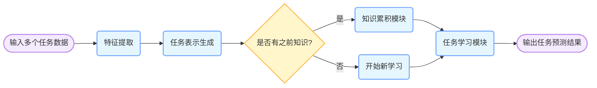

# 提升AI模型在多任务终身学习中的知识累积能力

> 关键词：AI模型、多任务终身学习、知识累积能力、持续学习、迁移学习

> 摘要：本文聚焦于提升AI模型在多任务终身学习中的知识累积能力。首先介绍了相关背景，包括目的、预期读者、文档结构和术语表。接着阐述了核心概念与联系，给出了原理和架构的文本示意图与Mermaid流程图。详细讲解了核心算法原理及具体操作步骤，使用Python代码进行说明。同时给出了数学模型和公式，并举例说明。通过项目实战，展示了代码实现和解读。探讨了实际应用场景，推荐了学习资源、开发工具框架和相关论文著作。最后总结了未来发展趋势与挑战，提供了常见问题解答和扩展阅读参考资料。旨在为研究者和开发者在提升AI模型多任务终身学习的知识累积能力方面提供全面且深入的指导。

## 1. 背景介绍 
### 1.1 目的和范围
在当今人工智能的发展中，多任务终身学习成为了一个重要的研究方向。传统的AI模型通常是针对单一任务进行训练的，当面对多个不同的任务时，它们往往需要重新进行大量的训练，这不仅效率低下，而且难以充分利用之前学习到的知识。多任务终身学习旨在让AI模型能够持续地学习多个不同的任务，并且在学习新任务的过程中，有效地累积和利用之前学到的知识，从而提高学习效率和性能。

本文的目的就是深入探讨如何提升AI模型在多任务终身学习中的知识累积能力。我们将从核心概念、算法原理、数学模型、项目实战等多个方面进行详细的阐述，为研究者和开发者提供全面的技术指导和实践经验。

### 1.2 预期读者
本文的预期读者主要包括人工智能领域的研究者、开发者、相关专业的学生以及对多任务终身学习感兴趣的技术爱好者。对于正在从事多任务终身学习相关研究的人员，本文可以提供新的思路和方法；对于开发者，本文可以帮助他们在实际项目中更好地实现AI模型的多任务终身学习；对于学生，本文可以作为学习多任务终身学习的参考资料，帮助他们深入理解相关概念和技术。

### 1.3 文档结构概述
本文将按照以下结构进行组织：
1. 背景介绍：介绍本文的目的、预期读者、文档结构和术语表。
2. 核心概念与联系：阐述多任务终身学习、知识累积等核心概念，并给出原理和架构的文本示意图与Mermaid流程图。
3. 核心算法原理 & 具体操作步骤：详细讲解提升知识累积能力的核心算法原理，并使用Python代码进行具体操作步骤的说明。
4. 数学模型和公式 & 详细讲解 & 举例说明：给出相关的数学模型和公式，并进行详细讲解和举例说明。
5. 项目实战：通过一个实际项目，展示代码实现和详细解释说明。
6. 实际应用场景：探讨多任务终身学习在不同领域的实际应用场景。
7. 工具和资源推荐：推荐学习资源、开发工具框架和相关论文著作。
8. 总结：总结未来发展趋势与挑战。
9. 附录：提供常见问题与解答。
10. 扩展阅读 & 参考资料：列出扩展阅读的资料和参考文献。

### 1.4 术语表
#### 1.4.1 核心术语定义
- **多任务终身学习（Multi-task Lifelong Learning）**：指AI模型能够持续地学习多个不同的任务，并且在学习过程中不断累积和利用知识，以提高学习效率和性能。
- **知识累积（Knowledge Accumulation）**：在多任务终身学习中，模型将之前学习到的知识进行保存和整合，以便在学习新任务时能够更好地利用这些知识。
- **持续学习（Continual Learning）**：与多任务终身学习类似，强调模型在不断变化的环境中持续学习新任务的能力。
- **迁移学习（Transfer Learning）**：将在一个任务上学习到的知识迁移到另一个相关任务上，以加速新任务的学习过程。

#### 1.4.2 相关概念解释
- **灾难性遗忘（Catastrophic Forgetting）**：在多任务终身学习中，模型在学习新任务时可能会忘记之前学习到的知识，导致之前任务的性能大幅下降。
- **元学习（Meta-learning）**：学习如何学习的方法，通过在多个任务上进行训练，使模型能够快速适应新任务。

#### 1.4.3 缩略词列表
- **ML**：机器学习（Machine Learning）
- **DL**：深度学习（Deep Learning）
- **LSTM**：长短期记忆网络（Long Short-Term Memory）
- **CNN**：卷积神经网络（Convolutional Neural Network）

## 2. 核心概念与联系 
### 核心概念原理
多任务终身学习的核心思想是让AI模型能够在不断学习新任务的过程中，有效地累积和利用之前学到的知识。这涉及到几个关键的概念和技术。

首先是任务表示。每个任务都需要有一个合适的表示方式，以便模型能够区分不同的任务。任务表示可以是任务的特征向量、任务的标签等。通过对任务进行有效的表示，模型可以更好地理解任务的本质和需求。

其次是知识累积机制。在学习新任务时，模型需要将之前学习到的知识进行保存和整合。这可以通过多种方式实现，例如使用记忆模块来保存之前的知识，或者使用正则化方法来约束模型在学习新任务时不忘记之前的知识。

最后是迁移学习。迁移学习是多任务终身学习中的一个重要技术，它可以将在一个任务上学习到的知识迁移到另一个相关任务上。通过迁移学习，模型可以更快地学习新任务，提高学习效率。

### 架构的文本示意图
```plaintext
多任务终身学习系统架构

输入层：接收多个不同任务的数据
|
特征提取层：对输入数据进行特征提取
|
任务表示层：为每个任务生成对应的任务表示
|
知识累积模块：保存和整合之前学习到的知识
|
任务学习模块：根据任务表示和知识累积模块的信息，学习当前任务
|
输出层：输出当前任务的预测结果
```

### Mermaid流程图


## 3. 核心算法原理 & 具体操作步骤 
### 核心算法原理
提升AI模型在多任务终身学习中的知识累积能力的一个重要算法是基于正则化的方法。该方法的核心思想是在学习新任务时，通过正则化项来约束模型的参数更新，使得模型在学习新任务的同时，尽量不忘记之前学习到的知识。

具体来说，假设我们有一个模型 $f(\theta)$，其中 $\theta$ 是模型的参数。在学习第 $t$ 个任务时，我们的目标是最小化损失函数 $L_t(\theta)$，同时考虑之前学习到的知识。我们可以通过添加一个正则化项来实现这一点，损失函数变为：

$$L(\theta) = L_t(\theta) + \lambda \sum_{i=1}^{t-1} \omega_i (\theta - \theta_i^*)^2$$

其中，$\lambda$ 是正则化系数，$\omega_i$ 是每个任务的权重，$\theta_i^*$ 是学习第 $i$ 个任务时的最优参数。

### 具体操作步骤
以下是使用Python代码实现基于正则化的多任务终身学习算法的具体操作步骤：

```python
import torch
import torch.nn as nn
import torch.optim as optim

# 定义一个简单的神经网络模型
class SimpleModel(nn.Module):
    def __init__(self, input_size, hidden_size, output_size):
        super(SimpleModel, self).__init__()
        self.fc1 = nn.Linear(input_size, hidden_size)
        self.relu = nn.ReLU()
        self.fc2 = nn.Linear(hidden_size, output_size)

    def forward(self, x):
        out = self.fc1(x)
        out = self.relu(out)
        out = self.fc2(out)
        return out

# 定义训练函数
def train_model(model, task_dataloader, prev_task_params, lambda_reg, optimizer):
    criterion = nn.CrossEntropyLoss()
    model.train()
    for inputs, labels in task_dataloader:
        optimizer.zero_grad()
        outputs = model(inputs)
        loss = criterion(outputs, labels)

        # 添加正则化项
        if prev_task_params is not None:
            reg_loss = 0
            for name, param in model.named_parameters():
                for prev_param in prev_task_params:
                    if name in prev_param:
                        reg_loss += ((param - prev_param[name]) ** 2).sum()
            loss += lambda_reg * reg_loss

        loss.backward()
        optimizer.step()
    return model.state_dict()

# 模拟多任务学习过程
input_size = 10
hidden_size = 20
output_size = 5
model = SimpleModel(input_size, hidden_size, output_size)
optimizer = optim.Adam(model.parameters(), lr=0.001)

# 假设有3个任务
num_tasks = 3
lambda_reg = 0.1
prev_task_params = []

for task_id in range(num_tasks):
    # 这里简单模拟每个任务的数据加载器
    task_dataloader = [(torch.randn(32, input_size), torch.randint(0, output_size, (32,)))]
    task_params = train_model(model, task_dataloader, prev_task_params, lambda_reg, optimizer)
    prev_task_params.append(task_params)
```

在上述代码中，我们首先定义了一个简单的神经网络模型 `SimpleModel`。然后，定义了训练函数 `train_model`，该函数在计算损失时添加了正则化项。最后，模拟了多任务学习过程，依次训练每个任务，并保存每个任务的最优参数。

## 4. 数学模型和公式 & 详细讲解 & 举例说明 
### 数学模型和公式
在多任务终身学习中，我们可以使用更一般的数学模型来描述知识累积的过程。假设我们有 $T$ 个任务，每个任务 $t$ 有一个数据集 $D_t = \{(x_{t,i}, y_{t,i})\}_{i=1}^{N_t}$，其中 $x_{t,i}$ 是输入数据，$y_{t,i}$ 是对应的标签。

我们的目标是学习一个模型 $f(\theta)$，使得在每个任务 $t$ 上的损失最小化，同时考虑之前学习到的知识。损失函数可以表示为：

$$L(\theta) = \sum_{t=1}^{T} \alpha_t L_t(\theta) + \beta \sum_{t=1}^{T-1} \sum_{s=t+1}^{T} R(\theta_t^*, \theta_s)$$

其中，$\alpha_t$ 是每个任务的权重，$L_t(\theta)$ 是任务 $t$ 的损失函数，$\beta$ 是正则化系数，$R(\theta_t^*, \theta_s)$ 是衡量任务 $t$ 的最优参数 $\theta_t^*$ 和任务 $s$ 的当前参数 $\theta_s$ 之间差异的正则化项。

### 详细讲解
- **任务损失项 $\sum_{t=1}^{T} \alpha_t L_t(\theta)$**：这一项表示在每个任务上的损失，通过加权求和的方式考虑了不同任务的重要性。不同的任务可能具有不同的难度和重要性，因此使用权重 $\alpha_t$ 来调整每个任务的贡献。
- **正则化项 $\beta \sum_{t=1}^{T-1} \sum_{s=t+1}^{T} R(\theta_t^*, \theta_s)$**：这一项的目的是防止模型在学习新任务时忘记之前学习到的知识。通过衡量不同任务之间参数的差异，正则化项可以约束模型在学习新任务时尽量保持之前任务的最优参数。

### 举例说明
假设我们有两个任务，任务 1 和任务 2。任务 1 的损失函数为 $L_1(\theta)$，任务 2 的损失函数为 $L_2(\theta)$。任务 1 的最优参数为 $\theta_1^*$，任务 2 的当前参数为 $\theta_2$。

我们可以选择正则化项 $R(\theta_1^*, \theta_2) = (\theta_2 - \theta_1^*)^2$，表示两个参数之间的平方差异。损失函数可以表示为：

$$L(\theta) = \alpha_1 L_1(\theta) + \alpha_2 L_2(\theta) + \beta (\theta_2 - \theta_1^*)^2$$

在训练过程中，我们通过最小化这个损失函数来更新模型的参数 $\theta$，使得模型在学习任务 2 的同时，尽量不忘记任务 1 的知识。

## 5. 项目实战：代码实际案例和详细解释说明 
### 5.1  开发环境搭建
为了实现提升AI模型在多任务终身学习中的知识累积能力的项目，我们需要搭建以下开发环境：
- **Python**：建议使用Python 3.7及以上版本。
- **深度学习框架**：我们使用PyTorch作为深度学习框架，它提供了丰富的工具和函数来构建和训练神经网络。可以使用以下命令安装PyTorch：
```bash
pip install torch torchvision
```
- **其他依赖库**：还需要安装一些其他的依赖库，如`numpy`、`matplotlib`等。可以使用以下命令安装：
```bash
pip install numpy matplotlib
```

### 5.2  源代码详细实现和代码解读
以下是一个完整的项目实战代码示例，用于实现基于正则化的多任务终身学习：

```python
import torch
import torch.nn as nn
import torch.optim as optim
import numpy as np
import matplotlib.pyplot as plt

# 定义一个简单的神经网络模型
class SimpleModel(nn.Module):
    def __init__(self, input_size, hidden_size, output_size):
        super(SimpleModel, self).__init__()
        self.fc1 = nn.Linear(input_size, hidden_size)
        self.relu = nn.ReLU()
        self.fc2 = nn.Linear(hidden_size, output_size)

    def forward(self, x):
        out = self.fc1(x)
        out = self.relu(out)
        out = self.fc2(out)
        return out

# 定义训练函数
def train_model(model, task_dataloader, prev_task_params, lambda_reg, optimizer):
    criterion = nn.CrossEntropyLoss()
    model.train()
    total_loss = 0
    for inputs, labels in task_dataloader:
        optimizer.zero_grad()
        outputs = model(inputs)
        loss = criterion(outputs, labels)

        # 添加正则化项
        if prev_task_params is not None:
            reg_loss = 0
            for name, param in model.named_parameters():
                for prev_param in prev_task_params:
                    if name in prev_param:
                        reg_loss += ((param - prev_param[name]) ** 2).sum()
            loss += lambda_reg * reg_loss

        loss.backward()
        optimizer.step()
        total_loss += loss.item()
    return total_loss, model.state_dict()

# 定义评估函数
def evaluate_model(model, task_dataloader):
    model.eval()
    correct = 0
    total = 0
    with torch.no_grad():
        for inputs, labels in task_dataloader:
            outputs = model(inputs)
            _, predicted = torch.max(outputs.data, 1)
            total += labels.size(0)
            correct += (predicted == labels).sum().item()
    return correct / total

# 模拟多任务学习过程
input_size = 10
hidden_size = 20
output_size = 5
model = SimpleModel(input_size, hidden_size, output_size)
optimizer = optim.Adam(model.parameters(), lr=0.001)

# 假设有3个任务
num_tasks = 3
lambda_reg = 0.1
prev_task_params = []
task_losses = []
task_accuracies = []

for task_id in range(num_tasks):
    # 这里简单模拟每个任务的数据加载器
    task_dataloader = [(torch.randn(32, input_size), torch.randint(0, output_size, (32,)))]
    loss, task_params = train_model(model, task_dataloader, prev_task_params, lambda_reg, optimizer)
    prev_task_params.append(task_params)
    task_losses.append(loss)

    # 评估模型在当前任务上的准确率
    accuracy = evaluate_model(model, task_dataloader)
    task_accuracies.append(accuracy)

# 绘制损失和准确率曲线
plt.figure(figsize=(12, 5))
plt.subplot(1, 2, 1)
plt.plot(task_losses)
plt.xlabel('Task ID')
plt.ylabel('Loss')
plt.title('Task Losses')

plt.subplot(1, 2, 2)
plt.plot(task_accuracies)
plt.xlabel('Task ID')
plt.ylabel('Accuracy')
plt.title('Task Accuracies')

plt.show()
```

### 代码解读与分析
- **模型定义**：我们定义了一个简单的两层全连接神经网络 `SimpleModel`，包含一个输入层、一个隐藏层和一个输出层。
- **训练函数 `train_model`**：该函数用于训练模型，在计算损失时添加了正则化项，以防止模型忘记之前学习到的知识。
- **评估函数 `evaluate_model`**：该函数用于评估模型在当前任务上的准确率。
- **多任务学习过程**：我们模拟了3个任务的学习过程，依次训练每个任务，并保存每个任务的最优参数。同时，记录每个任务的损失和准确率。
- **可视化**：最后，我们使用`matplotlib`库绘制了损失和准确率曲线，以便直观地观察模型在多任务学习过程中的性能变化。

## 6. 实际应用场景 
### 智能客服系统
在智能客服系统中，需要处理多种不同类型的客户问题，如产品咨询、售后投诉、订单查询等。通过多任务终身学习，AI模型可以不断学习新的问题类型，并且在处理新问题时，能够利用之前学习到的知识，提高问题解答的准确性和效率。

### 自动驾驶汽车
自动驾驶汽车需要同时处理多个任务，如目标检测、路径规划、交通信号识别等。多任务终身学习可以让汽车在行驶过程中不断学习新的路况和交通规则，并且在遇到新的情况时，能够快速适应并做出正确的决策。

### 医疗诊断系统
医疗诊断系统需要对多种疾病进行诊断，每个疾病都可以看作一个独立的任务。通过多任务终身学习，模型可以在学习新疾病的诊断方法时，利用之前学习到的其他疾病的知识，提高诊断的准确性和效率。

### 金融风险评估
在金融领域，需要对不同类型的金融风险进行评估，如信用风险、市场风险、操作风险等。多任务终身学习可以让模型在学习新的风险评估方法时，借鉴之前学习到的其他风险的评估经验，提高风险评估的准确性和可靠性。

## 7. 工具和资源推荐
### 7.1 学习资源推荐
#### 7.1.1 书籍推荐
- 《深度学习》（Deep Learning）：由Ian Goodfellow、Yoshua Bengio和Aaron Courville所著，是深度学习领域的经典教材，涵盖了深度学习的基本概念、算法和应用。
- 《机器学习》（Machine Learning）：由Tom M. Mitchell所著，是机器学习领域的入门书籍，对机器学习的基本概念和算法进行了详细的介绍。
- 《终身机器学习》（Lifelong Machine Learning）：由Zhiyuan Chen和Minlie Huang所著，专门介绍了终身机器学习的相关理论和方法。

#### 7.1.2 在线课程
- Coursera上的“深度学习专项课程”（Deep Learning Specialization）：由Andrew Ng教授授课，是深度学习领域最受欢迎的在线课程之一。
- edX上的“人工智能基础”（Fundamentals of Artificial Intelligence）：介绍了人工智能的基本概念、算法和应用。
- Udemy上的“多任务学习和迁移学习”（Multi-Task Learning and Transfer Learning）：专门讲解了多任务学习和迁移学习的相关知识和技术。

#### 7.1.3 技术博客和网站
- Medium：上面有很多关于人工智能和机器学习的技术博客，作者来自世界各地的研究者和开发者。
- arXiv：是一个预印本数据库，提供了大量关于人工智能和机器学习的最新研究论文。
- Towards Data Science：是一个专注于数据科学和机器学习的技术博客，提供了很多实用的教程和案例。

### 7.2 开发工具框架推荐
#### 7.2.1 IDE和编辑器
- PyCharm：是一款专门为Python开发设计的集成开发环境（IDE），提供了丰富的功能和工具，如代码编辑、调试、版本控制等。
- Jupyter Notebook：是一个交互式的开发环境，适合进行数据分析和机器学习实验。可以在浏览器中编写和运行代码，并实时查看结果。
- Visual Studio Code：是一款轻量级的代码编辑器，支持多种编程语言和插件，非常适合快速开发和调试。

#### 7.2.2 调试和性能分析工具
- PyTorch Profiler：是PyTorch提供的一个性能分析工具，可以帮助开发者分析模型的性能瓶颈，优化代码。
- TensorBoard：是TensorFlow提供的一个可视化工具，也可以用于PyTorch模型的可视化和调试。可以查看模型的训练过程、损失曲线、准确率等信息。
- cProfile：是Python内置的一个性能分析工具，可以分析代码的运行时间和函数调用次数，帮助开发者找出性能瓶颈。

#### 7.2.3 相关框架和库
- PyTorch：是一个开源的深度学习框架，提供了丰富的工具和函数来构建和训练神经网络。具有动态图机制，易于使用和调试。
- TensorFlow：是另一个流行的深度学习框架，由Google开发。提供了分布式训练、模型部署等功能，适合大规模的深度学习应用。
- Scikit-learn：是一个开源的机器学习库，提供了多种机器学习算法和工具，如分类、回归、聚类等。适合快速开发和实验。

### 7.3 相关论文著作推荐
#### 7.3.1 经典论文
- "Overcoming catastrophic forgetting in neural networks"：提出了一种基于弹性权重巩固（Elastic Weight Consolidation）的方法，用于解决神经网络中的灾难性遗忘问题。
- "Learning to learn by gradient descent by gradient descent"：介绍了一种基于元学习的方法，通过梯度下降来学习如何学习。
- "Multi-task learning"：是多任务学习领域的经典论文，对多任务学习的基本概念和算法进行了详细的介绍。

#### 7.3.2 最新研究成果
- 关注arXiv上关于多任务终身学习的最新研究论文，了解该领域的最新技术和方法。
- 参加国际机器学习会议（ICML）、神经信息处理系统大会（NeurIPS）等顶级学术会议，获取最新的研究成果和趋势。

#### 7.3.3 应用案例分析
- 可以在ACM SIGKDD、IEEE ICDM等数据挖掘会议上找到多任务终身学习在不同领域的应用案例分析。
- 一些科技公司的博客和技术报告也会分享他们在多任务终身学习方面的实践经验和应用案例。

## 8. 总结：未来发展趋势与挑战
### 未来发展趋势
- **更强大的模型架构**：未来的AI模型将采用更复杂、更强大的架构，如Transformer、BERT等，以提高多任务终身学习的性能。
- **跨领域学习**：多任务终身学习将不仅仅局限于单一领域，而是会拓展到跨领域的学习，如将计算机视觉和自然语言处理相结合。
- **强化学习与多任务终身学习的融合**：强化学习可以为多任务终身学习提供更有效的学习策略，未来两者的融合将成为一个重要的研究方向。
- **实际应用的拓展**：多任务终身学习将在更多的实际应用场景中得到广泛应用，如智能家居、智能医疗、智能交通等。

### 挑战
- **灾难性遗忘问题**：虽然已经有很多方法来解决灾难性遗忘问题，但仍然是多任务终身学习中的一个主要挑战。需要进一步研究更有效的方法来防止模型忘记之前学习到的知识。
- **任务表示和知识迁移**：如何对不同的任务进行有效的表示，以及如何更好地实现知识的迁移，仍然是需要解决的问题。
- **计算资源和时间成本**：多任务终身学习需要处理大量的数据和模型参数，计算资源和时间成本较高。需要研究更高效的算法和优化方法来降低成本。
- **数据隐私和安全**：在多任务终身学习中，需要处理大量的敏感数据，数据隐私和安全问题需要得到重视。

## 9. 附录：常见问题与解答
### 什么是灾难性遗忘？
灾难性遗忘是指在多任务终身学习中，模型在学习新任务时，可能会忘记之前学习到的知识，导致之前任务的性能大幅下降。这是多任务终身学习中的一个主要挑战。

### 如何解决灾难性遗忘问题？
可以通过多种方法来解决灾难性遗忘问题，如基于正则化的方法、记忆回放的方法、元学习的方法等。本文中介绍的基于正则化的方法，通过在损失函数中添加正则化项，约束模型在学习新任务时不忘记之前的知识。

### 多任务终身学习和迁移学习有什么区别？
迁移学习是将在一个任务上学习到的知识迁移到另一个相关任务上，以加速新任务的学习过程。而多任务终身学习强调模型能够持续地学习多个不同的任务，并且在学习过程中不断累积和利用知识。可以说，迁移学习是多任务终身学习中的一个重要技术。

### 多任务终身学习需要大量的计算资源吗？
多任务终身学习需要处理大量的数据和模型参数，因此计算资源和时间成本相对较高。但是，可以通过优化算法、使用高效的硬件设备等方法来降低成本。

## 10. 扩展阅读 & 参考资料
### 扩展阅读
- "Continual Learning in Neural Networks"：对神经网络中的持续学习进行了深入的研究和探讨。
- "Meta-Learning: A Survey"：对元学习进行了全面的综述，介绍了元学习的基本概念、算法和应用。
- "Multi-Task Deep Learning"：专门介绍了多任务深度学习的相关理论和方法。

### 参考资料
- Goodfellow, I., Bengio, Y., & Courville, A. (2016). Deep Learning. MIT Press.
- Mitchell, T. M. (1997). Machine Learning. McGraw-Hill.
- Chen, Z., & Huang, M. (2020). Lifelong Machine Learning. Morgan & Claypool Publishers.

作者：AI天才研究院/AI Genius Institute & 禅与计算机程序设计艺术 /Zen And The Art of Computer Programming