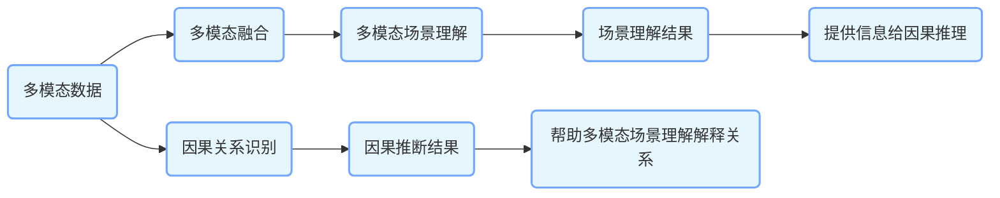

# 提升AI模型在多模态场景理解任务中的因果推理能力

> 关键词：AI模型、多模态场景理解、因果推理能力、多模态融合、深度学习

> 摘要：本文聚焦于提升AI模型在多模态场景理解任务中的因果推理能力。首先介绍了该研究的背景，包括目的、预期读者等信息。接着阐述了多模态场景理解和因果推理的核心概念及其联系，通过文本示意图和Mermaid流程图进行清晰展示。详细讲解了核心算法原理，并给出Python源代码示例。分析了相关数学模型和公式，并举例说明。通过项目实战，展示了代码的实际应用和详细解释。探讨了实际应用场景，推荐了相关的工具和资源。最后总结了未来发展趋势与挑战，还提供了常见问题解答和扩展阅读参考资料，旨在为提升AI模型在多模态场景下的因果推理能力提供全面的技术指导。

## 1. 背景介绍 
### 1.1 目的和范围
在当今的人工智能领域，多模态场景理解任务变得越来越重要。多模态数据如文本、图像、音频等的融合可以为AI模型提供更丰富的信息，从而实现更准确和智能的决策。然而，目前的AI模型在处理多模态数据时，往往缺乏有效的因果推理能力，导致其在理解复杂场景时存在局限性。本文的目的就是探讨如何提升AI模型在多模态场景理解任务中的因果推理能力。范围涵盖了多模态数据的处理、因果推理的理论和算法、实际应用案例以及相关工具和资源的推荐。

### 1.2 预期读者
本文预期读者包括人工智能领域的研究人员、开发者、数据科学家以及对多模态场景理解和因果推理感兴趣的技术爱好者。无论是从事学术研究还是实际项目开发，读者都可以从本文中获取关于提升AI模型因果推理能力的相关知识和技术。

### 1.3 文档结构概述
本文将按照以下结构进行阐述：首先介绍核心概念与联系，让读者了解多模态场景理解和因果推理的基本原理和它们之间的关系；接着讲解核心算法原理和具体操作步骤，通过Python代码进行详细说明；然后分析数学模型和公式，并举例说明其应用；之后通过项目实战展示代码的实际应用和详细解释；探讨实际应用场景；推荐相关的工具和资源；最后总结未来发展趋势与挑战，提供常见问题解答和扩展阅读参考资料。

### 1.4 术语表
#### 1.4.1 核心术语定义
- **多模态场景理解**：指AI模型能够综合处理多种不同类型的数据（如文本、图像、音频等），从而理解复杂场景的语义和信息。
- **因果推理**：是一种从数据中识别因果关系的能力，即确定一个事件（原因）如何导致另一个事件（结果）。
- **多模态融合**：将不同模态的数据进行整合，以便AI模型能够更好地利用这些数据进行决策。

#### 1.4.2 相关概念解释
- **深度学习**：一种基于神经网络的机器学习方法，在多模态场景理解和因果推理中具有广泛应用。
- **图神经网络**：一种专门用于处理图结构数据的神经网络，可用于建模多模态数据之间的关系。

#### 1.4.3 缩略词列表
- **CNN**：卷积神经网络（Convolutional Neural Network）
- **RNN**：循环神经网络（Recurrent Neural Network）
- **GNN**：图神经网络（Graph Neural Network）

## 2. 核心概念与联系 

### 多模态场景理解
多模态场景理解是指AI模型能够从多种不同类型的数据中提取信息，并将这些信息整合起来，以理解复杂场景的语义和信息。例如，在一个智能监控系统中，模型需要同时处理视频图像和音频数据，以识别场景中的事件和行为。

### 因果推理
因果推理是一种从数据中识别因果关系的能力。在多模态场景理解中，因果推理可以帮助模型确定不同模态数据之间的因果关系，从而更好地理解场景。例如，在医疗诊断中，因果推理可以帮助模型确定患者的症状（如咳嗽、发热等）与疾病（如感冒、肺炎等）之间的因果关系。

### 核心概念的联系
多模态场景理解和因果推理是相互关联的。多模态数据可以为因果推理提供更丰富的信息，从而提高因果推理的准确性。而因果推理可以帮助多模态场景理解更好地解释数据之间的关系，从而提高模型的可解释性和决策能力。

### 文本示意图
```plaintext
多模态场景理解
|
|-- 多模态数据（文本、图像、音频等）
|
|-- 多模态融合
|
|-- 场景理解结果

因果推理
|
|-- 数据（多模态数据）
|
|-- 因果关系识别
|
|-- 因果推断结果

多模态场景理解与因果推理的联系
|
|-- 多模态数据为因果推理提供信息
|
|-- 因果推理帮助多模态场景理解解释关系
```

### Mermaid流程图


## 3. 核心算法原理 & 具体操作步骤 

### 多模态融合算法
多模态融合是提升AI模型在多模态场景理解任务中因果推理能力的关键步骤。常见的多模态融合算法有早期融合、晚期融合和混合融合。

#### 早期融合
早期融合是在数据层面将不同模态的数据进行拼接或加权求和。以下是一个简单的Python代码示例：
```python
import numpy as np

# 模拟文本特征和图像特征
text_features = np.random.rand(100, 50)
image_features = np.random.rand(100, 100)

# 早期融合：拼接特征
early_fused_features = np.concatenate((text_features, image_features), axis=1)
print("早期融合特征形状:", early_fused_features.shape)
```
#### 晚期融合
晚期融合是在模型输出层面将不同模态的预测结果进行融合。以下是一个简单的Python代码示例：
```python
from sklearn.linear_model import LogisticRegression

# 模拟文本和图像的预测结果
text_predictions = np.random.randint(0, 2, 100)
image_predictions = np.random.randint(0, 2, 100)

# 创建晚期融合模型
late_fusion_model = LogisticRegression()

# 准备晚期融合的特征
late_fused_features = np.column_stack((text_predictions, image_predictions))

# 模拟标签
labels = np.random.randint(0, 2, 100)

# 训练晚期融合模型
late_fusion_model.fit(late_fused_features, labels)
```
#### 混合融合
混合融合结合了早期融合和晚期融合的优点。以下是一个简单的Python代码示例：
```python
import torch
import torch.nn as nn

# 定义一个简单的多模态模型
class MultiModalModel(nn.Module):
    def __init__(self):
        super(MultiModalModel, self).__init__()
        self.text_fc = nn.Linear(50, 25)
        self.image_fc = nn.Linear(100, 25)
        self.fusion_fc = nn.Linear(50, 1)

    def forward(self, text_input, image_input):
        text_output = self.text_fc(text_input)
        image_output = self.image_fc(image_input)
        # 早期融合
        early_fused = torch.cat((text_output, image_output), dim=1)
        # 最终输出
        final_output = self.fusion_fc(early_fused)
        return final_output

# 创建模型实例
model = MultiModalModel()

# 模拟输入
text_input = torch.randn(10, 50)
image_input = torch.randn(10, 100)

# 前向传播
output = model(text_input, image_input)
print("混合融合模型输出形状:", output.shape)
```

### 因果推理算法
常见的因果推理算法有基于结构方程模型（SEM）和基于图神经网络（GNN）的方法。

#### 基于结构方程模型（SEM）
结构方程模型是一种用于建模变量之间因果关系的统计方法。以下是一个简单的Python代码示例：
```python
import pandas as pd
import statsmodels.api as sm

# 模拟数据
data = {
    'X': np.random.randn(100),
    'Y': np.random.randn(100),
    'Z': np.random.randn(100)
}
df = pd.DataFrame(data)

# 定义结构方程模型
model = sm.tsa.SARIMAX(df['Y'], exog=df[['X', 'Z']])

# 拟合模型
results = model.fit()

# 打印结果
print(results.summary())
```
#### 基于图神经网络（GNN）
图神经网络可以用于建模多模态数据之间的关系，从而进行因果推理。以下是一个简单的Python代码示例：
```python
import torch
import torch.nn.functional as F
from torch_geometric.nn import GCNConv

# 定义一个简单的图神经网络
class GNN(nn.Module):
    def __init__(self, in_channels, hidden_channels, out_channels):
        super(GNN, self).__init__()
        self.conv1 = GCNConv(in_channels, hidden_channels)
        self.conv2 = GCNConv(hidden_channels, out_channels)

    def forward(self, x, edge_index):
        x = self.conv1(x, edge_index)
        x = F.relu(x)
        x = F.dropout(x, training=self.training)
        x = self.conv2(x, edge_index)
        return F.log_softmax(x, dim=1)

# 创建模型实例
model = GNN(10, 20, 2)

# 模拟输入
x = torch.randn(100, 10)
edge_index = torch.tensor([[0, 1], [1, 0]], dtype=torch.long)

# 前向传播
output = model(x, edge_index)
print("图神经网络输出形状:", output.shape)
```

## 4. 数学模型和公式 & 详细讲解 & 举例说明 

### 多模态融合的数学模型
#### 早期融合
早期融合可以用以下公式表示：
$$
\mathbf{F}_{early} = [\mathbf{F}_{text}; \mathbf{F}_{image}]
$$
其中，$\mathbf{F}_{early}$ 是早期融合后的特征向量，$\mathbf{F}_{text}$ 是文本特征向量，$\mathbf{F}_{image}$ 是图像特征向量，$[\cdot; \cdot]$ 表示向量拼接操作。

举例说明：假设文本特征向量 $\mathbf{F}_{text} = [0.1, 0.2, 0.3]$，图像特征向量 $\mathbf{F}_{image} = [0.4, 0.5, 0.6]$，则早期融合后的特征向量为 $\mathbf{F}_{early} = [0.1, 0.2, 0.3, 0.4, 0.5, 0.6]$。

#### 晚期融合
晚期融合可以用以下公式表示：
$$
\hat{y} = f(\mathbf{p}_{text}, \mathbf{p}_{image})
$$
其中，$\hat{y}$ 是最终的预测结果，$\mathbf{p}_{text}$ 是文本模态的预测结果，$\mathbf{p}_{image}$ 是图像模态的预测结果，$f(\cdot)$ 是融合函数，例如逻辑回归模型。

举例说明：假设文本模态的预测结果 $\mathbf{p}_{text} = [0.8, 0.2]$，图像模态的预测结果 $\mathbf{p}_{image} = [0.7, 0.3]$，融合函数 $f(\cdot)$ 是一个简单的加权求和函数，则最终的预测结果为 $\hat{y} = 0.5 \times [0.8, 0.2] + 0.5 \times [0.7, 0.3] = [0.75, 0.25]$。

### 因果推理的数学模型
#### 结构方程模型（SEM）
结构方程模型可以用以下公式表示：
$$
\mathbf{Y} = \mathbf{B}\mathbf{X} + \mathbf{\epsilon}
$$
其中，$\mathbf{Y}$ 是因变量向量，$\mathbf{X}$ 是自变量向量，$\mathbf{B}$ 是系数矩阵，$\mathbf{\epsilon}$ 是误差向量。

举例说明：假设我们有一个简单的结构方程模型，其中 $\mathbf{Y} = [y_1, y_2]^T$，$\mathbf{X} = [x_1, x_2]^T$，$\mathbf{B} = \begin{bmatrix} 0.5 & 0.3 \\ 0.2 & 0.4 \end{bmatrix}$，$\mathbf{\epsilon} = [\epsilon_1, \epsilon_2]^T$，则模型可以表示为：
$$
\begin{bmatrix} y_1 \\ y_2 \end{bmatrix} = \begin{bmatrix} 0.5 & 0.3 \\ 0.2 & 0.4 \end{bmatrix} \begin{bmatrix} x_1 \\ x_2 \end{bmatrix} + \begin{bmatrix} \epsilon_1 \\ \epsilon_2 \end{bmatrix}
$$

#### 图神经网络（GNN）
图神经网络的节点特征更新公式可以用以下公式表示：
$$
\mathbf{h}_i^{(l+1)} = \sigma \left( \mathbf{W}^{(l)} \sum_{j \in \mathcal{N}(i)} \frac{1}{\sqrt{d_i d_j}} \mathbf{h}_j^{(l)} + \mathbf{b}^{(l)} \right)
$$
其中，$\mathbf{h}_i^{(l)}$ 是第 $l$ 层节点 $i$ 的特征向量，$\mathcal{N}(i)$ 是节点 $i$ 的邻居节点集合，$d_i$ 是节点 $i$ 的度，$\mathbf{W}^{(l)}$ 是第 $l$ 层的权重矩阵，$\mathbf{b}^{(l)}$ 是第 $l$ 层的偏置向量，$\sigma(\cdot)$ 是激活函数。

举例说明：假设我们有一个简单的图，其中节点 $i$ 有两个邻居节点 $j_1$ 和 $j_2$，节点 $i$ 的度 $d_i = 2$，邻居节点 $j_1$ 的度 $d_{j_1} = 3$，邻居节点 $j_2$ 的度 $d_{j_2} = 2$，第 $l$ 层节点 $i$ 的特征向量 $\mathbf{h}_i^{(l)} = [0.1, 0.2]$，邻居节点 $j_1$ 的特征向量 $\mathbf{h}_{j_1}^{(l)} = [0.3, 0.4]$，邻居节点 $j_2$ 的特征向量 $\mathbf{h}_{j_2}^{(l)} = [0.5, 0.6]$，第 $l$ 层的权重矩阵 $\mathbf{W}^{(l)} = \begin{bmatrix} 0.1 & 0.2 \\ 0.3 & 0.4 \end{bmatrix}$，偏置向量 $\mathbf{b}^{(l)} = [0.01, 0.02]$，激活函数 $\sigma(\cdot)$ 是 ReLU 函数，则节点 $i$ 在第 $l+1$ 层的特征向量更新过程如下：
$$
\begin{align*}
\mathbf{h}_i^{(l+1)} &= \text{ReLU} \left( \begin{bmatrix} 0.1 & 0.2 \\ 0.3 & 0.4 \end{bmatrix} \left( \frac{1}{\sqrt{2 \times 3}} \begin{bmatrix} 0.3 & 0.4 \end{bmatrix} + \frac{1}{\sqrt{2 \times 2}} \begin{bmatrix} 0.5 & 0.6 \end{bmatrix} \right) + \begin{bmatrix} 0.01 & 0.02 \end{bmatrix} \right) \\
&= \text{ReLU} \left( \begin{bmatrix} 0.1 & 0.2 \\ 0.3 & 0.4 \end{bmatrix} \begin{bmatrix} 0.25 & 0.32 \end{bmatrix} + \begin{bmatrix} 0.01 & 0.02 \end{bmatrix} \right) \\
&= \text{ReLU} \left( \begin{bmatrix} 0.085 & 0.119 \end{bmatrix} + \begin{bmatrix} 0.01 & 0.02 \end{bmatrix} \right) \\
&= \text{ReLU} \left( \begin{bmatrix} 0.095 & 0.139 \end{bmatrix} \right) \\
&= \begin{bmatrix} 0.095 & 0.139 \end{bmatrix}
\end{align*}
$$

## 5. 项目实战：代码实际案例和详细解释说明 

### 5.1  开发环境搭建
本项目使用Python进行开发，需要安装以下库：
- PyTorch：用于深度学习模型的构建和训练。
- NumPy：用于数值计算。
- Pandas：用于数据处理。
- Scikit-learn：用于机器学习模型的训练和评估。
- Torch-Geometric：用于图神经网络的开发。

可以使用以下命令安装这些库：
```bash
pip install torch numpy pandas scikit-learn torch-geometric
```

### 5.2  源代码详细实现和代码解读
以下是一个完整的项目实战代码示例，用于提升AI模型在多模态场景理解任务中的因果推理能力：
```python
import torch
import torch.nn as nn
import torch.optim as optim
from torch_geometric.data import Data
from torch_geometric.nn import GCNConv
import numpy as np
import pandas as pd
from sklearn.model_selection import train_test_split

# 定义多模态融合模型
class MultiModalFusionModel(nn.Module):
    def __init__(self, text_input_size, image_input_size, hidden_size, output_size):
        super(MultiModalFusionModel, self).__init__()
        self.text_fc = nn.Linear(text_input_size, hidden_size)
        self.image_fc = nn.Linear(image_input_size, hidden_size)
        self.fusion_fc = nn.Linear(2 * hidden_size, output_size)

    def forward(self, text_input, image_input):
        text_output = self.text_fc(text_input)
        text_output = nn.functional.relu(text_output)
        image_output = self.image_fc(image_input)
        image_output = nn.functional.relu(image_output)
        fused_output = torch.cat((text_output, image_output), dim=1)
        final_output = self.fusion_fc(fused_output)
        return final_output

# 定义图神经网络模型
class GNNModel(nn.Module):
    def __init__(self, in_channels, hidden_channels, out_channels):
        super(GNNModel, self).__init__()
        self.conv1 = GCNConv(in_channels, hidden_channels)
        self.conv2 = GCNConv(hidden_channels, out_channels)

    def forward(self, x, edge_index):
        x = self.conv1(x, edge_index)
        x = nn.functional.relu(x)
        x = nn.functional.dropout(x, training=self.training)
        x = self.conv2(x, edge_index)
        return nn.functional.log_softmax(x, dim=1)

# 模拟数据生成
def generate_data(num_samples, text_input_size, image_input_size):
    text_data = np.random.randn(num_samples, text_input_size)
    image_data = np.random.randn(num_samples, image_input_size)
    labels = np.random.randint(0, 2, num_samples)
    return text_data, image_data, labels

# 数据预处理
def preprocess_data(text_data, image_data, labels):
    text_data = torch.tensor(text_data, dtype=torch.float32)
    image_data = torch.tensor(image_data, dtype=torch.float32)
    labels = torch.tensor(labels, dtype=torch.long)
    return text_data, image_data, labels

# 训练多模态融合模型
def train_multi_modal_model(model, text_data, image_data, labels, epochs, lr):
    criterion = nn.CrossEntropyLoss()
    optimizer = optim.Adam(model.parameters(), lr=lr)

    for epoch in range(epochs):
        optimizer.zero_grad()
        outputs = model(text_data, image_data)
        loss = criterion(outputs, labels)
        loss.backward()
        optimizer.step()
        if (epoch + 1) % 10 == 0:
            print(f'Epoch {epoch + 1}/{epochs}, Loss: {loss.item()}')

# 训练图神经网络模型
def train_gnn_model(model, data, epochs, lr):
    criterion = nn.NLLLoss()
    optimizer = optim.Adam(model.parameters(), lr=lr)

    for epoch in range(epochs):
        optimizer.zero_grad()
        out = model(data.x, data.edge_index)
        loss = criterion(out[data.train_mask], data.y[data.train_mask])
        loss.backward()
        optimizer.step()
        if (epoch + 1) % 10 == 0:
            print(f'Epoch {epoch + 1}/{epochs}, Loss: {loss.item()}')

# 主函数
def main():
    # 数据生成
    num_samples = 1000
    text_input_size = 50
    image_input_size = 100
    text_data, image_data, labels = generate_data(num_samples, text_input_size, image_input_size)

    # 数据预处理
    text_data, image_data, labels = preprocess_data(text_data, image_data, labels)

    # 划分训练集和测试集
    text_train, text_test, image_train, image_test, labels_train, labels_test = train_test_split(
        text_data, image_data, labels, test_size=0.2, random_state=42
    )

    # 初始化多模态融合模型
    hidden_size = 25
    output_size = 2
    multi_modal_model = MultiModalFusionModel(text_input_size, image_input_size, hidden_size, output_size)

    # 训练多模态融合模型
    epochs = 100
    lr = 0.001
    train_multi_modal_model(multi_modal_model, text_train, image_train, labels_train, epochs, lr)

    # 初始化图神经网络模型
    in_channels = text_input_size + image_input_size
    hidden_channels = 20
    out_channels = 2
    gnn_model = GNNModel(in_channels, hidden_channels, out_channels)

    # 构建图数据
    x = torch.cat((text_data, image_data), dim=1)
    edge_index = torch.tensor([[i, i + 1] for i in range(num_samples - 1)], dtype=torch.long).t().contiguous()
    train_mask = torch.zeros(num_samples, dtype=torch.bool)
    train_mask[:int(0.8 * num_samples)] = 1
    test_mask = ~train_mask
    data = Data(x=x, edge_index=edge_index, y=labels, train_mask=train_mask, test_mask=test_mask)

    # 训练图神经网络模型
    train_gnn_model(gnn_model, data, epochs, lr)

if __name__ == "__main__":
    main()
```

### 5.3  代码解读与分析
- **多模态融合模型**：`MultiModalFusionModel` 类实现了一个简单的多模态融合模型，通过全连接层将文本和图像特征进行融合。
- **图神经网络模型**：`GNNModel` 类实现了一个简单的图神经网络模型，使用 GCNConv 层进行节点特征更新。
- **数据生成和预处理**：`generate_data` 函数用于生成模拟数据，`preprocess_data` 函数用于将数据转换为 PyTorch 张量。
- **训练函数**：`train_multi_modal_model` 和 `train_gnn_model` 函数分别用于训练多模态融合模型和图神经网络模型。
- **主函数**：`main` 函数完成了数据生成、预处理、模型初始化和训练的整个流程。

## 6. 实际应用场景 
### 智能医疗诊断
在智能医疗诊断中，AI模型可以同时处理患者的病历文本、医学影像（如X光、CT等）和生命体征数据（如心率、血压等），通过因果推理确定患者的症状与疾病之间的因果关系，从而提高诊断的准确性和效率。

### 自动驾驶
在自动驾驶中，AI模型需要处理多种传感器数据，如摄像头图像、雷达数据和激光雷达数据，通过因果推理理解不同传感器数据之间的因果关系，从而做出更安全和智能的决策。

### 智能安防
在智能安防中，AI模型可以同时处理视频监控图像和音频数据，通过因果推理识别场景中的异常事件和行为，及时发出警报。

### 智能家居
在智能家居中，AI模型可以处理多种传感器数据，如温度传感器、湿度传感器和光照传感器数据，通过因果推理理解不同传感器数据之间的因果关系，从而实现智能家居设备的自动化控制。

## 7. 工具和资源推荐
### 7.1 学习资源推荐
#### 7.1.1 书籍推荐
- 《深度学习》（Deep Learning）：由 Ian Goodfellow、Yoshua Bengio 和 Aaron Courville 编写，是深度学习领域的经典教材。
- 《因果推理入门》（Causal Inference in Statistics: A Primer）：由 Judea Pearl、Madelyn Glymour 和 Nicholas P. Jewell 编写，介绍了因果推理的基本概念和方法。
- 《多模态机器学习：原理与应用》（Multimodal Machine Learning: Principles and Applications）：介绍了多模态机器学习的基本原理和应用。

#### 7.1.2 在线课程
- Coursera 上的 “深度学习专项课程”（Deep Learning Specialization）：由 Andrew Ng 教授授课，涵盖了深度学习的各个方面。
- edX 上的 “因果推理基础”（Foundations of Causal Inference）：介绍了因果推理的基本概念和方法。
- Udemy 上的 “多模态人工智能”（Multimodal Artificial Intelligence）：介绍了多模态人工智能的最新研究成果和应用。

#### 7.1.3 技术博客和网站
- arXiv：一个开放获取的预印本服务器，提供了大量关于人工智能和机器学习的最新研究论文。
- Medium：一个技术博客平台，有很多关于人工智能和机器学习的优质文章。
- Towards Data Science：一个专注于数据科学和机器学习的技术博客，提供了很多实用的教程和案例。

### 7.2 开发工具框架推荐
#### 7.2.1 IDE和编辑器
- PyCharm：一个专业的 Python 集成开发环境，提供了丰富的代码编辑、调试和项目管理功能。
- Jupyter Notebook：一个交互式的开发环境，适合进行数据分析和模型实验。
- Visual Studio Code：一个轻量级的代码编辑器，支持多种编程语言和插件扩展。

#### 7.2.2 调试和性能分析工具
- PyTorch Profiler：PyTorch 提供的性能分析工具，可以帮助开发者找出模型训练过程中的性能瓶颈。
- TensorBoard：TensorFlow 提供的可视化工具，也可以用于 PyTorch 模型的训练过程可视化。
- cProfile：Python 内置的性能分析工具，可以帮助开发者找出代码中的性能瓶颈。

#### 7.2.3 相关框架和库
- PyTorch：一个开源的深度学习框架，提供了丰富的神经网络层和优化算法。
- TensorFlow：一个开源的深度学习框架，广泛应用于工业界和学术界。
- Torch-Geometric：一个用于图神经网络的 PyTorch 扩展库，提供了丰富的图神经网络层和数据集。

### 7.3 相关论文著作推荐
#### 7.3.1 经典论文
- “Deep Residual Learning for Image Recognition”：提出了残差网络（ResNet），解决了深度神经网络训练过程中的梯度消失问题。
- “Attention Is All You Need”：提出了 Transformer 模型，在自然语言处理领域取得了巨大成功。
- “Causal Inference Using Graphical Models with the R Package ‘pcalg’”：介绍了使用图模型进行因果推理的方法。

#### 7.3.2 最新研究成果
- “Multimodal Transformer for Unaligned Multimodal Language Sequences”：提出了一种用于处理未对齐多模态语言序列的 Transformer 模型。
- “Causal Discovery with Reinforcement Learning”：提出了一种使用强化学习进行因果发现的方法。
- “Graph Neural Networks for Causal Inference”：介绍了图神经网络在因果推理中的应用。

#### 7.3.3 应用案例分析
- “AI-Assisted Diagnosis of COVID-19 from Chest CT Images”：介绍了使用人工智能技术辅助诊断 COVID-19 的应用案例。
- “Autonomous Vehicle Decision-Making Based on Multimodal Sensor Data”：介绍了使用多模态传感器数据进行自动驾驶决策的应用案例。
- “Smart Home Automation Using Multimodal Sensing and Causal Reasoning”：介绍了使用多模态传感和因果推理实现智能家居自动化的应用案例。

## 8. 总结：未来发展趋势与挑战
### 未来发展趋势
- **多模态融合技术的进一步发展**：未来的研究将致力于开发更高效、更准确的多模态融合技术，以提高AI模型在多模态场景理解任务中的性能。
- **因果推理理论的不断完善**：因果推理理论将不断发展和完善，为AI模型提供更强大的因果推理能力。
- **跨领域应用的拓展**：提升AI模型在多模态场景理解任务中的因果推理能力将在更多领域得到应用，如金融、教育、娱乐等。

### 挑战
- **数据质量和标注问题**：多模态数据的质量和标注是影响AI模型性能的重要因素，如何获取高质量的多模态数据并进行准确的标注是一个挑战。
- **计算资源和时间成本**：提升AI模型在多模态场景理解任务中的因果推理能力需要大量的计算资源和时间成本，如何优化算法和模型结构以降低计算资源和时间成本是一个挑战。
- **可解释性和可靠性问题**：AI模型的可解释性和可靠性是影响其实际应用的重要因素，如何提高AI模型在多模态场景理解任务中的可解释性和可靠性是一个挑战。

## 9. 附录：常见问题与解答
### 问题1：多模态融合和因果推理有什么区别？
多模态融合是将不同模态的数据进行整合，以便AI模型能够更好地利用这些数据进行决策。而因果推理是一种从数据中识别因果关系的能力，即确定一个事件（原因）如何导致另一个事件（结果）。多模态融合是为了提高AI模型的信息获取能力，而因果推理是为了提高AI模型的决策能力和可解释性。

### 问题2：如何选择合适的多模态融合算法？
选择合适的多模态融合算法需要考虑多个因素，如数据的特点、模型的复杂度和应用场景等。早期融合适用于数据维度较低、模态之间相关性较强的情况；晚期融合适用于数据维度较高、模态之间相关性较弱的情况；混合融合结合了早期融合和晚期融合的优点，适用于大多数情况。

### 问题3：因果推理算法的计算复杂度高吗？
因果推理算法的计算复杂度因算法而异。基于结构方程模型（SEM）的方法通常需要进行大量的统计计算，计算复杂度较高；基于图神经网络（GNN）的方法可以通过并行计算来降低计算复杂度，但在处理大规模图数据时仍然存在挑战。

### 问题4：如何评估AI模型在多模态场景理解任务中的因果推理能力？
评估AI模型在多模态场景理解任务中的因果推理能力可以使用多种指标，如准确率、召回率、F1值等。此外，还可以使用因果效应估计的方法来评估模型的因果推理能力，如平均因果效应（ACE）、条件平均因果效应（CACE）等。

## 10. 扩展阅读 & 参考资料
- Goodfellow, I., Bengio, Y., & Courville, A. (2016). Deep Learning. MIT Press.
- Pearl, J., Glymour, M., & Jewell, N. P. (2016). Causal Inference in Statistics: A Primer. Wiley.
- Baltrušaitis, T., Ahuja, C., & Morency, L.-P. (2018). Multimodal Machine Learning: A Survey and Taxonomy. IEEE Transactions on Pattern Analysis and Machine Intelligence, 41(2), 423-443.
- He, K., Zhang, X., Ren, S., & Sun, J. (2016). Deep Residual Learning for Image Recognition. Proceedings of the IEEE Conference on Computer Vision and Pattern Recognition (CVPR).
- Vaswani, A., Shazeer, N., Parmar, N., Uszkoreit, J., Jones, L., Gomez, A. N.,... & Polosukhin, I. (2017). Attention Is All You Need. Advances in Neural Information Processing Systems (NeurIPS).
- Kalisch, M., & Bühlmann, P. (2007). Estimating High-Dimensional Directed Acyclic Graphs with the PC-Algorithm. Journal of Machine Learning Research, 8, 613-636.

作者：AI天才研究院/AI Genius Institute & 禅与计算机程序设计艺术 /Zen And The Art of Computer Programming