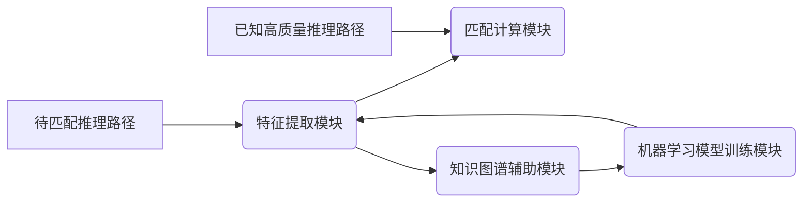

# 提升与已知高质量推理路径匹配概率的方法

> 关键词：推理路径、高质量匹配、概率提升、知识图谱、机器学习

> 摘要：本文聚焦于提升与已知高质量推理路径匹配概率的方法。在众多领域中，准确匹配推理路径对于问题解决、决策制定等具有重要意义。文章首先介绍相关背景，包括目的范围、预期读者等内容。接着阐述核心概念与联系，通过文本示意图和 Mermaid 流程图呈现其架构。详细讲解核心算法原理及具体操作步骤，运用 Python 源代码进行阐述。深入探讨数学模型和公式，并举例说明。通过项目实战给出代码实际案例和详细解释。分析实际应用场景，推荐相关工具和资源。最后总结未来发展趋势与挑战，提供常见问题与解答以及扩展阅读和参考资料，旨在为读者全面介绍提升推理路径匹配概率的有效方法。

## 1. 背景介绍 
### 1.1 目的和范围
在当今的信息时代，推理路径的匹配在多个领域都有着广泛的应用，如智能客服、知识问答系统、医疗诊断辅助等。提升与已知高质量推理路径的匹配概率，能够提高系统的准确性和效率，从而更好地服务用户。本文的目的在于深入探讨提升这种匹配概率的方法，涵盖了从理论基础到实际应用的多个方面。范围包括相关概念的介绍、核心算法的原理和实现、数学模型的分析、项目实战以及实际应用场景的探讨等。

### 1.2 预期读者
本文预期读者包括从事人工智能、机器学习、自然语言处理等领域的研究人员和开发者，对推理路径匹配问题感兴趣的技术爱好者，以及希望利用相关技术提升系统性能的企业技术人员等。

### 1.3 文档结构概述
本文将按照以下结构进行阐述：首先介绍背景知识，包括目的范围、预期读者等；接着讲解核心概念与联系，通过文本示意图和 Mermaid 流程图呈现其架构；详细阐述核心算法原理及具体操作步骤，用 Python 代码说明；深入分析数学模型和公式，并举例说明；通过项目实战给出代码实际案例和详细解释；探讨实际应用场景；推荐相关工具和资源；总结未来发展趋势与挑战；提供常见问题与解答以及扩展阅读和参考资料。

### 1.4 术语表
#### 1.4.1 核心术语定义
- **推理路径**：从问题的初始状态到最终结论所经过的一系列推理步骤的序列。
- **高质量推理路径**：具有较高准确性、可靠性和逻辑性的推理路径。
- **匹配概率**：待匹配的推理路径与已知高质量推理路径相符的可能性大小。

#### 1.4.2 相关概念解释
- **知识图谱**：一种结构化的语义网络，用于表示实体之间的关系和知识，在推理路径匹配中可提供丰富的背景知识。
- **机器学习模型**：通过对大量数据的学习来建立模型，用于预测和分类，可应用于推理路径的匹配任务。

#### 1.4.3 缩略词列表
- **NLP**：Natural Language Processing，自然语言处理
- **ML**：Machine Learning，机器学习

## 2. 核心概念与联系 

### 核心概念原理
推理路径的匹配本质上是将待匹配的推理序列与已知的高质量推理序列进行比较和分析。高质量推理路径通常是经过专家验证或大量数据训练得到的，具有较高的可信度。在匹配过程中，需要考虑推理步骤的语义、逻辑关系等因素。

知识图谱在推理路径匹配中起着重要的作用。它可以提供实体之间的关系信息，帮助判断推理步骤的合理性。例如，在医疗诊断中，知识图谱可以记录疾病、症状、治疗方法等之间的关系，当进行推理路径匹配时，可以根据这些关系判断推理是否合理。

机器学习模型则可以通过对大量推理路径数据的学习，挖掘出其中的模式和规律，从而提高匹配的准确性。例如，使用深度学习模型可以对推理路径的文本表示进行学习，自动提取特征并进行分类。

### 架构的文本示意图
```plaintext
待匹配推理路径 ---> 特征提取模块 ---> 匹配计算模块 <--- 已知高质量推理路径
                      |
                      v
               知识图谱辅助模块
                      |
                      v
               机器学习模型训练模块
```

### Mermaid 流程图


## 3. 核心算法原理 & 具体操作步骤 

### 算法原理
我们可以采用基于特征匹配和机器学习的方法来提升与已知高质量推理路径的匹配概率。具体步骤如下：
1. **特征提取**：对待匹配推理路径和已知高质量推理路径进行特征提取，将其转换为计算机可以处理的特征向量。
2. **匹配计算**：计算待匹配推理路径的特征向量与已知高质量推理路径的特征向量之间的相似度。
3. **机器学习模型训练**：使用大量的推理路径数据训练机器学习模型，让模型学习到匹配的模式和规律。
4. **融合知识图谱信息**：利用知识图谱中的关系信息，对匹配结果进行修正和优化。

### Python 源代码详细阐述
```python
import numpy as np
from sklearn.feature_extraction.text import TfidfVectorizer
from sklearn.metrics.pairwise import cosine_similarity

# 示例数据：已知高质量推理路径和待匹配推理路径
high_quality_paths = ["步骤1：检查症状，步骤2：进行诊断，步骤3：给出治疗方案",
                      "步骤1：收集数据，步骤2：分析数据，步骤3：得出结论"]
待匹配路径 = "步骤1：检查症状，步骤2：进行诊断，步骤3：确定治疗方法"

# 特征提取：使用 TF-IDF 向量化
vectorizer = TfidfVectorizer()
all_paths = high_quality_paths + [待匹配路径]
feature_vectors = vectorizer.fit_transform(all_paths)

# 分离已知高质量推理路径和待匹配推理路径的特征向量
high_quality_vectors = feature_vectors[:len(high_quality_paths)]
待匹配_vector = feature_vectors[len(high_quality_paths):]

# 匹配计算：计算余弦相似度
similarities = cosine_similarity(待匹配_vector, high_quality_vectors)

# 找到最相似的推理路径
most_similar_index = np.argmax(similarities)
most_similar_path = high_quality_paths[most_similar_index]
most_similar_similarity = similarities[0][most_similar_index]

print(f"最相似的推理路径：{most_similar_path}")
print(f"相似度：{most_similar_similarity}")
```

### 具体操作步骤
1. **数据准备**：收集已知高质量推理路径和待匹配推理路径的数据。
2. **特征提取**：使用合适的方法（如 TF-IDF、词嵌入等）将推理路径转换为特征向量。
3. **匹配计算**：计算特征向量之间的相似度，可以使用余弦相似度、欧几里得距离等方法。
4. **机器学习模型训练**：如果有足够的数据，可以使用机器学习模型（如神经网络、支持向量机等）进行训练，提高匹配的准确性。
5. **知识图谱融合**：将知识图谱中的关系信息融入到匹配过程中，对匹配结果进行修正和优化。

## 4. 数学模型和公式 & 详细讲解 & 举例说明 

### 特征提取的数学模型
在特征提取中，常用的方法是 TF-IDF（词频 - 逆文档频率）。TF-IDF 的计算公式如下：
$$
\text{TF-IDF}(t, d, D) = \text{TF}(t, d) \times \text{IDF}(t, D)
$$
其中：
- $\text{TF}(t, d)$ 表示词 $t$ 在文档 $d$ 中的词频，即词 $t$ 在文档 $d$ 中出现的次数。
- $\text{IDF}(t, D)$ 表示词 $t$ 在文档集合 $D$ 中的逆文档频率，计算公式为：
$$
\text{IDF}(t, D) = \log \frac{|D|}{|\{d \in D: t \in d\}| + 1}
$$
其中 $|D|$ 表示文档集合 $D$ 的文档总数，$|\{d \in D: t \in d\}|$ 表示包含词 $t$ 的文档数。

### 匹配计算的数学模型
在匹配计算中，常用的方法是余弦相似度。余弦相似度的计算公式如下：
$$
\text{cosine similarity}(\mathbf{A}, \mathbf{B}) = \frac{\mathbf{A} \cdot \mathbf{B}}{\|\mathbf{A}\| \|\mathbf{B}\|}
$$
其中 $\mathbf{A}$ 和 $\mathbf{B}$ 是两个特征向量，$\mathbf{A} \cdot \mathbf{B}$ 表示向量的点积，$\|\mathbf{A}\|$ 和 $\|\mathbf{B}\|$ 分别表示向量的模。

### 举例说明
假设有两个推理路径：
- 推理路径 1：“步骤1：检查症状，步骤2：进行诊断”
- 推理路径 2：“步骤1：查看症状，步骤2：做出诊断”

首先使用 TF-IDF 进行特征提取，得到两个特征向量 $\mathbf{A}$ 和 $\mathbf{B}$。假设 $\mathbf{A} = [0.2, 0.3, 0.5]$，$\mathbf{B} = [0.25, 0.35, 0.4]$。

然后计算余弦相似度：
$$
\begin{align*}
\mathbf{A} \cdot \mathbf{B} &= 0.2 \times 0.25 + 0.3 \times 0.35 + 0.5 \times 0.4 \\
&= 0.05 + 0.105 + 0.2 \\
&= 0.355
\end{align*}
$$
$$
\begin{align*}
\|\mathbf{A}\| &= \sqrt{0.2^2 + 0.3^2 + 0.5^2} \\
&= \sqrt{0.04 + 0.09 + 0.25} \\
&= \sqrt{0.38} \\
&\approx 0.616
\end{align*}
$$
$$
\begin{align*}
\|\mathbf{B}\| &= \sqrt{0.25^2 + 0.35^2 + 0.4^2} \\
&= \sqrt{0.0625 + 0.1225 + 0.16} \\
&= \sqrt{0.345} \\
&\approx 0.587
\end{align*}
$$
$$
\text{cosine similarity}(\mathbf{A}, \mathbf{B}) = \frac{0.355}{0.616 \times 0.587} \approx 0.97
$$

这表明两个推理路径具有较高的相似度。

## 5. 项目实战：代码实际案例和详细解释说明 

### 5.1  开发环境搭建
1. **安装 Python**：建议使用 Python 3.6 及以上版本，可以从 Python 官方网站（https://www.python.org/downloads/）下载安装。
2. **安装必要的库**：使用以下命令安装所需的库：
```sh
pip install numpy scikit-learn
```

### 5.2  源代码详细实现和代码解读
```python
import numpy as np
from sklearn.feature_extraction.text import TfidfVectorizer
from sklearn.metrics.pairwise import cosine_similarity

# 步骤 1：数据准备
# 已知高质量推理路径
high_quality_paths = ["步骤1：收集用户需求，步骤2：进行需求分析，步骤3：设计系统架构",
                      "步骤1：采集数据，步骤2：数据清洗，步骤3：数据分析"]
# 待匹配推理路径
待匹配_path = "步骤1：收集用户需求，步骤2：分析需求，步骤3：设计系统框架"

# 步骤 2：特征提取
# 创建 TF-IDF 向量化器
vectorizer = TfidfVectorizer()
# 将所有推理路径合并
all_paths = high_quality_paths + [待匹配_path]
# 进行特征提取，得到特征向量
feature_vectors = vectorizer.fit_transform(all_paths)

# 步骤 3：分离已知高质量推理路径和待匹配推理路径的特征向量
high_quality_vectors = feature_vectors[:len(high_quality_paths)]
待匹配_vector = feature_vectors[len(high_quality_paths):]

# 步骤 4：匹配计算
# 计算余弦相似度
similarities = cosine_similarity(待匹配_vector, high_quality_vectors)

# 步骤 5：找到最相似的推理路径
most_similar_index = np.argmax(similarities)
most_similar_path = high_quality_paths[most_similar_index]
most_similar_similarity = similarities[0][most_similar_index]

# 步骤 6：输出结果
print(f"最相似的推理路径：{most_similar_path}")
print(f"相似度：{most_similar_similarity}")
```

### 5.3  代码解读与分析
1. **数据准备**：将已知高质量推理路径和待匹配推理路径存储在列表中。
2. **特征提取**：使用 `TfidfVectorizer` 对所有推理路径进行特征提取，将文本转换为特征向量。
3. **分离特征向量**：将已知高质量推理路径的特征向量和待匹配推理路径的特征向量分开。
4. **匹配计算**：使用 `cosine_similarity` 计算待匹配推理路径的特征向量与已知高质量推理路径的特征向量之间的余弦相似度。
5. **找到最相似的推理路径**：使用 `np.argmax` 找到相似度最高的推理路径的索引，然后获取对应的推理路径和相似度值。
6. **输出结果**：打印出最相似的推理路径和相似度值。

## 6. 实际应用场景 
### 智能客服
在智能客服系统中，用户提出问题后，系统需要快速找到与之匹配的最佳回答路径。通过提升与已知高质量推理路径的匹配概率，可以更准确地理解用户问题，提供更准确的回答，提高用户满意度。

### 知识问答系统
知识问答系统需要根据用户的问题在知识库中找到相关的知识和推理路径。提高匹配概率可以更高效地检索到准确的知识，提升系统的性能。

### 医疗诊断辅助
在医疗诊断中，医生可以借助系统提供的推理路径来辅助诊断。提升与已知高质量推理路径的匹配概率，可以为医生提供更可靠的诊断建议，减少误诊的风险。

### 智能决策系统
在企业决策、金融投资等领域，智能决策系统需要根据各种因素进行推理和决策。准确匹配高质量推理路径可以帮助系统做出更合理的决策，提高决策的准确性和效率。

## 7. 工具和资源推荐
### 7.1 学习资源推荐
#### 7.1.1 书籍推荐
- 《人工智能：一种现代的方法》：全面介绍了人工智能的各个领域，包括推理、机器学习等内容，是学习人工智能的经典教材。
- 《自然语言处理入门》：详细讲解了自然语言处理的基本概念和方法，对于理解推理路径的文本处理有很大帮助。
- 《机器学习》：由周志华教授编写，系统地介绍了机器学习的各种算法和模型，对于深入学习推理路径匹配的机器学习方法有重要参考价值。

#### 7.1.2 在线课程
- Coursera 上的“人工智能基础”课程：由知名教授授课，内容丰富全面，涵盖了人工智能的基础知识和应用。
- edX 上的“自然语言处理”课程：深入讲解了自然语言处理的技术和方法，适合有一定基础的学习者。
- 网易云课堂上的“机器学习实战”课程：通过实际案例介绍机器学习的应用，帮助学习者更好地掌握相关技术。

#### 7.1.3 技术博客和网站
- 机器之心：提供人工智能领域的最新技术和研究成果，有很多关于推理路径匹配等相关技术的文章。
- 开源中国：有大量的技术文章和项目分享，对于学习和实践推理路径匹配技术有一定的参考价值。
- 知乎：有很多关于人工智能、机器学习等领域的讨论和经验分享，可以从中获取不同的观点和思路。

### 7.2 开发工具框架推荐
#### 7.2.1 IDE和编辑器
- PyCharm：是一款专业的 Python 集成开发环境，具有代码编辑、调试、版本控制等功能，适合开发 Python 相关的推理路径匹配项目。
- Visual Studio Code：是一款轻量级的代码编辑器，支持多种编程语言，有丰富的插件扩展，方便开发和调试。

#### 7.2.2 调试和性能分析工具
- PDB：Python 自带的调试器，可以帮助开发者逐步调试代码，查找问题。
- cProfile：Python 中的性能分析工具，可以分析代码的运行时间和函数调用情况，帮助优化代码性能。

#### 7.2.3 相关框架和库
- Scikit-learn：是一个强大的机器学习库，提供了丰富的机器学习算法和工具，方便进行特征提取、模型训练等操作。
- TensorFlow：是一个开源的深度学习框架，可用于构建和训练复杂的神经网络模型，在推理路径匹配中可以发挥重要作用。
- PyTorch：另一个流行的深度学习框架，具有动态图等优势，适合进行深度学习相关的研究和开发。

### 7.3 相关论文著作推荐
#### 7.3.1 经典论文
- “A Logical Calculus of the Ideas Immanent in Nervous Activity”：由 Warren S. McCulloch 和 Walter Pitts 撰写，是神经网络领域的经典论文，为后续的机器学习和推理研究奠定了基础。
- “Learning Representations by Back-propagating Errors”：由 David E. Rumelhart、Geoffrey E. Hinton 和 Ronald J. Williams 撰写，介绍了反向传播算法，对深度学习的发展起到了关键作用。

#### 7.3.2 最新研究成果
- 关注顶级学术会议如 NeurIPS（神经信息处理系统大会）、ICML（国际机器学习会议）、ACL（计算语言学协会年会）等上的相关论文，了解推理路径匹配领域的最新研究进展。

#### 7.3.3 应用案例分析
- 一些企业和研究机构会发布关于推理路径匹配在实际应用中的案例分析报告，可以从中学习到实际应用中的经验和方法。

## 8. 总结：未来发展趋势与挑战
### 未来发展趋势
1. **多模态融合**：未来的推理路径匹配可能会融合文本、图像、语音等多种模态的信息，以提高匹配的准确性和全面性。
2. **知识图谱的深度应用**：知识图谱将在推理路径匹配中发挥更重要的作用，通过不断完善知识图谱的结构和内容，可以更好地辅助推理和匹配。
3. **强化学习的应用**：强化学习可以用于优化推理路径的选择和匹配过程，通过不断与环境交互，提高匹配的效率和准确性。
4. **跨领域应用拓展**：推理路径匹配技术将在更多领域得到应用，如教育、交通、能源等，为不同领域的决策和问题解决提供支持。

### 挑战
1. **数据质量和数量**：高质量的推理路径数据往往比较稀缺，而且数据的标注和整理也需要大量的人力和时间。数据质量和数量的不足会影响模型的训练效果和匹配的准确性。
2. **语义理解的复杂性**：自然语言的语义具有复杂性和歧义性，准确理解推理路径中的语义信息是一个挑战。如何更好地处理语义理解问题，提高匹配的准确性是需要解决的关键问题。
3. **计算资源的需求**：一些复杂的机器学习模型和算法在训练和推理过程中需要大量的计算资源，这对于一些资源有限的企业和机构来说是一个挑战。
4. **隐私和安全问题**：在推理路径匹配过程中，可能会涉及到用户的隐私信息。如何保障用户的隐私和数据安全，是需要重视的问题。

## 9. 附录：常见问题与解答
### 问题 1：如何选择合适的特征提取方法？
答：选择合适的特征提取方法需要考虑数据的特点和任务的需求。如果数据是文本类型，可以使用 TF-IDF、词嵌入等方法；如果数据是图像类型，可以使用卷积神经网络等方法。同时，可以通过实验比较不同特征提取方法的效果，选择最优的方法。

### 问题 2：如何处理推理路径中的语义歧义问题？
答：可以使用知识图谱来辅助处理语义歧义问题。知识图谱可以提供实体之间的关系信息，帮助判断推理步骤的合理性。此外，还可以使用深度学习模型，如预训练语言模型，来提高语义理解的能力。

### 问题 3：如何提高机器学习模型的训练效果？
答：可以从以下几个方面提高机器学习模型的训练效果：增加训练数据的数量和质量；选择合适的模型和算法；调整模型的超参数；进行模型融合等。

### 问题 4：如何保障推理路径匹配过程中的隐私和安全？
答：可以采用数据加密、匿名化处理等技术来保障用户的隐私信息。同时，建立安全的访问控制机制，确保只有授权人员可以访问相关数据和模型。

## 10. 扩展阅读 & 参考资料
1. 《人工智能算法（卷 3）：深度学习和神经网络》
2. 《深度学习》（Ian Goodfellow、Yoshua Bengio 和 Aaron Courville 著）
3. 《知识图谱：方法、实践与应用》
4. 相关学术期刊如《Journal of Artificial Intelligence Research》《Artificial Intelligence》等上的文章
5. 开源项目如 Hugging Face 的 Transformers 库等的文档和代码

作者：AI天才研究院/AI Genius Institute & 禅与计算机程序设计艺术 /Zen And The Art of Computer Programming