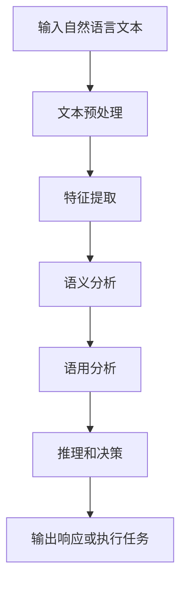

# 提高AI模型在复杂人机交互场景中的自然语言理解

> 关键词：AI模型、复杂人机交互、自然语言理解、语言处理技术、深度学习

> 摘要：本文聚焦于提高AI模型在复杂人机交互场景中的自然语言理解能力。首先介绍了相关背景，包括目的范围、预期读者等内容。接着阐述核心概念与联系，剖析自然语言理解的原理和架构。通过Python代码详细讲解核心算法原理及操作步骤，并给出数学模型和公式进行理论支撑。在项目实战部分，展示代码实际案例并进行详细解释。探讨了实际应用场景，推荐了学习、开发相关的工具和资源，包括书籍、在线课程、开发框架等。最后总结未来发展趋势与挑战，给出常见问题解答和扩展阅读参考资料，旨在全面提升对AI模型在复杂人机交互中自然语言理解的认识和技术水平。

## 1. 背景介绍 
### 1.1 目的和范围
随着人工智能技术的飞速发展，人机交互变得越来越频繁和复杂。自然语言作为人类最自然的交流方式，让AI模型能够准确理解自然语言在复杂人机交互场景中具有至关重要的意义。本文章的目的在于深入探讨如何提高AI模型在这种复杂场景下的自然语言理解能力，涵盖从理论基础到实际应用的多个方面。范围包括自然语言理解的核心概念、相关算法原理、数学模型，以及通过项目实战展示如何实现和优化相关技术，同时探讨其在不同实际场景中的应用。

### 1.2 预期读者
本文预期读者包括对人工智能、自然语言处理领域感兴趣的科研人员、开发人员、学生，以及希望了解如何提升AI模型自然语言理解能力的相关从业者。无论是希望深入研究理论知识，还是想要在实际项目中应用相关技术的读者，都能从本文中获取有价值的信息。

### 1.3 文档结构概述
本文将按照以下结构进行阐述：首先介绍背景知识，包括目的、读者和文档结构等。接着深入讲解核心概念与联系，通过文本示意图和Mermaid流程图展示自然语言理解的原理和架构。然后详细阐述核心算法原理和具体操作步骤，结合Python代码进行说明。给出数学模型和公式并进行详细讲解和举例。在项目实战部分，展示开发环境搭建、源代码实现和代码解读。探讨实际应用场景，推荐相关工具和资源。最后总结未来发展趋势与挑战，给出常见问题解答和扩展阅读参考资料。

### 1.4 术语表
#### 1.4.1 核心术语定义
- **自然语言理解（Natural Language Understanding，NLU）**：指让计算机能够理解人类自然语言的含义，包括对语义、语法、语用等方面的分析和处理，从而实现与人类的有效交互。
- **AI模型（Artificial Intelligence Model）**：是一种基于人工智能技术构建的模型，用于解决各种复杂的任务，如自然语言处理、图像识别等。
- **人机交互（Human - Computer Interaction，HCI）**：研究人和计算机之间的信息交换和相互作用的技术和方法，旨在实现高效、自然、舒适的人机交流。

#### 1.4.2 相关概念解释
- **语义分析**：对自然语言中词语、句子等的意义进行分析，确定其在特定语境下的准确含义。
- **语用分析**：考虑语言使用的语境、说话者的意图等因素，理解语言的实际意义和效果。
- **深度学习**：一种基于人工神经网络的机器学习方法，通过多层神经网络自动学习数据的特征和模式，在自然语言处理等领域取得了显著的成果。

#### 1.4.3 缩略词列表
- **NLU**：Natural Language Understanding（自然语言理解）
- **HCI**：Human - Computer Interaction（人机交互）
- **RNN**：Recurrent Neural Network（循环神经网络）
- **LSTM**：Long Short - Term Memory（长短期记忆网络）
- **GRU**：Gated Recurrent Unit（门控循环单元）
- **Transformer**：一种基于自注意力机制的深度学习模型架构

## 2. 核心概念与联系 

### 自然语言理解原理和架构的文本示意图

自然语言理解是一个复杂的过程，主要包括以下几个关键步骤：

1. **文本预处理**：对输入的自然语言文本进行清洗和规范化处理，包括去除噪声、分词、词性标注、命名实体识别等操作。例如，将一段文本中的标点符号、特殊字符去除，将文本分割成单个的词语，并为每个词语标注词性，识别出其中的人名、地名等实体。
2. **特征提取**：从预处理后的文本中提取有用的特征，以便后续的模型处理。这些特征可以是词向量、句子向量等。词向量是将词语表示为向量的形式，使得计算机能够更好地处理和理解词语之间的语义关系。
3. **语义分析**：分析文本的语义信息，确定词语和句子的含义。这可能涉及到语义角色标注、语义相似度计算等任务。语义角色标注是确定句子中每个词语在语义上的角色，如施事、受事等；语义相似度计算则是判断两个句子或词语在语义上的相似程度。
4. **语用分析**：考虑语言使用的语境和说话者的意图，理解文本的实际意义。这需要结合上下文信息、用户的历史交互记录等进行综合分析。
5. **推理和决策**：根据语义和语用分析的结果，进行推理和决策，生成合适的响应或执行相应的任务。例如，在智能客服系统中，根据用户的问题和分析结果，给出准确的回答或提供相关的服务建议。

### Mermaid流程图



这个流程图展示了自然语言理解的基本流程，从输入自然语言文本开始，经过一系列的处理步骤，最终输出相应的响应或执行任务。每个步骤都是紧密相连的，前一个步骤的输出作为后一个步骤的输入，共同完成自然语言理解的任务。

## 3. 核心算法原理 & 具体操作步骤 

### 基于LSTM的自然语言理解算法原理

LSTM（长短期记忆网络）是一种特殊的循环神经网络（RNN），它能够有效地解决传统RNN在处理长序列数据时的梯度消失和梯度爆炸问题。在自然语言理解中，LSTM可以用于处理文本序列，学习文本中的上下文信息，从而更好地理解自然语言的含义。

LSTM的核心是细胞状态（cell state），它可以在时间步之间传递信息。LSTM通过三个门控机制来控制细胞状态的更新和信息的流动，分别是输入门（input gate）、遗忘门（forget gate）和输出门（output gate）。

#### Python代码实现

```python
import torch
import torch.nn as nn

class LSTMModel(nn.Module):
    def __init__(self, input_size, hidden_size, num_layers, output_size):
        super(LSTMModel, self).__init__()
        self.hidden_size = hidden_size
        self.num_layers = num_layers
        self.lstm = nn.LSTM(input_size, hidden_size, num_layers, batch_first=True)
        self.fc = nn.Linear(hidden_size, output_size)

    def forward(self, x):
        h0 = torch.zeros(self.num_layers, x.size(0), self.hidden_size).to(x.device)
        c0 = torch.zeros(self.num_layers, x.size(0), self.hidden_size).to(x.device)

        out, _ = self.lstm(x, (h0, c0))
        out = self.fc(out[:, -1, :])
        return out
```

### 具体操作步骤

1. **数据准备**：收集和整理自然语言文本数据，并进行预处理，包括分词、词向量转换等操作。将文本数据转换为模型可以接受的输入格式，通常是数值型的向量序列。
2. **模型定义**：使用上述Python代码定义LSTM模型，设置输入大小、隐藏层大小、层数和输出大小等参数。
3. **模型训练**：选择合适的损失函数和优化器，如交叉熵损失函数和Adam优化器。将预处理后的数据输入到模型中进行训练，通过不断调整模型的参数，使得模型的预测结果与真实标签之间的损失最小化。
4. **模型评估**：使用测试数据集对训练好的模型进行评估，计算模型的准确率、召回率、F1值等指标，评估模型的性能。
5. **模型应用**：将训练好的模型应用到实际的人机交互场景中，对用户输入的自然语言文本进行理解和处理，生成相应的响应。

## 4. 数学模型和公式 & 详细讲解 & 举例说明 

### LSTM的数学模型和公式

#### 遗忘门
遗忘门决定了细胞状态中哪些信息需要被遗忘。其计算公式为：

$$f_t = \sigma(W_f[h_{t - 1}, x_t] + b_f)$$

其中，$f_t$ 是遗忘门在时间步 $t$ 的输出，$\sigma$ 是 sigmoid 函数，$W_f$ 是遗忘门的权重矩阵，$h_{t - 1}$ 是上一个时间步的隐藏状态，$x_t$ 是当前时间步的输入，$b_f$ 是遗忘门的偏置项。

#### 输入门
输入门决定了哪些新的信息需要被添加到细胞状态中。其计算公式为：

$$i_t = \sigma(W_i[h_{t - 1}, x_t] + b_i)$$

$$\tilde{C}_t = \tanh(W_C[h_{t - 1}, x_t] + b_C)$$

其中，$i_t$ 是输入门在时间步 $t$ 的输出，$\tilde{C}_t$ 是候选细胞状态，$W_i$ 和 $W_C$ 分别是输入门和候选细胞状态的权重矩阵，$b_i$ 和 $b_C$ 分别是输入门和候选细胞状态的偏置项。

#### 细胞状态更新
细胞状态根据遗忘门和输入门的输出进行更新。其计算公式为：

$$C_t = f_t \odot C_{t - 1} + i_t \odot \tilde{C}_t$$

其中，$C_t$ 是时间步 $t$ 的细胞状态，$\odot$ 表示逐元素相乘。

#### 输出门
输出门决定了细胞状态中哪些信息需要被输出到隐藏状态中。其计算公式为：

$$o_t = \sigma(W_o[h_{t - 1}, x_t] + b_o)$$

$$h_t = o_t \odot \tanh(C_t)$$

其中，$o_t$ 是输出门在时间步 $t$ 的输出，$h_t$ 是时间步 $t$ 的隐藏状态，$W_o$ 是输出门的权重矩阵，$b_o$ 是输出门的偏置项。

### 详细讲解

遗忘门通过 sigmoid 函数将输入信息映射到 $[0, 1]$ 之间，决定了细胞状态中哪些信息需要被遗忘。输入门同样使用 sigmoid 函数决定哪些新的信息需要被添加，候选细胞状态使用 tanh 函数将输入信息映射到 $[-1, 1]$ 之间。细胞状态的更新是通过遗忘门和输入门的逐元素相乘来实现的，保留了需要的信息并添加了新的信息。输出门通过 sigmoid 函数决定哪些细胞状态的信息需要被输出到隐藏状态中，隐藏状态再通过 tanh 函数进行处理。

### 举例说明

假设我们有一个简单的文本序列 “I like apples”，经过分词和词向量转换后，每个词语对应一个向量表示。在时间步 $t = 1$ 时，输入 $x_1$ 是 “I” 的词向量，上一个时间步的隐藏状态 $h_0$ 初始化为零向量。通过遗忘门、输入门、细胞状态更新和输出门的计算，得到当前时间步的细胞状态 $C_1$ 和隐藏状态 $h_1$。在后续的时间步中，依次处理 “like” 和 “apples” 的词向量，不断更新细胞状态和隐藏状态，从而学习到文本序列的上下文信息。

## 5. 项目实战：代码实际案例和详细解释说明 

### 5.1  开发环境搭建

#### 硬件环境
- 建议使用具有 GPU 加速功能的计算机，如 NVIDIA GPU，以提高模型训练的速度。

#### 软件环境
- **操作系统**：可以选择 Linux（如 Ubuntu）、Windows 或 macOS。
- **Python 版本**：推荐使用 Python 3.6 及以上版本。
- **深度学习框架**：使用 PyTorch 深度学习框架，可通过以下命令安装：
```sh
pip install torch torchvision
```
- **其他依赖库**：安装 NLTK（自然语言工具包）、NumPy、Pandas 等库，用于文本预处理和数据处理：
```sh
pip install nltk numpy pandas
```

### 5.2  源代码详细实现和代码解读

```python
import torch
import torch.nn as nn
import torch.optim as optim
from nltk.tokenize import word_tokenize
import numpy as np
import pandas as pd

# 数据预处理
def preprocess_text(text):
    tokens = word_tokenize(text.lower())
    return tokens

# 构建词汇表
def build_vocab(texts):
    vocab = set()
    for text in texts:
        tokens = preprocess_text(text)
        vocab.update(tokens)
    vocab = sorted(vocab)
    word2idx = {word: idx for idx, word in enumerate(vocab)}
    idx2word = {idx: word for idx, word in enumerate(vocab)}
    return word2idx, idx2word

# 将文本转换为向量
def text_to_vector(text, word2idx):
    tokens = preprocess_text(text)
    vector = [word2idx[word] for word in tokens if word in word2idx]
    return vector

# 定义 LSTM 模型
class LSTMModel(nn.Module):
    def __init__(self, input_size, hidden_size, num_layers, output_size):
        super(LSTMModel, self).__init__()
        self.hidden_size = hidden_size
        self.num_layers = num_layers
        self.lstm = nn.LSTM(input_size, hidden_size, num_layers, batch_first=True)
        self.fc = nn.Linear(hidden_size, output_size)

    def forward(self, x):
        h0 = torch.zeros(self.num_layers, x.size(0), self.hidden_size).to(x.device)
        c0 = torch.zeros(self.num_layers, x.size(0), self.hidden_size).to(x.device)

        out, _ = self.lstm(x, (h0, c0))
        out = self.fc(out[:, -1, :])
        return out

# 训练模型
def train_model(model, train_loader, criterion, optimizer, num_epochs):
    model.train()
    for epoch in range(num_epochs):
        running_loss = 0.0
        for inputs, labels in train_loader:
            optimizer.zero_grad()
            outputs = model(inputs)
            loss = criterion(outputs, labels)
            loss.backward()
            optimizer.step()
            running_loss += loss.item()
        print(f'Epoch {epoch + 1}/{num_epochs}, Loss: {running_loss / len(train_loader)}')

# 主函数
if __name__ == '__main__':
    # 示例数据
    texts = ["I like apples", "She likes bananas", "They eat oranges"]
    labels = [0, 1, 2]

    # 构建词汇表
    word2idx, idx2word = build_vocab(texts)

    # 将文本转换为向量
    vectors = [text_to_vector(text, word2idx) for text in texts]
    vectors = [torch.tensor(vector).unsqueeze(0) for vector in vectors]
    labels = torch.tensor(labels)

    # 定义模型参数
    input_size = len(word2idx)
    hidden_size = 64
    num_layers = 2
    output_size = 3

    # 初始化模型
    model = LSTMModel(input_size, hidden_size, num_layers, output_size)

    # 定义损失函数和优化器
    criterion = nn.CrossEntropyLoss()
    optimizer = optim.Adam(model.parameters(), lr=0.001)

    # 训练模型
    train_model(model, zip(vectors, labels), criterion, optimizer, num_epochs=10)
```

### 5.3  代码解读与分析

1. **数据预处理**：`preprocess_text` 函数使用 NLTK 库对输入的文本进行分词和小写处理，将文本转换为单词列表。
2. **构建词汇表**：`build_vocab` 函数遍历所有文本，提取出所有的单词，构建词汇表，并生成单词到索引和索引到单词的映射。
3. **文本向量化**：`text_to_vector` 函数将文本转换为单词索引的向量，方便模型处理。
4. **定义 LSTM 模型**：`LSTMModel` 类继承自 `nn.Module`，定义了一个 LSTM 模型，包括 LSTM 层和全连接层。
5. **训练模型**：`train_model` 函数使用交叉熵损失函数和 Adam 优化器对模型进行训练，通过多次迭代更新模型的参数。
6. **主函数**：在主函数中，我们使用示例数据进行训练，包括文本和对应的标签。首先构建词汇表，将文本转换为向量，然后初始化模型，定义损失函数和优化器，最后调用 `train_model` 函数进行训练。

## 6. 实际应用场景 

### 智能客服系统