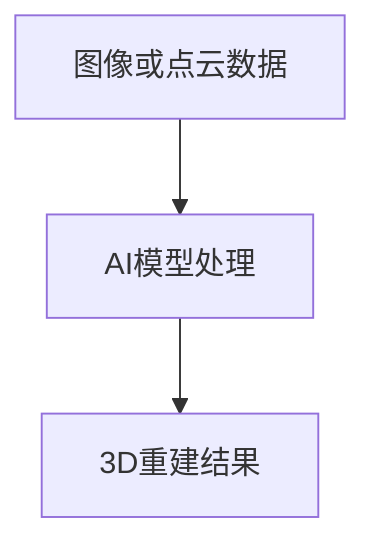

# 提高AI模型在复杂场景3D重建任务中的精度

> 关键词：AI模型、复杂场景、3D重建、精度提升、算法原理

> 摘要：本文聚焦于如何提高AI模型在复杂场景3D重建任务中的精度。首先介绍了相关背景，包括目的范围、预期读者等内容。接着阐述核心概念与联系，给出原理和架构的示意图与流程图。详细讲解核心算法原理并以Python代码说明，分析数学模型和公式。通过项目实战展示代码实现与解读，探讨实际应用场景。推荐了学习资源、开发工具框架和相关论文著作。最后总结未来发展趋势与挑战，解答常见问题并提供扩展阅读和参考资料，旨在为从事相关领域的研究者和开发者提供全面且深入的技术指导。

## 1. 背景介绍 
### 1.1 目的和范围
随着计算机视觉和人工智能技术的飞速发展，3D重建在众多领域如虚拟现实、增强现实、机器人导航、文化遗产保护等展现出巨大的应用潜力。然而，复杂场景下的3D重建面临诸多挑战，如光照变化、遮挡、物体表面材质多样性等，导致重建精度难以满足实际需求。本文的目的在于深入探讨提高AI模型在复杂场景3D重建任务中精度的方法和技术，涵盖从理论基础到实际应用的多个方面，包括核心概念、算法原理、数学模型、项目实战等，为相关研究和开发提供全面的技术指导。

### 1.2 预期读者
本文预期读者包括计算机视觉、人工智能领域的研究者、开发者，对3D重建技术感兴趣的学生，以及从事相关行业如游戏开发、工业设计、测绘等的专业人士。这些读者希望通过阅读本文，深入了解复杂场景3D重建的技术原理和精度提升方法，为其研究和实践提供参考。

### 1.3 文档结构概述
本文将按照以下结构进行组织：首先介绍背景知识，包括目的范围、预期读者和文档结构概述；接着阐述核心概念与联系，给出相关原理和架构的示意图与流程图；详细讲解核心算法原理并通过Python代码进行具体说明；分析数学模型和公式，并举例说明；进行项目实战，包括开发环境搭建、源代码实现与解读；探讨实际应用场景；推荐学习资源、开发工具框架和相关论文著作；最后总结未来发展趋势与挑战，解答常见问题并提供扩展阅读和参考资料。

### 1.4 术语表
#### 1.4.1 核心术语定义
- **3D重建**：指通过对物体或场景的二维图像或点云数据进行处理，恢复其三维几何形状和结构的过程。
- **AI模型**：利用人工智能技术构建的模型，如深度学习模型，用于解决特定的任务，在本文中主要用于3D重建。
- **复杂场景**：包含光照变化、遮挡、物体表面材质多样性等多种复杂因素的场景，增加了3D重建的难度。
- **精度**：指重建结果与真实场景之间的接近程度，通常用误差指标来衡量。

#### 1.4.2 相关概念解释
- **点云数据**：由大量的三维点组成的数据集合，每个点包含其在三维空间中的坐标信息，是3D重建中常用的数据形式。
- **深度学习**：一种基于人工神经网络的机器学习方法，通过多层神经网络自动学习数据的特征和模式，在图像和3D数据处理中取得了显著的成果。
- **卷积神经网络（CNN）**：一种专门用于处理具有网格结构数据（如图像）的深度学习模型，通过卷积层、池化层等操作提取数据的特征。

#### 1.4.3 缩略词列表
- **CNN**：Convolutional Neural Network，卷积神经网络
- **RNN**：Recurrent Neural Network，循环神经网络
- **GAN**：Generative Adversarial Network，生成对抗网络
- **RGB**：Red, Green, Blue，红、绿、蓝，用于表示彩色图像的颜色通道

## 2. 核心概念与联系 

### 2.1 3D重建的基本原理
3D重建的基本原理是通过多个视角的二维图像或点云数据，恢复物体或场景的三维几何形状和结构。常见的3D重建方法可以分为基于多视图立体视觉（Multi-View Stereo, MVS）和基于深度传感器（如激光雷达、结构光相机）的方法。

基于多视图立体视觉的方法通过分析不同视角下的图像，利用特征匹配和三角测量原理计算出场景中每个点的三维坐标。具体步骤包括图像采集、特征提取、特征匹配、相机标定和三角测量等。

基于深度传感器的方法则直接获取场景中每个点的深度信息，通过将深度信息与相机的内参和外参相结合，将深度图像转换为三维点云数据。

### 2.2 AI模型在3D重建中的应用
AI模型，特别是深度学习模型，在3D重建中发挥着越来越重要的作用。深度学习模型可以自动学习数据的特征和模式，从而提高3D重建的精度和效率。常见的深度学习模型包括卷积神经网络（CNN）、循环神经网络（RNN）和生成对抗网络（GAN）等。

CNN可以用于图像特征提取和深度估计，通过卷积层和池化层自动学习图像的局部特征。RNN可以用于处理序列数据，如视频序列中的3D重建。GAN可以用于生成逼真的3D模型，通过生成器和判别器的对抗训练，提高生成模型的质量。

### 2.3 核心概念的联系
3D重建的基本原理为AI模型的应用提供了数据基础和问题定义。AI模型则通过学习数据的特征和模式，优化3D重建的过程和结果。例如，CNN可以用于提取图像的特征，这些特征可以用于多视图立体视觉中的特征匹配和深度估计。GAN可以用于生成逼真的3D模型，这些模型可以用于补充和完善3D重建的结果。

### 2.4 文本示意图
```plaintext
             +----------------+
             |  图像或点云数据  |
             +----------------+
                      |
                      v
             +----------------+
             |  AI模型处理    |
             +----------------+
                      |
                      v
             +----------------+
             |  3D重建结果    |
             +----------------+
```

### 2.5 Mermaid流程图


## 3. 核心算法原理 & 具体操作步骤 

### 3.1 基于深度学习的深度估计算法原理
基于深度学习的深度估计算法通过CNN学习图像中的特征，从而预测每个像素的深度值。常见的深度估计网络结构包括编码器 - 解码器结构和多尺度特征融合结构。

编码器 - 解码器结构将输入图像通过一系列卷积层和池化层进行下采样，得到特征图，然后通过反卷积层和上采样层将特征图恢复到原始图像的大小，输出深度图。

多尺度特征融合结构则在不同尺度上提取图像的特征，并将这些特征进行融合，以提高深度估计的精度。

### 3.2 具体操作步骤
以下是一个基于Python和PyTorch实现的简单深度估计网络的代码示例：

```python
import torch
import torch.nn as nn

# 定义一个简单的深度估计网络
class DepthEstimationNet(nn.Module):
    def __init__(self):
        super(DepthEstimationNet, self).__init__()
        self.encoder = nn.Sequential(
            nn.Conv2d(3, 64, kernel_size=3, stride=1, padding=1),
            nn.ReLU(inplace=True),
            nn.MaxPool2d(kernel_size=2, stride=2),
            nn.Conv2d(64, 128, kernel_size=3, stride=1, padding=1),
            nn.ReLU(inplace=True),
            nn.MaxPool2d(kernel_size=2, stride=2)
        )
        self.decoder = nn.Sequential(
            nn.ConvTranspose2d(128, 64, kernel_size=2, stride=2),
            nn.ReLU(inplace=True),
            nn.ConvTranspose2d(64, 1, kernel_size=2, stride=2),
            nn.Sigmoid()
        )

    def forward(self, x):
        x = self.encoder(x)
        x = self.decoder(x)
        return x

# 初始化网络
net = DepthEstimationNet()

# 定义输入数据
input_image = torch.randn(1, 3, 256, 256)

# 前向传播
output_depth = net(input_image)

print("Output depth shape:", output_depth.shape)
```

### 3.3 代码解释
- `DepthEstimationNet` 类继承自 `nn.Module`，定义了一个简单的深度估计网络。
- `encoder` 部分通过卷积层和池化层对输入图像进行下采样，提取特征。
- `decoder` 部分通过反卷积层和上采样层将特征图恢复到原始图像的大小，输出深度图。
- `forward` 方法定义了网络的前向传播过程。
- 最后，初始化网络，定义输入数据并进行前向传播，输出深度图的形状。

## 4. 数学模型和公式 & 详细讲解 & 举例说明 

### 4.1 三角测量原理
三角测量是多视图立体视觉中计算三维点坐标的基本方法。假设在两个不同的视角下观察到同一个点 $P$，其在两个相机坐标系下的投影点分别为 $p_1$ 和 $p_2$。设两个相机的光心分别为 $C_1$ 和 $C_2$，相机的内参矩阵分别为 $K_1$ 和 $K_2$，外参矩阵分别为 $[R_1|t_1]$ 和 $[R_2|t_2]$。

根据相机投影模型，有：

$$
\begin{cases}
\lambda_1 p_1 = K_1 [R_1|t_1] P \\
\lambda_2 p_2 = K_2 [R_2|t_2] P
\end{cases}
$$

其中，$\lambda_1$ 和 $\lambda_2$ 是投影点的深度值。通过联立这两个方程，可以求解出点 $P$ 的三维坐标。

### 4.2 最小二乘法求解
在实际应用中，由于测量误差的存在，上述方程可能无法精确求解。因此，通常采用最小二乘法来求解点 $P$ 的三维坐标。最小二乘法的目标是最小化投影误差的平方和：

$$
\min_P \sum_{i=1}^n \left\| \lambda_i p_i - K_i [R_i|t_i] P \right\|^2
$$

其中，$n$ 是视角的数量。

### 4.3 举例说明
假设我们有两个相机，其内参矩阵分别为：

$$
K_1 = \begin{bmatrix}
f_1 & 0 & c_{x1} \\
0 & f_1 & c_{y1} \\
0 & 0 & 1
\end{bmatrix},
K_2 = \begin{bmatrix}
f_2 & 0 & c_{x2} \\
0 & f_2 & c_{y2} \\
0 & 0 & 1
\end{bmatrix}
$$

外参矩阵分别为：

$$
[R_1|t_1] = \begin{bmatrix}
1 & 0 & 0 & 0 \\
0 & 1 & 0 & 0 \\
0 & 0 & 1 & 0
\end{bmatrix},
[R_2|t_2] = \begin{bmatrix}
1 & 0 & 0 & d \\
0 & 1 & 0 & 0 \\
0 & 0 & 1 & 0
\end{bmatrix}
$$

其中，$f_1$ 和 $f_2$ 是相机的焦距，$c_{x1}, c_{y1}, c_{x2}, c_{y2}$ 是相机的主点坐标，$d$ 是两个相机之间的基线距离。

设点 $P$ 的三维坐标为 $(X, Y, Z)$，其在两个相机坐标系下的投影点分别为 $(u_1, v_1)$ 和 $(u_2, v_2)$。则有：

$$
\begin{cases}
\lambda_1 \begin{bmatrix} u_1 \\ v_1 \\ 1 \end{bmatrix} = K_1 \begin{bmatrix} 1 & 0 & 0 & 0 \\ 0 & 1 & 0 & 0 \\ 0 & 0 & 1 & 0 \end{bmatrix} \begin{bmatrix} X \\ Y \\ Z \\ 1 \end{bmatrix} \\
\lambda_2 \begin{bmatrix} u_2 \\ v_2 \\ 1 \end{bmatrix} = K_2 \begin{bmatrix} 1 & 0 & 0 & d \\ 0 & 1 & 0 & 0 \\ 0 & 0 & 1 & 0 \end{bmatrix} \begin{bmatrix} X \\ Y \\ Z \\ 1 \end{bmatrix}
\end{cases}
$$

通过联立这两个方程，并采用最小二乘法求解，可以得到点 $P$ 的三维坐标。

## 5. 项目实战：代码实际案例和详细解释说明 

### 5.1  开发环境搭建
#### 5.1.1 安装Python
首先，需要安装Python环境。建议使用Python 3.7及以上版本。可以从Python官方网站（https://www.python.org/downloads/）下载并安装。

#### 5.1.2 安装深度学习框架
本文使用PyTorch作为深度学习框架。可以通过以下命令安装PyTorch：

```sh
pip install torch torchvision
```

#### 5.1.3 安装其他依赖库
还需要安装一些其他的依赖库，如NumPy、OpenCV等。可以通过以下命令安装：

```sh
pip install numpy opencv-python
```

### 5.2  源代码详细实现和代码解读
以下是一个完整的基于深度学习的3D重建项目的代码示例：

```python
import torch
import torch.nn as nn
import torch.optim as optim
import numpy as np
import cv2

# 定义一个简单的深度估计网络
class DepthEstimationNet(nn.Module):
    def __init__(self):
        super(DepthEstimationNet, self).__init__()
        self.encoder = nn.Sequential(
            nn.Conv2d(3, 64, kernel_size=3, stride=1, padding=1),
            nn.ReLU(inplace=True),
            nn.MaxPool2d(kernel_size=2, stride=2),
            nn.Conv2d(64, 128, kernel_size=3, stride=1, padding=1),
            nn.ReLU(inplace=True),
            nn.MaxPool2d(kernel_size=2, stride=2)
        )
        self.decoder = nn.Sequential(
            nn.ConvTranspose2d(128, 64, kernel_size=2, stride=2),
            nn.ReLU(inplace=True),
            nn.ConvTranspose2d(64, 1, kernel_size=2, stride=2),
            nn.Sigmoid()
        )

    def forward(self, x):
        x = self.encoder(x)
        x = self.decoder(x)
        return x

# 加载数据集
def load_dataset():
    # 这里简单模拟加载数据集
    images = np.random.randn(100, 3, 256, 256).astype(np.float32)
    depths = np.random.randn(100, 1, 256, 256).astype(np.float32)
    images = torch.from_numpy(images)
    depths = torch.from_numpy(depths)
    return images, depths

# 训练模型
def train_model():
    # 初始化网络
    net = DepthEstimationNet()

    # 定义损失函数和优化器
    criterion = nn.MSELoss()
    optimizer = optim.Adam(net.parameters(), lr=0.001)

    # 加载数据集
    images, depths = load_dataset()

    # 训练模型
    num_epochs = 10
    for epoch in range(num_epochs):
        running_loss = 0.0
        for i in range(len(images)):
            inputs = images[i].unsqueeze(0)
            labels = depths[i].unsqueeze(0)

            # 清零梯度
            optimizer.zero_grad()

            # 前向传播
            outputs = net(inputs)

            # 计算损失
            loss = criterion(outputs, labels)

            # 反向传播和优化
            loss.backward()
            optimizer.step()

            running_loss += loss.item()

        print(f'Epoch {epoch + 1}, Loss: {running_loss / len(images)}')

    print('Finished Training')

# 测试模型
def test_model():
    # 初始化网络
    net = DepthEstimationNet()

    # 加载预训练模型
    net.load_state_dict(torch.load('model.pth'))

    # 加载测试图像
    test_image = np.random.randn(1, 3, 256, 256).astype(np.float32)
    test_image = torch.from_numpy(test_image)

    # 前向传播
    with torch.no_grad():
        output_depth = net(test_image)

    # 可视化深度图
    output_depth = output_depth.squeeze().numpy()
    output_depth = cv2.normalize(output_depth, None, 0, 255, cv2.NORM_MINMAX, dtype=cv2.CV_8U)
    cv2.imshow('Depth Map', output_depth)
    cv2.waitKey(0)
    cv2.destroyAllWindows()

if __name__ == '__main__':
    train_model()
    # 保存模型
    net = DepthEstimationNet()
    torch.save(net.state_dict(), 'model.pth')
    test_model()
```

### 5.3  代码解读与分析
- **深度估计网络定义**：`DepthEstimationNet` 类定义了一个简单的深度估计网络，包括编码器和解码器两部分。
- **数据集加载**：`load_dataset` 函数模拟加载数据集，实际应用中需要根据具体情况进行修改。
- **模型训练**：`train_model` 函数定义了模型的训练过程，包括定义损失函数、优化器，加载数据集，进行前向传播、反向传播和优化等步骤。
- **模型测试**：`test_model` 函数定义了模型的测试过程，包括加载预训练模型，加载测试图像，进行前向传播，可视化深度图等步骤。

## 6. 实际应用场景 
### 6.1 虚拟现实和增强现实
在虚拟现实（VR）和增强现实（AR）应用中，需要精确的3D场景重建来提供逼真的虚拟体验。例如，在VR游戏中，通过3D重建技术可以将现实场景中的物体和环境精确地重建到虚拟世界中，让玩家有更加身临其境的感觉。在AR应用中，3D重建可以将虚拟物体与现实场景进行精确的融合，实现更加自然和真实的增强效果。

### 6.2 机器人导航
机器人在复杂环境中导航时，需要对周围环境进行精确的3D建模。通过3D重建技术，机器人可以获取周围环境的三维几何信息，从而规划出更加安全和高效的路径。例如，在室内环境中，机器人可以通过3D重建技术识别出障碍物和通道，避免碰撞并顺利到达目标位置。

### 6.3 文化遗产保护
文化遗产保护领域需要对古建筑、文物等进行精确的3D重建，以便进行数字化存档和修复。通过3D重建技术，可以获取文物和古建筑的详细三维信息，为保护和修复工作提供重要的依据。例如，对于一些古建筑，可以通过3D重建技术生成精确的三维模型，用于研究其结构和历史变迁。

### 6.4 工业设计和制造
在工业设计和制造领域，3D重建技术可以用于产品的设计和质量检测。通过对产品进行3D重建，可以获取产品的精确三维模型，用于设计改进和虚拟装配。在质量检测方面，3D重建技术可以检测产品的尺寸和形状是否符合设计要求，提高产品的质量和生产效率。

## 7. 工具和资源推荐
### 7.1 学习资源推荐
#### 7.1.1 书籍推荐
- 《计算机视觉：算法与应用》：这本书全面介绍了计算机视觉的基本算法和应用，包括3D重建、特征提取、目标检测等内容，是计算机视觉领域的经典教材。
- 《深度学习》：由Ian Goodfellow、Yoshua Bengio和Aaron Courville所著，系统地介绍了深度学习的基本原理和方法，包括神经网络、卷积神经网络、循环神经网络等，是深度学习领域的权威书籍。
- 《3D计算机视觉：方法与应用》：专门介绍了3D计算机视觉的方法和应用，包括3D重建、三维目标识别、三维运动估计等内容，适合对3D计算机视觉感兴趣的读者。

#### 7.1.2 在线课程
- Coursera上的“计算机视觉基础”课程：由华盛顿大学的教授授课，系统地介绍了计算机视觉的基本概念和算法，包括图像滤波、特征提取、立体视觉等内容。
- edX上的“深度学习基础”课程：由卡内基梅隆大学的教授授课，介绍了深度学习的基本原理和方法，包括神经网络、卷积神经网络、循环神经网络等内容。
- Udemy上的“3D重建实战课程”：通过实际项目案例，介绍了3D重建的方法和技术，包括基于多视图立体视觉和基于深度传感器的3D重建方法。

#### 7.1.3 技术博客和网站
- OpenCV官方文档和博客：OpenCV是计算机视觉领域的开源库，其官方文档和博客提供了丰富的计算机视觉算法和应用的资料。
- PyTorch官方文档和论坛：PyTorch是深度学习领域的开源框架，其官方文档和论坛提供了详细的框架使用说明和社区交流平台。
- 计算机视觉国际会议（CVPR、ICCV、ECCV）的官方网站：这些会议是计算机视觉领域的顶级会议，其官方网站提供了最新的研究成果和论文。

### 7.2 开发工具框架推荐
#### 7.2.1 IDE和编辑器
- PyCharm：是一款专门用于Python开发的集成开发环境（IDE），提供了丰富的代码编辑、调试、版本控制等功能，适合开发Python深度学习项目。
- Jupyter Notebook：是一个交互式的开发环境，支持Python、R等多种编程语言，适合进行数据探索、模型训练和可视化等工作。
- Visual Studio Code：是一款轻量级的代码编辑器，支持多种编程语言和插件扩展，适合快速开发和调试代码。

#### 7.2.2 调试和性能分析工具
- PyTorch Profiler：是PyTorch提供的性能分析工具，可以分析模型的计算时间、内存使用等情况，帮助优化模型性能。
- TensorBoard：是TensorFlow提供的可视化工具，也可以与PyTorch结合使用，用于可视化模型的训练过程、损失曲线、模型结构等信息。
- PDB：是Python自带的调试工具，可以在代码中设置断点，逐步调试代码，帮助定位和解决问题。

#### 7.2.3 相关框架和库
- OpenCV：是计算机视觉领域的开源库，提供了丰富的计算机视觉算法和工具，包括图像滤波、特征提取、立体视觉等功能。
- PyTorch：是深度学习领域的开源框架，提供了丰富的深度学习模型和工具，包括卷积神经网络、循环神经网络、生成对抗网络等。
- NumPy：是Python的科学计算库，提供了高效的多维数组和矩阵运算功能，是深度学习和计算机视觉项目中常用的库。

### 7.3 相关论文著作推荐
#### 7.3.1 经典论文
- "Multiple View Geometry in Computer Vision"：由Richard Hartley和Andrew Zisserman所著，是计算机视觉领域的经典著作，系统地介绍了多视图几何的理论和方法，包括相机模型、投影几何、立体视觉等内容。
- "ImageNet Classification with Deep Convolutional Neural Networks"：由Alex Krizhevsky、Ilya Sutskever和Geoffrey E. Hinton所著，介绍了第一个在大规模图像分类任务上取得优异成绩的卷积神经网络AlexNet，开创了深度学习在计算机视觉领域的应用先河。
- "Generative Adversarial Nets"：由Ian Goodfellow等人所著，介绍了生成对抗网络（GAN）的基本原理和方法，GAN在图像生成、3D模型生成等领域取得了显著的成果。

#### 7.3.2 最新研究成果
- 每年的计算机视觉国际会议（CVPR、ICCV、ECCV）上都会发表大量的最新研究成果，涉及3D重建、深度学习、计算机视觉等多个领域。可以关注这些会议的官方网站，获取最新的研究动态。
- arXiv是一个预印本平台，许多计算机视觉领域的研究者会在上面发表最新的研究成果。可以通过搜索关键词“3D reconstruction”、“deep learning”等，获取相关的最新研究论文。

#### 7.3.3 应用案例分析
- 《3D Reconstruction in Computer Vision: Theory and Practice》：这本书介绍了3D重建在计算机视觉领域的理论和实践应用，包括基于多视图立体视觉、基于深度传感器、基于深度学习等多种3D重建方法，并通过实际案例进行了详细的分析。
- 《Computer Vision for Cultural Heritage: From 2D to 3D》：介绍了计算机视觉技术在文化遗产保护领域的应用，包括2D图像分析、3D重建、虚拟现实等内容，并通过实际案例展示了如何利用计算机视觉技术对文化遗产进行保护和数字化存档。

## 8. 总结：未来发展趋势与挑战
### 8.1 未来发展趋势
#### 8.1.1 多模态数据融合
未来的3D重建技术将越来越多地融合多种模态的数据，如RGB图像、深度图像、激光雷达点云等。通过融合不同模态的数据，可以充分利用各种数据的优势，提高3D重建的精度和鲁棒性。例如，RGB图像可以提供丰富的纹理信息，深度图像可以提供精确的深度信息，激光雷达点云可以提供大范围的三维几何信息，将这些数据融合起来可以得到更加完整和准确的3D模型。

#### 8.1.2 实时3D重建
随着硬件技术的不断发展，实时3D重建将成为未来的一个重要发展方向。实时3D重建可以应用于机器人导航、增强现实等领域，需要在短时间内完成对场景的3D重建。未来的研究将致力于提高3D重建算法的效率，开发更加高效的硬件平台，实现实时3D重建。

#### 8.1.3 基于深度学习的端到端3D重建
深度学习在3D重建领域已经取得了显著的成果，未来的研究将进一步探索基于深度学习的端到端3D重建方法。端到端的3D重建方法可以直接从输入数据（如图像或点云）生成3D模型，避免了传统方法中多个步骤的复杂处理，提高了重建的效率和精度。

### 8.2 挑战
#### 8.2.1 复杂场景处理
复杂场景下的3D重建仍然是一个具有挑战性的问题。复杂场景中存在光照变化、遮挡、物体表面材质多样性等多种因素，这些因素会影响特征提取和匹配的准确性，从而降低3D重建的精度。未来的研究需要开发更加鲁棒的特征提取和匹配算法，以应对复杂场景的挑战。

#### 8.2.2 数据标注和模型训练
基于深度学习的3D重建方法需要大量的标注数据进行模型训练。然而，3D数据的标注比2D图像的标注更加困难和耗时，需要专业的设备和技术。此外，深度学习模型的训练需要大量的计算资源和时间，如何高效地进行数据标注和模型训练是一个亟待解决的问题。

#### 8.2.3 模型可解释性
深度学习模型通常被视为“黑盒子”，其决策过程和输出结果难以解释。在一些对安全性和可靠性要求较高的应用场景中，如机器人导航、自动驾驶等，模型的可解释性是一个重要的问题。未来的研究需要探索如何提高深度学习模型的可解释性，使模型的决策过程更加透明和可信。

## 9. 附录：常见问题与解答
### 9.1 如何选择合适的3D重建方法？
选择合适的3D重建方法需要考虑多个因素，如场景的复杂度、数据的类型和质量、重建的精度要求等。如果场景比较简单，数据质量较高，可以选择基于多视图立体视觉的方法；如果场景比较复杂，需要获取精确的深度信息，可以选择基于深度传感器的方法；如果需要利用深度学习的优势提高重建的精度和效率，可以选择基于深度学习的方法。

### 9.2 如何提高3D重建的精度？
提高3D重建的精度可以从多个方面入手，如选择合适的算法和模型、提高数据的质量、增加数据的数量、进行多模态数据融合等。此外，还可以通过优化算法参数、使用更复杂的模型结构、进行后处理等方法来提高重建的精度。

### 9.3 如何处理复杂场景下的3D重建问题？
处理复杂场景下的3D重建问题需要开发更加鲁棒的算法和模型。可以采用以下方法：
- 利用深度学习模型学习复杂场景的特征和模式，提高特征提取和匹配的准确性。
- 进行多模态数据融合，综合利用不同模态的数据来弥补单一数据的不足。
- 采用自适应的算法和模型，根据场景的变化自动调整参数和策略。

### 9.4 如何进行3D重建模型的评估？
评估3D重建模型的性能可以使用多种指标，如均方误差（MSE）、平均绝对误差（MAE）、结构相似性指数（SSIM）等。这些指标可以衡量重建结果与真实场景之间的差异。此外，还可以通过可视化重建结果、进行主观评估等方法来评估模型的性能。

## 10. 扩展阅读 & 参考资料
### 10.1 扩展阅读
- 《三维计算机视觉技术与应用》：深入介绍了三维计算机视觉的各种技术和应用，包括3D重建、三维目标识别、三维运动估计等内容，适合对三维计算机视觉有深入研究需求的读者。
- 《深度学习实战》：通过实际项目案例，介绍了深度学习在计算机视觉、自然语言处理、语音识别等领域的应用，帮助读者更好地理解和应用深度学习技术。
- 《计算机图形学原理与实践》：介绍了计算机图形学的基本原理和方法，包括三维建模、渲染、动画等内容，对于理解3D重建的后续应用有很大的帮助。

### 10.2 参考资料
- Hartley, R., & Zisserman, A. (2003). Multiple View Geometry in Computer Vision. Cambridge University Press.
- Krizhevsky, A., Sutskever, I., & Hinton, G. E. (2012). ImageNet Classification with Deep Convolutional Neural Networks. Advances in Neural Information Processing Systems.
- Goodfellow, I. J., et al. (2014). Generative Adversarial Nets. Advances in Neural Information Processing Systems.

作者：AI天才研究院/AI Genius Institute & 禅与计算机程序设计艺术 /Zen And The Art of Computer Programming