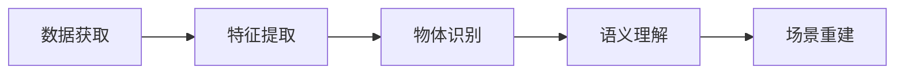

# 提高AI模型在复杂环境下的3D场景理解能力

> 关键词：AI模型、3D场景理解、复杂环境、深度学习、计算机视觉、多模态融合、语义理解

> 摘要：本文围绕提高AI模型在复杂环境下的3D场景理解能力展开。首先介绍了相关背景知识，包括研究目的、预期读者等。接着阐述了3D场景理解的核心概念与联系，通过文本示意图和Mermaid流程图进行清晰展示。详细讲解了核心算法原理及具体操作步骤，结合Python源代码进行说明。对涉及的数学模型和公式进行了深入分析并举例。通过项目实战，从开发环境搭建到源代码实现与解读，全面呈现实现过程。探讨了实际应用场景，推荐了学习、开发等相关工具和资源。最后总结了未来发展趋势与挑战，解答了常见问题，并提供扩展阅读与参考资料，旨在为提升AI模型在复杂3D场景中的理解能力提供全面的技术指导。

## 1. 背景介绍 
### 1.1 目的和范围
在当今的科技发展中，3D场景理解在众多领域都有着重要的应用，如自动驾驶、机器人导航、增强现实（AR）、虚拟现实（VR）等。然而，复杂环境下的3D场景包含大量的噪声、遮挡、动态变化等因素，这给AI模型的理解带来了巨大的挑战。本文章的目的在于深入探讨如何提高AI模型在这种复杂环境下的3D场景理解能力，研究范围涵盖了从基础的核心概念、算法原理，到实际的项目实战和应用场景等多个方面，旨在为相关领域的研究人员和开发者提供全面且深入的技术参考。

### 1.2 预期读者
本文预期读者主要包括计算机科学、人工智能、计算机视觉等领域的研究人员，他们希望深入了解3D场景理解技术的最新进展和提高模型性能的方法；也包括相关专业的学生，帮助他们系统地学习和掌握3D场景理解的相关知识和技能；同时，对于从事自动驾驶、机器人研发、AR/VR应用开发等行业的开发者来说，本文也能为他们在实际项目中遇到的3D场景理解问题提供解决方案和思路。

### 1.3 文档结构概述
本文将按照以下结构进行组织：首先介绍背景知识，让读者对3D场景理解的研究目的、读者群体和文档结构有初步的了解；接着阐述3D场景理解的核心概念与联系，通过文本示意图和Mermaid流程图帮助读者建立清晰的概念框架；然后详细讲解核心算法原理及具体操作步骤，并结合Python源代码进行说明；对涉及的数学模型和公式进行深入分析并举例；通过项目实战，从开发环境搭建到源代码实现与解读，全面呈现实现过程；探讨实际应用场景；推荐学习、开发等相关工具和资源；最后总结未来发展趋势与挑战，解答常见问题，并提供扩展阅读与参考资料。

### 1.4 术语表
#### 1.4.1 核心术语定义
- **3D场景理解**：指AI模型对三维空间中场景的感知、分析和解释，包括识别场景中的物体、理解物体之间的关系以及场景的语义信息等。
- **复杂环境**：包含大量噪声、遮挡、动态变化、光照变化等复杂因素的3D场景环境。
- **多模态融合**：将不同类型的传感器数据（如视觉、激光雷达、深度相机等）或不同特征表示进行融合，以获取更全面和准确的信息。
- **语义理解**：对场景中物体和事件的含义进行理解，能够识别物体的类别、功能以及它们在场景中的作用。

#### 1.4.2 相关概念解释
- **点云数据**：由大量的三维点组成的数据集合，每个点包含三维坐标信息，可用于表示3D物体或场景的表面。
- **卷积神经网络（CNN）**：一种深度学习模型，通过卷积操作自动提取数据的特征，在图像和3D数据处理中广泛应用。
- **循环神经网络（RNN）**：一种具有循环结构的神经网络，能够处理序列数据，常用于处理时间序列信息，如动态场景中的物体运动。

#### 1.4.3 缩略词列表
- **AI**：Artificial Intelligence（人工智能）
- **CNN**：Convolutional Neural Network（卷积神经网络）
- **RNN**：Recurrent Neural Network（循环神经网络）
- **LIDAR**：Light Detection and Ranging（激光雷达）
- **AR**：Augmented Reality（增强现实）
- **VR**：Virtual Reality（虚拟现实）

## 2. 核心概念与联系 
### 2.1 3D场景理解的核心概念
3D场景理解是一个多阶段的过程，主要包括数据获取、特征提取、物体识别、语义理解和场景重建等步骤。

- **数据获取**：通过各种传感器（如激光雷达、深度相机、RGB相机等）获取3D场景的原始数据，这些数据可以是点云数据、深度图像、RGB图像等。
- **特征提取**：从获取的数据中提取具有代表性的特征，这些特征可以是几何特征（如形状、大小、位置等）、纹理特征、颜色特征等。
- **物体识别**：根据提取的特征，识别场景中的物体类别，确定每个物体的边界和位置。
- **语义理解**：在物体识别的基础上，理解物体之间的关系以及场景的语义信息，例如物体的功能、场景的用途等。
- **场景重建**：根据获取的数据和理解的语义信息，重建3D场景的几何模型和语义模型，以便更好地进行后续的分析和应用。

### 2.2 核心概念的联系
这些核心概念之间存在着紧密的联系，数据获取是整个过程的基础，为后续的特征提取提供原始数据。特征提取是关键步骤，它将原始数据转换为更易于处理和分析的特征表示，为物体识别和语义理解提供依据。物体识别和语义理解是3D场景理解的核心目标，它们相互关联，物体识别为语义理解提供了基本的物体信息，而语义理解则进一步深化了对物体和场景的理解。场景重建则是3D场景理解的最终结果，它综合了前面各个步骤的信息，将理解的结果以可视化的方式呈现出来。

### 2.3 文本示意图
```plaintext
数据获取（激光雷达、深度相机、RGB相机等）
    |
    v
特征提取（几何特征、纹理特征、颜色特征等）
    |
    v
物体识别（确定物体类别、边界和位置）
    |
    v
语义理解（理解物体关系和场景语义信息）
    |
    v
场景重建（重建3D场景的几何模型和语义模型）
```

### 2.4 Mermaid流程图


## 3. 核心算法原理 & 具体操作步骤 
### 3.1 基于深度学习的3D场景理解算法原理
深度学习在3D场景理解中发挥着重要作用，其中卷积神经网络（CNN）和循环神经网络（RNN）是常用的模型结构。

#### 3.1.1 卷积神经网络（CNN）
CNN通过卷积层、池化层和全连接层等结构自动提取数据的特征。在3D场景理解中，CNN可以用于处理点云数据、深度图像和RGB图像等。卷积层通过卷积核在输入数据上滑动，提取局部特征；池化层用于降低特征的维度，减少计算量；全连接层将提取的特征映射到不同的类别，实现物体识别。

#### 3.1.2 循环神经网络（RNN）
RNN能够处理序列数据，在动态3D场景理解中具有重要应用。RNN通过循环结构将当前时刻的输入和上一时刻的隐藏状态结合起来，更新当前时刻的隐藏状态，从而捕捉序列数据中的时间信息。在3D场景理解中，RNN可以用于处理物体的运动轨迹、场景的动态变化等信息。

### 3.2 具体操作步骤
#### 3.2.1 数据预处理
- **数据清洗**：去除数据中的噪声和异常值，提高数据的质量。
- **数据归一化**：将数据的取值范围归一化到一定的区间，例如[0, 1]或[-1, 1]，以加快模型的训练速度。
- **数据增强**：通过旋转、平移、缩放等操作增加数据的多样性，提高模型的泛化能力。

#### 3.2.2 模型训练
- **选择合适的模型结构**：根据任务的需求和数据的特点，选择合适的CNN或RNN模型结构。
- **定义损失函数**：根据任务的类型（如分类、回归等），定义合适的损失函数，例如交叉熵损失函数、均方误差损失函数等。
- **选择优化算法**：选择合适的优化算法，如随机梯度下降（SGD）、自适应矩估计（Adam）等，来更新模型的参数。
- **训练模型**：将预处理后的数据输入到模型中进行训练，不断调整模型的参数，直到模型的性能达到满意的效果。

#### 3.2.3 模型评估
- **划分数据集**：将数据集划分为训练集、验证集和测试集，分别用于模型的训练、调优和评估。
- **选择评估指标**：根据任务的类型，选择合适的评估指标，例如准确率、召回率、F1值、均方误差等。
- **评估模型**：使用测试集对训练好的模型进行评估，计算评估指标的值，评估模型的性能。

### 3.3 Python源代码实现
以下是一个简单的基于PyTorch的3D点云分类的示例代码：

```python
import torch
import torch.nn as nn
import torch.optim as optim
from torch.utils.data import DataLoader
from torchvision import transforms
import numpy as np

# 定义简单的3D点云分类模型
class PointCloudClassifier(nn.Module):
    def __init__(self, num_classes):
        super(PointCloudClassifier, self).__init__()
        self.conv1 = nn.Conv1d(3, 64, kernel_size=1)
        self.conv2 = nn.Conv1d(64, 128, kernel_size=1)
        self.fc1 = nn.Linear(128, 64)
        self.fc2 = nn.Linear(64, num_classes)

    def forward(self, x):
        x = x.transpose(1, 2)  # 调整维度
        x = torch.relu(self.conv1(x))
        x = torch.relu(self.conv2(x))
        x = torch.max(x, dim=2)[0]  # 全局池化
        x = torch.relu(self.fc1(x))
        x = self.fc2(x)
        return x

# 生成示例数据
num_points = 1024
num_classes = 10
num_samples = 100

point_clouds = np.random.rand(num_samples, num_points, 3).astype(np.float32)
labels = np.random.randint(0, num_classes, num_samples)

# 数据转换
transform = transforms.Compose([
    transforms.ToTensor()
])

# 创建数据集和数据加载器
class PointCloudDataset(torch.utils.data.Dataset):
    def __init__(self, point_clouds, labels, transform=None):
        self.point_clouds = point_clouds
        self.labels = labels
        self.transform = transform

    def __len__(self):
        return len(self.point_clouds)

    def __getitem__(self, idx):
        point_cloud = self.point_clouds[idx]
        label = self.labels[idx]
        if self.transform:
            point_cloud = self.transform(point_cloud)
        return point_cloud, label

dataset = PointCloudDataset(point_clouds, labels, transform=transform)
dataloader = DataLoader(dataset, batch_size=16, shuffle=True)

# 初始化模型、损失函数和优化器
model = PointCloudClassifier(num_classes)
criterion = nn.CrossEntropyLoss()
optimizer = optim.Adam(model.parameters(), lr=0.001)

# 训练模型
num_epochs = 10
for epoch in range(num_epochs):
    running_loss = 0.0
    for i, (point_clouds, labels) in enumerate(dataloader):
        optimizer.zero_grad()
        outputs = model(point_clouds)
        loss = criterion(outputs, labels)
        loss.backward()
        optimizer.step()
        running_loss += loss.item()
    print(f'Epoch {epoch + 1}, Loss: {running_loss / len(dataloader)}')
```

## 4. 数学模型和公式 & 详细讲解 & 举例说明 
### 4.1 卷积操作的数学模型
在卷积神经网络中，卷积操作是核心操作之一。对于一个输入特征图 $X \in \mathbb{R}^{C_{in} \times H_{in} \times W_{in}}$（其中 $C_{in}$ 是输入通道数，$H_{in}$ 和 $W_{in}$ 分别是输入特征图的高度和宽度）和一个卷积核 $K \in \mathbb{R}^{C_{out} \times C_{in} \times k_h \times k_w}$（其中 $C_{out}$ 是输出通道数，$k_h$ 和 $k_w$ 分别是卷积核的高度和宽度），卷积操作的输出特征图 $Y \in \mathbb{R}^{C_{out} \times H_{out} \times W_{out}}$ 可以通过以下公式计算：

$$
Y_{c_{out}, h, w} = \sum_{c_{in}=0}^{C_{in}-1} \sum_{i=0}^{k_h - 1} \sum_{j=0}^{k_w - 1} K_{c_{out}, c_{in}, i, j} \cdot X_{c_{in}, h + i, w + j} + b_{c_{out}}
$$

其中，$b_{c_{out}}$ 是偏置项，$h$ 和 $w$ 是输出特征图的坐标，$h \in [0, H_{out} - 1]$，$w \in [0, W_{out} - 1]$，$H_{out}$ 和 $W_{out}$ 可以通过以下公式计算：

$$
H_{out} = \left\lfloor\frac{H_{in} + 2p_h - k_h}{s_h}\right\rfloor + 1
$$

$$
W_{out} = \left\lfloor\frac{W_{in} + 2p_w - k_w}{s_w}\right\rfloor + 1
$$

其中，$p_h$ 和 $p_w$ 分别是在高度和宽度方向上的填充大小，$s_h$ 和 $s_w$ 分别是在高度和宽度方向上的步长。

### 4.2 池化操作的数学模型
池化操作用于降低特征图的维度，常见的池化操作有最大池化和平均池化。

#### 4.2.1 最大池化
对于一个输入特征图 $X \in \mathbb{R}^{C \times H_{in} \times W_{in}}$ 和一个池化窗口大小为 $k_h \times k_w$，步长为 $s_h \times s_w$ 的最大池化操作，输出特征图 $Y \in \mathbb{R}^{C \times H_{out} \times W_{out}}$ 可以通过以下公式计算：

$$
Y_{c, h, w} = \max_{i=0}^{k_h - 1} \max_{j=0}^{k_w - 1} X_{c, h \cdot s_h + i, w \cdot s_w + j}
$$

其中，$c$ 是通道索引，$h$ 和 $w$ 是输出特征图的坐标，$h \in [0, H_{out} - 1]$，$w \in [0, W_{out} - 1]$，$H_{out}$ 和 $W_{out}$ 的计算方法与卷积操作相同。

#### 4.2.2 平均池化
平均池化的计算方法与最大池化类似，只是将取最大值改为取平均值：

$$
Y_{c, h, w} = \frac{1}{k_h \cdot k_w} \sum_{i=0}^{k_h - 1} \sum_{j=0}^{k_w - 1} X_{c, h \cdot s_h + i, w \cdot s_w + j}
$$

### 4.3 举例说明
假设我们有一个输入特征图 $X$ 如下：

$$
X = \begin{bmatrix}
1 & 2 & 3 \\
4 & 5 & 6 \\
7 & 8 & 9
\end{bmatrix}
$$

使用一个 $2 \times 2$ 的最大池化窗口，步长为 1，计算输出特征图 $Y$。

首先，我们将池化窗口在输入特征图上滑动：

- 当池化窗口位于左上角时：

$$
\begin{bmatrix}
1 & 2 \\
4 & 5
\end{bmatrix}
$$

最大值为 5。

- 当池化窗口向右移动一步时：

$$
\begin{bmatrix}
2 & 3 \\
5 & 6
\end{bmatrix}
$$

最大值为 6。

- 当池化窗口向下移动一步时：

$$
\begin{bmatrix}
4 & 5 \\
7 & 8
\end{bmatrix}
$$

最大值为 8。

- 当池化窗口向右下移动一步时：

$$
\begin{bmatrix}
5 & 6 \\
8 & 9
\end{bmatrix}
$$

最大值为 9。

因此，输出特征图 $Y$ 为：

$$
Y = \begin{bmatrix}
5 & 6 \\
8 & 9
\end{bmatrix}
$$

## 5. 项目实战：代码实际案例和详细解释说明 
### 5.1  开发环境搭建
#### 5.1.1 操作系统
推荐使用Ubuntu 18.04或更高版本，或者Windows 10操作系统。

#### 5.1.2 编程语言和框架
- **Python**：推荐使用Python 3.7或更高版本。
- **PyTorch**：深度学习框架，用于构建和训练模型。可以根据自己的CUDA版本选择合适的PyTorch版本进行安装，安装命令如下：

```bash
pip install torch torchvision
```

#### 5.1.3 其他依赖库
- **NumPy**：用于数值计算和数组操作。
- **Matplotlib**：用于数据可视化。
- **Scikit-learn**：用于数据处理和模型评估。

安装命令如下：

```bash
pip install numpy matplotlib scikit-learn
```

### 5.2  源代码详细实现和代码解读
以下是一个基于PyTorch的3D场景语义分割的项目实战代码：

```python
import torch
import torch.nn as nn
import torch.optim as optim
from torch.utils.data import DataLoader
import numpy as np
import os

# 定义3D场景语义分割模型
class PointNetSemSeg(nn.Module):
    def __init__(self, num_classes):
        super(PointNetSemSeg, self).__init__()
        self.conv1 = nn.Conv1d(3, 64, kernel_size=1)
        self.conv2 = nn.Conv1d(64, 128, kernel_size=1)
        self.conv3 = nn.Conv1d(128, 1024, kernel_size=1)
        self.fc1 = nn.Linear(1024, 512)
        self.fc2 = nn.Linear(512, 256)
        self.fc3 = nn.Linear(256, num_classes)

    def forward(self, x):
        x = x.transpose(1, 2)  # 调整维度
        x = torch.relu(self.conv1(x))
        x = torch.relu(self.conv2(x))
        x = torch.relu(self.conv3(x))
        x = torch.max(x, dim=2)[0]  # 全局池化
        x = torch.relu(self.fc1(x))
        x = torch.relu(self.fc2(x))
        x = self.fc3(x)
        return x

# 定义数据集类
class PointCloudDataset(torch.utils.data.Dataset):
    def __init__(self, data_dir, num_classes):
        self.data_dir = data_dir
        self.num_classes = num_classes
        self.data_files = [os.path.join(data_dir, f) for f in os.listdir(data_dir) if f.endswith('.npy')]

    def __len__(self):
        return len(self.data_files)

    def __getitem__(self, idx):
        data_file = self.data_files[idx]
        data = np.load(data_file)
        point_cloud = data[:, :3].astype(np.float32)
        labels = data[:, 3].astype(np.int64)
        return torch.from_numpy(point_cloud), torch.from_numpy(labels)

# 初始化模型、损失函数和优化器
num_classes = 10
model = PointNetSemSeg(num_classes)
criterion = nn.CrossEntropyLoss()
optimizer = optim.Adam(model.parameters(), lr=0.001)

# 加载数据集
data_dir = 'path/to/data'
dataset = PointCloudDataset(data_dir, num_classes)
dataloader = DataLoader(dataset, batch_size=16, shuffle=True)

# 训练模型
num_epochs = 10
for epoch in range(num_epochs):
    running_loss = 0.0
    for i, (point_clouds, labels) in enumerate(dataloader):
        optimizer.zero_grad()
        outputs = model(point_clouds)
        loss = criterion(outputs, labels)
        loss.backward()
        optimizer.step()
        running_loss += loss.item()
    print(f'Epoch {epoch + 1}, Loss: {running_loss / len(dataloader)}')
```

### 5.3  代码解读与分析
#### 5.3.1 模型定义
`PointNetSemSeg` 类定义了一个简单的3D场景语义分割模型，该模型由卷积层、全局池化层和全连接层组成。卷积层用于提取点云数据的特征，全局池化层用于将特征映射到全局特征，全连接层用于将全局特征映射到不同的类别。

#### 5.3.2 数据集类
`PointCloudDataset` 类用于加载3D点云数据和对应的标签。该类通过 `__getitem__` 方法返回一个点云和对应的标签。

#### 5.3.3 训练过程
在训练过程中，我们使用交叉熵损失函数和Adam优化器来训练模型。每次迭代中，我们将点云数据输入到模型中，计算输出和损失，然后通过反向传播更新模型的参数。

## 6. 实际应用场景 
### 6.1 自动驾驶
在自动驾驶中，AI模型需要理解复杂的3D场景，包括道路、车辆、行人、交通标志等。通过提高AI模型在复杂环境下的3D场景理解能力，可以更准确地识别和预测周围的物体和事件，从而实现更安全和高效的自动驾驶。

### 6.2 机器人导航
机器人在执行任务时需要在复杂的环境中进行导航，这就需要对周围的3D场景进行理解。通过提高AI模型的3D场景理解能力，机器人可以更好地识别障碍物、规划路径，从而提高导航的准确性和效率。

### 6.3 增强现实（AR）和虚拟现实（VR）
在AR和VR应用中，需要将虚拟物体与真实场景进行融合，这就需要对真实场景的3D结构和语义信息进行理解。通过提高AI模型的3D场景理解能力，可以实现更自然和真实的虚拟与现实融合效果。

### 6.4 工业检测
在工业生产中，需要对产品的3D结构和缺陷进行检测。通过提高AI模型的3D场景理解能力，可以更准确地识别产品的缺陷和异常，从而提高产品的质量和生产效率。

## 7. 工具和资源推荐
### 7.1 学习资源推荐
#### 7.1.1 书籍推荐
- 《深度学习》（Deep Learning）：由Ian Goodfellow、Yoshua Bengio和Aaron Courville编写，是深度学习领域的经典教材，涵盖了深度学习的基本原理、算法和应用。
- 《计算机视觉：算法与应用》（Computer Vision: Algorithms and Applications）：由Richard Szeliski编写，介绍了计算机视觉的基本概念、算法和应用，包括3D场景理解相关的内容。

#### 7.1.2 在线课程
- Coursera上的“深度学习专项课程”（Deep Learning Specialization）：由Andrew Ng教授授课，包括深度学习的基础、卷积神经网络、循环神经网络等内容。
- edX上的“计算机视觉：从3D重建到识别”（Computer Vision: From 3D Reconstruction to Recognition）：介绍了计算机视觉的基本原理和算法，包括3D场景理解的相关内容。

#### 7.1.3 技术博客和网站
- Medium上的Towards Data Science：有许多关于深度学习和计算机视觉的技术文章和教程。
- arXiv.org：提供了大量的学术论文，包括3D场景理解领域的最新研究成果。

### 7.2 开发工具框架推荐
#### 7.2.1 IDE和编辑器
- PyCharm：一款专业的Python集成开发环境，提供了丰富的代码编辑、调试和部署功能。
- Visual Studio Code：一款轻量级的代码编辑器，支持多种编程语言和插件，适合快速开发和调试。

#### 7.2.2 调试和性能分析工具
- PyTorch Profiler：用于分析PyTorch模型的性能，包括计算时间、内存使用等。
- TensorBoard：用于可视化模型的训练过程和性能指标，帮助调试和优化模型。

#### 7.2.3 相关框架和库
- PyTorch3D：一个基于PyTorch的3D深度学习库，提供了3D数据处理、3D模型构建和训练等功能。
- Open3D：一个开源的3D数据处理库，提供了点云处理、3D重建、可视化等功能。

### 7.3 相关论文著作推荐
#### 7.3.1 经典论文
- “PointNet: Deep Learning on Point Sets for 3D Classification and Segmentation”：提出了PointNet模型，是3D点云处理领域的经典论文。
- “Mask R-CNN”：提出了Mask R-CNN模型，用于目标检测和实例分割，在3D场景理解中也有广泛应用。

#### 7.3.2 最新研究成果
- 关注顶级学术会议（如CVPR、ICCV、ECCV等）和期刊（如IEEE Transactions on Pattern Analysis and Machine Intelligence等）上的最新研究成果，了解3D场景理解领域的最新进展。

#### 7.3.3 应用案例分析
- 参考一些实际应用案例，如自动驾驶、机器人导航等领域的相关论文和报告，了解3D场景理解技术在实际应用中的实现方法和效果。

## 8. 总结：未来发展趋势与挑战
### 8.1 未来发展趋势
- **多模态融合**：未来的AI模型将更加注重多模态数据的融合，如将视觉、激光雷达、深度相机等多种传感器数据进行融合，以获取更全面和准确的3D场景信息。
- **实时性和高效性**：随着应用场景的不断扩展，对AI模型的实时性和高效性要求越来越高。未来的研究将致力于开发更高效的算法和模型结构，以实现快速的3D场景理解。
- **语义理解的深化**：除了识别物体的类别和位置，未来的AI模型将更加注重对场景语义信息的理解，如物体的功能、物体之间的关系等，以实现更智能的决策和交互。

### 8.2 挑战
- **数据获取和标注**：复杂环境下的3D场景数据获取和标注成本较高，且数据的质量和多样性对模型的性能影响较大。如何高效地获取和标注高质量的3D场景数据是一个亟待解决的问题。
- **模型的泛化能力**：复杂环境下的3D场景具有多样性和不确定性，模型需要具备较强的泛化能力，能够在不同的场景和条件下都能准确地理解3D场景。如何提高模型的泛化能力是一个挑战。
- **计算资源的限制**：3D场景理解通常需要处理大量的数据和复杂的模型，对计算资源的要求较高。如何在有限的计算资源下实现高效的3D场景理解是一个挑战。

## 9. 附录：常见问题与解答
### 9.1 如何处理3D场景中的噪声和遮挡问题？
可以采用数据预处理方法，如滤波、去噪等，去除数据中的噪声。对于遮挡问题，可以结合多传感器数据进行融合，或者使用基于深度学习的方法，如生成对抗网络（GAN）来恢复被遮挡的部分。

### 9.2 如何选择合适的模型结构？
需要根据任务的需求和数据的特点来选择合适的模型结构。如果数据具有局部特征，可以选择卷积神经网络（CNN）；如果数据具有序列特征，可以选择循环神经网络（RNN）或长短期记忆网络（LSTM）。同时，也可以参考相关的研究成果和开源代码，选择已经在类似任务中取得良好效果的模型结构。

### 9.3 如何提高模型的训练效率？
可以采用以下方法提高模型的训练效率：使用GPU进行加速训练；采用数据并行或模型并行的方法进行分布式训练；选择合适的优化算法和学习率调度策略；对数据进行预处理和增强，减少训练数据的冗余和噪声。

## 10. 扩展阅读 & 参考资料
- Goodfellow, I., Bengio, Y., & Courville, A. (2016). Deep Learning. MIT Press.
- Szeliski, R. (2010). Computer Vision: Algorithms and Applications. Springer.
- Qi, C. R., Su, H., Mo, K., & Guibas, L. J. (2017). PointNet: Deep Learning on Point Sets for 3D Classification and Segmentation. Proceedings of the IEEE conference on computer vision and pattern recognition.
- He, K., Gkioxari, G., Dollár, P., & Girshick, R. (2017). Mask R-CNN. Proceedings of the IEEE international conference on computer vision.

作者：AI天才研究院/AI Genius Institute & 禅与计算机程序设计艺术 /Zen And The Art of Computer Programming