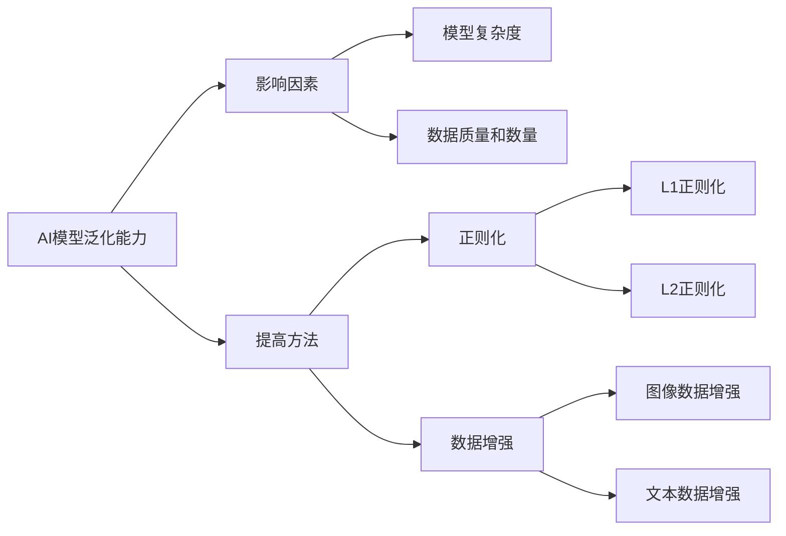

# 提高AI模型泛化能力的新方法探索

> 关键词：AI模型、泛化能力、新方法、正则化、数据增强

> 摘要：本文聚焦于提高AI模型泛化能力的新方法探索。泛化能力是AI模型在面对未见过的数据时仍能保持良好性能的关键，对模型的实际应用效果至关重要。文章首先介绍了相关背景知识，包括目的、预期读者等内容。接着阐述了核心概念与联系，通过文本示意图和Mermaid流程图清晰呈现。详细讲解了核心算法原理，并用Python源代码进行说明，同时给出了数学模型和公式及具体案例。在项目实战部分，通过实际代码案例展示并解读。还探讨了实际应用场景，推荐了相关工具和资源。最后总结了未来发展趋势与挑战，解答了常见问题并提供扩展阅读和参考资料，旨在为提高AI模型泛化能力提供全面且深入的指导。

## 1. 背景介绍 
### 1.1 目的和范围
在当今人工智能飞速发展的时代，AI模型在各个领域都得到了广泛的应用，如医疗诊断、自动驾驶、图像识别等。然而，一个普遍存在的问题是，很多模型在训练数据上表现良好，但在面对未见过的新数据时，性能却大幅下降，这就是模型泛化能力不足的表现。本文章的目的在于深入探索提高AI模型泛化能力的新方法，范围涵盖了常见的AI模型类型，如神经网络、决策树等，以及多种可能提升泛化能力的技术手段。

### 1.2 预期读者
本文预期读者包括人工智能领域的研究人员、开发者、学生以及对AI技术感兴趣的专业人士。对于研究人员来说，本文可提供新的研究思路和方向；对于开发者，能帮助他们在实际项目中提高模型的性能；对于学生，有助于他们深入理解AI模型泛化能力的相关知识；对于对AI技术感兴趣的专业人士，则可以拓宽他们的知识面和视野。

### 1.3 文档结构概述
本文将按照以下结构进行阐述。首先介绍背景知识，包括目的、预期读者等内容。接着讲解核心概念与联系，通过文本示意图和Mermaid流程图清晰展示相关概念和原理。然后详细说明核心算法原理，用Python源代码进行解释，同时给出数学模型和公式及具体案例。在项目实战部分，通过实际代码案例展示并解读。之后探讨实际应用场景，推荐相关工具和资源。最后总结未来发展趋势与挑战，解答常见问题并提供扩展阅读和参考资料。

### 1.4 术语表
#### 1.4.1 核心术语定义
- **AI模型**：人工智能模型，是基于一定算法和数据构建的系统，用于完成特定的任务，如分类、回归等。
- **泛化能力**：模型在面对未参与训练的新数据时，仍能保持良好性能的能力。
- **过拟合**：模型在训练数据上表现过于良好，但在新数据上性能较差的现象。
- **欠拟合**：模型在训练数据和新数据上的性能都较差的现象。

#### 1.4.2 相关概念解释
- **正则化**：一种防止过拟合的技术，通过在损失函数中添加额外的惩罚项，限制模型的复杂度。
- **数据增强**：通过对原始数据进行各种变换，生成更多的数据样本，从而增加数据的多样性，提高模型的泛化能力。

#### 1.4.3 缩略词列表
- **CNN**：卷积神经网络（Convolutional Neural Network）
- **RNN**：循环神经网络（Recurrent Neural Network）
- **LSTM**：长短期记忆网络（Long Short-Term Memory）

## 2. 核心概念与联系 
### 核心概念原理
AI模型的泛化能力与多个因素密切相关。其中，模型的复杂度是一个关键因素。当模型过于复杂时，它可能会过度拟合训练数据，记住了训练数据中的噪声和特殊情况，而忽略了数据的一般性规律，导致在新数据上的性能下降。相反，当模型过于简单时，它可能无法捕捉到数据中的复杂模式，出现欠拟合的情况。

正则化是一种常用的提高泛化能力的方法。它的基本思想是在损失函数中添加一个正则化项，这个正则化项通常与模型的参数有关。通过调整正则化项的权重，可以控制模型的复杂度，防止过拟合。例如，L1正则化会使模型的一些参数变为零，从而实现特征选择的目的；L2正则化则会使模型的参数更加平滑，减少参数的波动。

数据增强也是提高泛化能力的重要手段。在很多实际应用中，获取大量的标注数据是非常困难的，而数据增强可以在有限的数据基础上，通过对数据进行各种变换，如旋转、翻转、缩放等，生成更多的数据样本，增加数据的多样性，使模型能够学习到更丰富的特征，从而提高泛化能力。

### 文本示意图
```plaintext
AI模型泛化能力
|-- 影响因素
|   |-- 模型复杂度
|   |-- 数据质量和数量
|-- 提高方法
|   |-- 正则化
|   |   |-- L1正则化
|   |   |-- L2正则化
|   |-- 数据增强
|   |   |-- 图像数据增强
|   |   |-- 文本数据增强
```

### Mermaid流程图


## 3. 核心算法原理 & 具体操作步骤 
### 正则化算法原理
#### L1正则化
L1正则化的损失函数定义为：
$$J(\theta) = \frac{1}{2m} \sum_{i=1}^{m} (h_{\theta}(x^{(i)}) - y^{(i)})^2 + \lambda \sum_{j=1}^{n} |\theta_j|$$
其中，$J(\theta)$ 是损失函数，$m$ 是样本数量，$h_{\theta}(x^{(i)})$ 是模型对第 $i$ 个样本的预测值，$y^{(i)}$ 是第 $i$ 个样本的真实值，$\theta$ 是模型的参数，$\lambda$ 是正则化参数，$n$ 是参数的数量。

Python代码实现：
```python
import numpy as np

def l1_regularization_loss(X, y, theta, lambda_):
    m = X.shape[0]
    predictions = np.dot(X, theta)
    squared_error = (predictions - y) ** 2
    mse_loss = np.sum(squared_error) / (2 * m)
    l1_penalty = lambda_ * np.sum(np.abs(theta))
    return mse_loss + l1_penalty
```

#### L2正则化
L2正则化的损失函数定义为：
$$J(\theta) = \frac{1}{2m} \sum_{i=1}^{m} (h_{\theta}(x^{(i)}) - y^{(i)})^2 + \frac{\lambda}{2} \sum_{j=1}^{n} \theta_j^2$$
Python代码实现：
```python
import numpy as np

def l2_regularization_loss(X, y, theta, lambda_):
    m = X.shape[0]
    predictions = np.dot(X, theta)
    squared_error = (predictions - y) ** 2
    mse_loss = np.sum(squared_error) / (2 * m)
    l2_penalty = (lambda_ / 2) * np.sum(theta ** 2)
    return mse_loss + l2_penalty
```

### 数据增强算法原理
#### 图像数据增强
图像数据增强可以通过对图像进行旋转、翻转、缩放等操作来实现。以下是一个使用Python和OpenCV库进行图像数据增强的示例：
```python
import cv2
import numpy as np

def image_data_augmentation(image):
    # 随机旋转
    angle = np.random.randint(-30, 30)
    rows, cols = image.shape[:2]
    M = cv2.getRotationMatrix2D((cols/2, rows/2), angle, 1)
    rotated_image = cv2.warpAffine(image, M, (cols, rows))

    # 随机翻转
    flip_code = np.random.choice([-1, 0, 1])
    flipped_image = cv2.flip(rotated_image, flip_code)

    return flipped_image
```

#### 文本数据增强
文本数据增强可以通过替换同义词、插入噪声等方式来实现。以下是一个使用Python和`nltk`库进行文本数据增强的示例：
```python
import nltk
from nltk.corpus import wordnet
import random

nltk.download('wordnet')

def get_synonyms(word):
    synonyms = []
    for syn in wordnet.synsets(word):
        for lemma in syn.lemmas():
            synonyms.append(lemma.name())
    return synonyms

def text_data_augmentation(text):
    words = text.split()
    new_words = []
    for word in words:
        if random.random() < 0.2:
            synonyms = get_synonyms(word)
            if synonyms:
                new_word = random.choice(synonyms)
                new_words.append(new_word)
            else:
                new_words.append(word)
        else:
            new_words.append(word)
    return " ".join(new_words)
```

## 4. 数学模型和公式 & 详细讲解 & 举例说明 
### 正则化数学模型和公式
#### L1正则化
L1正则化的损失函数为：
$$J(\theta) = \frac{1}{2m} \sum_{i=1}^{m} (h_{\theta}(x^{(i)}) - y^{(i)})^2 + \lambda \sum_{j=1}^{n} |\theta_j|$$
详细讲解：
- 第一项 $\frac{1}{2m} \sum_{i=1}^{m} (h_{\theta}(x^{(i)}) - y^{(i)})^2$ 是普通的均方误差损失函数，用于衡量模型预测值与真实值之间的误差。
- 第二项 $\lambda \sum_{j=1}^{n} |\theta_j|$ 是L1正则化项，$\lambda$ 是正则化参数，控制正则化的强度。当 $\lambda$ 较大时，模型会倾向于使更多的参数变为零，从而实现特征选择的目的。

举例说明：
假设我们有一个简单的线性回归模型 $y = \theta_0 + \theta_1 x_1 + \theta_2 x_2$，训练数据有 $m = 10$ 个样本，$\lambda = 0.1$。经过训练后，模型的参数为 $\theta = [0.5, 0.3, -0.2]$。则L1正则化项的值为：
$$0.1\times(|0.5| + |0.3| + |-0.2|) = 0.1\times(0.5 + 0.3 + 0.2) = 0.1$$

#### L2正则化
L2正则化的损失函数为：
$$J(\theta) = \frac{1}{2m} \sum_{i=1}^{m} (h_{\theta}(x^{(i)}) - y^{(i)})^2 + \frac{\lambda}{2} \sum_{j=1}^{n} \theta_j^2$$
详细讲解：
- 第一项同样是均方误差损失函数。
- 第二项 $\frac{\lambda}{2} \sum_{j=1}^{n} \theta_j^2$ 是L2正则化项，$\lambda$ 控制正则化的强度。L2正则化会使模型的参数更加平滑，减少参数的波动。

举例说明：
对于上述线性回归模型，$\lambda = 0.1$，参数 $\theta = [0.5, 0.3, -0.2]$。则L2正则化项的值为：
$$\frac{0.1}{2}\times(0.5^2 + 0.3^2 + (-0.2)^2) = \frac{0.1}{2}\times(0.25 + 0.09 + 0.04) = 0.019$$

### 数据增强数学模型和公式
数据增强虽然没有严格的数学模型，但可以从概率的角度来理解。例如，在图像数据增强中，对图像进行旋转、翻转等操作可以看作是对图像空间的一种随机变换。假设图像的原始像素值为 $x$，经过变换后的像素值为 $x'$，则可以表示为 $x' = T(x)$，其中 $T$ 是一个随机变换函数。

在文本数据增强中，替换同义词可以看作是在词汇空间中的一种随机选择。假设原始词汇为 $w$，其同义词集合为 $S(w)$，则替换后的词汇 $w'$ 是从 $S(w)$ 中随机选择的一个元素。

## 5. 项目实战：代码实际案例和详细解释说明 
### 5.1  开发环境搭建
#### 安装Python
首先，确保你已经安装了Python 3.x版本。可以从Python官方网站（https://www.python.org/downloads/） 下载并安装。

#### 安装必要的库
在命令行中使用以下命令安装必要的库：
```sh
pip install numpy pandas scikit-learn tensorflow opencv-python nltk
```

### 5.2  源代码详细实现和代码解读
#### 数据集准备
我们使用`sklearn`库中的鸢尾花数据集进行示例。
```python
from sklearn.datasets import load_iris
from sklearn.model_selection import train_test_split

# 加载数据集
iris = load_iris()
X = iris.data
y = iris.target

# 划分训练集和测试集
X_train, X_test, y_train, y_test = train_test_split(X, y, test_size=0.2, random_state=42)
```
代码解读：
- `load_iris()` 函数用于加载鸢尾花数据集。
- `train_test_split()` 函数将数据集划分为训练集和测试集，测试集占比为20%。

#### 构建简单的神经网络模型
```python
import tensorflow as tf
from tensorflow.keras.models import Sequential
from tensorflow.keras.layers import Dense

# 构建模型
model = Sequential([
    Dense(10, activation='relu', input_shape=(4,)),
    Dense(3, activation='softmax')
])

# 编译模型
model.compile(optimizer='adam', loss='sparse_categorical_crossentropy', metrics=['accuracy'])
```
代码解读：
- `Sequential()` 用于构建一个顺序模型。
- `Dense()` 层是全连接层，第一个隐藏层有10个神经元，激活函数为ReLU，输入形状为4（鸢尾花数据集有4个特征）。
- 输出层有3个神经元，激活函数为softmax，用于多分类任务。
- `compile()` 方法用于编译模型，指定优化器为Adam，损失函数为`sparse_categorical_crossentropy`，评估指标为准确率。

#### 训练模型
```python
# 训练模型
history = model.fit(X_train, y_train, epochs=50, validation_data=(X_test, y_test))
```
代码解读：
- `fit()` 方法用于训练模型，指定训练数据、训练轮数（epochs=50）和验证数据。

#### 使用正则化提高泛化能力
```python
from tensorflow.keras.regularizers import l2

# 构建带有L2正则化的模型
model_with_regularization = Sequential([
    Dense(10, activation='relu', input_shape=(4,), kernel_regularizer=l2(0.01)),
    Dense(3, activation='softmax')
])

# 编译模型
model_with_regularization.compile(optimizer='adam', loss='sparse_categorical_crossentropy', metrics=['accuracy'])

# 训练模型
history_with_regularization = model_with_regularization.fit(X_train, y_train, epochs=50, validation_data=(X_test, y_test))
```
代码解读：
- `l2(0.01)` 表示使用L2正则化，正则化参数为0.01。
- 其他部分与之前的模型构建和训练过程类似。

### 5.3  代码解读与分析
通过比较普通模型和带有正则化的模型的训练过程和性能，我们可以发现正则化的作用。在训练过程中，带有正则化的模型可能收敛速度会稍慢一些，但在验证集上的准确率可能会更高，说明模型的泛化能力得到了提高。

## 6. 实际应用场景 
### 医疗诊断
在医疗诊断中，AI模型可以帮助医生进行疾病的诊断和预测。然而，医疗数据往往是有限的，且不同患者的病情可能存在差异。通过提高AI模型的泛化能力，可以使模型在面对不同患者的新数据时，仍能准确地进行诊断和预测，提高诊断的准确性和可靠性。

### 自动驾驶
自动驾驶系统需要处理大量的复杂路况和环境信息。AI模型的泛化能力直接影响到自动驾驶车辆的安全性和可靠性。通过提高模型的泛化能力，可以使自动驾驶车辆在不同的天气、道路条件下都能做出正确的决策，减少事故的发生。

### 图像识别
图像识别技术在安防、智能监控等领域有广泛的应用。不同的图像可能存在光照、角度、尺度等差异，提高AI模型的泛化能力可以使模型在各种复杂的图像条件下都能准确地识别目标，提高图像识别的准确率和鲁棒性。

## 7. 工具和资源推荐
### 7.1 学习资源推荐
#### 7.1.1 书籍推荐
- 《深度学习》（Deep Learning），作者：Ian Goodfellow、Yoshua Bengio和Aaron Courville，这本书是深度学习领域的经典著作，全面介绍了深度学习的理论和实践。
- 《Python机器学习》（Python Machine Learning），作者：Sebastian Raschka和Vahid Mirjalili，这本书以Python为工具，详细介绍了机器学习的各种算法和应用。

#### 7.1.2 在线课程
- Coursera上的《机器学习》课程，由Andrew Ng教授授课，是机器学习领域的经典在线课程，适合初学者。
- edX上的《深度学习》课程，由多位知名学者授课，深入介绍了深度学习的理论和实践。

#### 7.1.3 技术博客和网站
- Medium上有很多关于人工智能和机器学习的优秀博客文章，可以关注一些知名的博主，如Andrej Karpathy等。
- Kaggle是一个数据科学竞赛平台，上面有很多优秀的代码和经验分享，可以学习到很多实际应用的技巧。

### 7.2 开发工具框架推荐
#### 7.2.1 IDE和编辑器
- PyCharm：是一款功能强大的Python集成开发环境，提供了丰富的代码编辑、调试和分析工具。
- Jupyter Notebook：是一个交互式的开发环境，适合进行数据探索和模型实验。

#### 7.2.2 调试和性能分析工具
- TensorBoard：是TensorFlow提供的可视化工具，可以帮助我们可视化模型的训练过程和性能指标。
- Scikit-learn的`cross_val_score`函数：可以用于模型的交叉验证和性能评估。

#### 7.2.3 相关框架和库
- TensorFlow：是一个开源的深度学习框架，提供了丰富的深度学习模型和工具。
- PyTorch：是另一个流行的深度学习框架，具有动态图的特点，适合快速迭代和实验。

### 7.3 相关论文著作推荐
#### 7.3.1 经典论文
- “Deep Residual Learning for Image Recognition”，提出了残差网络（ResNet），有效解决了深度神经网络训练中的梯度消失问题。
- “Attention Is All You Need”，提出了Transformer模型，在自然语言处理领域取得了巨大的成功。

#### 7.3.2 最新研究成果
- 关注顶级学术会议，如NeurIPS、ICML、CVPR等，上面会有很多关于提高AI模型泛化能力的最新研究成果。

#### 7.3.3 应用案例分析
- 一些知名企业的技术博客，如Google AI Blog、Facebook AI Research等，会分享很多实际应用中的案例和经验。

## 8. 总结：未来发展趋势与挑战
### 未来发展趋势
- **融合多种技术**：未来提高AI模型泛化能力可能会融合多种技术，如正则化、数据增强、迁移学习等，以实现更好的效果。
- **自适应方法**：开发自适应的方法，能够根据不同的数据集和任务自动调整模型的复杂度和正则化参数，提高模型的泛化能力。
- **强化学习的应用**：强化学习可以通过智能体与环境的交互来学习最优策略，未来可能会在提高AI模型泛化能力方面发挥重要作用。

### 挑战
- **数据隐私和安全**：在进行数据增强和使用大量数据训练模型时，需要考虑数据隐私和安全问题，防止数据泄露。
- **计算资源的限制**：一些提高泛化能力的方法可能需要大量的计算资源，如何在有限的计算资源下实现高效的模型训练是一个挑战。
- **模型可解释性**：提高模型泛化能力的同时，需要保证模型的可解释性，以便在实际应用中能够得到用户的信任。

## 9. 附录：常见问题与解答
### 问题1：正则化参数 $\lambda$ 如何选择？
答：正则化参数 $\lambda$ 的选择通常需要通过交叉验证的方法来确定。可以尝试不同的 $\lambda$ 值，在验证集上评估模型的性能，选择性能最好的 $\lambda$ 值。

### 问题2：数据增强是否会引入噪声？
答：数据增强在一定程度上可能会引入噪声，但合理的数据增强方法可以增加数据的多样性，提高模型的泛化能力。在实际应用中，需要根据具体情况选择合适的数据增强方法和参数。

### 问题3：如何判断模型是否过拟合或欠拟合？
答：可以通过比较模型在训练集和验证集上的性能来判断。如果模型在训练集上的性能很好，但在验证集上的性能很差，则可能是过拟合；如果模型在训练集和验证集上的性能都很差，则可能是欠拟合。

## 10. 扩展阅读 & 参考资料
- Goodfellow, I., Bengio, Y., & Courville, A. (2016). Deep Learning. MIT Press.
- Raschka, S., & Mirjalili, V. (2017). Python Machine Learning. Packt Publishing.
- 相关学术论文和技术博客文章，如arXiv上的相关论文、Medium上的优秀博客等。

作者：AI天才研究院/AI Genius Institute & 禅与计算机程序设计艺术 /Zen And The Art of Computer Programming