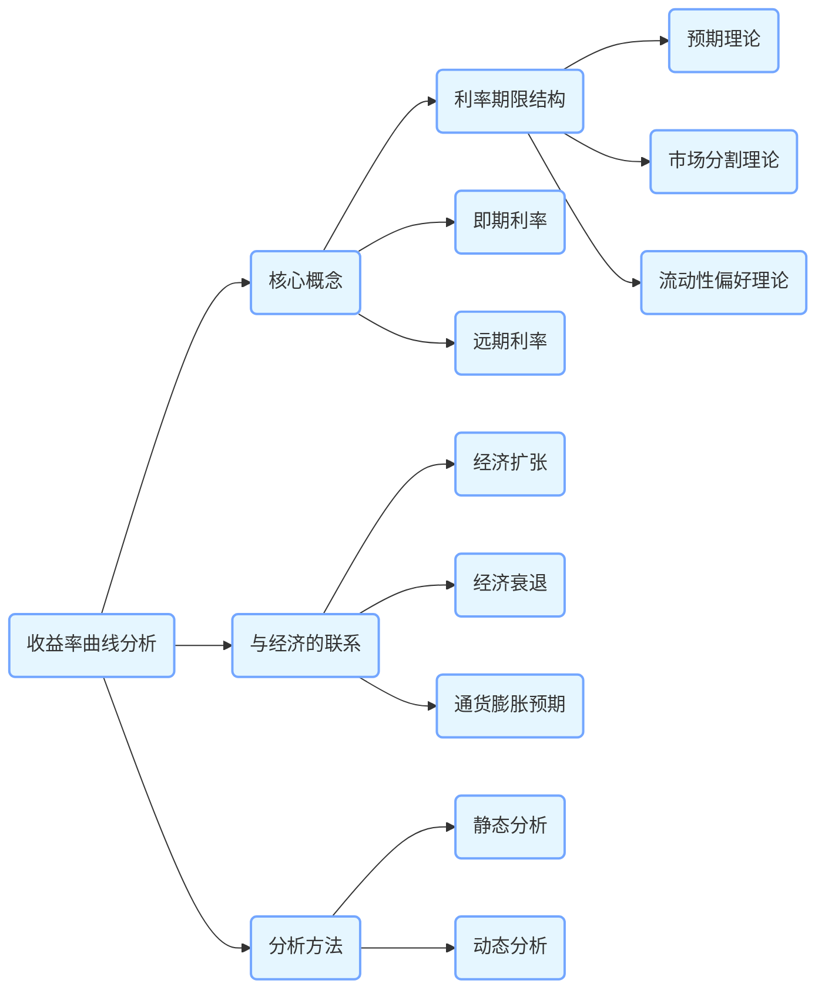

# 收益率曲线分析：预测经济走向的工具

> 关键词：收益率曲线、经济走向预测、利率期限结构、宏观经济指标、金融市场分析

> 摘要：本文聚焦于收益率曲线分析这一重要工具，旨在深入探讨其在预测经济走向方面的作用。首先介绍了收益率曲线分析的背景知识，包括目的、预期读者、文档结构和相关术语。接着阐述了收益率曲线的核心概念、与经济的联系，并给出了原理和架构的示意图及流程图。详细讲解了核心算法原理，用 Python 代码进行了示例。通过数学模型和公式进一步剖析其内在逻辑，并举例说明。结合项目实战，展示了代码实现和解读。探讨了收益率曲线在实际中的应用场景，推荐了相关的学习资源、开发工具和论文著作。最后总结了收益率曲线分析的未来发展趋势与挑战，还提供了常见问题解答和扩展阅读参考资料，帮助读者全面理解和运用收益率曲线分析来预测经济走向。

## 1. 背景介绍 
### 1.1 目的和范围
收益率曲线分析作为金融领域的关键工具，其主要目的在于通过对不同期限债券收益率之间关系的研究，揭示市场对未来经济状况的预期。在当今复杂多变的金融市场环境下，准确预测经济走向对于投资者制定投资策略、企业规划生产经营活动以及政府制定宏观经济政策都具有至关重要的意义。

本文的范围将涵盖收益率曲线的基本概念、形成原理、分析方法，以及如何运用收益率曲线来预测经济的扩张、衰退等不同阶段。同时，还会通过实际案例展示收益率曲线分析在实际中的应用，为读者提供一个全面而深入的理解。

### 1.2 预期读者
本文预期读者主要包括金融领域的专业人士，如投资分析师、基金经理、银行交易员等，他们可以通过本文进一步深化对收益率曲线分析的理解，提升投资决策的准确性。同时，对于经济学专业的学生和研究者来说，本文可以作为学习宏观经济分析和金融市场研究的参考资料。此外，对金融市场和经济形势感兴趣的普通投资者也能从本文中获取有用的信息，增强对经济形势的判断能力。

### 1.3 文档结构概述
本文将按照以下结构展开：首先介绍收益率曲线分析的背景知识，包括目的、读者对象和文档结构等；接着阐述收益率曲线的核心概念，以及它与经济走向之间的联系，并给出相应的示意图和流程图；然后详细讲解核心算法原理和具体操作步骤，用 Python 代码进行示例；再通过数学模型和公式深入剖析收益率曲线的内在逻辑，并举例说明；之后结合项目实战，展示代码实现和详细解读；探讨收益率曲线在实际中的应用场景；推荐相关的学习资源、开发工具和论文著作；最后总结收益率曲线分析的未来发展趋势与挑战，提供常见问题解答和扩展阅读参考资料。

### 1.4 术语表
#### 1.4.1 核心术语定义
- **收益率曲线**：是将不同期限债券的收益率连接而成的曲线，它反映了债券收益率与到期期限之间的关系。一般来说，收益率曲线的形状可以分为向上倾斜、向下倾斜和水平三种基本类型。
- **利率期限结构**：指的是不同期限债券的利率之间的关系，收益率曲线是利率期限结构的一种直观表现形式。
- **即期利率**：是指当前时刻零息债券的到期收益率，它反映了当前市场对不同期限资金的供求关系。
- **远期利率**：是指在未来某个特定时间点开始的一段时期内的利率，它可以根据即期利率推导得出。

#### 1.4.2 相关概念解释
- **无风险利率**：通常以国债收益率作为代表，因为国债由政府信用背书，违约风险极低。无风险利率是金融市场中其他各类资产定价的基础。
- **风险溢价**：投资者为了承担额外的风险而要求获得的额外收益。在债券市场中，信用风险较高的债券通常需要提供更高的收益率来补偿投资者所承担的风险。
- **流动性偏好**：投资者倾向于持有流动性较高的资产，因为流动性高的资产可以更容易地在市场上变现。因此，长期债券通常需要提供更高的收益率来补偿投资者因持有期限较长而牺牲的流动性。

#### 1.4.3 缩略词列表
- **YTM**：Yield to Maturity，到期收益率，是指投资者持有债券至到期时所能获得的平均年化收益率。
- **IRR**：Internal Rate of Return，内部收益率，是指使投资项目净现值为零的折现率。在债券投资中，IRR 与 YTM 概念类似。

## 2. 核心概念与联系 
### 核心概念原理
收益率曲线的核心原理基于利率期限结构理论。利率期限结构理论主要有三种：预期理论、市场分割理论和流动性偏好理论。

#### 预期理论
预期理论认为，长期债券的收益率等于当前短期利率和未来预期短期利率的平均值。例如，如果投资者预期未来短期利率将上升，那么长期债券的收益率也会相应上升，收益率曲线将向上倾斜；反之，如果预期未来短期利率将下降，收益率曲线将向下倾斜。

#### 市场分割理论
市场分割理论认为，不同期限的债券市场是相互独立的，投资者对不同期限的债券有不同的偏好和需求。因此，不同期限债券的收益率由各自市场的供求关系决定，收益率曲线的形状可能是任意的。

#### 流动性偏好理论
流动性偏好理论认为，投资者更偏好流动性较高的短期债券，因此长期债券需要提供更高的收益率来补偿投资者因持有期限较长而牺牲的流动性。这就导致了收益率曲线通常向上倾斜。

### 架构的文本示意图
```plaintext
收益率曲线分析
|-- 核心概念
|   |-- 利率期限结构
|   |   |-- 预期理论
|   |   |-- 市场分割理论
|   |   |-- 流动性偏好理论
|   |-- 即期利率
|   |-- 远期利率
|-- 与经济的联系
|   |-- 经济扩张
|   |-- 经济衰退
|   |-- 通货膨胀预期
|-- 分析方法
|   |-- 静态分析
|   |-- 动态分析
```

### Mermaid 流程图


### 与经济走向的联系
收益率曲线的形状与经济走向密切相关。一般来说，正常情况下收益率曲线是向上倾斜的，这表明长期债券的收益率高于短期债券，反映了市场对未来经济增长和通货膨胀的预期。当收益率曲线出现倒挂（即短期债券收益率高于长期债券收益率）时，通常被视为经济衰退的信号。这是因为投资者预期未来经济增长放缓，通货膨胀下降，因此更愿意持有长期债券，导致长期债券价格上升，收益率下降。

此外，收益率曲线的斜率变化也可以反映经济的变化趋势。如果收益率曲线的斜率逐渐变大，说明市场对未来经济增长的预期增强；反之，如果斜率逐渐变小，可能意味着经济增长动力减弱。

## 3. 核心算法原理 & 具体操作步骤 
### 核心算法原理
在收益率曲线分析中，一个重要的算法是根据即期利率计算远期利率。根据无套利原理，投资者在不同投资策略下的收益应该相等。假设我们已知 $t_1$ 时刻和 $t_2$ 时刻（$t_2 > t_1$）的即期利率 $r_{t_1}$ 和 $r_{t_2}$，那么在 $t_1$ 时刻到 $t_2$ 时刻的远期利率 $f_{t_1,t_2}$ 可以通过以下公式计算：

$$(1 + r_{t_2})^{t_2} = (1 + r_{t_1})^{t_1} \times (1 + f_{t_1,t_2})^{t_2 - t_1}$$

解上述方程可得：

$$f_{t_1,t_2} = \left(\frac{(1 + r_{t_2})^{t_2}}{(1 + r_{t_1})^{t_1}}\right)^{\frac{1}{t_2 - t_1}} - 1$$

### 具体操作步骤
以下是使用 Python 实现根据即期利率计算远期利率的代码示例：

```python
import numpy as np

def calculate_forward_rate(r_t1, t1, r_t2, t2):
    """
    计算远期利率
    :param r_t1: t1 时刻的即期利率
    :param t1: t1 时刻
    :param r_t2: t2 时刻的即期利率
    :param t2: t2 时刻
    :return: 远期利率
    """
    forward_rate = ((1 + r_t2) ** t2 / (1 + r_t1) ** t1) ** (1 / (t2 - t1)) - 1
    return forward_rate

# 示例数据
r_t1 = 0.02  # t1 时刻的即期利率为 2%
t1 = 1  # t1 时刻为 1 年
r_t2 = 0.03  # t2 时刻的即期利率为 3%
t2 = 2  # t2 时刻为 2 年

forward_rate = calculate_forward_rate(r_t1, t1, r_t2, t2)
print(f"从 {t1} 年到 {t2} 年的远期利率为: {forward_rate * 100:.2f}%")
```

### 代码解释
1. **导入必要的库**：导入 `numpy` 库，用于进行数值计算。
2. **定义计算远期利率的函数**：`calculate_forward_rate` 函数接受四个参数：$t_1$ 时刻的即期利率 $r_{t_1}$、$t_1$ 时刻、$t_2$ 时刻的即期利率 $r_{t_2}$ 和 $t_2$ 时刻。在函数内部，根据上述公式计算远期利率并返回。
3. **示例数据**：定义了 $t_1$ 时刻和 $t_2$ 时刻的即期利率以及对应的时间。
4. **调用函数计算远期利率**：调用 `calculate_forward_rate` 函数计算从 $t_1$ 年到 $t_2$ 年的远期利率，并将结果打印输出。

## 4. 数学模型和公式 & 详细讲解 & 举例说明 
### 即期利率与远期利率的关系
如前文所述，即期利率和远期利率之间存在着紧密的联系。假设我们有一系列不同期限的即期利率 $r_1, r_2, \cdots, r_n$，其中 $r_i$ 表示期限为 $i$ 年的即期利率。那么，根据无套利原理，我们可以通过即期利率推导出远期利率。

例如，我们要计算从第 1 年到第 2 年的远期利率 $f_{1,2}$，可以使用以下公式：

$$(1 + r_2)^2 = (1 + r_1) \times (1 + f_{1,2})$$

解这个方程可得：

$$f_{1,2} = \frac{(1 + r_2)^2}{1 + r_1} - 1$$

一般地，从第 $m$ 年到第 $n$ 年（$n > m$）的远期利率 $f_{m,n}$ 可以通过以下公式计算：

$$(1 + r_n)^n = (1 + r_m)^m \times (1 + f_{m,n})^{n - m}$$

$$f_{m,n} = \left(\frac{(1 + r_n)^n}{(1 + r_m)^m}\right)^{\frac{1}{n - m}} - 1$$

### 收益率曲线的拟合模型
在实际应用中，我们通常需要对收益率曲线进行拟合，以便更好地分析和预测。常见的收益率曲线拟合模型有 Nelson - Siegel 模型和 Svensson 模型。

#### Nelson - Siegel 模型
Nelson - Siegel 模型的表达式为：

$$r(\tau) = \beta_0 + \beta_1 \frac{1 - e^{-\tau / \lambda}}{\tau / \lambda} + \beta_2 \left(\frac{1 - e^{-\tau / \lambda}}{\tau / \lambda} - e^{-\tau / \lambda}\right)$$

其中，$r(\tau)$ 表示期限为 $\tau$ 的即期利率，$\beta_0, \beta_1, \beta_2$ 是模型的参数，$\lambda$ 是一个控制曲线形状的参数。

#### Svensson 模型
Svensson 模型是 Nelson - Siegel 模型的扩展，其表达式为：

$$r(\tau) = \beta_0 + \beta_1 \frac{1 - e^{-\tau / \lambda_1}}{\tau / \lambda_1} + \beta_2 \left(\frac{1 - e^{-\tau / \lambda_1}}{\tau / \lambda_1} - e^{-\tau / \lambda_1}\right) + \beta_3 \left(\frac{1 - e^{-\tau / \lambda_2}}{\tau / \lambda_2} - e^{-\tau / \lambda_2}\right)$$

其中，$\lambda_1$ 和 $\lambda_2$ 是两个控制曲线形状的参数，$\beta_0, \beta_1, \beta_2, \beta_3$ 是模型的参数。

### 举例说明
假设我们已知以下即期利率数据：

| 期限（年） | 即期利率 |
| --- | --- |
| 1 | 0.02 |
| 2 | 0.03 |
| 3 | 0.035 |

我们可以使用上述公式计算从第 1 年到第 2 年和从第 2 年到第 3 年的远期利率。

#### 计算从第 1 年到第 2 年的远期利率
根据公式 $f_{1,2} = \frac{(1 + r_2)^2}{1 + r_1} - 1$，将 $r_1 = 0.02$ 和 $r_2 = 0.03$ 代入可得：

$$f_{1,2} = \frac{(1 + 0.03)^2}{1 + 0.02} - 1 \approx 0.0401 = 4.01\%$$

#### 计算从第 2 年到第 3 年的远期利率
根据公式 $f_{2,3} = \left(\frac{(1 + r_3)^3}{(1 + r_2)^2}\right)^{\frac{1}{3 - 2}} - 1$，将 $r_2 = 0.03$ 和 $r_3 = 0.035$ 代入可得：

$$f_{2,3} = \left(\frac{(1 + 0.035)^3}{(1 + 0.03)^2}\right) - 1 \approx 0.0451 = 4.51\%$$

通过这些计算，我们可以更深入地了解市场对未来利率的预期，从而为投资决策提供参考。

## 5. 项目实战：代码实际案例和详细解释说明 
### 5.1  开发环境搭建
在进行收益率曲线分析的项目实战之前，我们需要搭建相应的开发环境。以下是具体的步骤：

#### 安装 Python
首先，确保你已经安装了 Python 环境。建议使用 Python 3.7 及以上版本。你可以从 Python 官方网站（https://www.python.org/downloads/）下载并安装适合你操作系统的 Python 版本。

#### 安装必要的库
在项目中，我们需要使用一些 Python 库来进行数据处理、计算和可视化。主要的库包括 `numpy`、`pandas`、`matplotlib` 和 `scipy`。可以使用以下命令来安装这些库：

```sh
pip install numpy pandas matplotlib scipy
```

### 5.2  源代码详细实现和代码解读
以下是一个完整的 Python 代码示例，用于实现收益率曲线的绘制和远期利率的计算：

```python
import numpy as np
import pandas as pd
import matplotlib.pyplot as plt
from scipy.optimize import minimize

# 示例即期利率数据
maturities = np.array([1, 2, 3, 4, 5])
spot_rates = np.array([0.02, 0.03, 0.035, 0.04, 0.045])

# 绘制收益率曲线
plt.figure(figsize=(10, 6))
plt.plot(maturities, spot_rates, marker='o', label='Spot Rates')
plt.title('Yield Curve')
plt.xlabel('Maturity (Years)')
plt.ylabel('Spot Rate')
plt.legend()
plt.grid(True)
plt.show()

# 定义 Nelson - Siegel 模型
def nelson_siegel(tau, beta0, beta1, beta2, lambda_):
    """
    Nelson - Siegel 模型
    :param tau: 期限
    :param beta0: 模型参数
    :param beta1: 模型参数
    :param beta2: 模型参数
    :param lambda_: 控制曲线形状的参数
    :return: 即期利率
    """
    factor1 = (1 - np.exp(-tau / lambda_)) / (tau / lambda_)
    factor2 = factor1 - np.exp(-tau / lambda_)
    return beta0 + beta1 * factor1 + beta2 * factor2

# 定义目标函数，用于拟合 Nelson - Siegel 模型
def objective(params, maturities, spot_rates):
    """
    目标函数，计算模型预测值与实际值的均方误差
    :param params: 模型参数
    :param maturities: 期限
    :param spot_rates: 即期利率
    :return: 均方误差
    """
    beta0, beta1, beta2, lambda_ = params
    predicted_rates = nelson_siegel(maturities, beta0, beta1, beta2, lambda_)
    return np.mean((predicted_rates - spot_rates) ** 2)

# 初始参数猜测
initial_params = [0.03, 0.01, 0.01, 1.0]

# 使用最小化算法拟合模型
result = minimize(objective, initial_params, args=(maturities, spot_rates))

# 提取拟合后的参数
beta0_fit, beta1_fit, beta2_fit, lambda_fit = result.x

# 生成更多期限的预测值
maturities_fit = np.linspace(1, 10, 100)
spot_rates_fit = nelson_siegel(maturities_fit, beta0_fit, beta1_fit, beta2_fit, lambda_fit)

# 绘制拟合后的收益率曲线
plt.figure(figsize=(10, 6))
plt.plot(maturities, spot_rates, marker='o', label='Actual Spot Rates')
plt.plot(maturities_fit, spot_rates_fit, label='Fitted Yield Curve (Nelson - Siegel)')
plt.title('Fitted Yield Curve using Nelson - Siegel Model')
plt.xlabel('Maturity (Years)')
plt.ylabel('Spot Rate')
plt.legend()
plt.grid(True)
plt.show()

# 计算远期利率
def calculate_forward_rate(r_t1, t1, r_t2, t2):
    """
    计算远期利率
    :param r_t1: t1 时刻的即期利率
    :param t1: t1 时刻
    :param r_t2: t2 时刻的即期利率
    :param t2: t2 时刻
    :return: 远期利率
    """
    forward_rate = ((1 + r_t2) ** t2 / (1 + r_t1) ** t1) ** (1 / (t2 - t1)) - 1
    return forward_rate

# 示例计算从第 1 年到第 2 年的远期利率
r_t1 = spot_rates[0]
t1 = maturities[0]
r_t2 = spot_rates[1]
t2 = maturities[1]
forward_rate = calculate_forward_rate(r_t1, t1, r_t2, t2)
print(f"从 {t1} 年到 {t2} 年的远期利率为: {forward_rate * 100:.2f}%")
```

### 5.3  代码解读与分析
#### 数据准备
- `maturities`：存储不同期限的数组。
- `spot_rates`：存储对应期限的即期利率数组。

#### 绘制收益率曲线
使用 `matplotlib` 库绘制原始的收益率曲线，直观展示不同期限的即期利率情况。

#### Nelson - Siegel 模型拟合
- `nelson_siegel` 函数：实现了 Nelson - Siegel 模型的计算公式。
- `objective` 函数：定义了目标函数，用于计算模型预测值与实际值的均方误差。
- `minimize` 函数：使用 `scipy` 库中的最小化算法，寻找使目标函数最小的模型参数。

#### 绘制拟合后的收益率曲线
生成更多期限的预测值，并使用 `matplotlib` 库绘制拟合后的收益率曲线，与原始数据进行对比。

#### 计算远期利率
- `calculate_forward_rate` 函数：根据即期利率计算远期利率。
- 示例计算从第 1 年到第 2 年的远期利率，并将结果打印输出。

通过这个项目实战，我们可以更深入地理解收益率曲线的分析方法，包括曲线的绘制、模型的拟合和远期利率的计算。

## 6. 实际应用场景 
### 投资决策
收益率曲线分析在投资决策中具有重要的应用价值。投资者可以根据收益率曲线的形状和变化趋势来调整投资组合。例如，当收益率曲线向上倾斜时，投资者可以适当增加长期债券的投资比例，因为长期债券的收益率较高；而当收益率曲线倒挂时，投资者可能会减少股票等风险资产的投资，增加现金或短期债券的持有，以规避经济衰退的风险。

### 宏观经济政策制定
政府和央行可以通过观察收益率曲线来了解市场对未来经济的预期，从而制定相应的宏观经济政策。例如，如果收益率曲线倒挂，表明市场对未来经济增长悲观，央行可能会采取降息等宽松的货币政策来刺激经济增长；而如果收益率曲线过于陡峭，可能意味着通货膨胀压力较大，央行可能会采取加息等紧缩的货币政策来控制通货膨胀。

### 风险管理
金融机构可以利用收益率曲线分析来进行风险管理。例如，银行可以根据收益率曲线的变化来调整资产和负债的期限结构，以降低利率风险。保险公司可以通过分析收益率曲线来评估保险产品的定价和准备金的充足性。

### 企业融资决策
企业在进行融资决策时，也可以参考收益率曲线。如果收益率曲线向上倾斜，企业可以选择发行长期债券来锁定较低的融资成本；而如果收益率曲线倒挂，企业可能会选择短期融资，等待市场利率下降后再进行长期融资。

## 7. 工具和资源推荐
### 7.1 学习资源推荐
#### 7.1.1 书籍推荐
- 《固定收益证券分析》（*Analysis of Fixed Income Securities*）：全面介绍了固定收益证券的基本概念、定价方法和风险管理，其中包含了大量关于收益率曲线分析的内容。
- 《利率期限结构理论与实证研究》：深入探讨了利率期限结构的各种理论和实证研究方法，对收益率曲线分析有深入的阐述。
- 《金融市场与金融机构》（*Financial Markets and Institutions*）：涵盖了金融市场的各个方面，包括债券市场和收益率曲线分析，适合初学者入门。

#### 7.1.2 在线课程
- Coursera 上的 “固定收益证券分析” 课程：由知名高校的教授授课，系统讲解了固定收益证券的定价、风险管理和收益率曲线分析等内容。
- edX 上的 “金融市场与投资” 课程：提供了丰富的金融市场知识，包括收益率曲线分析的原理和应用。

#### 7.1.3 技术博客和网站
- 华尔街见闻：提供了丰富的金融市场资讯和分析，包括收益率曲线的实时数据和解读。
- 彭博社：全球知名的金融信息服务提供商，提供了全面的金融市场数据和分析工具，对收益率曲线分析有深入的报道。

### 7.2 开发工具框架推荐
#### 7.2.1 IDE和编辑器
- PyCharm：一款功能强大的 Python 集成开发环境，提供了代码编辑、调试、版本控制等一系列功能，适合进行收益率曲线分析的项目开发。
- Jupyter Notebook：交互式的开发环境，非常适合进行数据探索和可视化，在收益率曲线分析中可以方便地展示代码和结果。

#### 7.2.2 调试和性能分析工具
- `pdb`：Python 自带的调试工具，可以帮助开发者定位代码中的问题。
- `cProfile`：Python 的性能分析工具，可以分析代码的运行时间和函数调用情况，帮助优化代码性能。

#### 7.2.3 相关框架和库
- `numpy`：用于进行数值计算，在收益率曲线分析中可以处理大量的数值数据。
- `pandas`：用于数据处理和分析，方便读取、处理和存储收益率曲线数据。
- `matplotlib`：用于数据可视化，能够绘制各种类型的图表，直观展示收益率曲线的变化。
- `scipy`：提供了丰富的科学计算工具，如优化算法、插值算法等，在收益率曲线拟合中非常有用。

### 7.3 相关论文著作推荐
#### 7.3.1 经典论文
- “The Term Structure of Interest Rates” by John C. Cox, Jonathan E. Ingersoll, Jr., and Stephen A. Ross：提出了著名的 Cox - Ingersoll - Ross 模型，对利率期限结构理论的发展产生了深远影响。
- “Parsimonious Modeling of Yield Curves” by Charles R. Nelson and Andrew F. Siegel：介绍了 Nelson - Siegel 模型，是收益率曲线拟合领域的经典论文。

#### 7.3.2 最新研究成果
- 可以关注《Journal of Financial Economics》、《Review of Financial Studies》等顶级金融学术期刊，了解收益率曲线分析领域的最新研究成果。

#### 7.3.3 应用案例分析
- 各大金融机构的研究报告中通常包含了收益率曲线分析在实际投资和风险管理中的应用案例，可以通过查阅这些报告来学习实际应用经验。

## 8. 总结：未来发展趋势与挑战
### 未来发展趋势
#### 大数据和人工智能的应用
随着大数据和人工智能技术的不断发展，收益率曲线分析将更加依赖于海量的金融数据和先进的算法模型。例如，机器学习算法可以用于对收益率曲线进行更精准的预测和分析，挖掘数据中隐藏的信息和规律。

#### 跨市场和跨资产分析
未来的收益率曲线分析将不仅仅局限于债券市场，还将扩展到股票、外汇、商品等多个市场，进行跨市场和跨资产的综合分析。通过分析不同市场之间的收益率曲线关系，可以更好地把握全球金融市场的动态和风险。

#### 实时监测和预警系统的完善
为了及时应对金融市场的变化，收益率曲线分析将更加注重实时监测和预警系统的完善。通过建立实时数据采集和分析平台，可以及时发现收益率曲线的异常变化，为投资者和政策制定者提供及时的预警信息。

### 挑战
#### 数据质量和可靠性
收益率曲线分析依赖于大量的金融数据，数据的质量和可靠性直接影响分析结果的准确性。然而，金融数据往往存在噪声、缺失值和异常值等问题，如何有效地处理这些数据是一个挑战。

#### 模型的复杂性和可解释性
随着收益率曲线分析模型的不断发展，模型的复杂性也在增加。复杂的模型虽然可以提高预测的准确性，但也降低了模型的可解释性。如何在提高模型准确性的同时，保证模型的可解释性是一个需要解决的问题。

#### 市场不确定性和黑天鹅事件
金融市场充满了不确定性，黑天鹅事件的发生往往会导致收益率曲线的剧烈变化。如何在不确定的市场环境中进行准确的收益率曲线分析，并有效地应对黑天鹅事件是一个巨大的挑战。

## 9. 附录：常见问题与解答
### 问题 1：收益率曲线倒挂一定意味着经济衰退吗？
答：收益率曲线倒挂通常被视为经济衰退的信号，但并不是绝对的。虽然历史数据显示，收益率曲线倒挂后往往伴随着经济衰退，但也有一些情况下，收益率曲线倒挂并没有导致经济衰退。因此，收益率曲线倒挂只是一个参考指标，不能作为判断经济衰退的唯一依据，还需要结合其他宏观经济指标进行综合分析。

### 问题 2：如何选择合适的收益率曲线拟合模型？
答：选择合适的收益率曲线拟合模型需要考虑多个因素，包括数据的特点、模型的复杂度、拟合的准确性和可解释性等。一般来说，Nelson - Siegel 模型适用于大多数情况，它具有较好的拟合效果和可解释性；而 Svensson 模型则更适合处理复杂的收益率曲线形状，但模型的参数较多，需要更多的数据进行拟合。在实际应用中，可以通过比较不同模型的拟合效果和预测能力来选择合适的模型。

### 问题 3：收益率曲线分析在新兴市场的应用有哪些限制？
答：收益率曲线分析在新兴市场的应用存在一些限制。首先，新兴市场的金融数据质量和可靠性可能较低，数据的缺失值和异常值较多，这会影响收益率曲线分析的准确性。其次，新兴市场的金融市场结构和制度环境与发达市场存在差异，收益率曲线的形成机制可能不同，需要对传统的分析方法进行适当的调整。此外，新兴市场的经济和政治环境不稳定，黑天鹅事件发生的概率较高，这也增加了收益率曲线分析的难度。

## 10. 扩展阅读 & 参考资料
### 扩展阅读
- 《金融计量学：从初级到高级建模技术》：进一步深入学习金融计量学的知识，包括收益率曲线分析的高级建模技术。
- 《行为金融学》：了解投资者的行为和心理因素对收益率曲线的影响。

### 参考资料
- [1] Campbell, J. Y., Lo, A. W., & MacKinlay, A. C. (1997). *The Econometrics of Financial Markets*. Princeton University Press.
- [2] Fabozzi, F. J., & Mann, S. V. (2009). *Fixed Income Analysis*. Wiley.
- [3] Shiller, R. J. (1979). The volatility of long - term interest rates and expectations models of the term structure. *Journal of Political Economy*, 87(6), 1190 - 1219.

作者：AI天才研究院/AI Genius Institute & 禅与计算机程序设计艺术 /Zen And The Art of Computer Programming