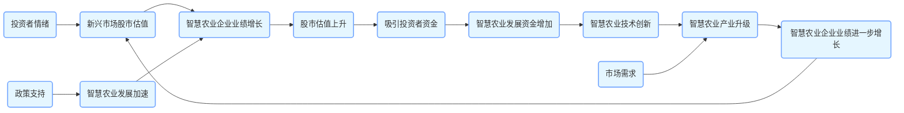

# 新兴市场股市估值与智慧农业发展的互动

> 关键词：新兴市场股市估值、智慧农业发展、互动关系、金融市场、农业现代化

> 摘要：本文聚焦于新兴市场股市估值与智慧农业发展之间的互动关系。首先阐述了研究此互动关系的背景和目的，介绍了预期读者与文档结构。接着对核心概念进行详细解释，分析其原理和架构，并通过Mermaid流程图展示。深入探讨核心算法原理，给出Python代码示例，同时运用数学模型和公式来精确描述两者关系。结合项目实战，提供代码案例并详细解读。探讨了这种互动关系在实际中的应用场景，推荐了相关的学习资源、开发工具和论文著作。最后总结未来发展趋势与挑战，解答常见问题并提供扩展阅读和参考资料，旨在全面剖析新兴市场股市估值与智慧农业发展的相互作用，为相关领域的研究和实践提供有价值的参考。

## 1. 背景介绍 
### 1.1 目的和范围
新兴市场在全球经济格局中扮演着日益重要的角色，其股市的表现不仅反映了当地经济的发展状况，还受到多种因素的影响。智慧农业作为农业现代化的重要发展方向，借助先进的信息技术和智能设备，提升农业生产效率和质量。研究新兴市场股市估值与智慧农业发展的互动关系，旨在揭示金融市场与农业产业之间的内在联系，为投资者、政策制定者和农业从业者提供决策依据。本研究的范围涵盖了多个新兴市场国家和地区的股市数据以及智慧农业发展的相关指标，通过定量和定性分析相结合的方法，深入探究两者之间的动态变化和相互影响。

### 1.2 预期读者
本文的预期读者包括金融市场投资者、农业企业管理者、政策制定者、学术研究人员以及对新兴市场和智慧农业感兴趣的各界人士。投资者可以从本文中了解新兴市场股市中智慧农业相关板块的投资机会和风险；农业企业管理者可以获取关于金融市场对智慧农业发展支持的信息，为企业的战略规划提供参考；政策制定者可以根据研究结果制定更有效的金融和农业政策；学术研究人员可以在本研究的基础上开展进一步的学术探讨；而对新兴市场和智慧农业感兴趣的各界人士可以通过本文了解两者之间的互动机制。

### 1.3 文档结构概述
本文共分为十个部分。第一部分为背景介绍，阐述研究的目的、范围、预期读者和文档结构概述，并给出术语表。第二部分介绍核心概念与联系，包括新兴市场股市估值和智慧农业发展的原理和架构，以及两者之间的联系，同时提供Mermaid流程图。第三部分详细讲解核心算法原理和具体操作步骤，通过Python源代码进行说明。第四部分运用数学模型和公式对两者关系进行精确描述，并举例说明。第五部分是项目实战，包括开发环境搭建、源代码详细实现和代码解读。第六部分探讨实际应用场景。第七部分推荐相关的学习资源、开发工具和论文著作。第八部分总结未来发展趋势与挑战。第九部分为附录，解答常见问题。第十部分提供扩展阅读和参考资料。

### 1.4 术语表
#### 1.4.1 核心术语定义
- **新兴市场股市估值**：指对新兴市场国家或地区股票市场中上市公司的价值进行评估的过程和结果。常用的估值方法包括市盈率（P/E）、市净率（P/B）、现金流折现法（DCF）等。
- **智慧农业**：是将物联网、大数据、人工智能、云计算等现代信息技术与农业生产、经营、管理和服务深度融合的现代农业发展模式。通过智能设备和传感器收集农业生产环境数据，实现精准农业、智能养殖、农产品质量追溯等功能。
- **互动关系**：指新兴市场股市估值与智慧农业发展之间相互影响、相互作用的关系。一方面，智慧农业的发展状况会影响相关企业的业绩和市场预期，进而影响新兴市场股市中智慧农业板块的估值；另一方面，股市估值的变化会影响投资者对智慧农业的投资热情和资金流向，从而影响智慧农业的发展速度和规模。

#### 1.4.2 相关概念解释
- **新兴市场**：通常指发展中国家或地区的金融市场，这些市场具有较高的经济增长潜力，但同时也面临着政治、经济和市场风险。新兴市场的股票市场规模相对较小，但增长速度较快，吸引了越来越多的国际投资者。
- **农业现代化**：是指从传统农业向现代农业转变的过程，包括农业生产技术的现代化、农业经营管理的现代化和农业产业结构的现代化。智慧农业是农业现代化的重要组成部分，通过信息技术的应用提高农业生产效率和质量。
- **金融市场支持**：指金融机构和金融市场为农业企业提供的融资、投资、风险管理等服务。金融市场支持可以促进智慧农业的发展，为农业企业提供资金和技术支持，推动农业产业升级。

#### 1.4.3 缩略词列表
- **P/E**：市盈率（Price-to-Earnings Ratio），是指股票价格与每股收益的比率，反映了市场对公司盈利能力的预期。
- **P/B**：市净率（Price-to-Book Ratio），是指股票价格与每股净资产的比率，反映了市场对公司净资产价值的评估。
- **DCF**：现金流折现法（Discounted Cash Flow），是一种通过预测公司未来现金流并将其折现到当前价值的估值方法。
- **IoT**：物联网（Internet of Things），是指通过互联网将各种物理设备连接起来，实现设备之间的互联互通和数据交换。
- **AI**：人工智能（Artificial Intelligence），是指计算机系统能够模拟人类智能的技术和方法，包括机器学习、深度学习、自然语言处理等。

## 2. 核心概念与联系 
### 新兴市场股市估值原理
新兴市场股市估值是一个复杂的过程，受到多种因素的影响。从基本原理来看，股票的价值取决于公司的未来盈利能力和现金流。常用的估值方法有相对估值法和绝对估值法。相对估值法通过比较同行业或类似公司的估值指标，如市盈率、市净率等，来评估目标公司的价值。绝对估值法通过预测公司未来的现金流，并将其折现到当前价值，来确定公司的内在价值。

### 智慧农业发展原理
智慧农业的发展基于现代信息技术的应用。物联网技术使得农业生产中的各种设备和传感器能够实时收集土壤湿度、温度、光照等环境数据，并将这些数据传输到云端服务器。大数据和人工智能技术可以对这些数据进行分析和处理，提供精准的农业生产决策建议。例如，根据土壤湿度数据，自动控制灌溉系统的开关，实现精准灌溉。

### 两者之间的联系
智慧农业的发展会影响新兴市场股市估值。一方面，智慧农业的发展会带动相关企业的业绩增长，提高企业的盈利能力，从而提升股票的估值。例如，一家智慧农业设备制造商，随着智慧农业市场的扩大，其产品销量增加，利润增长，股票价格可能会上涨。另一方面，新兴市场股市估值的变化也会影响智慧农业的发展。如果股市对智慧农业板块的估值较高，会吸引更多的投资者进入该领域，为智慧农业企业提供更多的资金支持，促进智慧农业的发展。

### 文本示意图
```plaintext
新兴市场股市估值 <-- 相互影响 --> 智慧农业发展
|                          |
|-- 企业业绩、市场预期   |-- 技术创新、政策支持
|                          |
|-- 投资者情绪、资金流向 |-- 市场需求、产业升级
```

### Mermaid流程图


## 3. 核心算法原理 & 具体操作步骤 
### 算法原理
为了分析新兴市场股市估值与智慧农业发展的互动关系，我们可以采用时间序列分析方法。具体来说，我们可以选取新兴市场股市中智慧农业板块的市盈率（P/E）作为股市估值的指标，选取智慧农业相关的技术创新指数作为智慧农业发展的指标。然后，使用格兰杰因果检验来判断两者之间是否存在因果关系，使用向量自回归（VAR）模型来分析两者之间的动态影响。

### Python源代码实现
```python
import pandas as pd
import numpy as np
import statsmodels.api as sm
from statsmodels.tsa.stattools import grangercausalitytests
from statsmodels.tsa.vector_ar.var_model import VAR

# 假设我们有两个时间序列数据：pe_series 表示智慧农业板块的市盈率，tech_index 表示智慧农业技术创新指数
# 这里我们使用随机生成的数据作为示例
np.random.seed(0)
n = 100
pe_series = pd.Series(np.random.randn(n), index=pd.date_range(start='2020-01-01', periods=n, freq='D'))
tech_index = pd.Series(np.random.randn(n), index=pd.date_range(start='2020-01-01', periods=n, freq='D'))

# 合并数据
data = pd.concat([pe_series, tech_index], axis=1)
data.columns = ['pe', 'tech_index']

# 格兰杰因果检验
maxlag = 5
test_result = grangercausalitytests(data[['pe', 'tech_index']], maxlag=maxlag, verbose=False)
for lag in range(1, maxlag + 1):
    p_value = test_result[lag][0]['ssr_ftest'][1]
    print(f'格兰杰因果检验（滞后期 = {lag}）：P 值 = {p_value}')

# 向量自回归（VAR）模型
model = VAR(data)
# 选择最优滞后期
lag_order = model.select_order(maxlags=maxlag)
print(f'最优滞后期：{lag_order.selected_orders["aic"]}')

# 拟合 VAR 模型
results = model.fit(lag_order.selected_orders["aic"])
print(results.summary())
```

### 具体操作步骤
1. **数据收集**：收集新兴市场股市中智慧农业板块的市盈率数据和智慧农业相关的技术创新指数数据。数据的时间跨度和频率应根据研究目的和数据可用性进行选择。
2. **数据预处理**：对收集到的数据进行清洗和预处理，包括缺失值处理、异常值处理和数据标准化等。
3. **格兰杰因果检验**：使用格兰杰因果检验来判断智慧农业发展是否是新兴市场股市估值变化的原因，以及新兴市场股市估值变化是否是智慧农业发展的原因。
4. **向量自回归（VAR）模型构建**：根据格兰杰因果检验的结果，选择合适的滞后期，构建向量自回归（VAR）模型。
5. **模型估计和检验**：使用收集到的数据对 VAR 模型进行估计，并对模型的残差进行检验，确保模型的有效性。
6. **结果分析**：分析 VAR 模型的估计结果，包括系数的显著性、脉冲响应函数和方差分解等，以了解新兴市场股市估值与智慧农业发展之间的动态影响。

## 4. 数学模型和公式 & 详细讲解 & 举例说明 
### 格兰杰因果检验
格兰杰因果检验用于判断一个时间序列是否是另一个时间序列的原因。假设我们有两个时间序列 $X_t$ 和 $Y_t$，格兰杰因果检验的原假设是 $X_t$ 不是 $Y_t$ 的格兰杰原因。具体来说，我们可以通过以下回归模型进行检验：

$$
Y_t = \sum_{i=1}^{p} \alpha_i Y_{t-i} + \sum_{i=1}^{p} \beta_i X_{t-i} + \epsilon_t
$$

其中，$p$ 是滞后期，$\alpha_i$ 和 $\beta_i$ 是回归系数，$\epsilon_t$ 是误差项。原假设为 $H_0: \beta_1 = \beta_2 = \cdots = \beta_p = 0$。如果原假设被拒绝，则说明 $X_t$ 是 $Y_t$ 的格兰杰原因。

### 向量自回归（VAR）模型
向量自回归（VAR）模型是一种多变量时间序列模型，用于描述多个时间序列之间的动态关系。假设我们有 $k$ 个时间序列 $Y_{1t}, Y_{2t}, \cdots, Y_{kt}$，VAR(p) 模型可以表示为：

$$
Y_t = c + \sum_{i=1}^{p} A_i Y_{t-i} + \epsilon_t
$$

其中，$Y_t = [Y_{1t}, Y_{2t}, \cdots, Y_{kt}]^T$ 是 $k$ 维向量，$c$ 是 $k$ 维常数向量，$A_i$ 是 $k \times k$ 维系数矩阵，$\epsilon_t$ 是 $k$ 维误差向量。

### 举例说明
假设我们有两个时间序列：智慧农业板块的市盈率（$P/E$）和智慧农业技术创新指数（$T$）。我们可以使用格兰杰因果检验来判断 $T$ 是否是 $P/E$ 的格兰杰原因。假设滞后期 $p = 2$，则回归模型为：

$$
(P/E)_t = \alpha_1 (P/E)_{t-1} + \alpha_2 (P/E)_{t-2} + \beta_1 T_{t-1} + \beta_2 T_{t-2} + \epsilon_t
$$

原假设为 $H_0: \beta_1 = \beta_2 = 0$。如果原假设被拒绝，则说明智慧农业技术创新指数是智慧农业板块市盈率的格兰杰原因。

接下来，我们可以构建 VAR(2) 模型来分析两者之间的动态关系：

$$
\begin{bmatrix}
(P/E)_t \\
T_t
\end{bmatrix}
=
\begin{bmatrix}
c_1 \\
c_2
\end{bmatrix}
+
\begin{bmatrix}
A_{11}^{(1)} & A_{12}^{(1)} \\
A_{21}^{(1)} & A_{22}^{(1)}
\end{bmatrix}
\begin{bmatrix}
(P/E)_{t-1} \\
T_{t-1}
\end{bmatrix}
+
\begin{bmatrix}
A_{11}^{(2)} & A_{12}^{(2)} \\
A_{21}^{(2)} & A_{22}^{(2)}
\end{bmatrix}
\begin{bmatrix}
(P/E)_{t-2} \\
T_{t-2}
\end{bmatrix}
+
\begin{bmatrix}
\epsilon_{1t} \\
\epsilon_{2t}
\end{bmatrix}
$$

其中，$c_1$ 和 $c_2$ 是常数，$A_{ij}^{(l)}$ 是系数矩阵的元素，$\epsilon_{1t}$ 和 $\epsilon_{2t}$ 是误差项。通过估计 VAR 模型的系数，我们可以分析智慧农业板块市盈率和智慧农业技术创新指数之间的相互影响。

## 5. 项目实战：代码实际案例和详细解释说明 
### 5.1  开发环境搭建
#### 操作系统
可以选择 Windows、Linux 或 macOS 操作系统。本案例推荐使用 Linux 系统，如 Ubuntu 20.04，因为 Linux 系统在数据处理和科学计算方面具有良好的性能和稳定性。

#### Python 环境
安装 Python 3.7 或以上版本。可以使用 Anaconda 来管理 Python 环境，Anaconda 包含了许多常用的科学计算库和工具。安装步骤如下：
1. 从 Anaconda 官方网站（https://www.anaconda.com/products/individual）下载适合你操作系统的 Anaconda 安装包。
2. 运行安装包，按照安装向导的提示进行安装。
3. 安装完成后，打开终端（Windows 系统为 Anaconda Prompt），输入以下命令验证 Python 安装：
```bash
python --version
```

#### 安装必要的库
在终端中输入以下命令安装所需的 Python 库：
```bash
pip install pandas numpy statsmodels
```

### 5.2  源代码详细实现和代码解读
```python
import pandas as pd
import numpy as np
import statsmodels.api as sm
from statsmodels.tsa.stattools import grangercausalitytests
from statsmodels.tsa.vector_ar.var_model import VAR

# 读取数据
# 假设我们有一个 CSV 文件，包含两列：'pe' 表示智慧农业板块的市盈率，'tech_index' 表示智慧农业技术创新指数
data = pd.read_csv('data.csv')

# 数据预处理
# 检查缺失值
if data.isnull().any().any():
    data = data.dropna()  # 删除包含缺失值的行

# 格兰杰因果检验
maxlag = 5
test_result = grangercausalitytests(data[['pe', 'tech_index']], maxlag=maxlag, verbose=False)
for lag in range(1, maxlag + 1):
    p_value = test_result[lag][0]['ssr_ftest'][1]
    print(f'格兰杰因果检验（滞后期 = {lag}）：P 值 = {p_value}')

# 向量自回归（VAR）模型
model = VAR(data)
# 选择最优滞后期
lag_order = model.select_order(maxlags=maxlag)
print(f'最优滞后期：{lag_order.selected_orders["aic"]}')

# 拟合 VAR 模型
results = model.fit(lag_order.selected_orders["aic"])
print(results.summary())
```

### 代码解读
1. **导入必要的库**：导入 `pandas`、`numpy`、`statsmodels` 等库，用于数据处理、数值计算和时间序列分析。
2. **读取数据**：使用 `pandas` 的 `read_csv` 函数读取包含智慧农业板块市盈率和技术创新指数的 CSV 文件。
3. **数据预处理**：检查数据中是否存在缺失值，如果存在则删除包含缺失值的行。
4. **格兰杰因果检验**：使用 `statsmodels` 的 `grangercausalitytests` 函数进行格兰杰因果检验，设置最大滞后期为 5。
5. **向量自回归（VAR）模型**：使用 `statsmodels` 的 `VAR` 类构建 VAR 模型，通过 `select_order` 方法选择最优滞后期，然后使用 `fit` 方法拟合模型。
6. **输出结果**：打印格兰杰因果检验的 P 值、最优滞后期和 VAR 模型的总结信息。

### 5.3  代码解读与分析
#### 格兰杰因果检验结果分析
格兰杰因果检验的 P 值用于判断一个时间序列是否是另一个时间序列的格兰杰原因。如果 P 值小于显著性水平（通常为 0.05），则拒绝原假设，说明存在格兰杰因果关系。例如，如果在滞后期为 2 时，P 值为 0.03，则说明智慧农业技术创新指数在滞后期为 2 时是智慧农业板块市盈率的格兰杰原因。

#### VAR 模型结果分析
VAR 模型的总结信息包含了模型的系数估计值、标准误差、t 统计量和 P 值等。我们可以通过分析这些信息来了解智慧农业板块市盈率和智慧农业技术创新指数之间的动态关系。例如，如果系数估计值显著不为零，则说明该变量对其他变量有显著影响。

## 6. 实际应用场景 
### 投资者决策
投资者可以根据新兴市场股市估值与智慧农业发展的互动关系来制定投资策略。如果智慧农业技术创新指数上升，且格兰杰因果检验表明其是智慧农业板块市盈率上升的原因，投资者可以考虑增加对智慧农业相关股票的投资。相反，如果股市估值过高，但智慧农业发展缺乏实质性进展，投资者应谨慎投资。

### 农业企业战略规划
农业企业可以通过关注新兴市场股市估值的变化来了解市场对智慧农业的预期。如果股市对智慧农业板块的估值较高，企业可以加大研发投入，扩大生产规模，以满足市场需求。同时，企业也可以利用金融市场的支持，通过股权融资或债权融资来获取资金，推动企业的发展。

### 政策制定
政策制定者可以根据新兴市场股市估值与智慧农业发展的互动关系来制定相关政策。例如，如果发现股市对智慧农业的支持不足，政策制定者可以出台税收优惠、财政补贴等政策，鼓励投资者投资智慧农业领域。此外，政策制定者还可以加强对智慧农业技术创新的支持，提高智慧农业的发展水平。

### 风险管理
金融机构可以利用新兴市场股市估值与智慧农业发展的互动关系来进行风险管理。例如，银行在为智慧农业企业提供贷款时，可以考虑股市估值的变化和智慧农业发展的前景，评估企业的还款能力和信用风险。同时，金融机构还可以开发相关的金融衍生品，如期货、期权等，帮助投资者和企业管理风险。

## 7. 工具和资源推荐
### 7.1 学习资源推荐
#### 7.1.1 书籍推荐
- 《金融市场学》：全面介绍了金融市场的基本概念、理论和实践，包括股票市场、债券市场、期货市场等。
- 《计量经济学》：详细讲解了计量经济学的基本方法和模型，如线性回归、时间序列分析等，为分析新兴市场股市估值与智慧农业发展的互动关系提供了理论基础。
- 《智慧农业：理论与实践》：系统阐述了智慧农业的概念、技术和应用，帮助读者了解智慧农业的发展现状和趋势。

#### 7.1.2 在线课程
- Coursera 上的“Financial Markets”：由耶鲁大学教授罗伯特·席勒（Robert Shiller）主讲，介绍了金融市场的基本原理和投资策略。
- edX 上的“Introduction to Econometrics”：由麻省理工学院（MIT）教授詹姆斯·波特巴（James Poterba）主讲，讲解了计量经济学的基本方法和应用。
- 中国大学 MOOC 上的“智慧农业概论”：由国内知名农业院校的教授主讲，介绍了智慧农业的基本概念、技术和应用案例。

#### 7.1.3 技术博客和网站
- Seeking Alpha：提供了全球金融市场的分析和评论，包括新兴市场股市的动态和投资机会。
- Agritecture：专注于农业科技和智慧农业的发展，分享了最新的技术趋势和行业动态。
- 中国农业信息网：提供了国内农业政策、市场行情、科技动态等方面的信息，有助于了解智慧农业的发展环境。

### 7.2 开发工具框架推荐
#### 7.2.1 IDE和编辑器
- PyCharm：一款专业的 Python 集成开发环境（IDE），提供了代码编辑、调试、版本控制等功能，适合开发数据分析和机器学习项目。
- Jupyter Notebook：一个基于网页的交互式计算环境，支持 Python、R 等多种编程语言，方便进行数据探索和可视化。
- Visual Studio Code：一款轻量级的代码编辑器，支持多种编程语言和插件扩展，具有良好的代码编辑体验。

#### 7.2.2 调试和性能分析工具
- IPython：一个增强的 Python 交互式 shell，提供了丰富的调试和分析功能，如代码调试、性能分析等。
- cProfile：Python 内置的性能分析工具，可以帮助开发者找出代码中的性能瓶颈。
- Py-Spy：一个轻量级的 Python 性能分析工具，可以实时监控 Python 程序的性能。

#### 7.2.3 相关框架和库
- Pandas：一个强大的数据处理和分析库，提供了高效的数据结构和数据操作方法，适合处理时间序列数据。
- NumPy：一个用于科学计算的基础库，提供了高效的多维数组对象和数学函数，是许多数据分析和机器学习库的基础。
- Statsmodels：一个用于统计建模和计量经济学分析的 Python 库，提供了丰富的统计模型和方法，如线性回归、时间序列分析等。

### 7.3 相关论文著作推荐
#### 7.3.1 经典论文
- Fama, E. F. (1970). Efficient capital markets: A review of theory and empirical work. The Journal of Finance, 25(2), 383-417. 该论文提出了有效市场假说，对金融市场的研究产生了深远影响。
- Granger, C. W. J. (1969). Investigating causal relations by econometric models and cross-spectral methods. Econometrica: Journal of the Econometric Society, 424-438. 该论文提出了格兰杰因果检验方法，用于判断时间序列之间的因果关系。

#### 7.3.2 最新研究成果
- 近年来，许多学者对新兴市场股市和智慧农业的发展进行了深入研究。可以通过学术数据库，如 Web of Science、IEEE Xplore、ACM Digital Library 等，搜索相关的最新研究成果。

#### 7.3.3 应用案例分析
- 一些国际组织和研究机构会发布关于新兴市场股市和智慧农业发展的应用案例分析报告。例如，世界银行、国际货币基金组织（IMF）等会发布新兴市场的经济发展报告，其中可能包含股市和农业相关的内容。

## 8. 总结：未来发展趋势与挑战
### 未来发展趋势
#### 技术创新推动智慧农业发展
随着物联网、大数据、人工智能等技术的不断发展，智慧农业将迎来更多的创新和应用。例如，无人机在农业领域的应用将更加广泛，可以实现农田巡查、农药喷洒等功能；智能传感器的精度和可靠性将不断提高，能够实时准确地监测农业生产环境。

#### 新兴市场股市对智慧农业的支持增强
随着新兴市场国家和地区对农业现代化的重视，股市对智慧农业的支持将不断增强。更多的智慧农业企业将上市融资，为企业的发展提供资金支持。同时，投资者对智慧农业的关注度也将不断提高，推动智慧农业板块的估值上升。

#### 国际合作加强
智慧农业的发展需要全球范围内的合作和资源共享。新兴市场国家和地区将加强与发达国家的合作，引进先进的技术和管理经验。同时，国际组织也将发挥更大的作用，推动智慧农业的国际化发展。

### 挑战
#### 技术应用成本高
目前，智慧农业技术的应用成本较高，包括设备采购、数据处理和维护等方面的费用。这对于一些小型农业企业和农户来说是一个较大的负担，限制了智慧农业技术的推广和应用。

#### 数据安全和隐私问题
智慧农业的发展依赖于大量的农业数据，这些数据包含了农户的个人信息和农业生产的敏感信息。数据安全和隐私问题成为智慧农业发展面临的重要挑战。如何保障数据的安全和隐私，防止数据泄露和滥用，是需要解决的关键问题。

#### 金融市场波动风险
新兴市场股市具有较高的波动性，受到全球经济形势、政治局势等多种因素的影响。智慧农业企业在股市融资过程中面临着金融市场波动的风险。股市估值的大幅波动可能会影响企业的融资计划和发展战略。

## 9. 附录：常见问题与解答
### 问题 1：如何判断新兴市场股市估值是否合理？
解答：判断新兴市场股市估值是否合理可以采用多种方法。常用的估值指标包括市盈率（P/E）、市净率（P/B）等。可以将新兴市场股市的估值指标与历史数据、其他市场的估值指标进行比较，同时结合宏观经济形势、企业盈利状况等因素进行综合分析。此外，还可以使用现金流折现法（DCF）等绝对估值方法来评估股票的内在价值。

### 问题 2：智慧农业发展需要哪些关键技术？
解答：智慧农业发展需要多种关键技术的支持，主要包括物联网技术、大数据技术、人工智能技术、云计算技术等。物联网技术用于实现农业设备和传感器的互联互通，收集农业生产环境数据；大数据技术用于对海量的农业数据进行存储、管理和分析；人工智能技术用于对农业数据进行深度挖掘和分析，提供精准的农业生产决策建议；云计算技术用于提供强大的计算和存储能力，支持智慧农业系统的运行。

### 问题 3：格兰杰因果检验的结果是否一定意味着因果关系？
解答：格兰杰因果检验的结果并不一定意味着因果关系。格兰杰因果检验只是从统计意义上判断一个时间序列是否是另一个时间序列的原因，但并不能确定两者之间是否存在真正的因果关系。在实际应用中，还需要结合经济理论和实际情况进行综合分析，以确定两者之间的因果关系。

### 问题 4：如何降低智慧农业技术应用的成本？
解答：降低智慧农业技术应用成本可以从以下几个方面入手。一是加强技术研发，提高智慧农业设备和传感器的性能和可靠性，降低生产成本。二是推广共享经济模式，例如多个农户或农业企业共享一套智慧农业设备，降低设备采购成本。三是政府出台相关政策，对智慧农业技术应用给予补贴和支持，减轻企业和农户的负担。

## 10. 扩展阅读 & 参考资料
### 扩展阅读
- 《金融炼金术》：作者乔治·索罗斯（George Soros），该书介绍了作者的投资理念和金融市场的运行规律，对理解新兴市场股市的波动有一定的帮助。
- 《农业大数据：理论、方法与实践》：介绍了农业大数据的基本概念、技术和应用，有助于深入了解智慧农业中的数据处理和分析。
- 《新兴市场金融发展与经济增长》：探讨了新兴市场金融发展与经济增长之间的关系，对研究新兴市场股市估值与智慧农业发展的互动关系有一定的启示。

### 参考资料
- [1] Fama, E. F. (1970). Efficient capital markets: A review of theory and empirical work. The Journal of Finance, 25(2), 383-417.
- [2] Granger, C. W. J. (1969). Investigating causal relations by econometric models and cross-spectral methods. Econometrica: Journal of the Econometric Society, 424-438.
- [3] 相关的学术论文和研究报告可以通过学术数据库，如 Web of Science、IEEE Xplore、ACM Digital Library 等进行搜索。

作者：AI天才研究院/AI Genius Institute & 禅与计算机程序设计艺术 /Zen And The Art of Computer Programming