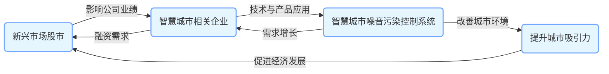

# 新兴市场股市估值与智慧城市噪音污染控制系统的互动

> 关键词：新兴市场股市估值、智慧城市、噪音污染控制系统、互动关系、经济与环境

> 摘要：本文旨在深入探讨新兴市场股市估值与智慧城市噪音污染控制系统之间的互动关系。通过对核心概念的剖析、相关算法原理的阐述、数学模型的构建以及项目实战案例的分析，揭示两者在经济、技术和环境等多方面的相互影响。研究新兴市场股市估值与智慧城市噪音污染控制系统的互动，有助于更好地理解经济发展与城市环境建设的协同关系，为新兴市场的可持续发展和智慧城市的优化提供理论支持和实践指导。

## 1. 背景介绍 
### 1.1 目的和范围
本研究的主要目的是全面探究新兴市场股市估值与智慧城市噪音污染控制系统之间的内在联系和互动机制。研究范围涵盖新兴市场的股票市场动态、智慧城市噪音污染控制系统的技术原理与应用，以及两者在不同经济环境和城市发展阶段下的相互影响。通过对这一主题的研究，旨在为投资者、城市规划者和政策制定者提供有价值的参考，促进新兴市场的经济增长和智慧城市的可持续发展。

### 1.2 预期读者
本文的预期读者包括金融领域的投资者、分析师、学者，城市规划和环境管理领域的专业人士，以及对新兴市场发展和智慧城市建设感兴趣的研究人员和政策制定者。这些读者可以从不同角度理解新兴市场股市估值与智慧城市噪音污染控制系统的互动关系，并将相关结论应用于实际决策中。

### 1.3 文档结构概述
本文首先介绍研究的背景和相关术语，为后续的分析奠定基础。接着阐述核心概念及其联系，通过文本示意图和 Mermaid 流程图直观展示。然后详细讲解核心算法原理和具体操作步骤，结合 Python 源代码进行说明。再通过数学模型和公式进一步深入分析两者的关系，并举例说明。之后通过项目实战案例，包括开发环境搭建、源代码实现和代码解读，展示实际应用。随后探讨实际应用场景，为不同领域的应用提供思路。接着推荐相关的学习资源、开发工具框架和论文著作，方便读者进一步深入研究。最后总结未来发展趋势与挑战，解答常见问题，并提供扩展阅读和参考资料。

### 1.4 术语表
#### 1.4.1 核心术语定义
- **新兴市场股市估值**：指对新兴市场中上市公司股票价值的评估过程和结果。新兴市场通常是指经济发展速度较快、资本市场逐步成熟的发展中国家或地区的市场。股市估值涉及多种方法和指标，用于衡量股票的相对价值和投资潜力。
- **智慧城市**：是运用物联网、云计算、大数据、空间地理信息集成等新一代信息技术，促进城市规划、建设、管理和服务智慧化的新理念和新模式。智慧城市旨在提高城市的运行效率、改善居民生活质量、实现可持续发展。
- **噪音污染控制系统**：是智慧城市的重要组成部分，用于监测、分析和控制城市环境中的噪音污染。该系统通过传感器网络实时采集噪音数据，运用数据分析和处理技术，采取相应的措施降低噪音水平，保护居民的健康和生活环境。

#### 1.4.2 相关概念解释
- **股市估值方法**：常见的股市估值方法包括市盈率（P/E）、市净率（P/B）、现金流折现法（DCF）等。市盈率是指股票价格与每股收益的比率，反映了投资者对公司盈利的预期；市净率是指股票价格与每股净资产的比率，反映了公司的资产价值；现金流折现法是通过预测公司未来的现金流，并将其折现到当前时点，来评估公司的内在价值。
- **物联网技术**：物联网是指通过各种信息传感设备，如传感器、射频识别（RFID）技术、全球定位系统、红外感应器、激光扫描器等，按约定的协议，把任何物品与互联网连接起来，进行信息交换和通信，以实现智能化识别、定位、跟踪、监控和管理的一种网络。在智慧城市噪音污染控制系统中，物联网技术用于实现噪音传感器的联网和数据传输。
- **大数据分析**：大数据分析是指对海量数据进行采集、存储、处理、分析和可视化的过程。在智慧城市噪音污染控制系统中，大数据分析用于挖掘噪音数据中的规律和趋势，为噪音控制决策提供依据。

#### 1.4.3 缩略词列表
- **P/E**：市盈率（Price-to-Earnings Ratio）
- **P/B**：市净率（Price-to-Book Ratio）
- **DCF**：现金流折现法（Discounted Cash Flow）
- **RFID**：射频识别（Radio Frequency Identification）
- **IoT**：物联网（Internet of Things）

## 2. 核心概念与联系 
### 核心概念原理
#### 新兴市场股市估值原理
新兴市场股市估值是基于对上市公司基本面和市场环境的综合分析。上市公司的基本面包括盈利能力、资产质量、管理水平等因素，这些因素决定了公司的内在价值。市场环境包括宏观经济形势、行业发展趋势、政策法规等因素，这些因素影响着股票的供求关系和市场预期。常见的股市估值方法是通过对公司的财务数据和市场数据进行分析，计算出股票的合理价值范围。

#### 智慧城市噪音污染控制系统原理
智慧城市噪音污染控制系统基于物联网和大数据技术。首先，通过分布在城市各个区域的噪音传感器实时采集噪音数据，并将数据传输到数据中心。然后，数据中心对采集到的噪音数据进行存储、处理和分析，运用数据分析算法挖掘噪音数据中的规律和趋势。最后，根据分析结果，采取相应的措施进行噪音控制，如调整交通流量、优化建筑设计、加强环境监管等。

### 架构的文本示意图
新兴市场股市估值与智慧城市噪音污染控制系统的互动架构可以描述如下：

新兴市场股市中的相关企业，如从事智慧城市建设、环保技术研发等领域的企业，其股价受到公司业绩和市场预期的影响。而公司业绩又与智慧城市噪音污染控制系统的建设和运营密切相关。例如，一家专注于噪音监测设备研发和生产的企业，如果其产品在智慧城市噪音污染控制系统中得到广泛应用，将可能提高公司的销售收入和利润，从而提升公司的股市估值。

另一方面，智慧城市噪音污染控制系统的建设和发展需要大量的资金投入，这些资金可以通过股票市场融资获得。股市估值的高低影响着企业的融资能力和成本。如果企业的股市估值较高，将更容易吸引投资者的资金，为噪音污染控制系统的建设提供充足的资金支持。

### Mermaid 流程图


## 3. 核心算法原理 & 具体操作步骤 
### 新兴市场股市估值算法原理
#### 市盈率法
市盈率法是一种简单常用的股市估值方法。其基本原理是通过比较公司的市盈率与同行业平均市盈率或市场平均市盈率，来判断股票的估值水平。计算公式为：

股票价值 = 每股收益 × 市盈率

具体操作步骤如下：
1. 收集公司的财务报表，获取每股收益数据。
2. 查找同行业平均市盈率或市场平均市盈率数据。
3. 根据上述公式计算股票的合理价值。

以下是使用 Python 实现市盈率法的示例代码：
```python
# 定义每股收益和市盈率
earnings_per_share = 2.0
pe_ratio = 15

# 计算股票价值
stock_value = earnings_per_share * pe_ratio

print(f"股票的合理价值为: {stock_value}")
```

#### 现金流折现法
现金流折现法是一种更为复杂和精确的股市估值方法。其基本原理是通过预测公司未来的现金流，并将其折现到当前时点，来评估公司的内在价值。计算公式为：

$$V = \sum_{t=1}^{n} \frac{CF_t}{(1 + r)^t}$$

其中，$V$ 表示公司的内在价值，$CF_t$ 表示第 $t$ 期的现金流，$r$ 表示折现率，$n$ 表示预测期数。

具体操作步骤如下：
1. 预测公司未来各期的现金流。
2. 确定折现率，折现率通常根据市场利率、公司风险等因素确定。
3. 根据上述公式计算公司的内在价值。

以下是使用 Python 实现现金流折现法的示例代码：
```python
import numpy as np

# 定义未来各期的现金流
cash_flows = np.array([100, 120, 150, 180, 200])

# 定义折现率
discount_rate = 0.1

# 计算折现因子
discount_factors = np.array([(1 + discount_rate) ** -i for i in range(1, len(cash_flows) + 1)])

# 计算公司的内在价值
intrinsic_value = np.sum(cash_flows * discount_factors)

print(f"公司的内在价值为: {intrinsic_value}")
```

### 智慧城市噪音污染控制系统算法原理
#### 噪音数据处理算法
噪音数据处理算法主要包括数据清洗、特征提取和数据分析等步骤。数据清洗用于去除噪音数据中的异常值和缺失值；特征提取用于提取噪音数据的关键特征，如平均噪音水平、噪音波动范围等；数据分析用于挖掘噪音数据中的规律和趋势。

以下是一个简单的噪音数据清洗和特征提取的 Python 示例代码：
```python
import numpy as np

# 模拟噪音数据
noise_data = np.array([50, 52, 55, 60, 65, 70, 75, 80, 85, 90])

# 数据清洗：去除异常值（假设异常值为大于 95 的值）
cleaned_data = noise_data[noise_data <= 95]

# 特征提取：计算平均噪音水平和噪音波动范围
average_noise = np.mean(cleaned_data)
noise_range = np.max(cleaned_data) - np.min(cleaned_data)

print(f"平均噪音水平为: {average_noise}")
print(f"噪音波动范围为: {noise_range}")
```

#### 噪音控制决策算法
噪音控制决策算法根据噪音数据分析结果，制定相应的噪音控制策略。例如，如果某一区域的噪音水平超过了设定的阈值，则采取交通管制、加强环境监管等措施。

以下是一个简单的噪音控制决策的 Python 示例代码：
```python
# 设定噪音阈值
noise_threshold = 70

# 模拟当前噪音水平
current_noise = 75

if current_noise > noise_threshold:
    print("当前噪音水平超过阈值，采取交通管制措施")
else:
    print("当前噪音水平正常，无需采取额外措施")
```

## 4. 数学模型和公式 & 详细讲解 & 举例说明 
### 新兴市场股市估值数学模型
#### 资本资产定价模型（CAPM）
资本资产定价模型是一种用于计算股票预期收益率的数学模型。其公式为：

$$R_i = R_f + \beta_i (R_m - R_f)$$

其中，$R_i$ 表示股票 $i$ 的预期收益率，$R_f$ 表示无风险收益率，$\beta_i$ 表示股票 $i$ 的贝塔系数，$R_m$ 表示市场组合的预期收益率。

贝塔系数 $\beta_i$ 衡量了股票 $i$ 的收益率相对于市场组合收益率的波动程度。如果 $\beta_i > 1$，则股票 $i$ 的收益率波动比市场组合更大；如果 $\beta_i < 1$，则股票 $i$ 的收益率波动比市场组合更小。

举例说明：假设无风险收益率 $R_f = 3\%$，市场组合的预期收益率 $R_m = 10\%$，某股票的贝塔系数 $\beta_i = 1.2$。则该股票的预期收益率为：

$$R_i = 0.03 + 1.2 \times (0.1 - 0.03) = 0.114 = 11.4\%$$

#### 股息折现模型（DDM）
股息折现模型是一种基于股息分配的股市估值模型。其基本思想是将股票的价值视为未来股息的现值之和。对于固定增长的股息折现模型，其公式为：

$$V = \frac{D_1}{r - g}$$

其中，$V$ 表示股票的价值，$D_1$ 表示下一期的股息，$r$ 表示折现率，$g$ 表示股息的固定增长率。

举例说明：假设某股票下一期的股息 $D_1 = 2$ 元，折现率 $r = 10\%$，股息的固定增长率 $g = 5\%$。则该股票的价值为：

$$V = \frac{2}{0.1 - 0.05} = 40$$

### 智慧城市噪音污染控制系统数学模型
#### 噪音传播模型
噪音传播模型用于描述噪音在空间中的传播规律。常见的噪音传播模型有点声源传播模型和线声源传播模型。

点声源传播模型的公式为：

$$L_p(r) = L_{p0} - 20 \log_{10} \frac{r}{r_0}$$

其中，$L_p(r)$ 表示距离点声源 $r$ 处的声压级，$L_{p0}$ 表示距离点声源 $r_0$ 处的声压级。

举例说明：假设在距离点声源 $r_0 = 1$ 米处的声压级 $L_{p0} = 80$ dB，求距离点声源 $r = 10$ 米处的声压级。

$$L_p(10) = 80 - 20 \log_{10} \frac{10}{1} = 60$$

#### 噪音预测模型
噪音预测模型用于预测未来某一时刻或某一区域的噪音水平。常用的噪音预测模型有时间序列模型和回归模型。

以简单的线性回归模型为例，假设噪音水平 $y$ 与时间 $x$ 之间存在线性关系：

$$y = a + bx$$

其中，$a$ 和 $b$ 是回归系数。通过对历史噪音数据的拟合，可以得到回归系数 $a$ 和 $b$ 的值，从而预测未来的噪音水平。

举例说明：假设通过对历史噪音数据的拟合得到回归系数 $a = 50$，$b = 0.5$。当时间 $x = 10$ 时，预测的噪音水平为：

$$y = 50 + 0.5 \times 10 = 55$$

## 5. 项目实战：代码实际案例和详细解释说明 
### 5.1  开发环境搭建
#### 硬件环境
- **服务器**：选择一台性能稳定的服务器，如戴尔 PowerEdge R740xd，用于运行数据处理和分析程序。
- **噪音传感器**：采用高精度的噪音传感器，如霍尼韦尔 HIH-4000 系列传感器，用于实时采集噪音数据。
- **网络设备**：配备交换机、路由器等网络设备，确保传感器与服务器之间的网络连接稳定。

#### 软件环境
- **操作系统**：选择 Linux 操作系统，如 Ubuntu 20.04，作为服务器的操作系统。
- **数据库**：使用 MySQL 数据库，用于存储噪音数据和股市数据。
- **开发语言和框架**：选择 Python 作为开发语言，使用 Flask 框架搭建 Web 应用程序，使用 Pandas、NumPy 等库进行数据处理和分析。

### 5.2  源代码详细实现和代码解读
#### 噪音数据采集模块
```python
import serial
import time

# 串口通信设置
ser = serial.Serial('/dev/ttyUSB0', 9600, timeout=1)

def collect_noise_data():
    while True:
        try:
            # 读取串口数据
            data = ser.readline().decode('utf-8').strip()
            if data:
                # 处理噪音数据
                noise_level = float(data)
                print(f"当前噪音水平: {noise_level} dB")
                # 保存数据到数据库
                save_to_database(noise_level)
            time.sleep(1)
        except Exception as e:
            print(f"数据采集错误: {e}")

def save_to_database(noise_level):
    # 连接数据库
    import mysql.connector
    mydb = mysql.connector.connect(
        host="localhost",
        user="your_username",
        password="your_password",
        database="noise_database"
    )
    mycursor = mydb.cursor()
    # 插入数据
    sql = "INSERT INTO noise_data (noise_level) VALUES (%s)"
    val = (noise_level,)
    mycursor.execute(sql, val)
    mydb.commit()
    print(mycursor.rowcount, "条数据插入成功")
    mydb.close()

if __name__ == "__main__":
    collect_noise_data()
```
代码解读：
- 该模块通过串口通信从噪音传感器读取噪音数据。
- 将读取到的噪音数据转换为浮点数，并打印当前噪音水平。
- 调用 `save_to_database` 函数将噪音数据保存到 MySQL 数据库中。

#### 股市数据获取模块
```python
import yfinance as yf

def get_stock_data(ticker_symbol):
    # 获取股票数据
    stock = yf.Ticker(ticker_symbol)
    data = stock.history(period="1d")
    # 提取收盘价
    closing_price = data['Close'].iloc[-1]
    print(f"{ticker_symbol} 股票的收盘价: {closing_price}")
    return closing