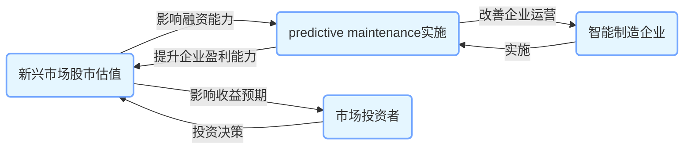

# 新兴市场股市估值与智能制造predictive maintenance的互动

> 关键词：新兴市场股市估值、智能制造、predictive maintenance、互动关系、预测分析

> 摘要：本文旨在深入探讨新兴市场股市估值与智能制造中predictive maintenance（预测性维护）之间的互动关系。首先介绍研究的背景、目的、预期读者、文档结构及相关术语。接着阐述核心概念，包括新兴市场股市估值原理、predictive maintenance的架构等，并通过Mermaid流程图展示其联系。详细讲解核心算法原理，用Python代码实现相关分析。给出涉及的数学模型和公式并举例说明。通过项目实战展示代码实现和解读。分析实际应用场景，推荐学习资源、开发工具框架和相关论文著作。最后总结未来发展趋势与挑战，解答常见问题并提供扩展阅读和参考资料，以全面剖析两者之间复杂而重要的互动关系。

## 1. 背景介绍 
### 1.1 目的和范围
本研究的主要目的是揭示新兴市场股市估值与智能制造中predictive maintenance之间的内在互动机制。新兴市场股市由于其独特的经济环境、政策因素和市场特征，其估值受到多种因素的影响。而智能制造中的predictive maintenance作为一种先进的维护策略，正逐渐改变制造业的运营模式和效率。了解两者之间的互动关系，有助于投资者更好地评估新兴市场股市的投资价值，同时也能为制造业企业在实施predictive maintenance时提供决策参考。

研究范围涵盖新兴市场的主要股市，包括亚洲、非洲和拉丁美洲等地区的代表性市场。对于predictive maintenance，涉及到制造业的各个领域，如汽车制造、航空航天、能源等行业。

### 1.2 预期读者
本文的预期读者包括金融投资者、金融分析师、智能制造领域的从业者、研究新兴市场和智能制造的学者以及对相关领域感兴趣的技术爱好者。金融投资者可以通过了解两者的互动关系，优化投资组合，提高投资收益。金融分析师可以将此研究作为分析新兴市场股市的一个新视角。智能制造从业者可以从中了解predictive maintenance对企业在资本市场的影响。学者可以在此基础上进行更深入的学术研究。技术爱好者可以拓宽知识面，了解跨领域的知识融合。

### 1.3 文档结构概述
本文将按照以下结构展开：首先介绍背景信息，包括研究目的、预期读者、文档结构和术语表。接着阐述核心概念，展示其原理和架构，并通过流程图说明它们之间的联系。然后详细讲解核心算法原理和具体操作步骤，并用Python代码实现。之后给出相关的数学模型和公式，并举例说明。通过项目实战，展示代码的实际应用和详细解读。分析两者在实际中的应用场景，推荐学习资源、开发工具框架和相关论文著作。最后总结未来发展趋势与挑战，解答常见问题并提供扩展阅读和参考资料。

### 1.4 术语表
#### 1.4.1 核心术语定义
- **新兴市场股市估值**：指对新兴市场中上市公司股票价值的评估，通常考虑公司的财务状况、行业前景、宏观经济环境等因素。常见的估值方法包括市盈率法、市净率法等。
- **智能制造**：是一种基于新一代信息技术，贯穿于设计、生产、管理、服务等制造活动各个环节，具有信息深度自感知、智慧优化自决策、精准控制自执行等功能的先进制造过程、系统与模式的总称。
- **predictive maintenance（预测性维护）**：是利用传感器技术、数据分析和机器学习算法等手段，对设备的运行状态进行实时监测和分析，提前预测设备可能出现的故障，并在故障发生前进行维护的一种维护策略。

#### 1.4.2 相关概念解释
- **股票估值模型**：用于计算股票内在价值的数学模型，常见的有股息贴现模型（DDM）、自由现金流贴现模型（DCF）等。这些模型通过对公司未来的现金流、股息等进行预测，来评估股票的价值。
- **工业物联网（IIoT）**：是物联网在工业领域的应用，通过将各种工业设备连接到互联网，实现设备之间的数据传输和共享，为predictive maintenance提供数据基础。
- **机器学习算法**：是一类从数据中自动分析获得规律，并利用规律对未知数据进行预测的算法。在predictive maintenance中，常用的机器学习算法包括决策树、支持向量机、神经网络等。

#### 1.4.3 缩略词列表
- **EM（Emerging Markets）**：新兴市场
- **PM（Predictive Maintenance）**：预测性维护
- **IIoT（Industrial Internet of Things）**：工业物联网
- **DDM（Dividend Discount Model）**：股息贴现模型
- **DCF（Discounted Cash Flow）**：自由现金流贴现模型

## 2. 核心概念与联系 

### 新兴市场股市估值原理
新兴市场股市估值的核心在于评估上市公司的内在价值。其原理基于对公司未来盈利能力的预期。常见的估值方法有相对估值法和绝对估值法。

相对估值法是通过比较同行业或类似公司的估值指标来评估目标公司的价值。例如，市盈率（P/E）法，即公司股票价格与每股收益的比值。如果一家新兴市场的公司市盈率低于同行业平均水平，可能被认为是低估的。

绝对估值法是通过预测公司未来的现金流，并将其折现到当前来计算公司的内在价值。如股息贴现模型（DDM），假设公司的股息以固定增长率 $g$ 增长，必要收益率为 $r$，当前股息为 $D_0$，则股票的内在价值 $V$ 可以表示为：

$$V = \frac{D_0(1 + g)}{r - g}$$

### predictive maintenance架构
predictive maintenance主要包括数据采集、数据预处理、特征提取、模型训练和预测决策五个阶段。

- **数据采集**：通过安装在设备上的各种传感器，如温度传感器、振动传感器等，实时采集设备的运行数据。
- **数据预处理**：对采集到的原始数据进行清洗、降噪、归一化等处理，以提高数据质量。
- **特征提取**：从预处理后的数据中提取能够反映设备运行状态的特征，如均值、方差、频谱等。
- **模型训练**：使用机器学习或深度学习算法，如支持向量机、神经网络等，对提取的特征进行训练，建立故障预测模型。
- **预测决策**：根据训练好的模型对设备的未来运行状态进行预测，并根据预测结果制定维护决策。

### 两者联系的文本示意图
新兴市场股市估值与predictive maintenance之间存在着间接和直接的联系。

间接联系方面，智能制造企业实施predictive maintenance可以提高生产效率、降低维护成本、减少设备故障停机时间，从而提升企业的盈利能力。企业盈利能力的提升会影响其在新兴市场股市中的估值。例如，一家实施了有效predictive maintenance的汽车制造企业，由于生产效率提高和成本降低，其净利润可能会增加，进而导致其股票价格上升，股市估值提高。

直接联系方面，新兴市场的股市表现会影响智能制造企业的融资能力。如果股市估值较高，企业可以通过增发股票等方式获得更多的资金，用于研发和推广predictive maintenance技术。反之，如果股市估值较低，企业的融资难度会增加，可能会影响predictive maintenance技术的实施进度。

### Mermaid流程图


## 3. 核心算法原理 & 具体操作步骤 

### 新兴市场股市估值算法
这里我们使用自由现金流贴现模型（DCF）来进行新兴市场股市估值。DCF模型的核心思想是将公司未来的自由现金流折现到当前，得到公司的内在价值。

#### 算法原理
假设公司在未来 $n$ 年的自由现金流分别为 $FCF_1, FCF_2, \cdots, FCF_n$，第 $n$ 年后的自由现金流以固定增长率 $g$ 增长，必要收益率为 $r$。则公司的内在价值 $V$ 可以表示为：

$$V = \sum_{i = 1}^{n} \frac{FCF_i}{(1 + r)^i} + \frac{FCF_n(1 + g)}{(r - g)(1 + r)^n}$$

#### Python代码实现
```python
def dcf_valuation(fcf_list, r, g):
    """
    自由现金流贴现模型估值
    :param fcf_list: 未来n年的自由现金流列表
    :param r: 必要收益率
    :param g: 永续增长率
    :return: 公司的内在价值
    """
    n = len(fcf_list)
    present_value = 0
    # 计算前n年自由现金流的现值
    for i in range(n):
        present_value += fcf_list[i] / ((1 + r) ** (i + 1))
    # 计算第n年后永续现金流的现值
    terminal_value = fcf_list[-1] * (1 + g) / ((r - g) * (1 + r) ** n)
    present_value += terminal_value
    return present_value

# 示例
fcf_list = [100, 120, 140, 160, 180]
r = 0.1
g = 0.03
valuation = dcf_valuation(fcf_list, r, g)
print(f"公司的内在价值为: {valuation}")
```

### predictive maintenance故障预测算法
这里我们使用支持向量机（SVM）算法进行设备故障预测。

#### 算法原理
支持向量机是一种二分类模型，其基本思想是在特征空间中找到一个最优的超平面，使得不同类别的样本能够被最大程度地分开。在故障预测中，我们将正常运行状态和故障状态作为两个类别，通过训练数据找到最优的超平面，然后对新的数据进行分类预测。

#### Python代码实现
```python
from sklearn import svm
from sklearn.model_selection import train_test_split
from sklearn.metrics import accuracy_score
import numpy as np

# 生成示例数据
np.random.seed(0)
X = np.r_[np.random.randn(20, 2) - [2, 2], np.random.randn(20, 2) + [2, 2]]
Y = [0] * 20 + [1] * 20

# 划分训练集和测试集
X_train, X_test, y_train, y_test = train_test_split(X, Y, test_size=0.2, random_state=42)

# 创建SVM分类器
clf = svm.SVC(kernel='linear')

# 训练模型
clf.fit(X_train, y_train)

# 预测
y_pred = clf.predict(X_test)

# 计算准确率
accuracy = accuracy_score(y_test, y_pred)
print(f"预测准确率: {accuracy}")
```

## 4. 数学模型和公式 & 详细讲解 & 举例说明 

### 新兴市场股市估值数学模型
#### 股息贴现模型（DDM）
公式为：

$$V = \frac{D_0(1 + g)}{r - g}$$

其中，$V$ 表示股票的内在价值，$D_0$ 表示当前股息，$g$ 表示股息增长率，$r$ 表示必要收益率。

**详细讲解**：该模型假设股息以固定增长率 $g$ 增长，投资者要求的必要收益率为 $r$。通过将未来无限期的股息折现到当前，得到股票的内在价值。

**举例说明**：假设某新兴市场公司当前股息 $D_0 = 2$ 元，股息增长率 $g = 0.05$，必要收益率 $r = 0.1$。则该股票的内在价值为：

$$V = \frac{2\times(1 + 0.05)}{0.1 - 0.05} = \frac{2.1}{0.05} = 42$$（元）

#### 自由现金流贴现模型（DCF）
公式为：

$$V = \sum_{i = 1}^{n} \frac{FCF_i}{(1 + r)^i} + \frac{FCF_n(1 + g)}{(r - g)(1 + r)^n}$$

其中，$V$ 表示公司的内在价值，$FCF_i$ 表示第 $i$ 年的自由现金流，$r$ 表示必要收益率，$g$ 表示永续增长率，$n$ 表示预测期。

**详细讲解**：该模型将公司未来 $n$ 年的自由现金流分别折现到当前，再加上第 $n$ 年后永续现金流的现值，得到公司的内在价值。

**举例说明**：假设某新兴市场公司未来 5 年的自由现金流分别为 $FCF_1 = 100$ 万元，$FCF_2 = 120$ 万元，$FCF_3 = 140$ 万元，$FCF_4 = 160$ 万元，$FCF_5 = 180$ 万元，必要收益率 $r = 0.1$，永续增长率 $g = 0.03$。则该公司的内在价值为：

首先计算前 5 年自由现金流的现值：

$$PV_1 = \frac{100}{(1 + 0.1)^1} = 90.91$$（万元）

$$PV_2 = \frac{120}{(1 + 0.1)^2} = 99.17$$（万元）

$$PV_3 = \frac{140}{(1 + 0.1)^3} = 105.18$$（万元）

$$PV_4 = \frac{160}{(1 + 0.1)^4} = 109.29$$（万元）

$$PV_5 = \frac{180}{(1 + 0.1)^5} = 111.77$$（万元）

前 5 年自由现金流现值之和为：

$$PV_{1 - 5} = 90.91 + 99.17 + 105.18 + 109.29 + 111.77 = 516.32$$（万元）

然后计算第 5 年后永续现金流的现值：

$$TV = \frac{180\times(1 + 0.03)}{(0.1 - 0.03)\times(1 + 0.1)^5} = \frac{185.4}{0.07\times1.61051} = 1654.74$$（万元）

公司的内在价值为：

$$V = 516.32 + 1654.74 = 2171.06$$（万元）

### predictive maintenance数学模型
#### 支持向量机（SVM）
支持向量机的目标是找到一个最优的超平面 $w^T x + b = 0$，使得不同类别的样本能够被最大程度地分开。其优化目标可以表示为：

$$\min_{w, b} \frac{1}{2}||w||^2$$

约束条件为：

$$y_i(w^T x_i + b) \geq 1, i = 1, 2, \cdots, n$$

其中，$w$ 是超平面的法向量，$b$ 是偏置，$x_i$ 是样本点，$y_i$ 是样本的类别标签（$y_i \in \{-1, 1\}$）。

**详细讲解**：支持向量机通过最小化 $w$ 的范数的一半，来找到一个间隔最大的超平面。约束条件保证了所有样本点都在间隔之外。

**举例说明**：假设有两个二维样本点 $x_1 = [1, 2]$，$y_1 = 1$；$x_2 = [-1, -2]$，$y_2 = -1$。我们可以使用支持向量机来找到一个超平面将这两个样本点分开。

通过求解上述优化问题，我们可以得到最优的 $w$ 和 $b$，从而确定超平面的方程。在实际应用中，我们可以使用 Python 的 `sklearn` 库来实现支持向量机。

## 5. 项目实战：代码实际案例和详细解释说明 

### 5.1  开发环境搭建
#### 安装 Python
首先，我们需要安装 Python。可以从 Python 官方网站（https://www.python.org/downloads/）下载适合你操作系统的 Python 版本。建议安装 Python 3.7 及以上版本。

#### 安装必要的库
我们需要安装一些必要的 Python 库，如 `numpy`、`pandas`、`scikit-learn` 等。可以使用以下命令进行安装：

```bash
pip install numpy pandas scikit-learn
```

### 5.2  源代码详细实现和代码解读
#### 新兴市场股市估值项目
```python
import numpy as np

def dcf_valuation(fcf_list, r, g):
    """
    自由现金流贴现模型估值
    :param fcf_list: 未来n年的自由现金流列表
    :param r: 必要收益率
    :param g: 永续增长率
    :return: 公司的内在价值
    """
    n = len(fcf_list)
    present_value = 0
    # 计算前n年自由现金流的现值
    for i in range(n):
        present_value += fcf_list[i] / ((1 + r) ** (i + 1))
    # 计算第n年后永续现金流的现值
    terminal_value = fcf_list[-1] * (1 + g) / ((r - g) * (1 + r) ** n)
    present_value += terminal_value
    return present_value

# 示例数据
fcf_list = [100, 120, 140, 160, 180]
r = 0.1
g = 0.03

# 计算公司的内在价值
valuation = dcf_valuation(fcf_list, r, g)
print(f"公司的内在价值为: {valuation}")
```

**代码解读**：
- `dcf_valuation` 函数实现了自由现金流贴现模型的估值计算。
- `fcf_list` 是未来 $n$ 年的自由现金流列表，`r` 是必要收益率，`g` 是永续增长率。
- 通过循环计算前 $n$ 年自由现金流的现值，再计算第 $n$ 年后永续现金流的现值，最后将两者相加得到公司的内在价值。

#### predictive maintenance故障预测项目
```python
from sklearn import svm
from sklearn.model_selection import train_test_split
from sklearn.metrics import accuracy_score
import numpy as np

# 生成示例数据
np.random.seed(0)
X = np.r_[np.random.randn(20, 2) - [2, 2], np.random.randn(20, 2) + [2, 2]]
Y = [0] * 20 + [1] * 20

# 划分训练集和测试集
X_train, X_test, y_train, y_test = train_test_split(X, Y, test_size=0.2, random_state=42)

# 创建SVM分类器
clf = svm.SVC(kernel='linear')

# 训练模型
clf.fit(X_train, y_train)

# 预测
y_pred = clf.predict(X_test)

# 计算准确率
accuracy = accuracy_score(y_test, y_pred)
print(f"预测准确率: {accuracy}")
```

**代码解读**：
- 首先使用 `numpy` 生成示例数据，其中 `X` 是特征矩阵，`Y` 是类别标签。
- 使用 `train_test_split` 函数将数据划分为训练集和测试集。
- 创建一个线性核的支持向量机分类器 `clf`。
- 使用训练集数据对模型进行训练。
- 使用测试集数据进行预测，并计算预测准确率。

### 5.3  代码解读与分析
#### 新兴市场股市估值代码分析
在 `dcf_valuation` 函数中，我们使用了简单的循环来计算前 $n$ 年自由现金流的现值。这种方法直观易懂，但对于大规模数据可能效率较低。可以考虑使用向量化操作来提高计算效率。

另外，在实际应用中，自由现金流和必要收益率、永续增长率的估计是非常关键的。这些参数的微小变化可能会导致估值结果的较大差异。因此，需要进行充分的市场调研和分析，以提高参数估计的准确性。

#### predictive maintenance故障预测代码分析
在故障预测代码中，我们使用了支持向量机算法。支持向量机在处理小样本、非线性问题时具有较好的性能。但在实际应用中，可能需要对数据进行更复杂的预处理和特征工程，以提高模型的准确性。

另外，模型的评估指标不仅仅局限于准确率，还可以考虑使用召回率、F1 值等指标，以更全面地评估模型的性能。

## 6. 实际应用场景 
### 金融投资领域
在金融投资领域，了解新兴市场股市估值与predictive maintenance的互动关系可以帮助投资者做出更明智的投资决策。例如，投资者可以关注那些实施了先进predictive maintenance技术的智能制造企业。这些企业由于生产效率提高、成本降低，其盈利能力可能会增强，从而导致股票价格上升。投资者可以通过分析企业的财务报表和相关技术报告，评估predictive maintenance对企业估值的影响，选择具有投资价值的股票。

### 制造业企业管理
对于制造业企业来说，predictive maintenance可以帮助企业优化生产计划、降低维护成本。通过实时监测设备的运行状态，提前预测设备故障，企业可以在故障发生前进行维护，避免设备停机带来的损失。同时，企业实施predictive maintenance的效果也会影响其在新兴市场股市中的估值。良好的维护效果可以提升企业的市场形象和投资者信心，从而提高企业的股市估值。企业可以利用股市估值的反馈，调整predictive maintenance的实施策略，进一步提高企业的竞争力。

### 政府政策制定
政府在制定新兴市场发展政策时，可以考虑新兴市场股市估值与predictive maintenance的互动关系。政府可以出台相关政策，鼓励智能制造企业实施predictive maintenance技术，提高企业的生产效率和竞争力。同时，政府可以加强对新兴市场股市的监管，引导投资者关注具有创新能力和发展潜力的智能制造企业，促进新兴市场股市的健康发展。

## 7. 工具和资源推荐
### 7.1 学习资源推荐
#### 7.1.1 书籍推荐
- 《金融市场与金融机构》：这本书全面介绍了金融市场的基本概念、金融机构的运作方式以及金融产品的定价原理，对于理解新兴市场股市估值有很大的帮助。
- 《智能制造：原理、技术与应用》：详细阐述了智能制造的基本原理、关键技术和实际应用案例，包括predictive maintenance的相关内容。
- 《机器学习》：周志华教授的这本书是机器学习领域的经典教材，涵盖了各种机器学习算法的原理和应用，对于学习predictive maintenance中的算法有重要的参考价值。

#### 7.1.2 在线课程
- Coursera 上的“Financial Markets”课程：由耶鲁大学教授 Robert Shiller 授课，深入讲解了金融市场的理论和实践，帮助学习者了解股市估值的方法和影响因素。
- edX 上的“Introduction to Industrial Internet of Things”课程：介绍了工业物联网的基本概念和技术，以及如何应用于predictive maintenance。
- 网易云课堂上的“Python 机器学习实战”课程：通过实际案例，讲解了如何使用 Python 实现机器学习算法，对于掌握predictive maintenance中的算法实现有很大的帮助。

#### 7.1.3 技术博客和网站
- 金融界（https://www.jrj.com.cn/）：提供了丰富的金融市场资讯和分析报告，对于了解新兴市场股市动态有很大的帮助。
- 工业互联网产业联盟（https://www.aiialliance.org/）：专注于工业互联网领域的研究和推广，发布了很多关于智能制造和predictive maintenance的技术文章和报告。
- Medium 上的“Towards Data Science”博客：分享了很多数据科学和机器学习的最新技术和应用案例，对于学习predictive maintenance中的数据分析和算法有很大的启发。

### 7.2 开发工具框架推荐
#### 7.2.1 IDE和编辑器
- PyCharm：是一款专门为 Python 开发设计的集成开发环境，具有强大的代码编辑、调试和自动补全功能，适合开发新兴市场股市估值和predictive maintenance相关的 Python 代码。
- Jupyter Notebook：是一个交互式的开发环境，支持多种编程语言，特别适合进行数据分析和模型验证。可以使用 Jupyter Notebook 进行新兴市场股市数据的分析和predictive maintenance模型的训练。

#### 7.2.2 调试和性能分析工具
- PDB：是 Python 自带的调试工具，可以帮助开发者定位代码中的错误。通过设置断点、单步执行等功能，逐步调试代码，找出问题所在。
- cProfile：是 Python 的性能分析工具，可以分析代码的运行时间和函数调用情况。通过分析性能瓶颈，优化代码的执行效率。

#### 7.2.3 相关框架和库
- NumPy：是 Python 中用于科学计算的基础库，提供了高效的多维数组对象和各种数学函数，对于处理新兴市场股市数据和predictive maintenance中的数据非常有用。
- Pandas：是 Python 中用于数据处理和分析的库，提供了灵活的数据结构和数据操作方法，方便进行数据清洗、转换和分析。
- Scikit-learn：是 Python 中常用的机器学习库，提供了各种机器学习算法的实现，如支持向量机、决策树、神经网络等，可用于predictive maintenance中的故障预测模型训练。

### 7.3 相关论文著作推荐
#### 7.3.1 经典论文
- Fama, E. F., & French, K. R. (1992). The cross-section of expected stock returns. Journal of Finance, 47(2), 427-465. 这篇论文提出了著名的 Fama-French 三因子模型，对于理解股票收益率的影响因素有重要的意义，可用于新兴市场股市估值的研究。
- Lee, J., Qiu, H., & Yu, G. (2014). Machine learning for predictive maintenance: A multiple classifier approach. IEEE Transactions on Industrial Informatics, 10(2), 1267-1278. 该论文介绍了使用机器学习方法进行predictive maintenance的多分类器方法，为故障预测提供了新的思路。

#### 7.3.2 最新研究成果
- 近年来，关于新兴市场股市估值和predictive maintenance的研究不断涌现。可以通过学术数据库，如 IEEE Xplore、ACM Digital Library、ScienceDirect 等，搜索最新的研究论文，了解该领域的前沿动态。

#### 7.3.3 应用案例分析
- 一些知名企业的案例分析报告可以为实际应用提供参考。例如，GE 公司在航空发动机领域应用predictive maintenance的案例，详细介绍了如何通过数据分析和机器学习算法，实现设备的故障预测和维护优化。可以通过企业官网、行业报告等渠道获取相关案例分析资料。

## 8. 总结：未来发展趋势与挑战
### 未来发展趋势
#### 技术融合加深
新兴市场股市估值与predictive maintenance的互动将随着技术的发展而更加紧密。随着人工智能、大数据、物联网等技术的不断进步，企业可以更准确地收集和分析设备运行数据，提高predictive maintenance的效果。同时，这些技术也可以为新兴市场股市估值提供更丰富的信息和更精准的模型。例如，通过分析工业物联网收集的设备数据，可以更准确地评估企业的生产效率和盈利能力，从而提高股市估值的准确性。

#### 跨领域合作加强
未来，金融领域和制造业领域的跨领域合作将不断加强。金融机构可以为智能制造企业提供更多的融资支持和金融服务，帮助企业实施predictive maintenance技术。同时，制造业企业的良好发展也会为金融市场带来更多的投资机会。例如，金融机构可以与智能制造企业合作，开发基于predictive maintenance的金融产品，如设备故障保险等。

#### 国际化趋势明显
随着全球经济一体化的发展，新兴市场与国际市场的联系越来越紧密。新兴市场股市估值和predictive maintenance也将受到国际市场的影响。一方面，国际投资者对新兴市场的关注度不断提高，他们会更加关注企业的技术创新和运营效率，包括predictive maintenance的实施情况。另一方面，智能制造企业也会面临来自国际市场的竞争，需要不断提高predictive maintenance的水平，以提升企业的国际竞争力。

### 挑战
#### 数据质量和安全问题
在新兴市场股市估值和predictive maintenance中，数据是关键。但新兴市场的数据质量可能存在问题，如数据缺失、错误、不一致等。同时，数据安全也是一个重要的挑战。企业需要保护设备运行数据和财务数据的安全，防止数据泄露和滥用。

#### 技术人才短缺
实施新兴市场股市估值和predictive maintenance需要具备金融、智能制造、数据分析等多方面知识的复合型人才。但目前这类人才相对短缺，企业和金融机构在招聘和培养人才方面面临较大的压力。

#### 政策和法规不完善
新兴市场的政策和法规可能不够完善，对于新兴技术和金融创新的监管存在一定的滞后性。这可能会给企业实施predictive maintenance和金融机构进行股市估值带来一定的风险。例如，数据隐私保护法规的不完善可能会导致企业在收集和使用数据时面临法律风险。

## 9. 附录：常见问题与解答
### 问题 1：新兴市场股市估值和发达市场股市估值有什么区别？
解答：新兴市场股市估值和发达市场股市估值存在多方面的区别。新兴市场的经济发展速度较快，但市场的稳定性和成熟度相对较低。新兴市场的企业可能面临更多的政治风险、政策风险和市场波动风险。因此，在进行新兴市场股市估值时，需要考虑更多的不确定性因素，如宏观经济政策的变化、政治局势的稳定性等。而发达市场的经济发展相对稳定，市场机制较为完善，企业的财务数据和信息披露更加规范，估值方法相对更加成熟和标准化。

### 问题 2：predictive maintenance 一定能提高企业的股市估值吗？
解答：predictive maintenance不一定能直接提高企业的股市估值。虽然predictive maintenance可以提高企业的生产效率、降低维护成本、减少设备故障停机时间，从而提升企业的盈利能力。但股市估值还受到很多其他因素的影响，如宏观经济环境、行业竞争状况、企业的战略规划等。如果企业实施predictive maintenance的成本过高，或者市场对该技术的认可度不高，可能不会对股市估值产生积极的影响。因此，企业需要综合考虑各种因素，合理实施predictive maintenance，以提高企业的综合竞争力和股市估值。

### 问题 3：如何选择适合的机器学习算法进行predictive maintenance？
解答：选择适合的机器学习算法进行predictive maintenance需要考虑多个因素。首先，要考虑数据的特点，如数据的规模、维度、分布等。如果数据规模较小，可以选择一些简单的算法，如决策树、支持向量机等；如果数据规模较大，可以考虑使用深度学习算法，如神经网络。其次，要考虑问题的类型，如分类问题、回归问题等。对于故障预测问题，通常是一个分类问题，可以选择适合分类的算法。此外，还需要考虑算法的可解释性、计算复杂度等因素。在实际应用中，可以通过实验比较不同算法的性能，选择最适合的算法。

## 10. 扩展阅读 & 参考资料
### 扩展阅读
- 《人工智能时代的金融科技》：探讨了人工智能技术在金融领域的应用，包括股市估值、风险评估等方面，对于理解新兴市场股市估值的技术发展趋势有很大的帮助。
- 《工业4.0：未来工业的商业模式和技术发展》：详细介绍了工业4.0的概念、技术和应用，包括predictive maintenance在工业4.0中的作用，对于了解智能制造的发展趋势有重要的参考价值。

### 参考资料
- Fama, E. F., & French, K. R. (1992). The cross-section of expected stock returns. Journal of Finance, 47(2), 427-465.
- Lee, J., Qiu, H., & Yu, G. (2014). Machine learning for predictive maintenance: A multiple classifier approach. IEEE Transactions on Industrial Informatics, 10(2), 1267-1278.
- 相关金融市场和智能制造领域的行业报告和统计数据。

作者：AI天才研究院/AI Genius Institute & 禅与计算机程序设计艺术 /Zen And The Art of Computer Programming