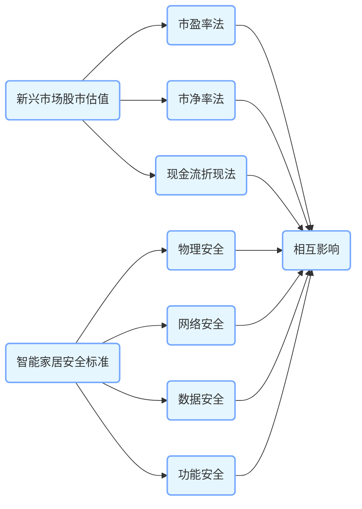

# 新兴市场股市估值与智能家居安全标准的互动

> 关键词：新兴市场股市、股市估值、智能家居、安全标准、互动关系

> 摘要：本文旨在深入探讨新兴市场股市估值与智能家居安全标准之间的互动关系。通过对新兴市场股市估值的原理、方法以及智能家居安全标准的内涵、发展进行详细分析，阐述两者之间相互影响、相互作用的内在机制。同时，结合实际案例和数学模型，揭示这种互动关系对市场和产业发展的重要意义，并对未来的发展趋势和面临的挑战进行展望，为相关领域的研究和实践提供有价值的参考。

## 1. 背景介绍 
### 1.1 目的和范围
随着全球经济的快速发展，新兴市场在国际经济格局中的地位日益重要。新兴市场股市作为经济的重要组成部分，其估值情况受到众多投资者和研究者的关注。与此同时，智能家居产业也在迅速崛起，安全标准作为保障其健康发展的关键因素，越来越受到重视。本文的目的在于研究新兴市场股市估值与智能家居安全标准之间的互动关系，范围涵盖新兴市场股市估值的理论与实践、智能家居安全标准的制定与实施，以及两者之间相互影响的机制和实际案例分析。

### 1.2 预期读者
本文预期读者包括金融领域的投资者、分析师、研究人员，智能家居产业的从业者、政策制定者，以及对新兴市场和智能家居领域感兴趣的学者和爱好者。

### 1.3 文档结构概述
本文首先介绍研究的背景、目的和范围，明确预期读者和文档结构。接着阐述新兴市场股市估值和智能家居安全标准的核心概念与联系，包括原理、架构和流程图。然后详细讲解核心算法原理和具体操作步骤，以及相关的数学模型和公式。通过项目实战案例，展示代码实现和详细解释说明。分析实际应用场景，推荐相关的工具和资源。最后总结未来发展趋势与挑战，解答常见问题，并提供扩展阅读和参考资料。

### 1.4 术语表
#### 1.4.1 核心术语定义
- **新兴市场股市**：指发展中国家或地区的股票市场，具有较高的增长潜力和风险。
- **股市估值**：对股票市场中股票价值的评估，通过各种方法确定股票的合理价格。
- **智能家居**：利用先进的信息技术，将家居设备连接成一个智能化的系统，实现家居的自动化控制和管理。
- **安全标准**：为保障产品、系统或服务的安全性而制定的一系列规范和要求。

#### 1.4.2 相关概念解释
- **新兴市场**：通常指那些经济发展较快、市场潜力较大的发展中国家和地区，其股票市场具有独特的特点和发展规律。
- **股市估值方法**：包括市盈率法、市净率法、现金流折现法等，不同方法适用于不同的情况和行业。
- **智能家居系统**：由各种智能设备、传感器、控制器和通信网络组成，通过软件平台实现对家居环境的智能化管理。
- **安全标准体系**：包括国际标准、国家标准、行业标准等，用于规范智能家居产品的设计、生产、测试和使用。

#### 1.4.3 缩略词列表
- **PE**：市盈率（Price - Earnings Ratio）
- **PB**：市净率（Price - Book Ratio）
- **DCF**：现金流折现法（Discounted Cash Flow）
- **IoT**：物联网（Internet of Things）

## 2. 核心概念与联系 
### 2.1 新兴市场股市估值原理
新兴市场股市估值是一个复杂的过程，其原理基于对股票内在价值的评估。股票的内在价值取决于公司的盈利能力、资产质量、成长潜力等因素。常用的估值方法有以下几种：
- **市盈率法（PE）**：通过计算股票价格与每股收益的比率，来评估股票的相对价值。市盈率越高，说明市场对该股票的预期越高，但也可能存在泡沫。
- **市净率法（PB）**：计算股票价格与每股净资产的比率，反映了股票的资产价值。市净率较低的股票可能被低估，但也可能存在资产质量问题。
- **现金流折现法（DCF）**：通过预测公司未来的现金流，并将其折现到当前时刻，来确定股票的内在价值。这种方法考虑了货币的时间价值和公司的长期发展潜力。

### 2.2 智能家居安全标准内涵
智能家居安全标准是为了保障智能家居系统的安全性而制定的一系列规范和要求。其内涵包括以下几个方面：
- **物理安全**：确保智能家居设备的物理结构稳定，防止设备被破坏或篡改。
- **网络安全**：保护智能家居系统的网络连接安全，防止数据泄露和网络攻击。
- **数据安全**：确保智能家居系统中存储和传输的数据的保密性、完整性和可用性。
- **功能安全**：保证智能家居设备的功能正常运行，避免因设备故障导致的安全事故。

### 2.3 核心概念架构示意图

### 2.4 两者联系分析
新兴市场股市估值与智能家居安全标准之间存在着密切的联系。一方面，智能家居安全标准的提高会影响智能家居企业的发展前景和市场竞争力，进而影响其在股市中的估值。如果智能家居企业能够严格遵守安全标准，提供安全可靠的产品和服务，将增强投资者对其的信心，提高其股市估值。另一方面，新兴市场股市的估值情况也会影响智能家居企业的融资能力和发展战略。如果股市估值较高，智能家居企业可以通过股权融资获得更多的资金，用于研发和推广安全性能更高的产品，从而推动智能家居安全标准的提高。

## 3. 核心算法原理 & 具体操作步骤 
### 3.1 新兴市场股市估值算法原理及Python实现
#### 3.1.1 市盈率法（PE）
市盈率法的计算公式为：$PE=\frac{P}{EPS}$，其中$P$为股票价格，$EPS$为每股收益。通过计算同行业或市场平均市盈率，来评估目标股票的估值是否合理。

以下是一个简单的Python代码示例：
```python
# 定义市盈率计算函数
def calculate_pe(stock_price, earnings_per_share):
    if earnings_per_share == 0:
        return None
    else:
        return stock_price / earnings_per_share

# 示例数据
stock_price = 50
earnings_per_share = 5

# 计算市盈率
pe_ratio = calculate_pe(stock_price, earnings_per_share)
print(f"市盈率: {pe_ratio}")
```
#### 3.1.2 市净率法（PB）
市净率法的计算公式为：$PB=\frac{P}{BVPS}$，其中$P$为股票价格，$BVPS$为每股净资产。

以下是Python代码实现：
```python
# 定义市净率计算函数
def calculate_pb(stock_price, book_value_per_share):
    if book_value_per_share == 0:
        return None
    else:
        return stock_price / book_value_per_share

# 示例数据
stock_price = 50
book_value_per_share = 10

# 计算市净率
pb_ratio = calculate_pb(stock_price, book_value_per_share)
print(f"市净率: {pb_ratio}")
```
#### 3.1.3 现金流折现法（DCF）
现金流折现法的基本原理是将公司未来的现金流折现到当前时刻，计算公式为：$V=\sum_{t = 1}^{n}\frac{CF_t}{(1 + r)^t}$，其中$V$为公司的内在价值，$CF_t$为第$t$期的现金流，$r$为折现率，$n$为预测期数。

以下是一个简化的Python代码示例：
```python
import numpy as np

# 定义现金流折现法计算函数
def dcf(cash_flows, discount_rate):
    n = len(cash_flows)
    present_values = []
    for t in range(n):
        pv = cash_flows[t] / (1 + discount_rate) ** (t + 1)
        present_values.append(pv)
    return np.sum(present_values)

# 示例数据
cash_flows = [100, 120, 150, 180, 200]
discount_rate = 0.1

# 计算公司内在价值
intrinsic_value = dcf(cash_flows, discount_rate)
print(f"公司内在价值: {intrinsic_value}")
```
### 3.2 智能家居安全标准评估算法及Python实现
智能家居安全标准评估可以通过对多个安全指标进行量化评分来实现。以下是一个简单的示例：
```python
# 定义安全指标权重
weights = {
    "物理安全": 0.2,
    "网络安全": 0.3,
    "数据安全": 0.3,
    "功能安全": 0.2
}

# 定义安全指标得分
scores = {
    "物理安全": 80,
    "网络安全": 70,
    "数据安全": 75,
    "功能安全": 85
}

# 计算综合安全得分
total_score = 0
for key in weights:
    total_score += weights[key] * scores[key]

print(f"综合安全得分: {total_score}")
```

## 4. 数学模型和公式 & 详细讲解 & 举例说明 
### 4.1 新兴市场股市估值数学模型
#### 4.1.1 市盈率模型
市盈率模型基于股票价格与每股收益的关系，通过比较目标股票的市盈率与同行业或市场平均市盈率，来判断股票的估值是否合理。公式为：$P = PE\times EPS$，其中$P$为股票价格，$PE$为市盈率，$EPS$为每股收益。

例如，某新兴市场股票的每股收益为$2$元，同行业平均市盈率为$15$，则该股票的合理价格为$P = 15\times2 = 30$元。

#### 4.1.2 市净率模型
市净率模型基于股票价格与每股净资产的关系，公式为：$P = PB\times BVPS$，其中$P$为股票价格，$PB$为市净率，$BVPS$为每股净资产。

假设某新兴市场股票的每股净资产为$5$元，市净率为$2$，则该股票的价格为$P = 2\times5 = 10$元。

#### 4.1.3 现金流折现模型
现金流折现模型的核心公式为：$V=\sum_{t = 1}^{n}\frac{CF_t}{(1 + r)^t}$，其中$V$为公司的内在价值，$CF_t$为第$t$期的现金流，$r$为折现率，$n$为预测期数。

例如，某公司未来$5$年的现金流分别为$100$万元、$120$万元、$150$万元、$180$万元、$200$万元，折现率为$10\%$，则该公司的内在价值为：
\[
\begin{align*}
V&=\frac{100}{(1 + 0.1)^1}+\frac{120}{(1 + 0.1)^2}+\frac{150}{(1 + 0.1)^3}+\frac{180}{(1 + 0.1)^4}+\frac{200}{(1 + 0.1)^5}\\
&=\frac{100}{1.1}+\frac{120}{1.21}+\frac{150}{1.331}+\frac{180}{1.4641}+\frac{200}{1.61051}\\
&\approx90.91 + 99.17+112.70 + 122.96+124.18\\
&=549.92
\end{align*}
\]
### 4.2 智能家居安全标准评估数学模型
智能家居安全标准评估可以采用加权平均法，公式为：$S=\sum_{i = 1}^{m}w_i\times s_i$，其中$S$为综合安全得分，$w_i$为第$i$个安全指标的权重，$s_i$为第$i$个安全指标的得分，$m$为安全指标的数量。

例如，某智能家居产品的物理安全得分$80$分，权重$0.2$；网络安全得分$70$分，权重$0.3$；数据安全得分$75$分，权重$0.3$；功能安全得分$85$分，权重$0.2$，则该产品的综合安全得分：
\[
\begin{align*}
S&=0.2\times80 + 0.3\times70+0.3\times75 + 0.2\times85\\
&=16+21 + 22.5+17\\
&=76.5
\end{align*}
\]

## 5. 项目实战：代码实际案例和详细解释说明 
### 5.1  开发环境搭建
#### 5.1.1 安装Python
首先需要安装Python解释器，建议使用Python 3.7及以上版本。可以从Python官方网站（https://www.python.org/downloads/）下载并安装。

#### 5.1.2 安装必要的库
在本项目中，需要使用`numpy`库进行数值计算。可以使用以下命令进行安装：
```sh
pip install numpy
```
### 5.2  源代码详细实现和代码解读
#### 5.2.1 新兴市场股市估值代码实现
```python
import numpy as np

# 市盈率计算函数
def calculate_pe(stock_price, earnings_per_share):
    if earnings_per_share == 0:
        return None
    else:
        return stock_price / earnings_per_share

# 市净率计算函数
def calculate_pb(stock_price, book_value_per_share):
    if book_value_per_share == 0:
        return None
    else:
        return stock_price / book_value_per_share

# 现金流折现法计算函数
def dcf(cash_flows, discount_rate):
    n = len(cash_flows)
    present_values = []
    for t in range(n):
        pv = cash_flows[t] / (1 + discount_rate) ** (t + 1)
        present_values.append(pv)
    return np.sum(present_values)

# 示例数据
stock_price = 50
earnings_per_share = 5
book_value_per_share = 10
cash_flows = [100, 120, 150, 180, 200]
discount_rate = 0.1

# 计算市盈率
pe_ratio = calculate_pe(stock_price, earnings_per_share)
print(f"市盈率: {pe_ratio}")

# 计算市净率
pb_ratio = calculate_pb(stock_price, book_value_per_share)
print(f"市净率: {pb_ratio}")

# 计算公司内在价值
intrinsic_value = dcf(cash_flows, discount_rate)
print(f"公司内在价值: {intrinsic_value}")
```
代码解读：
- `calculate_pe`函数用于计算市盈率，通过判断每股收益是否为$0$，避免除零错误。
- `calculate_pb`函数用于计算市净率，同样避免除零错误。
- `dcf`函数使用循环计算未来现金流的现值，并求和得到公司的内在价值。

#### 5.2.2 智能家居安全标准评估代码实现
```python
# 定义安全指标权重
weights = {
    "物理安全": 0.2,
    "网络安全": 0.3,
    "数据安全": 0.3,
    "功能安全": 0.2
}

# 定义安全指标得分
scores = {
    "物理安全": 80,
    "网络安全": 70,
    "数据安全": 75,
    "功能安全": 85
}

# 计算综合安全得分
total_score = 0
for key in weights:
    total_score += weights[key] * scores[key]

print(f"综合安全得分: {total_score}")
```
代码解读：
- 首先定义了安全指标的权重和得分，存储在字典中。
- 然后使用循环遍历权重字典，将每个安全指标的权重乘以得分，并累加到`total_score`中，得到综合安全得分。

### 5.3  代码解读与分析
#### 5.3.1 新兴市场股市估值代码分析
通过上述代码，我们可以方便地计算新兴市场股票的市盈率、市净率和内在价值。这些指标可以帮助投资者评估股票的估值是否合理，从而做出投资决策。但是，这些方法也存在一定的局限性，例如市盈率法没有考虑公司的成长潜力，现金流折现法的预测准确性依赖于对未来现金流和折现率的估计。

#### 5.3.2 智能家居安全标准评估代码分析
智能家居安全标准评估代码通过加权平均法计算综合安全得分，简单直观。但是，权重的确定可能存在主观性，不同的权重设置可能会导致不同的评估结果。因此，在实际应用中，需要根据具体情况合理确定权重。

## 6. 实际应用场景 
### 6.1 投资者决策
投资者在进行新兴市场股票投资时，可以参考智能家居企业的安全标准情况来评估其投资价值。如果智能家居企业能够严格遵守安全标准，提供安全可靠的产品和服务，其市场竞争力和发展前景较好，股票估值可能会相对较高。投资者可以根据这些信息，选择具有投资潜力的智能家居企业股票进行投资。

### 6.2 智能家居企业战略制定
智能家居企业在制定发展战略时，需要考虑新兴市场股市的估值情况。如果股市估值较高，企业可以通过股权融资获得更多的资金，用于研发和推广安全性能更高的产品，提高市场竞争力。同时，企业也需要关注安全标准的发展趋势，及时调整产品策略，以满足市场需求。

### 6.3 政策制定
政策制定者可以根据新兴市场股市估值与智能家居安全标准的互动关系，制定相关政策。例如，鼓励智能家居企业提高安全标准，对符合安全标准的企业给予税收优惠或财政补贴；加强对新兴市场股市的监管，防范因智能家居企业安全问题导致的股市风险。

## 7. 工具和资源推荐
### 7.1 学习资源推荐
#### 7.1.1 书籍推荐
- 《证券分析》（本杰明·格雷厄姆）：经典的投资分析书籍，介绍了股票估值的基本方法和理论。
- 《智能家居：原理、应用与实践》：系统介绍了智能家居的原理、技术和应用，对理解智能家居安全标准有很大帮助。

#### 7.1.2 在线课程
- Coursera上的“投资学原理”课程：由知名教授授课，讲解投资分析的基本原理和方法。
- edX上的“智能家居技术与应用”课程：介绍智能家居的最新技术和发展趋势。

#### 7.1.3 技术博客和网站
- 雪球网：提供股票估值分析和投资交流的平台。
- 物联网智库：专注于物联网和智能家居领域的资讯和技术分享。

### 7.2 开发工具框架推荐
#### 7.2.1 IDE和编辑器
- PyCharm：功能强大的Python集成开发环境，适合开发和调试Python代码。
- Visual Studio Code：轻量级的代码编辑器，支持多种编程语言，具有丰富的插件扩展功能。

#### 7.2.2 调试和性能分析工具
- pdb：Python自带的调试工具，用于调试Python代码。
- cProfile：Python的性能分析工具，用于分析代码的性能瓶颈。

#### 7.2.3 相关框架和库
- numpy：用于数值计算的Python库，提供高效的数组操作和数学函数。
- pandas：用于数据处理和分析的Python库，方便对股票数据和智能家居安全数据进行处理。

### 7.3 相关论文著作推荐
#### 7.3.1 经典论文
- Fama, E. F., & French, K. R. (1992). The cross - section of expected stock returns. Journal of Finance, 47(2), 427 - 465. 该论文提出了著名的Fama - French三因子模型，对股票估值理论有重要贡献。
- Atzori, L., Iera, A., & Morabito, G. (2010). The internet of things: A survey. Computer Networks, 54(15), 2787 - 2805. 该论文对物联网技术进行了全面的综述，包括智能家居领域的相关技术。

#### 7.3.2 最新研究成果
- 关注IEEE、ACM等计算机领域顶级会议和期刊上的最新研究成果，了解新兴市场股市估值和智能家居安全标准的最新研究动态。

#### 7.3.3 应用案例分析
- 研究国内外智能家居企业的实际案例，分析其在安全标准制定和实施方面的经验和教训，以及对股市估值的影响。

## 8. 总结：未来发展趋势与挑战
### 8.1 未来发展趋势
#### 8.1.1 新兴市场股市估值方法不断创新
随着金融科技的发展，新兴市场股市估值方法将不断创新。例如，利用大数据和人工智能技术，对股票市场进行更精准的分析和预测，提高估值的准确性。

#### 8.1.2 智能家居安全标准不断提高
随着智能家居市场的不断扩大，用户对安全的要求也越来越高。智能家居安全标准将不断完善和提高，涵盖更多的安全领域和技术细节。

#### 8.1.3 两者互动关系更加紧密
新兴市场股市估值与智能家居安全标准之间的互动关系将更加紧密。智能家居企业的安全标准情况将更加直接地影响其股市估值，而股市估值的变化也将促使企业更加重视安全标准的制定和实施。

### 8.2 面临的挑战
#### 8.2.1 数据获取和准确性问题
新兴市场股市估值和智能家居安全标准评估都需要大量的数据支持。但是，数据的获取可能存在困难，而且数据的准确性也难以保证。例如，新兴市场的股票数据可能存在不完整、不准确的情况，智能家居安全数据的收集和验证也存在一定的难度。

#### 8.2.2 技术复杂性和不确定性
新兴市场股市和智能家居领域都涉及到复杂的技术和不确定因素。例如，新兴市场的政治、经济环境变化较大，会影响股市估值；智能家居技术发展迅速，新的安全威胁不断涌现，给安全标准的制定和实施带来挑战。

#### 8.2.3 国际协调和合作问题
智能家居市场是全球性的，安全标准需要国际协调和合作。但是，不同国家和地区的安全标准存在差异，协调和合作的难度较大。同时，新兴市场股市的国际化程度不断提高，也需要加强国际间的监管和合作。

## 9. 附录：常见问题与解答
### 9.1 新兴市场股市估值方法有哪些局限性？
- 市盈率法没有考虑公司的成长潜力和行业差异，不同行业的合理市盈率可能不同。
- 市净率法没有考虑公司的盈利能力和资产质量的差异，资产账面价值可能不能准确反映其实际价值。
- 现金流折现法的预测准确性依赖于对未来现金流和折现率的估计，而未来现金流和折现率的预测存在很大的不确定性。

### 9.2 智能家居安全标准的制定依据是什么？
智能家居安全标准的制定依据包括国际标准、国家标准、行业标准以及相关的法律法规。同时，还需要考虑技术发展水平、用户需求和市场趋势等因素。

### 9.3 如何提高智能家居安全标准的实施效果？
- 加强企业的安全意识和责任感，建立健全安全管理制度。
- 加强技术研发，提高智能家居产品的安全性能。
- 加强用户教育，提高用户的安全意识和防范能力。
- 加强监管和执法力度，对违反安全标准的企业进行处罚。

## 10. 扩展阅读 & 参考资料
### 10.1 扩展阅读
- 《金融市场学》：深入学习金融市场的基本理论和运行机制，有助于更好地理解新兴市场股市估值。
- 《物联网安全技术》：系统学习物联网安全的相关技术和方法，对智能家居安全标准有更深入的认识。

### 10.2 参考资料
- 相关的金融数据网站，如雅虎财经、东方财富网等，提供股票市场数据和分析报告。
- 智能家居行业协会和标准化组织发布的标准和报告，如中国智能家居产业联盟、国际电工委员会（IEC）等。

作者：AI天才研究院/AI Genius Institute & 禅与计算机程序设计艺术 /Zen And The Art of Computer Programming