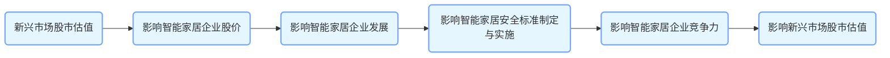

# 新兴市场股市估值与智能家居安全标准的互动

> 关键词：新兴市场股市估值、智能家居安全标准、互动关系、市场影响、风险管理

> 摘要：本文深入探讨了新兴市场股市估值与智能家居安全标准之间的互动关系。在当今全球化和科技飞速发展的背景下，新兴市场股市的表现受多种因素影响，而智能家居作为新兴产业，其安全标准的制定和实施不仅关乎行业自身发展，也对新兴市场股市估值产生重要作用。文章首先介绍了研究的背景、目的、预期读者等内容，接着阐述了核心概念及其联系，详细讲解了相关算法原理和操作步骤，运用数学模型进行分析，通过项目实战案例加深理解，探讨了实际应用场景，推荐了相关工具和资源，最后总结了未来发展趋势与挑战，并对常见问题进行了解答。旨在为投资者、行业从业者和研究人员提供全面的分析和有价值的参考。

## 1. 背景介绍 
### 1.1 目的和范围
本研究旨在全面剖析新兴市场股市估值与智能家居安全标准之间的相互作用机制。通过深入研究，明确智能家居安全标准的变化如何影响新兴市场中智能家居相关企业的股价，进而影响整个新兴市场股市的估值；同时，分析新兴市场股市估值的波动对智能家居行业安全标准制定和实施的反馈作用。研究范围涵盖新兴市场的主要股市以及全球智能家居行业，重点关注两者之间的动态互动关系。

### 1.2 预期读者
本文预期读者包括金融投资者，他们可以通过了解这种互动关系，优化投资组合，把握新兴市场中智能家居相关股票的投资机会；智能家居行业从业者，有助于他们认识到安全标准对企业市场价值和行业发展的重要性，从而更好地制定企业战略；学术研究人员，为他们在相关领域的研究提供理论和实践参考；以及政策制定者，可根据研究结果制定更合理的金融和行业政策。

### 1.3 文档结构概述
本文将按照以下结构展开：首先介绍研究的背景信息，包括目的、预期读者和文档结构概述等；接着阐述核心概念，分析新兴市场股市估值和智能家居安全标准的原理及其联系，并通过文本示意图和 Mermaid 流程图展示；然后详细讲解相关核心算法原理和具体操作步骤，结合 Python 代码进行说明；运用数学模型和公式对两者的互动关系进行量化分析，并举例说明；通过项目实战案例，展示如何在实际中应用相关理论；探讨实际应用场景；推荐相关的学习资源、开发工具框架和论文著作；最后总结未来发展趋势与挑战，解答常见问题，并提供扩展阅读和参考资料。

### 1.4 术语表
#### 1.4.1 核心术语定义
- **新兴市场股市估值**：指对新兴市场中股票市场整体或个别股票的价值评估，通常基于公司的财务状况、行业前景、宏观经济环境等因素，采用不同的估值方法（如市盈率法、现金流折现法等）来确定股票的合理价格范围。
- **智能家居安全标准**：是为保障智能家居系统的安全性而制定的一系列规范和要求，包括数据保护、网络安全、设备可靠性等方面的标准，旨在确保智能家居产品和服务在使用过程中不会对用户造成安全威胁。

#### 1.4.2 相关概念解释
- **新兴市场**：指那些经济发展较快、市场潜力较大但市场机制相对不够成熟的国家和地区的金融市场。这些市场通常具有较高的增长率和投资回报率，但也伴随着较高的风险。
- **智能家居**：利用先进的计算机技术、网络通信技术、传感器技术等，将家居设备集成在一起，实现智能化控制和管理的家居系统。用户可以通过手机、平板电脑等终端设备远程控制家居设备，实现自动化场景设置和能源管理等功能。

#### 1.4.3 缩略词列表
- **PE**：市盈率（Price - Earnings Ratio），是股票价格与每股收益的比率，常用于评估股票的估值水平。
- **DCF**：现金流折现法（Discounted Cash Flow），一种通过预测未来现金流并将其折现到当前价值的估值方法。
- **IoT**：物联网（Internet of Things），智能家居是物联网在家庭领域的应用，通过物联网技术实现设备之间的互联互通。

## 2. 核心概念与联系 
### 核心概念原理
#### 新兴市场股市估值原理
新兴市场股市估值是一个复杂的过程，涉及多个因素。从宏观层面来看，新兴市场的经济增长速度、通货膨胀率、利率水平等宏观经济指标会影响股市整体的估值。例如，较高的经济增长率通常会提高企业的盈利预期，从而推动股市估值上升；而高通货膨胀率可能会导致利率上升，增加企业的融资成本，对股市估值产生负面影响。

从微观层面来看，企业的财务状况是影响其股票估值的重要因素。常用的估值指标包括市盈率（PE）、市净率（PB）等。市盈率反映了投资者为获取每一元利润所愿意支付的价格，市净率则是股票价格与每股净资产的比率。不同行业的合理估值水平存在差异，例如科技行业通常具有较高的市盈率，因为投资者对其未来的增长潜力有较高的预期。

#### 智能家居安全标准原理
智能家居安全标准的制定旨在保障用户的隐私和数据安全，以及智能家居系统的稳定运行。随着智能家居设备的普及，大量的个人信息和家庭数据通过网络传输和存储，这使得数据安全成为一个重要问题。智能家居安全标准涵盖了多个方面，包括设备的身份认证、数据加密、访问控制等。

例如，设备的身份认证要求智能家居设备在接入网络时进行严格的身份验证，防止非法设备接入；数据加密则是对传输和存储的数据进行加密处理，确保数据在传输过程中不被窃取或篡改；访问控制则规定了不同用户对智能家居设备的访问权限，防止未经授权的访问。

### 架构的文本示意图
新兴市场股市估值与智能家居安全标准之间的互动关系可以用以下文本示意图表示：

新兴市场股市估值受到多种因素的影响，其中智能家居行业的发展状况是一个重要因素。智能家居安全标准的制定和实施会影响智能家居企业的市场竞争力和盈利能力，进而影响其股价，最终对新兴市场股市估值产生影响。

反过来，新兴市场股市估值的波动也会对智能家居安全标准的制定和实施产生反馈作用。当股市估值上升时，智能家居企业的融资能力增强，有更多的资金投入到安全标准的研发和实施中；当股市估值下降时，企业可能会减少在安全方面的投入，从而影响安全标准的执行力度。

### Mermaid 流程图


该流程图清晰地展示了新兴市场股市估值与智能家居安全标准之间的循环互动关系。新兴市场股市估值的变化会影响智能家居企业的股价，进而影响企业的发展和安全标准的制定与实施；而安全标准的变化又会影响企业的竞争力，最终反馈到新兴市场股市估值上。

## 3. 核心算法原理 & 具体操作步骤 
### 新兴市场股市估值算法原理
#### 市盈率法
市盈率法是一种常用的股票估值方法，其基本原理是通过比较目标股票的市盈率与同行业或市场平均市盈率，来判断股票的估值水平。计算公式为：

$$P = EPS \times PE$$

其中，$P$ 表示股票价格，$EPS$ 表示每股收益，$PE$ 表示市盈率。

具体操作步骤如下：
```python
# 定义每股收益和市盈率
eps = 2.5
pe = 15

# 计算股票价格
stock_price = eps * pe

print(f"根据市盈率法计算的股票价格为: {stock_price}")
```
在上述代码中，我们首先定义了每股收益和市盈率，然后根据公式计算股票价格，并将结果打印输出。

#### 现金流折现法
现金流折现法是一种基于未来现金流的估值方法，其基本原理是将企业未来的现金流折现到当前价值，从而得到企业的内在价值。计算公式为：

$$V = \sum_{t=1}^{n} \frac{CF_t}{(1 + r)^t}$$

其中，$V$ 表示企业的内在价值，$CF_t$ 表示第 $t$ 期的现金流，$r$ 表示折现率，$n$ 表示预测期数。

具体操作步骤如下：
```python
import numpy as np

# 定义现金流列表和折现率
cash_flows = [100, 120, 150, 180, 200]
discount_rate = 0.1

# 计算企业内在价值
present_values = []
for i, cf in enumerate(cash_flows):
    pv = cf / ((1 + discount_rate) ** (i + 1))
    present_values.append(pv)

enterprise_value = np.sum(present_values)

print(f"根据现金流折现法计算的企业内在价值为: {enterprise_value}")
```
在上述代码中，我们首先定义了现金流列表和折现率，然后通过循环计算每期现金流的现值，并将其存储在列表中，最后将所有现值相加得到企业的内在价值，并将结果打印输出。

### 智能家居安全标准评估算法原理
#### 安全指标评分法
安全指标评分法是一种常用的智能家居安全标准评估方法，其基本原理是通过对智能家居设备的多个安全指标进行评分，然后根据各指标的权重计算综合得分，从而评估设备的安全水平。

假设我们选取了三个安全指标：身份认证、数据加密、访问控制，其权重分别为 $0.3$、$0.4$、$0.3$，每个指标的评分范围为 $0 - 10$ 分。

具体操作步骤如下：
```python
# 定义各安全指标得分
authentication_score = 7
encryption_score = 8
access_control_score = 6

# 定义各指标权重
weights = [0.3, 0.4, 0.3]

# 计算综合得分
scores = [authentication_score, encryption_score, access_control_score]
overall_score = np.dot(scores, weights)

print(f"智能家居设备的安全综合得分为: {overall_score}")
```
在上述代码中，我们首先定义了各安全指标的得分和权重，然后使用 `np.dot` 函数计算综合得分，并将结果打印输出。

## 4. 数学模型和公式 & 详细讲解 & 举例说明 
### 新兴市场股市估值与智能家居安全标准的互动模型
为了更准确地描述新兴市场股市估值与智能家居安全标准之间的互动关系，我们可以建立一个简单的数学模型。假设新兴市场股市估值用 $V_{stock}$ 表示，智能家居安全标准水平用 $S$ 表示，智能家居企业的盈利能力用 $P$ 表示。

我们可以假设智能家居企业的盈利能力 $P$ 与智能家居安全标准水平 $S$ 之间存在正相关关系，即 $P = aS + b$，其中 $a$ 和 $b$ 为常数，且 $a > 0$。

而新兴市场股市估值 $V_{stock}$ 与智能家居企业的盈利能力 $P$ 之间也存在正相关关系，即 $V_{stock} = cP + d$，其中 $c$ 和 $d$ 为常数，且 $c > 0$。

将 $P = aS + b$ 代入 $V_{stock} = cP + d$ 中，得到：

$$V_{stock} = c(aS + b) + d = caS + cb + d$$

从这个公式可以看出，新兴市场股市估值 $V_{stock}$ 与智能家居安全标准水平 $S$ 之间存在线性正相关关系。

### 举例说明
假设 $a = 0.5$，$b = 10$，$c = 2$，$d = 50$。当智能家居安全标准水平 $S = 6$ 时，智能家居企业的盈利能力 $P$ 为：

$$P = 0.5 \times 6 + 10 = 13$$

新兴市场股市估值 $V_{stock}$ 为：

$$V_{stock} = 2 \times 13 + 50 = 76$$

当智能家居安全标准水平提高到 $S = 8$ 时，智能家居企业的盈利能力 $P$ 为：

$$P = 0.5 \times 8 + 10 = 14$$

新兴市场股市估值 $V_{stock}$ 为：

$$V_{stock} = 2 \times 14 + 50 = 78$$

可以看出，随着智能家居安全标准水平的提高，智能家居企业的盈利能力增强，新兴市场股市估值也相应上升。

## 5. 项目实战：代码实际案例和详细解释说明 
### 5.1  开发环境搭建
#### 操作系统
本项目可以在 Windows、Linux 或 macOS 操作系统上进行开发，建议使用较新的操作系统版本以确保兼容性。

#### Python 环境
安装 Python 3.7 或更高版本，可以从 Python 官方网站（https://www.python.org/downloads/）下载安装包进行安装。安装完成后，建议使用虚拟环境来管理项目依赖，可使用 `venv` 或 `conda` 来创建虚拟环境。

#### 依赖库安装
本项目需要使用一些 Python 库，如 `numpy`、`pandas` 等。可以使用 `pip` 来安装这些库，命令如下：
```sh
pip install numpy pandas
```

### 5.2  源代码详细实现和代码解读
#### 模拟新兴市场股市估值与智能家居安全标准的互动
```python
import numpy as np
import pandas as pd
import matplotlib.pyplot as plt

# 定义模型参数
a = 0.5
b = 10
c = 2
d = 50

# 生成智能家居安全标准水平数据
security_standards = np.linspace(0, 10, 100)

# 计算智能家居企业盈利能力
profits = a * security_standards + b

# 计算新兴市场股市估值
stock_valuations = c * profits + d

# 创建 DataFrame 存储数据
data = pd.DataFrame({
    'Security Standards': security_standards,
    'Profits': profits,
    'Stock Valuations': stock_valuations
})

# 绘制图表
plt.figure(figsize=(12, 6))

plt.subplot(1, 2, 1)
plt.plot(security_standards, profits, label='Profits')
plt.xlabel('Security Standards')
plt.ylabel('Profits')
plt.title('Relationship between Security Standards and Profits')
plt.legend()

plt.subplot(1, 2, 2)
plt.plot(security_standards, stock_valuations, label='Stock Valuations', color='orange')
plt.xlabel('Security Standards')
plt.ylabel('Stock Valuations')
plt.title('Relationship between Security Standards and Stock Valuations')
plt.legend()

plt.tight_layout()
plt.show()
```

#### 代码解读
1. **导入必要的库**：导入 `numpy`、`pandas` 和 `matplotlib.pyplot` 库，分别用于数值计算、数据处理和绘图。
2. **定义模型参数**：定义了模型中的参数 $a$、$b$、$c$ 和 $d$，用于计算智能家居企业的盈利能力和新兴市场股市估值。
3. **生成数据**：使用 `np.linspace` 函数生成智能家居安全标准水平的数据，范围从 $0$ 到 $10$，共 $100$ 个点。
4. **计算盈利能力和股市估值**：根据前面定义的公式计算智能家居企业的盈利能力和新兴市场股市估值。
5. **创建 DataFrame**：使用 `pandas` 的 `DataFrame` 存储数据，方便后续处理和分析。
6. **绘制图表**：使用 `matplotlib` 绘制两个子图，分别展示智能家居安全标准水平与企业盈利能力、股市估值之间的关系。

### 5.3  代码解读与分析
通过上述代码，我们可以直观地看到智能家居安全标准水平与新兴市场股市估值之间的正相关关系。随着智能家居安全标准水平的提高，智能家居企业的盈利能力增强，进而推动新兴市场股市估值上升。

从代码实现的角度来看，我们使用了 Python 的数值计算和数据处理库，结合绘图库进行可视化展示，使得数据的分析和结果的呈现更加直观和方便。同时，通过定义模型参数，我们可以灵活地调整模型的具体形式，以适应不同的实际情况。

## 6. 实际应用场景 
### 金融投资领域
对于金融投资者来说，了解新兴市场股市估值与智能家居安全标准的互动关系可以帮助他们做出更明智的投资决策。当智能家居安全标准提高时，智能家居企业的市场竞争力增强，盈利能力有望提升，相关股票的估值也可能上升。投资者可以关注这些股票的投资机会，提前布局，获取更高的投资回报。

例如，在智能家居行业大力推行更严格的安全标准时，投资者可以选择投资那些在安全技术研发方面投入较大、安全标准执行较好的企业股票。

### 智能家居行业发展
对于智能家居行业来说，安全标准的制定和实施不仅关系到用户的安全和信任，也会影响企业的市场价值和行业的整体发展。企业可以通过提高产品的安全标准，提升自身的竞争力，吸引更多的消费者，从而在新兴市场中获得更大的市场份额。

同时，行业协会和政府部门可以根据新兴市场股市估值的反馈，及时调整安全标准的制定和监管力度，促进智能家居行业的健康发展。

### 政策制定
政策制定者可以根据新兴市场股市估值与智能家居安全标准的互动关系，制定更加合理的金融和行业政策。例如，政府可以通过出台税收优惠政策，鼓励智能家居企业加大在安全技术研发方面的投入，提高安全标准；同时，加强对金融市场的监管，防范因智能家居行业安全问题引发的金融风险。

## 7. 工具和资源推荐
### 7.1 学习资源推荐
#### 7.1.1 书籍推荐
- 《金融市场学》：全面介绍了金融市场的基本概念、运行机制和各种金融工具，对于理解新兴市场股市估值有很大帮助。
- 《智能家居：原理、设计与应用》：详细讲解了智能家居的技术原理、系统设计和实际应用案例，有助于深入了解智能家居行业。
- 《安全标准与法规》：涵盖了各个行业的安全标准制定和法规要求，为学习智能家居安全标准提供了参考。

#### 7.1.2 在线课程
- Coursera 上的“金融市场分析”课程：由知名大学的教授授课，系统讲解金融市场的分析方法和工具，对于学习新兴市场股市估值有很大帮助。
- edX 上的“智能家居技术与应用”课程：介绍了智能家居的最新技术和应用场景，帮助学习者了解智能家居行业的发展趋势。
- Udemy 上的“安全标准制定与实施”课程：提供了安全标准制定的具体方法和实践经验，适合想要深入了解智能家居安全标准的学习者。

#### 7.1.3 技术博客和网站
- Seeking Alpha：提供了大量的金融市场分析和股票研究报告，对于了解新兴市场股市动态有很大帮助。
- IoT Analytics：专注于物联网行业的分析和研究，包含了智能家居行业的最新资讯和技术发展趋势。
- NIST（美国国家标准与技术研究院）网站：提供了各种安全标准和技术指南，是学习智能家居安全标准的重要资源。

### 7.2 开发工具框架推荐
#### 7.2.1 IDE和编辑器
- PyCharm：一款功能强大的 Python 集成开发环境，提供了代码编辑、调试、版本控制等一系列功能，适合 Python 项目的开发。
- Visual Studio Code：一款轻量级的代码编辑器，支持多种编程语言，具有丰富的插件生态系统，可以方便地进行 Python 开发。

#### 7.2.2 调试和性能分析工具
- PySnooper：一个简单易用的 Python 调试工具，可以自动记录函数的执行过程和变量的值，帮助开发者快速定位问题。
- cProfile：Python 自带的性能分析工具，可以分析代码的执行时间和函数调用次数，帮助开发者优化代码性能。

#### 7.2.3 相关框架和库
- TensorFlow：一个开源的机器学习框架，可以用于构建和训练各种机器学习模型，如预测新兴市场股市估值的模型。
- Scikit - learn：一个常用的机器学习库，提供了丰富的机器学习算法和工具，方便进行数据处理和模型训练。

### 7.3 相关论文著作推荐
#### 7.3.1 经典论文
- “Efficient Capital Markets: A Review of Theory and Empirical Work”：该论文提出了有效市场假说，对于理解金融市场的定价机制和股市估值有重要意义。
- “The Impact of Information Security on Firm Value”：研究了信息安全对企业价值的影响，为分析智能家居安全标准与企业市场价值的关系提供了理论基础。

#### 7.3.2 最新研究成果
- 关注顶级金融和科技期刊，如《Journal of Finance》、《IEEE Transactions on Smart Grid》等，这些期刊上经常发表关于新兴市场股市估值和智能家居安全标准的最新研究成果。

#### 7.3.3 应用案例分析
- 可以查阅一些行业报告和案例分析，了解实际中新兴市场股市估值与智能家居安全标准的互动情况，以及企业和政府在这方面的应对策略和实践经验。

## 8. 总结：未来发展趋势与挑战
### 未来发展趋势
#### 安全标准不断提高
随着智能家居设备的普及和应用场景的不断拓展，用户对智能家居安全的关注度将越来越高。为了满足用户的需求，智能家居行业的安全标准将不断提高，涵盖更多的安全领域和技术要求。

#### 股市估值与安全标准联系更紧密
新兴市场股市将更加关注智能家居企业的安全状况，安全标准的高低将成为影响企业股价和股市估值的重要因素。智能家居企业也将更加重视安全标准的制定和实施，以提升自身的市场竞争力和股市估值。

#### 技术创新推动发展
随着人工智能、区块链等技术的不断发展，这些技术将被应用于智能家居安全领域，提高安全标准的执行效率和可靠性。同时，技术创新也将推动智能家居行业的发展，进一步影响新兴市场股市估值。

### 挑战
#### 标准制定的难度
智能家居行业涉及多个领域和技术，安全标准的制定需要综合考虑各种因素，难度较大。不同国家和地区的安全标准也存在差异，这给全球智能家居市场的发展带来了一定的挑战。

#### 安全技术的更新换代
随着黑客技术的不断发展，智能家居安全面临着新的威胁。智能家居企业需要不断更新安全技术，以应对日益复杂的安全挑战，但这需要大量的资金和技术投入。

#### 市场波动的影响
新兴市场股市的波动性较大，受到宏观经济环境、政策变化等多种因素的影响。智能家居行业作为新兴产业，其发展也受到市场波动的影响，这增加了股市估值与安全标准互动关系的不确定性。

## 9. 附录：常见问题与解答
### 问题 1：新兴市场股市估值与发达市场股市估值有什么区别？
解答：新兴市场股市估值通常受到更多的不确定性因素影响，如政治不稳定、经济发展阶段、市场机制不完善等。与发达市场相比，新兴市场股市的估值波动更大，市盈率和市净率等估值指标也可能存在较大差异。此外，新兴市场股市对行业发展趋势的反应更为敏感，智能家居等新兴行业在新兴市场中的估值变化可能更为显著。

### 问题 2：智能家居安全标准的提高会增加企业成本吗？
解答：一般来说，智能家居安全标准的提高会增加企业的成本。企业需要投入更多的资金用于安全技术研发、设备升级和安全管理等方面。然而，从长远来看，提高安全标准可以提升企业的市场竞争力，吸引更多的消费者，从而带来更高的收益。因此，企业需要在成本和收益之间进行权衡。

### 问题 3：如何衡量智能家居安全标准的执行效果？
解答：可以通过多种方式衡量智能家居安全标准的执行效果。一方面，可以通过安全测试和评估机构的认证来判断企业是否符合安全标准；另一方面，可以通过用户反馈和安全事件的发生率来评估实际的安全效果。此外，还可以关注企业在安全技术研发和投入方面的情况，作为衡量执行效果的参考。

## 10. 扩展阅读 & 参考资料
### 扩展阅读
- 《新兴市场金融》：深入探讨了新兴市场金融市场的特点和发展趋势，对于进一步理解新兴市场股市估值有很大帮助。
- 《智能家居安全技术》：详细介绍了智能家居安全的各种技术和解决方案，适合对智能家居安全标准感兴趣的读者深入学习。

### 参考资料
- 国际金融协会（IIF）发布的相关报告，提供了新兴市场金融市场的最新数据和分析。
- 智能家居行业协会发布的安全标准和行业报告，是了解智能家居行业安全标准的重要参考。

作者：AI天才研究院/AI Genius Institute & 禅与计算机程序设计艺术 /Zen And The Art of Computer Programming