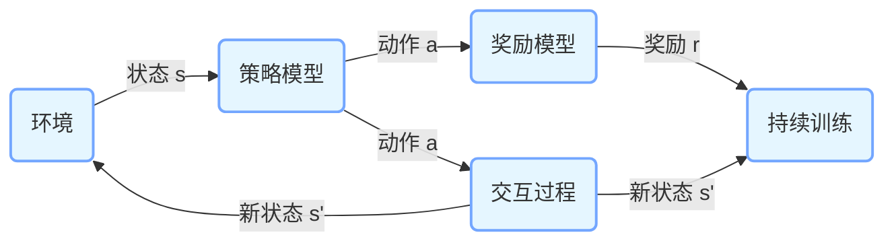

# 无需人工标注促进策略和奖励模型持续训练

> 关键词：无需人工标注、策略模型、奖励模型、持续训练、强化学习

> 摘要：本文聚焦于无需人工标注促进策略和奖励模型持续训练这一前沿技术领域。首先介绍了该技术的背景，包括目的、预期读者、文档结构和相关术语。接着阐述了核心概念及其联系，通过文本示意图和Mermaid流程图进行直观展示。详细讲解了核心算法原理，并用Python代码进行示例。分析了数学模型和公式，并举例说明。给出了项目实战的具体步骤，包括开发环境搭建、源代码实现与解读。探讨了实际应用场景，推荐了学习资源、开发工具框架和相关论文著作。最后总结了未来发展趋势与挑战，提供了常见问题解答和扩展阅读参考资料，旨在为读者全面深入地理解和应用该技术提供指导。

## 1. 背景介绍 
### 1.1 目的和范围
在传统的机器学习和强化学习训练过程中，人工标注数据是一项耗时、费力且成本高昂的工作。同时，人工标注存在主观性和局限性，可能影响模型的准确性和泛化能力。本技术旨在探索无需人工标注的方法，以促进策略模型和奖励模型的持续训练，扩大其应用范围，提高训练效率和模型性能。

本文的范围涵盖了无需人工标注促进策略和奖励模型持续训练的核心概念、算法原理、数学模型、项目实战、应用场景以及相关的工具和资源推荐等方面，为读者提供全面深入的技术知识和实践指导。

### 1.2 预期读者
本文预期读者包括机器学习工程师、数据科学家、人工智能研究人员、相关专业的学生以及对无需人工标注训练技术感兴趣的技术爱好者。希望读者具备一定的机器学习和编程基础，能够理解和实践文中所介绍的技术内容。

### 1.3 文档结构概述
本文将按照以下结构进行组织：首先介绍核心概念与联系，通过文本示意图和Mermaid流程图帮助读者理解关键概念和它们之间的关系；接着详细阐述核心算法原理，并使用Python代码进行具体实现；然后分析数学模型和公式，并举例说明其应用；随后进行项目实战，包括开发环境搭建、源代码详细实现和代码解读；探讨实际应用场景；推荐相关的学习资源、开发工具框架和论文著作；最后总结未来发展趋势与挑战，提供常见问题解答和扩展阅读参考资料。

### 1.4 术语表
#### 1.4.1 核心术语定义
- **策略模型（Policy Model）**：在强化学习中，策略模型用于决定智能体在给定状态下采取的动作，其目标是最大化长期累积奖励。
- **奖励模型（Reward Model）**：奖励模型用于评估智能体在某个状态下采取某个动作所获得的奖励，它是强化学习中的重要组成部分，指导智能体学习最优策略。
- **无需人工标注（No Human Annotation）**：指在训练过程中不依赖人工手动标注的数据，而是通过其他方式（如自动生成、环境反馈等）获取训练数据。
- **持续训练（Continuous Training）**：模型在不断获取新数据的情况下持续进行训练，以适应环境的变化和提高性能。

#### 1.4.2 相关概念解释
- **强化学习（Reinforcement Learning）**：一种机器学习范式，智能体通过与环境进行交互，根据环境反馈的奖励信号来学习最优策略。
- **无监督学习（Unsupervised Learning）**：从无标签的数据中学习数据的分布和结构，无需人工标注。
- **自监督学习（Self-Supervised Learning）**：一种特殊的无监督学习，通过从数据中自动生成监督信号来进行学习。

#### 1.4.3 缩略词列表
- **RL**：Reinforcement Learning，强化学习
- **SL**：Supervised Learning，监督学习
- **UL**：Unsupervised Learning，无监督学习
- **SSL**：Self-Supervised Learning，自监督学习

## 2. 核心概念与联系 
### 核心概念原理
#### 策略模型
策略模型是强化学习中的核心组件之一，它根据当前的环境状态 $s$ 输出一个动作 $a$。策略模型可以表示为 $\pi(a|s)$，即给定状态 $s$ 下采取动作 $a$ 的概率分布。在训练过程中，策略模型的目标是通过与环境的交互不断优化，以最大化长期累积奖励。

#### 奖励模型
奖励模型用于评估智能体在某个状态 $s$ 下采取某个动作 $a$ 所获得的奖励 $r$。奖励模型可以是一个函数 $R(s,a)$，它根据状态和动作输出相应的奖励值。奖励模型的准确性对于策略模型的学习至关重要，因为策略模型是根据奖励信号来调整自己的行为。

#### 无需人工标注的持续训练
无需人工标注的持续训练是指在不依赖人工手动标注数据的情况下，模型能够不断从环境中获取新的数据并进行训练。这可以通过自监督学习、无监督学习等方法实现。例如，自监督学习可以从数据中自动生成监督信号，如通过预测数据的未来状态、重构输入数据等方式。

### 架构的文本示意图
```plaintext
+----------------+          +----------------+
|   环境（Environment）   |          |  策略模型（Policy Model） |
+----------------+          +----------------+
       |                              |
       |  状态 s                      |  动作 a
       v                              v
+----------------+          +----------------+
|  奖励模型（Reward Model） |          |  交互过程（Interaction） |
+----------------+          +----------------+
       |                              |
       |  奖励 r                      |  新状态 s'
       v                              v
+----------------+
|  持续训练（Continuous Training） |
+----------------+
```

### Mermaid 流程图


## 3. 核心算法原理 & 具体操作步骤 
### 核心算法原理
在无需人工标注促进策略和奖励模型持续训练的过程中，我们可以采用自监督学习和强化学习相结合的方法。以下是具体的算法原理：

#### 自监督学习用于奖励模型训练
自监督学习可以通过自动生成监督信号来训练奖励模型。例如，我们可以使用预测未来状态的方法，让奖励模型预测智能体在采取某个动作后环境的下一个状态。如果预测准确，则给予较高的奖励；反之，则给予较低的奖励。

#### 强化学习用于策略模型训练
在奖励模型提供奖励信号的基础上，使用强化学习算法（如深度Q网络、策略梯度算法等）来训练策略模型。策略模型通过不断与环境交互，根据奖励信号调整自己的行为，以最大化长期累积奖励。

### 具体操作步骤
#### 步骤 1：初始化策略模型和奖励模型
使用随机参数初始化策略模型 $\pi(a|s)$ 和奖励模型 $R(s,a)$。

#### 步骤 2：与环境交互
策略模型根据当前环境状态 $s$ 选择一个动作 $a$，并执行该动作。环境根据动作 $a$ 给出新的状态 $s'$。

#### 步骤 3：计算奖励
奖励模型根据状态 $s$、动作 $a$ 和新状态 $s'$ 计算奖励 $r$。

#### 步骤 4：更新策略模型
使用强化学习算法（如策略梯度算法）根据奖励 $r$ 更新策略模型的参数，以最大化长期累积奖励。

#### 步骤 5：更新奖励模型
使用自监督学习方法，根据预测误差等信息更新奖励模型的参数，提高奖励模型的准确性。

#### 步骤 6：重复步骤 2 - 5
不断重复上述步骤，实现策略模型和奖励模型的持续训练。

### Python 源代码示例
```python
import torch
import torch.nn as nn
import torch.optim as optim
import numpy as np

# 定义策略模型
class PolicyModel(nn.Module):
    def __init__(self, input_dim, output_dim):
        super(PolicyModel, self).__init__()
        self.fc1 = nn.Linear(input_dim, 64)
        self.fc2 = nn.Linear(64, output_dim)
        self.softmax = nn.Softmax(dim=-1)

    def forward(self, x):
        x = torch.relu(self.fc1(x))
        x = self.fc2(x)
        x = self.softmax(x)
        return x

# 定义奖励模型
class RewardModel(nn.Module):
    def __init__(self, input_dim):
        super(RewardModel, self).__init__()
        self.fc1 = nn.Linear(input_dim, 64)
        self.fc2 = nn.Linear(64, 1)

    def forward(self, x):
        x = torch.relu(self.fc1(x))
        x = self.fc2(x)
        return x

# 初始化模型
input_dim = 10
output_dim = 4
policy_model = PolicyModel(input_dim, output_dim)
reward_model = RewardModel(input_dim * 2)

# 定义优化器
policy_optimizer = optim.Adam(policy_model.parameters(), lr=0.001)
reward_optimizer = optim.Adam(reward_model.parameters(), lr=0.001)

# 模拟环境交互
num_episodes = 100
for episode in range(num_episodes):
    # 初始化状态
    state = torch.randn(1, input_dim)

    for step in range(10):
        # 策略模型选择动作
        action_probs = policy_model(state)
        action = torch.multinomial(action_probs, 1).item()

        # 模拟环境反馈新状态
        next_state = torch.randn(1, input_dim)

        # 计算奖励
        input_reward = torch.cat([state, next_state], dim=1)
        reward = reward_model(input_reward)

        # 更新策略模型
        policy_optimizer.zero_grad()
        log_prob = torch.log(action_probs[0, action])
        loss_policy = -log_prob * reward
        loss_policy.backward()
        policy_optimizer.step()

        # 模拟自监督学习更新奖励模型
        # 这里简单假设预测误差为随机值
        prediction_error = torch.randn(1, 1)
        reward_optimizer.zero_grad()
        loss_reward = prediction_error ** 2
        loss_reward.backward()
        reward_optimizer.step()

        state = next_state
```

## 4. 数学模型和公式 & 详细讲解 & 举例说明 
### 策略模型
#### 数学模型
策略模型可以表示为 $\pi(a|s;\theta)$，其中 $\theta$ 是策略模型的参数。在给定状态 $s$ 下，策略模型输出采取动作 $a$ 的概率分布。

#### 目标函数
策略模型的目标是最大化长期累积奖励，通常使用策略梯度算法来优化策略模型的参数。策略梯度算法的目标函数可以表示为：

$$J(\theta) = \mathbb{E}_{\tau \sim \pi(\tau;\theta)} \left[ \sum_{t=0}^{T} r(s_t, a_t) \right]$$

其中，$\tau = (s_0, a_0, r_0, s_1, a_1, r_1, \cdots, s_T, a_T, r_T)$ 是一个轨迹，$r(s_t, a_t)$ 是在时间步 $t$ 时状态 $s_t$ 下采取动作 $a_t$ 所获得的奖励。

#### 策略梯度公式
策略梯度算法通过计算目标函数 $J(\theta)$ 对参数 $\theta$ 的梯度来更新策略模型的参数。策略梯度公式可以表示为：

$$\nabla_{\theta} J(\theta) = \mathbb{E}_{\tau \sim \pi(\tau;\theta)} \left[ \sum_{t=0}^{T} \nabla_{\theta} \log \pi(a_t|s_t;\theta) r(s_t, a_t) \right]$$

#### 举例说明
假设我们有一个简单的二维环境，状态 $s$ 是一个二维向量，动作 $a$ 有四个可能的选择（上、下、左、右）。策略模型 $\pi(a|s;\theta)$ 是一个神经网络，它根据输入的状态 $s$ 输出四个动作的概率分布。在训练过程中，我们通过与环境交互得到一系列的轨迹 $\tau$，并根据策略梯度公式更新策略模型的参数 $\theta$，以最大化长期累积奖励。

### 奖励模型
#### 数学模型
奖励模型可以表示为 $R(s, a; \phi)$，其中 $\phi$ 是奖励模型的参数。奖励模型根据输入的状态 $s$ 和动作 $a$ 输出相应的奖励值。

#### 目标函数
奖励模型的目标是准确预测奖励值，通常使用均方误差损失函数来优化奖励模型的参数。均方误差损失函数可以表示为：

$$L(\phi) = \frac{1}{N} \sum_{i=1}^{N} (R(s_i, a_i; \phi) - r_i)^2$$

其中，$N$ 是训练样本的数量，$r_i$ 是真实的奖励值。

#### 举例说明
假设我们使用自监督学习方法，通过预测未来状态来训练奖励模型。我们可以将状态 $s$ 和动作 $a$ 作为输入，让奖励模型预测下一个状态 $s'$。如果预测的状态与真实的状态接近，则给予较高的奖励；反之，则给予较低的奖励。通过最小化均方误差损失函数 $L(\phi)$ 来更新奖励模型的参数 $\phi$。

## 5. 项目实战：代码实际案例和详细解释说明 
### 5.1  开发环境搭建
#### 安装 Python
首先，确保你已经安装了 Python 3.6 或更高版本。可以从 Python 官方网站（https://www.python.org/downloads/）下载并安装 Python。

#### 安装依赖库
使用以下命令安装项目所需的依赖库：
```sh
pip install torch numpy
```

### 5.2  源代码详细实现和代码解读
```python
import torch
import torch.nn as nn
import torch.optim as optim
import numpy as np

# 定义策略模型
class PolicyModel(nn.Module):
    def __init__(self, input_dim, output_dim):
        super(PolicyModel, self).__init__()
        self.fc1 = nn.Linear(input_dim, 64)
        self.fc2 = nn.Linear(64, output_dim)
        self.softmax = nn.Softmax(dim=-1)

    def forward(self, x):
        x = torch.relu(self.fc1(x))
        x = self.fc2(x)
        x = self.softmax(x)
        return x

# 定义奖励模型
class RewardModel(nn.Module):
    def __init__(self, input_dim):
        super(RewardModel, self).__init__()
        self.fc1 = nn.Linear(input_dim, 64)
        self.fc2 = nn.Linear(64, 1)

    def forward(self, x):
        x = torch.relu(self.fc1(x))
        x = self.fc2(x)
        return x

# 初始化模型
input_dim = 10
output_dim = 4
policy_model = PolicyModel(input_dim, output_dim)
reward_model = RewardModel(input_dim * 2)

# 定义优化器
policy_optimizer = optim.Adam(policy_model.parameters(), lr=0.001)
reward_optimizer = optim.Adam(reward_model.parameters(), lr=0.001)

# 模拟环境交互
num_episodes = 100
for episode in range(num_episodes):
    # 初始化状态
    state = torch.randn(1, input_dim)

    for step in range(10):
        # 策略模型选择动作
        action_probs = policy_model(state)
        action = torch.multinomial(action_probs, 1).item()

        # 模拟环境反馈新状态
        next_state = torch.randn(1, input_dim)

        # 计算奖励
        input_reward = torch.cat([state, next_state], dim=1)
        reward = reward_model(input_reward)

        # 更新策略模型
        policy_optimizer.zero_grad()
        log_prob = torch.log(action_probs[0, action])
        loss_policy = -log_prob * reward
        loss_policy.backward()
        policy_optimizer.step()

        # 模拟自监督学习更新奖励模型
        # 这里简单假设预测误差为随机值
        prediction_error = torch.randn(1, 1)
        reward_optimizer.zero_grad()
        loss_reward = prediction_error ** 2
        loss_reward.backward()
        reward_optimizer.step()

        state = next_state
```

#### 代码解读
1. **策略模型定义**：`PolicyModel` 类是一个简单的神经网络，包含两个全连接层和一个 Softmax 层。它根据输入的状态输出动作的概率分布。
2. **奖励模型定义**：`RewardModel` 类也是一个简单的神经网络，包含两个全连接层。它根据输入的状态和下一个状态输出奖励值。
3. **模型初始化**：初始化策略模型和奖励模型，并定义优化器。
4. **环境交互循环**：通过多个回合（`num_episodes`）和每个回合中的多个步骤（`step`）与环境进行交互。
5. **动作选择**：策略模型根据当前状态输出动作的概率分布，使用 `torch.multinomial` 函数从概率分布中采样一个动作。
6. **奖励计算**：奖励模型根据当前状态和下一个状态计算奖励值。
7. **策略模型更新**：使用策略梯度算法更新策略模型的参数，目标是最大化长期累积奖励。
8. **奖励模型更新**：模拟自监督学习，使用随机预测误差更新奖励模型的参数。

### 5.3  代码解读与分析
#### 优点
- **简单易懂**：代码结构清晰，使用简单的神经网络模型和基本的优化算法，易于理解和实现。
- **灵活性**：可以根据具体需求修改策略模型和奖励模型的结构，以及调整优化算法的参数。

#### 缺点
- **模拟环境简单**：代码中使用的环境是简单的随机模拟，与实际应用场景可能存在较大差距。
- **自监督学习模拟简单**：奖励模型的自监督学习部分只是简单地使用随机预测误差，实际应用中需要更复杂的方法。

## 6. 实际应用场景 
### 游戏领域
在游戏中，无需人工标注促进策略和奖励模型持续训练可以用于训练游戏智能体。例如，在实时策略游戏中，智能体可以通过与游戏环境的交互不断学习最优策略，而不需要人工标注大量的游戏数据。奖励模型可以根据游戏的胜负、资源获取等情况自动计算奖励，策略模型则根据奖励信号不断调整自己的行为。

### 机器人控制
在机器人控制领域，无需人工标注的训练方法可以使机器人在实际环境中自主学习和适应。例如，机器人可以通过与环境的交互不断学习如何完成特定的任务，如导航、抓取物体等。奖励模型可以根据机器人的任务完成情况、能量消耗等因素计算奖励，策略模型则根据奖励信号调整机器人的动作。

### 金融领域
在金融领域，无需人工标注促进策略和奖励模型持续训练可以用于投资决策。例如，智能投资策略可以通过与金融市场的交互不断学习最优投资策略，而不需要人工标注大量的历史数据。奖励模型可以根据投资收益、风险等因素计算奖励，策略模型则根据奖励信号调整投资组合。

### 自动驾驶
在自动驾驶领域，无需人工标注的训练方法可以使自动驾驶车辆在实际道路环境中不断学习和优化驾驶策略。奖励模型可以根据车辆的行驶安全、行驶效率等因素计算奖励，策略模型则根据奖励信号调整车辆的行驶动作。

## 7. 工具和资源推荐
### 7.1 学习资源推荐
#### 7.1.1 书籍推荐
- 《Reinforcement Learning: An Introduction》：这是一本经典的强化学习教材，详细介绍了强化学习的基本概念、算法和应用。
- 《Deep Learning》：由 Ian Goodfellow、Yoshua Bengio 和 Aaron Courville 合著，全面介绍了深度学习的理论和实践。
- 《Machine Learning》：由 Tom M. Mitchell 编写，是机器学习领域的经典教材，涵盖了机器学习的基本算法和理论。

#### 7.1.2 在线课程
- Coursera 上的《Reinforcement Learning Specialization》：由 David Silver 等专家授课，提供了系统的强化学习课程。
- edX 上的《Deep Learning MicroMasters Program》：包含了深度学习的多个方面的课程，适合深入学习。
- 吴恩达的《Machine Learning》课程：在 Coursera 上提供，是机器学习入门的经典课程。

#### 7.1.3 技术博客和网站
- OpenAI Blog（https://openai.com/blog/）：OpenAI 发布的最新研究成果和技术文章。
- DeepMind Blog（https://deepmind.com/blog/）：DeepMind 发布的人工智能领域的研究进展和技术分享。
- Towards Data Science（https://towardsdatascience.com/）：一个专注于数据科学和机器学习的技术博客平台，有很多优秀的文章和教程。

### 7.2 开发工具框架推荐
#### 7.2.1 IDE和编辑器
- PyCharm：一款功能强大的 Python IDE，提供了丰富的代码编辑、调试和分析功能。
- Jupyter Notebook：一个交互式的开发环境，适合进行数据分析和模型实验。
- Visual Studio Code：一款轻量级的代码编辑器，支持多种编程语言和插件扩展。

#### 7.2.2 调试和性能分析工具
- TensorBoard：TensorFlow 提供的可视化工具，可以用于查看模型的训练过程、性能指标等。
- PyTorch Profiler：PyTorch 提供的性能分析工具，可以帮助开发者找出代码中的性能瓶颈。
- cProfile：Python 内置的性能分析模块，可以对 Python 代码进行性能分析。

#### 7.2.3 相关框架和库
- PyTorch：一个开源的深度学习框架，提供了丰富的神经网络模型和优化算法。
- TensorFlow：另一个流行的深度学习框架，具有广泛的应用和丰富的工具支持。
- Stable Baselines3：一个基于 PyTorch 的强化学习库，提供了多种强化学习算法的实现。

### 7.3 相关论文著作推荐
#### 7.3.1 经典论文
- “Playing Atari with Deep Reinforcement Learning”：介绍了使用深度强化学习玩 Atari 游戏的方法，开启了深度强化学习的研究热潮。
- “Policy Gradient Methods for Reinforcement Learning with Function Approximation”：提出了策略梯度算法，是强化学习领域的经典论文。
- “Self-Supervised Learning: Generative or Contrastive”：对自监督学习的两种主要方法（生成式和对比式）进行了分析和比较。

#### 7.3.2 最新研究成果
- 关注 NeurIPS、ICML、CVPR 等顶级学术会议上的相关论文，了解该领域的最新研究进展。
- 一些知名研究机构（如 OpenAI、DeepMind 等）发布的预印本论文，通常包含了最新的研究成果。

#### 7.3.3 应用案例分析
- 一些实际应用案例的论文，如自动驾驶、机器人控制等领域的应用案例，可以帮助读者了解如何将无需人工标注促进策略和奖励模型持续训练技术应用到实际场景中。

## 8. 总结：未来发展趋势与挑战
### 未来发展趋势
#### 与其他技术的融合
无需人工标注促进策略和奖励模型持续训练技术将与其他技术（如计算机视觉、自然语言处理等）深度融合，应用于更广泛的领域。例如，在自动驾驶中，结合计算机视觉技术可以更好地感知环境，提高策略模型和奖励模型的性能。

#### 自适应和在线学习
未来的模型将具备更强的自适应能力和在线学习能力，能够在不断变化的环境中快速调整策略和奖励模型。例如，在金融市场中，模型可以根据市场的实时变化动态调整投资策略。

#### 可解释性和安全性
随着人工智能技术的广泛应用，模型的可解释性和安全性将变得越来越重要。未来的研究将致力于提高策略模型和奖励模型的可解释性，确保模型的决策过程是透明和可理解的，同时保障模型的安全性，避免出现不可控的行为。

### 挑战
#### 数据质量和多样性
虽然无需人工标注可以减少数据标注的成本，但如何保证数据的质量和多样性仍然是一个挑战。低质量或缺乏多样性的数据可能导致模型的泛化能力下降，无法在实际应用中取得良好的效果。

#### 奖励设计的合理性
奖励模型的设计直接影响策略模型的学习效果。如何设计合理的奖励函数，使得策略模型能够学习到真正的最优策略，是一个具有挑战性的问题。不合理的奖励设计可能导致策略模型陷入局部最优解或出现不良行为。

#### 计算资源和时间成本
无需人工标注促进策略和奖励模型持续训练通常需要大量的计算资源和时间。如何提高训练效率，减少计算资源的消耗和训练时间，是未来需要解决的问题之一。

## 9. 附录：常见问题与解答
### 问题 1：无需人工标注的训练方法是否适用于所有场景？
答：不是的。无需人工标注的训练方法适用于一些数据丰富、环境反馈明确的场景，如游戏、机器人控制等。但对于一些需要专业知识和人类判断的场景，可能仍然需要人工标注数据。

### 问题 2：如何评估策略模型和奖励模型的性能？
答：可以使用一些评估指标来评估策略模型和奖励模型的性能。对于策略模型，可以使用长期累积奖励、胜率等指标；对于奖励模型，可以使用均方误差、预测准确率等指标。

### 问题 3：自监督学习在奖励模型训练中的具体实现方法有哪些？
答：自监督学习在奖励模型训练中的具体实现方法有很多，如预测未来状态、重构输入数据、对比学习等。具体选择哪种方法取决于具体的应用场景和数据特点。

### 问题 4：如何解决策略模型和奖励模型训练过程中的过拟合问题？
答：可以采用一些方法来解决过拟合问题，如增加数据量、使用正则化方法（如 L1、L2 正则化）、早停策略等。

## 10. 扩展阅读 & 参考资料
- Sutton, R. S., & Barto, A. G. (2018). Reinforcement Learning: An Introduction. MIT press.
- Goodfellow, I., Bengio, Y., & Courville, A. (2016). Deep Learning. MIT press.
- Mitchell, T. M. (1997). Machine Learning. McGraw-Hill.
- Mnih, V., Kavukcuoglu, K., Silver, D., Graves, A., Antonoglou, I., Wierstra, D., & Riedmiller, M. (2013). Playing Atari with Deep Reinforcement Learning. arXiv preprint arXiv:1312.5602.
- Sutton, R. S., McAllester, D. A., Singh, S. P., & Mansour, Y. (2000). Policy Gradient Methods for Reinforcement Learning with Function Approximation. Advances in neural information processing systems.
- Chen, T., Kornblith, S., Norouzi, M., & Hinton, G. (2020). A Simple Framework for Contrastive Learning of Visual Representations. arXiv preprint arXiv:2002.05709.

作者：AI天才研究院/AI Genius Institute & 禅与计算机程序设计艺术 /Zen And The Art of Computer Programming