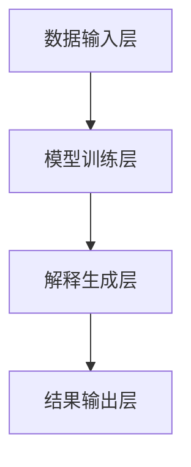

# 智能个人信用评分解释器

> 关键词：智能个人信用评分解释器、信用评分、可解释性、机器学习、算法原理

> 摘要：本文围绕智能个人信用评分解释器展开，旨在深入探讨其核心概念、算法原理、数学模型等方面内容。信用评分在金融等领域至关重要，但传统评分系统缺乏可解释性。智能个人信用评分解释器能够解决这一问题，为信用评估提供透明且可理解的依据。文章详细阐述了其原理、操作步骤，通过实际案例展示其应用，并对未来发展趋势与挑战进行了分析，为相关领域的研究和实践提供了全面的参考。

## 1. 背景介绍 
### 1.1 目的和范围
在金融领域，个人信用评分是评估借款人信用风险的重要手段。然而，传统的信用评分模型往往是黑盒模型，其输出结果难以解释，这给金融机构和借款人都带来了困扰。智能个人信用评分解释器的目的就是为了解决这一问题，通过提供信用评分的详细解释，使金融机构能够更好地理解借款人的信用状况，同时也让借款人能够了解自己的信用评分是如何计算出来的。

本文的范围涵盖了智能个人信用评分解释器的核心概念、算法原理、数学模型、实际应用等方面。通过对这些内容的深入探讨，旨在为读者提供一个全面的关于智能个人信用评分解释器的知识体系。

### 1.2 预期读者
本文的预期读者包括金融领域的从业者，如信贷分析师、风险管理人员等，他们可以通过本文了解智能个人信用评分解释器的原理和应用，从而更好地进行信用评估和风险管理。同时，对于从事机器学习和数据挖掘研究的科研人员来说，本文也提供了一个实际应用场景的案例，有助于他们深入研究可解释性机器学习的相关技术。此外，对于普通借款人来说，本文可以帮助他们了解信用评分的计算方式，从而更好地管理自己的信用。

### 1.3 文档结构概述
本文将按照以下结构进行组织：首先介绍智能个人信用评分解释器的核心概念和相关联系，包括其原理和架构；接着详细阐述其核心算法原理和具体操作步骤，并使用 Python 源代码进行说明；然后介绍其数学模型和公式，并通过具体例子进行讲解；之后通过项目实战展示代码的实际案例和详细解释；再探讨其实际应用场景；推荐相关的工具和资源；最后对未来发展趋势与挑战进行总结，并提供常见问题的解答和扩展阅读的参考资料。

### 1.4 术语表
#### 1.4.1 核心术语定义
- **个人信用评分**：是一种基于个人的信用历史、财务状况等多方面信息，对其信用风险进行量化评估的数值。
- **智能个人信用评分解释器**：一种能够对个人信用评分进行详细解释，说明评分是如何根据各项因素计算得出的工具或系统。
- **可解释性机器学习**：指机器学习模型不仅能够给出预测结果，还能对预测结果的产生原因进行解释的技术。

#### 1.4.2 相关概念解释
- **特征重要性**：在信用评分模型中，每个特征（如年龄、收入、负债等）对最终评分的影响程度。特征重要性越高，说明该特征对评分的影响越大。
- **局部解释**：针对某个具体的个人信用评分结果进行解释，说明该个体的各项特征是如何影响其评分的。
- **全局解释**：从整体上解释信用评分模型，说明模型中各个特征在总体上对评分的影响。

#### 1.4.3 缩略词列表
- **ML**：Machine Learning，机器学习
- **AI**：Artificial Intelligence，人工智能
- **SHAP**：SHapley Additive exPlanations，一种用于解释机器学习模型输出的方法

## 2. 核心概念与联系 

### 核心概念原理
智能个人信用评分解释器的核心原理是基于可解释性机器学习技术。传统的信用评分模型，如逻辑回归、决策树等，虽然能够对信用风险进行评估，但往往缺乏可解释性。而可解释性机器学习技术旨在解决这一问题，通过一些方法使得模型的输出结果能够被人类理解。

其中一种常用的方法是特征重要性分析。通过计算每个特征对最终信用评分的影响程度，我们可以了解哪些因素对评分起到了关键作用。例如，如果一个人的收入水平在信用评分模型中的特征重要性较高，那么说明收入对其信用评分有较大的影响。

另一种方法是局部解释和全局解释。局部解释可以针对某个具体的个人信用评分结果，详细说明该个体的各项特征是如何影响其评分的。而全局解释则从整体上分析信用评分模型，说明各个特征在总体上对评分的影响。

### 架构的文本示意图
智能个人信用评分解释器的架构主要包括数据输入层、模型训练层、解释生成层和结果输出层。

数据输入层负责收集个人的信用相关数据，如个人基本信息、信用历史记录、财务状况等。这些数据将作为模型训练的基础。

模型训练层使用机器学习算法对输入的数据进行训练，得到一个信用评分模型。常见的机器学习算法包括逻辑回归、随机森林、梯度提升树等。

解释生成层使用可解释性机器学习技术对训练好的模型进行解释。例如，可以使用 SHAP 方法计算每个特征的 SHAP 值，从而得到特征的重要性和局部解释。

结果输出层将解释结果以可视化或文本的形式呈现给用户，使用户能够直观地了解信用评分的计算方式和各项因素的影响。

### Mermaid 流程图


## 3. 核心算法原理 & 具体操作步骤 

### 核心算法原理
这里我们以 SHAP 方法为例，介绍智能个人信用评分解释器的核心算法原理。SHAP 方法基于博弈论中的 Shapley 值，用于解释机器学习模型的输出。

Shapley 值的基本思想是将模型的预测结果分解为每个特征的贡献之和。对于一个信用评分模型，每个特征（如年龄、收入等）都对最终的评分有一定的贡献。SHAP 方法通过计算每个特征的 SHAP 值，来衡量该特征对评分的贡献大小。

### 具体操作步骤

#### 步骤 1：数据准备
首先，我们需要收集个人的信用相关数据，并进行预处理。预处理包括数据清洗、特征工程等步骤。以下是一个简单的 Python 代码示例，用于读取和预处理数据：
```python
import pandas as pd
from sklearn.preprocessing import StandardScaler

# 读取数据
data = pd.read_csv('credit_data.csv')

# 分离特征和标签
X = data.drop('credit_score', axis=1)
y = data['credit_score']

# 特征标准化
scaler = StandardScaler()
X_scaled = scaler.fit_transform(X)
```

#### 步骤 2：模型训练
选择一个合适的机器学习算法对数据进行训练。这里我们使用随机森林算法：
```python
from sklearn.ensemble import RandomForestRegressor

# 创建随机森林模型
model = RandomForestRegressor()

# 训练模型
model.fit(X_scaled, y)
```

#### 步骤 3：SHAP 值计算
使用 SHAP 库计算每个特征的 SHAP 值：
```python
import shap

# 创建 SHAP 解释器
explainer = shap.Explainer(model)

# 计算 SHAP 值
shap_values = explainer(X_scaled)
```

#### 步骤 4：结果可视化
将 SHAP 值进行可视化，以便用户直观地了解每个特征的重要性和对评分的影响：
```python
# 全局特征重要性可视化
shap.summary_plot(shap_values, X)

# 局部解释可视化
shap.force_plot(explainer.expected_value, shap_values.values[0], X.iloc[0])
```

## 4. 数学模型和公式 & 详细讲解 & 举例说明 

### 数学模型和公式
Shapley 值的计算公式如下：
$$\phi_i(v)=\sum_{S\subseteq N\setminus\{i\}}\frac{|S|!(|N|-|S|-1)!}{|N|!}[v(S\cup\{i\})-v(S)]$$
其中，$\phi_i(v)$ 表示特征 $i$ 的 Shapley 值，$v$ 是一个特征子集的价值函数，$N$ 是所有特征的集合，$S$ 是不包含特征 $i$ 的特征子集，$|S|$ 表示子集 $S$ 的元素个数。

### 详细讲解
Shapley 值的计算过程可以理解为：对于每个特征 $i$，考虑所有可能的特征子集 $S$，计算在加入特征 $i$ 前后子集的价值变化 $v(S\cup\{i\})-v(S)$，并根据子集 $S$ 的大小进行加权平均。

在信用评分模型中，价值函数 $v$ 可以定义为模型对某个特征子集的预测结果。例如，对于一个随机森林模型，$v(S)$ 可以是使用特征子集 $S$ 进行预测得到的信用评分。

### 举例说明
假设我们有一个简单的信用评分模型，考虑三个特征：年龄、收入和负债。我们要计算年龄这个特征的 Shapley 值。

首先，考虑所有不包含年龄的特征子集：
- 子集 $S_1=\{\}$（空集），计算 $v(S_1\cup\{年龄\})-v(S_1)$，即加入年龄特征前后模型的预测结果变化。
- 子集 $S_2=\{收入\}$，计算 $v(S_2\cup\{年龄\})-v(S_2)$。
- 子集 $S_3=\{负债\}$，计算 $v(S_3\cup\{年龄\})-v(S_3)$。

然后，根据上述公式对这些变化进行加权平均，得到年龄特征的 Shapley 值。

## 5. 项目实战：代码实际案例和详细解释说明 

### 5.1  开发环境搭建
要实现智能个人信用评分解释器，我们需要搭建以下开发环境：
- **Python**：建议使用 Python 3.7 及以上版本。
- **必要的库**：pandas、numpy、scikit-learn、shap、matplotlib 等。可以使用以下命令进行安装：
```bash
pip install pandas numpy scikit-learn shap matplotlib
```

### 5.2  源代码详细实现和代码解读
以下是一个完整的 Python 代码示例，实现了智能个人信用评分解释器：
```python
import pandas as pd
from sklearn.preprocessing import StandardScaler
from sklearn.ensemble import RandomForestRegressor
import shap
import matplotlib.pyplot as plt

# 步骤 1：数据准备
# 读取数据
data = pd.read_csv('credit_data.csv')

# 分离特征和标签
X = data.drop('credit_score', axis=1)
y = data['credit_score']

# 特征标准化
scaler = StandardScaler()
X_scaled = scaler.fit_transform(X)

# 步骤 2：模型训练
# 创建随机森林模型
model = RandomForestRegressor()

# 训练模型
model.fit(X_scaled, y)

# 步骤 3：SHAP 值计算
# 创建 SHAP 解释器
explainer = shap.Explainer(model)

# 计算 SHAP 值
shap_values = explainer(X_scaled)

# 步骤 4：结果可视化
# 全局特征重要性可视化
shap.summary_plot(shap_values, X)
plt.show()

# 局部解释可视化
shap.force_plot(explainer.expected_value, shap_values.values[0], X.iloc[0])
plt.show()
```
### 代码解读与分析
- **数据准备部分**：使用 pandas 库读取信用数据，并将特征和标签分离。然后使用 StandardScaler 对特征进行标准化处理，以确保不同特征具有相同的尺度。
- **模型训练部分**：使用随机森林回归模型对数据进行训练。随机森林是一种集成学习算法，具有较好的预测性能。
- **SHAP 值计算部分**：使用 shap 库创建解释器，并计算每个特征的 SHAP 值。
- **结果可视化部分**：使用 shap 库的 summary_plot 函数绘制全局特征重要性图，使用 force_plot 函数绘制局部解释图。

## 6. 实际应用场景 
智能个人信用评分解释器在金融领域有广泛的应用场景：
- **信贷审批**：金融机构在进行信贷审批时，可以使用智能个人信用评分解释器了解借款人的信用状况和评分依据。例如，如果一个借款人的信用评分较低，通过解释器可以知道是哪些因素导致了评分低，如高负债、不良信用记录等，从而更准确地评估风险。
- **风险管理**：对于金融机构来说，了解信用评分的可解释性有助于进行风险管理。通过分析不同特征对信用评分的影响，可以制定相应的风险控制策略。例如，如果发现某个地区的借款人信用评分普遍较低，且主要原因是当地经济发展水平较低，可以适当调整该地区的信贷政策。
- **客户沟通**：当借款人对自己的信用评分有疑问时，金融机构可以使用智能个人信用评分解释器向借款人详细解释评分的计算方式和各项因素的影响。这有助于提高客户满意度，增强客户对金融机构的信任。

## 7. 工具和资源推荐
### 7.1 学习资源推荐
#### 7.1.1 书籍推荐
- 《Python 机器学习》：这本书详细介绍了 Python 在机器学习中的应用，包括各种机器学习算法的原理和实现。
- 《可解释机器学习》：专门讲解可解释性机器学习的相关技术和方法，对于理解智能个人信用评分解释器的原理有很大帮助。

#### 7.1.2 在线课程
- Coursera 上的“机器学习”课程：由斯坦福大学的 Andrew Ng 教授主讲，是机器学习领域的经典课程。
- edX 上的“可解释人工智能”课程：深入介绍了可解释人工智能的相关技术和应用。

#### 7.1.3 技术博客和网站
- Towards Data Science：一个专注于数据科学和机器学习的博客平台，上面有很多关于可解释性机器学习的文章。
- Kaggle：一个数据科学竞赛平台，上面有很多关于信用评分和可解释性模型的案例和讨论。

### 7.2 开发工具框架推荐
#### 7.2.1 IDE和编辑器
- PyCharm：一款专业的 Python 集成开发环境，具有强大的代码编辑、调试和项目管理功能。
- Jupyter Notebook：一种交互式的开发环境，适合进行数据探索和模型实验。

#### 7.2.2 调试和性能分析工具
- pdb：Python 自带的调试工具，可以帮助我们定位代码中的问题。
- cProfile：Python 的性能分析工具，可以分析代码的运行时间和函数调用情况。

#### 7.2.3 相关框架和库
- scikit-learn：一个常用的机器学习库，提供了各种机器学习算法的实现。
- shap：专门用于计算 SHAP 值的库，为可解释性机器学习提供了强大的支持。

### 7.3 相关论文著作推荐
#### 7.3.1 经典论文
- “A Unified Approach to Interpreting Model Predictions”：介绍了 SHAP 方法的原理和应用，是可解释性机器学习领域的经典论文。
- “Model Interpretation Techniques for Credit Scoring”：专门讨论了信用评分模型的解释技术。

#### 7.3.2 最新研究成果
可以关注 arXiv 等学术平台上关于可解释性机器学习和信用评分的最新研究成果。

#### 7.3.3 应用案例分析
一些金融机构和研究机构会发布关于信用评分解释器的应用案例分析，可以从中了解实际应用中的经验和挑战。

## 8. 总结：未来发展趋势与挑战
### 未来发展趋势
- **多模态数据融合**：未来的智能个人信用评分解释器可能会融合更多类型的数据，如社交媒体数据、消费行为数据等，以更全面地评估个人信用状况。
- **深度学习与可解释性结合**：随着深度学习技术的发展，如何将深度学习模型的强大预测能力与可解释性相结合将是一个重要的研究方向。
- **个性化解释**：为不同的用户提供个性化的信用评分解释，满足用户的不同需求。

### 挑战
- **数据隐私和安全**：在收集和使用个人信用数据时，需要确保数据的隐私和安全，防止数据泄露和滥用。
- **解释的准确性和可靠性**：如何确保信用评分解释的准确性和可靠性是一个挑战。解释结果需要与实际情况相符，否则可能会误导金融机构和借款人。
- **计算效率**：随着数据量的增加和模型复杂度的提高，计算 SHAP 值等解释指标的效率可能会成为一个问题。需要研究更高效的算法和技术来解决这个问题。

## 9. 附录：常见问题与解答
### 问题 1：智能个人信用评分解释器的解释结果一定准确吗？
解答：解释结果的准确性取决于多个因素，如数据质量、模型选择和解释方法等。虽然可解释性机器学习技术可以提供一定的解释，但并不能保证解释结果完全准确。在实际应用中，需要结合专业知识和经验对解释结果进行判断。

### 问题 2：SHAP 方法的计算复杂度高吗？
解答：SHAP 方法的计算复杂度相对较高，尤其是在处理大规模数据和复杂模型时。为了提高计算效率，可以采用一些近似算法或并行计算技术。

### 问题 3：智能个人信用评分解释器可以应用于其他领域吗？
解答：可以。智能个人信用评分解释器的核心思想是可解释性机器学习，这种思想可以应用于其他领域，如医疗诊断、图像识别等，为模型的预测结果提供解释。

## 10. 扩展阅读 & 参考资料
- Molnar, Christoph. “Interpretable machine learning.” Lulu. com, 2019.
- Lundberg, Scott M., and Su-In Lee. “A unified approach to interpreting model predictions.” Advances in neural information processing systems 30 (2017).
- Kaggle 平台上的信用评分相关竞赛和讨论。

作者：AI天才研究院/AI Genius Institute & 禅与计算机程序设计艺术 /Zen And The Art of Computer Programming