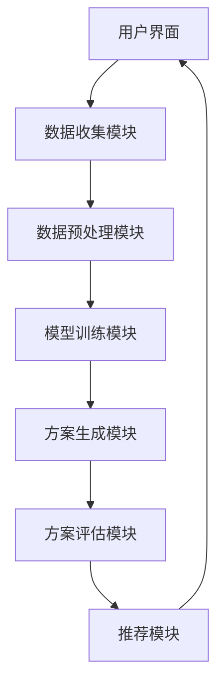

# 智能个人税务筹划助手

> 关键词：智能税务筹划、个人税务、算法原理、实战案例、应用场景

> 摘要：本文围绕智能个人税务筹划助手展开深入探讨。首先介绍了该主题的背景，包括目的、预期读者、文档结构和相关术语。接着阐述了核心概念及其联系，详细说明了核心算法原理并给出Python代码示例，同时讲解了相关数学模型和公式。通过项目实战部分，呈现了开发环境搭建、源代码实现及代码解读。分析了智能个人税务筹划助手的实际应用场景，推荐了学习资源、开发工具框架和相关论文著作。最后总结了未来发展趋势与挑战，并提供常见问题解答和扩展阅读参考资料，旨在为读者全面剖析智能个人税务筹划助手的技术原理和应用实践。

## 1. 背景介绍 
### 1.1 目的和范围
随着经济的发展和个人收入的多元化，个人税务筹划变得越来越重要。智能个人税务筹划助手的目的是帮助个人在合法合规的前提下，通过合理的税务规划，降低税务负担，实现个人财富的最大化。本文章的范围涵盖了智能个人税务筹划助手的核心概念、算法原理、数学模型、项目实战、应用场景等方面，旨在为读者提供全面而深入的了解。

### 1.2 预期读者
本文预期读者包括对个人税务筹划感兴趣的普通个人、从事税务相关工作的专业人士、软件开发人员以及对人工智能在税务领域应用有研究需求的学者。普通个人可以通过本文了解如何借助智能助手进行税务筹划；税务专业人士可以从中获取新的技术思路和方法；软件开发人员可以学习到相关的算法实现和项目开发经验；学者则可以对该领域的研究现状和发展趋势有更清晰的认识。

### 1.3 文档结构概述
本文将按照以下结构进行阐述：首先介绍背景信息，让读者对智能个人税务筹划助手有初步的认识；接着讲解核心概念与联系，帮助读者理解其基本原理；然后详细说明核心算法原理和具体操作步骤，并给出Python代码示例；随后介绍数学模型和公式，使读者了解其理论基础；通过项目实战部分，展示如何开发一个智能个人税务筹划助手；分析实际应用场景，让读者明白其实际价值；推荐相关的工具和资源，方便读者进一步学习和研究；最后总结未来发展趋势与挑战，为读者提供思考方向，并提供常见问题解答和扩展阅读参考资料。

### 1.4 术语表
#### 1.4.1 核心术语定义
- **税务筹划**：指在纳税行为发生之前，在不违反法律、法规（税法及其他相关法律、法规）的前提下，通过对纳税主体（法人或自然人）的经营活动或投资行为等涉税事项做出事先安排，以达到少缴税或递延纳税目标的一系列谋划活动。
- **智能个人税务筹划助手**：利用人工智能技术，为个人提供税务筹划建议和方案的软件系统。
- **税前收入**：个人在缴纳所得税之前的全部收入。
- **应纳税所得额**：按照税法规定，从税前收入中扣除各项扣除项目后，用于计算应纳税额的金额。
- **税率**：对征税对象的征收比例或征收额度。

#### 1.4.2 相关概念解释
- **累进税率**：随着应纳税所得额的增加而提高的税率制度。在累进税率下，应纳税所得额越高，适用的税率也越高。
- **专项附加扣除**：包括子女教育、继续教育、大病医疗、住房贷款利息、住房租金、赡养老人等六项，是在计算应纳税所得额时可以扣除的项目。
- **递延纳税**：允许纳税人在一定期限内推迟缴纳税款，从而获得资金的时间价值。

#### 1.4.3 缩略词列表
- **AI**：Artificial Intelligence，人工智能
- **API**：Application Programming Interface，应用程序编程接口
- **SDK**：Software Development Kit，软件开发工具包

## 2. 核心概念与联系 

### 核心概念原理
智能个人税务筹划助手的核心原理是基于人工智能技术，通过对个人收入、扣除项目、税收政策等数据的分析和处理，为个人提供最优的税务筹划方案。其主要步骤包括数据收集、数据预处理、模型训练、方案生成和评估等。

数据收集阶段，助手会收集个人的收入信息、扣除项目信息、税收政策等数据。这些数据可以通过用户输入、第三方数据源（如税务部门的API）等方式获取。

数据预处理阶段，对收集到的数据进行清洗、转换和特征提取等操作，以提高数据的质量和可用性。

模型训练阶段，利用机器学习或深度学习算法，对预处理后的数据进行训练，建立税务筹划模型。该模型可以根据输入的个人信息，预测不同税务筹划方案下的应纳税额和税后收入。

方案生成阶段，根据训练好的模型，生成多种税务筹划方案。这些方案可能包括调整收入结构、合理利用扣除项目、选择合适的纳税方式等。

评估阶段，对生成的税务筹划方案进行评估，考虑方案的合法性、可行性和效益性等因素，选择最优的方案推荐给用户。

### 架构的文本示意图
```plaintext
+----------------------+
|      用户界面       |
| （输入个人信息、查看方案） |
+----------------------+
          |
          v
+----------------------+
|     数据收集模块     |
| （收集个人信息、税收政策） |
+----------------------+
          |
          v
+----------------------+
|    数据预处理模块    |
| （清洗、转换、特征提取） |
+----------------------+
          |
          v
+----------------------+
|    模型训练模块      |
| （机器学习/深度学习） |
+----------------------+
          |
          v
+----------------------+
|    方案生成模块      |
| （生成多种筹划方案） |
+----------------------+
          |
          v
+----------------------+
|    方案评估模块      |
| （评估方案优劣）     |
+----------------------+
          |
          v
+----------------------+
|      推荐模块        |
| （推荐最优方案给用户） |
+----------------------+
```

### Mermaid 流程图


## 3. 核心算法原理 & 具体操作步骤 

### 核心算法原理
智能个人税务筹划助手可以使用多种算法，如决策树、神经网络等。这里以决策树算法为例进行说明。

决策树是一种基于树结构进行决策的算法，每个内部节点表示一个属性上的测试，每个分支表示一个测试输出，每个叶节点表示一个类别或值。在智能个人税务筹划助手中，决策树可以根据个人的收入、扣除项目等信息，生成不同的税务筹划方案。

### 具体操作步骤
1. **数据准备**：收集个人的收入信息、扣除项目信息、税收政策等数据，并将其转换为适合决策树算法处理的格式。
2. **特征选择**：选择对税务筹划有重要影响的特征，如收入类型、扣除项目金额等。
3. **决策树构建**：使用训练数据构建决策树模型。可以使用Python中的`scikit-learn`库来实现。
4. **方案生成**：根据构建好的决策树模型，输入个人信息，生成相应的税务筹划方案。
5. **方案评估**：对生成的税务筹划方案进行评估，选择最优的方案。

### Python源代码示例
```python
import pandas as pd
from sklearn.tree import DecisionTreeClassifier
from sklearn.model_selection import train_test_split
from sklearn.metrics import accuracy_score

# 模拟数据
data = {
    'income_type': [1, 2, 1, 2, 1],
    'deduction_amount': [1000, 2000, 1500, 2500, 1200],
    'tax_plan': [1, 2, 1, 2, 1]
}
df = pd.DataFrame(data)

# 划分特征和标签
X = df[['income_type', 'deduction_amount']]
y = df['tax_plan']

# 划分训练集和测试集
X_train, X_test, y_train, y_test = train_test_split(X, y, test_size=0.2, random_state=42)

# 构建决策树模型
model = DecisionTreeClassifier()
model.fit(X_train, y_train)

# 预测
y_pred = model.predict(X_test)

# 评估模型
accuracy = accuracy_score(y_test, y_pred)
print(f"模型准确率: {accuracy}")

# 示例个人信息
new_person = [[1, 1800]]
plan = model.predict(new_person)
print(f"推荐的税务筹划方案: {plan[0]}")
```

### 代码解释
1. **数据准备**：使用`pandas`库创建一个包含个人信息和税务筹划方案的数据集。
2. **特征选择**：选择`income_type`和`deduction_amount`作为特征。
3. **决策树构建**：使用`DecisionTreeClassifier`类构建决策树模型，并使用训练数据进行训练。
4. **方案生成**：使用训练好的模型对新的个人信息进行预测，生成推荐的税务筹划方案。
5. **方案评估**：使用`accuracy_score`函数评估模型的准确率。

## 4. 数学模型和公式 & 详细讲解 & 举例说明 

### 应纳税所得额计算公式
应纳税所得额 $=$ 税前收入 $-$ 基本减除费用 $-$ 专项扣除 $-$ 专项附加扣除 $-$ 依法确定的其他扣除

其中，基本减除费用是每月固定的扣除金额，目前为5000元/月；专项扣除包括五险一金等；专项附加扣除包括子女教育、继续教育、大病医疗、住房贷款利息、住房租金、赡养老人等六项。

### 应纳税额计算公式
应纳税额 $=$ 应纳税所得额 $\times$ 适用税率 $-$ 速算扣除数

适用税率和速算扣除数根据应纳税所得额的范围确定，采用累进税率制度。

### 举例说明
假设小李每月税前收入为10000元，五险一金扣除1000元，有一个子女正在接受全日制学历教育，可享受每月1000元的专项附加扣除，基本减除费用为5000元/月。

1. **计算应纳税所得额**
应纳税所得额 $= 10000 - 5000 - 1000 - 1000 = 3000$（元）

2. **确定适用税率和速算扣除数**
根据个人所得税税率表，应纳税所得额不超过36000元的部分，适用税率为3%，速算扣除数为0。

3. **计算应纳税额**
应纳税额 $= 3000 \times 3\% - 0 = 90$（元）

### 税务筹划思路
通过合理调整收入结构、增加扣除项目等方式，可以降低应纳税所得额，从而减少应纳税额。例如，小李可以将部分工资收入转化为劳务报酬收入，或者增加一些符合条件的扣除项目，如继续教育费用等。

## 5. 项目实战：代码实际案例和详细解释说明 

### 5.1  开发环境搭建
#### 操作系统
可以选择Windows、Linux或macOS等操作系统。

#### 编程语言
使用Python作为开发语言，Python具有丰富的库和工具，适合进行数据处理和机器学习。

#### 开发工具
推荐使用PyCharm作为集成开发环境（IDE），它提供了代码编辑、调试、版本控制等功能，方便开发。

#### 依赖库安装
使用`pip`命令安装所需的依赖库，如`pandas`、`scikit-learn`等。
```sh
pip install pandas scikit-learn
```

### 5.2  源代码详细实现和代码解读
```python
import pandas as pd
from sklearn.tree import DecisionTreeClassifier
from sklearn.model_selection import train_test_split
from sklearn.metrics import accuracy_score

# 读取数据
data = pd.read_csv('tax_data.csv')

# 划分特征和标签
X = data.drop('tax_plan', axis=1)
y = data['tax_plan']

# 划分训练集和测试集
X_train, X_test, y_train, y_test = train_test_split(X, y, test_size=0.2, random_state=42)

# 构建决策树模型
model = DecisionTreeClassifier()
model.fit(X_train, y_train)

# 预测
y_pred = model.predict(X_test)

# 评估模型
accuracy = accuracy_score(y_test, y_pred)
print(f"模型准确率: {accuracy}")

# 示例个人信息
new_person = pd.DataFrame({
    'income_type': [1],
    'deduction_amount': [1800]
})
plan = model.predict(new_person)
print(f"推荐的税务筹划方案: {plan[0]}")
```

### 代码解读
1. **数据读取**：使用`pandas`库的`read_csv`函数读取存储个人信息和税务筹划方案的CSV文件。
2. **特征和标签划分**：将数据集中的`tax_plan`列作为标签，其余列作为特征。
3. **训练集和测试集划分**：使用`train_test_split`函数将数据集划分为训练集和测试集，测试集占比为20%。
4. **决策树模型构建**：使用`DecisionTreeClassifier`类构建决策树模型，并使用训练集进行训练。
5. **预测和评估**：使用训练好的模型对测试集进行预测，并使用`accuracy_score`函数评估模型的准确率。
6. **方案推荐**：创建一个包含示例个人信息的DataFrame，使用模型进行预测，输出推荐的税务筹划方案。

### 5.3  代码解读与分析
#### 优点
- **简单易懂**：决策树算法的原理简单，易于理解和实现。
- **可解释性强**：决策树模型可以直观地展示决策过程，方便用户理解推荐的税务筹划方案。
- **适应性好**：可以处理多种类型的数据，对数据的分布要求不高。

#### 缺点
- **容易过拟合**：决策树模型在训练数据上可能表现很好，但在测试数据上的表现可能不佳。
- **对数据质量要求较高**：数据中的噪声和缺失值可能会影响模型的性能。

#### 改进方向
- **集成学习**：可以使用随机森林、梯度提升等集成学习算法，提高模型的性能和稳定性。
- **数据预处理**：对数据进行更细致的预处理，如缺失值填充、异常值处理等，提高数据质量。

## 6. 实际应用场景 
### 个人理财规划
智能个人税务筹划助手可以帮助个人在进行理财规划时，考虑税务因素，优化投资组合和收入结构，降低税务负担，实现财富的最大化。例如，在选择投资产品时，考虑不同产品的税收政策，选择税负较低的产品；在安排收入时，合理分配工资、奖金、劳务报酬等收入类型，充分利用税收优惠政策。

### 自由职业者税务管理
自由职业者的收入来源多样，税务处理相对复杂。智能个人税务筹划助手可以根据自由职业者的收入情况，提供合理的税务筹划方案，帮助他们准确计算应纳税额，避免税务风险。例如，对于经常获得劳务报酬的自由职业者，助手可以建议他们合理安排劳务报酬的发放时间和金额，以降低适用税率。

### 企业员工税务咨询
企业员工可能对个人所得税政策了解不够深入，不知道如何进行税务筹划。智能个人税务筹划助手可以作为企业内部的税务咨询工具，为员工提供个性化的税务筹划建议。例如，帮助员工了解专项附加扣除的政策和申报方法，指导员工合理利用扣除项目降低应纳税额。

### 税务代理机构辅助工具
税务代理机构在为客户提供税务筹划服务时，可以使用智能个人税务筹划助手提高工作效率和服务质量。助手可以快速分析客户的财务数据，生成多种税务筹划方案，并对方案进行评估和比较，为税务代理人员提供参考。

## 7. 工具和资源推荐
### 7.1 学习资源推荐
#### 7.1.1 书籍推荐
- 《个人所得税实务》：详细介绍了个人所得税的政策法规、计算方法和税务筹划技巧，适合初学者和有一定基础的读者。
- 《机器学习实战》：介绍了机器学习的基本算法和应用，包括决策树、神经网络等，对于理解智能个人税务筹划助手的算法原理有很大帮助。
- 《Python数据分析实战》：讲解了使用Python进行数据分析的方法和技巧，包括数据处理、可视化等，对于开发智能个人税务筹划助手的数据处理模块有指导作用。

#### 7.1.2 在线课程
- Coursera上的“机器学习”课程：由斯坦福大学教授Andrew Ng授课，是机器学习领域的经典课程，涵盖了机器学习的基本概念、算法和应用。
- 网易云课堂上的“Python数据分析与挖掘实战”课程：通过实际案例，介绍了使用Python进行数据分析和挖掘的方法和技巧。
- 中国大学MOOC上的“税法”课程：由国内知名高校的教授授课，系统介绍了税法的基本原理和主要税种的政策法规。

#### 7.1.3 技术博客和网站
- 博客园：是国内知名的技术博客平台，有很多关于Python、机器学习、税务筹划等方面的技术文章。
- 知乎：是一个知识问答社区，有很多关于个人税务筹划和人工智能的讨论和分享。
- 国家税务总局官网：提供了最新的税收政策法规和税务资讯，是了解税务政策的权威渠道。

### 7.2 开发工具框架推荐
#### 7.2.1 IDE和编辑器
- PyCharm：是一款专门为Python开发设计的集成开发环境，具有代码编辑、调试、版本控制等功能，适合专业的Python开发者。
- Jupyter Notebook：是一个交互式的开发环境，可以在浏览器中编写和运行Python代码，方便进行数据分析和模型训练。
- Visual Studio Code：是一款轻量级的代码编辑器，支持多种编程语言，具有丰富的插件和扩展功能，适合初学者和小型项目开发。

#### 7.2.2 调试和性能分析工具
- `pdb`：是Python内置的调试工具，可以在代码中设置断点，逐步执行代码，方便查找和解决问题。
- `cProfile`：是Python的性能分析工具，可以分析代码的运行时间和函数调用情况，帮助优化代码性能。
- TensorBoard：是TensorFlow的可视化工具，可以用于可视化神经网络的训练过程和模型结构。

#### 7.2.3 相关框架和库
- `pandas`：是Python中用于数据处理和分析的库，提供了数据结构和数据操作方法，方便进行数据清洗、转换和分析。
- `scikit-learn`：是Python中用于机器学习的库，提供了多种机器学习算法和工具，如分类、回归、聚类等。
- `TensorFlow`：是Google开发的深度学习框架，用于构建和训练神经网络模型，适合处理复杂的数据分析和预测任务。

### 7.3 相关论文著作推荐
#### 7.3.1 经典论文
- 《决策树归纳》：介绍了决策树算法的基本原理和构建方法，是决策树领域的经典论文。
- 《神经网络与深度学习》：对神经网络和深度学习的基本概念、算法和应用进行了系统的介绍，是深度学习领域的重要文献。
- 《税收筹划的基本原理与方法》：阐述了税收筹划的基本理论和方法，对于理解税务筹划的本质和思路有很大帮助。

#### 7.3.2 最新研究成果
- 可以通过学术搜索引擎，如IEEE Xplore、ACM Digital Library等，搜索关于智能税务筹划、人工智能在税务领域应用等方面的最新研究论文。
- 关注相关学术会议，如ACM SIGKDD、IEEE ICDM等，了解该领域的最新研究动态和成果。

#### 7.3.3 应用案例分析
- 可以查阅一些税务咨询公司、会计师事务所等机构发布的税务筹划案例分析报告，了解实际应用中智能个人税务筹划助手的使用效果和经验。
- 关注一些企业的财务报表和税务公告，分析企业在税务筹划方面的策略和实践。

## 8. 总结：未来发展趋势与挑战
### 未来发展趋势
#### 智能化程度不断提高
随着人工智能技术的不断发展，智能个人税务筹划助手的智能化程度将不断提高。未来，助手将能够更加准确地理解用户的需求，提供更加个性化、智能化的税务筹划方案。例如，通过自然语言处理技术，用户可以用自然语言与助手进行交互，助手可以自动识别用户的问题并提供相应的解决方案。

#### 与其他金融服务融合
智能个人税务筹划助手将与其他金融服务，如理财规划、投资咨询等进行深度融合。用户可以在一个平台上获得全方位的金融服务，实现税务筹划与理财规划的协同优化。例如，助手可以根据用户的税务筹划方案，推荐适合的投资产品和理财策略，帮助用户实现财富的最大化。

#### 大数据和云计算的应用
大数据和云计算技术将为智能个人税务筹划助手提供更强大的支持。通过收集和分析大量的税务数据和用户行为数据，助手可以更好地了解用户的需求和税务情况，提供更加精准的税务筹划方案。同时，云计算技术可以提供强大的计算能力和存储能力，支持助手处理大规模的数据和复杂的计算任务。

### 挑战
#### 数据安全和隐私问题
智能个人税务筹划助手需要收集和处理用户的大量敏感信息，如个人收入、扣除项目等。因此，数据安全和隐私问题是一个重要的挑战。如何保障用户数据的安全和隐私，防止数据泄露和滥用，是需要解决的关键问题。

#### 税收政策的复杂性和变化性
税收政策具有复杂性和变化性，不同地区、不同行业的税收政策可能存在差异，而且税收政策会随着时间的推移而不断调整。智能个人税务筹划助手需要及时跟踪和更新税收政策，确保提供的税务筹划方案符合最新的政策要求。

#### 法律合规问题
税务筹划需要在合法合规的前提下进行。智能个人税务筹划助手在提供税务筹划方案时，需要确保方案的合法性和合规性，避免用户陷入税务风险。因此，如何保证助手的算法和方案符合法律规定，是一个需要解决的挑战。

## 9. 附录：常见问题与解答
### 智能个人税务筹划助手提供的方案是否合法合规？
智能个人税务筹划助手会根据最新的税收政策和法律法规，生成合法合规的税务筹划方案。但在实际应用中，用户仍需要根据自身的实际情况，咨询专业的税务顾问，确保方案的合法性和可行性。

### 助手如何保证数据的安全和隐私？
助手会采用多种技术手段，如数据加密、访问控制、安全审计等，保障用户数据的安全和隐私。同时，助手会遵守相关的法律法规和隐私政策，不会将用户数据泄露给第三方。

### 助手能否适应不同地区的税收政策？
助手可以通过不断更新税收政策数据库，适应不同地区的税收政策。但由于不同地区的税收政策存在差异，用户在使用助手时，需要提供准确的地区信息，以便助手生成符合当地政策的税务筹划方案。

### 助手的推荐方案是否适用于所有用户？
助手的推荐方案是基于用户提供的信息和普遍的税收政策生成的，可能不适用于所有用户。每个用户的情况都不同，如收入结构、家庭状况等，因此用户在使用助手的推荐方案时，需要结合自身的实际情况进行调整。

## 10. 扩展阅读 & 参考资料
### 扩展阅读
- 《人工智能简史》：了解人工智能的发展历程和主要技术，有助于更好地理解智能个人税务筹划助手的技术背景。
- 《税收筹划案例分析》：通过实际案例，深入学习税务筹划的方法和技巧。
- 《Python机器学习实战》：进一步学习Python在机器学习领域的应用，提高开发智能个人税务筹划助手的能力。

### 参考资料
- 国家税务总局官网：获取最新的税收政策法规和税务资讯。
- 《中华人民共和国个人所得税法》：了解个人所得税的基本法律规定。
- 《机器学习》（周志华著）：系统学习机器学习的理论和算法。

作者：AI天才研究院/AI Genius Institute & 禅与计算机程序设计艺术 /Zen And The Art of Computer Programming