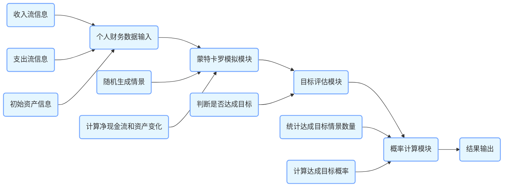

# 智能个人财务目标达成概率计算器

> 关键词：智能财务目标计算器、财务目标达成概率、个人财务管理、算法原理、实际应用

> 摘要：本文聚焦于智能个人财务目标达成概率计算器这一主题，深入探讨其核心概念、算法原理、数学模型等方面内容。通过详细的 Python 代码示例展示其具体实现过程，同时介绍了开发环境搭建、代码解读等项目实战要点。此外，还阐述了该计算器在实际生活中的应用场景，推荐了相关的学习资源、开发工具和论文著作。最后对其未来发展趋势与挑战进行总结，并提供常见问题解答和扩展阅读参考资料，旨在为读者全面了解和应用智能个人财务目标达成概率计算器提供专业且实用的指导。

## 1. 背景介绍 
### 1.1 目的和范围
在当今社会，个人财务管理变得越来越重要。人们往往有着各种各样的财务目标，如购买房产、储备子女教育资金、规划退休生活等。然而，要准确评估自己达成这些目标的概率并非易事。智能个人财务目标达成概率计算器的目的就是为个人提供一个科学、便捷的工具，帮助他们根据自身的财务状况、收入支出情况以及目标设定，计算出达成特定财务目标的概率。

本文章的范围涵盖了该计算器的核心概念、算法原理、数学模型、实际开发实现、应用场景以及相关的学习资源和未来发展趋势等方面，旨在全面介绍这一工具的理论和实践知识。

### 1.2 预期读者
本文预期读者包括对个人财务管理感兴趣的普通大众，希望通过科学工具来规划自己财务目标的人群；也包括从事金融科技、软件开发相关领域的专业人士，他们可以从文章中获取关于该计算器的技术实现和算法设计的相关知识；同时，对于学习金融数学、计算机编程等专业的学生也具有一定的参考价值。

### 1.3 文档结构概述
本文将按照以下结构进行阐述：首先介绍核心概念与联系，包括该计算器所涉及的基本概念和它们之间的关系，并通过示意图和流程图进行直观展示；接着详细讲解核心算法原理和具体操作步骤，同时使用 Python 代码进行说明；然后介绍相关的数学模型和公式，并举例说明其应用；之后通过项目实战部分展示代码的实际案例和详细解释；再探讨该计算器的实际应用场景；随后推荐相关的工具和资源，包括学习资源、开发工具和论文著作；最后进行总结，分析未来发展趋势与挑战，并提供常见问题解答和扩展阅读参考资料。

### 1.4 术语表
#### 1.4.1 核心术语定义
- **财务目标**：个人在一定时间内希望实现的财务成果，如储蓄一定金额、偿还债务等。
- **达成概率**：基于个人当前财务状况、收入支出预测等因素，计算出实现财务目标的可能性。
- **收入流**：个人在一定时期内获得的各种收入的总和，包括工资、投资收益等。
- **支出流**：个人在一定时期内的各项支出的总和，如生活费用、房贷还款等。
- **净现金流**：收入流减去支出流后的剩余金额。

#### 1.4.2 相关概念解释
- **蒙特卡罗模拟**：一种通过随机抽样和统计试验来求解问题的数值计算方法，在本计算器中用于模拟不同的财务情景，以计算达成目标的概率。
- **风险评估**：对可能影响财务目标达成的各种风险因素进行分析和评估，如市场波动、收入不稳定等。

#### 1.4.3 缩略词列表
- **MC**：蒙特卡罗（Monte Carlo）

## 2. 核心概念与联系 

### 核心概念原理
智能个人财务目标达成概率计算器的核心原理是基于个人的财务数据和目标设定，通过模拟不同的财务情景来计算达成目标的概率。具体来说，它会考虑个人的收入流、支出流、初始资产等因素，并结合一定的概率分布来模拟未来的财务状况。

例如，收入流可能受到工资增长、奖金发放等因素的影响，支出流可能受到物价波动、生活费用变化等因素的影响。通过对这些因素进行随机模拟，可以得到大量不同的财务情景，然后统计在这些情景中达成财务目标的比例，即为达成目标的概率。

### 架构的文本示意图
```plaintext
个人财务数据输入
|
|-- 收入流信息（工资、投资收益等）
|-- 支出流信息（生活费用、房贷等）
|-- 初始资产信息
|
V
蒙特卡罗模拟模块
|
|-- 随机生成不同的收入、支出情景
|-- 计算每个情景下的净现金流和资产变化
|
V
目标评估模块
|
|-- 判断每个情景是否达成财务目标
|
V
概率计算模块
|
|-- 统计达成目标的情景数量
|-- 计算达成目标的概率
|
V
结果输出
```

### Mermaid 流程图


## 3. 核心算法原理 & 具体操作步骤 

### 核心算法原理
本计算器的核心算法基于蒙特卡罗模拟。蒙特卡罗模拟是一种通过随机抽样来模拟复杂系统行为的方法。在个人财务目标达成概率计算中，我们可以通过以下步骤进行模拟：

1. **定义输入参数**：包括初始资产、收入流、支出流、财务目标、模拟次数等。
2. **随机生成情景**：对于每个模拟周期，根据收入和支出的概率分布随机生成收入和支出的值。
3. **计算净现金流和资产变化**：根据生成的收入和支出值，计算每个周期的净现金流，并更新资产值。
4. **判断是否达成目标**：在每个模拟结束时，判断当前资产值是否达到或超过财务目标。
5. **统计达成目标的概率**：重复上述步骤多次，统计达成目标的模拟次数占总模拟次数的比例，即为达成目标的概率。

### 具体操作步骤及 Python 代码实现

```python
import random

def simulate_financial_goal(initial_assets, income_mean, income_std, expense_mean, expense_std, goal, num_simulations, num_periods):
    """
    模拟个人财务目标达成概率
    :param initial_assets: 初始资产
    :param income_mean: 平均收入
    :param income_std: 收入标准差
    :param expense_mean: 平均支出
    :param expense_std: 支出标准差
    :param goal: 财务目标
    :param num_simulations: 模拟次数
    :param num_periods: 模拟周期数
    :return: 达成目标的概率
    """
    success_count = 0

    for _ in range(num_simulations):
        current_assets = initial_assets

        for _ in range(num_periods):
            # 随机生成收入和支出
            income = random.normalvariate(income_mean, income_std)
            expense = random.normalvariate(expense_mean, expense_std)

            # 计算净现金流
            net_cash_flow = income - expense

            # 更新资产值
            current_assets += net_cash_flow

        # 判断是否达成目标
        if current_assets >= goal:
            success_count += 1

    # 计算达成目标的概率
    probability = success_count / num_simulations
    return probability

# 示例参数
initial_assets = 10000
income_mean = 5000
income_std = 1000
expense_mean = 3000
expense_std = 500
goal = 50000
num_simulations = 10000
num_periods = 12

# 调用函数进行模拟
result = simulate_financial_goal(initial_assets, income_mean, income_std, expense_mean, expense_std, goal, num_simulations, num_periods)
print(f"达成目标的概率: {result * 100:.2f}%")
```

### 代码解释
1. **函数定义**：`simulate_financial_goal` 函数接受初始资产、收入和支出的均值与标准差、财务目标、模拟次数和模拟周期数作为参数。
2. **模拟循环**：外层循环控制模拟次数，内层循环控制模拟周期数。
3. **随机生成收入和支出**：使用 `random.normalvariate` 函数根据正态分布随机生成收入和支出的值。
4. **计算净现金流和更新资产值**：根据生成的收入和支出计算净现金流，并更新当前资产值。
5. **判断是否达成目标**：在每个模拟结束时，判断当前资产值是否达到或超过财务目标。
6. **统计达成目标的概率**：统计达成目标的模拟次数，并计算其占总模拟次数的比例。

## 4. 数学模型和公式 & 详细讲解 & 举例说明 

### 数学模型
本计算器主要基于随机过程和概率统计的数学模型。假设收入和支出服从正态分布，即：

- 收入 $I_t$ 服从正态分布 $N(\mu_I, \sigma_I^2)$，其中 $\mu_I$ 为平均收入，$\sigma_I$ 为收入标准差。
- 支出 $E_t$ 服从正态分布 $N(\mu_E, \sigma_E^2)$，其中 $\mu_E$ 为平均支出，$\sigma_E$ 为支出标准差。

净现金流 $CF_t$ 可以表示为：

$$CF_t = I_t - E_t$$

资产值 $A_t$ 的更新公式为：

$$A_{t+1} = A_t + CF_t$$

其中 $A_t$ 为第 $t$ 期的资产值。

### 详细讲解
正态分布是一种常见的概率分布，它具有对称性和集中性的特点。在本计算器中，使用正态分布来模拟收入和支出的随机性，是因为现实生活中的收入和支出往往受到多种因素的影响，其波动具有一定的规律性，近似服从正态分布。

通过多次模拟不同的收入和支出情景，我们可以得到大量的资产值变化路径。然后统计在这些路径中，资产值达到或超过财务目标的比例，即为达成目标的概率。

### 举例说明
假设小明初始资产为 10000 元，平均每月收入为 5000 元，收入标准差为 1000 元，平均每月支出为 3000 元，支出标准差为 500 元，他希望在 12 个月后资产达到 50000 元。

我们可以使用上述数学模型和 Python 代码进行模拟。通过多次模拟（例如 10000 次），统计在这些模拟中，12 个月后资产达到或超过 50000 元的次数，然后计算其占总模拟次数的比例，即为小明达成目标的概率。

在上述 Python 代码示例中，我们已经实现了这个模拟过程，最终输出的结果就是小明达成目标的概率。

## 5. 项目实战：代码实际案例和详细解释说明 

### 5.1  开发环境搭建
为了运行上述的 Python 代码，我们需要搭建相应的开发环境。以下是具体步骤：

1. **安装 Python**：访问 Python 官方网站（https://www.python.org/downloads/），下载并安装适合你操作系统的 Python 版本。建议安装 Python 3.6 及以上版本。
2. **选择开发工具**：可以选择使用集成开发环境（IDE）如 PyCharm，也可以使用轻量级的文本编辑器如 Visual Studio Code，并安装 Python 扩展。
3. **创建虚拟环境（可选）**：为了避免不同项目之间的依赖冲突，建议创建虚拟环境。在命令行中执行以下命令：
```bash
python -m venv myenv
```
其中 `myenv` 是虚拟环境的名称。激活虚拟环境：
- 在 Windows 上：
```bash
myenv\Scripts\activate
```
- 在 Linux 或 macOS 上：
```bash
source myenv/bin/activate
```

### 5.2  源代码详细实现和代码解读
以下是完整的源代码及详细解读：

```python
import random

def simulate_financial_goal(initial_assets, income_mean, income_std, expense_mean, expense_std, goal, num_simulations, num_periods):
    """
    模拟个人财务目标达成概率
    :param initial_assets: 初始资产
    :param income_mean: 平均收入
    :param income_std: 收入标准差
    :param expense_mean: 平均支出
    :param expense_std: 支出标准差
    :param goal: 财务目标
    :param num_simulations: 模拟次数
    :param num_periods: 模拟周期数
    :return: 达成目标的概率
    """
    success_count = 0

    for _ in range(num_simulations):
        current_assets = initial_assets

        for _ in range(num_periods):
            # 随机生成收入和支出
            income = random.normalvariate(income_mean, income_std)
            expense = random.normalvariate(expense_mean, expense_std)

            # 计算净现金流
            net_cash_flow = income - expense

            # 更新资产值
            current_assets += net_cash_flow

        # 判断是否达成目标
        if current_assets >= goal:
            success_count += 1

    # 计算达成目标的概率
    probability = success_count / num_simulations
    return probability

# 示例参数
initial_assets = 10000
income_mean = 5000
income_std = 1000
expense_mean = 3000
expense_std = 500
goal = 50000
num_simulations = 10000
num_periods = 12

# 调用函数进行模拟
result = simulate_financial_goal(initial_assets, income_mean, income_std, expense_mean, expense_std, goal, num_simulations, num_periods)
print(f"达成目标的概率: {result * 100:.2f}%")
```

### 代码解读与分析
1. **导入模块**：`import random` 导入 Python 的随机数模块，用于生成服从正态分布的随机数。
2. **函数定义**：`simulate_financial_goal` 函数接受多个参数，包括初始资产、收入和支出的均值与标准差、财务目标、模拟次数和模拟周期数。
3. **模拟循环**：外层循环 `for _ in range(num_simulations)` 控制模拟次数，内层循环 `for _ in range(num_periods)` 控制模拟周期数。
4. **随机生成收入和支出**：使用 `random.normalvariate(income_mean, income_std)` 和 `random.normalvariate(expense_mean, expense_std)` 分别生成服从正态分布的收入和支出值。
5. **计算净现金流和更新资产值**：`net_cash_flow = income - expense` 计算净现金流，`current_assets += net_cash_flow` 更新当前资产值。
6. **判断是否达成目标**：在每个模拟结束时，使用 `if current_assets >= goal` 判断当前资产值是否达到或超过财务目标，如果是，则 `success_count` 加 1。
7. **计算达成目标的概率**：`probability = success_count / num_simulations` 计算达成目标的概率。
8. **示例参数和函数调用**：定义示例参数，并调用 `simulate_financial_goal` 函数进行模拟，最后输出达成目标的概率。

## 6. 实际应用场景 
智能个人财务目标达成概率计算器在实际生活中有广泛的应用场景，以下是一些常见的例子：

### 购房规划
对于想要购买房产的人来说，他们需要考虑自己的储蓄情况、未来的收入和支出，以及房价的走势等因素。通过使用该计算器，他们可以输入自己的初始资产、每月收入、每月支出、购房目标金额等信息，计算出在一定时间内达成购房目标的概率。根据计算结果，他们可以调整自己的储蓄计划、收入策略或购房预算，以提高达成目标的可能性。

### 教育资金储备
家长们通常希望为子女的教育储备足够的资金。他们可以使用该计算器来评估自己当前的财务状况是否能够满足未来子女教育的费用需求。例如，输入子女当前的年龄、预计上大学的费用、自己的初始资产、每月收入和支出等信息，计算出在子女上大学时能够储备足够资金的概率。如果概率较低，他们可以考虑增加储蓄、进行投资等方式来提高达成目标的概率。

### 退休规划
退休规划是个人财务管理的重要组成部分。人们需要考虑自己退休后的生活费用、医疗费用等支出，以及自己的养老金、储蓄和投资收益等收入。通过该计算器，他们可以输入自己的当前年龄、预计退休年龄、退休后的每月生活费用、当前的资产和收入情况等信息，计算出在退休后能够维持一定生活水平的概率。根据计算结果，他们可以调整自己的退休储蓄计划、投资策略或退休年龄，以确保自己的退休生活有足够的经济保障。

### 债务偿还
对于有债务的人来说，他们希望尽快偿还债务并恢复良好的财务状况。使用该计算器，他们可以输入自己的债务金额、每月还款能力、收入和支出情况等信息，计算出在一定时间内还清债务的概率。根据计算结果，他们可以制定合理的还款计划，如增加还款金额、延长还款期限等，以提高还清债务的可能性。

## 7. 工具和资源推荐
### 7.1 学习资源推荐
#### 7.1.1 书籍推荐
- 《个人理财规划》：这本书详细介绍了个人理财的各个方面，包括储蓄、投资、保险、退休规划等，对于理解个人财务目标的设定和规划具有重要的参考价值。
- 《Python 数据分析实战》：通过实际案例介绍了如何使用 Python 进行数据分析和处理，对于学习如何使用 Python 实现智能个人财务目标达成概率计算器有很大的帮助。
- 《金融数学》：涵盖了金融领域的数学模型和方法，如随机过程、期权定价等，有助于深入理解本计算器所涉及的数学原理。

#### 7.1.2 在线课程
- Coursera 上的“Personal Finance”课程：由知名高校的教授授课，系统地介绍了个人理财的知识和技能。
- Udemy 上的“Python for Finance: Investment Fundamentals & Data Analytics”课程：结合 Python 编程和金融数据分析，适合想要学习使用 Python 进行金融计算的学习者。
- edX 上的“Financial Engineering and Risk Management”课程：深入讲解了金融工程和风险管理的理论和实践，对于理解本计算器的风险评估和模拟方法有很大的帮助。

#### 7.1.3 技术博客和网站
- Medium：上面有很多关于个人理财和数据分析的技术博客文章，可以从中获取最新的技术和实践经验。
- Towards Data Science：专注于数据科学和机器学习领域的技术博客，有很多关于 Python 编程和金融数据分析的优质文章。
- Investopedia：提供了丰富的金融知识和投资信息，对于理解个人财务目标和金融市场有很大的帮助。

### 7.2 开发工具框架推荐
#### 7.2.1 IDE和编辑器
- PyCharm：一款功能强大的 Python 集成开发环境，提供了代码编辑、调试、版本控制等一系列功能，适合专业的 Python 开发者。
- Visual Studio Code：轻量级的文本编辑器，通过安装 Python 扩展可以实现 Python 代码的编辑和调试，具有良好的扩展性和易用性。
- Jupyter Notebook：交互式的开发环境，适合进行数据分析和实验，方便展示代码和结果。

#### 7.2.2 调试和性能分析工具
- pdb：Python 内置的调试器，可以帮助开发者定位和解决代码中的问题。
- cProfile：Python 标准库中的性能分析工具，可以分析代码的运行时间和函数调用情况，帮助开发者优化代码性能。
- Py-Spy：一个轻量级的 Python 性能分析工具，可以实时监测 Python 程序的性能，找出性能瓶颈。

#### 7.2.3 相关框架和库
- NumPy：Python 中用于科学计算的基础库，提供了高效的数组操作和数学函数，对于实现本计算器的数值计算非常有用。
- Pandas：用于数据处理和分析的库，提供了 DataFrame 等数据结构，方便对财务数据进行处理和分析。
- Matplotlib：用于数据可视化的库，可以将模拟结果以图表的形式展示出来，帮助用户更直观地理解结果。

### 7.3 相关论文著作推荐
#### 7.3.1 经典论文
- “A Stochastic Model for Personal Financial Planning”：提出了一种用于个人财务规划的随机模型，对于理解本计算器的数学模型和算法原理具有重要的参考价值。
- “Monte Carlo Simulation in Financial Risk Management”：详细介绍了蒙特卡罗模拟在金融风险管理中的应用，为本计算器的模拟方法提供了理论基础。

#### 7.3.2 最新研究成果
- 关注金融科技领域的学术期刊，如《Journal of Financial Technology》《Financial Innovation》等，这些期刊上会发表关于个人财务管理和智能计算的最新研究成果。

#### 7.3.3 应用案例分析
- 一些金融机构的研究报告和案例分析，如银行、证券公司等发布的关于个人理财规划和风险管理的案例，通过实际案例可以更好地理解智能个人财务目标达成概率计算器的应用和效果。

## 8. 总结：未来发展趋势与挑战
### 未来发展趋势
- **智能化和个性化**：随着人工智能和机器学习技术的不断发展，智能个人财务目标达成概率计算器将变得更加智能化和个性化。它可以根据用户的历史财务数据、消费习惯、风险偏好等因素，自动调整模拟参数和算法，为用户提供更加精准的目标达成概率计算和个性化的财务规划建议。
- **与金融科技融合**：未来，该计算器可能会与金融科技平台深度融合，实现与银行账户、投资账户等的实时数据对接，实时更新用户的财务状况，为用户提供更加及时和准确的财务信息和决策支持。
- **可视化和交互性增强**：为了提高用户体验，计算器的界面将更加可视化和具有交互性。用户可以通过图表、动画等形式直观地了解自己的财务状况和目标达成概率，还可以通过交互操作调整参数，实时查看不同情况下的计算结果。

### 挑战
- **数据质量和隐私问题**：准确的计算需要大量高质量的财务数据，但数据的收集和使用可能会涉及到用户的隐私问题。如何在保护用户隐私的前提下，获取和利用高质量的数据是一个重要的挑战。
- **模型的准确性和可靠性**：蒙特卡罗模拟等数学模型虽然可以模拟复杂的财务情景，但模型的准确性和可靠性受到多种因素的影响，如概率分布的假设、参数的估计等。如何提高模型的准确性和可靠性，是保证计算器计算结果可信的关键。
- **用户教育和接受度**：对于一些普通用户来说，智能个人财务目标达成概率计算器的概念和使用方法可能比较复杂，需要进行一定的用户教育。如何提高用户对该工具的接受度和使用频率，也是一个需要解决的问题。

## 9. 附录：常见问题与解答
### 问题 1：模拟次数越多，计算结果就越准确吗？
答：一般来说，模拟次数越多，计算结果越接近真实的概率。因为蒙特卡罗模拟是基于大量随机抽样来估计概率的，模拟次数越多，样本越能反映总体的特征，计算结果也就越准确。但模拟次数过多会增加计算时间和资源消耗，需要在准确性和计算效率之间进行平衡。

### 问题 2：收入和支出一定服从正态分布吗？
答：在实际生活中，收入和支出不一定完全服从正态分布。正态分布只是一种近似的假设，因为它具有良好的数学性质，便于进行计算和分析。在某些情况下，收入和支出可能呈现出其他分布特征，如偏态分布。如果有更准确的分布信息，可以根据实际情况调整模拟模型。

### 问题 3：如何提高达成财务目标的概率？
答：可以从以下几个方面提高达成财务目标的概率：增加收入，如通过兼职、投资等方式；减少支出，如合理规划消费、降低生活成本；调整目标，根据自己的实际情况适当降低目标金额或延长目标达成时间；优化投资策略，选择风险和收益合适的投资产品，提高资产的增值能力。

### 问题 4：该计算器可以考虑通货膨胀因素吗？
答：在上述代码示例中，没有考虑通货膨胀因素。但在实际应用中，可以通过调整收入、支出和目标金额来考虑通货膨胀的影响。例如，将收入和支出按照通货膨胀率进行调整，或者将目标金额按照通货膨胀率进行折现，以反映实际的购买力。

## 10. 扩展阅读 & 参考资料
- 《概率论与数理统计》：深入学习概率统计知识，有助于更好地理解本计算器所涉及的数学原理。
- 《Python 机器学习实战》：学习机器学习算法，为进一步优化计算器的功能和性能提供技术支持。
- 相关金融科技公司的官方文档和技术博客，如蚂蚁金服、腾讯金融科技等，了解行业最新的技术和应用案例。

作者：AI天才研究院/AI Genius Institute & 禅与计算机程序设计艺术 /Zen And The Art of Computer Programming