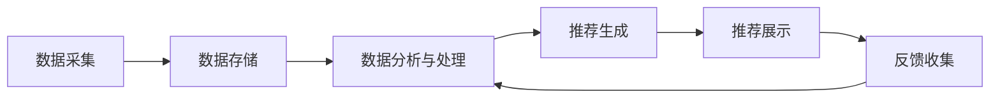

# 智能书架：AI Agent的图书推荐系统

> 关键词：智能书架、AI Agent、图书推荐系统、协同过滤、深度学习

> 摘要：本文深入探讨了基于AI Agent的图书推荐系统，详细介绍了该系统的核心概念、算法原理、数学模型，通过实际项目案例展示了系统的开发实现过程。同时，阐述了系统在不同场景下的应用，推荐了相关的学习资源、开发工具和研究论文。最后，对智能书架图书推荐系统的未来发展趋势和挑战进行了总结，并提供了常见问题的解答和扩展阅读的参考资料。

## 1. 背景介绍 
### 1.1 目的和范围
随着数字化时代的到来，图书馆和书店的藏书量急剧增加，读者在海量的图书中寻找自己感兴趣的书籍变得越来越困难。智能书架的图书推荐系统旨在利用AI Agent技术，根据读者的历史行为、偏好等信息，为读者提供个性化的图书推荐，提高读者发现感兴趣书籍的效率，同时也有助于图书馆和书店更好地管理和推广图书资源。本文的范围涵盖了智能书架图书推荐系统的原理、算法、开发实现、应用场景等方面。

### 1.2 预期读者
本文预期读者包括对人工智能、机器学习、图书推荐系统等领域感兴趣的技术人员、研究人员，以及图书馆和书店的管理人员。同时，对于希望了解智能书架技术应用的普通读者也具有一定的参考价值。

### 1.3 文档结构概述
本文将按照以下结构进行阐述：首先介绍智能书架图书推荐系统的核心概念和相关联系，包括系统的架构和工作流程；接着详细讲解核心算法原理和具体操作步骤，并通过Python代码进行说明；然后介绍系统所涉及的数学模型和公式，并举例说明；之后通过项目实战展示系统的开发实现过程，包括开发环境搭建、源代码实现和代码解读；再探讨系统的实际应用场景；推荐相关的学习资源、开发工具和研究论文；最后对系统的未来发展趋势和挑战进行总结，并提供常见问题的解答和扩展阅读的参考资料。

### 1.4 术语表
#### 1.4.1 核心术语定义
- **智能书架**：集成了传感器、网络通信和人工智能技术的书架，能够实时感知图书的状态和读者的行为。
- **AI Agent**：人工智能代理，是一种能够自主感知环境、做出决策并执行动作的软件实体。
- **图书推荐系统**：根据读者的历史行为、偏好等信息，为读者推荐感兴趣图书的系统。
- **协同过滤**：一种基于用户行为数据的推荐算法，通过寻找与目标用户行为相似的其他用户，来推荐他们喜欢的图书。
- **深度学习**：一种基于神经网络的机器学习方法，能够自动从大量数据中学习特征和模式。

#### 1.4.2 相关概念解释
- **个性化推荐**：根据每个用户的独特需求和偏好，为其提供定制化的推荐结果。
- **特征工程**：从原始数据中提取有用的特征，以便机器学习算法能够更好地理解和处理数据。
- **模型评估**：使用一定的指标和方法，对推荐模型的性能进行评估和比较。

#### 1.4.3 缩略词列表
- **CF**：协同过滤（Collaborative Filtering）
- **DNN**：深度神经网络（Deep Neural Network）
- **RMSE**：均方根误差（Root Mean Squared Error）
- **MAE**：平均绝对误差（Mean Absolute Error）

## 2. 核心概念与联系 

### 2.1 智能书架图书推荐系统的架构
智能书架图书推荐系统主要由以下几个部分组成：
- **数据采集层**：通过传感器、网络接口等方式，采集图书的基本信息、读者的借阅记录、浏览历史等数据。
- **数据存储层**：将采集到的数据存储在数据库中，以便后续的处理和分析。
- **数据分析与处理层**：对存储的数据进行清洗、预处理、特征提取等操作，然后使用机器学习算法进行模型训练。
- **推荐服务层**：根据训练好的模型，为读者提供个性化的图书推荐服务。
- **用户界面层**：为读者提供一个友好的交互界面，方便他们查询和浏览推荐的图书。

以下是智能书架图书推荐系统架构的文本示意图：
```plaintext
+----------------+
| 数据采集层      |
|  - 传感器       |
|  - 网络接口     |
+----------------+
       |
       v
+----------------+
| 数据存储层      |
|  - 数据库       |
+----------------+
       |
       v
+----------------+
| 数据分析与处理层 |
|  - 数据清洗      |
|  - 特征提取      |
|  - 模型训练      |
+----------------+
       |
       v
+----------------+
| 推荐服务层      |
|  - 推荐算法      |
|  - 推荐引擎      |
+----------------+
       |
       v
+----------------+
| 用户界面层      |
|  - 网页界面      |
|  - 移动应用界面  |
+----------------+
```

### 2.2 智能书架图书推荐系统的工作流程
智能书架图书推荐系统的工作流程如下：
1. 数据采集：通过传感器和网络接口，实时采集图书的状态和读者的行为数据。
2. 数据存储：将采集到的数据存储在数据库中，以便后续的处理和分析。
3. 数据分析与处理：对存储的数据进行清洗、预处理和特征提取，然后使用机器学习算法进行模型训练。
4. 推荐生成：根据训练好的模型，为读者生成个性化的图书推荐列表。
5. 推荐展示：将生成的推荐列表展示给读者，读者可以通过用户界面进行查询和浏览。
6. 反馈收集：收集读者对推荐结果的反馈信息，用于模型的优化和改进。

以下是智能书架图书推荐系统工作流程的Mermaid流程图：


### 2.3 核心概念之间的联系
智能书架是图书推荐系统的数据采集和交互平台，通过传感器和网络接口，为系统提供了丰富的读者行为数据。AI Agent作为系统的核心智能体，负责感知环境、做出决策并执行动作，它利用机器学习算法对采集到的数据进行分析和处理，生成个性化的图书推荐。图书推荐系统则是整个架构的应用层，它将AI Agent的推荐结果展示给读者，并收集读者的反馈信息，用于模型的优化和改进。

## 3. 核心算法原理 & 具体操作步骤 

### 3.1 协同过滤算法原理
协同过滤是一种基于用户行为数据的推荐算法，它的基本思想是：如果两个用户对某些图书的评价相似，那么他们对其他图书的评价也可能相似。协同过滤算法主要分为基于用户的协同过滤（User-based CF）和基于物品的协同过滤（Item-based CF）两种。

#### 3.1.1 基于用户的协同过滤
基于用户的协同过滤算法的具体步骤如下：
1. 计算用户之间的相似度：常用的相似度计算方法有皮尔逊相关系数、余弦相似度等。
2. 找到与目标用户最相似的K个用户：根据计算得到的相似度，选择与目标用户最相似的K个用户。
3. 预测目标用户对未评价图书的评分：根据K个相似用户对未评价图书的评分，预测目标用户对这些图书的评分。
4. 生成推荐列表：根据预测的评分，为目标用户生成推荐列表。

以下是基于用户的协同过滤算法的Python代码实现：
```python
import numpy as np

def pearson_similarity(user1, user2):
    """
    计算两个用户之间的皮尔逊相关系数
    """
    common_items = np.logical_and(~np.isnan(user1), ~np.isnan(user2))
    if np.sum(common_items) == 0:
        return 0
    user1_common = user1[common_items]
    user2_common = user2[common_items]
    mean_user1 = np.nanmean(user1)
    mean_user2 = np.nanmean(user2)
    numerator = np.sum((user1_common - mean_user1) * (user2_common - mean_user2))
    denominator = np.sqrt(np.sum((user1_common - mean_user1) ** 2)) * np.sqrt(np.sum((user2_common - mean_user2) ** 2))
    if denominator == 0:
        return 0
    return numerator / denominator

def user_based_cf(ratings, target_user, k):
    """
    基于用户的协同过滤算法
    """
    num_users = ratings.shape[0]
    similarities = []
    for i in range(num_users):
        if i!= target_user:
            similarity = pearson_similarity(ratings[target_user], ratings[i])
            similarities.append((i, similarity))
    similarities.sort(key=lambda x: x[1], reverse=True)
    top_k_users = similarities[:k]
    predictions = []
    for j in range(ratings.shape[1]):
        if np.isnan(ratings[target_user][j]):
            numerator = 0
            denominator = 0
            for user, similarity in top_k_users:
                if not np.isnan(ratings[user][j]):
                    numerator += similarity * ratings[user][j]
                    denominator += similarity
            if denominator!= 0:
                prediction = numerator / denominator
                predictions.append((j, prediction))
    predictions.sort(key=lambda x: x[1], reverse=True)
    return predictions

# 示例数据
ratings = np.array([
    [5, 3, np.nan, 1],
    [4, np.nan, np.nan, 1],
    [1, 1, np.nan, 5],
    [1, np.nan, np.nan, 4],
    [np.nan, 1, 5, 4]
])
target_user = 0
k = 2
recommendations = user_based_cf(ratings, target_user, k)
print("基于用户的协同过滤推荐结果：", recommendations)
```

#### 3.1.2 基于物品的协同过滤
基于物品的协同过滤算法的具体步骤如下：
1. 计算物品之间的相似度：常用的相似度计算方法有皮尔逊相关系数、余弦相似度等。
2. 找到与目标物品最相似的K个物品：根据计算得到的相似度，选择与目标物品最相似的K个物品。
3. 预测目标用户对未评价物品的评分：根据目标用户对K个相似物品的评分，预测目标用户对目标物品的评分。
4. 生成推荐列表：根据预测的评分，为目标用户生成推荐列表。

以下是基于物品的协同过滤算法的Python代码实现：
```python
def item_based_cf(ratings, target_user, k):
    """
    基于物品的协同过滤算法
    """
    num_items = ratings.shape[1]
    item_similarities = np.zeros((num_items, num_items))
    for i in range(num_items):
        for j in range(num_items):
            item_similarities[i][j] = pearson_similarity(ratings[:, i], ratings[:, j])
    predictions = []
    for j in range(num_items):
        if np.isnan(ratings[target_user][j]):
            numerator = 0
            denominator = 0
            similar_items = np.argsort(item_similarities[j])[::-1][:k]
            for item in similar_items:
                if not np.isnan(ratings[target_user][item]):
                    numerator += item_similarities[j][item] * ratings[target_user][item]
                    denominator += item_similarities[j][item]
            if denominator!= 0:
                prediction = numerator / denominator
                predictions.append((j, prediction))
    predictions.sort(key=lambda x: x[1], reverse=True)
    return predictions

# 示例数据
ratings = np.array([
    [5, 3, np.nan, 1],
    [4, np.nan, np.nan, 1],
    [1, 1, np.nan, 5],
    [1, np.nan, np.nan, 4],
    [np.nan, 1, 5, 4]
])
target_user = 0
k = 2
recommendations = item_based_cf(ratings, target_user, k)
print("基于物品的协同过滤推荐结果：", recommendations)
```

### 3.2 深度学习算法原理
深度学习算法在图书推荐系统中也得到了广泛的应用，常用的深度学习模型有深度神经网络（DNN）、卷积神经网络（CNN）、循环神经网络（RNN）等。这里以深度神经网络为例，介绍其在图书推荐系统中的应用。

深度神经网络的基本思想是通过多层神经元的非线性变换，自动从数据中学习特征和模式。在图书推荐系统中，深度神经网络可以将读者的历史行为数据和图书的特征数据作为输入，输出读者对图书的评分预测。

以下是一个简单的深度神经网络图书推荐模型的Python代码实现：
```python
import tensorflow as tf
from tensorflow.keras.layers import Input, Embedding, Dense, Flatten, Concatenate
from tensorflow.keras.models import Model

# 示例数据
num_users = 100
num_books = 200
embedding_size = 10

# 输入层
user_input = Input(shape=(1,))
book_input = Input(shape=(1,))

# 嵌入层
user_embedding = Embedding(input_dim=num_users, output_dim=embedding_size)(user_input)
book_embedding = Embedding(input_dim=num_books, output_dim=embedding_size)(book_input)

# 展平层
user_flatten = Flatten()(user_embedding)
book_flatten = Flatten()(book_embedding)

# 拼接层
concatenated = Concatenate()([user_flatten, book_flatten])

# 隐藏层
hidden_layer = Dense(64, activation='relu')(concatenated)

# 输出层
output_layer = Dense(1, activation='linear')(hidden_layer)

# 模型定义
model = Model(inputs=[user_input, book_input], outputs=output_layer)

# 模型编译
model.compile(optimizer='adam', loss='mse')

# 示例训练数据
user_ids = np.random.randint(0, num_users, 1000)
book_ids = np.random.randint(0, num_books, 1000)
ratings = np.random.rand(1000)

# 模型训练
model.fit([user_ids, book_ids], ratings, epochs=10, batch_size=32)

# 预测
test_user_id = np.array([0])
test_book_id = np.array([1])
prediction = model.predict([test_user_id, test_book_id])
print("深度神经网络推荐预测结果：", prediction)
```

## 4. 数学模型和公式 & 详细讲解 & 举例说明 

### 4.1 协同过滤算法的数学模型和公式
#### 4.1.1 皮尔逊相关系数
皮尔逊相关系数用于衡量两个变量之间的线性相关性，其公式为：
$$
r_{xy} = \frac{\sum_{i=1}^{n}(x_i - \bar{x})(y_i - \bar{y})}{\sqrt{\sum_{i=1}^{n}(x_i - \bar{x})^2}\sqrt{\sum_{i=1}^{n}(y_i - \bar{y})^2}}
$$
其中，$x_i$ 和 $y_i$ 分别是两个变量的第 $i$ 个观测值，$\bar{x}$ 和 $\bar{y}$ 分别是两个变量的均值，$n$ 是观测值的数量。

在协同过滤算法中，皮尔逊相关系数用于计算用户之间或物品之间的相似度。例如，在基于用户的协同过滤算法中，计算用户 $u$ 和用户 $v$ 之间的相似度 $sim(u, v)$ 的公式为：
$$
sim(u, v) = \frac{\sum_{i \in I_{uv}}(r_{ui} - \bar{r}_u)(r_{vi} - \bar{r}_v)}{\sqrt{\sum_{i \in I_{uv}}(r_{ui} - \bar{r}_u)^2}\sqrt{\sum_{i \in I_{uv}}(r_{vi} - \bar{r}_v)^2}}
$$
其中，$I_{uv}$ 是用户 $u$ 和用户 $v$ 共同评价过的物品集合，$r_{ui}$ 和 $r_{vi}$ 分别是用户 $u$ 和用户 $v$ 对物品 $i$ 的评分，$\bar{r}_u$ 和 $\bar{r}_v$ 分别是用户 $u$ 和用户 $v$ 的平均评分。

#### 4.1.2 预测评分公式
在基于用户的协同过滤算法中，预测目标用户 $u$ 对物品 $i$ 的评分 $\hat{r}_{ui}$ 的公式为：
$$
\hat{r}_{ui} = \bar{r}_u + \frac{\sum_{v \in N_k(u)}sim(u, v)(r_{vi} - \bar{r}_v)}{\sum_{v \in N_k(u)}|sim(u, v)|}
$$
其中，$N_k(u)$ 是与目标用户 $u$ 最相似的 $K$ 个用户集合，$sim(u, v)$ 是用户 $u$ 和用户 $v$ 之间的相似度，$r_{vi}$ 是用户 $v$ 对物品 $i$ 的评分，$\bar{r}_u$ 和 $\bar{r}_v$ 分别是用户 $u$ 和用户 $v$ 的平均评分。

在基于物品的协同过滤算法中，预测目标用户 $u$ 对物品 $i$ 的评分 $\hat{r}_{ui}$ 的公式为：
$$
\hat{r}_{ui} = \frac{\sum_{j \in N_k(i)}sim(i, j)r_{uj}}{\sum_{j \in N_k(i)}|sim(i, j)|}
$$
其中，$N_k(i)$ 是与物品 $i$ 最相似的 $K$ 个物品集合，$sim(i, j)$ 是物品 $i$ 和物品 $j$ 之间的相似度，$r_{uj}$ 是用户 $u$ 对物品 $j$ 的评分。

### 4.2 深度学习算法的数学模型和公式
#### 4.2.1 深度神经网络的前向传播
深度神经网络的前向传播过程可以表示为一系列的线性变换和非线性激活函数的组合。假设一个具有 $L$ 层的深度神经网络，第 $l$ 层的输入为 $a^{(l-1)}$，权重矩阵为 $W^{(l)}$，偏置向量为 $b^{(l)}$，激活函数为 $f^{(l)}$，则第 $l$ 层的输出 $a^{(l)}$ 可以通过以下公式计算：
$$
z^{(l)} = W^{(l)}a^{(l-1)} + b^{(l)}
$$
$$
a^{(l)} = f^{(l)}(z^{(l)})
$$
其中，$z^{(l)}$ 是第 $l$ 层的线性组合结果。

#### 4.2.2 损失函数
在图书推荐系统中，常用的损失函数是均方误差（MSE），其公式为：
$$
MSE = \frac{1}{n}\sum_{i=1}^{n}(y_i - \hat{y}_i)^2
$$
其中，$y_i$ 是真实的评分值，$\hat{y}_i$ 是模型预测的评分值，$n$ 是样本数量。

### 4.3 举例说明
假设我们有以下用户-物品评分矩阵：
$$
\begin{bmatrix}
5 & 3 & \text{NaN} & 1 \\
4 & \text{NaN} & \text{NaN} & 1 \\
1 & 1 & \text{NaN} & 5 \\
1 & \text{NaN} & \text{NaN} & 4 \\
\text{NaN} & 1 & 5 & 4
\end{bmatrix}
$$
我们要使用基于用户的协同过滤算法预测用户 0 对物品 2 的评分。

首先，计算用户 0 与其他用户之间的皮尔逊相关系数：
- 用户 0 与用户 1 的相似度：
    - 共同评价的物品有物品 0 和物品 3，$r_{00} = 5$，$r_{03} = 1$，$\bar{r}_0 = \frac{5 + 3 + 1}{3} = 3$；$r_{10} = 4$，$r_{13} = 1$，$\bar{r}_1 = \frac{4 + 1}{2} = 2.5$。
    - 代入皮尔逊相关系数公式可得：
$$
sim(0, 1) = \frac{(5 - 3)(4 - 2.5) + (1 - 3)(1 - 2.5)}{\sqrt{(5 - 3)^2 + (1 - 3)^2}\sqrt{(4 - 2.5)^2 + (1 - 2.5)^2}} = 0.9
$$
- 同理，计算用户 0 与其他用户的相似度。

然后，选择与用户 0 最相似的 $K$ 个用户（假设 $K = 2$）。

最后，根据预测评分公式预测用户 0 对物品 2 的评分。

## 5. 项目实战：代码实际案例和详细解释说明 

### 5.1  开发环境搭建
#### 5.1.1 安装Python
首先，需要安装Python环境，建议使用Python 3.7及以上版本。可以从Python官方网站（https://www.python.org/downloads/）下载并安装。

#### 5.1.2 安装必要的库
使用以下命令安装必要的Python库：
```sh
pip install numpy pandas tensorflow scikit-learn
```
- `numpy`：用于数值计算。
- `pandas`：用于数据处理和分析。
- `tensorflow`：用于深度学习模型的开发和训练。
- `scikit-learn`：用于机器学习算法的实现和模型评估。

### 5.2  源代码详细实现和代码解读
#### 5.2.1 数据加载和预处理
```python
import pandas as pd
import numpy as np

# 加载数据
data = pd.read_csv('book_ratings.csv')

# 数据预处理
user_ids = data['user_id'].unique()
book_ids = data['book_id'].unique()

user_id_mapping = {id: i for i, id in enumerate(user_ids)}
book_id_mapping = {id: i for i, id in enumerate(book_ids)}

data['user_index'] = data['user_id'].map(user_id_mapping)
data['book_index'] = data['book_id'].map(book_id_mapping)

# 构建评分矩阵
num_users = len(user_ids)
num_books = len(book_ids)
ratings_matrix = np.zeros((num_users, num_books))
for index, row in data.iterrows():
    ratings_matrix[row['user_index']][row['book_index']] = row['rating']
```
代码解读：
- 首先，使用 `pandas` 库的 `read_csv` 函数加载图书评分数据。
- 然后，对用户ID和图书ID进行编号映射，将其转换为连续的整数索引。
- 最后，构建用户-图书评分矩阵，矩阵的元素表示用户对图书的评分。

#### 5.2.2 协同过滤推荐
```python
from sklearn.metrics.pairwise import cosine_similarity

def user_based_cf_recommendation(ratings_matrix, target_user, k):
    """
    基于用户的协同过滤推荐
    """
    user_similarities = cosine_similarity(ratings_matrix)
    similar_users = np.argsort(user_similarities[target_user])[::-1][1:k+1]
    recommendations = []
    for book_index in range(num_books):
        if ratings_matrix[target_user][book_index] == 0:
            numerator = 0
            denominator = 0
            for similar_user in similar_users:
                if ratings_matrix[similar_user][book_index]!= 0:
                    numerator += user_similarities[target_user][similar_user] * ratings_matrix[similar_user][book_index]
                    denominator += user_similarities[target_user][similar_user]
            if denominator!= 0:
                prediction = numerator / denominator
                recommendations.append((book_index, prediction))
    recommendations.sort(key=lambda x: x[1], reverse=True)
    return recommendations

target_user = 0
k = 5
recommendations = user_based_cf_recommendation(ratings_matrix, target_user, k)
print("协同过滤推荐结果：", recommendations)
```
代码解读：
- 使用 `sklearn` 库的 `cosine_similarity` 函数计算用户之间的余弦相似度。
- 选择与目标用户最相似的 $K$ 个用户。
- 对于目标用户未评分的图书，根据相似用户的评分预测目标用户的评分。
- 最后，根据预测评分对图书进行排序，生成推荐列表。

#### 5.2.3 深度学习推荐
```python
import tensorflow as tf
from tensorflow.keras.layers import Input, Embedding, Dense, Flatten, Concatenate
from tensorflow.keras.models import Model

# 输入层
user_input = Input(shape=(1,))
book_input = Input(shape=(1,))

# 嵌入层
user_embedding = Embedding(input_dim=num_users, output_dim=10)(user_input)
book_embedding = Embedding(input_dim=num_books, output_dim=10)(book_input)

# 展平层
user_flatten = Flatten()(user_embedding)
book_flatten = Flatten()(book_embedding)

# 拼接层
concatenated = Concatenate()([user_flatten, book_flatten])

# 隐藏层
hidden_layer = Dense(64, activation='relu')(concatenated)

# 输出层
output_layer = Dense(1, activation='linear')(hidden_layer)

# 模型定义
model = Model(inputs=[user_input, book_input], outputs=output_layer)

# 模型编译
model.compile(optimizer='adam', loss='mse')

# 训练数据准备
user_indices = data['user_index'].values
book_indices = data['book_index'].values
ratings = data['rating'].values

# 模型训练
model.fit([user_indices, book_indices], ratings, epochs=10, batch_size=32)

# 预测
test_user_index = np.array([0])
test_book_indices = np.array([i for i in range(num_books) if ratings_matrix[0][i] == 0])
predictions = model.predict([test_user_index.repeat(len(test_book_indices)), test_book_indices])
recommendations = [(test_book_indices[i], predictions[i][0]) for i in range(len(test_book_indices))]
recommendations.sort(key=lambda x: x[1], reverse=True)
print("深度学习推荐结果：", recommendations)
```
代码解读：
- 定义深度神经网络模型的输入层、嵌入层、展平层、拼接层、隐藏层和输出层。
- 使用 `adam` 优化器和均方误差损失函数编译模型。
- 准备训练数据，包括用户索引、图书索引和评分。
- 对模型进行训练。
- 对目标用户未评分的图书进行预测，生成推荐列表。

### 5.3  代码解读与分析
#### 5.3.1 协同过滤算法的优缺点
- **优点**：
    - 简单易懂，实现方便。
    - 不需要对数据进行复杂的建模和训练。
    - 可以利用用户的历史行为数据进行推荐。
- **缺点**：
    - 数据稀疏性问题：当用户-物品评分矩阵非常稀疏时，相似度计算的准确性会受到影响。
    - 可扩展性问题：随着用户和物品数量的增加，计算复杂度会显著提高。
    - 冷启动问题：对于新用户和新物品，由于缺乏历史数据，无法进行有效的推荐。

#### 5.3.2 深度学习算法的优缺点
- **优点**：
    - 能够自动从数据中学习复杂的特征和模式。
    - 可以处理高维、稀疏的数据。
    - 具有较好的泛化能力。
- **缺点**：
    - 模型复杂度高，训练时间长。
    - 需要大量的训练数据。
    - 模型解释性差。

## 6. 实际应用场景 
### 6.1 图书馆
在图书馆中，智能书架的图书推荐系统可以根据读者的借阅历史、浏览记录等信息，为读者提供个性化的图书推荐。读者可以通过图书馆的网站或移动应用，查看推荐的图书列表，并直接进行借阅预约。同时，图书馆管理人员可以利用推荐系统的数据分析功能，了解读者的阅读偏好和需求，优化图书采购和馆藏布局。

### 6.2 书店
书店可以利用智能书架的图书推荐系统，为顾客提供更加个性化的购物体验。当顾客进入书店时，系统可以通过人脸识别或会员卡识别技术，获取顾客的历史购买记录和偏好信息，为其推荐感兴趣的图书。此外，书店还可以在店内设置智能书架，实时展示推荐的图书，吸引顾客的关注。

### 6.3 在线图书平台
在线图书平台如亚马逊、当当等，已经广泛应用了图书推荐系统。通过分析用户的浏览历史、购买记录、收藏列表等信息，为用户提供个性化的图书推荐。推荐系统可以在网站首页、搜索结果页面、图书详情页面等位置展示推荐的图书，提高用户的购买转化率。

### 6.4 数字图书馆
数字图书馆拥有海量的电子图书资源，智能书架的图书推荐系统可以帮助读者快速找到自己感兴趣的电子图书。系统可以根据读者的阅读历史、搜索关键词等信息，为其推荐相关的电子图书。同时，数字图书馆还可以利用推荐系统的数据分析功能，了解读者的阅读行为和需求，优化电子图书的分类和检索功能。

## 7. 工具和资源推荐
### 7.1 学习资源推荐
#### 7.1.1 书籍推荐
- 《机器学习》（周志华）：全面介绍了机器学习的基本概念、算法和应用，是机器学习领域的经典教材。
- 《深度学习》（Ian Goodfellow、Yoshua Bengio、Aaron Courville）：由深度学习领域的三位权威专家撰写，系统地介绍了深度学习的理论和实践。
- 《推荐系统实践》（项亮）：结合实际案例，详细介绍了推荐系统的原理、算法和实现方法，是推荐系统领域的经典著作。

#### 7.1.2 在线课程
- Coursera上的“机器学习”课程（Andrew Ng）：由斯坦福大学教授Andrew Ng讲授，是机器学习领域最受欢迎的在线课程之一。
- edX上的“深度学习”课程（MIT）：由麻省理工学院开设，系统地介绍了深度学习的理论和实践。
- 中国大学MOOC上的“推荐系统”课程：由国内高校的专家讲授，结合实际案例，介绍了推荐系统的原理、算法和应用。

#### 7.1.3 技术博客和网站
- Medium：一个知名的技术博客平台，上面有很多关于机器学习、推荐系统等领域的优秀文章。
- arXiv：一个预印本论文平台，上面可以找到最新的机器学习和推荐系统研究成果。
- Kaggle：一个数据科学竞赛平台，上面有很多关于推荐系统的数据集和竞赛项目，可以通过参与竞赛来提高自己的实践能力。

### 7.2 开发工具框架推荐
#### 7.2.1 IDE和编辑器
- PyCharm：一款专业的Python集成开发环境，提供了丰富的代码编辑、调试、版本控制等功能。
- Jupyter Notebook：一个交互式的开发环境，适合进行数据探索、模型训练和结果展示。
- Visual Studio Code：一款轻量级的代码编辑器，支持多种编程语言，具有丰富的插件生态系统。

#### 7.2.2 调试和性能分析工具
- TensorBoard：TensorFlow提供的可视化工具，可以用于监控模型的训练过程、查看模型的结构和性能指标。
- PyTorch Profiler：PyTorch提供的性能分析工具，可以帮助开发者找出模型训练过程中的性能瓶颈。
- cProfile：Python标准库中的性能分析工具，可以用于分析Python代码的运行时间和函数调用关系。

#### 7.2.3 相关框架和库
- TensorFlow：一个开源的深度学习框架，提供了丰富的深度学习模型和工具，支持GPU加速。
- PyTorch：另一个流行的深度学习框架，具有简洁易用的API和动态计算图的特点。
- scikit-learn：一个简单易用的机器学习库，提供了各种机器学习算法和工具，适合初学者和快速开发。

### 7.3 相关论文著作推荐
#### 7.3.1 经典论文
- “Item-based Collaborative Filtering Recommendation Algorithms”（Sarwar et al.）：提出了基于物品的协同过滤算法，是协同过滤领域的经典论文。
- “Deep Neural Networks for YouTube Recommendations”（Covington et al.）：介绍了YouTube使用深度学习算法进行视频推荐的方法，是深度学习在推荐系统中应用的经典案例。
- “Matrix Factorization Techniques for Recommender Systems”（Koren et al.）：详细介绍了矩阵分解技术在推荐系统中的应用，是推荐系统领域的重要论文。

#### 7.3.2 最新研究成果
- 关注arXiv上关于机器学习和推荐系统的最新论文，了解该领域的最新研究动态。
- 参加相关的学术会议，如ACM SIGKDD、ACM RecSys等，获取最新的研究成果和行业趋势。

#### 7.3.3 应用案例分析
- 分析亚马逊、Netflix等公司的推荐系统应用案例，了解他们在实际应用中遇到的问题和解决方案。
- 研究国内互联网公司如阿里巴巴、腾讯等在推荐系统方面的实践经验，学习他们的技术和业务模式。

## 8. 总结：未来发展趋势与挑战
### 8.1 未来发展趋势
#### 8.1.1 多模态融合推荐
未来的图书推荐系统将不仅仅依赖于文本信息，还会融合图像、音频、视频等多模态信息。例如，通过分析图书的封面图像、音频朗读、视频介绍等信息，为读者提供更加全面和准确的推荐。

#### 8.1.2 强化学习在推荐系统中的应用
强化学习可以通过与用户的交互不断优化推荐策略，提高推荐系统的性能。未来，强化学习将在图书推荐系统中得到更广泛的应用，以实现更加个性化和动态的推荐。

#### 8.1.3 联邦学习在推荐系统中的应用
联邦学习可以在保护用户数据隐私的前提下，实现多个数据源之间的模型训练和共享。在图书推荐系统中，联邦学习可以应用于多个图书馆、书店或在线图书平台之间的数据合作，提高推荐系统的准确性和泛化能力。

#### 8.1.4 可解释性推荐
随着推荐系统的广泛应用，用户对推荐结果的可解释性要求越来越高。未来的图书推荐系统将更加注重推荐结果的可解释性，通过可视化、文本解释等方式，向用户解释推荐结果的生成原因，提高用户对推荐系统的信任度。

### 8.2 挑战
#### 8.2.1 数据隐私和安全问题
图书推荐系统需要收集和处理大量的用户数据，包括用户的个人信息、阅读历史等。如何保护用户的数据隐私和安全，防止数据泄露和滥用，是推荐系统面临的重要挑战。

#### 8.2.2 数据稀疏性和冷启动问题
数据稀疏性和冷启动问题一直是推荐系统面临的难题。在图书推荐系统中，由于图书数量众多，用户的评分数据往往非常稀疏，同时新用户和新图书缺乏历史数据，导致推荐系统的准确性受到影响。

#### 8.2.3 模型复杂度和计算资源问题
深度学习等复杂模型在图书推荐系统中取得了较好的效果，但这些模型的复杂度较高，需要大量的计算资源和时间进行训练。如何在保证推荐系统性能的前提下，降低模型的复杂度和计算成本，是一个亟待解决的问题。

#### 8.2.4 用户需求的多样性和动态性
用户的阅读需求具有多样性和动态性，不同用户的阅读偏好差异很大，而且用户的阅读需求会随着时间和环境的变化而变化。如何及时捕捉用户需求的变化，为用户提供更加个性化和实时的推荐，是图书推荐系统面临的挑战之一。

## 9. 附录：常见问题与解答
### 9.1 协同过滤算法和深度学习算法哪个更好？
协同过滤算法和深度学习算法各有优缺点，具体选择哪种算法取决于具体的应用场景和数据特点。协同过滤算法简单易懂，实现方便，适合处理小规模数据和对可解释性要求较高的场景；深度学习算法能够自动从数据中学习复杂的特征和模式，适合处理大规模、高维、稀疏的数据和对推荐准确性要求较高的场景。

### 9.2 如何解决推荐系统的数据稀疏性问题？
可以采用以下方法解决推荐系统的数据稀疏性问题：
- 数据增强：通过用户的隐式反馈信息，如浏览记录、收藏列表等，增加数据的丰富度。
- 矩阵分解：将用户-物品评分矩阵分解为低维矩阵的乘积，从而减少数据的稀疏性。
- 引入外部信息：如图书的分类信息、作者信息、出版社信息等，丰富数据特征。

### 9.3 如何评估推荐系统的性能？
常用的推荐系统性能评估指标包括：
- 均方根误差（RMSE）：衡量预测评分与真实评分之间的平均误差。
- 平均绝对误差（MAE）：衡量预测评分与真实评分之间的平均绝对误差。
- 准确率（Precision）：衡量推荐列表中相关物品的比例。
- 召回率（Recall）：衡量相关物品被推荐出来的比例。
- F1值：综合考虑准确率和召回率的指标。

### 9.4 如何处理推荐系统的冷启动问题？
可以采用以下方法处理推荐系统的冷启动问题：
- 基于内容的推荐：根据物品的内容特征，为新用户推荐相关的物品。
- 热门推荐：为新用户推荐热门的物品，作为初始推荐。
- 引导用户提供信息：通过问卷调查、兴趣选择等方式，引导新用户提供自己的兴趣偏好信息。

## 10. 扩展阅读 & 参考资料
- 《人工智能》（Stuart Russell、Peter Norvig）：全面介绍了人工智能的基本概念、算法和应用，是人工智能领域的经典教材。
- 《数据挖掘：概念与技术》（Jiawei Han、Jian Pei、Jianwen Yin）：详细介绍了数据挖掘的基本概念、算法和应用，适合对数据挖掘感兴趣的读者。
- 相关学术期刊和会议：如ACM Transactions on Information Systems、ACM SIGKDD Conference on Knowledge Discovery and Data Mining等，上面发表了很多关于推荐系统的最新研究成果。

作者：AI天才研究院/AI Genius Institute & 禅与计算机程序设计艺术 /Zen And The Art of Computer Programming