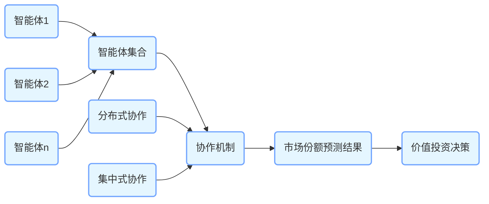

# 智能体协作增强价值投资的市场份额预测

> 关键词：智能体协作、价值投资、市场份额预测、机器学习、数据驱动决策

> 摘要：本文聚焦于利用智能体协作来增强价值投资中的市场份额预测。通过深入剖析智能体协作的原理与架构，详细阐述核心算法的原理及操作步骤，并结合数学模型进行精准分析。同时，给出实际的项目实战案例，包括开发环境搭建、源代码实现与解读。探讨了该技术在不同场景下的应用，推荐了相关的学习资源、开发工具和论文著作。最后总结了未来的发展趋势与挑战，并提供常见问题解答和扩展阅读参考。旨在为投资者和技术人员提供全面、深入的技术指导，以提高市场份额预测的准确性和价值投资的效益。

## 1. 背景介绍 
### 1.1 目的和范围
在金融市场中，准确预测市场份额对于价值投资至关重要。传统的预测方法往往难以充分考虑市场的复杂性和动态性。本研究的目的是引入智能体协作技术，通过多个智能体之间的交互和信息共享，提高市场份额预测的准确性和可靠性。范围涵盖了从智能体协作的基本概念到实际应用的各个方面，包括算法设计、数学建模、项目实战以及应用场景分析等。

### 1.2 预期读者
本文预期读者包括金融领域的投资者、分析师、量化交易员，以及计算机科学领域对人工智能应用于金融感兴趣的研究人员和开发者。无论是希望利用技术提升投资决策的金融从业者，还是探索人工智能在金融场景应用的技术人员，都能从本文中获得有价值的信息。

### 1.3 文档结构概述
本文将按照以下结构进行阐述：首先介绍智能体协作和市场份额预测的核心概念及其联系；接着详细讲解核心算法的原理和具体操作步骤，并给出Python源代码；然后介绍相关的数学模型和公式，并通过举例进行说明；之后进行项目实战，包括开发环境搭建、源代码实现和代码解读；再探讨该技术在实际中的应用场景；推荐相关的学习资源、开发工具和论文著作；最后总结未来发展趋势与挑战，提供常见问题解答和扩展阅读参考。

### 1.4 术语表
#### 1.4.1 核心术语定义
- **智能体（Agent）**：具有自主决策能力的实体，能够感知环境并根据自身的目标和规则进行行动。在本文中，智能体可以是基于机器学习算法的预测模型，能够独立处理数据并做出预测。
- **智能体协作（Agent Collaboration）**：多个智能体之间通过信息交换和协调行动，共同完成一个或多个任务的过程。在市场份额预测中，智能体协作可以帮助整合不同来源的信息，提高预测的准确性。
- **价值投资（Value Investing）**：一种投资策略，通过分析公司的基本面，如财务状况、盈利能力、市场竞争力等，寻找被低估的股票进行投资。市场份额预测是价值投资中的重要环节，有助于评估公司的未来发展潜力。
- **市场份额预测（Market Share Prediction）**：对企业在特定市场中所占份额的未来变化进行预测。准确的市场份额预测可以为投资者提供决策依据，帮助他们选择具有潜力的投资标的。

#### 1.4.2 相关概念解释
- **机器学习（Machine Learning）**：一门多领域交叉学科，涉及概率论、统计学、逼近论、凸分析、算法复杂度理论等多门学科。它专门研究计算机怎样模拟或实现人类的学习行为，以获取新的知识或技能，重新组织已有的知识结构使之不断改善自身的性能。在本文中，机器学习算法用于训练智能体，使其能够根据历史数据进行市场份额预测。
- **数据驱动决策（Data-Driven Decision Making）**：基于数据和分析来做出决策的过程。在价值投资中，通过收集和分析大量的市场数据、公司财务数据等，利用智能体协作进行市场份额预测，从而为投资决策提供支持。

#### 1.4.3 缩略词列表
- **AI**：Artificial Intelligence，人工智能
- **ML**：Machine Learning，机器学习
- **RL**：Reinforcement Learning，强化学习

## 2. 核心概念与联系 
### 核心概念原理
#### 智能体
智能体是一个具有自主性、反应性、社会性和能动性的实体。自主性意味着智能体能够独立地感知环境并做出决策；反应性表示智能体能够对环境的变化做出及时的响应；社会性体现了智能体可以与其他智能体进行交互和协作；能动性则表示智能体能够主动地采取行动以实现自身的目标。在市场份额预测中，每个智能体可以基于不同的数据源和算法进行预测，例如一个智能体可以基于公司的财务数据进行预测，另一个智能体可以基于市场趋势数据进行预测。

#### 智能体协作
智能体协作是通过多个智能体之间的信息共享和协调行动来提高整体性能的过程。在市场份额预测中，智能体协作可以采用多种方式，如分布式协作、集中式协作等。分布式协作中，每个智能体独立进行预测，然后通过交换预测结果和相关信息来调整自己的预测；集中式协作则是将所有智能体的信息集中到一个中心节点，由中心节点进行综合分析和决策。

#### 价值投资与市场份额预测
价值投资的核心是寻找被低估的资产，而市场份额是评估公司价值的重要指标之一。准确的市场份额预测可以帮助投资者判断公司的未来盈利能力和市场竞争力，从而做出更明智的投资决策。智能体协作可以通过整合多方面的信息，提高市场份额预测的准确性，为价值投资提供更可靠的依据。

### 架构的文本示意图
```plaintext
+-------------------+
| 智能体集合         |
|  - 智能体1         |
|  - 智能体2         |
|  -...             |
|  - 智能体n         |
+-------------------+
       |
       | 信息交互
       v
+-------------------+
| 协作机制           |
|  - 分布式协作      |
|  - 集中式协作      |
+-------------------+
       |
       | 综合预测
       v
+-------------------+
| 市场份额预测结果  |
+-------------------+
       |
       | 辅助决策
       v
+-------------------+
| 价值投资决策      |
+-------------------+
```

### Mermaid 流程图


## 3. 核心算法原理 & 具体操作步骤 
### 核心算法原理
本文采用基于机器学习的智能体协作算法来进行市场份额预测。每个智能体使用不同的机器学习模型进行训练，例如线性回归、决策树、神经网络等。智能体之间通过信息交换和协作机制来提高预测的准确性。具体来说，每个智能体首先根据自己的训练数据进行预测，然后将预测结果和相关信息发送给其他智能体。其他智能体接收到信息后，根据协作机制对自己的预测进行调整。

### Python源代码详细阐述
```python
import numpy as np
from sklearn.linear_model import LinearRegression
from sklearn.tree import DecisionTreeRegressor
from sklearn.neural_network import MLPRegressor

# 定义智能体类
class Agent:
    def __init__(self, model_type):
        if model_type == 'linear':
            self.model = LinearRegression()
        elif model_type == 'tree':
            self.model = DecisionTreeRegressor()
        elif model_type == 'neural':
            self.model = MLPRegressor()
        else:
            raise ValueError("Invalid model type")

    def train(self, X, y):
        self.model.fit(X, y)

    def predict(self, X):
        return self.model.predict(X)

# 定义协作机制类
class CollaborationMechanism:
    def __init__(self, agents):
        self.agents = agents

    def collaborative_prediction(self, X):
        predictions = []
        for agent in self.agents:
            pred = agent.predict(X)
            predictions.append(pred)
        # 简单平均协作机制
        final_prediction = np.mean(predictions, axis=0)
        return final_prediction

# 示例数据
X_train = np.array([[1], [2], [3], [4], [5]])
y_train = np.array([2, 4, 6, 8, 10])
X_test = np.array([[6], [7]])

# 创建智能体
agent1 = Agent('linear')
agent2 = Agent('tree')
agent3 = Agent('neural')

# 训练智能体
agent1.train(X_train, y_train)
agent2.train(X_train, y_train)
agent3.train(X_train, y_train)

# 创建协作机制
agents = [agent1, agent2, agent3]
collaboration = CollaborationMechanism(agents)

# 进行协作预测
final_prediction = collaboration.collaborative_prediction(X_test)
print("协作预测结果:", final_prediction)
```

### 具体操作步骤
1. **数据准备**：收集与市场份额相关的数据，如公司的财务数据、市场趋势数据等，并进行预处理，包括数据清洗、特征提取和归一化等。
2. **智能体创建**：根据不同的机器学习模型创建多个智能体，每个智能体使用不同的模型进行训练。
3. **智能体训练**：使用准备好的训练数据对每个智能体进行训练，使其能够学习数据中的模式和规律。
4. **协作机制建立**：选择合适的协作机制，如简单平均、加权平均等，用于整合不同智能体的预测结果。
5. **预测**：使用训练好的智能体和协作机制对测试数据进行预测，得到最终的市场份额预测结果。

## 4. 数学模型和公式 & 详细讲解 & 举例说明 
### 数学模型
假设我们有 $n$ 个智能体，第 $i$ 个智能体的预测结果为 $\hat{y}_i$，最终的协作预测结果为 $\hat{y}$。

#### 简单平均协作机制
简单平均协作机制是将所有智能体的预测结果进行平均，公式如下：
$$\hat{y} = \frac{1}{n} \sum_{i=1}^{n} \hat{y}_i$$

#### 加权平均协作机制
加权平均协作机制是为每个智能体分配一个权重 $w_i$，然后根据权重对预测结果进行加权平均，公式如下：
$$\hat{y} = \sum_{i=1}^{n} w_i \hat{y}_i$$
其中，$\sum_{i=1}^{n} w_i = 1$，$w_i \geq 0$。

### 详细讲解
简单平均协作机制的优点是简单易懂，计算方便，适用于各个智能体性能相近的情况。加权平均协作机制则可以根据每个智能体的性能和可靠性分配不同的权重，从而提高预测的准确性。权重的确定可以通过多种方法，如交叉验证、历史性能评估等。

### 举例说明
假设我们有三个智能体，它们的预测结果分别为 $\hat{y}_1 = 10$，$\hat{y}_2 = 12$，$\hat{y}_3 = 14$。

#### 简单平均协作机制
使用简单平均协作机制，最终的预测结果为：
$$\hat{y} = \frac{1}{3} \times (10 + 12 + 14) = 12$$

#### 加权平均协作机制
假设我们根据历史性能评估为三个智能体分配的权重分别为 $w_1 = 0.2$，$w_2 = 0.3$，$w_3 = 0.5$。则最终的预测结果为：
$$\hat{y} = 0.2 \times 10 + 0.3 \times 12 + 0.5 \times 14 = 12.6$$

## 5. 项目实战：代码实际案例和详细解释说明 
### 5.1 开发环境搭建
#### 操作系统
可以选择Windows、Linux或Mac OS等主流操作系统。建议使用Linux系统，因为它在开发和部署方面具有更好的稳定性和兼容性。

#### Python环境
安装Python 3.6及以上版本。可以使用Anaconda来管理Python环境，它提供了丰富的科学计算库和工具。

#### 依赖库安装
在命令行中使用以下命令安装所需的依赖库：
```sh
pip install numpy scikit-learn
```

### 5.2 源代码详细实现和代码解读
```python
import numpy as np
from sklearn.linear_model import LinearRegression
from sklearn.tree import DecisionTreeRegressor
from sklearn.neural_network import MLPRegressor

# 定义智能体类
class Agent:
    def __init__(self, model_type):
        # 根据模型类型初始化智能体的机器学习模型
        if model_type == 'linear':
            self.model = LinearRegression()
        elif model_type == 'tree':
            self.model = DecisionTreeRegressor()
        elif model_type == 'neural':
            self.model = MLPRegressor()
        else:
            raise ValueError("Invalid model type")

    def train(self, X, y):
        # 使用训练数据对模型进行训练
        self.model.fit(X, y)

    def predict(self, X):
        # 使用训练好的模型进行预测
        return self.model.predict(X)

# 定义协作机制类
class CollaborationMechanism:
    def __init__(self, agents):
        # 初始化协作机制，传入智能体列表
        self.agents = agents

    def collaborative_prediction(self, X):
        predictions = []
        for agent in self.agents:
            # 每个智能体进行预测
            pred = agent.predict(X)
            predictions.append(pred)
        # 简单平均协作机制，计算最终预测结果
        final_prediction = np.mean(predictions, axis=0)
        return final_prediction

# 示例数据
X_train = np.array([[1], [2], [3], [4], [5]])
y_train = np.array([2, 4, 6, 8, 10])
X_test = np.array([[6], [7]])

# 创建智能体
agent1 = Agent('linear')
agent2 = Agent('tree')
agent3 = Agent('neural')

# 训练智能体
agent1.train(X_train, y_train)
agent2.train(X_train, y_train)
agent3.train(X_train, y_train)

# 创建协作机制
agents = [agent1, agent2, agent3]
collaboration = CollaborationMechanism(agents)

# 进行协作预测
final_prediction = collaboration.collaborative_prediction(X_test)
print("协作预测结果:", final_prediction)
```

### 5.3 代码解读与分析
- **智能体类（Agent）**：封装了不同的机器学习模型，包括线性回归、决策树和神经网络。通过`train`方法对模型进行训练，通过`predict`方法进行预测。
- **协作机制类（CollaborationMechanism）**：负责管理智能体之间的协作。`collaborative_prediction`方法实现了简单平均协作机制，将所有智能体的预测结果进行平均得到最终的预测结果。
- **数据准备**：定义了示例的训练数据`X_train`和`y_train`，以及测试数据`X_test`。
- **智能体创建与训练**：创建了三个不同类型的智能体，并使用训练数据对它们进行训练。
- **协作预测**：将训练好的智能体传入协作机制类，调用`collaborative_prediction`方法进行协作预测，并输出最终的预测结果。

## 6. 实际应用场景 
### 股票投资
在股票投资中，投资者可以使用智能体协作技术来预测不同公司的市场份额，从而选择具有潜力的股票进行投资。例如，通过分析公司的财务报表、行业竞争情况、市场趋势等数据，使用多个智能体进行预测，然后通过协作机制得到更准确的市场份额预测结果，为投资决策提供支持。

### 基金投资
基金经理可以利用智能体协作技术来评估不同基金的投资价值。通过预测基金所投资的行业和公司的市场份额，了解基金的潜在收益和风险。例如，对于一只行业基金，通过分析该行业内各个公司的市场份额变化，预测基金的未来表现，从而调整投资组合。

### 风险评估
金融机构可以使用智能体协作技术来进行风险评估。通过预测市场份额的变化，评估企业的信用风险和市场风险。例如，对于一家贷款企业，通过分析其所在行业的市场份额趋势和企业自身的市场份额变化，评估其还款能力和违约风险，为贷款决策提供依据。

## 7. 工具和资源推荐
### 7.1 学习资源推荐
#### 7.1.1 书籍推荐
- 《机器学习》（周志华）：全面介绍了机器学习的基本概念、算法和应用，是机器学习领域的经典教材。
- 《Python机器学习》（Sebastian Raschka）：结合Python语言，详细介绍了机器学习的算法实现和应用，适合初学者。
- 《人工智能：一种现代的方法》（Stuart Russell、Peter Norvig）：涵盖了人工智能的各个方面，包括智能体、机器学习、自然语言处理等，是人工智能领域的权威著作。

#### 7.1.2 在线课程
- Coursera上的“机器学习”课程（Andrew Ng）：由斯坦福大学教授Andrew Ng授课，是机器学习领域最受欢迎的在线课程之一。
- edX上的“人工智能基础”课程：介绍了人工智能的基本概念和技术，包括智能体、搜索算法、机器学习等。
- 网易云课堂上的“Python数据分析与机器学习实战”课程：结合实际案例，介绍了Python在数据分析和机器学习中的应用。

#### 7.1.3 技术博客和网站
- Medium：有许多关于人工智能、机器学习和金融科技的技术博客，提供了最新的研究成果和实践经验。
- Kaggle：一个数据科学竞赛平台，提供了丰富的数据集和代码示例，可以学习到其他数据科学家的优秀经验。
- Towards Data Science：专注于数据科学和机器学习领域的技术博客，提供了许多高质量的文章和教程。

### 7.2 开发工具框架推荐
#### 7.2.1 IDE和编辑器
- PyCharm：一款专业的Python集成开发环境，提供了丰富的代码编辑、调试和版本控制功能。
- Jupyter Notebook：一个交互式的开发环境，适合进行数据分析和模型实验，可以实时查看代码的运行结果。
- Visual Studio Code：一款轻量级的代码编辑器，支持多种编程语言，通过安装Python扩展可以进行Python开发。

#### 7.2.2 调试和性能分析工具
- PDB：Python自带的调试工具，可以在代码中设置断点，逐步执行代码，查看变量的值。
- cProfile：Python的性能分析工具，可以分析代码的运行时间和函数调用情况，找出性能瓶颈。
- TensorBoard：用于可视化深度学习模型的训练过程和性能指标，帮助开发者优化模型。

#### 7.2.3 相关框架和库
- Scikit-learn：一个简单易用的机器学习库，提供了丰富的机器学习算法和工具，如分类、回归、聚类等。
- TensorFlow：一个开源的深度学习框架，广泛应用于图像识别、自然语言处理等领域。
- PyTorch：另一个流行的深度学习框架，具有动态图机制，易于使用和调试。

### 7.3 相关论文著作推荐
#### 7.3.1 经典论文
- “A Markov Decision Process Approach to Portfolio Selection”（Richard Bellman）：介绍了使用马尔可夫决策过程进行投资组合选择的方法，是金融领域的经典论文之一。
- “Machine Learning in Finance: The Case of Credit Scoring”（Luca Malaguti、Paolo Toth）：探讨了机器学习在信用评分中的应用，为金融风险评估提供了理论基础。
- “Intelligent Agents: Theory and Practice”（Michael Wooldridge、Nicholas R. Jennings）：详细介绍了智能体的理论和实践，是智能体领域的重要文献。

#### 7.3.2 最新研究成果
- 在ACM SIGKDD、NeurIPS、ICML等顶级学术会议上，有许多关于人工智能在金融领域应用的最新研究成果。例如，一些研究提出了基于强化学习的智能投资策略，通过智能体与市场环境的交互来优化投资决策。
- 在《Journal of Financial Economics》、《Review of Financial Studies》等金融领域的顶级期刊上，也有一些关于市场份额预测和价值投资的最新研究。

#### 7.3.3 应用案例分析
- 《金融科技前沿：案例与实践》：介绍了金融科技在各个领域的应用案例，包括智能投资、风险评估等，为实际应用提供了参考。
- 一些金融机构的研究报告和白皮书，如摩根大通、高盛等，会分享他们在人工智能和机器学习方面的应用经验和案例。

## 8. 总结：未来发展趋势与挑战
### 未来发展趋势
- **多智能体系统的深化应用**：未来，智能体协作技术将不仅仅局限于简单的信息交换和平均预测，而是会发展为更加复杂的多智能体系统。智能体之间将能够进行更高级的交互和协作，如合作博弈、协商决策等，以提高市场份额预测的准确性和价值投资的效益。
- **与其他技术的融合**：智能体协作技术将与区块链、物联网等技术进行深度融合。例如，利用区块链的分布式账本技术实现智能体之间的可信信息共享，利用物联网设备收集更多的市场数据，为市场份额预测提供更丰富的信息源。
- **自动化投资决策**：随着智能体协作技术的不断发展，未来将实现更加自动化的投资决策。智能体可以根据市场份额预测结果自动调整投资组合，实现实时的投资决策，提高投资效率和收益。

### 挑战
- **数据质量和隐私问题**：准确的市场份额预测需要大量高质量的数据，但数据的收集、清洗和标注是一个具有挑战性的任务。同时，金融数据涉及到用户的隐私和商业机密，如何在保证数据质量的前提下保护数据的隐私和安全是一个亟待解决的问题。
- **智能体的可靠性和可解释性**：智能体通常基于复杂的机器学习模型，其决策过程往往难以解释。在金融领域，投资者需要了解投资决策的依据，因此如何提高智能体的可靠性和可解释性是一个重要的挑战。
- **市场的不确定性和复杂性**：金融市场具有高度的不确定性和复杂性，市场份额的变化受到多种因素的影响，如宏观经济环境、政策法规、突发事件等。如何让智能体能够适应市场的变化，准确预测市场份额是一个长期的挑战。

## 9. 附录：常见问题与解答
### 问题1：智能体协作技术一定能提高市场份额预测的准确性吗？
答：智能体协作技术通过整合多个智能体的信息和知识，在大多数情况下可以提高市场份额预测的准确性。但这并不是绝对的，其效果取决于多个因素，如智能体的质量、协作机制的合理性、数据的质量等。如果智能体的性能较差或协作机制不合理，可能无法提高预测的准确性，甚至会降低预测的效果。

### 问题2：如何选择合适的协作机制？
答：选择合适的协作机制需要考虑多个因素，如智能体的性能、数据的特点、预测的目标等。简单平均协作机制适用于各个智能体性能相近的情况，计算方便；加权平均协作机制可以根据智能体的性能和可靠性分配不同的权重，提高预测的准确性。此外，还可以根据具体情况设计更复杂的协作机制，如基于博弈论的协作机制。

### 问题3：智能体协作技术在实际应用中面临哪些困难？
答：智能体协作技术在实际应用中面临以下困难：一是数据质量和隐私问题，需要保证数据的准确性和安全性；二是智能体的可靠性和可解释性问题，需要让投资者理解智能体的决策过程；三是市场的不确定性和复杂性问题，需要让智能体能够适应市场的变化。

## 10. 扩展阅读 & 参考资料
- 《金融时间序列分析》（Ruey S. Tsay）
- 《深度学习》（Ian Goodfellow、Yoshua Bengio、Aaron Courville）
- “Deep Reinforcement Learning for Automated Stock Trading: An Ensemble Strategy”（Bao Wei、Zhengyao Jiang、Jun Zhao）
- Kaggle网站上关于金融市场预测的相关竞赛和代码示例

作者：AI天才研究院/AI Genius Institute & 禅与计算机程序设计艺术 /Zen And The Art of Computer Programming