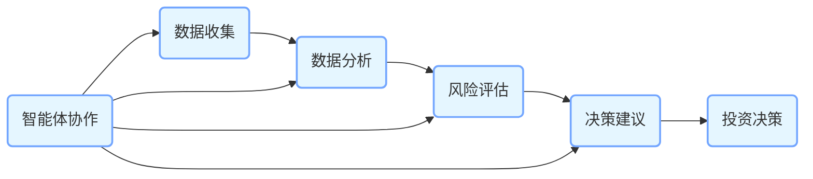

# 智能体协作提升价值投资的技术颠覆风险评估

> 关键词：智能体协作、价值投资、技术颠覆风险评估、机器学习、金融科技

> 摘要：本文聚焦于智能体协作在价值投资的技术颠覆风险评估中的应用。首先介绍了研究的背景、目的、预期读者和文档结构等内容。接着阐述了核心概念与联系，包括智能体、价值投资和技术颠覆风险评估的原理及架构。详细讲解了核心算法原理和具体操作步骤，结合 Python 代码进行说明。同时给出了相关的数学模型和公式，并举例说明。通过项目实战展示了如何搭建开发环境、实现源代码及进行代码解读。分析了实际应用场景，推荐了学习资源、开发工具框架和相关论文著作。最后总结了未来发展趋势与挑战，解答了常见问题并提供了扩展阅读和参考资料，旨在为价值投资领域的技术颠覆风险评估提供全面且深入的技术指导。

## 1. 背景介绍 
### 1.1 目的和范围
在当今快速发展的科技时代，技术颠覆对价值投资产生了深远的影响。传统的风险评估方法往往难以应对复杂多变的技术环境，因此需要引入新的技术手段来提升风险评估的准确性和有效性。本研究的目的在于探讨智能体协作在价值投资的技术颠覆风险评估中的应用，通过智能体之间的协作和交互，实现对技术颠覆风险的更精准评估。研究范围涵盖了智能体的基本原理、价值投资的核心概念、技术颠覆风险的评估方法，以及如何将智能体协作应用于实际的风险评估过程中。

### 1.2 预期读者
本文的预期读者包括金融投资领域的专业人士，如基金经理、投资分析师等，他们希望通过引入智能体协作技术来提升价值投资的风险评估能力；计算机科学和人工智能领域的研究人员和开发者，对智能体技术在金融领域的应用感兴趣；以及对金融科技和价值投资有一定了解的爱好者，希望深入学习智能体协作在风险评估中的具体应用。

### 1.3 文档结构概述
本文将按照以下结构进行组织：首先介绍研究的背景信息，包括目的、预期读者和文档结构等内容；接着阐述核心概念与联系，包括智能体、价值投资和技术颠覆风险评估的原理及架构；详细讲解核心算法原理和具体操作步骤，结合 Python 代码进行说明；同时给出相关的数学模型和公式，并举例说明；通过项目实战展示如何搭建开发环境、实现源代码及进行代码解读；分析实际应用场景，推荐学习资源、开发工具框架和相关论文著作；最后总结未来发展趋势与挑战，解答常见问题并提供扩展阅读和参考资料。

### 1.4 术语表
#### 1.4.1 核心术语定义
- **智能体（Agent）**：是一种能够感知环境、自主决策并采取行动以实现特定目标的实体。在本研究中，智能体可以是软件程序，通过收集和分析数据，为价值投资的技术颠覆风险评估提供决策支持。
- **价值投资（Value Investing）**：是一种投资策略，投资者通过分析公司的基本面，寻找被低估的股票进行投资，期望在长期内获得超过市场平均水平的回报。
- **技术颠覆风险（Technological Disruption Risk）**：指由于新技术的出现和发展，导致现有企业的商业模式、产品或服务受到严重冲击，从而使投资者面临损失的风险。
- **智能体协作（Agent Collaboration）**：多个智能体之间通过信息共享、协调行动等方式，共同完成特定任务的过程。在价值投资的技术颠覆风险评估中，智能体协作可以提高评估的准确性和效率。

#### 1.4.2 相关概念解释
- **机器学习（Machine Learning）**：是一门多领域交叉学科，涉及概率论、统计学、逼近论、凸分析、算法复杂度理论等多门学科。它专门研究计算机怎样模拟或实现人类的学习行为，以获取新的知识或技能，重新组织已有的知识结构使之不断改善自身的性能。在本研究中，机器学习算法可用于智能体的数据处理和分析。
- **数据挖掘（Data Mining）**：是指从大量的数据中通过算法搜索隐藏于其中信息的过程。数据挖掘通常与计算机科学有关，并通过统计、在线分析处理、情报检索、机器学习、专家系统（依靠过去的经验法则）和模式识别等诸多方法来实现上述目标。在价值投资的技术颠覆风险评估中，数据挖掘可用于发现潜在的风险因素。

#### 1.4.3 缩略词列表
- **AI**：Artificial Intelligence，人工智能
- **ML**：Machine Learning，机器学习
- **DL**：Deep Learning，深度学习
- **NLP**：Natural Language Processing，自然语言处理

## 2. 核心概念与联系 
### 核心概念原理
#### 智能体原理
智能体是一种具有自主性、反应性、社会性和主动性的实体。自主性是指智能体能够在没有外界干预的情况下，独立地完成任务；反应性是指智能体能够感知环境的变化，并及时做出响应；社会性是指智能体能够与其他智能体进行交互和协作；主动性是指智能体能够主动地寻找机会，实现自己的目标。在价值投资的技术颠覆风险评估中，智能体可以通过收集和分析市场数据、行业信息等，感知技术颠覆的风险，并根据预设的规则或学习到的模型做出决策。

#### 价值投资原理
价值投资的核心思想是寻找被市场低估的股票，即股票的内在价值高于其市场价格。投资者通过分析公司的财务报表、行业竞争力、管理团队等基本面因素，评估公司的内在价值。当发现股票的内在价值被低估时，投资者会买入该股票，等待市场价格回归其内在价值，从而获得投资回报。

#### 技术颠覆风险评估原理
技术颠覆风险评估是通过对新技术的发展趋势、市场需求、竞争格局等因素进行分析，评估现有企业面临技术颠覆的可能性和影响程度。评估过程中需要考虑多个方面的因素，如技术的创新性、替代性、扩散速度等。通过建立风险评估模型，对技术颠覆风险进行量化分析，为投资者提供决策依据。

### 架构的文本示意图
```plaintext
价值投资的技术颠覆风险评估系统架构

|-- 数据层
|   |-- 市场数据（股票价格、交易量等）
|   |-- 行业信息（行业报告、技术趋势等）
|   |-- 企业数据（财务报表、专利信息等）
|
|-- 智能体层
|   |-- 数据收集智能体
|   |-- 数据分析智能体
|   |-- 风险评估智能体
|   |-- 决策建议智能体
|
|-- 协作层
|   |-- 智能体之间的信息共享
|   |-- 智能体之间的协调行动
|
|-- 应用层
|   |-- 投资决策支持
|   |-- 风险预警
```

### Mermaid 流程图


该流程图展示了智能体协作在价值投资的技术颠覆风险评估中的工作流程。首先，数据收集智能体负责收集市场数据、行业信息和企业数据等；然后，数据分析智能体对收集到的数据进行分析和处理；接着，风险评估智能体根据分析结果对技术颠覆风险进行评估；最后，决策建议智能体根据风险评估结果提供投资决策建议。整个过程中，智能体之间通过协作层进行信息共享和协调行动，以提高评估的准确性和效率。

## 3. 核心算法原理 & 具体操作步骤 
### 核心算法原理
在价值投资的技术颠覆风险评估中，我们可以使用多种机器学习算法，如决策树、随机森林、支持向量机等。这里以随机森林算法为例进行详细讲解。

随机森林是一种集成学习算法，它由多个决策树组成。每个决策树都是在不同的样本子集和特征子集上训练得到的，然后通过投票或平均的方式综合各个决策树的结果，得到最终的预测结果。随机森林算法具有较高的准确性和鲁棒性，能够处理高维数据和复杂的非线性关系。

### Python 源代码详细阐述
```python
import pandas as pd
from sklearn.ensemble import RandomForestClassifier
from sklearn.model_selection import train_test_split
from sklearn.metrics import accuracy_score

# 读取数据
data = pd.read_csv('investment_data.csv')

# 分离特征和标签
X = data.drop('risk_label', axis=1)
y = data['risk_label']

# 划分训练集和测试集
X_train, X_test, y_train, y_test = train_test_split(X, y, test_size=0.2, random_state=42)

# 创建随机森林分类器
rf = RandomForestClassifier(n_estimators=100, random_state=42)

# 训练模型
rf.fit(X_train, y_train)

# 预测测试集
y_pred = rf.predict(X_test)

# 计算准确率
accuracy = accuracy_score(y_test, y_pred)
print(f"模型准确率: {accuracy}")
```

### 具体操作步骤
1. **数据收集和预处理**：收集市场数据、行业信息和企业数据等，并进行清洗、转换和归一化等预处理操作，以提高数据的质量和可用性。
2. **特征选择**：从收集到的数据中选择与技术颠覆风险相关的特征，如技术创新指标、市场份额、财务指标等。
3. **模型训练**：使用随机森林算法对训练数据进行训练，得到风险评估模型。
4. **模型评估**：使用测试数据对训练好的模型进行评估，计算模型的准确率、召回率、F1 值等指标，评估模型的性能。
5. **决策建议**：根据风险评估模型的预测结果，为投资者提供投资决策建议，如买入、卖出或持有等。

## 4. 数学模型和公式 & 详细讲解 & 举例说明 
### 随机森林算法的数学模型
随机森林算法的核心是决策树。决策树是一种基于树结构进行决策的模型，每个内部节点表示一个特征上的测试，每个分支表示一个测试输出，每个叶节点表示一个类别或值。

设训练数据集为 $D = \{(x_1, y_1), (x_2, y_2), \cdots, (x_n, y_n)\}$，其中 $x_i$ 是第 $i$ 个样本的特征向量，$y_i$ 是第 $i$ 个样本的标签。随机森林算法的步骤如下：
1. **随机采样**：从训练数据集中有放回地随机采样 $n$ 个样本，得到一个新的训练子集 $D_j$。
2. **特征选择**：从所有特征中随机选择 $k$ 个特征，作为决策树的候选特征。
3. **构建决策树**：使用训练子集 $D_j$ 和候选特征，构建一棵决策树 $T_j$。
4. **重复步骤 1 - 3**：重复 $m$ 次，得到 $m$ 棵决策树 $T_1, T_2, \cdots, T_m$。
5. **综合决策**：对于一个新的样本 $x$，让每棵决策树 $T_j$ 对其进行预测，得到预测结果 $y_{j}$，然后通过投票或平均的方式综合各个决策树的结果，得到最终的预测结果 $y$。

### 公式讲解
#### 基尼不纯度（Gini Impurity）
基尼不纯度是决策树中常用的一种划分准则，用于衡量数据集的纯度。设数据集 $D$ 中包含 $K$ 个类别，第 $k$ 个类别的样本数为 $n_k$，则数据集 $D$ 的基尼不纯度为：
$$
Gini(D) = 1 - \sum_{k=1}^{K} p_k^2
$$
其中 $p_k = \frac{n_k}{n}$ 是第 $k$ 个类别的样本在数据集中所占的比例。

#### 信息增益（Information Gain）
信息增益是另一种常用的划分准则，用于衡量划分前后数据集的纯度变化。设数据集 $D$ 在特征 $A$ 上进行划分，得到 $v$ 个子集 $D_1, D_2, \cdots, D_v$，则特征 $A$ 对数据集 $D$ 的信息增益为：
$$
IG(D, A) = Ent(D) - \sum_{v=1}^{V} \frac{|D_v|}{|D|} Ent(D_v)
$$
其中 $Ent(D)$ 是数据集 $D$ 的信息熵，定义为：
$$
Ent(D) = - \sum_{k=1}^{K} p_k \log_2 p_k
$$

### 举例说明
假设我们有一个包含 10 个样本的数据集，其中 5 个样本属于类别 0，5 个样本属于类别 1。则数据集的基尼不纯度为：
$$
Gini(D) = 1 - (\frac{5}{10})^2 - (\frac{5}{10})^2 = 0.5
$$

假设我们使用一个特征将数据集划分为两个子集，子集 1 包含 3 个类别 0 的样本和 1 个类别 1 的样本，子集 2 包含 2 个类别 0 的样本和 4 个类别 1 的样本。则子集 1 的基尼不纯度为：
$$
Gini(D_1) = 1 - (\frac{3}{4})^2 - (\frac{1}{4})^2 = 0.375
$$
子集 2 的基尼不纯度为：
$$
Gini(D_2) = 1 - (\frac{2}{6})^2 - (\frac{4}{6})^2 = 0.444
$$
特征对数据集的基尼不纯度的降低值为：
$$
\Delta Gini = Gini(D) - \frac{4}{10} Gini(D_1) - \frac{6}{10} Gini(D_2) = 0.5 - \frac{4}{10} \times 0.375 - \frac{6}{10} \times 0.444 = 0.0784
$$

## 5. 项目实战：代码实际案例和详细解释说明 
### 5.1  开发环境搭建
#### 安装 Python
首先，需要安装 Python 环境。可以从 Python 官方网站（https://www.python.org/downloads/）下载适合自己操作系统的 Python 版本，并按照安装向导进行安装。

#### 安装必要的库
在命令行中使用以下命令安装必要的库：
```sh
pip install pandas scikit-learn
```
pandas 是一个用于数据处理和分析的库，scikit-learn 是一个用于机器学习的库，包含了各种机器学习算法和工具。

### 5.2  源代码详细实现和代码解读
```python
import pandas as pd
from sklearn.ensemble import RandomForestClassifier
from sklearn.model_selection import train_test_split
from sklearn.metrics import accuracy_score

# 读取数据
data = pd.read_csv('investment_data.csv')

# 代码解读：使用 pandas 的 read_csv 函数读取存储在 CSV 文件中的投资数据。
# 该函数将 CSV 文件中的数据读取为一个 DataFrame 对象，方便后续的数据处理和分析。

# 分离特征和标签
X = data.drop('risk_label', axis=1)
y = data['risk_label']

# 代码解读：将数据集中的特征和标签分离。
# X 是特征矩阵，包含了所有与技术颠覆风险相关的特征；
# y 是标签向量，包含了每个样本的风险标签。

# 划分训练集和测试集
X_train, X_test, y_train, y_test = train_test_split(X, y, test_size=0.2, random_state=42)

# 代码解读：使用 train_test_split 函数将数据集划分为训练集和测试集。
# test_size=0.2 表示将 20% 的数据作为测试集，80% 的数据作为训练集；
# random_state=42 是为了保证每次划分的结果相同，便于实验的复现。

# 创建随机森林分类器
rf = RandomForestClassifier(n_estimators=100, random_state=42)

# 代码解读：创建一个随机森林分类器对象。
# n_estimators=100 表示随机森林中包含 100 棵决策树；
# random_state=42 是为了保证每次训练的结果相同，便于实验的复现。

# 训练模型
rf.fit(X_train, y_train)

# 代码解读：使用训练集数据对随机森林分类器进行训练。
# fit 方法会根据训练集数据调整模型的参数，使得模型能够更好地拟合训练数据。

# 预测测试集
y_pred = rf.predict(X_test)

# 代码解读：使用训练好的随机森林分类器对测试集数据进行预测。
# predict 方法会根据测试集数据的特征，预测每个样本的风险标签。

# 计算准确率
accuracy = accuracy_score(y_test, y_pred)
print(f"模型准确率: {accuracy}")

# 代码解读：使用 accuracy_score 函数计算模型的准确率。
# 准确率是指模型预测正确的样本数占总样本数的比例。
# 最后将准确率打印输出，方便评估模型的性能。
```

### 5.3  代码解读与分析
通过上述代码，我们实现了一个基于随机森林算法的价值投资的技术颠覆风险评估模型。代码的主要步骤包括数据读取、数据预处理、模型训练、模型预测和模型评估。

在数据读取阶段，我们使用 pandas 库读取存储在 CSV 文件中的投资数据。在数据预处理阶段，我们将数据集中的特征和标签分离，并将数据集划分为训练集和测试集。在模型训练阶段，我们创建一个随机森林分类器对象，并使用训练集数据对其进行训练。在模型预测阶段，我们使用训练好的随机森林分类器对测试集数据进行预测。在模型评估阶段，我们使用准确率指标评估模型的性能。

需要注意的是，上述代码中的 `investment_data.csv` 文件需要根据实际情况进行替换，确保文件中包含了与技术颠覆风险相关的特征和风险标签。同时，为了提高模型的性能，可以对数据进行进一步的预处理，如特征选择、特征工程等，也可以尝试使用其他机器学习算法进行对比实验。

## 6. 实际应用场景 
### 投资决策支持
智能体协作在价值投资的技术颠覆风险评估中的一个重要应用场景是为投资决策提供支持。投资者可以利用智能体协作系统对不同行业和企业的技术颠覆风险进行评估，根据评估结果调整投资组合。例如，如果评估结果显示某个行业面临较高的技术颠覆风险，投资者可以减少对该行业的投资；如果某个企业具有较强的技术创新能力和应对技术颠覆的能力，投资者可以增加对该企业的投资。

### 风险预警
智能体协作系统可以实时监测市场动态和技术发展趋势，及时发现潜在的技术颠覆风险，并向投资者发出预警。例如，当某个新兴技术出现并可能对现有行业产生重大影响时，智能体协作系统可以通过分析相关数据，评估该技术对不同企业的影响程度，并向投资者发出相应的风险预警，帮助投资者及时采取措施，降低投资风险。

### 企业战略规划
对于企业来说，智能体协作系统可以帮助企业评估自身面临的技术颠覆风险，制定相应的战略规划。企业可以利用智能体协作系统分析行业技术发展趋势、竞争对手的技术创新情况等，了解自身在技术创新方面的优势和劣势，从而制定出更加科学合理的技术创新战略和市场竞争战略。

### 监管机构监管
监管机构可以利用智能体协作系统对金融市场进行监管，及时发现和防范技术颠覆风险对金融稳定的影响。例如，监管机构可以通过智能体协作系统监测金融机构的投资组合，评估其面临的技术颠覆风险，要求金融机构采取相应的风险管理措施，确保金融市场的稳定运行。

## 7. 工具和资源推荐
### 7.1 学习资源推荐
#### 7.1.1 书籍推荐
- 《机器学习》（周志华）：这本书是机器学习领域的经典教材，全面介绍了机器学习的基本概念、算法和应用。书中涵盖了决策树、随机森林、支持向量机等多种机器学习算法的原理和实现，对于深入理解智能体协作中使用的机器学习算法非常有帮助。
- 《Python 数据分析实战》（魏贞原）：本书详细介绍了使用 Python 进行数据分析的方法和技巧，包括数据收集、数据清洗、数据可视化等内容。对于处理价值投资的技术颠覆风险评估中的数据非常有帮助。
- 《人工智能：现代方法》（Stuart Russell、Peter Norvig）：这本书是人工智能领域的权威著作，全面介绍了人工智能的基本概念、算法和应用。书中涵盖了智能体的基本原理、多智能体系统等内容，对于理解智能体协作的原理和应用非常有帮助。

#### 7.1.2 在线课程
- Coursera 上的《机器学习》课程（Andrew Ng 教授）：这是一门非常经典的机器学习在线课程，课程内容涵盖了机器学习的基本概念、算法和应用。通过学习这门课程，可以系统地掌握机器学习的知识和技能，为智能体协作在价值投资的技术颠覆风险评估中的应用打下坚实的基础。
- edX 上的《人工智能基础》课程：该课程介绍了人工智能的基本概念、算法和应用，包括智能体、搜索算法、机器学习等内容。通过学习这门课程，可以深入了解人工智能的原理和方法，为智能体协作的研究和应用提供理论支持。
- 中国大学 MOOC 上的《Python 语言程序设计》课程：这是一门面向初学者的 Python 编程课程，课程内容涵盖了 Python 的基本语法、数据结构、函数等内容。通过学习这门课程，可以快速掌握 Python 编程的基础知识，为后续的项目实践提供编程能力支持。

#### 7.1.3 技术博客和网站
- Medium：这是一个技术博客平台，上面有很多关于人工智能、机器学习、金融科技等领域的文章。可以关注一些知名的博主和专栏，了解最新的技术动态和研究成果。
- GitHub：这是一个开源代码托管平台，上面有很多关于智能体协作、机器学习、数据分析等领域的开源项目。可以通过学习这些开源项目的代码，了解最新的技术实现和应用案例。
- Kaggle：这是一个数据科学竞赛平台，上面有很多关于数据分析、机器学习等领域的竞赛和数据集。可以通过参加这些竞赛，提高自己的数据分析和机器学习能力。

### 7.2 开发工具框架推荐
#### 7.2.1 IDE和编辑器
- PyCharm：这是一款专门为 Python 开发设计的集成开发环境（IDE），具有代码编辑、调试、版本控制等功能。PyCharm 提供了丰富的插件和工具，可以提高开发效率。
- Jupyter Notebook：这是一个基于 Web 的交互式计算环境，支持多种编程语言，如 Python、R 等。Jupyter Notebook 可以将代码、文本、图表等内容集成在一起，方便进行数据分析和实验。
- Visual Studio Code：这是一款轻量级的代码编辑器，支持多种编程语言和插件。Visual Studio Code 具有丰富的代码编辑和调试功能，适合快速开发和调试 Python 代码。

#### 7.2.2 调试和性能分析工具
- PDB：这是 Python 自带的调试工具，可以在代码中设置断点，逐步执行代码，查看变量的值和程序的执行流程。PDB 可以帮助开发者快速定位和解决代码中的问题。
- cProfile：这是 Python 自带的性能分析工具，可以统计程序中各个函数的执行时间和调用次数，帮助开发者找出程序中的性能瓶颈。
- TensorBoard：这是 TensorFlow 提供的可视化工具，可以可视化模型的训练过程、损失函数的变化、模型的结构等信息。TensorBoard 可以帮助开发者更好地理解和优化模型。

#### 7.2.3 相关框架和库
- Scikit-learn：这是一个用于机器学习的 Python 库，提供了各种机器学习算法和工具，如分类、回归、聚类等。Scikit-learn 具有简单易用、文档丰富等特点，适合初学者和快速开发。
- TensorFlow：这是一个开源的机器学习框架，由 Google 开发。TensorFlow 支持深度学习、机器学习等多种算法，提供了丰富的工具和接口，适合大规模的机器学习和深度学习项目。
- PyTorch：这是一个开源的深度学习框架，由 Facebook 开发。PyTorch 具有动态图、易于调试等特点，适合研究人员和开发者进行深度学习算法的研究和开发。

### 7.3 相关论文著作推荐
#### 7.3.1 经典论文
- “Random Forests”（Leo Breiman）：这是随机森林算法的经典论文，详细介绍了随机森林算法的原理和实现。通过阅读这篇论文，可以深入了解随机森林算法的工作机制和性能特点。
- “A Framework for Cooperative Problem Solving Among Intelligent Agents”（Michael N. Huhns）：这篇论文提出了一个智能体协作的框架，为智能体协作的研究和应用提供了理论基础。
- “Value Investing: The Use of Historical Financial Statement Information to Separate Winners from Losers”（Joseph D. Piotroski）：这篇论文研究了价值投资策略，通过分析历史财务报表信息，提出了一种区分赢家和输家的方法。

#### 7.3.2 最新研究成果
- 可以关注顶级学术会议和期刊上的最新研究成果，如 AAAI（Association for the Advancement of Artificial Intelligence）、IJCAI（International Joint Conference on Artificial Intelligence）、Journal of Financial Economics 等。这些会议和期刊上发表的论文通常代表了该领域的最新研究动态和前沿技术。

#### 7.3.3 应用案例分析
- 可以关注一些金融科技公司和投资机构的研究报告和案例分析，了解智能体协作在价值投资的技术颠覆风险评估中的实际应用案例。例如，一些对冲基金公司会发布关于其投资策略和风险管理的研究报告，可以从中学习到实际应用中的经验和方法。

## 8. 总结：未来发展趋势与挑战
### 未来发展趋势
#### 多智能体系统的发展
未来，多智能体系统将朝着更加复杂和智能的方向发展。智能体之间的协作将更加高效和灵活，能够处理更加复杂的任务和环境。例如，多个智能体可以组成一个智能体联盟，共同完成价值投资的技术颠覆风险评估任务，通过协作和分工，提高评估的准确性和效率。

#### 与其他技术的融合
智能体协作将与其他技术，如区块链、物联网、大数据等进行深度融合。例如，区块链技术可以为智能体之间的协作提供安全可靠的信任机制，物联网技术可以为智能体提供更多的实时数据，大数据技术可以为智能体的分析和决策提供更强大的支持。

#### 应用领域的拓展
智能体协作在价值投资的技术颠覆风险评估中的应用将不断拓展到其他领域，如保险、信贷、供应链金融等。例如，在保险领域，智能体协作可以帮助保险公司评估客户的风险，制定更加合理的保险费率；在信贷领域，智能体协作可以帮助银行评估借款人的信用风险，提高信贷决策的准确性。

### 挑战
#### 数据质量和隐私问题
智能体协作需要大量的数据支持，数据的质量和隐私问题是一个重要的挑战。如果数据存在噪声、缺失值等问题，会影响智能体的分析和决策结果。同时，数据的隐私问题也需要得到重视，确保数据的安全和合法使用。

#### 智能体的通信和协调问题
多个智能体之间的通信和协调是一个复杂的问题。智能体需要能够准确地理解和解释其他智能体的信息，避免信息误解和冲突。同时，智能体之间的协调机制也需要不断优化，以提高协作的效率和效果。

#### 模型的可解释性和可靠性问题
机器学习模型在智能体协作中起着重要的作用，但模型的可解释性和可靠性问题是一个挑战。投资者和监管机构需要了解模型的决策过程和依据，确保模型的决策结果是可靠和可解释的。

## 9. 附录：常见问题与解答
### 问题 1：智能体协作在价值投资的技术颠覆风险评估中的优势是什么？
解答：智能体协作可以提高风险评估的准确性和效率。多个智能体可以从不同的角度收集和分析数据，通过协作和信息共享，能够更全面地了解技术颠覆风险的情况。同时，智能体协作可以实现并行处理，加快风险评估的速度。

### 问题 2：如何选择合适的机器学习算法进行技术颠覆风险评估？
解答：选择合适的机器学习算法需要考虑多个因素，如数据的特点、问题的复杂度、模型的可解释性等。对于价值投资的技术颠覆风险评估，可以尝试使用决策树、随机森林、支持向量机等算法。可以通过实验和比较不同算法的性能，选择最适合的算法。

### 问题 3：如何保证智能体协作系统的安全性？
解答：保证智能体协作系统的安全性需要从多个方面入手。首先，需要使用安全可靠的通信协议，确保智能体之间的信息传输安全。其次，需要对智能体进行身份认证和授权管理，防止非法智能体的接入。此外，还需要对系统进行定期的安全审计和漏洞修复，及时发现和解决安全问题。

### 问题 4：智能体协作系统可以应用于其他金融领域吗？
解答：可以。智能体协作系统可以应用于其他金融领域，如保险、信贷、供应链金融等。在保险领域，智能体协作可以帮助保险公司评估客户的风险，制定更加合理的保险费率；在信贷领域，智能体协作可以帮助银行评估借款人的信用风险，提高信贷决策的准确性；在供应链金融领域，智能体协作可以帮助金融机构评估供应链上企业的风险，提供更加精准的金融服务。

## 10. 扩展阅读 & 参考资料
### 扩展阅读
- 《智能金融：从金融科技到智慧金融》：这本书介绍了智能金融的概念、技术和应用，对于了解智能体协作在金融领域的应用有很大的帮助。
- 《金融科技：重构未来金融生态》：本书探讨了金融科技的发展趋势和应用场景，包括智能投顾、风险管理等方面，为智能体协作在价值投资的技术颠覆风险评估中的应用提供了更广阔的视野。

### 参考资料
- Breiman, Leo. "Random forests." Machine learning 45.1 (2001): 5-32.
- Huhns, Michael N., and Munindar P. Singh. "A framework for cooperative problem solving among intelligent agents." IEEE Transactions on Systems, Man, and Cybernetics 20.5 (1990): 1048-1065.
- Piotroski, Joseph D. "Value investing: The use of historical financial statement information to separate winners from losers." Journal of Accounting Research 38.s1 (2000): 1-41.

作者：AI天才研究院/AI Genius Institute & 禅与计算机程序设计艺术 /Zen And The Art of Computer Programming