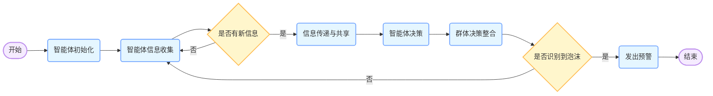

# 智能体群体智慧在识别市场泡沫中的应用：保护价值投资

> 关键词：智能体群体智慧、市场泡沫识别、价值投资、金融市场、人工智能

> 摘要：本文深入探讨了智能体群体智慧在识别市场泡沫中的应用，旨在为价值投资提供保护。首先介绍了相关背景知识，包括研究目的、预期读者和文档结构等。接着阐述了智能体群体智慧和市场泡沫的核心概念及其联系，详细讲解了核心算法原理与操作步骤，并给出了相应的数学模型和公式。通过项目实战展示了代码实现和案例分析，说明了该技术在实际应用中的效果。还推荐了学习资源、开发工具和相关论文著作。最后总结了未来发展趋势与挑战，并对常见问题进行了解答，为投资者和研究人员提供了全面而深入的参考。

## 1. 背景介绍 
### 1.1 目的和范围
金融市场中的泡沫现象一直是投资者面临的重大挑战。市场泡沫的形成往往伴随着资产价格的过度高估，当泡沫破裂时，会给投资者带来巨大的损失。价值投资强调寻找被低估的资产进行长期投资，但在市场泡沫环境下，准确识别泡沫变得至关重要。本研究的目的是探索智能体群体智慧在识别市场泡沫中的应用，通过利用多个智能体的信息和决策能力，提高泡沫识别的准确性，从而保护价值投资。

本研究的范围涵盖了金融市场的主要资产类别，如股票、债券、房地产等。同时，考虑了不同市场环境和经济周期下的泡沫特征，旨在建立具有广泛适用性的泡沫识别模型。

### 1.2 预期读者
本文的预期读者包括金融投资者、金融分析师、研究金融市场的学者以及对人工智能在金融领域应用感兴趣的技术人员。投资者可以通过本文了解如何利用智能体群体智慧来识别市场泡沫，保护自己的投资组合；金融分析师可以借鉴文中的方法和模型，提高对市场趋势的分析能力；学者可以在此基础上开展更深入的研究；技术人员可以从算法实现和代码案例中获取灵感，开发相关的金融科技产品。

### 1.3 文档结构概述
本文将按照以下结构进行组织：
1. 背景介绍：阐述研究的目的、范围、预期读者和文档结构，为后续内容奠定基础。
2. 核心概念与联系：介绍智能体群体智慧和市场泡沫的核心概念，分析它们之间的联系，并通过文本示意图和 Mermaid 流程图进行直观展示。
3. 核心算法原理 & 具体操作步骤：详细讲解用于识别市场泡沫的核心算法原理，并用 Python 源代码进行阐述，同时给出具体的操作步骤。
4. 数学模型和公式 & 详细讲解 & 举例说明：建立识别市场泡沫的数学模型，给出相关公式，并进行详细讲解和举例说明。
5. 项目实战：代码实际案例和详细解释说明：通过实际项目案例，展示如何使用智能体群体智慧识别市场泡沫，包括开发环境搭建、源代码实现和代码解读。
6. 实际应用场景：介绍智能体群体智慧在识别市场泡沫中的实际应用场景，如股票市场、债券市场等。
7. 工具和资源推荐：推荐学习资源、开发工具和相关论文著作，帮助读者进一步深入学习和研究。
8. 总结：未来发展趋势与挑战：总结智能体群体智慧在识别市场泡沫中的应用现状，分析未来发展趋势和面临的挑战。
9. 附录：常见问题与解答：对读者可能关心的常见问题进行解答。
10. 扩展阅读 & 参考资料：提供相关的扩展阅读材料和参考资料，方便读者进一步探索。

### 1.4 术语表
#### 1.4.1 核心术语定义
- **智能体群体智慧**：由多个智能体组成的群体，通过相互协作、信息共享和交互，表现出比单个智能体更强大的决策和问题解决能力。在金融市场中，智能体可以是基于算法的交易模型、投资者的决策系统等。
- **市场泡沫**：资产价格显著高于其内在价值的现象，通常是由于投资者的过度乐观、投机行为和市场心理因素导致的。市场泡沫的形成和破裂会对金融市场和经济产生重大影响。
- **价值投资**：一种投资策略，通过分析资产的内在价值，寻找被低估的资产进行投资，长期持有以获取资产价值回归带来的收益。

#### 1.4.2 相关概念解释
- **群体智能**：群体智能是指由大量简单个体组成的群体，通过个体之间的局部交互和协作，表现出复杂的全局行为和智能。智能体群体智慧是群体智能在人工智能领域的具体应用。
- **资产内在价值**：资产在合理的市场条件下，基于其未来现金流、盈利能力等基本面因素所确定的价值。

#### 1.4.3 缩略词列表
- **AI**：Artificial Intelligence，人工智能
- **ML**：Machine Learning，机器学习
- **DL**：Deep Learning，深度学习

## 2. 核心概念与联系 

### 2.1 智能体群体智慧
智能体群体智慧是基于多智能体系统的一种新兴概念。每个智能体可以看作是一个具有自主决策能力的个体，它们可以感知环境、处理信息并做出决策。多个智能体通过相互通信和协作，能够整合各自的信息和知识，从而实现更复杂的任务。

在金融市场中，智能体可以是不同的交易策略、投资者的决策模型等。例如，一个智能体可以根据技术分析指标来判断市场趋势，另一个智能体可以根据基本面数据来评估资产价值。通过多个智能体的协作，可以综合考虑更多的因素，提高对市场的判断准确性。

### 2.2 市场泡沫
市场泡沫是金融市场中的一种异常现象，其特征是资产价格持续上涨，远远超过其内在价值。市场泡沫的形成通常经历以下几个阶段：
1. **潜伏期**：市场开始出现一些积极的信号，如经济增长、政策利好等，吸引了部分投资者的关注。
2. **膨胀期**：随着更多投资者的进入，资产价格开始快速上涨，市场情绪变得乐观，投资者纷纷跟风买入，进一步推动价格上升。
3. **高峰期**：资产价格达到顶峰，市场上充满了过度乐观的情绪，投资者对风险的认识降低。
4. **破裂期**：当市场上的一些负面因素出现时，如经济数据不佳、政策调整等，投资者开始恐慌，纷纷抛售资产，导致价格暴跌，泡沫破裂。

### 2.3 核心概念联系
智能体群体智慧与市场泡沫识别之间存在着密切的联系。通过多个智能体的协作，可以从不同的角度对市场进行监测和分析，从而更准确地识别市场泡沫。例如，一些智能体可以关注市场的基本面数据，如公司的盈利情况、行业发展趋势等；另一些智能体可以关注市场的技术指标，如价格走势、成交量等。通过整合这些信息，智能体群体可以更全面地了解市场状况，及时发现市场泡沫的迹象。

### 2.4 文本示意图
```plaintext
智能体群体智慧
|
|-- 智能体1（技术分析）
|-- 智能体2（基本面分析）
|-- 智能体3（情绪分析）
|
|-- 信息整合与协作
|
|-- 市场泡沫识别
```

### 2.5 Mermaid 流程图


## 3. 核心算法原理 & 具体操作步骤 

### 3.1 核心算法原理
我们采用基于机器学习的集成学习算法来实现智能体群体智慧在市场泡沫识别中的应用。集成学习是指将多个弱学习器组合成一个强学习器的方法，通过多个学习器的协作，可以提高模型的准确性和稳定性。

具体来说，我们使用多个不同的机器学习模型作为智能体，如决策树、支持向量机、神经网络等。每个智能体根据自己的算法和训练数据对市场数据进行分析和预测，然后将预测结果传递给群体决策模块。群体决策模块根据每个智能体的预测结果，采用投票或加权平均的方法进行决策，最终判断市场是否存在泡沫。

### 3.2 Python 源代码阐述
```python
import numpy as np
from sklearn.tree import DecisionTreeClassifier
from sklearn.svm import SVC
from sklearn.neural_network import MLPClassifier
from sklearn.ensemble import VotingClassifier

# 生成示例数据
X_train = np.random.rand(100, 5)
y_train = np.random.randint(0, 2, 100)
X_test = np.random.rand(20, 5)

# 定义智能体（机器学习模型）
agent1 = DecisionTreeClassifier()
agent2 = SVC()
agent3 = MLPClassifier()

# 构建群体决策模型
ensemble_model = VotingClassifier(estimators=[('dt', agent1), ('svc', agent2), ('mlp', agent3)], voting='hard')

# 训练模型
ensemble_model.fit(X_train, y_train)

# 进行预测
predictions = ensemble_model.predict(X_test)
print("预测结果:", predictions)
```

### 3.3 具体操作步骤
1. **数据收集与预处理**：收集金融市场的相关数据，如资产价格、成交量、基本面数据等，并进行清洗、归一化等预处理操作。
2. **智能体选择与初始化**：选择合适的机器学习模型作为智能体，并对其进行初始化。
3. **智能体训练**：使用训练数据对每个智能体进行训练，使其学习市场数据的特征和规律。
4. **群体决策模型构建**：将训练好的智能体组合成群体决策模型，确定决策规则，如投票或加权平均。
5. **模型评估与优化**：使用测试数据对群体决策模型进行评估，根据评估结果对模型进行优化，如调整智能体的参数、选择更合适的决策规则等。
6. **实时监测与预测**：使用优化后的模型对市场数据进行实时监测和预测，当模型判断市场存在泡沫时，发出预警信号。

## 4. 数学模型和公式 & 详细讲解 & 举例说明 

### 4.1 数学模型
假设我们有 $n$ 个智能体，每个智能体 $i$ 对市场是否存在泡沫的预测结果为 $y_i$，其中 $y_i \in \{0, 1\}$，$0$ 表示不存在泡沫，$1$ 表示存在泡沫。群体决策模型的最终预测结果 $Y$ 可以通过以下公式计算：

#### 投票法
如果采用投票法进行决策，则：
$$Y = \begin{cases}
1, & \sum_{i=1}^{n} y_i > \frac{n}{2} \\
0, & \sum_{i=1}^{n} y_i \leq \frac{n}{2}
\end{cases}$$

#### 加权平均法
如果采用加权平均法进行决策，每个智能体的权重为 $w_i$，且 $\sum_{i=1}^{n} w_i = 1$，则：
$$Y = \begin{cases}
1, & \sum_{i=1}^{n} w_i y_i > 0.5 \\
0, & \sum_{i=1}^{n} w_i y_i \leq 0.5
\end{cases}$$

### 4.2 详细讲解
- **投票法**：投票法是一种简单直观的决策方法，当超过一半的智能体预测市场存在泡沫时，群体决策模型就判断市场存在泡沫。这种方法适用于各个智能体的能力相对均衡的情况。
- **加权平均法**：加权平均法考虑了每个智能体的重要性，通过为不同的智能体分配不同的权重，对预测结果进行加权平均。权重的分配可以根据智能体的历史表现、模型复杂度等因素来确定。这种方法可以更灵活地利用每个智能体的信息，提高决策的准确性。

### 4.3 举例说明
假设我们有 5 个智能体，它们的预测结果分别为 $y_1 = 1$，$y_2 = 1$，$y_3 = 0$，$y_4 = 1$，$y_5 = 0$。

#### 投票法
$\sum_{i=1}^{5} y_i = 1 + 1 + 0 + 1 + 0 = 3 > \frac{5}{2}$，根据投票法的公式，群体决策模型的最终预测结果 $Y = 1$，即判断市场存在泡沫。

#### 加权平均法
假设每个智能体的权重分别为 $w_1 = 0.2$，$w_2 = 0.2$，$w_3 = 0.2$，$w_4 = 0.2$，$w_5 = 0.2$。
$\sum_{i=1}^{5} w_i y_i = 0.2\times1 + 0.2\times1 + 0.2\times0 + 0.2\times1 + 0.2\times0 = 0.6 > 0.5$，根据加权平均法的公式，群体决策模型的最终预测结果 $Y = 1$，即判断市场存在泡沫。

## 5. 项目实战：代码实际案例和详细解释说明 

### 5.1 开发环境搭建
为了实现智能体群体智慧在市场泡沫识别中的应用，我们需要搭建以下开发环境：
1. **Python 环境**：推荐使用 Python 3.7 及以上版本。
2. **开发工具**：可以使用 PyCharm、Jupyter Notebook 等开发工具。
3. **相关库**：需要安装 numpy、pandas、scikit-learn 等库。可以使用以下命令进行安装：
```sh
pip install numpy pandas scikit-learn
```

### 5.2 源代码详细实现和代码解读
```python
import numpy as np
import pandas as pd
from sklearn.model_selection import train_test_split
from sklearn.tree import DecisionTreeClassifier
from sklearn.svm import SVC
from sklearn.neural_network import MLPClassifier
from sklearn.ensemble import VotingClassifier
from sklearn.metrics import accuracy_score

# 加载数据
data = pd.read_csv('market_data.csv')
X = data.drop('bubble', axis=1)
y = data['bubble']

# 划分训练集和测试集
X_train, X_test, y_train, y_test = train_test_split(X, y, test_size=0.2, random_state=42)

# 定义智能体（机器学习模型）
agent1 = DecisionTreeClassifier()
agent2 = SVC()
agent3 = MLPClassifier()

# 构建群体决策模型
ensemble_model = VotingClassifier(estimators=[('dt', agent1), ('svc', agent2), ('mlp', agent3)], voting='hard')

# 训练模型
ensemble_model.fit(X_train, y_train)

# 进行预测
y_pred = ensemble_model.predict(X_test)

# 评估模型
accuracy = accuracy_score(y_test, y_pred)
print("模型准确率:", accuracy)
```

### 代码解读
1. **数据加载与预处理**：使用 `pandas` 库加载市场数据，并将特征数据和标签数据分离。
2. **数据集划分**：使用 `train_test_split` 函数将数据集划分为训练集和测试集，其中测试集占比为 20%。
3. **智能体定义**：定义了三个不同的机器学习模型作为智能体，分别是决策树、支持向量机和神经网络。
4. **群体决策模型构建**：使用 `VotingClassifier` 函数将三个智能体组合成群体决策模型，采用投票法进行决策。
5. **模型训练与预测**：使用训练集对群体决策模型进行训练，然后使用测试集进行预测。
6. **模型评估**：使用 `accuracy_score` 函数计算模型的准确率，评估模型的性能。

### 5.3 代码解读与分析
通过上述代码，我们实现了一个基于智能体群体智慧的市场泡沫识别模型。从代码中可以看出，使用集成学习的方法可以很方便地将多个不同的机器学习模型组合成一个强学习器，提高模型的准确性和稳定性。

在实际应用中，我们可以根据具体情况选择不同的智能体和决策规则，对模型进行优化。例如，可以使用更多的智能体，调整智能体的参数，或者采用加权平均法进行决策等。

## 6. 实际应用场景 
### 6.1 股票市场
在股票市场中，智能体群体智慧可以用于识别股票市场的泡沫。通过多个智能体对股票的基本面数据、技术指标、市场情绪等进行分析和监测，及时发现股票价格是否偏离其内在价值。当模型判断股票市场存在泡沫时，投资者可以采取相应的措施，如减少股票持仓、调整投资组合等，以保护自己的投资。

### 6.2 债券市场
债券市场也可能出现泡沫现象，如债券价格过高、收益率过低等。智能体群体智慧可以通过对债券的信用评级、利率走势、宏观经济数据等进行分析，识别债券市场的泡沫。投资者可以根据模型的预测结果，合理调整债券投资策略，避免在泡沫破裂时遭受损失。

### 6.3 房地产市场
房地产市场的泡沫对经济和社会的影响较大。智能体群体智慧可以通过对房地产市场的供需关系、房价收入比、土地价格等数据进行分析，识别房地产市场的泡沫。政府和投资者可以根据模型的预警信号，采取相应的政策措施和投资决策，促进房地产市场的健康发展。

## 7. 工具和资源推荐
### 7.1 学习资源推荐
#### 7.1.1 书籍推荐
- 《人工智能：现代方法》：这本书是人工智能领域的经典教材，全面介绍了人工智能的基本概念、算法和应用。
- 《机器学习》：周志华教授的这本书系统地介绍了机器学习的基本原理和方法，适合初学者和有一定基础的读者。
- 《金融市场技术分析》：这本书是技术分析领域的权威著作，介绍了各种技术分析指标和方法，对金融市场分析有很大的帮助。

#### 7.1.2 在线课程
- Coursera 上的“人工智能基础”课程：由斯坦福大学的教授授课，系统地介绍了人工智能的基础知识和算法。
- edX 上的“机器学习”课程：由吴恩达教授授课，是一门非常受欢迎的机器学习课程，适合初学者。
- 网易云课堂上的“金融数据分析与挖掘”课程：介绍了金融数据分析的方法和工具，对金融市场分析有很大的帮助。

#### 7.1.3 技术博客和网站
- Medium：上面有很多关于人工智能、机器学习和金融科技的优秀文章，是学习和交流的好平台。
- arXiv：提供了大量的学术论文，包括人工智能、金融领域的最新研究成果。
- 量化投资学院：专注于量化投资领域的知识分享和交流，有很多关于金融市场分析和投资策略的文章。

### 7.2 开发工具框架推荐
#### 7.2.1 IDE和编辑器
- PyCharm：是一款专业的 Python 开发工具，具有强大的代码编辑、调试和分析功能。
- Jupyter Notebook：是一个交互式的开发环境，适合进行数据探索和模型开发。
- Visual Studio Code：是一款轻量级的代码编辑器，支持多种编程语言，具有丰富的插件扩展功能。

#### 7.2.2 调试和性能分析工具
- PDB：Python 自带的调试工具，可以帮助开发者定位代码中的问题。
- cProfile：Python 自带的性能分析工具，可以分析代码的运行时间和内存使用情况。
- TensorBoard：是 TensorFlow 提供的可视化工具，可以用于可视化模型的训练过程和性能指标。

#### 7.2.3 相关框架和库
- Scikit-learn：是一个常用的机器学习库，提供了各种机器学习算法和工具，方便开发者进行模型开发和评估。
- TensorFlow：是一个开源的深度学习框架，广泛应用于图像识别、自然语言处理等领域。
- PyTorch：是另一个流行的深度学习框架，具有动态图的特点，适合快速开发和实验。

### 7.3 相关论文著作推荐
#### 7.3.1 经典论文
- “Efficient Capital Markets: A Review of Theory and Empirical Work”：这篇论文提出了有效市场假说，对金融市场的研究产生了深远的影响。
- “A Behavioral Model of Rational Choice”：这篇论文提出了行为金融学的概念，为解释金融市场中的异常现象提供了理论基础。
- “The Nature of Statistical Learning Theory”：这篇论文是机器学习领域的经典论文，介绍了统计学习理论的基本概念和方法。

#### 7.3.2 最新研究成果
- 近年来，关于智能体群体智慧在金融领域的应用有很多新的研究成果，可以通过 arXiv、IEEE Xplore 等学术数据库进行搜索。
- 一些顶级金融学术期刊，如《Journal of Finance》、《Review of Financial Studies》等，也会发表关于金融市场泡沫识别和人工智能应用的研究论文。

#### 7.3.3 应用案例分析
- 《金融科技前沿：案例与应用》：这本书介绍了金融科技在各个领域的应用案例，包括智能投顾、风险评估、市场分析等，对实际应用有很大的参考价值。
- 一些金融科技公司的官方网站和博客也会分享他们在市场泡沫识别和价值投资保护方面的应用案例和经验。

## 8. 总结：未来发展趋势与挑战
### 8.1 未来发展趋势
- **多学科融合**：智能体群体智慧在识别市场泡沫中的应用将与金融学、经济学、数学、计算机科学等多个学科进行更深入的融合。通过综合运用不同学科的知识和方法，可以提高泡沫识别的准确性和可靠性。
- **深度学习与强化学习的应用**：深度学习和强化学习在人工智能领域取得了巨大的成功，未来将在市场泡沫识别中得到更广泛的应用。例如，使用深度学习模型对市场数据进行更复杂的特征提取和分析，使用强化学习算法优化投资策略。
- **实时监测与预警系统的完善**：随着金融市场的快速变化，实时监测和预警系统将变得越来越重要。未来，智能体群体智慧将与大数据、云计算等技术相结合，实现对市场的实时监测和快速预警，为投资者提供更及时的决策支持。

### 8.2 挑战
- **数据质量与可用性**：金融市场数据的质量和可用性对泡沫识别模型的性能有很大的影响。数据中可能存在噪声、缺失值等问题，需要进行有效的预处理。同时，一些重要的市场信息可能难以获取，如投资者的心理预期、市场操纵行为等，这给泡沫识别带来了一定的挑战。
- **模型解释性**：深度学习和强化学习等模型通常具有较高的复杂度，其决策过程难以解释。在金融市场中，模型的解释性非常重要，投资者需要了解模型的决策依据，才能做出合理的投资决策。因此，如何提高模型的解释性是未来需要解决的一个重要问题。
- **市场不确定性**：金融市场具有高度的不确定性，市场泡沫的形成和破裂受到多种因素的影响，如宏观经济环境、政策变化、突发事件等。这些不确定性增加了泡沫识别的难度，需要模型具有更强的适应性和鲁棒性。

## 9. 附录：常见问题与解答
### 9.1 智能体群体智慧在市场泡沫识别中的准确率如何？
智能体群体智慧在市场泡沫识别中的准确率受到多种因素的影响，如数据质量、模型选择、决策规则等。通过合理选择智能体和决策规则，以及对数据进行有效的预处理和特征工程，可以提高模型的准确率。但需要注意的是，金融市场具有高度的不确定性，任何模型都不能保证 100% 的准确率。

### 9.2 如何选择合适的智能体？
选择合适的智能体需要考虑多个因素，如模型的性能、复杂度、可解释性等。可以通过实验和比较不同的机器学习模型，选择在训练集和测试集上表现较好的模型作为智能体。同时，也可以根据市场的特点和需求，选择不同类型的智能体，如技术分析模型、基本面分析模型等。

### 9.3 群体决策模型的决策规则如何确定？
群体决策模型的决策规则可以根据具体情况进行选择。投票法是一种简单直观的决策方法，适用于各个智能体的能力相对均衡的情况。加权平均法考虑了每个智能体的重要性，可以更灵活地利用每个智能体的信息，提高决策的准确性。在实际应用中，可以通过实验和比较不同的决策规则，选择最适合的规则。

### 9.4 智能体群体智慧在市场泡沫识别中的应用是否适用于所有市场？
智能体群体智慧在市场泡沫识别中的应用具有一定的通用性，但不同市场的特点和数据特征可能有所不同。在应用时，需要根据具体市场的情况，对模型进行调整和优化。例如，股票市场和债券市场的影响因素和数据特征有所不同，需要采用不同的智能体和特征工程方法。

## 10. 扩展阅读 & 参考资料
### 10.1 扩展阅读
- 《复杂网络与群体行为》：介绍了复杂网络的基本概念和方法，以及在群体行为研究中的应用，对理解智能体群体智慧有很大的帮助。
- 《行为金融与投资心理学》：深入探讨了投资者的心理行为对金融市场的影响，为解释市场泡沫现象提供了心理学视角。
- 《金融风险管理》：介绍了金融风险管理的基本概念和方法，对投资者在市场泡沫环境下进行风险控制有很大的指导意义。

### 10.2 参考资料
- 相关学术论文：在 arXiv、IEEE Xplore、JSTOR 等学术数据库中搜索关于智能体群体智慧、市场泡沫识别和价值投资的相关论文。
- 金融数据提供商：如 Bloomberg、Wind 等，提供了丰富的金融市场数据，可用于模型的训练和验证。
- 金融监管机构网站：如中国证监会、美国证券交易委员会等，发布了关于金融市场监管和政策的相关信息，对了解市场环境有很大的帮助。

作者：AI天才研究院/AI Genius Institute & 禅与计算机程序设计艺术 /Zen And The Art of Computer Programming