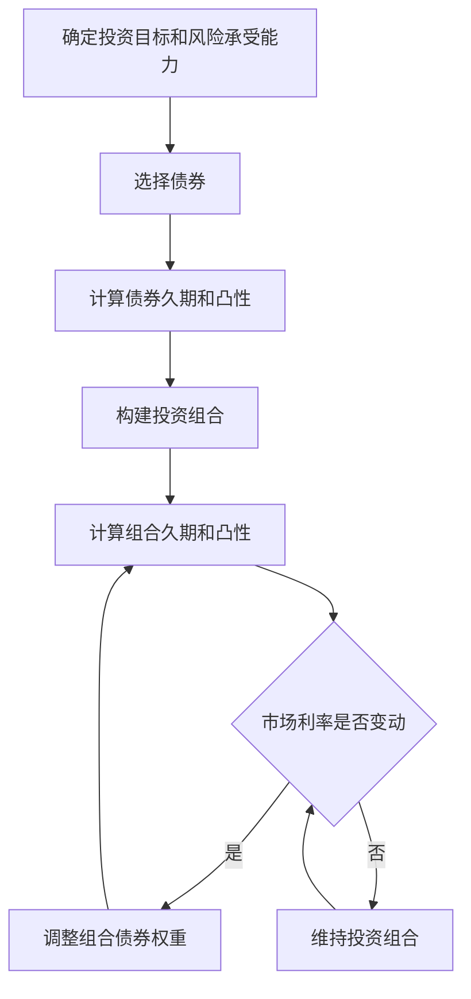

# 智能债券投资组合免疫策略

> 关键词：智能债券投资、投资组合、免疫策略、久期、凸性

> 摘要：本文围绕智能债券投资组合免疫策略展开，深入探讨了其核心概念、算法原理、数学模型等内容。首先介绍了该策略的背景，包括目的范围、预期读者等。接着详细阐述了核心概念及联系，通过文本示意图和 Mermaid 流程图进行说明。在核心算法原理部分，使用 Python 源代码进行详细阐述。同时给出了相关的数学模型和公式，并举例说明。通过项目实战，展示了代码的实际案例和详细解释。分析了该策略的实际应用场景，推荐了相关的工具和资源。最后总结了未来发展趋势与挑战，提供了常见问题解答和扩展阅读参考资料，旨在为投资者和相关研究人员提供全面深入的智能债券投资组合免疫策略的知识体系。

## 1. 背景介绍 
### 1.1 目的和范围
智能债券投资组合免疫策略的目的在于帮助投资者在债券投资过程中，降低利率波动对投资组合价值的影响，实现资产的保值增值。在债券市场中，利率的变动是不可避免的，而利率的波动会直接影响债券的价格和投资收益。免疫策略通过合理配置债券资产，使得投资组合对利率变动具有一定的免疫力，从而减少不确定性带来的风险。

本策略的范围涵盖了各种类型的债券，包括政府债券、企业债券、金融债券等。同时，适用于不同规模的投资组合，无论是个人投资者的小型投资组合，还是机构投资者的大型资产配置。

### 1.2 预期读者
本文的预期读者主要包括以下几类人群：
1. **投资者**：包括个人投资者和机构投资者，希望通过了解智能债券投资组合免疫策略，优化自己的债券投资组合，降低风险，提高收益。
2. **金融分析师**：对债券市场和投资策略有深入研究的专业人士，通过阅读本文可以进一步探讨和完善相关理论和实践。
3. **金融专业学生**：正在学习金融投资相关课程的学生，通过本文可以系统地学习智能债券投资组合免疫策略的知识，加深对债券投资的理解。
4. **技术开发者**：对金融科技领域感兴趣，希望将智能算法应用于债券投资策略开发的技术人员。

### 1.3 文档结构概述
本文将按照以下结构进行阐述：
1. **核心概念与联系**：介绍智能债券投资组合免疫策略的核心概念，包括久期、凸性等，并通过文本示意图和 Mermaid 流程图展示它们之间的联系。
2. **核心算法原理 & 具体操作步骤**：详细讲解实现智能债券投资组合免疫策略的核心算法原理，并使用 Python 源代码进行说明。
3. **数学模型和公式 & 详细讲解 & 举例说明**：给出相关的数学模型和公式，对其进行详细讲解，并通过具体例子说明其应用。
4. **项目实战：代码实际案例和详细解释说明**：通过实际的项目案例，展示智能债券投资组合免疫策略的代码实现和详细解释。
5. **实际应用场景**：分析智能债券投资组合免疫策略在不同场景下的应用。
6. **工具和资源推荐**：推荐学习和开发智能债券投资组合免疫策略相关的工具和资源。
7. **总结：未来发展趋势与挑战**：总结智能债券投资组合免疫策略的未来发展趋势和面临的挑战。
8. **附录：常见问题与解答**：提供常见问题的解答，帮助读者更好地理解和应用该策略。
9. **扩展阅读 & 参考资料**：列出相关的扩展阅读材料和参考资料，方便读者进一步深入学习。

### 1.4 术语表
#### 1.4.1 核心术语定义
1. **债券**：是发行人向投资者发行的一种债务凭证，发行人承诺在一定时期内支付利息，并在到期时偿还本金。
2. **投资组合**：是由多种资产组成的集合，投资者通过合理配置不同资产，实现风险和收益的平衡。
3. **免疫策略**：是一种投资策略，通过调整投资组合的结构，使得投资组合的价值对利率变动不敏感，从而降低利率风险。
4. **久期**：是衡量债券价格对利率变动敏感性的指标，它表示债券现金流的加权平均到期时间。
5. **凸性**：是对债券价格 - 收益率曲线弯曲程度的一种度量，它反映了债券价格对利率变动的非线性关系。

#### 1.4.2 相关概念解释
1. **利率风险**：是指由于市场利率变动而导致债券价格波动的风险。当市场利率上升时，债券价格下降；当市场利率下降时，债券价格上升。
2. **现金流**：是指债券在不同时间点产生的现金流入和流出，包括利息支付和本金偿还。
3. **收益率**：是指投资者投资债券所获得的收益与投资成本的比率，包括当期收益率、到期收益率等。

#### 1.4.3 缩略词列表
1. **DV01**：Dollar Value of an 01，即利率变动 0.01% 时债券价格的变动值。
2. **Macaulay Duration**：麦考利久期，是一种常见的久期计算方法。
3. **Modified Duration**：修正久期，是对麦考利久期的调整，更直观地反映债券价格对利率变动的敏感性。

## 2. 核心概念与联系 

### 核心概念原理
#### 久期
久期是衡量债券价格对利率变动敏感性的重要指标。麦考利久期（Macaulay Duration）的计算公式为：
$$D_{mac}=\frac{\sum_{t=1}^{n}t\times\frac{C}{(1 + y)^t}+n\times\frac{F}{(1 + y)^n}}{\sum_{t=1}^{n}\frac{C}{(1 + y)^t}+\frac{F}{(1 + y)^n}}$$
其中，$C$ 为债券每期支付的利息，$y$ 为债券的到期收益率，$F$ 为债券的面值，$n$ 为债券的剩余期限。

修正久期（Modified Duration）是在麦考利久期的基础上进行调整，其计算公式为：
$$D_{mod}=\frac{D_{mac}}{1 + y}$$
修正久期更直观地反映了债券价格对利率变动的百分比变化，即债券价格变动的近似公式为：
$$\frac{\Delta P}{P}\approx -D_{mod}\times\Delta y$$
其中，$\Delta P$ 为债券价格的变动，$P$ 为债券的当前价格，$\Delta y$ 为利率的变动。

#### 凸性
凸性是对债券价格 - 收益率曲线弯曲程度的度量。凸性的计算公式为：
$$C=\frac{1}{P(1 + y)^2}\sum_{t=1}^{n}\frac{t(t + 1)C}{(1 + y)^t}+\frac{n(n + 1)F}{(1 + y)^n}$$
考虑凸性后，债券价格变动的更精确公式为：
$$\frac{\Delta P}{P}\approx -D_{mod}\times\Delta y+\frac{1}{2}C\times(\Delta y)^2$$

### 架构的文本示意图
智能债券投资组合免疫策略的核心在于通过调整投资组合中债券的久期和凸性，使得投资组合的价值对利率变动具有一定的免疫力。具体来说，投资者需要根据自己的投资目标和风险承受能力，选择合适的债券进行组合，并计算组合的久期和凸性。当市场利率发生变动时，通过调整组合中债券的权重，使得组合的久期和凸性保持在合适的水平，从而降低利率风险。

### Mermaid 流程图


## 3. 核心算法原理 & 具体操作步骤 

### 核心算法原理
智能债券投资组合免疫策略的核心算法在于通过优化投资组合中债券的权重，使得组合的久期和凸性满足一定的条件。具体来说，我们可以使用线性规划或优化算法来求解最优的债券权重。

假设我们有 $n$ 种债券，第 $i$ 种债券的久期为 $D_i$，凸性为 $C_i$，权重为 $w_i$，投资组合的目标久期为 $D_{target}$，目标凸性为 $C_{target}$。则我们的优化目标可以表示为：
$$\min_{w_1,w_2,\cdots,w_n}\left| \sum_{i = 1}^{n}w_iD_i - D_{target} \right|+\left| \sum_{i = 1}^{n}w_iC_i - C_{target} \right|$$
约束条件为：
$$\sum_{i = 1}^{n}w_i = 1$$
$$w_i\geq0, i = 1,2,\cdots,n$$

### 具体操作步骤
1. **数据收集**：收集每种债券的基本信息，包括票面利率、到期收益率、剩余期限等，用于计算债券的久期和凸性。
2. **计算久期和凸性**：根据上述久期和凸性的计算公式，计算每种债券的久期和凸性。
3. **设定目标久期和凸性**：根据投资者的投资目标和风险承受能力，设定投资组合的目标久期和凸性。
4. **求解最优权重**：使用优化算法求解满足约束条件的最优债券权重。
5. **构建投资组合**：根据求解得到的最优权重，构建投资组合。
6. **监控和调整**：定期监控市场利率的变动，当利率变动较大时，重新计算组合的久期和凸性，并调整债券权重，以保持组合的免疫特性。

### Python 源代码实现
```python
import numpy as np
from scipy.optimize import minimize

# 定义债券类
class Bond:
    def __init__(self, face_value, coupon_rate, yield_to_maturity, years_to_maturity):
        self.face_value = face_value
        self.coupon_rate = coupon_rate
        self.yield_to_maturity = yield_to_maturity
        self.years_to_maturity = years_to_maturity

    def macaulay_duration(self):
        cash_flows = []
        for t in range(1, self.years_to_maturity + 1):
            if t < self.years_to_maturity:
                cash_flows.append(self.face_value * self.coupon_rate)
            else:
                cash_flows.append(self.face_value * (1 + self.coupon_rate))
        present_values = [cf / (1 + self.yield_to_maturity) ** t for t, cf in enumerate(cash_flows, 1)]
        weighted_times = [t * pv for t, pv in enumerate(present_values, 1)]
        return sum(weighted_times) / sum(present_values)

    def modified_duration(self):
        macaulay_dur = self.macaulay_duration()
        return macaulay_dur / (1 + self.yield_to_maturity)

    def convexity(self):
        cash_flows = []
        for t in range(1, self.years_to_maturity + 1):
            if t < self.years_to_maturity:
                cash_flows.append(self.face_value * self.coupon_rate)
            else:
                cash_flows.append(self.face_value * (1 + self.coupon_rate))
        present_values = [cf / (1 + self.yield_to_maturity) ** t for t, cf in enumerate(cash_flows, 1)]
        weighted_times = [t * (t + 1) * pv for t, pv in enumerate(present_values, 1)]
        price = sum(present_values)
        return sum(weighted_times) / (price * (1 + self.yield_to_maturity) ** 2)

# 定义优化目标函数
def objective(weights, durations, convexities, target_duration, target_convexity):
    portfolio_duration = np.dot(weights, durations)
    portfolio_convexity = np.dot(weights, convexities)
    return abs(portfolio_duration - target_duration) + abs(portfolio_convexity - target_convexity)

# 定义约束条件
def constraint(weights):
    return np.sum(weights) - 1

# 示例债券数据
bonds = [
    Bond(1000, 0.05, 0.06, 5),
    Bond(1000, 0.06, 0.07, 10),
    Bond(1000, 0.07, 0.08, 15)
]

# 计算每种债券的久期和凸性
durations = [bond.modified_duration() for bond in bonds]
convexities = [bond.convexity() for bond in bonds]

# 设定目标久期和凸性
target_duration = 7
target_convexity = 50

# 初始权重猜测
initial_weights = np.ones(len(bonds)) / len(bonds)

# 约束条件
cons = ({'type': 'eq', 'fun': constraint})

# 边界条件
bounds = [(0, 1) for _ in range(len(bonds))]

# 求解最优权重
result = minimize(objective, initial_weights, args=(durations, convexities, target_duration, target_convexity),
                  method='SLSQP', bounds=bounds, constraints=cons)

optimal_weights = result.x
print("最优权重:", optimal_weights)
```

## 4. 数学模型和公式 & 详细讲解 & 举例说明 

### 数学模型和公式
#### 久期相关公式
1. **麦考利久期**：
$$D_{mac}=\frac{\sum_{t=1}^{n}t\times\frac{C}{(1 + y)^t}+n\times\frac{F}{(1 + y)^n}}{\sum_{t=1}^{n}\frac{C}{(1 + y)^t}+\frac{F}{(1 + y)^n}}$$
2. **修正久期**：
$$D_{mod}=\frac{D_{mac}}{1 + y}$$
3. **债券价格变动近似公式（仅考虑久期）**：
$$\frac{\Delta P}{P}\approx -D_{mod}\times\Delta y$$

#### 凸性相关公式
1. **凸性计算公式**：
$$C=\frac{1}{P(1 + y)^2}\sum_{t=1}^{n}\frac{t(t + 1)C}{(1 + y)^t}+\frac{n(n + 1)F}{(1 + y)^n}$$
2. **债券价格变动更精确公式（考虑凸性）**：
$$\frac{\Delta P}{P}\approx -D_{mod}\times\Delta y+\frac{1}{2}C\times(\Delta y)^2$$

### 详细讲解
#### 久期
麦考利久期是债券现金流的加权平均到期时间，它考虑了债券在不同时间点的现金流和对应的时间权重。修正久期则是在麦考利久期的基础上，考虑了利率的影响，更直观地反映了债券价格对利率变动的百分比变化。

#### 凸性
凸性反映了债券价格 - 收益率曲线的弯曲程度。当利率变动较小时，仅考虑久期可以较好地近似债券价格的变动；但当利率变动较大时，凸性的影响就不能忽略。凸性为正表示债券价格 - 收益率曲线是凸向原点的，这意味着当利率下降时，债券价格上涨的幅度大于利率上升时债券价格下跌的幅度。

### 举例说明
假设我们有一只债券，面值为 $1000$ 元，票面利率为 $5\%$，到期收益率为 $6\%$，剩余期限为 $5$ 年。

1. **计算麦考利久期**：
每年利息支付 $C = 1000\times0.05 = 50$ 元。
$$\sum_{t=1}^{5}t\times\frac{50}{(1 + 0.06)^t}+5\times\frac{1000}{(1 + 0.06)^5}\approx 4.46\times1000$$
$$\sum_{t=1}^{5}\frac{50}{(1 + 0.06)^t}+\frac{1000}{(1 + 0.06)^5}\approx 957.88$$
$$D_{mac}=\frac{4.46\times1000}{957.88}\approx 4.66$$

2. **计算修正久期**：
$$D_{mod}=\frac{4.66}{1 + 0.06}\approx 4.4$$

3. **计算凸性**：
$$\sum_{t=1}^{5}\frac{t(t + 1)\times50}{(1 + 0.06)^t}+\frac{5\times(5 + 1)\times1000}{(1 + 0.06)^5}\approx 24.7\times1000$$
$$C=\frac{24.7\times1000}{957.88\times(1 + 0.06)^2}\approx 22.4$$

4. **假设利率上升 $1\%$，计算债券价格变动**
仅考虑久期：
$$\frac{\Delta P}{P}\approx -4.4\times0.01=-0.044$$
考虑凸性：
$$\frac{\Delta P}{P}\approx -4.4\times0.01+\frac{1}{2}\times22.4\times(0.01)^2=-0.0429$$

可以看到，考虑凸性后，债券价格变动的计算更加精确。

## 5. 项目实战：代码实际案例和详细解释说明 

### 5.1  开发环境搭建
#### 安装 Python
首先需要安装 Python 环境，建议使用 Python 3.7 及以上版本。可以从 Python 官方网站（https://www.python.org/downloads/） 下载适合自己操作系统的安装包，按照安装向导进行安装。

#### 安装必要的库
在本项目中，我们需要使用 `numpy` 和 `scipy` 库。可以使用以下命令进行安装：
```sh
pip install numpy scipy
```

### 5.2  源代码详细实现和代码解读
```python
import numpy as np
from scipy.optimize import minimize

# 定义债券类
class Bond:
    def __init__(self, face_value, coupon_rate, yield_to_maturity, years_to_maturity):
        self.face_value = face_value
        self.coupon_rate = coupon_rate
        self.yield_to_maturity = yield_to_maturity
        self.years_to_maturity = years_to_maturity

    def macaulay_duration(self):
        cash_flows = []
        for t in range(1, self.years_to_maturity + 1):
            if t < self.years_to_maturity:
                cash_flows.append(self.face_value * self.coupon_rate)
            else:
                cash_flows.append(self.face_value * (1 + self.coupon_rate))
        present_values = [cf / (1 + self.yield_to_maturity) ** t for t, cf in enumerate(cash_flows, 1)]
        weighted_times = [t * pv for t, pv in enumerate(present_values, 1)]
        return sum(weighted_times) / sum(present_values)

    def modified_duration(self):
        macaulay_dur = self.macaulay_duration()
        return macaulay_dur / (1 + self.yield_to_maturity)

    def convexity(self):
        cash_flows = []
        for t in range(1, self.years_to_maturity + 1):
            if t < self.years_to_maturity:
                cash_flows.append(self.face_value * self.coupon_rate)
            else:
                cash_flows.append(self.face_value * (1 + self.coupon_rate))
        present_values = [cf / (1 + self.yield_to_maturity) ** t for t, cf in enumerate(cash_flows, 1)]
        weighted_times = [t * (t + 1) * pv for t, pv in enumerate(present_values, 1)]
        price = sum(present_values)
        return sum(weighted_times) / (price * (1 + self.yield_to_maturity) ** 2)

# 定义优化目标函数
def objective(weights, durations, convexities, target_duration, target_convexity):
    portfolio_duration = np.dot(weights, durations)
    portfolio_convexity = np.dot(weights, convexities)
    return abs(portfolio_duration - target_duration) + abs(portfolio_convexity - target_convexity)

# 定义约束条件
def constraint(weights):
    return np.sum(weights) - 1

# 示例债券数据
bonds = [
    Bond(1000, 0.05, 0.06, 5),
    Bond(1000, 0.06, 0.07, 10),
    Bond(1000, 0.07, 0.08, 15)
]

# 计算每种债券的久期和凸性
durations = [bond.modified_duration() for bond in bonds]
convexities = [bond.convexity() for bond in bonds]

# 设定目标久期和凸性
target_duration = 7
target_convexity = 50

# 初始权重猜测
initial_weights = np.ones(len(bonds)) / len(bonds)

# 约束条件
cons = ({'type': 'eq', 'fun': constraint})

# 边界条件
bounds = [(0, 1) for _ in range(len(bonds))]

# 求解最优权重
result = minimize(objective, initial_weights, args=(durations, convexities, target_duration, target_convexity),
                  method='SLSQP', bounds=bounds, constraints=cons)

optimal_weights = result.x
print("最优权重:", optimal_weights)
```

### 5.3  代码解读与分析
#### 债券类（`Bond`）
- `__init__` 方法：初始化债券的基本信息，包括面值、票面利率、到期收益率和剩余期限。
- `macaulay_duration` 方法：计算债券的麦考利久期，通过计算债券现金流的加权平均到期时间得到。
- `modified_duration` 方法：计算债券的修正久期，在麦考利久期的基础上进行调整。
- `convexity` 方法：计算债券的凸性，反映债券价格 - 收益率曲线的弯曲程度。

#### 优化目标函数（`objective`）
该函数计算投资组合的久期和凸性与目标久期和凸性的差值的绝对值之和，作为优化的目标。我们希望这个差值越小越好，即投资组合的久期和凸性越接近目标值越好。

#### 约束条件（`constraint`）
该函数定义了投资组合权重的约束条件，即所有债券的权重之和必须等于 $1$，确保投资组合的总权重为 $100\%$。

#### 求解最优权重
使用 `scipy.optimize.minimize` 函数求解满足约束条件的最优债券权重。通过不断调整权重，使得目标函数的值最小化，从而得到最优的投资组合权重。

## 6. 实际应用场景 
### 个人投资者
对于个人投资者来说，智能债券投资组合免疫策略可以帮助他们在债券投资中降低利率风险。个人投资者通常资金规模较小，风险承受能力相对较低，通过免疫策略可以确保投资组合的价值相对稳定，实现资产的保值增值。例如，一位退休老人将自己的一部分积蓄投资于债券，他希望在获得一定收益的同时，尽量减少利率波动对投资的影响。此时，他可以使用智能债券投资组合免疫策略，根据自己的投资目标和风险承受能力，构建一个免疫的债券投资组合。

### 机构投资者
机构投资者，如保险公司、养老基金等，通常管理着大量的资金，对资产的安全性和稳定性要求较高。智能债券投资组合免疫策略可以帮助他们优化资产配置，降低利率风险，满足其长期的资金需求。例如，保险公司需要根据其保险业务的特点，合理配置债券资产，以确保在未来有足够的资金来支付保险赔款。通过免疫策略，保险公司可以构建一个与负债久期和凸性相匹配的债券投资组合，从而降低利率变动对资产负债表的影响。

### 金融机构
金融机构，如银行、证券公司等，在债券交易和投资管理中也可以应用智能债券投资组合免疫策略。银行可以使用该策略来管理其债券投资组合的利率风险，提高资产质量。证券公司可以为客户提供基于免疫策略的债券投资咨询服务，帮助客户优化投资组合。

## 7. 工具和资源推荐
### 7.1 学习资源推荐
#### 7.1.1 书籍推荐
1. 《债券市场：分析与策略》（*Bond Markets, Analysis, and Strategies*）：这本书是债券投资领域的经典教材，详细介绍了债券市场的基本原理、分析方法和投资策略，包括久期、凸性等概念的深入讲解。
2. 《投资学》（*Investments*）：涵盖了投资领域的各个方面，包括债券投资、股票投资、资产配置等，对智能债券投资组合免疫策略有相关的介绍和案例分析。
3. 《金融数学》（*Financial Mathematics*）：介绍了金融领域的数学模型和方法，对于理解债券投资中的久期、凸性等数学概念有很大的帮助。

#### 7.1.2 在线课程
1. Coursera 上的 “Financial Markets” 课程：由耶鲁大学教授 Robert Shiller 主讲，介绍了金融市场的基本原理和投资策略，包括债券市场的相关内容。
2. edX 上的 “Introduction to Financial Engineering and Risk Management” 课程：讲解了金融工程和风险管理的基本概念和方法，对于理解债券投资组合免疫策略的原理和应用有很大的帮助。

#### 7.1.3 技术博客和网站
1. Seeking Alpha：一个提供金融市场分析和投资建议的网站，有很多关于债券投资的文章和分析报告。
2. Bloomberg：全球知名的金融资讯平台，提供实时的债券市场数据和分析，对于跟踪债券市场动态和研究投资策略有很大的帮助。

### 7.2 开发工具框架推荐
#### 7.2.1 IDE和编辑器
1. PyCharm：一款功能强大的 Python 集成开发环境，提供代码编辑、调试、版本控制等功能，适合开发智能债券投资组合免疫策略的 Python 代码。
2. Jupyter Notebook：一种交互式的开发环境，适合进行数据分析和模型验证，方便展示代码和结果。

#### 7.2.2 调试和性能分析工具
1. pdb：Python 自带的调试工具，可以帮助开发者逐行调试代码，查找和解决问题。
2. cProfile：Python 内置的性能分析工具，可以分析代码的运行时间和性能瓶颈，帮助优化代码。

#### 7.2.3 相关框架和库
1. `numpy`：Python 中用于科学计算的基础库，提供了高效的数组操作和数学函数，在计算债券久期、凸性等方面有很大的帮助。
2. `scipy`：一个强大的科学计算库，提供了优化算法、插值、积分等功能，在求解投资组合最优权重时可以使用其优化算法。

### 7.3 相关论文著作推荐
#### 7.3.1 经典论文
1. “Duration-based Hedging Strategies with Stochastic Interest Rates”：该论文研究了在随机利率环境下基于久期的套期保值策略，对于理解债券投资组合免疫策略的理论基础有重要意义。
2. “Convexity and the Measurement of Bond Price Volatility”：详细阐述了凸性的概念和作用，以及如何在债券投资中应用凸性来降低利率风险。

#### 7.3.2 最新研究成果
1. “Machine Learning in Fixed Income Investing”：探讨了机器学习在固定收益投资中的应用，包括如何使用机器学习算法优化债券投资组合免疫策略。
2. “Risk Management of Bond Portfolios Using Advanced Mathematical Models”：介绍了使用先进数学模型进行债券投资组合风险管理的最新研究成果。

#### 7.3.3 应用案例分析
1. “Case Studies in Bond Portfolio Immunization”：通过实际案例分析，展示了债券投资组合免疫策略在不同场景下的应用和效果。
2. “Real-World Applications of Duration and Convexity in Bond Investing”：介绍了久期和凸性在实际债券投资中的应用案例，以及如何通过调整投资组合的久期和凸性来降低利率风险。

## 8. 总结：未来发展趋势与挑战
### 未来发展趋势
#### 智能化与自动化
随着人工智能和机器学习技术的不断发展，智能债券投资组合免疫策略将越来越智能化和自动化。未来，投资者可以使用智能算法自动分析市场数据，实时调整投资组合的权重，实现更加高效和精准的免疫策略。

#### 多资产融合
未来的债券投资组合免疫策略将不仅仅局限于债券资产，还将与其他资产，如股票、大宗商品等进行融合。通过多资产配置，可以进一步降低投资组合的风险，提高收益的稳定性。

#### 个性化定制
不同投资者的投资目标和风险承受能力各不相同，未来的智能债券投资组合免疫策略将更加注重个性化定制。投资者可以根据自己的需求，定制适合自己的免疫策略，实现更加个性化的投资管理。

### 挑战
#### 数据质量和准确性
智能债券投资组合免疫策略依赖于大量的市场数据和债券信息，数据的质量和准确性直接影响策略的效果。然而，市场数据往往存在噪声和误差，如何获取高质量、准确的数据是一个挑战。

#### 模型的复杂性和可靠性
随着策略的不断发展，模型的复杂性也在增加。复杂的模型虽然可以提高策略的准确性，但也增加了模型的不确定性和风险。如何确保模型的可靠性和稳定性是一个需要解决的问题。

#### 市场环境的不确定性
债券市场受到宏观经济、政策变化等多种因素的影响，市场环境具有很大的不确定性。如何在不确定的市场环境中，有效地应用智能债券投资组合免疫策略，降低利率风险，是一个长期的挑战。

## 9. 附录：常见问题与解答
### 1. 什么是债券投资组合免疫策略？
债券投资组合免疫策略是一种投资策略，通过调整投资组合的结构，使得投资组合的价值对利率变动不敏感，从而降低利率风险。具体来说，就是通过合理配置债券资产，使得投资组合的久期和凸性满足一定的条件，以实现对利率变动的免疫。

### 2. 久期和凸性有什么区别？
久期是衡量债券价格对利率变动敏感性的指标，它反映了债券现金流的加权平均到期时间。凸性则是对债券价格 - 收益率曲线弯曲程度的度量，它反映了债券价格对利率变动的非线性关系。久期可以用于近似计算债券价格的变动，但当利率变动较大时，凸性的影响就不能忽略。

### 3. 如何计算债券的久期和凸性？
债券的久期和凸性可以通过公式进行计算。麦考利久期的计算公式为：
$$D_{mac}=\frac{\sum_{t=1}^{n}t\times\frac{C}{(1 + y)^t}+n\times\frac{F}{(1 + y)^n}}{\sum_{t=1}^{n}\frac{C}{(1 + y)^t}+\frac{F}{(1 + y)^n}}$$
修正久期的计算公式为：
$$D_{mod}=\frac{D_{mac}}{1 + y}$$
凸性的计算公式为：
$$C=\frac{1}{P(1 + y)^2}\sum_{t=1}^{n}\frac{t(t + 1)C}{(1 + y)^t}+\frac{n(n + 1)F}{(1 + y)^n}$$
其中，$C$ 为债券每期支付的利息，$y$ 为债券的到期收益率，$F$ 为债券的面值，$n$ 为债券的剩余期限，$P$ 为债券的当前价格。

### 4. 智能债券投资组合免疫策略适用于所有投资者吗？
智能债券投资组合免疫策略适用于大多数投资者，但并不是适用于所有投资者。该策略主要适用于那些希望降低利率风险，实现资产保值增值的投资者。对于那些风险承受能力较高，追求高收益的投资者来说，可能更适合采用其他投资策略。

### 5. 如何选择适合自己的债券进行投资组合？
选择适合自己的债券进行投资组合需要考虑多个因素，包括投资目标、风险承受能力、市场环境等。一般来说，可以选择不同期限、不同信用等级的债券进行组合，以分散风险。同时，还需要关注债券的票面利率、到期收益率等指标，选择具有较高性价比的债券。

## 10. 扩展阅读 & 参考资料
### 扩展阅读
1. 《金融市场与金融机构》（*Financial Markets and Institutions*）：深入介绍了金融市场和金融机构的运作机制，对于理解债券市场的背景和环境有很大的帮助。
2. 《量化投资：策略与技术》（*Quantitative Investment: Strategies and Techniques*）：介绍了量化投资的基本概念和方法，包括如何使用量化模型进行债券投资组合管理。

### 参考资料
1. Fabozzi, F. J. (2012). *Bond Markets, Analysis, and Strategies*. Pearson.
2. Bodie, Z., Kane, A., & Marcus, A. J. (2017). *Investments*. McGraw-Hill Education.
3. Wilmott, P. (2007). *Financial Mathematics*. Cambridge University Press.

作者：AI天才研究院/AI Genius Institute & 禅与计算机程序设计艺术 /Zen And The Art of Computer Programming